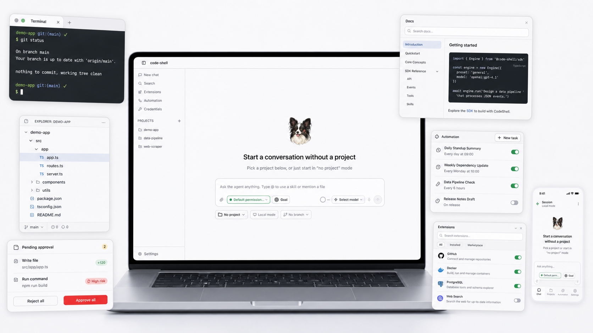
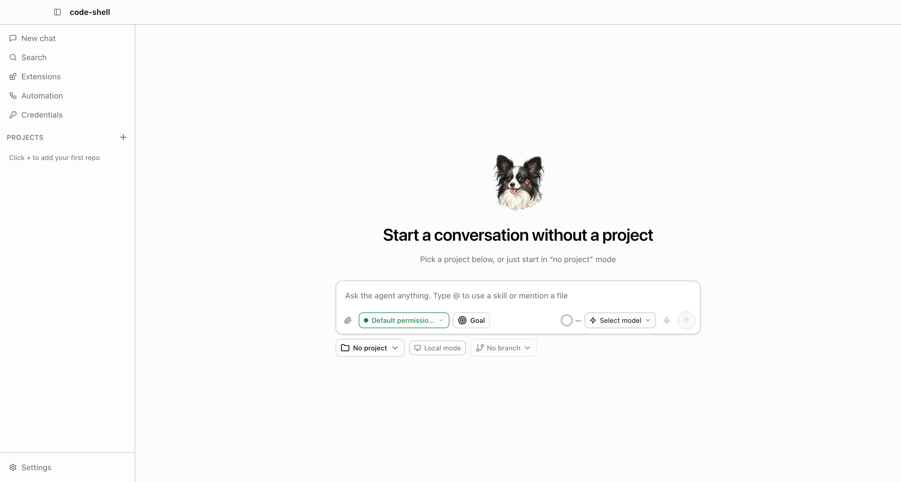
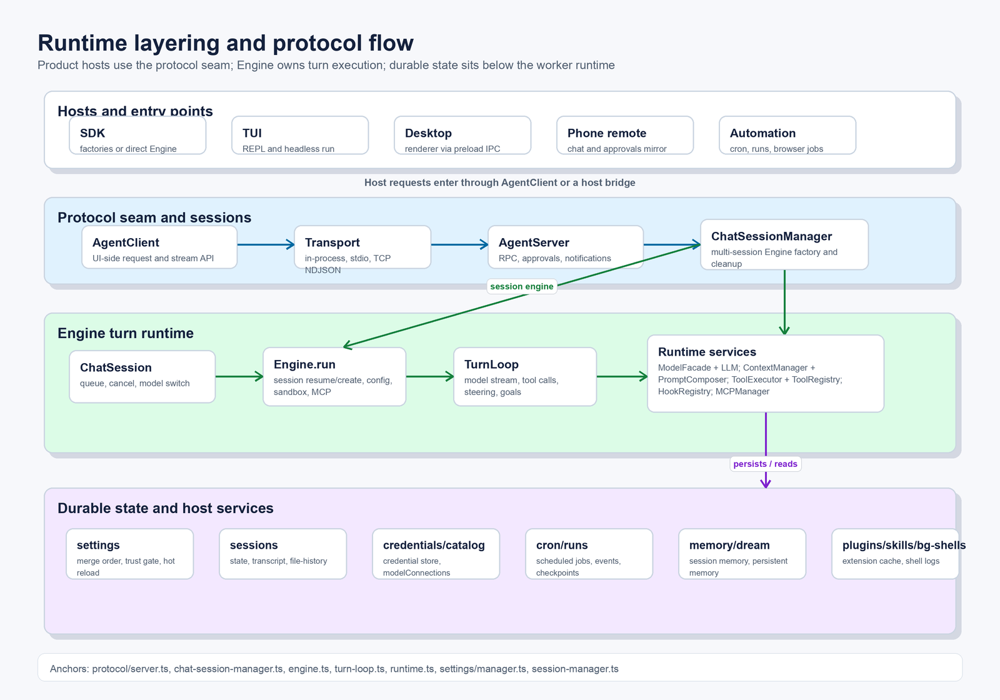

<p align="center">
  
</p>

# CodeShell

<p align="center">
  <a href="README.md">English</a> · <a href="README.zh-CN.md">简体中文</a>
</p>

<p align="center">
  <strong>A general-purpose AI agent orchestration framework — terminal, headless, and a full desktop app.</strong>
</p>

<p align="center">
  <a href="https://www.npmjs.com/package/%40cjhyy%2Fcode-shell"></a>
  <a href="LICENSE"></a>
  <a href="package.json">=20.10" /></a>
  <a href="tsconfig.json"></a>
  <a href=".github/workflows/release.yml"></a>
</p>

<p align="center">
  
</p>

CodeShell is one orchestration engine wearing three faces:

- a **terminal CLI** (`code-shell`) for interactive and headless agent runs,
- an **Electron desktop app** with chat, file/browser/terminal/diff panels, model & credential management, an extensions marketplace, automation, and a phone remote, and
- a **programmatic SDK** (`import { Engine } from "@cjhyy/code-shell"`) for embedding the engine in your own product.

The core is deliberately **domain-agnostic**. The turn loop, context management, permissions, MCP integration, hooks, tasks, cron, sub-agents, sessions, and memory all stay generic. Coding tools, git/worktree behavior, LSP, review, quota, and coding prompts live in the physically separate `@cjhyy/code-shell-capability-coding` package and are composed by the CLI/Desktop hosts. (See `packages/core/CONTRIBUTING.md`: "core only carries mechanism, not policy.")

> Status: **0.6.x, entering beta**. The desktop app is the headline product; the CLI and SDK share the same core engine.

---

## Why CodeShell

- **One engine, many products** — the same runtime drives coding, research, automation, browser tasks, and long-running workflows. Behavior is expressed as presets and tools, not forked codebases.
- **Terminal-first, headless-ready, desktop-complete** — run interactively in the terminal, fire one-shot headless jobs, or use the full visual desktop client.
- **Permission-aware by default** — high-impact actions (writes, shell, git) sit behind explicit approval flows with session/project scoping and a `bypass` mode for trusted contexts.
- **Extensible end-to-end** — presets, built-in tools, MCP servers, hooks, skills, plugins (CC- and Codex-format), sub-agents, and cron jobs are all first-class, with a desktop UI for discovering and installing them.
- **Local-first & private** — sessions, transcripts, credentials, and memory live under `~/.code-shell/`; credential files are written owner-only (`0o600`).

---

## Quick start

### CLI

```bash
# Default CLI preset: terminal coding assistant (interactive REPL)
npx @cjhyy/code-shell

# Run the same framework as a general orchestrator
npx @cjhyy/code-shell --preset general

# One-shot / headless execution
npx @cjhyy/code-shell run --preset general \
  "Create a long-running research plan and track it with tasks"
```

Requires **Node.js >= 20.10**.

### Desktop app

The desktop app (`packages/desktop`) is an Electron client. To run it from source:

```bash
bun install
bun run dev          # launches the desktop app in dev mode
```

It gives you chat with streaming output, a side-by-side file / browser / terminal / diff panel dock, model & credential management, an extensions marketplace, automation/cron scheduling, persistent goals, memory, and a phone remote — all driving the same core engine via per-session agent worker processes.

### Desktop preview

<p align="center">
  
</p>

---

## Features

### Core engine (`@cjhyy/code-shell-core`)

- Turn-based agent loop with streaming output and step-by-step lifecycle events
- Context compaction (tool-pair-preserving) and durable session persistence on disk
- Permission-gated tool execution with session/project rule caching and chained-command guards
- Hook pipeline (user + project + plugin hooks) and full MCP client integration
- First-class **tasks, sub-agents, cron, and sleep** for long-running and self-pacing workflows
- **Persistent goals** with a stop-hook judge and explicit `complete_goal` declaration
- **Memory + Dream**: per-turn memory injection plus an LLM consolidation pass
- **Unified model catalog**: text / image / video providers under one tag-based config, with per-model parameter definitions that drive both UI controls and tool descriptions
- Background shell jobs, cost tracking, and turn-level file undo/redo

### Presets

| Preset            | Purpose                                                        | Extra tools                                                              |
| ----------------- | -------------------------------------------------------------- | ------------------------------------------------------------------------ |
| `harness-min`     | Domain-neutral core default for embedding                      | Minimal filesystem, shell, MCP, memory, task and agent mechanisms        |
| `general`         | General orchestration, research, automation, long-running work | Core orchestration tools only                                            |
| `terminal-coding` | Terminal-native coding assistant                               | `EnterWorktree`, `ExitWorktree`, `NotebookEdit`, `LSP`, `Brief`, `Arena` |

Presets select the system prompt, the built-in tool set, and permission defaults. Configure via the SDK, the CLI `--preset` flag, or settings.

### Terminal UX (`@cjhyy/code-shell-tui`)

- Interactive REPL (Ink-based) with fullscreen/flow modes, vim-mode input, and input history
- Headless `run` mode for one-shot execution, plus `repl`, `sessions`, and `runs` subcommands
- Slash commands, `@`-mention file/skill search, command auto-complete, and in-REPL cron scheduling
- `Shift+Tab` permission-mode cycling, transcript browsing, session resume, and cost/usage reporting

### Desktop app (`@cjhyy/code-shell-desktop`)

- **Chat** with streaming, image attachments (upload/drag/paste), and a run-time steering/queue model (queue = non-interrupting step-gap insertion; "steer" = interrupt-and-resend)
- **Panel dock** alongside the conversation: read-only **Files** panel, **Browser** panel (CDP-driven, with selection-anchor sync), interactive **Terminal** (node-pty), and a **Diff/Review** panel
- **Model catalog & connections**: full CRUD over providers/models, credential reuse by company, and parameter docs surfaced into tool descriptions
- **Credentials**: API keys, browser-cookie login (with a dedicated login window for sites the embedded webview can't handle), multi-account cookie credentials, and permission token/link gates
- **Extensions**: plugin/skill/MCP management + a marketplace (installs CC- and Codex-format plugins, including from uploaded archives), a capability overview, and sub-agent (Agent role) management
- **Automation**: cron/scheduled tasks with read-only contract enforcement, per-task transcripts and memory, and a runs view for long tasks
- **Persistent goals**, **memory management** (pin/edit/clear, manual Dream), **hooks** configuration, and full **i18n** (Chinese / English)
- **Phone remote**: control a desktop session from a mobile web app over a local WebSocket
- Onboarding wizard, trust gate, app updater, command palette (⌘K), cross-project session search (⌘P), and in-transcript search (⌘F)

### Built-in tools

Core by itself defaults to the minimal `harness-min` preset. The CLI and Desktop
compose the coding capability package, whose host default is `terminal-coding`.
Runtime guards may hide tools that
need unavailable providers, credentials, cookies, or an active goal.

- **File / workspace**: `Read`, `Write`, `Edit`, `ApplyPatch`, `Glob`, `Grep`
- **Shell / execution**: `Bash`, `BashOutput`, `KillShell`, `ListShells`, `PowerShell`, `REPL`, `Sleep`
- **Web / media / browser**: `browser_observe`, `browser_act`, `browser_navigate`, `WebSearch`, `WebFetch`, `GenerateImage`, `GenerateVideo`
- **Planning / orchestration**: `AskUserQuestion`, `EnterPlanMode`, `ExitPlanMode`, `ToolSearch`, `TodoWrite`, `Agent`, `AgentCancel`, `DriveAgent`, `DriveClaudeCode`, `CheckQuota`
- **Automation / integration**: `CronCreate`, `CronDelete`, `CronList`, `Config`, `Skill`, `AddMarketplace`, `MCPTool`, `ListMcpResources`, `ReadMcpResource`, `EditModelCatalog`
- **Memory / credentials / goals**: `MemoryList`, `MemoryRead`, `MemorySave`, `MemoryDelete`, `UseCredential`, `InjectCredential`, `complete_goal`, `cancel_goal`
- **Terminal-coding preset extras**: `EnterWorktree`, `ExitWorktree`, `NotebookEdit`, `LSP`, `Brief`, `Arena`

---

## Programmatic API

The meta package re-exports the core engine, so legacy SDK imports keep working:

```ts
import { Engine } from "@cjhyy/code-shell";

const generalEngine = new Engine({
  llm: {
    provider: "openai",
    model: "gpt-4.1",
    apiKey: process.env.OPENAI_API_KEY,
  },
  preset: "general",
});

const codingEngine = new Engine({
  llm: {
    provider: "openai",
    model: "gpt-4.1",
    apiKey: process.env.OPENAI_API_KEY,
  },
  preset: "terminal-coding",
});
```

Everything is exported from the package root — `import { ... } from "@cjhyy/code-shell"` (or directly from `@cjhyy/code-shell-core`). There are no `/run`, `/arena`, or `/product` subpath entry points.

Runnable SDK examples live in [`examples/`](examples/) — each runs directly
with `bun run <file>` and supports `--dry-run` (scripted mock LLM) when no API
key is configured:

- [`examples/01-minimal-agent.ts`](examples/01-minimal-agent.ts) — one Engine, one run, streamed output
- [`examples/02-approval-flow.ts`](examples/02-approval-flow.ts) — a custom `ApprovalBackend` gating tool calls
- [`examples/03-in-process-transport.ts`](examples/03-in-process-transport.ts) — the recommended `createServer` / `createClient` factory pair

---

## Configuration

CLI preset selection:

```bash
npx @cjhyy/code-shell --preset general
npx @cjhyy/code-shell --preset terminal-coding
```

Settings-based configuration (`~/.code-shell/settings.json`, with project-level overrides):

```json
{
  "agent": {
    "preset": "general",
    "enabledBuiltinTools": ["LSP"],
    "disabledBuiltinTools": ["WebSearch"],
    "appendSystemPrompt": "Prefer long-horizon planning and keep task state updated."
  }
}
```

Supported `agent` settings: `preset`, `enabledBuiltinTools`, `disabledBuiltinTools`, `customSystemPrompt`, `appendSystemPrompt`.

### Fullscreen mode (TUI)

CodeShell's terminal UI defaults to **fullscreen** (alt-screen + ScrollBox) — the mode where window resize repaints cleanly. Flow mode can show duplicate content in scrollback after a resize because the terminal pushes the old viewport up before CodeShell can erase it.

Opt out at startup with `CODESHELL_FULLSCREEN=0|false|off`, or toggle at runtime with `/fullscreen off`. Flow mode lets the transcript flow into the terminal's native scrollback (useful if you prefer keeping shell history above CodeShell visible).

### Stream idle watchdog (on by default)

The OpenAI-compatible provider aborts any LLM stream idle for `CODESHELL_STREAM_IDLE_TIMEOUT_MS` ms (default `90000`) without a chunk, then retries via the existing `withRetry` policy, capped by `CODESHELL_STREAM_WATCHDOG_RETRIES` (default `2`). This bounds upstream hangs at ~90 s instead of indefinitely. Set `CODESHELL_ENABLE_STREAM_WATCHDOG=0` to opt out. User-initiated aborts (Esc / Ctrl+C) are never retried.

---

## Architecture

<p align="center">
  
</p>

At a high level, CodeShell routes CLI, headless, SDK, and desktop clients through the same engine runtime:

- **Preset resolution** selects the system prompt, built-in tools, and permission defaults.
- **Capability composition** lets products install their own tools, presets, prompt sections, file-history behavior, and session-workspace adapters without putting product policy in core.
- **TurnLoop** coordinates model streaming, context assembly, tool execution, and lifecycle events.
- **Tool system** hosts built-ins, MCP tools, permissions, hooks, and cancellation.
- **Session / run layers** persist transcripts, state, tasks, automation runs, and memories.

In the desktop app, the Electron main process acts as an IPC service layer: it does not run the Engine itself but spawns a per-session core agent worker, streams its stdout back to the renderer, and provides system capabilities (files, terminal, credentials, plugins, browser automation host, memory). The renderer is a thin client that talks to main only through `window.codeshell.*`.

Design principles:

- **Core first** — the orchestration engine stays domain-agnostic.
- **Capabilities over hardcoding** — coding behavior lives in a separate package composed at the host boundary.
- **Secure by default** — permission-gated actions and explicit approval flow; owner-only credential files.
- **Long-running ready** — tasks, cron, sleep, sub-agents, and persistent goals are first-class.

---

## Project structure

```text
packages/
├── core/      # Domain-agnostic engine, context, MCP, hooks, sessions, runs, memory
├── coding/    # Coding capability pack: tools, git/worktrees, LSP, review, prompt/presets
├── arena/     # Optional multi-model Arena capability
├── pet/       # Mimi behavior, DelegateWork, projection protocol, digital-human teams
├── server/    # Headless HTTP/WebSocket host, rooms, uploads, mobile remote
├── web/       # Browser-safe remote client state and SPA
├── tui/       # Terminal CLI, Ink-based UI, renderer, commands, approvals
├── desktop/   # Electron desktop client + agent worker bridge + mobile remote app
├── cdp/       # Environment-agnostic CDP browser-action layer (no Playwright)
└── chat/      # Standalone multi-channel chat gateway + optional CodeShell adapter

package.json   # @cjhyy/code-shell compatibility meta package

assets/       # README / product images (mascot, promo hero, Playwright desktop screenshots)

docs/
├── architecture/        # System architecture chapters + feature inventory (see architecture/README.md)
├── todo/                # Roadmap + forward-looking design docs (see todo/README.md)
└── archive/             # Superseded design docs, audits, and the prior architecture set

scripts/      # Build, release, and repo maintenance scripts
```

---

## Development

```bash
bun install
bun run build          # build core + coding capability + tui + chat + meta package
bun run typecheck      # root core + coding capability + tui + chat check
bun test               # core / tui test suites

# Desktop has its OWN typecheck and build (the root checks do NOT cover it):
cd packages/desktop
bun run typecheck
bun run build
```

> Current caveat: `bun run typecheck` at the repository root still reports pre-existing test-source typing diagnostics. The package builds and Desktop typecheck above are the clean gates for this change.

`bun run dev` launches the desktop app. For the TUI in dev: `bun run dev:tui`.

> The desktop renderer uses **shadcn/ui + Tailwind v4** (zinc theme) and imports no core code — it is a thin client over `window.codeshell.*`. See `packages/desktop/CLAUDE.md` for renderer conventions.

---

## Further reading

- [Plugin panels v1](docs/plugin-panels.md)
- [Video editor reference plugin](examples/plugins/video-editor/README.md)
- [Package boundaries & Pet split rationale](docs/architecture/12-package-boundaries-and-release-units.md)
- [Plugin parity matrix](docs/architecture/13-plugin-parity-and-video-editor.md)
- [Digital humans & Pet architecture](docs/architecture/14-digital-human-and-pet.md)
- [Architecture & feature inventory](docs/architecture/README.md)
- [Roadmap & TODO](docs/todo/README.md)
- [Prior architecture documentation set (archived, pending rewrite)](docs/archive/architecture/README.md)

---

## Acknowledgments

The `ApplyPatch` tool (`packages/coding/src/tools/apply-patch/`) is adapted from
[OpenAI Codex `codex-rs/apply-patch`](https://github.com/openai/codex/tree/main/codex-rs/apply-patch),
licensed under the Apache License 2.0. See `NOTICE.md` and `LICENSE-codex` in that directory
for details, including the intentional behavioral divergence where our applier rolls back
partial writes on failure.

## License

MIT — see [LICENSE](LICENSE).
