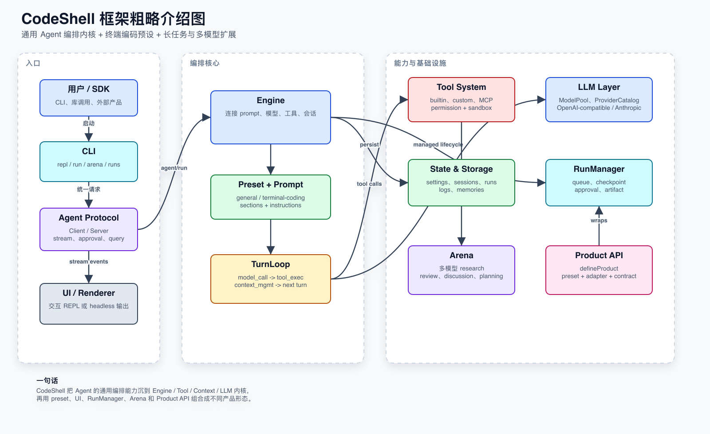

<p align="center">
  
</p>

# CodeShell

<p align="center">
  <strong>AI agent orchestration for terminal and headless workflows.</strong>
</p>

<p align="center">
  
</p>

CodeShell is a general-purpose AI agent orchestration framework with a terminal-native coding assistant built on top.

It ships with two built-in presets:

- `general`: a domain-agnostic orchestrator for research, automation, operations, and long-running tasks
- `terminal-coding`: a coding-focused terminal assistant using the same core engine

The core is not tied to software engineering. The turn loop, context management, permissions, MCP integration, hooks, tasks, cron, and sub-agents stay generic; coding behavior is expressed as a preset.

## Why CodeShell

- **One engine, multiple agent products**: use the same runtime for coding, research, automation, and product-specific workflows.
- **Terminal-first, headless-ready**: run interactively in the terminal or execute one-shot/headless jobs.
- **Permission-aware tool execution**: keep high-impact actions behind explicit approval flows.
- **Extensible by design**: presets, tools, MCP servers, hooks, skills, sub-agents, and cron jobs are first-class concepts.

## Features

### Core engine

- Turn-based agent loop with streaming output
- Context compaction and session persistence
- Permission-gated tool execution
- Hook pipeline and MCP integration
- Task tracking, sub-agents, sleep, and cron tools for long-running workflows

### Presets

- `general` for orchestration-heavy work
- `terminal-coding` for terminal-native code editing and code navigation
- Configurable prompt and built-in tool selection through settings or the programmatic API

### Terminal UX

- Interactive REPL built with Ink
- Headless `run` mode for one-shot execution
- Session resume and cost tracking

## Quick start

```bash
# Default CLI preset: terminal coding assistant
npx @cjhyy/code-shell

# Run the same framework as a general orchestrator
npx @cjhyy/code-shell --preset general

# One-shot execution with the general preset
npx @cjhyy/code-shell run --preset general "Create a long-running research plan and track it with tasks"
```

## Programmatic API

```ts
import { Engine } from "@cjhyy/code-shell";

const generalEngine = new Engine({
  llm: {
    provider: "openai",
    model: "gpt-4.1",
    apiKey: process.env.OPENAI_API_KEY,
  },
  preset: "general",
});

const codingEngine = new Engine({
  llm: {
    provider: "openai",
    model: "gpt-4.1",
    apiKey: process.env.OPENAI_API_KEY,
  },
  preset: "terminal-coding",
});
```

### Subpath imports

Pull only what you need:

```ts
import { RunManager, FileRunStore } from "@cjhyy/code-shell/run";
import { Arena, IterativeArena }     from "@cjhyy/code-shell/arena";
import { defineProduct }             from "@cjhyy/code-shell/product";
```

## Configuration

CLI preset selection:

```bash
npx @cjhyy/code-shell --preset general
npx @cjhyy/code-shell --preset terminal-coding
```

Settings-based configuration:

```json
{
  "agent": {
    "preset": "general",
    "enabledBuiltinTools": ["LSP"],
    "disabledBuiltinTools": ["WebSearch"],
    "appendSystemPrompt": "Prefer long-horizon planning and keep task state updated."
  }
}
```

Supported `agent` settings:

- `preset`
- `enabledBuiltinTools`
- `disabledBuiltinTools`
- `customSystemPrompt`
- `appendSystemPrompt`

### Fullscreen Mode

Codeshell defaults to **fullscreen** (alt-screen + ScrollBox). This is the
mode where window resize repaints cleanly — flow mode can show duplicate
content in the terminal's scrollback after a resize because the terminal
pushes the old viewport up before codeshell can erase it.

Opt out of fullscreen at startup with `CODESHELL_FULLSCREEN=0|false|off`,
or toggle at runtime with `/fullscreen off`. Flow mode lets the transcript
flow into the terminal's native scrollback (useful if you prefer keeping
shell history above codeshell visible).

### Stream Idle Watchdog (opt-in)

When `CODESHELL_ENABLE_STREAM_WATCHDOG=1`, the openai provider aborts any LLM
stream that has gone `CODESHELL_STREAM_IDLE_TIMEOUT_MS` ms (default `90000`)
without receiving a chunk. The engine then retries via the existing
`withRetry` policy, capped by `CODESHELL_STREAM_WATCHDOG_RETRIES` (default
`2`) attempts with exponential backoff.

This bounds upstream hangs at ~90 s instead of indefinitely. User-initiated
aborts (Esc / Ctrl+C) are never retried.

Disabled by default — set the flag explicitly to opt in.

## Built-in presets

| Preset | Purpose | Extra tools |
|------|------|------|
| `general` | General orchestration, research, automation, long-running work | Core orchestration tools only |
| `terminal-coding` | Terminal coding assistant | `EnterWorktree`, `ExitWorktree`, `NotebookEdit`, `LSP`, `Brief` |

## Built-in tools

The framework keeps a broad orchestration toolbox available, including:

- File tools: `Read`, `Write`, `Edit`, `Glob`, `Grep`
- Execution tools: `Bash`, `PowerShell`, `REPL`
- Coordination tools: `TaskCreate`, `TaskUpdate`, `TaskList`, `TaskGet`, `TaskOutput`, `Agent`, `SendMessage`, `Sleep`
- Planning/runtime tools: `EnterPlanMode`, `ExitPlanMode`, `CronCreate`, `CronDelete`, `CronList`
- Discovery/integration tools: `ToolSearch`, `Skill`, `MCPTool`, `ListMcpResources`, `ReadMcpResource`
- Coding-only preset extras: `EnterWorktree`, `ExitWorktree`, `NotebookEdit`, `LSP`

## Architecture

<p align="center">
  
</p>

At a high level, CodeShell routes CLI, headless, SDK, and desktop clients through the same engine runtime:

- **Preset resolution** selects the system prompt, built-in tools, and permission defaults.
- **TurnLoop** coordinates model streaming, context assembly, tool execution, and lifecycle events.
- **Tool system** hosts built-ins, MCP tools, permissions, hooks, and cancellation.
- **Session/run layers** persist transcripts, state, tasks, automation runs, and memories.

Design principles:

- Core first: orchestration engine stays domain-agnostic
- Presets over hardcoding: coding behavior lives in configuration
- Secure by default: permission-gated actions and explicit approval flow
- Long-running ready: tasks, cron, sleep, and sub-agents are first-class

## Further Reading

- [CodeShell architecture documentation set](docs/architecture/README.md)
- [CodeShell architecture diagrams](docs/architecture/10-architecture-diagrams.md)
- [TUI Render 能力规划](docs/architecture/11-render-tui-capability-plan.md)
- [mac 端可视化客户端调研](docs/architecture/12-mac-visual-client-research.md)
- [CodeShell 当前架构与定位说明](docs/codeshell-repo-architecture.md)

## Project structure

```text
packages/
├── core/             # Engine, context, tools, MCP, hooks, sessions, runs, presets
├── tui/              # Terminal CLI, Ink-style UI, renderer, commands, approvals
└── desktop/          # Electron desktop client and agent worker bridge

docs/
├── architecture/     # Current architecture reading path and diagrams
└── images/           # README and product documentation images

scripts/              # Build, release, and repo maintenance scripts
```

## Development

```bash
bun install
bun run build
bun run tsc --noEmit
```

`bun run tsc --noEmit` currently reports many pre-existing repo-wide issues outside the preset/framework changes, so treat typecheck as a global health signal rather than a clean gate for just this slice.

## Acknowledgments

The `ApplyPatch` tool (`src/tool-system/builtin/apply-patch/`) is adapted from
[OpenAI Codex `codex-rs/apply-patch`](https://github.com/openai/codex/tree/main/codex-rs/apply-patch),
licensed under the Apache License 2.0. See `NOTICE.md` and `LICENSE-codex` in
that directory for details, including the intentional behavioral divergence
where our applier rolls back partial writes on failure.
