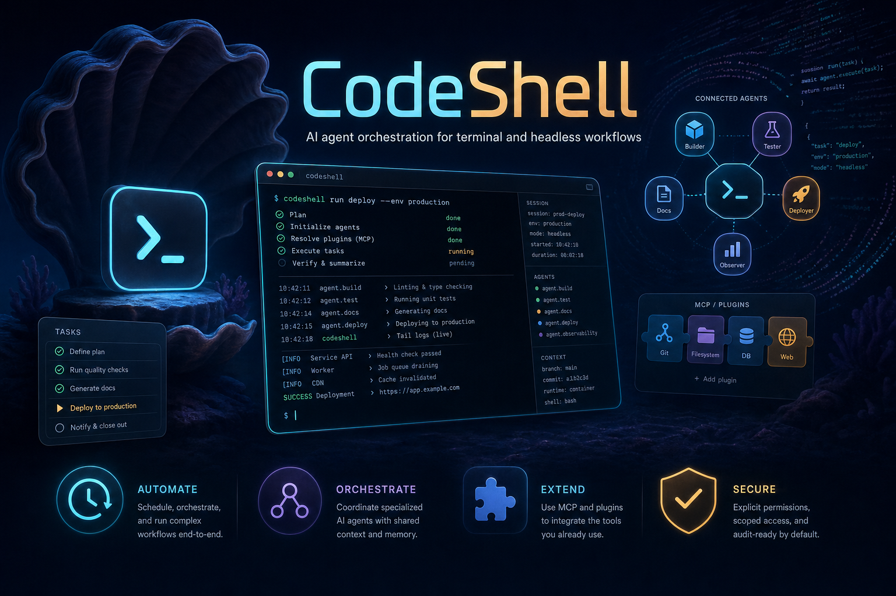

<p align="center">
  
</p>

# CodeShell

<p align="center">
  <strong>A general-purpose AI agent orchestration framework — terminal, headless, and a full desktop app.</strong>
</p>

<p align="center">
  
</p>

CodeShell is one orchestration engine wearing three faces:

- a **terminal CLI** (`code-shell`) for interactive and headless agent runs,
- an **Electron desktop app** with chat, file/browser/terminal/diff panels, model & credential management, an extensions marketplace, automation, and a phone remote, and
- a **programmatic SDK** (`import { Engine } from "@cjhyy/code-shell"`) for embedding the engine in your own product.

The core is deliberately **domain-agnostic**. The turn loop, context management, permissions, MCP integration, hooks, tasks, cron, sub-agents, sessions, and memory all stay generic; coding behavior is just a *preset* layered on top — not baked into the engine. (See `packages/core/CONTRIBUTING.md`: "core only carries mechanism, not policy.")

> Status: **0.5.0-rc.2**, preparing for beta. The desktop app is the headline product; the CLI and SDK share the same core engine.

---

## Why CodeShell

- **One engine, many products** — the same runtime drives coding, research, automation, browser tasks, and long-running workflows. Behavior is expressed as presets and tools, not forked codebases.
- **Terminal-first, headless-ready, desktop-complete** — run interactively in the terminal, fire one-shot headless jobs, or use the full visual desktop client.
- **Permission-aware by default** — high-impact actions (writes, shell, git) sit behind explicit approval flows with session/project scoping and a `bypass` mode for trusted contexts.
- **Extensible end-to-end** — presets, built-in tools, MCP servers, hooks, skills, plugins (CC- and Codex-format), sub-agents, and cron jobs are all first-class, with a desktop UI for discovering and installing them.
- **Local-first & private** — sessions, transcripts, credentials, and memory live under `~/.code-shell/`; credential files are written owner-only (`0o600`).

---

## Quick start

### CLI

```bash
# Default CLI preset: terminal coding assistant (interactive REPL)
npx @cjhyy/code-shell

# Run the same framework as a general orchestrator
npx @cjhyy/code-shell --preset general

# One-shot / headless execution
npx @cjhyy/code-shell run --preset general \
  "Create a long-running research plan and track it with tasks"
```

Requires **Node.js >= 20.10**.

### Desktop app

The desktop app (`packages/desktop`) is an Electron client. To run it from source:

```bash
bun install
bun run dev          # launches the desktop app in dev mode
```

It gives you chat with streaming output, a side-by-side file / browser / terminal / diff panel dock, model & credential management, an extensions marketplace, automation/cron scheduling, persistent goals, memory, and a phone remote — all driving the same core engine via per-session agent worker processes.

---

## Features

### Core engine (`@cjhyy/code-shell-core`)

- Turn-based agent loop with streaming output and step-by-step lifecycle events
- Context compaction (tool-pair-preserving) and durable session persistence on disk
- Permission-gated tool execution with session/project rule caching and chained-command guards
- Hook pipeline (user + project + plugin hooks) and full MCP client integration
- First-class **tasks, sub-agents, cron, and sleep** for long-running and self-pacing workflows
- **Persistent goals** with a stop-hook judge and explicit `complete_goal` declaration
- **Memory + Dream**: per-turn memory injection plus an LLM consolidation pass
- **Unified model catalog**: text / image / video providers under one tag-based config, with per-model parameter definitions that drive both UI controls and tool descriptions
- Background shell jobs, cost tracking, and turn-level file undo/redo

### Presets

| Preset | Purpose | Extra tools |
|--------|---------|-------------|
| `general` | General orchestration, research, automation, long-running work | Core orchestration tools only |
| `terminal-coding` | Terminal-native coding assistant | `EnterWorktree`, `ExitWorktree`, `NotebookEdit`, `LSP`, `Brief`, `Arena` |

Presets select the system prompt, the built-in tool set, and permission defaults. Configure via the SDK, the CLI `--preset` flag, or settings.

### Terminal UX (`@cjhyy/code-shell-tui`)

- Interactive REPL (Ink-based) with fullscreen/flow modes, vim-mode input, and input history
- Headless `run` mode for one-shot execution, plus `repl`, `sessions`, and `runs` subcommands
- Slash commands, `@`-mention file/skill search, command auto-complete, and in-REPL cron scheduling
- `Shift+Tab` permission-mode cycling, transcript browsing, session resume, and cost/usage reporting

### Desktop app (`@cjhyy/code-shell-desktop`)

- **Chat** with streaming, image attachments (upload/drag/paste), and a run-time steering/queue model (queue = non-interrupting step-gap insertion; "steer" = interrupt-and-resend)
- **Panel dock** alongside the conversation: read-only **Files** panel, **Browser** panel (CDP-driven, with selection-anchor sync), interactive **Terminal** (node-pty), and a **Diff/Review** panel
- **Model catalog & connections**: full CRUD over providers/models, credential reuse by company, and parameter docs surfaced into tool descriptions
- **Credentials**: API keys, browser-cookie login (with a dedicated login window for sites the embedded webview can't handle), multi-account cookie credentials, and permission token/link gates
- **Extensions**: plugin/skill/MCP management + a marketplace (installs CC- and Codex-format plugins, including from uploaded archives), a capability overview, and sub-agent (Agent role) management
- **Automation**: cron/scheduled tasks with read-only contract enforcement, per-task transcripts and memory, and a runs view for long tasks
- **Persistent goals**, **memory management** (pin/edit/clear, manual Dream), **hooks** configuration, and full **i18n** (Chinese / English)
- **Phone remote**: control a desktop session from a mobile web app over a local WebSocket
- Onboarding wizard, trust gate, app updater, command palette (⌘K), cross-project session search (⌘P), and in-transcript search (⌘F)

### Built-in tools

A broad orchestration toolbox is available across presets:

- **File**: `Read`, `Write`, `Edit`, `Glob`, `Grep`
- **Execution**: `Bash`, `PowerShell`, `REPL`
- **Coordination**: `TaskCreate`, `TaskUpdate`, `TaskList`, `TaskGet`, `TaskOutput`, `Agent`, `SendMessage`, `Sleep`
- **Planning / runtime**: `EnterPlanMode`, `ExitPlanMode`, `CronCreate`, `CronDelete`, `CronList`
- **Discovery / integration**: `ToolSearch`, `Skill`, `MCPTool`, `ListMcpResources`, `ReadMcpResource`
- **Generation**: `GenerateImage`, `GenerateVideo` (image/video providers via the unified catalog)
- **Coding preset extras**: `EnterWorktree`, `ExitWorktree`, `NotebookEdit`, `LSP`, `Brief`, `Arena`

---

## Programmatic API

The meta package re-exports the core engine, so legacy SDK imports keep working:

```ts
import { Engine } from "@cjhyy/code-shell";

const generalEngine = new Engine({
  llm: {
    provider: "openai",
    model: "gpt-4.1",
    apiKey: process.env.OPENAI_API_KEY,
  },
  preset: "general",
});

const codingEngine = new Engine({
  llm: {
    provider: "openai",
    model: "gpt-4.1",
    apiKey: process.env.OPENAI_API_KEY,
  },
  preset: "terminal-coding",
});
```

Everything is exported from the package root — `import { ... } from "@cjhyy/code-shell"` (or directly from `@cjhyy/code-shell-core`). There are no `/run`, `/arena`, or `/product` subpath entry points.

---

## Configuration

CLI preset selection:

```bash
npx @cjhyy/code-shell --preset general
npx @cjhyy/code-shell --preset terminal-coding
```

Settings-based configuration (`~/.code-shell/settings.json`, with project-level overrides):

```json
{
  "agent": {
    "preset": "general",
    "enabledBuiltinTools": ["LSP"],
    "disabledBuiltinTools": ["WebSearch"],
    "appendSystemPrompt": "Prefer long-horizon planning and keep task state updated."
  }
}
```

Supported `agent` settings: `preset`, `enabledBuiltinTools`, `disabledBuiltinTools`, `customSystemPrompt`, `appendSystemPrompt`.

### Fullscreen mode (TUI)

CodeShell's terminal UI defaults to **fullscreen** (alt-screen + ScrollBox) — the mode where window resize repaints cleanly. Flow mode can show duplicate content in scrollback after a resize because the terminal pushes the old viewport up before CodeShell can erase it.

Opt out at startup with `CODESHELL_FULLSCREEN=0|false|off`, or toggle at runtime with `/fullscreen off`. Flow mode lets the transcript flow into the terminal's native scrollback (useful if you prefer keeping shell history above CodeShell visible).

### Stream idle watchdog (opt-in)

When `CODESHELL_ENABLE_STREAM_WATCHDOG=1`, the openai provider aborts any LLM stream idle for `CODESHELL_STREAM_IDLE_TIMEOUT_MS` ms (default `90000`) without a chunk. The engine then retries via the existing `withRetry` policy, capped by `CODESHELL_STREAM_WATCHDOG_RETRIES` (default `2`). This bounds upstream hangs at ~90 s instead of indefinitely. User-initiated aborts (Esc / Ctrl+C) are never retried. Disabled by default.

---

## Architecture

<p align="center">
  
</p>

At a high level, CodeShell routes CLI, headless, SDK, and desktop clients through the same engine runtime:

- **Preset resolution** selects the system prompt, built-in tools, and permission defaults.
- **TurnLoop** coordinates model streaming, context assembly, tool execution, and lifecycle events.
- **Tool system** hosts built-ins, MCP tools, permissions, hooks, and cancellation.
- **Session / run layers** persist transcripts, state, tasks, automation runs, and memories.

In the desktop app, the Electron main process acts as an IPC service layer: it does not run the Engine itself but spawns a per-session core agent worker, streams its stdout back to the renderer, and provides system capabilities (files, terminal, credentials, plugins, browser automation host, memory). The renderer is a thin client that talks to main only through `window.codeshell.*`.

Design principles:

- **Core first** — the orchestration engine stays domain-agnostic.
- **Presets over hardcoding** — coding behavior lives in configuration.
- **Secure by default** — permission-gated actions and explicit approval flow; owner-only credential files.
- **Long-running ready** — tasks, cron, sleep, sub-agents, and persistent goals are first-class.

---

## Project structure

```text
packages/
├── core/      # Engine, context, tools, MCP, hooks, sessions, runs, presets, memory
├── tui/       # Terminal CLI, Ink-based UI, renderer, commands, approvals
├── desktop/   # Electron desktop client + agent worker bridge + mobile remote app
└── cdp/       # Environment-agnostic CDP browser-action layer (no Playwright)

assets/       # README / product images (mascot, hero)

docs/
├── todo/                # Roadmap + forward-looking design docs (see todo/README.md)
├── feature-inventory.md # Full inventory of desktop / tui capabilities (authority on current state)
└── archive/             # Superseded design docs, audits, and the prior architecture set

scripts/      # Build, release, and repo maintenance scripts
```

---

## Development

```bash
bun install
bun run build          # build core + tui + meta package
bun run typecheck      # core + tui (tsc --noEmit)
bun test               # core / tui test suites

# Desktop has its OWN typecheck and build (the root checks do NOT cover it):
cd packages/desktop
bunx tsc --noEmit
bun run build:renderer
```

`bun run dev` launches the desktop app. For the TUI in dev: `bun run dev:tui`.

> The desktop renderer uses **shadcn/ui + Tailwind v4** (zinc theme) and imports no core code — it is a thin client over `window.codeshell.*`. See `packages/desktop/CLAUDE.md` for renderer conventions.

---

## Further reading

- [Roadmap & TODO](docs/todo/README.md)
- [Feature inventory (desktop / tui)](docs/feature-inventory.md)
- [Prior architecture documentation set (archived, pending rewrite)](docs/archive/architecture/README.md)

---

## Acknowledgments

The `ApplyPatch` tool (`packages/core/src/tool-system/builtin/apply-patch/`) is adapted from
[OpenAI Codex `codex-rs/apply-patch`](https://github.com/openai/codex/tree/main/codex-rs/apply-patch),
licensed under the Apache License 2.0. See `NOTICE.md` and `LICENSE-codex` in that directory
for details, including the intentional behavioral divergence where our applier rolls back
partial writes on failure.

## License

MIT — see [LICENSE](LICENSE).
