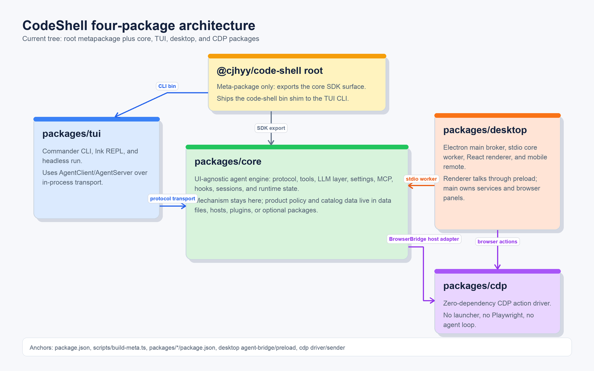

# 00 · CodeShell Architecture — Overview & Reading Path

> A source-accurate architecture of CodeShell, written against the current tree (commit `2e32726c`, 2026-07-06). This set supersedes the prior `docs/archive/architecture/` documents, which are kept for history but predate large subsystems (Codex orchestration, the unified model catalog, the phone remote, capability control). Each chapter is anchored to real `file:line` locations and intended to read on its own.

## What CodeShell is

CodeShell is **one agent-orchestration engine with three product surfaces and one browser-automation package boundary**:

- a terminal CLI (`code-shell`) - interactive REPL and headless `run`;
- an Electron **desktop app** - chat, file/browser/terminal/diff panels, model and credential management, an extensions marketplace, automation, persistent goals, memory, and a phone remote;
- a programmatic **SDK** - the root package still re-exports the core API for `import { Engine } from "@cjhyy/code-shell"` (`scripts/build-meta.ts:4`, `scripts/build-meta.ts:26`);
- a standalone **CDP package** - a zero-dependency browser action driver used by hosts that can supply a Chrome DevTools Protocol sender (`packages/cdp/src/index.ts:1`, `packages/cdp/src/sender.ts:1`).

The core is deliberately **domain-agnostic**: it carries the turn loop, context management, permissions, MCP, hooks, tools, protocol, sessions, runtime state, model plumbing, and memory mechanisms, while policy and catalog data are expected to live in data files, hosts, plugins, or optional packages (`packages/core/CONTRIBUTING.md:5`, `packages/core/CONTRIBUTING.md:26`). The current public version exported by core is `0.6.0-rc.8` (`packages/core/src/index.ts:7`).

## The four packages



```
packages/
├── core/      Engine, protocol, sessions, tools, MCP, hooks, settings, LLM, presets,
│              model catalog, plugins, skills, capabilities, credentials, memory,
│              runs, automation, Arena, and product-extension primitives
├── tui/       Commander CLI, Ink REPL, headless run, custom terminal renderer
├── desktop/   Electron main broker + stdio core worker + React renderer + mobile remote
└── cdp/       Environment-agnostic CDP browser-action layer; no Playwright/launcher
```

`@cjhyy/code-shell` at the repo root is a meta-package: its manifest exposes `dist/index.js` plus the `code-shell` binary (`package.json:2`, `package.json:14`), the root build runs `core -> tui -> build-meta` (`package.json:19`), and `scripts/build-meta.ts` writes a tiny core re-export plus a CLI shim into `dist/` (`scripts/build-meta.ts:1`, `scripts/build-meta.ts:26`, `scripts/build-meta.ts:30`).

- `packages/core/` publishes `@cjhyy/code-shell-core` and the stdio agent-server entrypoint (`packages/core/package.json:2`, `packages/core/package.json:13`). Its public barrel exports the Engine and config helpers, the protocol factory/client/server surface, sessions and memory, presets, context utilities, skill/capability/plugin APIs, Arena, run lifecycle APIs, and product-extension helpers (`packages/core/src/index.ts:57`, `packages/core/src/index.ts:109`, `packages/core/src/index.ts:139`, `packages/core/src/index.ts:166`, `packages/core/src/index.ts:217`, `packages/core/src/index.ts:266`, `packages/core/src/index.ts:354`, `packages/core/src/index.ts:410`).
- `packages/tui/` publishes the `code-shell` terminal binary (`packages/tui/package.json:17`). The CLI command tree lives in `packages/tui/src/cli/main.ts:40`; both headless `run` and interactive REPL use the same Engine -> AgentServer -> AgentClient path over an in-process transport (`packages/tui/src/cli/commands/run.ts:1`, `packages/tui/src/cli/commands/repl.ts:1`), and the Ink app consumes `AgentClient` rather than importing `Engine` directly (`packages/tui/src/ui/App.tsx:1`).
- `packages/desktop/` is the Electron host (`packages/desktop/package.json:7`). The main process is a broker (`packages/desktop/src/main/index.ts:1`), creates the BrowserWindow and preload bridge (`packages/desktop/src/main/index.ts:1132`, `packages/desktop/src/preload/index.ts:1`), spawns a core worker through `AgentBridge` (`packages/desktop/src/main/agent-bridge.ts:1`), and keeps renderer code in React (`packages/desktop/src/renderer/main.tsx:1`).
- `packages/cdp/` publishes `@cjhyy/code-shell-cdp` as a dependency-free CDP action layer (`packages/cdp/package.json:2`, `packages/cdp/package.json:4`). Its driver accepts an injected `CdpSender` and owns action primitives without importing Electron, React, or core (`packages/cdp/src/driver.ts:1`, `packages/cdp/src/sender.ts:1`, `packages/cdp/src/types.ts:1`). Desktop adapts core browser tools to this package in the browser-driver bridge (`packages/desktop/src/main/browser-driver/automation-host.ts:1`, `packages/desktop/src/main/browser-driver/cdp-driver.ts:1`).

## The layered picture


```
   SDK factories · TUI REPL/run · desktop renderer · phone remote · automation
                              │
                      AgentClient ⇄ Transport ⇄ AgentServer
                              │
                    ChatSessionManager / ChatSession
                              │
                           Engine.run
                              │
            preset + settings + prompt -> TurnLoop <- context manager
                              │
         model stream · tool execution · hooks · lifecycle StreamEvents
                              │
      ModelFacade/LLM · ToolExecutor+Registry · MCP · sandbox · runtime services
                              │
          settings · sessions · transcripts · runs · cron · memory · plugins
```

The protocol seam is the preferred host integration path, but not the only public construction path: core documents `createServer` / `createClient` over a transport as the stable, tested API while direct `new Engine(...)` remains available for advanced embedders (`packages/core/README.md:88`, `packages/core/src/protocol/factories.ts:1`). Product hosts use that seam today: TUI uses in-process transport, desktop uses a stdio worker, and the protocol package also includes TCP NDJSON transport for future remote hosts (`packages/tui/src/cli/commands/repl.ts:224`, `packages/desktop/src/main/agent-bridge.ts:1`, `packages/core/src/protocol/tcp-transport.ts:1`).

The current run path is:

1. UI or SDK code talks to `AgentClient` (`packages/core/src/protocol/client.ts:1`, `packages/core/src/protocol/client.ts:63`).
2. A transport delivers requests to `AgentServer`, which owns RPC dispatch, approvals, background notifications, and multi-session forwarding (`packages/core/src/protocol/server.ts:1`, `packages/core/src/protocol/server.ts:110`, `packages/core/src/protocol/server.ts:195`).
3. `ChatSessionManager` allocates or reuses a `ChatSession`, applies between-turn config changes, and cleans up sessions plus background shells on close (`packages/core/src/protocol/chat-session-manager.ts:34`, `packages/core/src/protocol/chat-session.ts:35`).
4. `Engine.run` resolves cwd/session state, settings, sandbox, MCP, prompts, tools, model facade, goal mode, and the `TurnLoop` (`packages/core/src/engine/engine.ts:929`, `packages/core/src/engine/engine.ts:1473`, `packages/core/src/engine/engine.ts:2015`, `packages/core/src/engine/turn-loop.ts:180`).

## The non-obvious load-bearing decisions

- **Product hosts use the protocol seam.** `AgentServer` wraps session management and approval plumbing, `AgentClient` is the UI-side API, and factory helpers wire them around a caller-supplied transport (`packages/core/src/protocol/factories.ts:86`, `packages/core/src/protocol/factories.ts:119`). Direct `Engine` construction is still supported, so architecture docs should not claim every caller is forced through protocol (`packages/core/README.md:90`).
- **The desktop main process is a broker, not the agent executor.** It creates windows and service IPC, then `AgentBridge` starts a Node/Electron subprocess running the core stdio server; the renderer sees typed `window.codeshell` APIs through preload rather than importing core (`packages/desktop/src/main/index.ts:1`, `packages/desktop/src/main/agent-bridge.ts:1`, `packages/desktop/src/preload/index.ts:1`).
- **Behavior is configuration.** Presets select prompt sections, builtin-tool whitelists, and default permission rules (`packages/core/src/preset/index.ts:1`, `packages/core/src/preset/index.ts:185`, `packages/core/src/preset/index.ts:210`). The engine combines those presets with settings-driven builtin enable/disable lists at construction time and refreshes selected runtime config at turn boundaries (`packages/core/src/engine/engine.ts:572`, `packages/core/src/engine/engine.ts:2676`).
- **The tool executor is the single choke point.** Disabled builtins, MCP allowlists, goal/plan-mode restrictions, schema validation, path policy, permission classification, and pre/post hooks all run through `ToolExecutor`; registry handlers normalize failures into tool results instead of throwing handler errors through the turn loop (`packages/core/src/tool-system/executor.ts:1`, `packages/core/src/tool-system/executor.ts:119`, `packages/core/src/tool-system/executor.ts:302`, `packages/core/src/tool-system/executor.ts:433`, `packages/core/src/tool-system/registry.ts:85`, `packages/core/src/tool-system/registry.ts:170`).
- **Provider divergence is data, not adapter branching.** The built-in model catalog and user catalog are merged, model connections are projected into `ModelPool` entries, and provider/model quirks live in capability rules rather than per-client `switch` blocks (`packages/core/src/model-catalog/index.ts:1`, `packages/core/src/model-catalog/index.ts:24`, `packages/core/src/model-catalog/builtin.ts:17`, `packages/core/src/engine/model-connections-pool.ts:1`, `packages/core/src/llm/capabilities/rules.ts:1`).
- **Long-running work is explicit state plus notifications.** Runs and cron have durable stores, persistent goals live in session state, background shells keep bounded output and orphan cleanup, and `AgentServer` forwards completion notifications so idle sessions can be woken when needed (`packages/core/src/run/RunManager.ts:1`, `packages/core/src/run/FileRunStore.ts:1`, `packages/core/src/automation/store.ts:1`, `packages/core/src/session/session-manager.ts:193`, `packages/core/src/runtime/background-shell.ts:1`, `packages/core/src/protocol/server.ts:195`).
- **Shared worker resources are separated from per-session mutation.** `EngineRuntime` holds shared model/tool/settings/MCP/cost/sandbox resources for a worker, while mutable turn state stays on `Engine` and `ChatSession` (`packages/core/src/engine/runtime.ts:24`, `packages/core/src/engine/runtime.ts:53`, `packages/core/src/engine/runtime.ts:96`).

## Reading path

| # | Chapter | Read it for |
|---|---------|-------------|
| 01 | [Engine & turn loop](01-engine-and-turn-loop.md) | How `Engine.run` drives a turn; context compaction; steering; goal ceilings; invariants |
| 02 | [Tool system](02-tool-system.md) | Registry -> executor -> permission/path/sandbox/MCP; the builtin tools; the two-place gotcha |
| 03 | [LLM & model layer](03-llm-and-model-layer.md) | Tag -> catalog -> provider client; capabilities RULES; reasoning/params; streaming & cost |
| 04 | [Protocol & sessions](04-protocol-and-sessions.md) | The RPC seam, transports, the run path; transcripts, undo, disk recovery |
| 05 | [Presets, prompt, hooks, skills](05-presets-prompt-hooks-skills.md) | How behavior is configured; prompt assembly & cache breakpoint; hook chain; skills |
| 06 | [Long-running orchestration](06-long-running-orchestration.md) | RunManager state machine; cron & the read-only contract; persistent goals |
| 07 | [Plugins, capabilities, credentials, memory](07-plugins-capabilities-credentials-memory.md) | Plugin install; capability projection; credential store; memory + Dream |
| 08 | [Arena & integrations](08-arena-and-integrations.md) | Multi-model Arena; external CLI orchestration; STT; review |
| 09 | [TUI package](09-tui.md) | The `code-shell` terminal client, the Ink REPL, the custom terminal renderer |
| 10 | [Desktop & mobile](10-desktop-and-mobile.md) | The desktop broker/worker/renderer split, main services, panels, phone remote, CDP |

## Cross-cutting: settings, onboarding, disk layout

These underpin every chapter and live mostly in `packages/core/src/settings/`, `packages/core/src/onboarding.ts`, `packages/core/src/session/`, `packages/core/src/runtime/`, and host services.

**Settings and trust.** Settings merge through managed, user, project, local, and flag layers, with `SettingsScope` choosing whether user-level `~/.code-shell` config is visible (`packages/core/src/settings/manager.ts:1`, `packages/core/src/settings/manager.ts:102`, `packages/core/src/settings/manager.ts:144`). Project settings are trust-gated for dangerous fields, and YAML/TOML-style config support is parsed through the settings manager rather than bespoke readers (`packages/core/src/settings/manager.ts:78`, `packages/core/src/settings/manager.ts:194`, `packages/core/src/settings/manager.ts:459`). The `agent.*` block feeds presets, tool lists, and personalization into engine config (`packages/core/src/settings/schema.ts:39`, `packages/core/src/settings/personalization.ts:1`).

**Capabilities.** `capabilityOverrides` is the project-level tri-state overlay for skills, plugins, agents, MCP servers, builtins, and plugin hooks (`packages/core/src/settings/schema.ts:7`). Effective disabled lists are computed in one place so project-level "on" can override a global "off", including the special no-repo whitelist inversion (`packages/core/src/capability-control/disabled-lists.ts:1`).

**Models and onboarding.** Unified model config is `credentials[]` + `modelConnections[]` + `defaults.*` (`packages/core/src/settings/schema.ts:137`, `packages/core/src/settings/schema.ts:150`). First-run helpers detect sanitized environment keys, infer providers, validate keys optimistically, and append onboarding results into the same unified settings shape (`packages/core/src/onboarding.ts:90`, `packages/core/src/onboarding.ts:118`, `packages/core/src/onboarding.ts:143`, `packages/core/src/onboarding.ts:336`). `refreshRuntimeConfig` and `diskDefaultsFrom` are the hot-reload seams, but builtin-tool-set changes still require a fresh session because the registry is constructed from the effective tool set (`packages/core/src/settings/disk-defaults.ts:7`, `packages/core/src/engine/engine.ts:2676`).

**Runtime and process safety.** Subprocesses use a shared spawn layer with environment allow/deny lists and guarded process-group killing (`packages/core/src/runtime/spawn-common.ts:36`, `packages/core/src/runtime/spawn-common.ts:303`). Background shells are session-scoped, detached, bounded by `RingFile`, and mirrored to disk best-effort (`packages/core/src/runtime/background-shell.ts:1`, `packages/core/src/runtime/background-shell.ts:139`, `packages/core/src/runtime/ring-file.ts:1`).

**Default disk layout.** Normal user-facing state is under `~/.code-shell`, though individual subsystems differ in which override seam they honor (`CODE_SHELL_HOME`, `HOME`, or direct `homedir()`):

```
settings.json · settings.managed.json · credentials.json
model-catalog.user.json · cron.json · auto-dream-state.json
sessions/<id>/{state.json, transcript.jsonl, file-history/}
runs/<id>/{run.json, events.jsonl, checkpoints/, approvals/, artifacts/}
memory/{user,dream,pending}/ · projects/<hash>/memory/ · memory-trash/
plugins/ · bg-shells/ · cache/models/
```

The important anchors are: sessions resolve `CODE_SHELL_HOME || ~/.code-shell` and write `state.json` plus `transcript.jsonl` atomically (`packages/core/src/session/session-manager.ts:68`, `packages/core/src/session/session-manager.ts:94`, `packages/core/src/session/session-manager.ts:288`); transcripts are JSONL event logs (`packages/core/src/session/transcript.ts:1`); file-history snapshots live under a session (`packages/core/src/session/file-history.ts:1`); credentials store token/link secrets with disk-boundary encryption and owner-only writes (`packages/core/src/credentials/store.ts:29`, `packages/core/src/credentials/store.ts:92`); memory resolves `CODE_SHELL_HOME` before `~/.code-shell` and separates `user`, `dream`, and `pending` scopes (`packages/core/src/session/memory.ts:1`, `packages/core/src/session/memory.ts:112`); cron and runs have their own filesystem stores (`packages/core/src/automation/store.ts:1`, `packages/core/src/run/FileRunStore.ts:1`); plugins root at `~/.code-shell/plugins` (`packages/core/src/plugins/installer/paths.ts:19`); auto-dream state uses the memory base dir (`packages/core/src/services/auto-dream.ts:36`).

## Primary source anchors

- Public API surface: `packages/core/src/index.ts:57`
- Engine facade / turn loop: `packages/core/src/engine/engine.ts:929`, `packages/core/src/engine/turn-loop.ts:180`
- Protocol and sessions: `packages/core/src/protocol/server.ts:110`, `packages/core/src/protocol/client.ts:63`, `packages/core/src/protocol/chat-session-manager.ts:34`
- Tool registry/executor: `packages/core/src/tool-system/registry.ts:1`, `packages/core/src/tool-system/executor.ts:1`, `packages/core/src/tool-system/context.ts:1`, `packages/core/src/tool-system/builtin/index.ts:105`
- Presets, prompt, and behavior defaults: `packages/core/src/preset/index.ts:1`
- Settings/model/capability layer: `packages/core/src/settings/schema.ts:7`, `packages/core/src/settings/manager.ts:102`, `packages/core/src/model-catalog/index.ts:1`
- TUI entrypoints: `packages/tui/src/cli/main.ts:40`, `packages/tui/src/cli/commands/run.ts:1`, `packages/tui/src/cli/commands/repl.ts:1`
- Desktop main / preload / worker spawn: `packages/desktop/src/main/index.ts:1`, `packages/desktop/src/main/agent-bridge.ts:1`, `packages/desktop/src/preload/index.ts:1`
- CDP browser layer: `packages/cdp/src/index.ts:1`, `packages/cdp/src/driver.ts:1`, `packages/cdp/src/sender.ts:1`

## A note on accuracy

This chapter was refreshed by reading the current source tree, not the archived docs. `file:line` anchors are accurate as of commit `2e32726c`; line numbers drift as code moves, so treat them as exact for this snapshot and re-check symbols before relying on them in a later tree.
