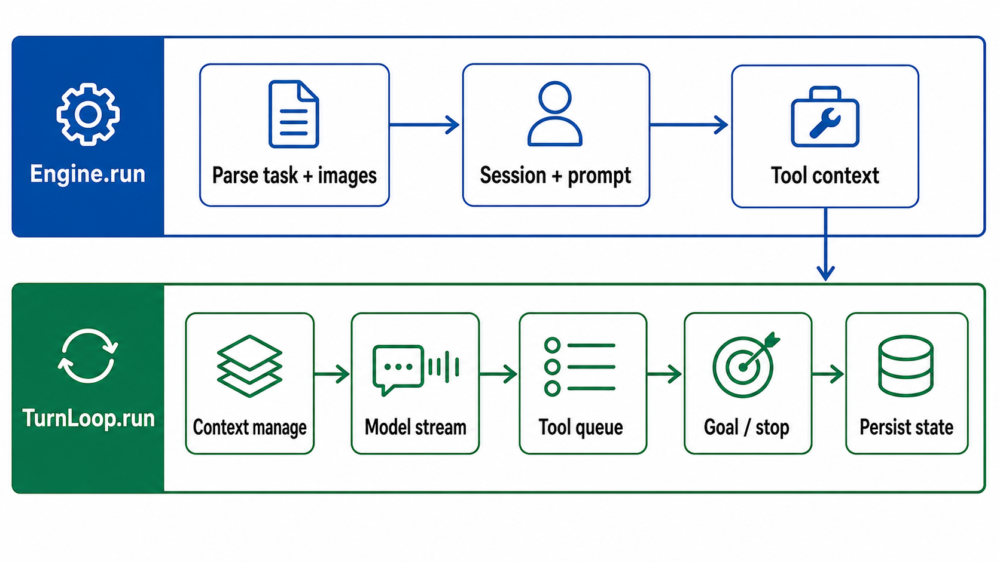
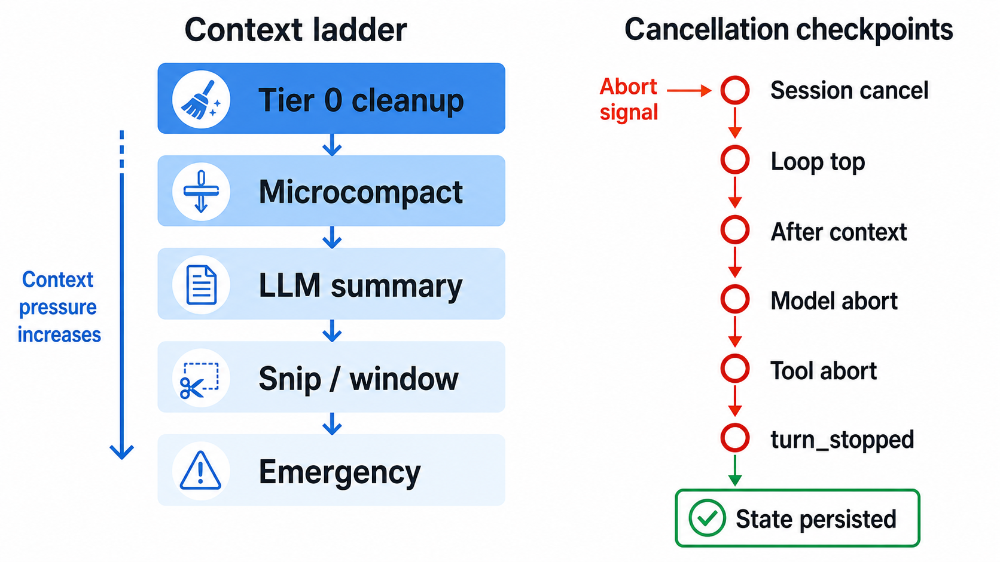

# 01 · Engine & Turn Loop

> The heart of CodeShell. Everything else — tools, sessions, models, presets, hooks, and context management — exists to feed or be driven by the turn loop. Source-mapped against the current tree under `packages/core/src/engine/`, `packages/core/src/context/`, and the adjacent session/protocol seams.



## 1. What this layer is

The engine layer is the **orchestration facade** that wires an LLM client, the tool executor, context management, hooks, persistent sessions, cancellation, and lifecycle events into one multi-turn agent run. It is deliberately domain-agnostic: it knows how to *run an agent*, not how to *write code* (that behavior comes from presets and prompt sections — see [05](05-presets-prompt-hooks-skills.md)).

Two files carry most of the weight:

| File | Role | ~LOC |
|------|------|------|
| `packages/core/src/engine/engine.ts` | `Engine` facade — run setup, session lifecycle, image policy, permission mode, prompt/tool assembly, persistent goals, sub-agent spawning, force compaction | ~3,476 |
| `packages/core/src/engine/turn-loop.ts` | `TurnLoop` state machine — model streaming, context management, tool execution, goal arbitration, cancellation, termination | ~1,408 |

Supporting modules:

| File | Role |
|------|------|
| `engine/model-facade.ts` | Wraps the concrete `LLMClient`: request/response logging, stream relay, transcript recording, token accounting (`packages/core/src/engine/model-facade.ts:37`) |
| `engine/query.ts` | Async-generator query API that constructs a `TurnLoop` and drains its event queue (`packages/core/src/engine/query.ts:91`) |
| `engine/runtime.ts` | `EngineRuntime` — shared worker resources such as `ModelPool`, `ToolRegistry`, MCP pool, and sandbox cache (`packages/core/src/engine/runtime.ts:28`) |
| `engine/goal.ts` | Normalized goal shape, default ceilings, budget tracker, and mid-run extension math (`packages/core/src/engine/goal.ts:14`, `packages/core/src/engine/goal.ts:237`) |
| `engine/steer-queue.ts` | Pure helpers for non-interrupting step-gap user-message insertion (`packages/core/src/engine/engine.ts:830`, `packages/core/src/engine/turn-loop.ts:1333`) |
| `engine/streaming-tool-queue.ts` | Starts concurrency-safe tools immediately and drains unsafe tools sequentially, returning results in original order (`packages/core/src/engine/streaming-tool-queue.ts:17`) |
| `engine/parse-task.ts` | Extracts `<codeshell-image>` blocks from the raw task string (`packages/core/src/engine/parse-task.ts:124`) |
| `engine/image-policy.ts` | Engine-side image caps, oversized-image dropping, and attachment path extraction (`packages/core/src/engine/image-policy.ts:58`, `packages/core/src/engine/image-policy.ts:198`) |
| `engine/patch-orphaned-tools.ts` | Resume / failure repair for dangling `tool_use` blocks (`packages/core/src/engine/engine.ts:1396`, `packages/core/src/engine/turn-loop.ts:1354`) |

## 2. The run, end to end

`Engine.run(task, options?) -> EngineResult` starts at `packages/core/src/engine/engine.ts:929`. It resolves the run boundary, then delegates the hot loop to `TurnLoop.run()` at `packages/core/src/engine/engine.ts:2127`.

### Stage 1 — Validate and parse input

- **Resolve cwd** by precedence: `options.cwd > resumed session state.cwd > config.cwd > process.cwd()`. The cheap session-cwd probe is `SessionManager.readCwd()` (`packages/core/src/session/session-manager.ts:177`), and `Engine.run()` applies the precedence at `packages/core/src/engine/engine.ts:961`.
- **Parse inline images before noise detection.** `parseTaskWithImages()` removes `<codeshell-image ...>data:...;base64,...</codeshell-image>` blocks, keeps images in source order, and throws `ImageParseError` on malformed markup (`packages/core/src/engine/parse-task.ts:109`). `Engine.run()` catches that and returns `reason: "image_error"` without starting a session (`packages/core/src/engine/engine.ts:1009`).
- **Fail fast on non-vision models.** If parsed images exist, `capabilitiesFor()` must report `supportsVision`; otherwise the turn is refused with an image error (`packages/core/src/engine/engine.ts:1023`).
- **Apply image policy.** The shared limits are 2 MB per image, 6 MB per turn, and 6 images per turn (`packages/core/src/engine/image-policy.ts:58`). A single oversize image is first compressed (`packages/core/src/engine/engine.ts:1049`), then still-oversize images are dropped with a textual placeholder so they do not poison history (`packages/core/src/engine/engine.ts:1066`). Count and cumulative-size failures remain fail-closed (`packages/core/src/engine/engine.ts:1086`).
- **Run pasted-noise detection on text only.** After image extraction, `taskText` excludes base64 bytes (`packages/core/src/engine/engine.ts:1106`) and may be rejected as accidental terminal output (`packages/core/src/engine/engine.ts:1112`).

### Stage 2 — Build run-scoped services

- **Tool context and sub-agent spawner.** `subAgentSpawner` anchors a child session in the parent transcript, strips nested-agent tools, resolves child model/tool scope, and starts a child `Engine` with inherited runtime knobs (`packages/core/src/engine/engine.ts:1131`). The per-run `ToolContext` carries cwd, sandbox, stream callback, session id, browser/credential bridges, agent definitions, and later tool visibility (`packages/core/src/engine/engine.ts:1300`).
- **Sandbox and permission setup.** Engine resolves `config.sandbox > project settings > global settings > default`, then caches/probes a sandbox backend (`packages/core/src/engine/engine.ts:1249`). It builds a `PermissionClassifier` and approval backend from the active permission mode (`packages/core/src/engine/engine.ts:1579`, `packages/core/src/engine/engine.ts:2924`).
- **Tool executor.** `ToolExecutor` receives the run signal and tool context (`packages/core/src/engine/engine.ts:1613`). Its own per-call fast path returns immediately on an already-aborted signal before hooks, permission, or the handler run (`packages/core/src/tool-system/executor.ts:119`).
- **Context manager.** The run creates a `ContextManager` with the model's current context window and clamped user ratios (`packages/core/src/engine/engine.ts:1617`, `packages/core/src/engine/engine.ts:451`).
- **Prompt and tool list.** The available tool list is assembled fresh for the run: project builtin overrides, MCP server visibility, tool guards, feature flags, dynamic `Agent` schema, and plan-mode filtering all apply before the system prompt is built (`packages/core/src/engine/engine.ts:1693`, `packages/core/src/engine/engine.ts:1728`, `packages/core/src/engine/engine.ts:1747`, `packages/core/src/engine/engine.ts:1772`). `PromptComposer` then builds a stable system prompt and a trailing dynamic context message in parallel with LLM client creation (`packages/core/src/engine/engine.ts:1776`).

### Stage 3 — Session, transcript, and prompt shape

- **Create or resume session.** Existing `options.sessionId` resumes from disk; a fresh caller-supplied id is materialized; otherwise `SessionManager.create()` generates one (`packages/core/src/engine/engine.ts:1370`, `packages/core/src/session/session-manager.ts:94`). `SessionManager.resume()` reads `state.json`, loads the transcript JSONL, marks the state active in memory, and normalizes cumulative usage counters (`packages/core/src/session/session-manager.ts:256`).
- **Repair resumed history.** On resume, `patchOrphanedToolUses()` injects synthetic error `tool_result` blocks for any dangling assistant `tool_use` before the next provider request (`packages/core/src/engine/engine.ts:1391`).
- **Persist the new user message.** The user content is either plain text or content blocks containing text plus base64 image blocks (`packages/core/src/engine/engine.ts:1329`). Image attachments that name real workspace files also get an `<attached-image-paths>` hint for tools such as `GenerateImage` (`packages/core/src/engine/engine.ts:1343`).
- **Hooks can inject around the prompt.** `on_session_start` and `user_prompt_submit` run before the model turn; the prompt submit hook can rewrite the latest string user message, and hook messages are wrapped as one reminder before the latest user task (`packages/core/src/engine/engine.ts:1493`, `packages/core/src/engine/engine.ts:1518`, `packages/core/src/engine/engine.ts:1790`).
- **Stable prefix, volatile tail.** `buildUserContextMessage()` is prepended (`packages/core/src/engine/engine.ts:1784`); dynamic context (skills, git status, memory, goal-tool state) is appended after the user task to avoid busting the cached history prefix (`packages/core/src/engine/engine.ts:1804`).
- **Context replacement state is restored.** The manager points at the transcript path and reconstructs tool-result persistence decisions from the loaded messages (`packages/core/src/engine/engine.ts:1813`, `packages/core/src/context/manager.ts:247`, `packages/core/src/context/manager.ts:259`).

### Stage 4 — Goal and model facade setup

- **Aux and primary summarizers are distinct.** Automatic context compaction uses the primary run client for high-fidelity summaries through `buildSummarizeFn()` (`packages/core/src/engine/engine.ts:1845`, `packages/core/src/engine/engine.ts:2324`). Per-turn tool-use one-line summaries use the cheaper aux client and `recordUsage: false` (`packages/core/src/engine/engine.ts:1862`).
- **ModelFacade records the provider boundary.** Streaming calls log sanitized prompts, relay text/tool deltas, pass the run signal, record responses and usage, and append assistant content to the transcript (`packages/core/src/engine/model-facade.ts:43`, `packages/core/src/engine/model-facade.ts:73`, `packages/core/src/engine/model-facade.ts:230`).
- **Persistent goals are resolved once per run.** Explicit `options.goal` replaces the stored session goal; otherwise a top-level run inherits `session.state.activeGoal`, then falls back to `config.goal` (`packages/core/src/engine/engine.ts:1936`, `packages/core/src/engine/engine.ts:1957`). `resolveGoalSetAt()` preserves deadline anchors for unchanged goals (`packages/core/src/engine/engine.ts:1967`, `packages/core/src/engine/goal.ts:135`).
- **Goal stop hook is run-scoped.** A normalized top-level goal registers `createGoalStopHook()` on `on_stop`; `clearPersistedGoal` later removes both `state.activeGoal` and the active hook (`packages/core/src/engine/engine.ts:1978`, `packages/core/src/engine/engine.ts:2034`).

### Stage 5 — The loop (`TurnLoop.run`, `packages/core/src/engine/turn-loop.ts:516`)

Each `while (turnCount < maxTurns)` iteration is one agent turn (`packages/core/src/engine/turn-loop.ts:540`):

```
loop top
  -> abort / steer / turn-start hooks / limit warnings
  -> image-history downgrade
  -> ContextManager.manageAsync()
  -> post_compact hook
  -> model call
  -> usage + goal-budget checks
  -> final-answer path OR tool-execution path
  -> turn boundary / next turn
```

**a. Pre-check.** Abort is checked before any per-turn work (`packages/core/src/engine/turn-loop.ts:550`). Step-gap steering is consumed and persisted as user messages (`packages/core/src/engine/turn-loop.ts:565`, `packages/core/src/engine/turn-loop.ts:1333`). `on_turn_start` may inject a reminder (`packages/core/src/engine/turn-loop.ts:590`). The model receives warnings when only 2, 1, or 0 turns remain, with the last turn instructed not to use tools (`packages/core/src/engine/turn-loop.ts:598`).

**b. Image and context management.** Fresh image payloads are preserved for one successful model response and older image base64 blocks are replaced with numbered placeholders (`packages/core/src/engine/turn-loop.ts:372`, `packages/core/src/context/compaction.ts:47`). `ContextManager.manageAsync()` then runs the compaction ladder (`packages/core/src/engine/turn-loop.ts:630`, `packages/core/src/context/manager.ts:395`). If a non-micro compaction fired, `post_compact` hooks may inject a reminder before the model call (`packages/core/src/engine/turn-loop.ts:652`).

**c. Model call.** `callModelWithFallback()` calls the `ModelFacade` with streaming; text/tool deltas pass through a wrapper that tracks streamed tool IDs and reactive context-pressure buckets (`packages/core/src/engine/turn-loop.ts:1254`). A streaming failure emits a tombstone and retries without streaming, but `ContextLimitError` and user aborts are propagated instead of retried (`packages/core/src/engine/turn-loop.ts:1286`, `packages/core/src/engine/turn-loop.ts:1295`).

**d. Model-result checks.** Provider usage updates per-turn and cumulative counters, calibrates the context-overhead cache, and feeds actual prompt tokens back to the context manager (`packages/core/src/engine/turn-loop.ts:725`, `packages/core/src/engine/turn-loop.ts:456`, `packages/core/src/context/manager.ts:139`). Truncated tool-call responses are not executed; a reminder is injected and the loop retries (`packages/core/src/engine/turn-loop.ts:740`). Truncated text responses can ask for up to 3 continuations unless the signal aborts (`packages/core/src/engine/turn-loop.ts:762`).

**e. Goal budget gate.** Goal token/time usage is accumulated after any continuation and checked before both final-answer and tool-execution branches (`packages/core/src/engine/turn-loop.ts:815`, `packages/core/src/engine/turn-loop.ts:834`). Budget exhaustion returns `goal_budget_exhausted`, not a tool or model error.

**f. Final-answer path.** With no tool calls, the loop emits `assistant_message`, appends the assistant message to working history, runs `on_turn_end`, and then runs `on_stop` (`packages/core/src/engine/turn-loop.ts:855`). A stop hook can return `continueSession`; if the consecutive stop-block cap is not reached, the loop emits `goal_progress(not_met)`, injects hook guidance or a generic nudge, and continues (`packages/core/src/engine/turn-loop.ts:871`). At the cap, the loop emits `goal_progress(exhausted)` and stops; if the goal judge says met, it emits `goal_progress(met)` (`packages/core/src/engine/turn-loop.ts:923`, `packages/core/src/engine/turn-loop.ts:943`).

**g. Tool-execution path.** The loop caps calls to `maxToolCallsPerTurn`, emits/records `tool_use` blocks, and drains `StreamingToolQueue` (`packages/core/src/engine/turn-loop.ts:959`, `packages/core/src/engine/streaming-tool-queue.ts:62`). Each `ToolResult` becomes a `tool_result` content block via `toolResultToBlock()` (`packages/core/src/engine/turn-loop.ts:168`). Dropped tool calls are reported back to the model in a reminder (`packages/core/src/engine/turn-loop.ts:1043`). `complete_goal` and confirmed `cancel_goal` short-circuit the run and clear the persisted goal (`packages/core/src/engine/turn-loop.ts:1071`, `packages/core/src/engine/turn-loop.ts:1090`).

**h. Turn boundary.** After tool results, token-budget nudges, investigation/task guards, and `on_turn_end`, the transcript records a turn boundary and the engine flushes turn count and cumulative usage to `state.json` (`packages/core/src/engine/turn-loop.ts:1108`, `packages/core/src/engine/turn-loop.ts:1139`, `packages/core/src/engine/turn-loop.ts:1172`, `packages/core/src/engine/engine.ts:2080`).

### Stage 6 — Termination and cleanup

`TurnLoop.run()` is guarded so unexpected throws become a terminal `model_error` result instead of leaving the session `active` on disk (`packages/core/src/engine/turn-loop.ts:532`, `packages/core/src/engine/turn-loop.ts:1182`). If the main loop reaches `maxTurns`, it performs one final no-tools summary call and returns `reason: "max_turns"` (`packages/core/src/engine/turn-loop.ts:1205`).

Back in `Engine.run()`, the run-scoped goal hook, active loop/session pointers, and file-history hook are cleared in `finally` (`packages/core/src/engine/engine.ts:2189`). Engine stores the compacted message cache, emits `on_session_end`, starts the fire-and-forget memory pipeline and first-turn title generation, persists terminal session state, emits `turn_complete`, and returns `EngineResult { text, reason, sessionId, turnCount, usage }` (`packages/core/src/engine/engine.ts:2200`, `packages/core/src/engine/engine.ts:2218`, `packages/core/src/engine/engine.ts:2228`, `packages/core/src/engine/engine.ts:2268`, `packages/core/src/engine/engine.ts:2290`).

## 3. Invariants the loop guarantees

1. **`tool_use` / `tool_result` pairing is protected.** The hot loop emits results immediately after execution and maps them to content blocks (`packages/core/src/engine/turn-loop.ts:1000`). Resume and error paths repair dangling `tool_use` blocks with synthetic error results (`packages/core/src/engine/engine.ts:1396`, `packages/core/src/engine/turn-loop.ts:1354`). Compaction slice boundaries expand backward when needed so a kept `tool_result` never loses its `tool_use` (`packages/core/src/context/compaction.ts:197`).

2. **Abort is terminal, not retryable.** User Stop flows as an `AbortSignal` through ChatSession, Engine, TurnLoop, ModelFacade, ToolExecutor, and tool handlers (`packages/core/src/protocol/chat-session.ts:118`, `packages/core/src/engine/engine.ts:1613`, `packages/core/src/engine/model-facade.ts:73`, `packages/core/src/tool-system/executor.ts:90`). TurnLoop returns `aborted_streaming` without emitting a red error event and persists a `turn_stopped` marker (`packages/core/src/engine/turn-loop.ts:707`, `packages/core/src/engine/turn-loop.ts:359`, `packages/core/src/session/transcript.ts:99`).

3. **Goal budgets and ceilings are hard backstops.** `normalizeGoal()` drops empty/non-positive fields (`packages/core/src/engine/goal.ts:105`). Goal runs default to 300 turns and 25 stop-blocks; plain interactive runs default to 100 turns and 8 stop-blocks (`packages/core/src/engine/goal.ts:59`, `packages/core/src/engine/goal.ts:98`, `packages/core/src/engine/goal.ts:144`, `packages/core/src/engine/goal.ts:159`). Token/time budgets are checked in-loop before tools run (`packages/core/src/engine/goal.ts:285`, `packages/core/src/engine/turn-loop.ts:834`).

4. **The tool list the model sees and the executor gate stay aligned.** Engine filters visible tools per run for builtin overrides, MCP server scope, guards, feature flags, and plan mode (`packages/core/src/engine/engine.ts:1747`). ToolExecutor repeats the critical gates at execution time so a remembered or hallucinated hidden tool is rejected rather than run from the registry (`packages/core/src/tool-system/executor.ts:139`, `packages/core/src/tool-system/executor.ts:173`, `packages/core/src/tool-system/executor.ts:219`).

5. **Images enter model context once.** The transcript can keep image bytes for replay, but the working message history downgrades consumed image payloads to compact placeholders before future model calls (`packages/core/src/context/compaction.ts:47`, `packages/core/src/engine/turn-loop.ts:386`).

## 4. Three mechanisms worth their own section

### Step-gap steering (non-interrupting)

`Engine.enqueueSteer(sessionId, text, id, clientMessageId)` accepts a queued user message only when that same session has an active top-level `TurnLoop` (`packages/core/src/engine/engine.ts:830`). The RPC layer exposes this as "Steer" and documents that it does not abort or trigger a model call by itself (`packages/core/src/protocol/server.ts:1729`). The loop consumes the queue at normal step boundaries and again just before finalizing, appends the text to the transcript with `steerId`, and emits `steer_injected` so the host can match the UI draft (`packages/core/src/engine/turn-loop.ts:565`, `packages/core/src/engine/turn-loop.ts:867`, `packages/core/src/engine/turn-loop.ts:1333`).

A still-pending item can be revoked through `unsteer`; once consumed, it is ordinary persisted user input and cannot be taken back (`packages/core/src/engine/engine.ts:864`).

### Persistent goals and live extension

A `GoalConfig` carries an objective plus optional `tokenBudget`, `timeBudgetMs`, `maxTurns`, `maxStopBlocks`, and `setAtMs` (`packages/core/src/engine/goal.ts:14`). The session stores exactly one active goal in `state.activeGoal`, not in transcript events, so hosts can recover or clear it cheaply from `state.json` (`packages/core/src/session/session-manager.ts:193`, `packages/core/src/session/session-manager.ts:236`).

The loop exposes `extendGoalRun()` through `ChatSession`, `Engine`, and `TurnLoop`. Extensions can add turns, token budget, time budget, and stop-block allowance; any real extension resets the consecutive stop-block streak and re-arms approaching-limit announcements (`packages/core/src/protocol/chat-session.ts:136`, `packages/core/src/engine/engine.ts:3022`, `packages/core/src/engine/turn-loop.ts:226`). The UI-facing approach marker watches both turns remaining and stop-blocks remaining because re-blocked goals usually hit the stop-block cap first (`packages/core/src/engine/turn-loop.ts:286`, `packages/core/src/engine/goal.ts:196`).

### Cancellation boundaries

Cancellation has three layers:

- **Session layer:** `ChatSession.cancel()` marks the active run as user-cancelled, aborts the controller, drains queued turns, and suppresses automatic background wakeups until a new user turn starts (`packages/core/src/protocol/chat-session.ts:118`).
- **Turn-loop layer:** checks occur at loop top, after context management, after model return, inside continuation loops, and in the outer catch (`packages/core/src/engine/turn-loop.ts:550`, `packages/core/src/engine/turn-loop.ts:638`, `packages/core/src/engine/turn-loop.ts:823`, `packages/core/src/engine/turn-loop.ts:773`, `packages/core/src/engine/turn-loop.ts:1189`).
- **Model/tool layer:** `callModelWithFallback()` refuses to retry a cancelled streaming request as non-streaming (`packages/core/src/engine/turn-loop.ts:1298`), while `ToolExecutor.executeSingle()` returns an error result immediately if the signal is already aborted (`packages/core/src/tool-system/executor.ts:123`).



## 5. Context management (`context/`)

Context management combines always-on waste removal, pressure-gated compaction, LLM summaries, and emergency windowing.

| File | Role | ~LOC |
|------|------|------|
| `packages/core/src/context/manager.ts` | `ContextManager` — tier orchestration, config/state, hybrid token estimation, force summarize | ~662 |
| `packages/core/src/context/compaction.ts` | Pure compaction functions: image downgrade, ratio clamps, pair-safe slicing, micro/snip/window/summary helpers, prompt-too-long recovery | ~951 |
| `packages/core/src/context/tool-result-storage.ts` | Tier-0 persistence: oversized `tool_result` -> disk file + preview block with frozen per-session decisions | ~367 |

Default thresholds are `compactAtRatio = 0.85`, `summarizeAtRatio = 0.92`, and `microcompactFloorRatio = 0.7` (`packages/core/src/context/manager.ts:53`). User-provided ratios are clamped so floor never exceeds compact and summarize never falls below compact (`packages/core/src/context/compaction.ts:160`, `packages/core/src/engine/engine.ts:451`).

`ContextManager.manageAsync(messages)` (`packages/core/src/context/manager.ts:395`) runs:

- **Tier 0 — always-on waste removal.**
  - `persistLargeToolResults` writes a single `tool_result` above 50 KB, or enough large results to get a user message below the 200 KB aggregate cap, to `<transcriptDir>/tool-results/<toolUseId>.txt`, replacing the block with a 2 KB preview and path (`packages/core/src/context/tool-result-storage.ts:32`, `packages/core/src/context/tool-result-storage.ts:96`, `packages/core/src/context/tool-result-storage.ts:223`).
  - `truncateToolResults` is the hard fallback for oversized string results that were not persisted (`packages/core/src/context/manager.ts:401`, `packages/core/src/context/manager.ts:605`).
  - `applyToolResultBudget` trims largest per-message results first when a message still exceeds the char budget (`packages/core/src/context/manager.ts:405`, `packages/core/src/context/compaction.ts:644`).
  - `dedupeFileReads` keeps the newest `Read` result for each file path and replaces older copies with a supersede marker (`packages/core/src/context/compaction.ts:510`).
  - `maskOldObservations` keeps the newest `browser_observe(snapshot)` result verbatim and collapses older snapshots (`packages/core/src/context/compaction.ts:606`).

- **Tier 1 — microcompact.** Above the 0.7 floor, old compactable tool results are replaced with fingerprints such as `[Old tool result cleared — Read file_path=...]`. The compactable set is data-fetching tools only (`Read`, `Glob`, `Grep`, `Bash`, `PowerShell`, `NotebookEdit`, `WebFetch`, `WebSearch`, `REPL`); orchestration/state-bearing tool results are left intact (`packages/core/src/context/manager.ts:408`, `packages/core/src/context/compaction.ts:300`, `packages/core/src/context/compaction.ts:391`).

- **Tier 2 — summary.** At or above `compactAtRatio`, or in the 0.70-0.85 band when microcompact did nothing, `trySummaryCompact()` asks the injected summarizer for a rolling 9-section summary (`packages/core/src/context/manager.ts:457`, `packages/core/src/context/manager.ts:168`, `packages/core/src/context/compaction.ts:729`). Existing anchored summaries are merged forward rather than re-summarized from scratch (`packages/core/src/context/compaction.ts:793`).

- **Tier 2 fallback — snip/window.** If summary is absent, failed three times, or did not shrink, `snipCompact` keeps head + tail with a marker, then `windowCompact` keeps the first message + recent tail if needed (`packages/core/src/context/manager.ts:492`, `packages/core/src/context/compaction.ts:256`, `packages/core/src/context/compaction.ts:289`).

- **Tier 3 — emergency window.** Above `summarizeAtRatio`, the manager keeps only a tiny tail (`windowCompact(result, 6)`) as the last pre-request defense (`packages/core/src/context/manager.ts:509`).

Two design choices matter:

- **Frozen persistence decisions.** Once a `tool_use_id` is evaluated, its persist-or-not decision is fixed for the session; resumed sessions reconstruct this state from the message history, and existing replacements are byte-identical map lookups (`packages/core/src/context/tool-result-storage.ts:48`, `packages/core/src/context/tool-result-storage.ts:73`, `packages/core/src/context/tool-result-storage.ts:213`).
- **Hybrid token estimation.** After each provider response, `recordActualUsage(promptTokens, messageCount)` stores the real prompt size; future estimates add only messages appended since that reading (`packages/core/src/context/manager.ts:135`, `packages/core/src/context/manager.ts:148`, `packages/core/src/engine/turn-loop.ts:731`).
- **Manual `/compact` ignores ratio gates.** `Engine.forceCompact()` rebuilds or reuses a context manager, wires a primary-model summarizer, and calls `forceSummarize()` so a below-threshold but long text-only conversation can still compact on request (`packages/core/src/engine/engine.ts:2800`, `packages/core/src/engine/engine.ts:2840`, `packages/core/src/context/manager.ts:520`).

## 6. Where to read next

- Tools fired by the loop: [02 · Tool system](02-tool-system.md)
- The `ModelFacade`'s client and how a tag resolves to a model: [03 · LLM & model layer](03-llm-and-model-layer.md)
- Sessions/transcripts the loop persists into, and how `run` goes through the protocol layer: [04 · Protocol & sessions](04-protocol-and-sessions.md)
- Presets, prompt sections, hook registration, and the goal stop judge: [05](05-presets-prompt-hooks-skills.md)
- Persistent goals, background work, automation, and cron: [06](06-long-running-orchestration.md)
