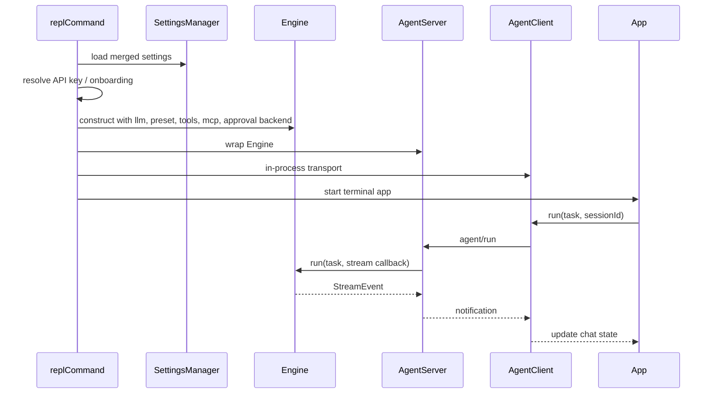
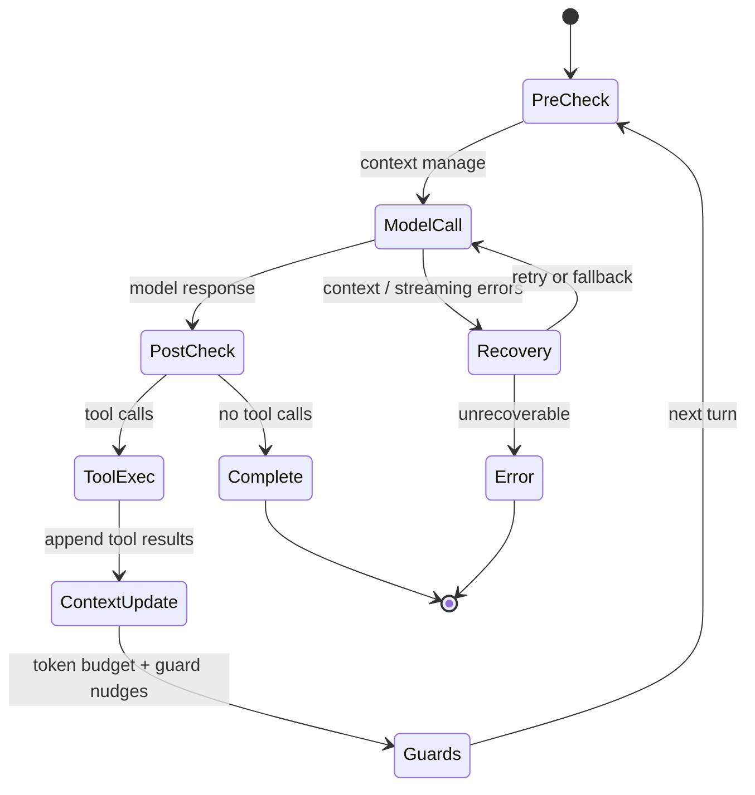

# Runtime Flow

## CLI Entry

[`src/cli/main.ts`](../../src/cli/main.ts) creates the Commander program and exposes:

- `code-shell` with no task: interactive REPL.
- `code-shell <task>` or `code-shell run <task>`: headless one-shot execution.
- `code-shell sessions`: recent session listing.
- `code-shell arena <topic>`: multi-model Arena entry.
- `code-shell runs ...`: managed run lifecycle commands.

Before actions run, `setup()` validates the working directory, rotates logs, checks Node, and applies safety checks for permission bypass mode.

## REPL Flow



Source anchors:

- [`src/cli/commands/repl.ts`](../../src/cli/commands/repl.ts)
- [`src/protocol/server.ts`](../../src/protocol/server.ts)
- [`src/protocol/client.ts`](../../src/protocol/client.ts)
- [`src/ui/App.tsx`](../../src/ui/App.tsx)

## Headless Run Flow

`runCommand()` uses the same Engine -> AgentServer -> AgentClient path as REPL, then connects stream events to a headless renderer.

```text
runCommand
  -> SettingsManager
  -> active model resolution
  -> Engine(headless: true, sandbox: auto)
  -> AgentServer / AgentClient
  -> renderer.onEvent(...)
  -> client.run(...)
  -> renderer.onComplete(...)
```

Headless defaults differ from REPL:

- sandbox defaults to `auto`;
- max turns defaults to 30;
- missing API key is a hard error, not an onboarding prompt;
- process exit code follows the Engine terminal reason.

Source: [`src/cli/commands/run.ts`](../../src/cli/commands/run.ts).

## Engine.run Lifecycle

[`Engine.run()`](../../src/engine/engine.ts) is the central runtime wiring point.

1. Rejects pasted terminal noise before starting a session.
2. Builds per-run `ToolContext`, including cwd, LLM config, model pool, tool registry, AskUser handler, sub-agent spawner, and sandbox.
3. Resolves sandbox backend.
4. Creates or resumes a session and appends the user message.
5. Emits early `session_started` so the client can know the session ID mid-turn.
6. Starts LLM client creation.
7. Builds permission classifier and approval backend.
8. Creates `ToolExecutor`, `InvestigationGuard`, `TaskGuard`, `ContextManager`, and `PromptComposer`.
9. Connects configured MCP servers and registers MCP tools.
10. Builds tool definitions, system prompt, and system context.
11. Prepends project/user context from instructions and memories.
12. Injects summarization into `ContextManager`.
13. Creates `ModelFacade` and `TurnLoop`.
14. Runs the turn loop.
15. Saves session state, usage/cost state, and post-session memory work.

## Turn Loop

[`TurnLoop`](../../src/engine/turn-loop.ts) repeats until completion, cancellation, error, or turn limit.



Important behavior:

- Streaming failures fall back to non-streaming with a tombstone event.
- Context limit errors trigger progressive old-round dropping, up to three retries.
- `max_tokens` text truncation can trigger continuation calls.
- Read-only/concurrency-safe tools may start early through `StreamingToolQueue`.
- Tool results are appended as user-side `tool_result` content blocks.
- Context usage updates are emitted both from provider usage and local message estimates.
- The loop injects reminders near turn limits and token-budget limits.

## Stream Events

Engine stream events are defined in [`src/types.ts`](../../src/types.ts). Major categories:

- lifecycle: `session_started`, `stream_request_start`, `turn_complete`;
- assistant output: `text_delta`, `thinking_delta`, `assistant_message`;
- tools: `tool_use_start`, `tool_use_args_delta`, `tool_result`, `tool_summary`;
- UI state: `task_update`, `agent_start`, `agent_end`, `context_compact`, `usage_update`;
- failure/recovery: `error`, `tombstone`.

## Cancellation and Approval

- `AgentClient.cancel()` sends `agent/cancel`.
- `AgentServer` aborts the run's `AbortController`, rejects pending approvals, and lets tools/model calls see the signal.
- Tool approvals are requested by `InteractiveApprovalBackend`, routed through `AgentServer`, displayed by the UI, then resolved back into `PermissionClassifier`.

The same route is reused for `AskUserQuestion`, using a synthetic approval-like request whose tool name is `__ask_user__`.
