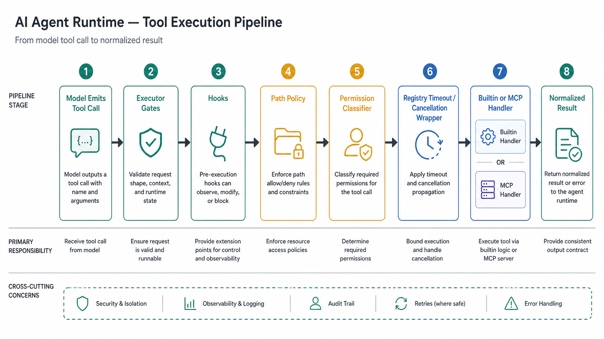

# 02 · Tool System

> How a model's tool call becomes a guarded, executed action. Source-mapped against `packages/core/src/tool-system/`, with the preset whitelist in `packages/core/src/preset/index.ts`.

## 1. The shape of the layer

Every LLM-facing capability — reading a file, running a shell command, spawning a sub-agent, calling an MCP server, driving the browser, or generating media — flows through the same control surface: **preset visibility → executor gates → hooks → path policy → permission → registry → handler → normalized result**. The executor is the runtime choke point; the registry is the handler/timeout/cancellation wrapper.



| File                        | Role                                                                                                                | ~LOC   |
| --------------------------- | ------------------------------------------------------------------------------------------------------------------- | ------ |
| `registry.ts`               | `ToolRegistry` — builtin selection, metadata validation, timeout/cancellation wrapper, result normalization         | ~194   |
| `executor.ts`               | `ToolExecutor` — per-call lifecycle: visibility, plan mode, hooks, path policy, permission, execution, result hooks | ~656   |
| `permission.ts`             | `PermissionClassifier` + approval backends, operation-scoped grants, Bash safety scanner, denial tracker            | ~1,095 |
| `path-policy.ts`            | Sensitive-path/workspace classifier, path approval cache, path prompt flow, `bypassPermissions` escape hatch        | ~692   |
| `plan-mode-allowlist.ts`    | Single source of truth for read-only tools in plan mode and low-risk read-only tools                                | ~66    |
| `validation.ts`             | Cheap top-level input-schema validation before handlers run                                                         | ~60    |
| `validate-tool-metadata.ts` | Registration-time guard that `pathPolicy.arg` still exists in the tool schema                                       | ~79    |
| `mcp-manager.ts`            | Shared MCP connection pool, transport/header/env setup, discovery, registration, untrusted-output wrapping          | ~662   |
| `sandbox/index.ts`          | OS shell sandbox resolver and default sandbox config                                                                | ~291   |
| `browser-bridge.ts`         | Driver-agnostic browser automation contract for the three browser tools                                             | ~342   |
| `context.ts`                | `ToolContext` — per-engine services and visibility state injected into every tool                                   | ~373   |
| `builtin/index.ts`          | `BUILTIN_TOOLS` registration table (57 tools) and runtime availability guards                                       | ~795   |
| `../preset/index.ts`        | Builtin preset tool whitelists, default permission rules, browser prompt-section gating                             | ~337   |

## 2. The end-to-end path

```
LLM emits tool_use(name, args)
   │
ToolExecutor.executeSingle(call)                 executor.ts:119
   ├─ abort fast-path                            executor.ts:131  → return immediately
   ├─ builtin / goal / guard visibility gates    executor.ts:145 / executor.ts:153 / executor.ts:164
   ├─ MCP server visibility gates                executor.ts:176 / executor.ts:196
   ├─ plan-mode gate                             executor.ts:219  → allowlist + Bash safe-read scan
   ├─ input validation                           executor.ts:250  → validation.ts:16
   ├─ pre_tool_use hook                          executor.ts:264  → may deny, ask, or rewrite args
   │    └─ rewritten args are revalidated         executor.ts:282
   ├─ declared path policy                       executor.ts:302  → enforceDeclaredPathPolicy at executor.ts:563
   ├─ investigation guard                        executor.ts:352
   ├─ permission classification                  executor.ts:366  → permission.ts:926
   │    └─ on_permission_check hook              executor.ts:381  → may downgrade, not upgrade
   ├─ on_tool_start hook                         executor.ts:433
   ├─ ToolRegistry.executeTool(...)              executor.ts:456  → registry.ts:85
   ├─ on_tool_end / post_tool_use hooks          executor.ts:507 / executor.ts:516
   └─ file_changed hook for Write/Edit           executor.ts:540
   │
returns ToolResult → TurnLoop toolResultToBlock(...)  turn-loop.ts
```

Inside `ToolRegistry.executeTool` (`registry.ts:85`): missing tool definitions throw `ToolNotFoundError` before the handler path (`registry.ts:90`), missing executors throw `ToolExecutionError` (`registry.ts:95`), and timeout precedence is per-call override > tool declaration > `DEFAULT_TOOL_TIMEOUT_MS` 120 s (`registry.ts:100`). The registry creates a child `AbortController` (`registry.ts:117`), cascades parent aborts (`registry.ts:123`), injects `__signal` into args (`registry.ts:127`), and races the handler against the abort promise (`registry.ts:136`). Handler results normalize to string, image/content blocks, or sandbox metadata (`registry.ts:151`); handler exceptions and timeouts are returned as `ToolResult` errors (`registry.ts:166`).

Two details are easy to miss:

1. `pre_tool_use` is the only hook that can rewrite input, and the executor re-runs schema validation after the rewrite (`executor.ts:282`). `on_tool_start`, `on_tool_end`, and `post_tool_use` are observation/result-context hooks, not authority gates (`executor.ts:433`, `executor.ts:507`, `executor.ts:516`).

2. The registry normalizes handler failures, but the executor is not a universal catch-all. It converts hallucinated/missing tools into tool errors (`executor.ts:469`), while other exceptions from hooks or host callbacks can still propagate and must be guarded at their own boundary.

## 3. Invariants that make this safe

1. **Visibility is enforced twice.** Engine hides unavailable tools before the model sees them (`engine.ts:1747`), and the executor rejects direct calls anyway: project-disabled builtins (`executor.ts:145`), goal-only tools without an active goal (`executor.ts:153`), guarded builtins whose runtime predicate fails (`executor.ts:164`), and MCP tools from servers not enabled for this session (`executor.ts:176`).

2. **Plan mode has one allowlist.** `PLAN_MODE_ALLOWED_TOOLS` drives both model-visible tool definitions and execution gating (`plan-mode-allowlist.ts:40`, `engine.ts:1772`, `executor.ts:219`). Bash is visible in plan mode, but only commands classified as `"safe-read"` pass (`executor.ts:234`).

3. **Hooks can only tighten permission.** `clampHookDecision` rejects a hook's attempt to promote a classifier `"ask"` or `"deny"` to `"allow"` (`executor.ts:44`). `pre_tool_use` may request an interactive ask (`executor.ts:334`), and `on_permission_check` may downgrade or change to ask (`executor.ts:381`), but only rules, mode, or the user can grant allow.

4. **Path policy is separate from tool permission.** The executor enforces every declared `pathPolicy` target after hook rewrites and before permission classification (`executor.ts:302`). That means an `acceptEdits` permission grant cannot write to a sensitive path unless path policy also allows it.

5. **Abort/cancellation flows all the way down.** Engine sets the executor signal, the registry derives a child signal, handlers receive it as `__signal`, and MCP generic tools forward it to SDK calls (`executor.ts:90`, `registry.ts:117`, `mcp-tools.ts:37`, `mcp-manager.ts:590`).

6. **Path-policy metadata fails loud.** Builtins and dynamically registered tools run `validateToolMetadata` during registration (`registry.ts:48`, `registry.ts:56`), and the validator throws when a `pathPolicy.arg` no longer exists in the schema (`validate-tool-metadata.ts:66`). This prevents a typo from silently disabling path protection.

## 4. Permission system (`permission.ts`)

`PermissionClassifier.classify(toolName, args)` resolves `"allow" | "deny" | "ask"` in this order:

1. `bypassPermissions` short-circuits to `"allow"` (`permission.ts:926`).
2. Ordered permission rules match first (`permission.ts:930`). Engine seeds this list from preset defaults (`engine.ts:2928`), adds dream-scope `MemorySave`/`MemoryDelete` allow rules (`engine.ts:2935`), adds mode-derived `Write`/`Edit`/`Bash` rules where appropriate (`engine.ts:2948`), and unshifts persisted settings rules so user/project rules win (`engine.ts:2963`).
3. Bash receives the shell-specific safety classifier (`permission.ts:937`, `permission.ts:796`).
4. Mode fallback applies: `dontAsk` denies, `acceptEdits` allows only `ACCEPT_EDITS_ALLOWLIST`, and the default/auto path asks (`permission.ts:951`, `permission.ts:884`).

Three approval backends sit behind `ask`:

- **`HeadlessApprovalBackend`** — `approve-all`, `deny-all`, or `approve-read-only`; read-only approval uses `READ_ONLY_TOOLS` from the shared allowlist module (`permission.ts:28`, `plan-mode-allowlist.ts:32`).
- **`AutoApprovalBackend`** — low risk approves, high risk delegates or denies, and medium risk approves only if `isSafeOperation()` says the operation is established-safe (`permission.ts:51`, `permission.ts:54`, `permission.ts:64`, `permission.ts:75`).
- **`InteractiveApprovalBackend`** — prompts via the host callback, serializes duplicate prompts, records session/project grants, and persists project grants atomically to `.code-shell/settings.local.json` (`permission.ts:136`, `permission.ts:191`, `permission.ts:244`, `permission.ts:261`, `permission.ts:459`).

### Operation-scoped, not tool-scoped

A remembered approval narrows the operation when it can. Bash grants are head-scoped (`permission.ts:351`): approving `git status` stores an args pattern like `^git(\s|$)` (`permission.ts:356`). File grants for `Write`/`Edit` can be exact-file or directory-prefix rules (`permission.ts:314`, `permission.ts:329`), with relative paths resolved against cwd before anchoring (`permission.ts:368`).

`ruleMatches` applies those grants conservatively (`permission.ts:403`). A narrowed Bash grant is refused if the candidate command has multiple shell segments, dangerous constructs, or a pipe (`permission.ts:419`). The scanner understands quotes/escapes, command substitution, process substitution, redirection, top-level separators, background `&`, and pipe-to-shell (`permission.ts:648`, `permission.ts:682`, `permission.ts:689`, `permission.ts:696`, `permission.ts:703`, `permission.ts:714`, `permission.ts:640`).

### Bash read safety

The Bash classifier returns `"safe-read" | "safe-write" | "unsafe" | "dangerous"` (`permission.ts:517`). It first rejects dangerous whole-command patterns and pipe-to-shell (`permission.ts:800`), then scans segments and takes the minimum safety across them (`permission.ts:806`). Safe reads are downgraded to unsafe when they dump environment variables or touch credential paths (`permission.ts:566`, `permission.ts:603`), so `cat ~/.ssh/id_rsa` and bare `env` do not ride the safe-read fast path.

## 5. Path policy (`path-policy.ts`)

Path policy is the file-system gate for declared tool targets. `classifyPath(rawPath, { workspaceRoot, operation })` expands `~`, best-effort realpaths the path and workspace, checks sensitive dirs/files, then compares containment (`path-policy.ts:457`, `path-policy.ts:477`, `path-policy.ts:481`). Sensitive wins over workspace placement: sensitive read asks, sensitive write denies (`path-policy.ts:486`); ordinary in-workspace paths allow (`path-policy.ts:510`); ordinary outside-workspace paths ask (`path-policy.ts:514`).

Sensitive directories are home-scoped `.ssh`, `.aws`, `.config/gcloud`, `.code-shell`, `.claude`, `.gnupg`, `.kube`, and `.docker` (`path-policy.ts:77`). Sensitive files include `.env*`, private-key names, `.pem`/`.p12`/`.pfx`, credential data/config files, bare `secret`/`credentials`/`token`, `.git-credentials`, `.npmrc`, `.netrc`, and `.pgpass` (`path-policy.ts:97`). Source files whose names contain auth/token words are deliberately excluded by extension filtering (`path-policy.ts:92`). CodeShell diagnostic reads under selected `.code-shell` session/log paths are explicitly allowed (`path-policy.ts:426`).

`enforcePathPolicyWithApproval` is the executor-facing path (`path-policy.ts:563`). It does nothing when no `ToolContext.cwd` exists, and `permissionMode === "bypassPermissions"` skips the entire path approval layer (`path-policy.ts:568`). Otherwise it handles `allow`, `deny`, plan-mode write refusal, remembered grants, missing UI, and serialized interactive path prompts (`path-policy.ts:576`, `path-policy.ts:581`, `path-policy.ts:585`, `path-policy.ts:590`, `path-policy.ts:595`). Remembered grants are directory-prefix grants tagged by operation: read covers reads only; write covers reads and writes (`path-policy.ts:160`, `path-policy.ts:176`, `path-policy.ts:282`). Project grants persist as `{ path, op }` in `.code-shell/settings.local.json` with atomic rename (`path-policy.ts:308`, `path-policy.ts:343`).

The executor resolves declared targets before classification:

- Single string path args resolve relative to `ctx.cwd` (`executor.ts:586`).
- Array path args are enforced element-by-element, skip `http(s)` URLs, and resolve relative paths against `ctx.cwd` (`executor.ts:597`).
- `ApplyPatch` parses hunks leniently and checks add/update/delete paths plus move destinations (`executor.ts:617`).
- Operation can be static read/write or derived from another arg, as with `NotebookEdit.action` (`executor.ts:551`, `builtin/index.ts:435`).

The builtins that declare path policy include `Read`, `Write`, `GenerateImage.referenceImages`, `GenerateVideo.images/image`, `view_image`, `Edit`, `ApplyPatch`, `Glob`, `Grep`, `NotebookEdit`, and `LSP` (`builtin/index.ts:113`, `builtin/index.ts:124`, `builtin/index.ts:154`, `builtin/index.ts:169`, `builtin/index.ts:183`, `builtin/index.ts:194`, `builtin/index.ts:205`, `builtin/index.ts:216`, `builtin/index.ts:227`, `builtin/index.ts:435`, `builtin/index.ts:453`).

## 6. Builtins, presets, and visibility

Core's `BUILTIN_TOOLS` and every capability tool entry carry the definition, executor, `permissionDefault`, concurrency/read-only flags, optional path policy/timeout, and exhaustive preset exposure metadata. Engine composes the catalogs through `CapabilityModule`, and the registry filters the result by the selected preset before storing definition and executor.

Registered builtin tools by category:

- **File/workspace**: `Read`, `Write`, `Edit`, `Glob`, `Grep`, `view_image`, `EditModelCatalog`
- **Shell/runtime**: `Bash`, `PowerShell`, `REPL`, `BashOutput`, `KillShell`, `ListShells`
- **Web/media/browser**: `WebSearch`, `WebFetch`, `GenerateImage`, `GenerateVideo`, `browser_observe`, `browser_act`, `browser_navigate`
- **Agent/multi-model/orchestration**: `Agent`, `AgentStatus`, `AgentCancel`, `AgentSendInput`, `Arena`
- **Planning/coordination**: `AskUserQuestion`, `EnterPlanMode`, `ExitPlanMode`, `ToolSearch`, `TodoWrite`, `Sleep`, `Config`, `complete_goal`, `cancel_goal`, `AddMarketplace`
- **MCP/credentials**: `MCPTool`, `ListMcpResources`, `ReadMcpResource`, `UseCredential`, `InjectCredential`
- **Automation/memory**: `CronCreate`, `CronDelete`, `CronList`, `MemoryList`, `MemoryRead`, `MemorySave`, `MemoryDelete`

The optional coding package contributes `ApplyPatch`, `NotebookEdit`, `LSP`, `Brief`, `EnterWorktree`, `ExitWorktree`, `SwitchSessionWorkspace`, `DriveAgent`, `DriveAgentJobs`, `DriveClaudeCode`, and `CheckQuota`. Their implementations and repository-specific runtime services are not shipped as core source.

Preset exposure is derived from each tool entry's `presetTags`; there is no second hand-written whitelist. Core defaults to `harness-min`. Installing the coding capability contributes `terminal-coding` as the host default and combines the appropriate core tools with its coding catalog. Registered-but-not-selected tools still require the active preset or an explicit enabled override before `ToolRegistry` installs them.

Engine applies more runtime filters per turn:

- Project/global builtin overrides feed the constructor-time builtin set (`engine.ts:595`, `engine.ts:600`) and per-turn hiding for `off` overrides (`engine.ts:1747`).
- MCP tools from the shared registry are visible only when their server is enabled for this session (`engine.ts:1728`, `engine.ts:1751`).
- `BUILTIN_TOOL_GUARDS` hide tools that cannot currently work: web/image/video without configured providers, `UseCredential` with an empty credential store, and `InjectCredential` without cookie credentials (`builtin/index.ts:774`).
- Feature flags can hide mapped tools (`engine.ts:1756`).
- Plan mode filters the final set through `PLAN_MODE_ALLOWED_TOOLS` (`engine.ts:1772`).

Default preset permission rules allow read/search/coordination tools, memory reads, and browser observe/navigate while escalating mutating browser actions (`click`, `type`, `select`) to ask via an args-pattern rule (`preset/index.ts:140`, `preset/index.ts:173`). `ReadMcpResource` is intentionally not auto-allowed by the preset because it returns server content, not just resource names (`preset/index.ts:158`).

## 7. MCP integration (`mcp-manager.ts`)

`MCPManager` is a shared connection pool over the same `ToolRegistry`. It auto-infers stdio vs. streamable HTTP when the config omits `transport` (`mcp-manager.ts:123`), builds stdio env from an allowlisted host env plus explicit `envVars`/`env` (`mcp-manager.ts:68`), and builds HTTP headers from static headers, `credentialRef`, `bearerTokenEnvVar`, and `envHeaders` (`mcp-manager.ts:89`).

The pool is owner-aware because one worker can serve multiple sessions with different MCP configs. `connectAll()` records each owner's desired server set (`mcp-manager.ts:293`), `reconcile()` disconnects only servers no owner wants (`mcp-manager.ts:334`), and concurrent connects for the same server are coalesced (`mcp-manager.ts:373`). A 15 s connect timeout prevents a bad server from hanging runtime refresh (`mcp-manager.ts:438`).

Discovered MCP tools are converted to OpenAI-safe names (`mcp_${server}_${tool}`), marked `permissionDefault: "ask"`, and only treated as read-only/concurrency-safe when `annotations.readOnlyHint === true` (`mcp-manager.ts:241`, `mcp-manager.ts:245`). Discovery registers them in the normal registry with an executor (`mcp-manager.ts:480`, `mcp-manager.ts:487`), so they flow through the same executor gates as builtins. MCP output is wrapped as untrusted content (`mcp-manager.ts:206`), internal args like `__signal` are stripped before server calls (`mcp-manager.ts:219`), oversized base64 image payloads spill to `~/.code-shell/mcp_images/` with an 8 MB cap (`mcp-manager.ts:148`, `mcp-manager.ts:160`), and generic MCP calls/resources forward the run abort signal (`mcp-manager.ts:590`, `mcp-manager.ts:623`, `mcp-manager.ts:649`).

The generic MCP builtins add another guard: `MCPTool` and `ReadMcpResource` name the server in args, so the executor checks those args against `allowedMcpServers` (`executor.ts:196`). `ListMcpResources` gets `__allowedMcpServers` injected and filters the manager result when no explicit server is named (`executor.ts:206`, `mcp-tools.ts:67`).

## 8. Sandbox and browser bridge

Bash can run under an OS sandbox backend: `seatbelt` on macOS, `bwrap` on Linux, or `off` (`sandbox/index.ts:25`). `auto` picks seatbelt, then bwrap, else off with a one-shot warning; Windows currently lands in the off path with guidance to use WSL or Docker (`sandbox/index.ts:194`, `sandbox/index.ts:228`, `sandbox/index.ts:151`). The default config makes the workspace and temp roots writable, denies reads of common credential dirs, and leaves network allowed (`sandbox/index.ts:164`). Missing writable roots warn once per session (`sandbox/index.ts:271`). This layer only wraps shell processes; file tools remain governed by path policy and permissions.

Browser automation is exposed as three semantic tools in `builtin/browser-tools.ts`: `browser_observe`, `browser_act`, and `browser_navigate` (`browser-tools.ts:47`, `browser-tools.ts:175`, `browser-tools.ts:294`). The tools depend on a `BrowserBridge` in `ToolContext`; without it they degrade with a clear error (`browser-tools.ts:33`, `browser-tools.ts:96`). The bridge contract covers snapshots, action refs, text/link/image extraction, screenshots, tabs, and pixel fetches (`browser-bridge.ts:115`). The a11y flattener keeps only actionable roles, assigns ephemeral `eN` refs, and marks password-like inputs sensitive without exposing values (`browser-bridge.ts:220`, `browser-bridge.ts:245`).

## 9. Where to read next

- Preset prompt assembly and hook loading: [05 · Presets, prompt, hooks, skills](05-presets-prompt-hooks-skills.md)
- Agent/background execution built on top of this tool layer: [06 · Long-running orchestration](06-long-running-orchestration.md)
- MCP servers, plugins, credentials, and memory beyond the tool dispatch surface: [07 · Plugins, capabilities, credentials, memory](07-plugins-capabilities-credentials-memory.md)
