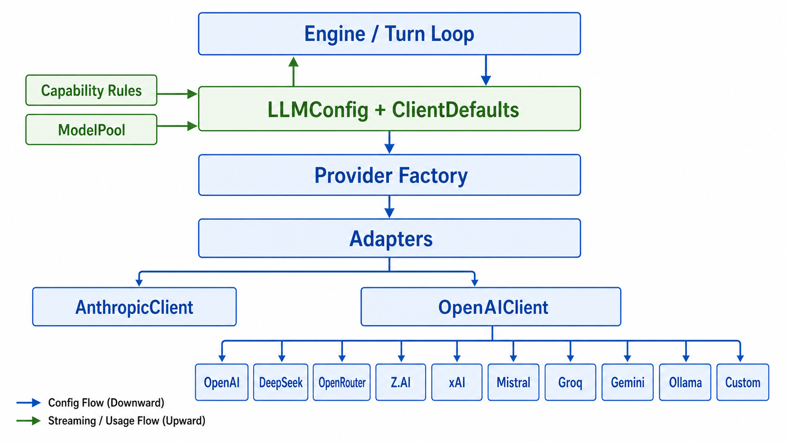
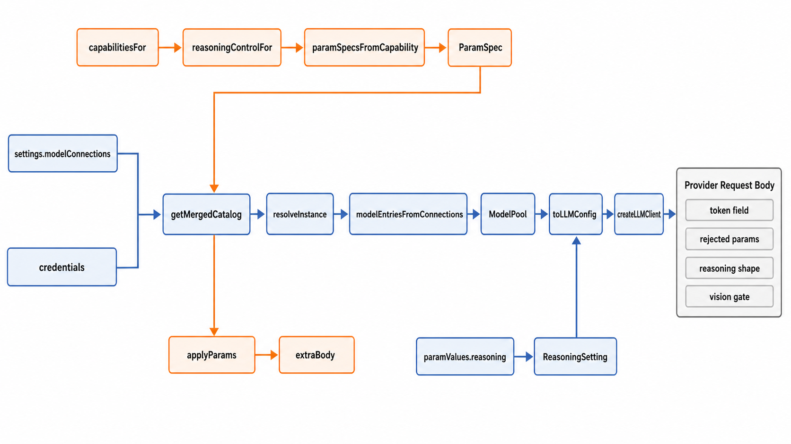

# 03 · LLM & Model Layer

> How a model "tag" becomes a configured provider client, and how per-provider quirks are tamed by data instead of scattered request-building branches. Source-mapped against `packages/core/src/llm/`, `packages/core/src/model-catalog/`, the resolution glue in `packages/core/src/engine/`, and model metadata under `packages/core/src/data/`.

## 1. Two concerns, kept separate

The layer deliberately splits **model identity** from **runtime knobs**. `LLMConfig` is "which model and how to reach it" (`provider`, `model`, `apiKey`, `baseUrl`, output/context caps, `providerKind`, `reasoning`, `extraBody`) (`types.ts:585`, `types.ts:594`). `ClientDefaults` is cross-model runtime preference (`temperature`, timeout/retries, `imageDetail`) (`types.ts:639`, `types.ts:646`). `LLMClientBase` receives them separately (`llm/client-base.ts:41`), and `ModelPool.toLLMConfig` explicitly refuses to copy runtime defaults into the model identity object (`llm/model-pool.ts:257`).

| File | Role | ~LOC |
|------|------|------|
| `llm/client-base.ts` | `LLMClientBase` abstract class, usage accumulation, retry/deadline logic | ~327 |
| `llm/client-factory.ts` | `createLLMClient` / `registerProvider` — lazy provider registry | ~45 |
| `llm/providers/anthropic.ts` | `@anthropic-ai/sdk` wrapper; Anthropic thinking + prompt-cache markers | ~517 |
| `llm/providers/openai.ts` | OpenAI-compatible client (OpenAI, DeepSeek, OpenRouter, Z.AI/Zhipu-style, xAI, Mistral, Groq, Gemini-compat, Ollama, custom) + stream watchdog | ~1,156 |
| `llm/capabilities/` | `capabilitiesFor`, ordered `RULES`, reasoning control and capability-derived `ParamSpec` projection | ~614 |
| `llm/model-pool.ts` | `ModelPool` / `ModelEntry` — runtime registry, active-key switch, context-window enrichment, `LLMConfig` assembly | ~326 |
| `llm/provider-kinds.ts`, `provider-auth.ts`, `provider-catalog.ts` | provider-family metadata, auth/header resolution, and the older provider-key helper used by legacy-style `ModelEntry.providerKey` | ~339 |
| `model-catalog/` | built-in + user catalog, `CatalogEntry`, `ParamSpec`, instance resolution, safe user-catalog writes | ~940 |
| `engine/resolve-llm-config.ts`, `engine/model-connections-pool.ts`, `engine/runtime.ts`, `engine/aux-key.ts` | settings → pool entries, shared-runtime reload, aux model resolution | ~226 |



Do not confuse the three "catalog" concepts:
- `model-catalog/` is the user-facing template catalog. `getMergedCatalog()` overlays `~/.code-shell/model-catalog.user.json` on `BUILTIN_CATALOG`, with user entries winning by `id` (`model-catalog/index.ts:49`, `model-catalog/index.ts:54`).
- `settings.credentials[]` stores actual keys independently of model instances (`settings/schema.ts:131`). Text resolution dereferences those credentials through `resolveInstance`, not through `llm/provider-catalog.ts` (`model-catalog/resolve.ts:47`).
- `llm/provider-catalog.ts` is still present as an in-memory helper for older `providerKey`-style entries (`llm/provider-catalog.ts:1`, `llm/model-pool.ts:71`). The unified `modelConnections[]` path normally bypasses it.

## 2. The resolution flow



A normal text chat turn gets its `LLMConfig` through the unified instance store:

```
settings.modelConnections[] + settings.credentials[] + getMergedCatalog()
        │  modelEntriesFromConnections()              engine/model-connections-pool.ts:43
        ▼
ModelEntry[]  ──register/switch──▶  ModelPool          llm/model-pool.ts:203
        │  pool.toLLMConfig(entry)                    llm/model-pool.ts:267
        ▼
LLMConfig  ──createLLMClient()──▶  AnthropicClient | OpenAIClient
        │  client.createMessage({system, messages, tools, reasoning})
        ▼
capabilitiesFor(providerKind, model) shapes the wire request
```

The persisted settings shape is now `credentials[]`, `modelConnections[]`, and `defaults.{text,image,video,audio,auxText}` (`settings/schema.ts:137`, `settings/schema.ts:158`, `settings/schema.ts:179`). `Engine.populateModelPoolFromSettings()` reads `modelConnections[]`, resolves text instances, registers them into the pool, switches to `defaults.text` when present, and writes the resolved `LLMConfig` back into `this.config.llm` before the first run (`engine/engine.ts:648`, `engine/engine.ts:654`, `engine/engine.ts:673`, `engine/engine.ts:695`). A shared worker runtime does the same pool reload once for all sessions in `EngineRuntime.reloadModelsFromSettings()` (`engine/runtime.ts:53`).

`modelEntriesFromConnections()` is the pure bridge: it skips non-text instances, calls `resolveInstance`, maps catalog protocol to the client factory family (`anthropic-style` → `anthropic`, everything else OpenAI-compatible), carries `adapterKind` as `providerKind`, copies preset context/output caps, and turns per-model params into `reasoning` + `extraBody` (`engine/model-connections-pool.ts:17`, `engine/model-connections-pool.ts:43`, `engine/model-connections-pool.ts:54`, `engine/model-connections-pool.ts:60`). `resolveInstance()` owns the base URL/key precedence: connection `baseUrl` > credential `baseUrl` > catalog `defaultBaseUrl`; missing keys do not throw there because usability is decided one layer up (`model-catalog/resolve.ts:47`, `model-catalog/resolve.ts:60`, `model-catalog/resolve.ts:65`).

For non-engine seed paths there is a single helper: `resolveLLMConfigForTag(settings, "text", preferredId?)` (`engine/resolve-llm-config.ts:20`). It builds entries with the same bridge, chooses `preferredInstanceId > defaults.text > first usable`, warns on fallback from an invalid preferred/default id, rejects a key-needing connection with no resolved key by returning `null`, and then reuses a temporary `ModelPool.toLLMConfig` so the mapping logic is not forked (`engine/resolve-llm-config.ts:30`, `engine/resolve-llm-config.ts:39`, `engine/resolve-llm-config.ts:48`, `engine/resolve-llm-config.ts:63`, `engine/resolve-llm-config.ts:70`).

Two compatibility paths still exist and should be named as such. Settings load still has a best-effort migration for old flat `models[]` files (`settings/manager.ts:211`), and when no `modelConnections[]` exist the engine can auto-populate a pool from a seed API key/base URL so zero-config env-key users still get `/model` choices (`engine/engine.ts:703`, `engine/engine.ts:761`). The primary text path does not read legacy `models[]` for turn-time resolution.

## 3. Provider clients and adapter boundaries

`createLLMClient` only lazy-loads two built-in client classes: `AnthropicClient` for `provider === "anthropic"` and `OpenAIClient` for `provider === "openai"` (`llm/client-factory.ts:17`, `llm/client-factory.ts:23`). That is why `LLMConfig.provider` is distinct from `LLMConfig.providerKind`: `provider` selects the protocol class; `providerKind` selects request-shape rules such as token field, rejected params, reasoning shape, vision support, and stream usage (`types.ts:623`, `llm/model-pool.ts:272`, `llm/model-pool.ts:280`).

### OpenAI-compatible client

`OpenAIClient` is the adapter for OpenAI Chat Completions and every OpenAI-compatible endpoint supported by the app (`llm/providers/openai.ts:1`). It resolves headers and credentials lazily at client construction: explicit `apiKey` > `authCommand` stdout > environment fallback, with a header-only placeholder for custom providers that authenticate by `httpHeaders` (`llm/providers/openai.ts:212`, `llm/provider-auth.ts:81`). It memoizes one `Capability` per `(providerKind, model)` (`llm/providers/openai.ts:230`).

The important invariant is that request-shape divergence is centralized in `buildRequestBody()` (`llm/providers/openai.ts:306`):
- token limit field and output cap: `max_tokens` vs `max_completion_tokens`, plus `clampMaxTokens` against capability `maxOutputTokens` (`llm/providers/openai.ts:318`, `llm/providers/openai.ts:329`);
- sampling: `temperature` is omitted when the capability rejects it, with precedence `default temperature < catalog extraBody < per-call override` (`llm/providers/openai.ts:338`, `llm/providers/openai.ts:449`);
- reasoning: normalized `ReasoningSetting` becomes `thinking.type`, `reasoning_effort`, or OpenRouter `reasoning.{effort,...}` depending on capability (`llm/providers/openai.ts:356`);
- gpt-5.5+ tool calls suppress `reasoning_effort` up front when `noEffortWithTools` is set, with a sticky self-correcting fallback if an unknown model returns the same 400 (`llm/providers/openai.ts:362`, `llm/providers/openai.ts:1046`);
- catalog `extraBody` is filtered through `rejectedParams` and then deep-merged with sampling and reasoning so shared nested keys like `thinking` are not clobbered (`llm/providers/openai.ts:438`, `llm/providers/openai.ts:1096`).

Message conversion is capability-aware too. Historical images are stripped only from the outgoing copy when the active model has `supportsVision: false` (`llm/providers/openai.ts:739`, `llm/strip-vision.ts:36`). Reasoning-content echo follows the `echoReasoning` contract: synthesize an empty backfill only for `"when-tools"` models with thinking on, drop it for `"never"` models such as `deepseek-reasoner`, and otherwise pass through when present (`llm/providers/openai.ts:746`, `llm/providers/openai.ts:807`). Anthropic-over-OpenRouter gets explicit prompt-cache breakpoints because OpenRouter does not automatically cache Anthropic routes without `cache_control` markers (`llm/providers/openai.ts:944`).

### Anthropic client

`AnthropicClient` is narrower: it speaks the native Anthropic Messages API and defaults `providerKind` to `anthropic` (`llm/providers/anthropic.ts:35`, `llm/providers/anthropic.ts:60`). Its `buildThinking()` sends a `thinking` field only for `anthropic-budget` models (Claude 4.0-4.5), clamps the budget below `max_tokens`, and intentionally omits thinking for `anthropic-adaptive` (Claude 4.6+) and pre-Claude-4 models (`llm/providers/anthropic.ts:74`, `llm/providers/anthropic.ts:96`, `llm/providers/anthropic.ts:101`). Anthropic requires `max_tokens`, so unknown caps fall back to 4096 at request time rather than in `LLMClientBase` (`llm/providers/anthropic.ts:18`, `llm/providers/anthropic.ts:177`).

The Anthropic message path mirrors the same cross-cutting guarantees: strip non-vision history images before serialization (`llm/providers/anthropic.ts:361`), map `tool_result.is_error` to Anthropic `is_error` (`llm/providers/anthropic.ts:384`), mark the last history block for prompt caching (`llm/providers/anthropic.ts:439`), and mark only the last tool definition for tool-prefix caching (`llm/providers/anthropic.ts:477`).

## 4. Capabilities and reasoning control

Every provider/model quirk lives in `llm/capabilities/rules.ts`, and callers enter through `capabilitiesFor(kind, model)` (`llm/capabilities/index.ts:35`). First matching rule for the provider kind wins; the returned capability is a shallow merge over `DEFAULT_CAPABILITY`, with a fresh `Set` for `rejectedParams` so clients cannot mutate the default singleton (`llm/capabilities/index.ts:39`, `llm/capabilities/index.ts:42`, `llm/capabilities/types.ts:142`).

A `Capability` declares the fields that have actually caused behavior or 400s: `supportsVision`, `tokenLimitField`, `rejectedParams`, `reasoning`, `echoReasoning`, `parallelToolCalls`, `streamUsage`, and optional `maxOutputTokens` (`llm/capabilities/types.ts:101`). The current notable rules are:
- **OpenAI gpt-5.5+**: vision on, `max_completion_tokens`, rejects classic sampling/logprob params, supported efforts `low/medium/high/xhigh`, `disabledEffort: "none"`, `noEffortWithTools: true`, max output 128k (`llm/capabilities/rules.ts:28`, `llm/capabilities/rules.ts:35`).
- **OpenAI o-series / gpt-5 through 5.4**: `max_completion_tokens`, classic sampling rejected, `openai-effort` with default effort ladder (`llm/capabilities/rules.ts:63`).
- **gpt-4o / gpt-4.1 / gpt-4-turbo**: vision-capable but non-reasoning; they keep classic `max_tokens` and sampling params (`llm/capabilities/rules.ts:83`).
- **DeepSeek**: V4 uses top-level `thinking.type` and echoes reasoning on tool turns; `deepseek-reasoner` exposes no toggle and rejects echoed `reasoning_content` (`llm/capabilities/rules.ts:102`, `llm/capabilities/rules.ts:115`).
- **Z.AI GLM**: GLM 4.5+ uses the same binary `thinking.type` shape as DeepSeek V4 in the capability layer (`llm/capabilities/rules.ts:126`), though the built-in Zhipu catalog currently supplies explicit GLM params instead of using that projection (`model-catalog/builtin.ts:56`).
- **Anthropic**: Claude 4.6+ is `anthropic-adaptive` and must not receive opt-in thinking; Claude 4.0-4.5 is `anthropic-budget`; Claude 3.x is no-thinking but still has Anthropic tool/stream shapes and vision (`llm/capabilities/rules.ts:138`, `llm/capabilities/rules.ts:154`, `llm/capabilities/rules.ts:166`).
- **Gemini/OpenAI-compat, OpenRouter, xAI, Mistral, Groq**: Gemini 2.5+ maps `reasoning_effort`; OpenRouter normalizes under `reasoning`; xAI Grok 4.3 disables via `low`; Mistral Magistral only offers `high`/`none`; Groq reasoning models use `max_completion_tokens` (`llm/capabilities/rules.ts:179`, `llm/capabilities/rules.ts:193`, `llm/capabilities/rules.ts:222`, `llm/capabilities/rules.ts:235`, `llm/capabilities/rules.ts:250`).

`ReasoningSetting` is the normalized runtime shape (`off`, `on`, `effort`, `budget`) and still accepts legacy `"enabled"`/`"disabled"` strings through `normalizeReasoning` (`llm/reasoning-setting.ts:1`, `llm/reasoning-setting.ts:26`, `llm/reasoning-setting.ts:35`). `reasoningControlFor(kind, model)` projects the same capability into UI controls: `none`, binary `toggle`, effort enum, budget number, or `adaptive` (`llm/capabilities/reasoning-control.ts:10`, `llm/capabilities/reasoning-control.ts:19`). `paramSpecsFromCapability()` then turns that UI control into catalog `ParamSpec[]`, including the provider-specific wire field (`thinking.budget_tokens`, `thinking.type`, or `reasoning_effort`) (`llm/capabilities/param-specs.ts:11`, `llm/capabilities/param-specs.ts:30`).

The split between `reasoning` and `extraBody` is intentional. `modelEntriesFromConnections()` converts `paramValues.reasoning` to `ReasoningSetting` (`engine/model-connections-pool.ts:22`), then removes the `reasoning` spec before calling `applyParams` so the same knob is not double-sent (`engine/model-connections-pool.ts:55`). Non-reasoning params go into `LLMConfig.extraBody` and are wire-mapped by their `ParamSpec`.

## 5. Catalog and `ParamSpec`

`CatalogEntry` describes a template the connection page can instantiate: `id`, `tag` (`text`/`image`/`video`/`audio`), `adapterKind`, optional text `protocol`, `shape`, `defaultBaseUrl`, `defaultModel`, `needsKey`, `modelPresets[]`, and `paramsDoc` (`model-catalog/types.ts:73`). Each `ModelPreset` can carry context/output caps, `supportsVision`, and `params: ParamSpec[]` (`model-catalog/types.ts:56`). `ParamSpec` is generic data, not a hardcoded reasoning variant: `control` chooses the UI widget, `doc` feeds tool descriptions, and `wire.field` maps values to request body paths (`model-catalog/types.ts:17`, `model-catalog/types.ts:28`, `model-catalog/types.ts:36`).

The built-in text catalog now reuses the capability layer for most presets. `textPreset(kind, value, ...)` calls `capabilitiesFor` to set `supportsVision` and `paramSpecsFromCapability` to attach reasoning params when the model supports them (`model-catalog/builtin.ts:17`, `model-catalog/builtin.ts:22`). OpenRouter is the main exception: its catch-all capability would imply reasoning for every routed model, so presets opt into `OPENROUTER_REASONING` explicitly (`model-catalog/builtin.ts:39`, `model-catalog/builtin.ts:118`). Zhipu GLM is another explicit-data path because its OpenAI-compatible endpoint has GLM-specific knobs (`reasoning_effort`, `thinking.type`, `temperature`, `top_p`, `max_tokens`) (`model-catalog/builtin.ts:56`).

`applyParams(values, params)` is the runtime projection: it ignores unknown values, falls back to the param name when no `wire.field` exists, and builds nested objects for dotted fields such as `thinking.budget_tokens` (`model-catalog/params.ts:10`, `model-catalog/params.ts:16`). `buildParamsDoc(params)` renders the same specs into natural language for dynamic tool descriptions (`model-catalog/params.ts:43`). Image/video/audio share the same catalog/credential resolver through `genInstancesFromConnections`, but their runtime adapters are separate from the LLM clients (`model-catalog/gen-connections.ts:22`, `tool-system/builtin/generate-image.ts:171`, `tool-system/builtin/generate-video.ts:211`).

User catalog writes are deliberately conservative. `saveCatalogEntry` validates the incoming `CatalogEntry`, backs up an existing file even if corrupt, upserts by `id`, creates `~/.code-shell` if needed, and returns an `{ok,error}` result instead of throwing on normal IO failures (`model-catalog/save-entry.ts:26`, `model-catalog/save-entry.ts:37`, `model-catalog/save-entry.ts:56`, `model-catalog/save-entry.ts:61`). Deleting a user override leaves the built-in entry untouched, so `getMergedCatalog()` simply falls back to the bundled version (`model-catalog/save-entry.ts:84`).

## 6. Streaming, retries, usage

`LLMClientBase.withRetry()` wraps every provider call in two safeguards: a caller-cancel signal and a per-attempt hard deadline of `max(timeout*2, 120s)` (`llm/client-base.ts:93`, `llm/client-base.ts:124`). User aborts are never retried (`llm/client-base.ts:179`); rate limits use provider retry timing (`llm/client-base.ts:197`); deterministic 4xx errors except 429 are surfaced immediately (`llm/client-base.ts:214`); network/5xx-style errors back off and retry until attempts are exhausted (`llm/client-base.ts:230`). The base class also centralizes usage accumulation and the process-wide `LLMClientBase.onUsage` hook (`llm/client-base.ts:31`, `llm/client-base.ts:70`).

The OpenAI-compatible streaming path also has an idle watchdog. It is **enabled by default** unless `CODESHELL_ENABLE_STREAM_WATCHDOG=0`, with a 90s idle timeout configured at import time (`llm/stream-watchdog.ts:90`). `runStreamWithWatchdog()` checks the abort signal before forwarding chunks, then races each `iterator.next()` against the idle timer (`llm/providers/openai.ts:83`, `llm/providers/openai.ts:127`). `streamMessage()` uses that path with the configured idle timeout (`llm/providers/openai.ts:643`). This replaced the older opt-in behavior; the current default is fail-fast on a connected-but-stalled stream.

Usage and cost use the same `TokenUsage` shape across clients. OpenAI-compatible usage extracts cache hits from `prompt_tokens_details.cached_tokens` and OpenRouter cache writes from `cache_write_tokens` (`llm/providers/openai.ts:29`). Anthropic reads `cache_read_input_tokens` and `cache_creation_input_tokens` from the SDK usage (`llm/providers/anthropic.ts:200`). `ModelFacade` forwards usage into the process counters and persists reasoning-content blocks before text/tool calls so future turns can echo them (`engine/model-facade.ts:207`, `engine/model-facade.ts:230`). `CostTracker` prices by OpenRouter snapshot, then `MODEL_PRICING`, then `DEFAULT_PRICING`, and subtracts cache read/write tokens from uncached input before billing (`cost-tracker.ts:37`, `cost-tracker.ts:129`).

## 7. Model metadata and sync

`provider-kinds.ts` is the provider-family metadata table: kind name, default base URL, model-list path, protocol, auth header/query, and chat-only filter (`llm/provider-kinds.ts:10`, `llm/provider-kinds.ts:64`). The current families are `openai`, `anthropic`, `deepseek`, `zai`, `xai`, `mistral`, `groq`, `google`, `openrouter`, `ollama`, and `custom` (`llm/provider-kinds.ts:10`). Gemini's model listing intentionally uses a native absolute `/v1beta/models` URL while chat still uses the OpenAI-compatible base URL (`llm/provider-kinds.ts:124`).

`model-fetcher.ts` fetches `/models`, normalizes OpenAI/Ollama/Anthropic/Gemini response shapes, filters non-chat IDs with the provider's `chatFilter`, sorts newest-first, enriches from static per-provider JSON, then fills missing context/output metadata from the bundled OpenRouter snapshot (`llm/model-fetcher.ts:76`, `llm/model-fetcher.ts:117`, `llm/model-fetcher.ts:131`, `llm/model-fetcher.ts:167`, `llm/model-fetcher.ts:257`). Results cache as one JSON file per provider key under `~/.code-shell/cache/models`, with a 7-day TTL (`llm/model-cache.ts:1`, `llm/model-cache.ts:25`, `llm/model-cache.ts:61`). `ModelPool.reloadCachedContextWindows()` later reads those cache files and applies context windows to entries that did not already specify one (`llm/model-pool.ts:128`).

OpenRouter metadata is a committed snapshot, not a build-time network dependency. `openrouter-models.ts` loads `openrouter-models.json` once and falls back to an empty snapshot if the file is missing or corrupt (`data/openrouter-models.ts:1`, `data/openrouter-models.ts:57`). `syncOpenRouterCatalog()` can refresh that snapshot in memory for the current process (`data/openrouter-sync.ts:53`); the TUI calls it from the model manager and also fire-and-forgets a refresh when the bundled snapshot is older than 24h unless `CODESHELL_NO_MODEL_SYNC=1` (`packages/tui/src/ui/App.tsx:1916`, `packages/tui/src/ui/index.tsx:49`). To persist a new snapshot, run `scripts/sync-models.ts` manually; it is explicitly **not** wired into `bun run build` (`scripts/sync-models.ts:1`, `scripts/sync-models.ts:6`, `CODESHELL.md:55`).

`api-key-sanitize.ts` sits at the input edge: it strips bracketed-paste wrappers, line breaks, zero-width/BOM characters, CJK full-width spaces, smart quotes, and other control characters, and can flag non-ASCII printable residue (`llm/api-key-sanitize.ts:1`, `llm/api-key-sanitize.ts:38`, `llm/api-key-sanitize.ts:89`).

## 8. Where to read next

- How the client is wrapped and called per turn: [01 · Engine & turn loop](01-engine-and-turn-loop.md) (`ModelFacade`)
- How image/video generation use the same catalog but different adapters: [02 · Tool system](02-tool-system.md) (`GenerateImage`/`GenerateVideo`) and [08 · Arena & integrations](08-arena-and-integrations.md)
- How the aux model is used for titles, memory, goals, and Dream: [01](01-engine-and-turn-loop.md), [06](06-long-running-orchestration.md), [07](07-plugins-capabilities-credentials-memory.md)
