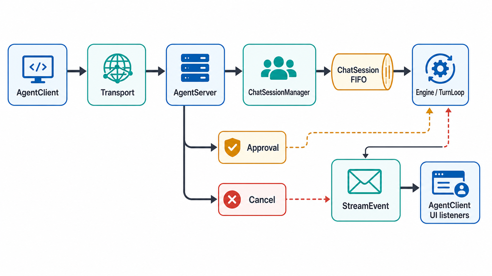
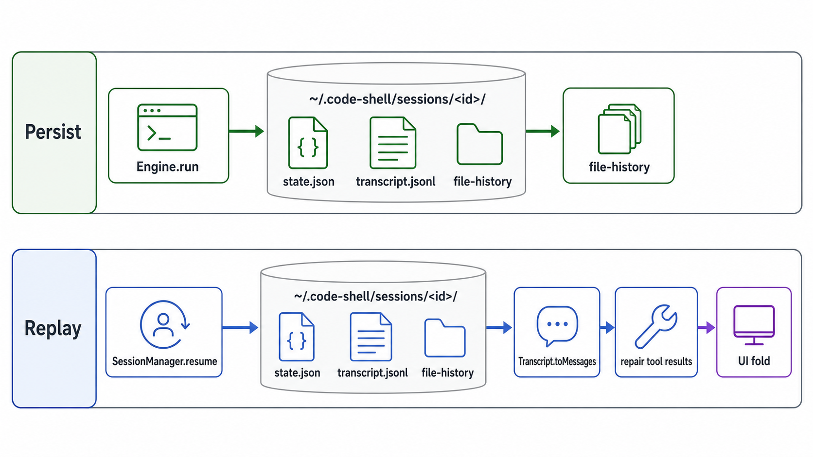

# 04 · Protocol & Sessions

> The transport-agnostic RPC boundary between clients and the engine, plus the on-disk session/replay layer that makes runs durable and resumable. Source-mapped against the current tree under `packages/core/src/protocol/`, `packages/core/src/session/`, the engine's session boundary, and the desktop replay reader.



## 1. Why a protocol at all

Clients do not drive `Engine.run()` directly in the interactive hosts. The TUI REPL builds a shared `ChatSessionManager`, links an in-process transport pair, wraps the manager in `AgentServer`, then hands an `AgentClient` to the UI (`packages/tui/src/cli/commands/repl.ts:224`, `packages/tui/src/cli/commands/repl.ts:228`, `packages/tui/src/cli/commands/repl.ts:235`). The desktop worker does the same over stdio (`packages/core/src/cli/agent-server-stdio.ts:313`, `packages/core/src/cli/agent-server-stdio.ts:330`), and the TCP host accepts socket transports into the same `AgentServer` shape (`packages/core/src/cli/agent-server-tcp.ts:141`).

That seam is intentional: request validation, stream envelopes, approvals, cancellation, background-work wakeups, model switches, config reloads, and session lifetime all pass through one protocol surface. The legacy typed helper still exists for embedders that want one `Engine` wrapped by one `AgentServer` (`packages/core/src/protocol/factories.ts:86`, `packages/core/src/protocol/factories.ts:93`, `packages/core/src/protocol/factories.ts:94`), but the multi-session desktop/TUI/TCP paths are manager-backed.

| File | Role |
|------|------|
| `packages/core/src/protocol/types.ts` | JSON-RPC envelopes, error codes, request/result shapes, method names (`packages/core/src/protocol/types.ts:25`, `packages/core/src/protocol/types.ts:55`, `packages/core/src/protocol/types.ts:333`) |
| `packages/core/src/protocol/server.ts` | `AgentServer`: dispatch, run routing, approvals, query/config, background wakeups, lifecycle (`packages/core/src/protocol/server.ts:110`, `packages/core/src/protocol/server.ts:314`) |
| `packages/core/src/protocol/client.ts` | `AgentClient`: request builder, pending-response map, typed stream/status events (`packages/core/src/protocol/client.ts:63`, `packages/core/src/protocol/client.ts:349`) |
| `packages/core/src/protocol/transport.ts` | `Transport`, `createInProcessTransport`, `StdioTransport` (`packages/core/src/protocol/transport.ts:17`, `packages/core/src/protocol/transport.ts:34`, `packages/core/src/protocol/transport.ts:76`) |
| `packages/core/src/protocol/tcp-transport.ts` | `SocketTransport` and `listenTcp` for NDJSON over TCP (`packages/core/src/protocol/tcp-transport.ts:25`, `packages/core/src/protocol/tcp-transport.ts:69`) |
| `packages/core/src/protocol/chat-session-manager.ts` | Live multi-session container with shared runtime, cap, idle TTL (`packages/core/src/protocol/chat-session-manager.ts:34`) |
| `packages/core/src/protocol/chat-session.ts` | One live engine per chat tab/session, FIFO turn queue, cancellation, deferred model switch (`packages/core/src/protocol/chat-session.ts:40`) |

## 2. Protocol shape and transports

`Transport` is only three methods: `send`, `onMessage`, and `close` (`packages/core/src/protocol/transport.ts:17`). The in-process implementation links two `EventEmitter` channels and delivers messages synchronously (`packages/core/src/protocol/transport.ts:34`). `StdioTransport` frames one JSON value per line, reads with `readline`, writes `JSON.stringify(message) + "\n"`, and skips malformed lines (`packages/core/src/protocol/transport.ts:84`, `packages/core/src/protocol/transport.ts:98`). `SocketTransport` mirrors the same framing over a `Duplex` socket (`packages/core/src/protocol/tcp-transport.ts:24`, `packages/core/src/protocol/tcp-transport.ts:42`); `listenTcp` defaults to `127.0.0.1`, and the file explicitly states v1 has no auth (`packages/core/src/protocol/tcp-transport.ts:14`, `packages/core/src/protocol/tcp-transport.ts:73`).

`RunParams` is now richer than the old "task + cwd" surface: it requires a client-minted `sessionId`, supports `clientMessageId` idempotency, per-run `cwd`, `permissionMode`, `model`, `projectTrusted`, `planMode`, `requireExisting`, and `goal` (`packages/core/src/protocol/types.ts:76`). The method table includes `Run`, `Approve`, `Cancel`, `Configure`, `Query`, `Inject`, `Steer`, `Unsteer`, `CloseSession`, `GoalExtend`, `GoalClear`, `GoalGet`, `BackgroundShells`, and `BackgroundWork` (`packages/core/src/protocol/types.ts:333`). Stream events are always wrapped for multi-session routing as `{ sessionId, event }` (`packages/core/src/protocol/types.ts:311`).

`AgentClient.run()` accepts either the legacy string form or the object form needed by multi-session servers, stamps the logger with the caller/resolved session id, and sends `Methods.Run` (`packages/core/src/protocol/client.ts:107`, `packages/core/src/protocol/client.ts:129`, `packages/core/src/protocol/client.ts:135`). Its private `request()` stores a resolver by JSON-RPC id before transport send, and `handleResponse()` resolves or rejects with the protocol error code attached (`packages/core/src/protocol/client.ts:349`, `packages/core/src/protocol/client.ts:357`). Notifications become emitter events: `agent/streamEvent` re-emits the session envelope, `agent/approvalRequest` emits request id + request, and `agent/status` emits status text (`packages/core/src/protocol/client.ts:375`, `packages/core/src/protocol/client.ts:379`, `packages/core/src/protocol/client.ts:388`, `packages/core/src/protocol/client.ts:396`).

## 3. The run path

The hot path is:

```
AgentClient.run({ sessionId, task, ... })
  -> createRequest(Methods.Run, params)
  -> Transport.send
  -> AgentServer.handleRequest
      -> handleRunMulti
          -> ChatSessionManager.getOrCreate(sessionId, slice)
          -> optional requireExisting / model / planMode gates
          -> ChatSession.enqueueTurn(task, { cwd, goal, onStream, clientMessageId })
              -> ChatSession.pump()
                  -> Engine.run(task, { sessionId, signal, onStream, injected, clientMessageId })
                      -> TurnLoop emits StreamEvent
          -> AgentServer.notify(Methods.StreamEvent, { sessionId, event })
  -> AgentClient emits "stream"
```

The concrete dispatch starts at `handleRequest()` (`packages/core/src/protocol/server.ts:314`). Multi-session runs validate `sessionId` and `task`, create or reuse a `ChatSession`, enforce `requireExisting` by probing `Engine.sessionExistsOnDisk()`, apply a per-run model switch and plan mode, wire ask-user/browser/credential bridges for interactive engines, then enqueue the turn (`packages/core/src/protocol/server.ts:376`, `packages/core/src/protocol/server.ts:380`, `packages/core/src/protocol/server.ts:395`, `packages/core/src/protocol/server.ts:411`, `packages/core/src/protocol/server.ts:422`, `packages/core/src/protocol/server.ts:439`, `packages/core/src/protocol/server.ts:453`, `packages/core/src/protocol/server.ts:470`).

The stream callback wraps every engine event in the session envelope before it leaves the server (`packages/core/src/protocol/server.ts:477`). When the turn resolves, the server returns `RunResult { text, reason, sessionId, turnCount, usage }` and immediately re-checks whether any background completion arrived while the run was busy (`packages/core/src/protocol/server.ts:483`, `packages/core/src/protocol/server.ts:490`, `packages/core/src/protocol/server.ts:496`). The legacy single-engine path still exists for `createServer()` / `createInProcessClient()` callers; it rejects concurrent runs with `Overloaded`, emits `status:"running"`, calls `legacyEngine.run()`, and maps user aborts to a clean `aborted_streaming` result instead of an error (`packages/core/src/protocol/server.ts:507`, `packages/core/src/protocol/server.ts:562`, `packages/core/src/protocol/server.ts:576`, `packages/core/src/protocol/server.ts:600`).

## 4. Live sessions, approvals, and controls

`ChatSessionManager` owns the live in-memory sessions, not the durable transcript. It defaults to 16 sessions and a 30-minute idle TTL, re-applies a changed permission mode to an existing engine between turns, and throws JSON-RPC `Overloaded` when the live cap is hit (`packages/core/src/protocol/chat-session-manager.ts:45`, `packages/core/src/protocol/chat-session-manager.ts:46`, `packages/core/src/protocol/chat-session-manager.ts:49`, `packages/core/src/protocol/chat-session-manager.ts:68`). `sweepIdle()` closes idle, non-busy sessions, while `closeAllAsync()` cancels sessions, kills all background shells, and clears background-agent output files on host shutdown (`packages/core/src/protocol/chat-session-manager.ts:114`, `packages/core/src/protocol/chat-session-manager.ts:132`).

`ChatSession` is the per-tab run queue. `enqueueTurn()` pushes to a FIFO and calls `pump()`; `pump()` sets `active` synchronously, creates an `AbortController`, and invokes `engine.run()` with the resolved session id and stream callback (`packages/core/src/protocol/chat-session.ts:88`, `packages/core/src/protocol/chat-session.ts:203`, `packages/core/src/protocol/chat-session.ts:207`, `packages/core/src/protocol/chat-session.ts:212`). That synchronous `active` assignment is part of the background-wakeup invariant described in `AgentServer.maybeWakeIdleSession()` (`packages/core/src/protocol/server.ts:241`). `cancel()` aborts the controller, rejects queued turns, and sets a sticky "cancelled since last turn" flag so a background completion cannot immediately restart what the user just stopped (`packages/core/src/protocol/chat-session.ts:118`, `packages/core/src/protocol/chat-session.ts:123`, `packages/core/src/protocol/chat-session.ts:126`). A model switch while busy is validated and deferred until the run boundary, then applied in `finally` (`packages/core/src/protocol/chat-session.ts:174`, `packages/core/src/protocol/chat-session.ts:247`).

Approvals are scoped before they cross the transport. `AgentServer` installs the permission callback at construction (`packages/core/src/protocol/server.ts:179`). A tool approval stores a resolver either on the session's `pendingApprovals` map or on the legacy server map, arms a five-minute timeout, and notifies the client with `Methods.ApprovalRequest` (`packages/core/src/protocol/server.ts:1792`, `packages/core/src/protocol/server.ts:1804`, `packages/core/src/protocol/server.ts:1812`, `packages/core/src/protocol/server.ts:1822`). `agent/approve` resolves by `(sessionId, requestId)` in the chat-manager path and refuses stale or misrouted responses (`packages/core/src/protocol/server.ts:640`, `packages/core/src/protocol/server.ts:652`, `packages/core/src/protocol/server.ts:663`). `agent/cancel` aborts the named session and drains session approvals as cancelled so ask-user/browser/tool prompts do not hang after Stop (`packages/core/src/protocol/server.ts:694`, `packages/core/src/protocol/server.ts:716`, `packages/core/src/protocol/server.ts:723`, `packages/core/src/protocol/server.ts:2135`).

AskUser, browser actions, and credential injection all reuse the approval-notification channel in the chat-manager path (`packages/core/src/protocol/server.ts:1837`, `packages/core/src/protocol/server.ts:1882`, `packages/core/src/protocol/server.ts:1965`). `Steer` and `Unsteer` are separate mid-run controls: the server queues a user message into the active turn loop without aborting, and `unsteer` can remove only an item the loop has not consumed yet (`packages/core/src/protocol/server.ts:1721`, `packages/core/src/protocol/server.ts:1744`, `packages/core/src/protocol/server.ts:1758`).

## 5. Background work wakeup

Background completion is a queue plus a bus. `notificationQueue.enqueue()` validates `sessionId`, appends the item to a per-session bucket, synchronously notifies subscribers, then publishes a protocol-facing `background_agent_completed` stream event (`packages/core/src/tool-system/builtin/agent-notifications.ts:75`, `packages/core/src/tool-system/builtin/agent-notifications.ts:86`, `packages/core/src/tool-system/builtin/agent-notifications.ts:92`, `packages/core/src/tool-system/builtin/agent-notifications.ts:199`). The bus itself fans out synchronously over its handlers (`packages/core/src/tool-system/builtin/agent-notifications.ts:165`).

`AgentServer` subscribes in its constructor, forwards the stream event to the client, then calls `maybeWakeIdleSession()` (`packages/core/src/protocol/server.ts:203`, `packages/core/src/protocol/server.ts:216`). The wakeup path runs only for chat-manager sessions that exist, are idle, are not headless, and were not just user-cancelled; it atomically drains the queue, wraps the XML notification in a synthetic `<system-reminder>`, and enqueues a turn with `injected:true` (`packages/core/src/protocol/server.ts:252`, `packages/core/src/protocol/server.ts:266`, `packages/core/src/protocol/server.ts:268`, `packages/core/src/protocol/server.ts:270`). The finalizer calls `maybeWakeIdleSession()` again so work spawned by a wakeup can chain another wakeup after the current turn goes idle (`packages/core/src/protocol/server.ts:300`).

Headless runs are the exception because there may be no later interactive turn to receive a wakeup. Top-level headless `Engine.run()` waits for background sub-agents for the same session, drains their notifications, and summarizes them before returning; it deliberately does not wait for shells or video jobs (`packages/core/src/engine/engine.ts:2146`, `packages/core/src/engine/engine.ts:2152`, `packages/core/src/engine/engine.ts:2155`, `packages/core/src/engine/engine.ts:2175`, `packages/core/src/engine/engine.ts:2186`). The desktop background panel uses `agent/backgroundShells` for shell list/output/kill and `agent/backgroundWork` for a unified list of shells, sub-agents, and jobs (`packages/core/src/protocol/server.ts:878`, `packages/core/src/protocol/server.ts:933`, `packages/core/src/tool-system/builtin/background-work.ts:110`).

## 6. Configure and query

`Configure` can target a live session or the worker/global engine. Per-session configure mutates plan mode, permission mode, model, and model-pool reloads without creating a missing session (`packages/core/src/protocol/server.ts:975`, `packages/core/src/protocol/server.ts:987`, `packages/core/src/protocol/server.ts:1008`). `reloadSettings` requires a `settingsReader`; per-session reload computes a disk-default patch for that engine, while global reload computes per-session patches, increments `configVersion`, and skips a broadcast when the JSON patch set is byte-identical to the previous one (`packages/core/src/protocol/server.ts:1028`, `packages/core/src/protocol/server.ts:1108`, `packages/core/src/protocol/server.ts:1143`, `packages/core/src/protocol/server.ts:1155`).

`Query` borrows the legacy engine or any live manager engine for global reads (`packages/core/src/protocol/server.ts:1167`). The active query set includes tools, live sessions, config, session detail, manual compact, models, providers, arena status, config get/set, permission set, provider add/refresh/delete, and model add/delete (`packages/core/src/protocol/types.ts:208`). The boundary redacts secrets in config/provider results and refuses writes to protected trust/permission fields through generic `config_set` (`packages/core/src/protocol/server.ts:1235`, `packages/core/src/protocol/server.ts:1415`, `packages/core/src/protocol/server.ts:1446`). Manual compact can materialize a missing-but-on-disk session through the manager before calling `Engine.forceCompact()` (`packages/core/src/protocol/server.ts:1279`, `packages/core/src/protocol/server.ts:1302`, `packages/core/src/protocol/server.ts:1333`).

## 7. Sessions on disk and replay



`SessionManager` stores durable sessions under `${CODE_SHELL_HOME:-~/.code-shell}/sessions` (`packages/core/src/session/session-manager.ts:68`, `packages/core/src/session/session-manager.ts:82`). Every public session id is validated before it is joined into a path: empty ids, separators, `..`, unexpected characters, and ids longer than 128 chars are rejected (`packages/core/src/session/session-manager.ts:43`). A current session directory contains:

```
state.json
transcript.jsonl
file-history/
```

`state.json` is the durable `SessionState`: cwd, provider/model, resettable and cumulative usage counters, `turnCount`, conversation `turnSeq`, invoked skills, `parentSessionId`, `origin`, status, summary/title, cost state, and the single persistent `activeGoal` (`packages/core/src/types.ts:191`, `packages/core/src/types.ts:207`, `packages/core/src/types.ts:218`, `packages/core/src/types.ts:226`, `packages/core/src/types.ts:231`, `packages/core/src/types.ts:253`). `create()` materializes the directory, writes `state.json` via temp-file + rename, and appends a `session_meta` transcript event (`packages/core/src/session/session-manager.ts:94`, `packages/core/src/session/session-manager.ts:131`, `packages/core/src/session/session-manager.ts:138`). `saveState()` uses the same atomic temp-file + rename pattern (`packages/core/src/session/session-manager.ts:288`, `packages/core/src/session/session-manager.ts:294`).

`transcript.jsonl` is append-only event history, not chat history. `Transcript.append()` adds an id, timestamp, turn number, data, and flushes one JSON object per line (`packages/core/src/session/transcript.ts:27`, `packages/core/src/session/transcript.ts:209`). `appendMessage()` makes duplicate `clientMessageId` submits idempotent and can mark synthetic background-wakeup messages as `injected` (`packages/core/src/session/transcript.ts:50`). Dedicated event writers cover tool use/results, sub-agent anchors, turn boundaries, stop markers, summaries, and errors (`packages/core/src/session/transcript.ts:79`, `packages/core/src/session/transcript.ts:87`, `packages/core/src/session/transcript.ts:94`, `packages/core/src/session/transcript.ts:99`, `packages/core/src/session/transcript.ts:112`, `packages/core/src/session/transcript.ts:127`).

Replay into the model happens in `Engine.run()`, not in the protocol layer. If `options.sessionId` exists on disk, the engine resumes the session, uses an in-memory compacted cache when available, otherwise derives messages from `Transcript.toMessages()`, patches orphaned assistant `tool_use` blocks, restores cost state, appends the new user message, and immediately writes the in-memory `"active"` status back to disk (`packages/core/src/engine/engine.ts:1387`, `packages/core/src/engine/engine.ts:1390`, `packages/core/src/engine/engine.ts:1396`, `packages/core/src/engine/engine.ts:1404`, `packages/core/src/engine/engine.ts:1412`, `packages/core/src/engine/engine.ts:1421`). A fresh caller-supplied id is created explicitly; otherwise `SessionManager` generates a nanoid (`packages/core/src/engine/engine.ts:1425`). Then `turnSeq` increments once per user message, before any tool snapshot is taken (`packages/core/src/engine/engine.ts:1450`).

`Transcript.toMessages()` maps only LLM-relevant events: `message` becomes a message, `tool_result` becomes a `tool_result` block in a user message, `summary` becomes a system-reminder-style user message, and `turn_boundary` / `session_meta` / `file_history` / `plan_operation` / `error` are omitted (`packages/core/src/session/transcript.ts:135`, `packages/core/src/session/transcript.ts:140`, `packages/core/src/session/transcript.ts:150`, `packages/core/src/session/transcript.ts:171`, `packages/core/src/session/transcript.ts:180`). `Transcript.loadFromFile()` skips malformed lines, restores the turn counter from boundaries, and repairs tool-result pairs (`packages/core/src/session/transcript.ts:256`, `packages/core/src/session/transcript.ts:263`, `packages/core/src/session/transcript.ts:275`). The resume-side message repair is stricter for provider wire validity: `patchOrphanedToolUses()` scans the loaded message array and splices synthetic error `tool_result` blocks immediately after offending assistant messages (`packages/core/src/engine/patch-orphaned-tools.ts:59`, `packages/core/src/engine/patch-orphaned-tools.ts:91`).

Desktop replay is a separate UI projection of the same JSONL. `getSessionTranscript()` reads `<sessionId>/transcript.jsonl`, rejects unsafe ids, converts events to `FoldItem`s, and enriches sub-agent cards from child session dirs (`packages/desktop/src/main/transcript-reader.ts:262`, `packages/desktop/src/main/transcript-reader.ts:270`, `packages/desktop/src/main/transcript-reader.ts:293`). `transcriptToFoldItems()` drops `injected:true` user messages so background wakeups do not render as phantom user bubbles, reconstructs `TodoWrite` task panels from tool args, emits sub-agent start anchors, replays goal progress, and appends a closing `turn_complete` when the final content landed after the last boundary (`packages/desktop/src/main/transcript-reader.ts:81`, `packages/desktop/src/main/transcript-reader.ts:123`, `packages/desktop/src/main/transcript-reader.ts:163`, `packages/desktop/src/main/transcript-reader.ts:194`, `packages/desktop/src/main/transcript-reader.ts:229`, `packages/desktop/src/main/transcript-reader.ts:250`).

The desktop sidebar can also rebuild from disk. `listDiskSessions()` enumerates session directories asynchronously, filters out legacy entries without `parentSessionId`, filters sub-agents, shows only `origin:"desktop"` and `origin:"automation"`, skips deleted project cwd values, and prefers persisted `title` over first-message `summary` (`packages/desktop/src/main/sessions-service.ts:105`, `packages/desktop/src/main/sessions-service.ts:119`, `packages/desktop/src/main/sessions-service.ts:152`, `packages/desktop/src/main/sessions-service.ts:156`, `packages/desktop/src/main/sessions-service.ts:164`, `packages/desktop/src/main/sessions-service.ts:170`).

## 8. File history, undo, and redo

File history lives under the session directory's `file-history/` folder (`packages/core/src/session/file-history.ts:94`). The on-disk index is v2: `snapshots`, `redoRecords`, and `created` markers (`packages/core/src/session/file-history.ts:76`, `packages/core/src/session/file-history.ts:396`). `saveSnapshot()` stores a content-hashed pre-edit backup, deduped per `(path, content, turnSeq)`, and `recordCreated()` marks files that did not exist before a turn (`packages/core/src/session/file-history.ts:107`, `packages/core/src/session/file-history.ts:115`, `packages/core/src/session/file-history.ts:169`).

The engine registers a run-scoped `on_tool_start` hook before the loop starts. It snapshots existing files before `Write`/`Edit`, records created files when the pre-edit snapshot is absent, and snapshots every existing `ApplyPatch` target before patch application (`packages/core/src/engine/engine.ts:1889`, `packages/core/src/engine/engine.ts:1900`, `packages/core/src/engine/engine.ts:1906`, `packages/core/src/engine/engine.ts:1912`, `packages/core/src/engine/engine.ts:1915`). The hook is unregistered in the run `finally`, so repeated runs do not stack duplicate snapshot hooks (`packages/core/src/engine/engine.ts:2196`).

Turn-level undo is driven by `turnSeq`, not wall-clock time. `latestTurnUndoTargets()` selects the greatest non-undone `turnSeq` and, within that turn, each file's earliest snapshot so multiple edits to one file revert to the pre-turn baseline (`packages/core/src/session/undo-target.ts:77`, `packages/core/src/session/undo-target.ts:96`). `undoLatestTurn()` captures redo material, deletes turn-created files, restores modified files, and marks the turn's snapshots/created markers as `undone` instead of deleting them (`packages/core/src/session/file-history.ts:267`, `packages/core/src/session/file-history.ts:279`, `packages/core/src/session/file-history.ts:289`, `packages/core/src/session/file-history.ts:307`, `packages/core/src/session/file-history.ts:315`). `latestRedoTargets()` allows redo only while no newer live snapshot supersedes the undone turn, and `redoLatestTurn()` reapplies the stashed post-turn files and clears `undone` (`packages/core/src/session/undo-target.ts:124`, `packages/core/src/session/file-history.ts:337`). Diff previews use a small LCS diff with CRLF normalization (`packages/core/src/session/simple-diff.ts:19`, `packages/core/src/session/simple-diff.ts:61`).

## 9. Runtime singletons (`state.ts`)

`state.ts` is process-level compatibility state, not durable session state. It holds the early/default session id, lazy `originalCwd` and `projectRoot` fallbacks, interactivity/trust flags, token/cost counters, model usage, feature flags, hook registries, prompt section cache, invoked skill tracking, and assorted compatibility stubs (`packages/core/src/state.ts:19`, `packages/core/src/state.ts:34`, `packages/core/src/state.ts:39`, `packages/core/src/state.ts:46`, `packages/core/src/state.ts:83`, `packages/core/src/state.ts:186`, `packages/core/src/state.ts:251`, `packages/core/src/state.ts:261`). Most analytics counters are no-op counters and most FD/OAuth/Codex compatibility functions are stubs (`packages/core/src/state.ts:186`, `packages/core/src/state.ts:321`).

## 10. Where to read next

- What the server ultimately drives: [01 · Engine & turn loop](01-engine-and-turn-loop.md)
- Tools, permissions, and approvals behind `ApprovalRequest`: [02 · Tool system](02-tool-system.md)
- Long-running background work and goals that wake sessions: [06 · Long-running orchestration](06-long-running-orchestration.md)
- The desktop worker, disk rebuild, and mobile projection that ride this protocol: [10 · Desktop & mobile](10-desktop-and-mobile.md)
