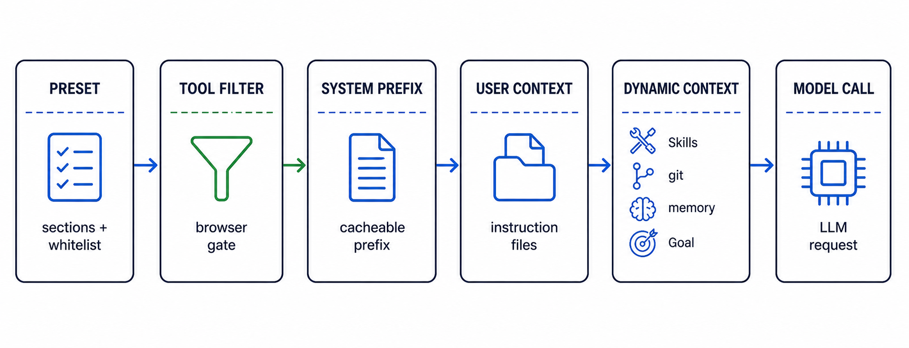
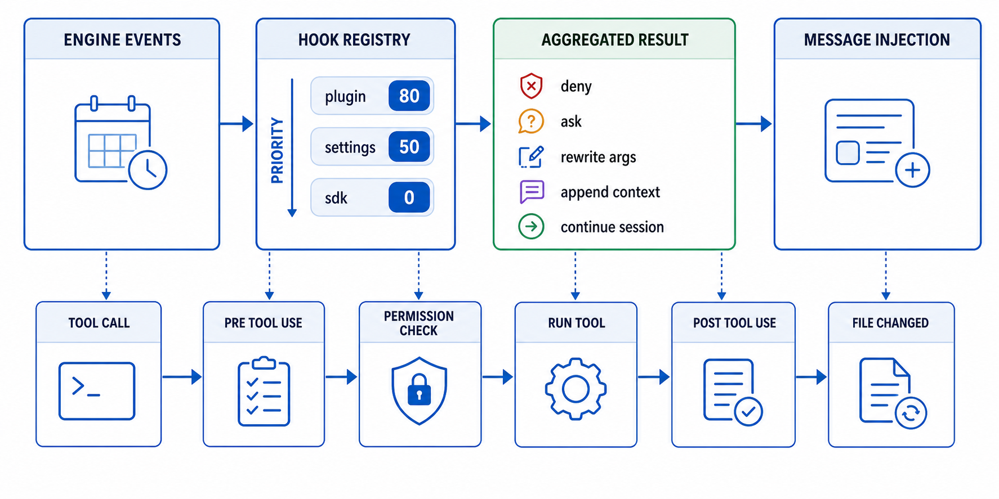

# 05 · Presets, Prompt, Hooks, Skills

> How CodeShell stays domain-agnostic: core presets and capability-contributed presets pick behavior and visible tools; prompt assembly turns stable sections plus volatile provider context into one model request; hooks intercept lifecycle/tool boundaries; skills add lightweight capability text. Source-mapped against `packages/core/src/preset/`, `prompt/`, `capabilities/`, `hooks/`, `skills/`, `packages/coding/`, and the plugin hook loader.

This is where the README's central claim lives: the core carries mechanism, not coding policy. Coding behavior is a physically separate capability package, not a core fork.

## 1. Presets and capability composition

A preset is the bundle that turns the generic engine into a specific agent. The current `AgentPreset` fields are `name`, `label`, `description`, ordered `promptSections`, `builtinTools`, and `defaultPermissionRules`.

```ts
interface AgentPreset {
  name: AgentPresetName;
  label: string;
  description: string;
  promptSections: readonly string[];
  builtinTools: string[];
  defaultPermissionRules: PermissionRule[];
}
```

Two built-ins are defined in core's `BUILTIN_AGENT_PRESETS`:

- **`harness-min`** (`DEFAULT_AGENT_PRESET`) — a domain-neutral prompt and minimal reusable tool surface. This is what a core-only Engine selects.
- **`general`** — the broader CodeShell orchestration profile.

`@cjhyy/code-shell-capability-coding` contributes **`terminal-coding`** and a coding-enhanced `general` profile. It also declares `terminal-coding` as its host default. Therefore the TUI/Desktop keep their coding behavior while a consumer that installs only core gets `harness-min`.

`CapabilityModule` is the composition boundary. A module can contribute tools, presets, a default preset, prompt sections, volatile context providers, an instruction boundary, capability-private tool services, file-history targets, artifact detectors, and session-workspace validation. Engine composes core plus installed modules per instance; TUI/Desktop also register the coding module at their process roots.

**The tool whitelist is the first visibility gate.** Tool entries carry exhaustive `presetTags` metadata next to their implementation, and `derivePresetExposure()` derives each preset's tool names and permission rules. `resolveBuiltinToolNames()` then applies explicit enabled/disabled overrides and capability host adjustments before `ToolRegistry` installs the selected catalog entries. This removes the old hand-maintained registration/whitelist duplication.

**Tool-gated sections** keep prompt instructions aligned with visible tools. `buildPresetSystemPrompt()` filters `preset.promptSections` through `TOOL_GATED_SECTIONS` when `activeToolNames` are passed (`preset/index.ts:299`). Today the only gate is `browser`, which survives only if one of `browser_observe`, `browser_act`, or `browser_navigate` is active (`preset/index.ts:258`, `preset/index.ts:265`). Windows shell guidance is appended from the same function when `platform === "win32"` (`preset/index.ts:280`, `preset/index.ts:315`).

Default permission rules are part of the preset, but they do not expose a tool by themselves; visibility still comes from `builtinTools`.

## 2. Prompt assembly (`prompt/`)



| File                            | Role                                                                                        | LOC |
| ------------------------------- | ------------------------------------------------------------------------------------------- | --- |
| `prompt/composer.ts`            | `PromptComposer` — stable system prefix, user instruction context, volatile dynamic context | 310 |
| `prompt/section-cache.ts`       | `SectionCache` — per-section memoization with `cacheBreak` bypass                           | 43  |
| `prompt/section-loader.ts`      | `loadSection`/`loadSections`/`registerSection` over builtin and custom markdown sections    | 62  |
| `prompt/instruction-scanner.ts` | `scanInstructions`/`combineInstructions` for user/project/local instruction files           | 241 |

Engine-level assembly happens in `Engine.run()`, not inside the composer alone. The engine emits `on_session_start` and `user_prompt_submit` first (`engine/engine.ts:1498`, `engine/engine.ts:1508`), builds a `PromptComposer` with the resolved preset plus disabled skill/plugin lists (`engine/engine.ts:1627`), computes the per-turn visible tool definitions (`engine/engine.ts:1747`), then builds the stable system prompt and volatile dynamic context in parallel (`engine/engine.ts:1776`). After that it prepends instruction context, injects lifecycle hook reminders before the latest user task, and appends dynamic context at the very end (`engine/engine.ts:1784`, `engine/engine.ts:1790`, `engine/engine.ts:1804`).

The stable system prefix comes from `PromptComposer.buildSystemPrompt()` (`prompt/composer.ts:69`). Its sections are assembled in this order:

1. `runtime_header`: model, cwd, platform, shell (`prompt/composer.ts:196`).
2. Optional `custom_system` (`prompt/composer.ts:210`).
3. `tool_definitions`: tool name plus one-line description only; schemas ride in the provider-native tool field instead of being duplicated in text (`prompt/composer.ts:218`).
4. `behavior`: preset markdown sections, recomputed every time with active tool names so tool-gated sections cannot go stale (`prompt/composer.ts:235`, `prompt/composer.ts:248`).
5. Optional `append_system` (`prompt/composer.ts:262`).
6. Optional `personalization`: response language and user profile (`prompt/composer.ts:270`).

`SectionCache.resolve()` caches by section name, but a section with `cacheBreak` bypasses reuse and recomputes before being stored again (`prompt/section-cache.ts:15`). The `behavior` section deliberately sets `cacheBreak: true` because its content depends on the active tool set (`prompt/composer.ts:240`).

Prompt section files are loaded from `prompt/sections/*.md` at module load (`prompt/section-loader.ts:11`, `prompt/section-loader.ts:15`). Runtime consumers can add custom sections with `registerSection()`, and `loadSection()` checks builtins before custom sections (`prompt/section-loader.ts:30`, `prompt/section-loader.ts:39`).

Instruction context is a separate user-role `<system-reminder>` built by `buildUserContextMessage()` (`prompt/composer.ts:78`). It injects the local date using local calendar fields, not UTC (`prompt/composer.ts:89`), then appends `combineInstructions(scanInstructions(...))` (`prompt/composer.ts:289`). `compatFileNamesFrom()` controls whether `CLAUDE.md` and/or `AGENTS.md` are included as compat names while `CODESHELL.md` remains the primary file (`engine/engine.ts:153`).

`scanInstructions()` currently scans:

- user-level `~/.code-shell/{CODESHELL.md,CLAUDE.md,AGENTS.md}` plus `~/.code-shell/rules/*.md`, then compat `~/.claude/*` (`prompt/instruction-scanner.ts:67`);
- project directories from a capability/host-supplied boundary down to cwd, including directory-level instruction files, `.codeshell/`, extra `scanDirs`, `.claude/`, and sorted `rules/*.md`; core defaults the boundary to cwd and never executes a VCS command;
- local override files named `*.local.md` (`prompt/instruction-scanner.ts:105`).

Entries are de-duped by path with first occurrence winning (`prompt/instruction-scanner.ts:218`). `combineInstructions()` returns a single entry as-is, or joins multiple entries with source labels and separators (`prompt/instruction-scanner.ts:121`).

Dynamic context is intentionally past the cache breakpoint. `buildDynamicContextMessage()` scans skills with the same disabled/allowlist options the Skill tool enforces, invokes generic capability context providers, appends memory index context, and appends active-goal tool guidance. The returned message is a trailing user-role `<system-reminder>`. Repository status formatting and commands live in the coding package's provider; `PromptComposer` only invokes provider contracts and swallows optional-provider failures.

## 3. Hooks (`hooks/` + plugin hook loader)



| File                           | Role                                                                                | LOC |
| ------------------------------ | ----------------------------------------------------------------------------------- | --- |
| `hooks/events.ts`              | `HookEventName`, `HookContext`, `HookResult`; 17 typed events, 16 currently emitted | 156 |
| `hooks/registry.ts`            | `HookRegistry` — priority ordering, aggregation, unregister/reload helpers          | 163 |
| `hooks/inject.ts`              | `wrapHookMessages()` — pack hook messages into one `<system-reminder>`              | 30  |
| `hooks/shell-runner.ts`        | settings shell hooks: child process protocol, timeout, caps, fail-silent handling   | 244 |
| `hooks/hook-output.ts`         | shared output cap and `HookResult` validator                                        | 73  |
| `plugins/loadPluginHooks.ts`   | plugin `hooks/hooks.json` scanner, CC event mapping, priority 80 registration       | 302 |
| `plugins/pluginCommandHook.ts` | plugin command-hook subprocess protocol and CC/Cursor/SDK output normalization      | 244 |

`HookEventName` contains 17 names (`hooks/events.ts:91`). `pre_compact` is reserved but not emitted; current code emits `post_compact` after a non-micro compaction instead (`hooks/events.ts:85`, `engine/turn-loop.ts:652`). The currently emitted set spans session start/end, agent start/end, user prompt submit, turn start/end, stop, tool start/end, permission checks, pre/post tool use, file changes, post-compaction, and background-agent notifications (`hooks/events.ts:8`).

`HookRegistry.register()` stores handlers per event and sorts by descending priority (`hooks/registry.ts:37`). `emit()` builds one mutable `HookContext`, runs handlers in order, and aggregates results (`hooks/registry.ts:78`):

- `data` is merged into both the running context and aggregate result (`hooks/registry.ts:88`);
- `messages` are appended (`hooks/registry.ts:92`);
- permission `decision` keeps the strictest value, `deny > ask > allow` (`hooks/registry.ts:10`, `hooks/registry.ts:95`);
- `updatedInput` and `updatedPrompt` are last-write-wins (`hooks/registry.ts:101`);
- `additionalContext` is appended with blank-line separators (`hooks/registry.ts:109`);
- any `continueSession` keeps the aggregate true for `on_stop` (`hooks/registry.ts:116`);
- `stop` stops the hook chain only; it is not the same as stopping the agent (`hooks/registry.ts:120`, `hooks/events.ts:121`).

There are three hook sources in the engine constructor: plugin hooks at priority 80, settings shell hooks at priority 50, and SDK/config hooks at their supplied priority, defaulting through the registry to 0 (`engine/engine.ts:610`, `engine/engine.ts:628`, `engine/engine.ts:631`). `reloadHooks()` surgically unregisters prior settings handlers, removes plugin handlers by the `plugin:` name prefix, reloads plugin hooks with fresh disabled lists, invalidates settings, and re-registers settings hooks (`engine/engine.ts:543`). Sub-agents skip both settings and plugin hook registration (`engine/engine.ts:506`, `engine/engine.ts:617`).

Hook message injection is caller-owned. Handlers return raw markdown strings; `wrapHookMessages()` trims blanks and wraps the combined body in one user-role `<system-reminder>` (`hooks/inject.ts:21`). Engine uses it for session-start/prompt-submit messages before the user task (`engine/engine.ts:1793`), TurnLoop uses it for `on_turn_start`, `post_compact`, and blocked `on_stop` continuations (`engine/turn-loop.ts:590`, `engine/turn-loop.ts:661`, `engine/turn-loop.ts:902`).

The tool-call hook lifecycle is implemented in `ToolExecutor.executeSingle()`:

```
visibility / plan / MCP gates                 tool-system/executor.ts:139
input schema validation                       tool-system/executor.ts:250
pre_tool_use                                  tool-system/executor.ts:264
  └─ may deny, ask, or rewrite args           tool-system/executor.ts:270 / tool-system/executor.ts:282 / tool-system/executor.ts:334
declared path policy                          tool-system/executor.ts:302
permission classifier                         tool-system/executor.ts:366
on_permission_check                           tool-system/executor.ts:381
on_tool_start                                 tool-system/executor.ts:433
registry.executeTool                          tool-system/executor.ts:456
on_tool_end                                   tool-system/executor.ts:507
post_tool_use                                 tool-system/executor.ts:516
  └─ may append additional model context      tool-system/executor.ts:527
file_changed for successful Write/Edit        tool-system/executor.ts:540
```

The executor clamps hook authority: `pre_tool_use` can ask or deny and can rewrite args, but an attempted `"allow"` cannot pre-approve a tool (`tool-system/executor.ts:316`). `on_permission_check` can downgrade or ask, but `clampHookDecision()` rejects promotion from classifier ask/deny to allow (`tool-system/executor.ts:44`, `tool-system/executor.ts:381`).

Settings shell hooks are trusted child processes. `runShellHook()` spawns `config.command` with `shell: true`, optional `cwd`, and env `CODESHELL_HOOK_EVENT`/`CODESHELL_HOOK_CWD` (`hooks/shell-runner.ts:49`, `hooks/shell-runner.ts:58`). The full hook context goes to stdin as JSON (`hooks/shell-runner.ts:206`). `shellHookMatches()` treats `matcher` as a regex over `ctx.data.toolName`; with a matcher and no tool name, the hook does not fire (`hooks/shell-runner.ts:227`). Exit 0 parses stdout as `HookResult`; exit 2 becomes `decision: "deny"` with stderr as the message; malformed output, timeout, oversized stdout, spawn errors, and other non-zero exits return `{}` so a bad hook does not wedge the turn (`hooks/shell-runner.ts:156`, `hooks/shell-runner.ts:187`, `hooks/shell-runner.ts:87`, `hooks/shell-runner.ts:98`). `validateHookResult()` rejects unknown keys and malformed field types (`hooks/hook-output.ts:36`).

Plugin hooks are CC-compatible command hooks loaded from each installed plugin's `hooks/hooks.json` (`plugins/loadPluginHooks.ts:1`). Event names are mapped from CC PascalCase to CodeShell snake_case; notably `Stop` maps to `on_session_end`, while goal-mode continuation uses CodeShell's separate `on_stop` event (`plugins/loadPluginHooks.ts:25`, `plugins/loadPluginHooks.ts:56`). `SubagentStop` is skipped, and `PreCompact` maps to the reserved `pre_compact` event that currently has no emitter (`plugins/loadPluginHooks.ts:30`, `plugins/loadPluginHooks.ts:64`). A disabled plugin contributes no hooks, and a `disabledPluginHooks` key can suppress one hook while leaving the plugin active (`plugins/loadPluginHooks.ts:159`, `plugins/loadPluginHooks.ts:166`).

Plugin command hooks use a different subprocess protocol from settings hooks. They receive `CODESHELL_PLUGIN_ROOT` plus `CODESHELL_HOOK_EVENT`, and stdout is normalized from CC/Cursor/SDK additional-context shapes into `HookResult.messages` (`plugins/pluginCommandHook.ts:20`, `plugins/pluginCommandHook.ts:57`, `plugins/pluginCommandHook.ts:91`, `plugins/pluginCommandHook.ts:226`). Non-zero exit, timeout, oversized output, or non-JSON stdout is a no-op (`plugins/pluginCommandHook.ts:142`, `plugins/pluginCommandHook.ts:198`, `plugins/pluginCommandHook.ts:212`).

Goal mode is built on this same hook chain. When a run has an active goal, Engine registers a run-scoped `GoalStopHook` on `on_stop` (`engine/engine.ts:1936`, `engine/engine.ts:2000`). If the model tries to stop and the judge says the goal is not met, the hook returns `continueSession: true`; TurnLoop injects the hook guidance and runs another turn, bounded by `maxStopBlocks` and `maxTurns` (`hooks/goal-stop-hook.ts:172`, `engine/turn-loop.ts:871`).

## 4. Skills (`skills/` + Skill tool)

| File                                  | Role                                                                                                          | LOC |
| ------------------------------------- | ------------------------------------------------------------------------------------------------------------- | --- |
| `skills/scanner.ts`                   | discover project/user/plugin `SKILL.md`, namespace plugin skills, memoize scans, apply disabled/allow filters | 298 |
| `skills/frontmatter.ts`               | CC-compatible YAML frontmatter parser and description coercion                                                | 82  |
| `skills/index.ts`                     | barrel export for scanner APIs                                                                                | 8   |
| `tool-system/builtin/skill-prompt.ts` | render grouped `# Available Skills` listing                                                                   | 56  |
| `tool-system/builtin/skill.ts`        | `Skill` builtin dispatch; enforce disabled lists and sub-agent allowlists                                     | 96  |

`scanSkills(cwd, opts?)` discovers `SKILL.md` files from three sources:

- project skills under `<cwd>/.code-shell/skills/<name>/SKILL.md` (`skills/scanner.ts:41`);
- user skills under `~/.code-shell/skills/<name>/SKILL.md`, honoring `process.env.HOME` for tests/overrides (`skills/scanner.ts:33`, `skills/scanner.ts:44`);
- installed plugin skills under `<plugin installPath>/skills/<name>/SKILL.md`, namespaced as `<plugin>:<name>` (`skills/scanner.ts:138`, `skills/scanner.ts:168`).

The directory name is authoritative. If frontmatter `name` disagrees, the scanner warns and uses the directory name; plugin skills get the plugin prefix after that (`skills/scanner.ts:74`, `skills/scanner.ts:81`, `skills/scanner.ts:90`). `frontmatter.ts` strips leading YAML frontmatter, retries with quoted problematic scalar values, and coerces `description` to a string (`skills/frontmatter.ts:18`, `skills/frontmatter.ts:43`, `skills/frontmatter.ts:77`).

Scanning is memoized by cwd, user home, installed-plugin manifest mtime, and local skills directory mtimes (`skills/scanner.ts:225`). Adding/removing a skill changes directory mtime and busts the cache passively; editing an existing `SKILL.md` does not, so install/update paths call `invalidateSkillCache()` explicitly (`skills/scanner.ts:204`, `skills/scanner.ts:296`).

Filters are applied after the memoized full scan so different views can reuse the same scan result. `disabledSkills` matches exact skill names including plugin prefixes, `disabledPlugins` drops every skill whose name starts with `<plugin>:`, and `skillAllowlist` is hard isolation for sub-agents; an empty allowlist means no skills (`skills/scanner.ts:231`, `skills/scanner.ts:259`, `skills/scanner.ts:279`).

The prompt and dispatch path intentionally mirror each other. `PromptComposer.buildDynamicContextMessage()` calls `scanSkills()` with disabled skills/plugins and the skill allowlist, then renders `buildSkillListing()` (`prompt/composer.ts:157`, `tool-system/builtin/skill-prompt.ts:22`). The listing groups plain user/project skills under `用户 / 项目`, plugin skills under their namespace, and sorts both groups and entries for stable layout (`tool-system/builtin/skill-prompt.ts:25`, `tool-system/builtin/skill-prompt.ts:38`).

The `Skill` builtin is read-only and concurrency-safe in the builtin table (`tool-system/builtin/index.ts:526`). At dispatch, `skillTool()` refuses a skill outside a sub-agent allowlist, a disabled exact skill, or a skill from a disabled plugin before scanning, so the user gets a precise disabled-vs-not-found message (`tool-system/builtin/skill.ts:54`, `tool-system/builtin/skill.ts:61`, `tool-system/builtin/skill.ts:64`, `tool-system/builtin/skill.ts:67`). It then scans from `ctx.cwd`, finds the selected definition, substitutes `$ARGUMENTS`, `{args}`, `${CODESHELL_SKILL_DIR}`, and `${CLAUDE_SKILL_DIR}`, and returns the skill body with its base directory (`tool-system/builtin/skill.ts:77`, `tool-system/builtin/skill.ts:89`).

Sub-agent skill isolation is threaded from role definitions into the child Engine. `EngineConfig.skillAllowlist` documents the contract (`engine/types.ts:117`), `ToolContext.skillAllowlist` carries it to tool dispatch (`tool-system/context.ts:118`, `tool-system/context.ts:268`), and plugin-bundled agent roles have bare skill names rewritten to `<plugin>:<skill>` so their allowlist matches scanner output (`tool-system/builtin/agent.ts:94`, `tool-system/builtin/agent.ts:109`).

## 5. The assembly, end to end

```
Engine constructor
  ├─ resolveAgentPreset(config.preset)                  preset/index.ts:243
  ├─ resolveBuiltinToolNames(...)                       preset/index.ts:320
  ├─ new ToolRegistry({ builtinTools })                 engine/engine.ts:600
  ├─ loadPluginHooks(priority 80)                       engine/engine.ts:610
  ├─ registerSettingsHooks(priority 50)                 engine/engine.ts:506
  └─ register SDK/config hooks                          engine/engine.ts:631

Engine.run()
  ├─ emit on_session_start / user_prompt_submit         engine/engine.ts:1498 / engine/engine.ts:1508
  ├─ build folded disabled skill/plugin lists           engine/engine.ts:1627
  ├─ assemble visible toolDefs                          engine/engine.ts:1747
  ├─ PromptComposer.buildSystemPrompt(toolDefs)         engine/engine.ts:1776
  ├─ buildUserContextMessage()                          engine/engine.ts:1784
  ├─ wrap lifecycle hook messages before user task      engine/engine.ts:1790
  └─ append buildDynamicContextMessage()                engine/engine.ts:1804

Per turn
  ├─ on_turn_start / post_compact reminders             engine/turn-loop.ts:590 / engine/turn-loop.ts:661
  ├─ model call with stable system + messages           engine/turn-loop.ts:672
  ├─ tool calls through ToolExecutor hook pipeline      tool-system/executor.ts:119
  └─ on_stop may continue the session                   engine/turn-loop.ts:871
```

## 6. Where to read next

- The tools the whitelist gates and the executor hook path: [02 · Tool system](02-tool-system.md)
- Goal-mode `on_stop` behavior and background wakeups: [06 · Long-running orchestration](06-long-running-orchestration.md)
- Plugin installation, capability toggles, credentials, and memory: [07 · Plugins, capabilities, credentials, memory](07-plugins-capabilities-credentials-memory.md)
