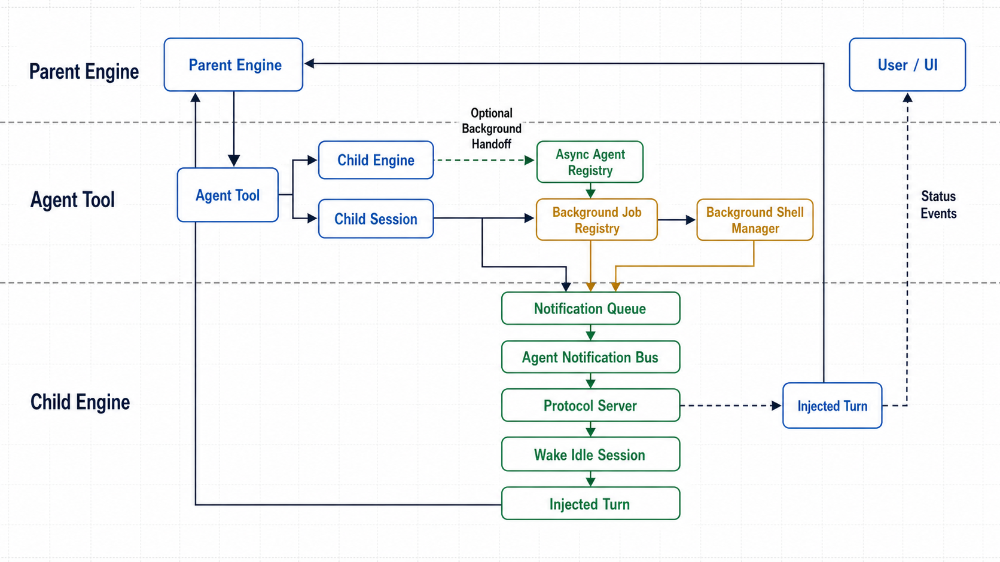
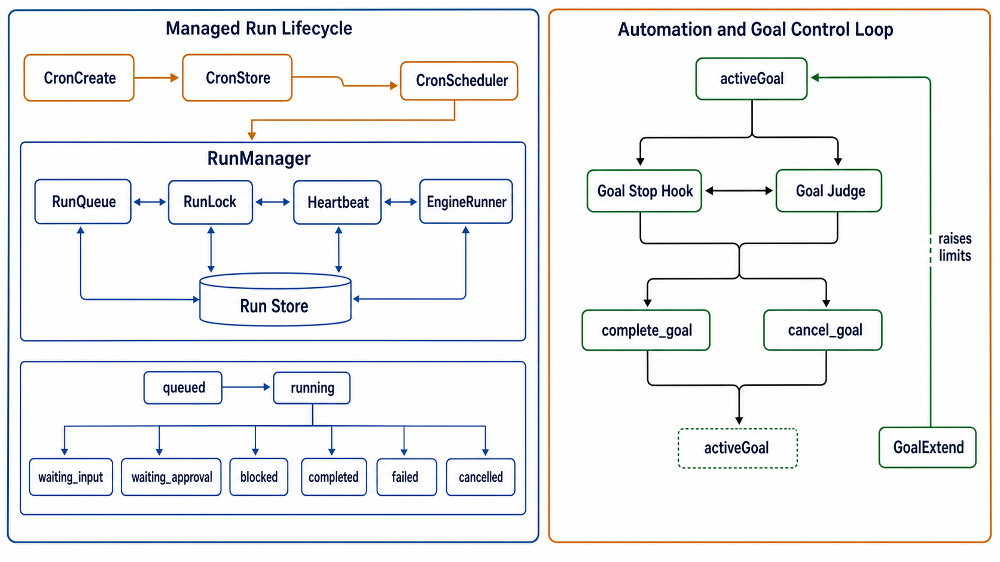

# 06 · Long-Running Orchestration

> Runs, sub-agents, background work, tasks, cron, and persistent goals — the
> machinery for work that can outlive a single interactive prompt. Source-mapped
> against the current `packages/core/src/` tree.

## 1. Managed runs (`packages/core/src/run/`)

`RunManager` wraps an `Engine` run in a persistent state machine: submit,
queue, execute, checkpoint, suspend for approval/input, resume, cancel, recover,
and finally evaluate (`packages/core/src/run/RunManager.ts:90`,
`packages/core/src/run/RunManager.ts:115`, `packages/core/src/run/RunManager.ts:422`).

| File | Role | LOC |
|------|------|-----|
| `packages/core/src/run/RunManager.ts` | Top-level orchestrator: submit/resume/cancel, transitions, recovery, stream capture | 814 |
| `packages/core/src/run/types.ts` | `RunStatus`, snapshots, events, approvals, checkpoints, valid transitions | 213 |
| `packages/core/src/run/RunQueue.ts` | In-process FIFO with deduplication and configurable concurrency | 96 |
| `packages/core/src/run/FileRunStore.ts` | Filesystem snapshots, JSONL events, checkpoints, approvals, artifacts | 259 |
| `packages/core/src/run/RunLock.ts` | Cross-process advisory lock on `runs/<id>/run.json` | 164 |
| `packages/core/src/run/Heartbeat.ts` | Periodic liveness file plus stale/process-alive probes | 141 |
| `packages/core/src/run/EngineRunner.ts` | Bridges a `RunSnapshot` into `Engine.run` through an in-process protocol client | 265 |
| `packages/core/src/run/RunApprovalBackend.ts` | Suspends the engine for approval and user input | 154 |
| `packages/core/src/run/CheckpointWriter.ts` | Phase-boundary and periodic checkpoint extraction from stream events | 169 |
| `packages/core/src/run/ArtifactTracker.ts` | Records meaningful file/git artifacts from successful tool results | 188 |
| `packages/core/src/run/Evaluator.ts` | Post-run quality gate abstraction | 107 |
| `packages/core/src/run/factory.ts` | `createRunManager` convenience factory | 120 |

### Run state

The legal states are `queued`, `running`, `waiting_input`, `waiting_approval`,
`blocked`, `completed`, `failed`, and `cancelled`
(`packages/core/src/run/types.ts:12`). `VALID_TRANSITIONS` keeps terminal
states terminal and routes suspended states back through `queued`
(`packages/core/src/run/types.ts:197`). `RunManager.transition` enforces that
graph before persisting snapshots and emitting events
(`packages/core/src/run/RunManager.ts:746`).

`submit()` creates a queued snapshot, saves it, emits `run_created` and
`run_queued`, then enqueues the run (`packages/core/src/run/RunManager.ts:115`).
`RunQueue` deduplicates run IDs and only starts work up to the concurrency cap,
defaulting to one active run (`packages/core/src/run/RunQueue.ts:14`,
`packages/core/src/run/RunQueue.ts:32`, `packages/core/src/run/RunQueue.ts:65`).

`executeRun()` acquires the cross-process `RunLock`, starts a heartbeat, moves
the snapshot to `running`, wires checkpoint/artifact trackers, and stores the
live execution handle before awaiting the engine result
(`packages/core/src/run/RunManager.ts:422`, `packages/core/src/run/RunManager.ts:448`,
`packages/core/src/run/RunManager.ts:462`, `packages/core/src/run/RunManager.ts:526`).
The stream hook links the protocol session as soon as `session_started` arrives
and ignores sub-agent `session_started` events tagged with `agentId`
(`packages/core/src/run/RunManager.ts:496`).

### Persistence, locks, and recovery

`FileRunStore` writes snapshots atomically with `.tmp` plus rename and serializes
JSONL appends through a per-file promise lock
(`packages/core/src/run/FileRunStore.ts:58`, `packages/core/src/run/FileRunStore.ts:76`).
`RunLock` now uses the shared lockfile wrapper, waits briefly for the lock target
to appear, distinguishes missing targets from held locks, and can force-unlock
stale locks (`packages/core/src/run/RunLock.ts:11`,
`packages/core/src/run/RunLock.ts:49`, `packages/core/src/run/RunLock.ts:141`).
`Heartbeat` writes immediately, unrefs its timer, treats entries stale after the
configured window, and uses `process.kill(pid, 0)` as the process-alive probe
(`packages/core/src/run/Heartbeat.ts:41`, `packages/core/src/run/Heartbeat.ts:92`,
`packages/core/src/run/Heartbeat.ts:102`).

On startup, `recover()` scans runs left in `running`, checks heartbeat freshness
and process liveness, requeues stale/dead runs, and blocks a run after three
attempts (`packages/core/src/run/RunManager.ts:345`). Stale `waiting_*` runs are
only force-unlocked; they stay suspended until explicit input, approval, or
cancel arrives (`packages/core/src/run/RunManager.ts:394`).

### Suspension and completion

Approvals are fail-closed: if run hooks are not wired, `RunApprovalBackend`
denies instead of silently approving (`packages/core/src/run/RunApprovalBackend.ts:58`).
When hooks exist, approval waits can last up to 24 hours
(`packages/core/src/run/RunApprovalBackend.ts:71`). `createRunAskUserFn` gives
input prompts the same suspension model and supersedes an older pending question
if a newer one arrives (`packages/core/src/run/RunApprovalBackend.ts:110`).
`RunManager` persists a `waiting_approval` or `waiting_input` checkpoint and
resolves the live handle when the host resumes it
(`packages/core/src/run/RunManager.ts:650`, `packages/core/src/run/RunManager.ts:711`,
`packages/core/src/run/RunManager.ts:167`).

`EngineRunner` runs through an in-process `AgentServer`/`AgentClient`, not a
direct engine call, so managed runs share the protocol path described in
[04](04-protocol-and-sessions.md) (`packages/core/src/run/EngineRunner.ts:214`,
`packages/core/src/run/EngineRunner.ts:244`). It injects the automation prompt
note that tells unattended runs not to ask the user and to persist useful memory
once (`packages/core/src/run/EngineRunner.ts:32`,
`packages/core/src/run/EngineRunner.ts:51`). After the engine returns,
`RunManager` writes a final checkpoint, evaluates the result, and transitions to
`completed` or `failed`; engine errors transition to `blocked`
(`packages/core/src/run/RunManager.ts:557`, `packages/core/src/run/RunManager.ts:580`,
`packages/core/src/run/RunManager.ts:597`, `packages/core/src/run/RunManager.ts:627`).

## 2. Sub-agents and background work

Sub-agents are ordinary child engine runs exposed through the `Agent`,
`AgentStatus`, `AgentCancel`, and `AgentSendInput` tools
(`packages/core/src/tool-system/builtin/agent.ts:203`,
`packages/core/src/tool-system/builtin/agent.ts:906`,
`packages/core/src/tool-system/builtin/agent.ts:980`,
`packages/core/src/tool-system/builtin/agent.ts:1013`). Background work is a
set of session-scoped registries that cover sub-agents, shell processes, video
pollers, and external Claude Code runs.

| File | Role | LOC |
|------|------|-----|
| `packages/core/src/tool-system/builtin/agent.ts` | Agent tools, sync/background handoff, status/cancel/send-input | 1147 |
| `packages/core/src/tool-system/builtin/agent-registry.ts` | Process-local async sub-agent registry | 200 |
| `packages/core/src/tool-system/builtin/agent-notifications.ts` | Completion queue, bus, injected wakeup message builder | 281 |
| `packages/core/src/tool-system/builtin/agent-heartbeat.ts` | Periodic `agent_heartbeat` stream events for running agents | 105 |
| `packages/core/src/tool-system/builtin/agent-output-file.ts` | Best-effort output mirror under `~/.code-shell/agents/` | 91 |
| `packages/core/src/tool-system/builtin/background-jobs.ts` | Finite non-agent job registry with terminal-result retention | 165 |
| `packages/core/src/tool-system/builtin/background-work.ts` | Unified UI/goal view across agents, jobs, and shells | 149 |
| `packages/core/src/runtime/background-shell.ts` | Detached shell manager, logs, pidfiles, port detection, exit notifications | 633 |
| `packages/core/src/tool-system/builtin/background-shell-tools.ts` | `BashOutput`, `KillShell`, and `ListShells` | 129 |

The parent `Engine` loads agent definitions from user, plugin, then project
scopes with later definitions winning (`packages/core/src/engine/engine.ts:260`).
Nested child scopes deliberately remove agent tools
(`packages/core/src/engine/engine.ts:283`, `packages/core/src/engine/engine.ts:301`).
When `Agent` spawns a child, the parent appends an anchor message to the child
transcript, creates a child `Engine` with inherited model/runtime/preset/cwd,
permissions, sandbox, personalization, and skill allowlist, and tags child
stream events with `agentId` (`packages/core/src/engine/engine.ts:1139`,
`packages/core/src/engine/engine.ts:1166`, `packages/core/src/engine/engine.ts:1197`).
Fresh child runs use the agent ID as the child session ID; continuations use
`resumeSessionId` (`packages/core/src/engine/engine.ts:1231`).

The `Agent` tool can run foreground, explicit background, or foreground-then-
background. `CODE_SHELL_AGENT_BG_MS` controls the automatic background handoff
threshold, defaulting to 120 seconds (`packages/core/src/tool-system/builtin/agent.ts:272`).
Explicit background runs are capped at six running agents per parent session,
registered in `asyncAgentRegistry`, mirrored to an output file on completion,
and enqueue a notification (`packages/core/src/tool-system/builtin/agent.ts:407`,
`packages/core/src/tool-system/builtin/agent-registry.ts:17`,
`packages/core/src/tool-system/builtin/agent.ts:481`,
`packages/core/src/tool-system/builtin/agent-output-file.ts:45`). If a foreground
agent crosses the time threshold, `handoffToBackground()` registers the same
child as running background work and returns control to the parent
(`packages/core/src/tool-system/builtin/agent.ts:732`,
`packages/core/src/tool-system/builtin/agent.ts:794`).

Interactive completion wakeups go through `notificationQueue` and
`agentNotificationBus` (`packages/core/src/tool-system/builtin/agent-notifications.ts:75`,
`packages/core/src/tool-system/builtin/agent-notifications.ts:145`). The protocol
server subscribes to the bus, wakes idle non-headless sessions, drains queued
notifications, injects a synthetic user turn, and rechecks if another
notification arrives during that wakeup turn (`packages/core/src/protocol/server.ts:195`,
`packages/core/src/protocol/server.ts:223`). Headless engine runs only drain
background sub-agents before returning; shell and finite-job wakeups are handled
through the notification path and, for goals, by the goal stop hook
(`packages/core/src/engine/engine.ts:2129`).

Background shells are exposed by `Bash` with `run_in_background`
(`packages/core/src/tool-system/builtin/bash.ts:54`). They require a session ID,
are disabled inside sub-agents, are capped per session, run detached, maintain
pid/log/ring-buffer state, detect likely ports, and enqueue an exit notification
(`packages/core/src/engine/engine.ts:3316`,
`packages/core/src/runtime/background-shell.ts:165`,
`packages/core/src/runtime/background-shell.ts:221`,
`packages/core/src/runtime/background-shell.ts:272`,
`packages/core/src/runtime/background-shell.ts:323`). `BashOutput`,
`KillShell`, and `ListShells` provide session-scoped inspection and control
(`packages/core/src/tool-system/builtin/background-shell-tools.ts:25`,
`packages/core/src/tool-system/builtin/background-shell-tools.ts:66`,
`packages/core/src/tool-system/builtin/background-shell-tools.ts:95`).

Finite background jobs are not shell processes. `backgroundJobRegistry` tracks
running and recent terminal jobs, exposes session lists, and notifies subscribers
(`packages/core/src/tool-system/builtin/background-jobs.ts:68`,
`packages/core/src/tool-system/builtin/background-jobs.ts:81`,
`packages/core/src/tool-system/builtin/background-jobs.ts:95`). `GenerateVideo`
uses it for polling up to its background limit and then enqueues a video
notification (`packages/core/src/tool-system/builtin/generate-video.ts:337`,
`packages/core/src/tool-system/builtin/generate-video.ts:410`). `DriveAgent`
uses the same registry for background Claude Code runs and records changed files
plus the child session ID on completion
(`packages/core/src/tool-system/builtin/drive-claude-code.ts:93`,
`packages/core/src/tool-system/builtin/drive-claude-code.ts:103`).

`background-work.ts` is the common read model: `listRunningBackgroundWork()`
combines running sub-agents, finite jobs, and shells for the goal judge, while
`listBackgroundWorkForUI()` returns UI rows for running shells, running
sub-agents, and retained background jobs
(`packages/core/src/tool-system/builtin/background-work.ts:33`,
`packages/core/src/tool-system/builtin/background-work.ts:110`).

## 3. Tasks (`TodoWrite`)

There is no separate durable task database. Tasks are transcript-visible
snapshots written by `TodoWrite` and streamed as `task_update`
(`packages/core/src/tool-system/builtin/task.ts:1`,
`packages/core/src/tool-system/builtin/task.ts:49`,
`packages/core/src/tool-system/builtin/task.ts:90`). If every task is complete,
the snapshot is cleared so the UI panel disappears
(`packages/core/src/tool-system/builtin/task.ts:100`). On resume, the engine
rehydrates the most recent incomplete `TodoWrite` snapshot from the transcript
(`packages/core/src/tool-system/builtin/task.ts:154`,
`packages/core/src/engine/engine.ts:1562`).

The engine stream wrapper keeps the latest todo snapshot in memory and persists
goal progress in session state (`packages/core/src/engine/engine.ts:972`).
`TaskGuard` watches turns that end while a task remains `in_progress`; after
three stale turns it reminds the model instead of silently letting the plan rot
(`packages/core/src/tool-system/task-guard.ts:24`,
`packages/core/src/tool-system/task-guard.ts:36`,
`packages/core/src/engine/turn-loop.ts:1152`).

## 4. Automation and cron (`packages/core/src/automation/`)

Automation is intentionally host-neutral: `automation/index.ts` imports no GUI
or TTY code and starts from host-supplied storage plus either `RunManager` or a
direct engine runner (`packages/core/src/automation/index.ts:1`,
`packages/core/src/automation/index.ts:19`, `packages/core/src/automation/index.ts:43`).
The current preferred path binds cron jobs to `RunManager`, making automation
runs visible in the persistent run store
(`packages/core/src/automation/runner.ts:137`).

| File | Role | LOC |
|------|------|-----|
| `packages/core/src/automation/scheduler.ts` | `CronScheduler`: create/update/delete/pause/resume/runNow, timers, stats | 685 |
| `packages/core/src/automation/cron-expr.ts` | Dependency-free five-field cron parser with timezone-aware next run | 207 |
| `packages/core/src/automation/store.ts` | Single-file `~/.code-shell/cron.json` store with directory lock | 134 |
| `packages/core/src/automation/runner.ts` | Engine and `RunManager` bindings | 155 |
| `packages/core/src/automation/write-policy.ts` | Permission tier to approval backend, permission mode, sandbox | 129 |
| `packages/core/src/automation/write-run.ts` | Isolated git worktree execution for write jobs | 64 |

`CronJob` records schedule, prompt, cwd, timezone, permission tier, one-shot
mode, optional `resumeSessionId`, run statistics, and disabled reason
(`packages/core/src/automation/scheduler.ts:33`). `loadJobs()` treats disk as
the source of truth, `reconcileJobs()` replaces in-memory jobs from that state,
and `setExecutionEnabled(false)` clears timers without losing persisted jobs
(`packages/core/src/automation/scheduler.ts:117`,
`packages/core/src/automation/scheduler.ts:158`,
`packages/core/src/automation/scheduler.ts:183`). The stdio agent worker uses
that persistence-only mode so AI-created cron jobs are saved but not double-run;
it sends `agent/cronChanged` so the host reloads and arms the live scheduler
(`packages/core/src/cli/agent-server-stdio.ts:296`,
`packages/core/src/cli/agent-server-stdio.ts:315`). The TCP/server path creates
a `RunManager` and passes it to `startAutomation`
(`packages/core/src/cli/agent-server-tcp.ts:123`).

The scheduler supports interval and five-field cron schedules, validates
timezone-aware cron expressions, skips cron misfires that arrive more than 90
seconds late, prevents reentrant fires per job, and can abort a running job
(`packages/core/src/automation/scheduler.ts:26`,
`packages/core/src/automation/scheduler.ts:140`,
`packages/core/src/automation/scheduler.ts:519`,
`packages/core/src/automation/scheduler.ts:547`,
`packages/core/src/automation/scheduler.ts:589`). Cron day-of-month and
day-of-week matching follows Vixie/POSIX OR semantics when both fields are
restricted (`packages/core/src/automation/cron-expr.ts:93`,
`packages/core/src/automation/cron-expr.ts:167`). `CronStore.mutate()` wraps
load-mutate-save in a directory lock and writes with a unique temp file plus
rename (`packages/core/src/automation/store.ts:49`,
`packages/core/src/automation/store.ts:91`,
`packages/core/src/automation/store.ts:107`).

`CronCreate` is the model-facing write path. It validates schedule, optional
timezone/cwd/permission level, one-shot mode, and `continueInSession`; the last
one resolves to the current session ID through async-local session context
(`packages/core/src/tool-system/builtin/cron.ts:27`,
`packages/core/src/tool-system/builtin/cron.ts:80`,
`packages/core/src/tool-system/builtin/cron.ts:115`). Compatibility shims under
`packages/core/src/cron/` re-export the automation modules for older imports
(`packages/core/src/cron/scheduler.ts:1`).

The direct-engine binding resolves permission tiers through approval backends,
not classifier rule sets: `bindCronToEngine()` calls `resolveWritePolicy()`,
which keeps `permissionMode` at `"default"` and returns the tier-specific
backend plus sandbox mode (`packages/core/src/automation/runner.ts:88`,
`packages/core/src/automation/write-policy.ts:63`,
`packages/core/src/automation/write-policy.ts:88`). Untrusted external prompt
content is wrapped and closing tags are neutralized
(`packages/core/src/automation/write-policy.ts:117`). The `RunManager` binding
is narrower today: it submits objective/cwd/metadata and relies on the
host-injected run-manager policy, with the source comment documenting read-only
enforcement until write tiers land there
(`packages/core/src/automation/runner.ts:137`,
`packages/core/src/automation/runner.ts:133`). `write-run.ts` is the injectable
helper for hosts that execute write jobs in a temporary git worktree and open a
PR if changes were produced; it is not automatically invoked by the scheduler
binding (`packages/core/src/automation/write-run.ts:47`).

## 5. Persistent goals

A goal is "keep going until this objective is met." It is persisted as one
versioned `session.state.goalLifecycle`, not merely passed to one turn. The
engine resolves explicit `options.goal` first, then an armable active/waiting
lifecycle, then any default goal, and emits `goal_set` only after the new
identity is durable. Paused remains visible but does not arm; terminal never
arms. `SessionManager` owns set/edit/pause/wait/arm/terminal/clear transitions.

`GoalConfig` carries the objective plus optional token, time, turn, and
stop-block budgets (`packages/core/src/engine/goal.ts:14`). Defaults are broad
for explicit goal runs and tighter for interactive persistence
(`packages/core/src/engine/goal.ts:59`, `packages/core/src/engine/goal.ts:98`,
`packages/core/src/engine/goal.ts:145`). The turn loop records token use,
checks budget exhaustion before tool execution and finalization, and reports
approaching or exhausted limits through `goal_progress`
(`packages/core/src/engine/turn-loop.ts:815`,
`packages/core/src/engine/turn-loop.ts:834`).

The stop-hook judge is installed as an `on_stop` hook. It asks a compact
three-state question: met, waiting on finite background work, or not met
(`packages/core/src/hooks/goal-stop-hook.ts:103`). Before judging it collects
running background work and a wall-clock snapshot
(`packages/core/src/hooks/goal-stop-hook.ts:208`). Judge failures and
unparseable responses are conservative: they continue the session rather than
clear a goal (`packages/core/src/hooks/goal-stop-hook.ts:291`). A met verdict
clears the persisted goal; a waiting verdict is only honored when real
background work exists, allowing the session to stop until the completion
notification wakes and re-judges it; otherwise the hook returns `continueSession`
with gaps (`packages/core/src/hooks/goal-stop-hook.ts:328`,
`packages/core/src/hooks/goal-stop-hook.ts:342`,
`packages/core/src/hooks/goal-stop-hook.ts:366`).

The turn loop consumes that hook result at the model's natural stop point. If
the hook asks to continue and the `maxStopBlocks` cap is not exhausted, it emits
`goal_progress: not_met`, injects the hook guidance, and starts another turn; at
the cap it emits `exhausted`; when the judge says met it emits `met`
(`packages/core/src/engine/turn-loop.ts:871`,
`packages/core/src/engine/turn-loop.ts:888`,
`packages/core/src/engine/turn-loop.ts:923`,
`packages/core/src/engine/turn-loop.ts:943`).

`complete_goal` and `cancel_goal` are separate explicit tool exits. A
`complete_goal` call short-circuits to `completed` without running the judge,
and clears the persisted goal; a confirmed `cancel_goal` does the same for user
or model-directed cancellation (`packages/core/src/tool-system/builtin/complete-goal.ts:1`,
`packages/core/src/engine/turn-loop.ts:1071`,
`packages/core/src/tool-system/builtin/cancel-goal.ts:1`,
`packages/core/src/engine/turn-loop.ts:1090`). This is intentionally not a
"judge and tool must both agree" protocol.

Goal control also has protocol RPCs: `GoalExtend` updates the active turn loop
budget through `applyGoalExtension`, `GoalClear` clears active or persisted
state, and `GoalGet` returns live or stored goal state
(`packages/core/src/protocol/server.ts:747`,
`packages/core/src/engine/engine.ts:3028`,
`packages/core/src/engine/turn-loop.ts:233`,
`packages/core/src/engine/goal.ts:237`,
`packages/core/src/protocol/server.ts:801`,
`packages/core/src/protocol/server.ts:830`).

## 6. Where to read next

- Engine turn-loop control flow and goal ceilings: [01 · Engine & turn loop](01-engine-and-turn-loop.md)
- Tool execution, approval, and background-capable tools: [02 · Tool system](02-tool-system.md)
- Protocol sessions, injected wakeup turns, and session lifecycle: [04 · Protocol & sessions](04-protocol-and-sessions.md)
