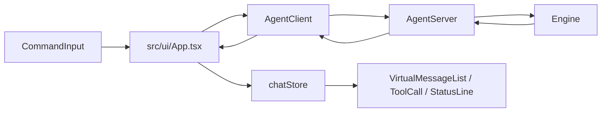

# UI, Protocol, and Rendering

## Why There Is a Protocol Layer

The interactive UI does not call `Engine.run()` directly. Both REPL and headless paths use:

```text
Engine
  wrapped by AgentServer
  connected to AgentClient
  consumed by UI or renderer
```

This separation makes the UI replaceable and keeps approvals, cancellation, stream events, and runtime queries behind a stable JSON-RPC-style boundary.

## Protocol Shape

Defined in [`src/protocol/types.ts`](../../src/protocol/types.ts).

Client-to-server methods:

- `agent/run`
- `agent/approve`
- `agent/cancel`
- `agent/configure`
- `agent/query`
- `agent/inject`

Server-to-client notifications:

- `agent/streamEvent`
- `agent/approvalRequest`
- `agent/status`

Transports:

- in-process paired transports for the normal CLI;
- stdio newline-delimited JSON for cross-process use.

Source: [`src/protocol/transport.ts`](../../src/protocol/transport.ts).

## REPL App Data Flow



[`App.tsx`](../../src/ui/App.tsx) owns:

- current input and run state;
- session ID, selected model, effort level, permission mode;
- approval and AskUser prompts;
- model selector/model manager/session picker panels;
- stream event handling;
- slash command dispatch;
- task updates and context/token status.

Chat entries are stored outside React state in [`src/ui/store.ts`](../../src/ui/store.ts) using `useSyncExternalStore`, reducing top-level rerenders during streaming.

## Terminal Renderer

Although comments and docs often call the REPL "Ink", UI components import from [`src/render/index.ts`](../../src/render/index.ts), which exposes an Ink-compatible API implemented inside this repository.

Renderer responsibilities include:

- Box/Text/ScrollBox components;
- layout through Yoga;
- React reconciliation;
- terminal input and focus events;
- ANSI parsing and rendering;
- alternate screen support;
- text width, wrapping, selection, cursor handling.

Important paths:

- [`src/render/root.ts`](../../src/render/root.ts)
- [`src/render/reconciler.ts`](../../src/render/reconciler.ts)
- [`src/render/components`](../../src/render/components)
- [`src/render/events`](../../src/render/events)
- [`src/render/layout`](../../src/render/layout)
- [`src/render/termio`](../../src/render/termio)

## Slash Commands

Slash commands are registered through [`CommandRegistry`](../../src/cli/commands/registry.ts), then wired in `App.tsx`.

Command groups are split across:

- [`core-commands.ts`](../../src/cli/commands/builtin/core-commands.ts)
- [`git-commands.ts`](../../src/cli/commands/builtin/git-commands.ts)
- [`permissions-command.ts`](../../src/cli/commands/builtin/permissions-command.ts)
- [`utility-commands.ts`](../../src/cli/commands/builtin/utility-commands.ts)
- [`advanced-commands.ts`](../../src/cli/commands/builtin/advanced-commands.ts)
- [`extra-commands.ts`](../../src/cli/commands/builtin/extra-commands.ts)
- [`more-commands.ts`](../../src/cli/commands/builtin/more-commands.ts)

Commands can query the server, configure runtime state, update local UI state, load sessions, inject context, or open panels.

## Approval and AskUser Flow

```text
ToolExecutor
  -> PermissionClassifier.handleAsk()
  -> InteractiveApprovalBackend
  -> AgentServer.requestApprovalFromClient()
  -> AgentClient approvalRequest event
  -> UI PermissionPrompt or AskUserPrompt
  -> AgentClient.approve()
  -> AgentServer resolves pending approval
  -> tool execution resumes
```

`AskUserQuestion` uses the same transport shape but is rendered as a question prompt instead of a tool permission dialog.

## Headless Rendering

Headless `run` mode uses [`src/cli/output/renderer.ts`](../../src/cli/output/renderer.ts). It listens to the same stream events and supports multiple output formats:

- `text`
- `json`
- `jsonl`
- `stream-json`

Because it shares protocol and Engine paths with REPL, behavior stays close between interactive and one-shot execution.

## UI Debugging Anchors

- Missing stream update: check `AgentServer.handleRun()` stream forwarding, then `AgentClient.handleNotification()`.
- Approval prompt stuck: check `pendingApprovals` in `AgentServer` and UI `pendingApproval`.
- Streaming text rerenders too much: inspect `chatStore.update()` usage and `VirtualMessageList`.
- Layout glitch: start at UI component, then `src/render/components`, then layout/render-to-screen paths.
