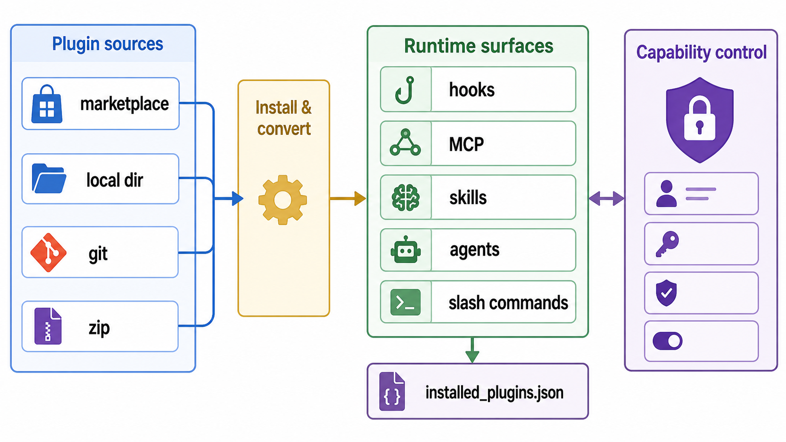
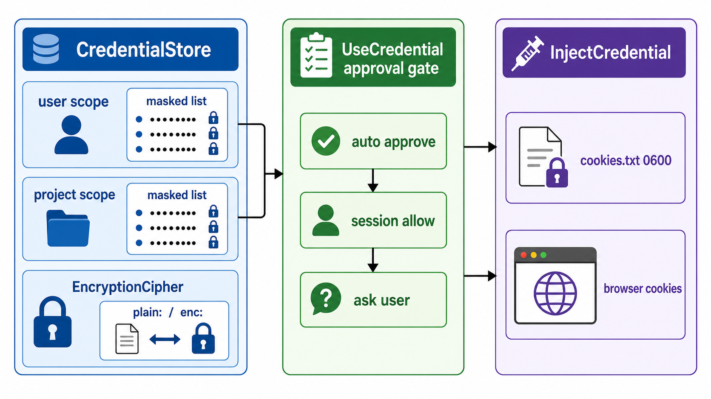
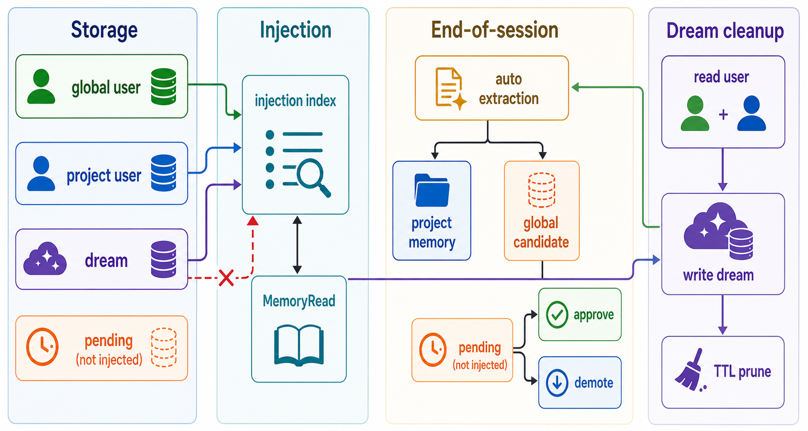

# 07 · Plugins, Capabilities, Credentials, Memory

> The four subsystems that let CodeShell grow and govern runtime surface area: install extensions, project/toggle them, hold secrets, and remember across sessions. Source-mapped against `packages/core/src/plugins/`, `capability-control/`, `credentials/`, `session/memory.ts`, and `services/*memory*` / `services/*dream*`.

## 1. Plugins (`plugins/`)

CodeShell has two plugin install families:

1. **Marketplace/cache install** (`/plugin install <plugin>@<marketplace>`) clones or refreshes a marketplace, materializes one entry into `~/.code-shell/plugins/cache/...`, rewrites CC root variables, and records it in `installed_plugins.json`.
2. **Local/direct install** (`code-shell plugin install <source>` and the desktop dir/zip entry) installs into `~/.code-shell/plugins/<name>/`, detects CC vs Codex, converts Codex assets into the CC-shaped runtime layout, writes `.cs-meta.json`, and registers the plugin as `name@local`.

| File | Role | Anchor |
|------|------|--------|
| `plugins/marketplaceManager.ts` | Clone/refresh/remove/list marketplaces; detect CC/Codex/universal manifest layout | `marketplaceManager.ts:46`, `marketplaceManager.ts:72`, `marketplaceManager.ts:93`, `marketplaceManager.ts:164`, `marketplaceManager.ts:177` |
| `plugins/pluginInstaller.ts` | Marketplace install/uninstall/list, cache path validation, SHA check, var rewrite | `pluginInstaller.ts:56`, `pluginInstaller.ts:187`, `pluginInstaller.ts:196`, `pluginInstaller.ts:289`, `pluginInstaller.ts:370` |
| `plugins/installer/install.ts` | Local install into `~/.code-shell/plugins/<name>/`; CC copy or Codex conversion; `.cs-meta.json`; `name@local` entry | `install.ts:21`, `install.ts:42`, `install.ts:57`, `install.ts:61`, `install.ts:65`, `install.ts:67`, `install.ts:79`, `install.ts:84` |
| `plugins/installer/installFromSource.ts` / `installFromArchive.ts` | Direct git/subdir and zip/dir handoff to the local installer; zip overwrite is atomic | `installFromSource.ts:21`, `installFromSource.ts:42`, `installFromSource.ts:52`, `installFromArchive.ts:58`, `installFromArchive.ts:95` |
| `plugins/installer/codex/*.ts` | Codex conversion: skills copied/validated, commands copied from `prompts/` + `commands/`, agents TOML->MD, MCP snake_case fields normalized | `convertSkills.ts:19`, `convertCommands.ts:23`, `convertAgents.ts:14`, `convertMcp.ts:23`, `convertMcp.ts:53` |
| `plugins/loadPluginHooks.ts` / `pluginCommandHook.ts` | Register `hooks/hooks.json`, map CC events, per-hook keys, run command hooks with CodeShell env | `loadPluginHooks.ts:56`, `loadPluginHooks.ts:147`, `loadPluginHooks.ts:171`, `loadPluginHooks.ts:268`, `pluginCommandHook.ts:91`, `pluginCommandHook.ts:107` |
| `plugins/installer/loadPluginMcp.ts` / `loadPluginAgents.ts` | Merge plugin MCP servers and expose plugin agent directories, honoring disabled plugins | `loadPluginMcp.ts:21`, `loadPluginMcp.ts:48`, `loadPluginMcp.ts:91`, `loadPluginAgents.ts:12` |
| `plugins/pluginCommandsLoader.ts` / `pluginContent.ts` | Runtime slash-command scan and read-only inventory of skills/commands/agents/hooks/MCP | `pluginCommandsLoader.ts:63`, `pluginCommandsLoader.ts:135`, `pluginContent.ts:68` |
| `plugins/gitOps.ts` | Git subprocess wrapper: non-interactive env, sparse marketplace clone, `--` separators against arg injection | `gitOps.ts:48`, `gitOps.ts:118`, `gitOps.ts:126`, `gitOps.ts:143`, `gitOps.ts:171`, `gitOps.ts:177`, `gitOps.ts:186` |

**Format handling is path-specific.** The local/direct installer uses `detectPluginFormat` (`detectFormat.ts:4`) and converts Codex plugins into runtime-native files (`install.ts:57`-`install.ts:76`). The marketplace/cache installer does not call that converter; it materializes the marketplace entry source and rewrites `CLAUDE_PLUGIN_ROOT` to `CODESHELL_PLUGIN_ROOT` (`pluginInstaller.ts:328`, `pluginInstaller.ts:335`). That means "Codex conversion" currently belongs to the local/direct installer family, while marketplace install is the CC-compatible cache path.

**Install records.** Both families write the shared V2 manifest at `~/.code-shell/plugins/installed_plugins.json` (`installedPlugins.ts:15`, `installedPlugins.ts:21`, `installedPlugins.ts:45`). Marketplace installs key entries as `<plugin>@<marketplace>` (`pluginInstaller.ts:339`), while local/direct installs key them as `<name>@local` (`install.ts:84`). Local plugin listing reads `.cs-meta.json` and skips cache entries without it (`list.ts:14`, `list.ts:23`).

**Runtime surfaces.** Installed plugins can contribute five runtime surfaces:

- **Hooks**: CC event names are mapped to CodeShell hook names (`loadPluginHooks.ts:56`), registered at priority 80 (`loadPluginHooks.ts:53`, `loadPluginHooks.ts:228`), and suppressed either by whole-plugin disable or a stable `pluginHookKey(plugin:RawEvent:command)` (`loadPluginHooks.ts:147`, `loadPluginHooks.ts:171`).
- **MCP servers**: `mcp-servers.json` wins over `.mcp.json`; CC `.mcp.json` is unwrapped and re-keyed to `<plugin>:<server>` (`loadPluginMcp.ts:36`, `loadPluginMcp.ts:48`). User overrides only supplement env/credential fields, never command/args/url/transport (`loadPluginMcp.ts:11`, `settings/schema.ts:297`).
- **Skills**: scanner-side filters honor both `disabledSkills` and bare-name `disabledPlugins` (`settings/schema.ts:318`, `settings/schema.ts:326`); prompt and tool paths receive the same folded lists from the engine (`engine.ts:1627`, `engine.ts:3317`).
- **Agents**: installed plugin `agents/` directories are inserted between user and project agent dirs, and plugin-sourced bare skill allowlists can be namespaced at spawn time (`loadPluginAgents.ts:12`, `engine.ts:255`, `engine.ts:269`).
- **Slash commands**: `commands/*.md` becomes `/plugin:command`; the TUI stages the prompt body after `$ARGUMENTS` / `{args}` substitution (`pluginCommandsLoader.ts:63`, `plugin-commands-registration.ts:11`, `plugin-commands-registration.ts:18`).

**Security invariants.** Plugin and marketplace names must be one safe path segment (`paths.ts:9`, `marketplaceManager.ts:37`, `pluginInstaller.ts:56`). Marketplace uninstall realpaths the target and requires strict containment below the plugin cache root before `rmSync` (`pluginInstaller.ts:73`, `pluginInstaller.ts:370`). Git never prompts for credentials/host keys (`gitOps.ts:48`) and puts `--` before URL/ref/path values that originate outside the process (`gitOps.ts:126`, `gitOps.ts:143`, `gitOps.ts:177`, `gitOps.ts:190`).

## 2. Capability Control (`capability-control/`)

Capability control is a **read-only projection layer** over builtin tools, MCP servers, user/project skills, installed plugins, and user/project agents. It computes descriptors for the UI and writes toggles back to the real settings keys; it is not a second source of truth.

| File | Role | Anchor |
|------|------|--------|
| `capability-control/types.ts` | `CapabilityDescriptor`, five `kind`s, inlined `control`, write-scope types | `types.ts:13`, `types.ts:17`, `types.ts:42`, `types.ts:68` |
| `capability-control/service.ts` | Compose projections, apply project overlays, route writes by descriptor control | `service.ts:68`, `service.ts:74`, `service.ts:102`, `service.ts:126`, `service.ts:144`, `service.ts:161` |
| `capability-control/project.ts` | Project builtin/MCP/skills/agents/plugins into uniform descriptors | `project.ts:21`, `project.ts:57`, `project.ts:91`, `project.ts:122`, `project.ts:149` |
| `capability-control/overlay.ts` | Tri-state math, kind->bucket mapping, effective disabled lists, no-repo whitelist, builtin allow/deny folding | `overlay.ts:20`, `overlay.ts:28`, `overlay.ts:71`, `overlay.ts:99`, `overlay.ts:127` |
| `capability-control/disabled-lists.ts` | Single fold for runtime disabled skills/plugins/plugin-hooks plus no-repo inversion | `disabled-lists.ts:20`, `disabled-lists.ts:32`, `disabled-lists.ts:51`, `disabled-lists.ts:65` |
| `settings/schema.ts` | Project `capabilityOverrides` buckets: skills/plugins/agents/MCP/builtin/pluginHooks | `settings/schema.ts:7`, `settings/schema.ts:20`, `settings/schema.ts:27`, `settings/schema.ts:343` |

Each descriptor carries `{ settingsKey, mode, token }` (`types.ts:42`) so user-scope writes can be generic: MCP toggles flip `mcpServers[token].enabled`, default builtin toggles write a denylist, non-default builtin toggles write an allowlist, and skills/plugins/agents write denylists (`service.ts:167`, `service.ts:176`). Project-scope writes go to `capabilityOverrides.<bucket>.<token>` and delete the key for inherit (`service.ts:144`, `service.ts:155`).

Project overlays are tri-state: `"on"` force-enables, `"off"` force-disables, and absent/garbage inherits (`overlay.ts:20`, `settings/schema.ts:7`). Runtime consumers must fold through `computeEffectiveDisabledLists` so a project-level `"on"` can override a globally disabled plugin for skills, hooks, and plugin MCP merging (`disabled-lists.ts:1`, `disabled-lists.ts:32`, `disabled-lists.ts:65`). The no-repo conversation scope inverts skills/plugins into a whitelist: everything is disabled unless the project override explicitly says `"on"` (`disabled-lists.ts:47`, `overlay.ts:85`).

Builtin tool overlays need special handling because the `ToolRegistry` builtin set is constructor-frozen. Engine folds builtin project overrides into the registry at construction (`engine.ts:581`, `engine.ts:595`), and per-turn tool-list assembly hides builtins marked `"off"` so mid-session disables take effect on the next message (`engine.ts:1693`). A newly `"on"` builtin that was not in the frozen registry still needs a new session to appear (`engine.ts:1699`).

Agents are first-class here too. `projectAgents` excludes plugin-sourced agents because they ride the plugin switch (`project.ts:113`), while user/project agents write `disabledAgents` (`project.ts:122`). Engine folds `capabilityOverrides.agents` separately from skills/plugins so disabled agent roles disappear from the agent registry everywhere (`engine.ts:3137`, `engine.ts:3160`).

## 3. Credentials (`credentials/`)

The credential layer stores `token`, `link`, and `cookie` credentials in user/project scopes, lists them only in masked form, and exposes two AI-facing tools: `UseCredential` for values or temporary `cookies.txt`, and `InjectCredential` for browser cookie restoration.

| File | Role | Anchor |
|------|------|--------|
| `credentials/types.ts` | Credential shape: `token` / `link` / `cookie`, env exposure, auto-use/auto-inject, cookie metadata | `types.ts:6`, `types.ts:8`, `types.ts:27`, `types.ts:33`, `types.ts:39`, `types.ts:46` |
| `credentials/store.ts` | Two-scope store, disk encryption boundary, atomic 0o600 writes, scope-aware list/resolve/env/mask | `store.ts:29`, `store.ts:44`, `store.ts:51`, `store.ts:74`, `store.ts:92`, `store.ts:107`, `store.ts:154`, `store.ts:182`, `store.ts:199` |
| `credentials/cipher.ts` | Core-owned `EncryptionCipher` interface and default `PlaintextCipher` | `cipher.ts:19`, `cipher.ts:41`, `cipher.ts:71`, `cipher.ts:75` |
| `credentials/use-gate.ts` | Three-step approval: global/per-credential auto approve, session allow, interactive ask/headless deny | `use-gate.ts:44`, `use-gate.ts:62`, `use-gate.ts:67`, `use-gate.ts:69`, `use-gate.ts:71`, `use-gate.ts:87` |
| `credentials/use-credential-tool.ts` | Dynamic tool description, masked list, scoped resolve, gate, value return, cookie materialization and sweep | `use-credential-tool.ts:65`, `use-credential-tool.ts:90`, `use-credential-tool.ts:125`, `use-credential-tool.ts:146`, `use-credential-tool.ts:158`, `use-credential-tool.ts:174`, `use-credential-tool.ts:191`, `use-credential-tool.ts:198`, `use-credential-tool.ts:211` |
| `credentials/inject-credential-tool.ts` | Cookie-only browser injection with separate auto-inject/session gate and host callback | `inject-credential-tool.ts:67`, `inject-credential-tool.ts:90`, `inject-credential-tool.ts:99`, `inject-credential-tool.ts:111`, `inject-credential-tool.ts:126`, `inject-credential-tool.ts:145` |
| `credentials/cookie-jar.ts` | Serialized Electron-cookie subset -> Netscape cookies.txt | `cookie-jar.ts:10`, `cookie-jar.ts:26`, `cookie-jar.ts:44` |

**Scope and isolation.** `CredentialStore.list("full")` merges user then project credentials, with project winning by id; `list("project")` reads only the project store (`store.ts:146`, `store.ts:154`). `UseCredential` maps `settingsScope === "full"` to full access and every project/isolated engine to project-only (`use-credential-tool.ts:125`). That same isolation applies to `credentialUse.autoApprove` (`use-credential-tool.ts:132`) and env exposure (`store.ts:182`, `engine.ts:3266`).

**Disk boundary.** The store always works with plaintext in memory and applies the configured cipher only while reading/writing disk (`store.ts:74`, `store.ts:92`). Core defines the cipher interface and defaults to tagged plaintext (`cipher.ts:19`, `cipher.ts:41`, `cipher.ts:71`). A desktop `SafeStorageCipher` exists (`credential-cipher.ts:19`), but desktop startup deliberately does not install it yet because the worker process still reads credentials directly and cannot decrypt main-process `safeStorage` ciphertext (`index.ts:1421`). Current default behavior is therefore owner-only `plain:` files at 0o600 (`store.ts:107`, `cipher.ts:35`, `index.ts:1427`), with the host-injected encryption boundary ready for the next wiring step.

**Use gates.** The tool registry marks `UseCredential` as `permissionDefault: "allow"` and read-only because the credential approval is inside the tool (`builtin/index.ts:740`). The gate order is global auto-approve or per-credential `autoUseByAI`, then an in-memory `sessionId` allow set, then `askUser`; no UI means deny (`use-gate.ts:62`). Cookie materialization writes a unique temp Netscape file with 0o600 and a random UUID so concurrent calls cannot clobber each other (`use-credential-tool.ts:206`, `use-credential-tool.ts:211`); stale files are swept on startup (`use-credential-tool.ts:90`, `index.ts:1447`).

`InjectCredential` is intentionally separate. It is visible only when a cookie credential exists (`inject-credential-tool.ts:90`, `builtin/index.ts:783`), rejects headless/no-browser contexts (`inject-credential-tool.ts:111`), uses `autoInjectByAI` rather than `autoUseByAI` (`inject-credential-tool.ts:126`), and delegates the actual cookie restore to the host callback because core cannot touch Electron browser sessions (`inject-credential-tool.ts:145`, `tool-system/context.ts:345`).

## 4. Memory & Dream

Memory is a two-location (`global` / `project`) and three-scope (`user` / `dream` / `pending`) markdown store. Prompt injection uses only compact indexes from `user` and `dream`; full bodies are fetched on demand with `MemoryRead`, which records recall metadata for TTL and UI visibility.

### Storage and injection (`session/memory.ts`, `tool-system/builtin/memory.ts`)

| File | Role | Anchor |
|------|------|--------|
| `session/memory.ts` | Scopes, file layout, frontmatter lifecycle, soft delete, pending approval/demotion, two-layer injection index | `memory.ts:44`, `memory.ts:140`, `memory.ts:148`, `memory.ts:171`, `memory.ts:248`, `memory.ts:301`, `memory.ts:328`, `memory.ts:357`, `memory.ts:383`, `memory.ts:391`, `memory.ts:519` |
| `tool-system/builtin/memory.ts` | `MemoryList`/`MemoryRead`/`MemorySave`/`MemoryDelete`; only `user` and `dream` are tool-visible; `location` selects global/project | `memory.ts:22`, `memory.ts:35`, `memory.ts:62`, `memory.ts:105`, `memory.ts:146`, `memory.ts:175`, `memory.ts:256` |
| `prompt/composer.ts` | Memory index is dynamic tail context, not cached system prefix | `composer.ts:156`, `composer.ts:164`, `composer.ts:296`, `composer.ts:302` |
| `engine.ts` | Dream-scope write permission and memory pipeline trigger | `engine.ts:2228`, `engine.ts:2409`, `engine.ts:2440`, `engine.ts:2930` |

The base dir resolves as explicit `baseDir`, then `CODE_SHELL_HOME`, then `~/.code-shell` (`memory.ts:112`). Global memory lives under `<base>/memory/{user,dream,pending}`; project memory lives under `<base>/projects/<project-hash>/memory/{user,dream,pending}` (`memory.ts:148`). `pending` is used only as an approval queue for global candidates and is not exposed by the memory tools (`memory.ts:35`, `tool-system/builtin/memory.ts:22`).

Each memory file is markdown with frontmatter for `name`, `description`, `type`, optional `pinned`/`origin`/`originProject`, and lifecycle fields `created`, `lastUsed`, `usageCount` (`memory.ts:189`, `memory.ts:248`). Deletes are soft moves into `<base>/memory-trash/<ISO>/<scope>/` (`memory.ts:297`). `MemoryRead` bumps `usageCount`, updates `lastUsed`, and emits `memory_recalled` when a stream callback exists (`tool-system/builtin/memory.ts:146`).

`MemoryManager.buildInjectionIndex` merges global + project stores and includes `user` + `dream` scopes only (`memory.ts:519`, `memory.ts:533`). It injects name/description lines and instructs the model to call `MemoryRead` before relying on a body (`memory.ts:559`). PromptComposer puts that index in the per-turn `<system-reminder>` tail so memory changes do not invalidate the cached system prefix (`composer.ts:144`, `composer.ts:164`, `composer.ts:296`).

### End-of-session pipeline (`services/memory-orchestrator.ts`)

Engine fires the memory pipeline after the turn resolves and does not block the run result (`engine.ts:2228`). The pipeline uses a background LLM client, skips sessions with fewer than eight user/assistant messages, strips rich payloads before summarization, and runs with reasoning off (`engine.ts:2409`, `engine.ts:2421`, `engine.ts:2432`, `engine.ts:2440`).

`MemoryOrchestrator.run` performs five best-effort steps:

1. **Extract durable memories** via `extract-memories.ts`; the prompt and parser cap extraction at two memories, and code demotes extra globals to project scope (`extract-memories.ts:59`, `extract-memories.ts:78`, `extract-memories.ts:124`). Project memories land in the project user store, while global candidates land in global `pending` with `originProject` stamped (`memory-orchestrator.ts:118`, `memory-orchestrator.ts:127`, `memory-orchestrator.ts:141`).
2. **Write session summaries** under `~/.code-shell/session-memories/<sessionId>.json` for later search/listing (`memory-orchestrator.ts:173`, `session-memory.ts:32`, `session-memory.ts:55`).
3. **Record auto-dream cadence** by incrementing the state counter (`memory-orchestrator.ts:214`, `auto-dream.ts:78`).
4. **Maybe run Dream** when cadence is due, a driver is wired, and there is user/dream/global-dream material to consolidate (`memory-orchestrator.ts:217`, `memory-orchestrator.ts:226`, `memory-orchestrator.ts:229`).
5. **Prune by recall TTL** when configured; only `project`-type, unpinned memories with stale `lastUsed` are soft-deleted (`memory-orchestrator.ts:259`, `memory.ts:357`).

Pending approval is the only path for auto-extracted global memories to reach injected global user memory: `approvePending` moves pending -> global user, while `demotePending` moves pending -> the stamped origin project user store or global fallback (`memory.ts:383`, `memory.ts:391`, `memory.ts:402`). Manual promotion from project user -> global user is separate (`memory.ts:421`).

### Dream consolidation (`services/dream-consolidation.ts`, `services/auto-dream.ts`)

Auto-dream cadence defaults to 5 completed sessions and at least 24 hours between runs (`auto-dream.ts:21`, `auto-dream.ts:58`). The state file is colocated with the memory base dir, so `CODE_SHELL_HOME` and test HOME overrides isolate it too (`auto-dream.ts:32`, `auto-dream.ts:35`).

`runDreamConsolidation` is a small, offline LLM tool-call loop over exactly `MemoryList`, `MemoryRead`, `MemorySave`, and `MemoryDelete` (`dream-consolidation.ts:34`, `dream-consolidation.ts:72`, `dream-consolidation.ts:77`). It loads user memories as read-only context and dream memories as the workspace (`dream-consolidation.ts:88`). The model call disables reasoning and records no usage (`dream-consolidation.ts:112`, `dream-consolidation.ts:118`).

The hard guards are outside the prompt: any non-memory tool is rejected, and `MemorySave`/`MemoryDelete` are refused unless `scope === "dream"` (`dream-consolidation.ts:165`, `dream-consolidation.ts:178`, `dream-consolidation.ts:183`). A write budget caps mutations at 10, and the loop stops after 8 LLM turns (`dream-consolidation.ts:34`, `dream-consolidation.ts:110`, `dream-consolidation.ts:112`, `dream-consolidation.ts:192`). Normal engine permission rules also allow dream-scope save/delete while leaving user-scope writes on the regular ask path (`engine.ts:2930`).

## 5. Where to read next

- Plugin hooks ride the hook chain: [05 · Presets, prompt, hooks, skills](05-presets-prompt-hooks-skills.md)
- The `UseCredential`/`InjectCredential`/`Memory*` tools and their guards: [02 · Tool system](02-tool-system.md)
- The aux model that powers memory extraction, session titles, Dream, and goal judging: [03 · LLM & model layer](03-llm-and-model-layer.md), [06 · Long-running orchestration](06-long-running-orchestration.md)
- Desktop UIs over these systems (Extensions, Connections, Memory): [10 · Desktop & mobile](10-desktop-and-mobile.md)
