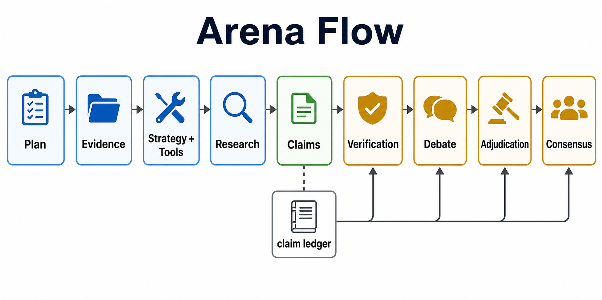
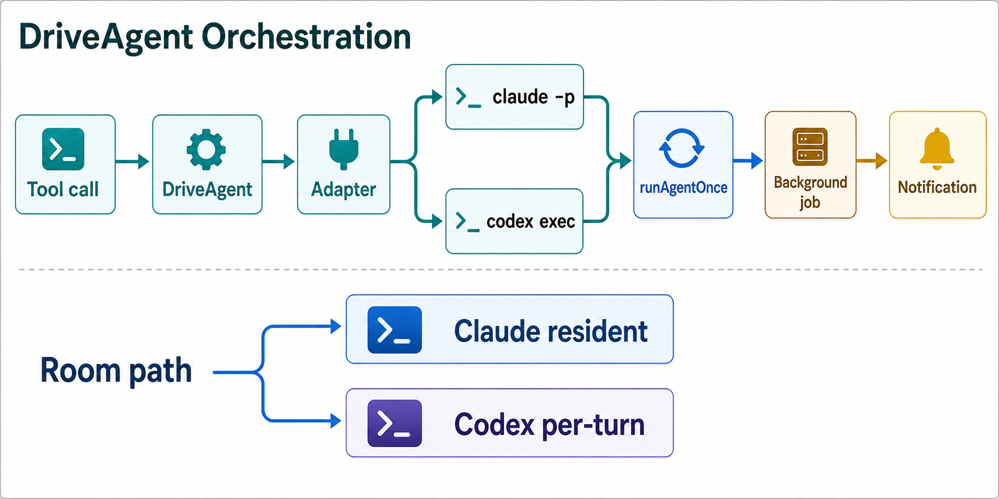

# 08 · Arena & Integrations

> The optional multi-model reasoning package (Arena), the external-agent CLI integrations (DriveAgent, Claude Code rooms, Codex rooms), and smaller integration surfaces (STT, code review, external-agent config). Source-mapped against `packages/arena/src/`, `packages/core/src/tool-system/builtin/{drive-claude-code,check-quota}.ts`, `packages/core/src/cc-orchestrator/`, `packages/desktop/src/main/mobile-remote/`, `packages/core/src/stt/`, `packages/core/src/review/`, and `packages/core/src/external-agents/`.



## 1. Arena (`packages/arena/src/`)

Arena has two related but separate engines:
- **Arena** reviews or discusses an existing subject via an evidence-driven claim pipeline (`packages/arena/src/arena.ts`).
- **IterativeArena** authors a new artifact via tournament drafting plus critique/revision rounds (`packages/arena/src/iterate/iterative-arena.ts`).

The package barrel keeps that split explicit (`packages/arena/src/index.ts`). The model-facing tool and its metadata live in `packages/arena/src/capability.ts`; `createArenaCapability()` contributes the read-only, non-concurrency-safe, 30-minute tool plus the `arena_status` query through core's narrow `CapabilityModule` contract. Core does not statically register or import Arena. TUI and Desktop opt in at their host composition boundaries.

### Review / discussion / planning flow

`Arena.run()` executes a fixed pipeline: **Plan** (`planArena`, `packages/arena/src/planner.ts`) → **Evidence** (`collectEvidence`, `packages/arena/src/providers/index.ts`) → **Strategy + language wrapper** (`packages/arena/src/arena.ts`) → **Tool selection** (`selectTools`, `packages/arena/src/tools/selector.ts`) → **parallel participant research** (`packages/arena/src/phases/participant-research.ts`) → **claim registration** (`packages/arena/src/phases/claim-registry.ts`) → mode-specific review/debate/adjudication/consensus routing.

The planner is one LLM call unless `mode` and `base` are explicit; explicit flags override LLM output, and failures fall back to heuristics over English/Chinese keywords (`packages/arena/src/planner.ts`). Its plan shape is `mode`, `lenses`, `sources`, `subject`, `outputShape`, `confidence`, and optional `followUpQuestion` (`packages/arena/src/types.ts`).

Evidence providers run in parallel with an 8-second per-provider timeout and progress heartbeats (`packages/arena/src/providers/index.ts`). Current providers are `git`, `repo`, `docs`, `none`; `web` is intentionally mapped to `noneProvider` in the evidence phase, so web is not an Arena evidence collector today. Tool selection also maps `web` to `no_tools` (`packages/arena/src/tools/selector.ts`).

Research tools are Arena-local read-only context tools, not the general builtin tool registry. The set is `read_file`, `grep_code`, `list_files`, `git_show`, and `git_blame` (`packages/arena/src/context/context-tools.ts`). They enforce repo-root path containment with realpath-aware checks, call git/grep through `execFileSync` argument arrays, truncate outputs, and cap model tool rounds at 3. Participant research records `ToolTrace`s, converts successful tool calls into `EvidencePacket`s, and force-concludes if a model spends the budget on tools without emitting findings (`packages/arena/src/phases/participant-research.ts`).

The claim system is the durable spine of the review path. `ArenaLedger` is append-oriented storage for dossiers, packets, tool traces, claims, challenges, requested checks, and adjudications, with indexes for packet/claim/request lookup (`packages/arena/src/ledger.ts`). `registerClaims()` gives each finding a stable `participant:findingId` claim id and starts it in `proposed` (`packages/arena/src/phases/claim-registry.ts`). `buildDigest()` injects only relevant claim evidence, tool traces, challenges, checks, and prior adjudications into later prompts; `formatDigest()` sanitizes LLM-originated text before reinjection (`packages/arena/src/digest-builder.ts`).

The current claim state machine is:

```text
proposed -> under_review | unresolved
under_review -> verified | contested | rejected | unresolved
contested -> under_review | unresolved | verified | rejected
verified / rejected / unresolved -> terminal
```

Those transitions are centralized in `packages/arena/src/transitions.ts`. `resolveClaimStatus()` does not auto-verify unchallenged claims; disagreements, `needs_evidence`, or pending checks become `contested`, and at least one explicit `agree` is required for `verified`. Verification moves selected claims to `under_review`, builds a digest, assigns each claim to non-owners, appends `ClaimChallenge`s, and applies the state machine (`packages/arena/src/phases/cross-review.ts`).

For review/discussion modes, contested claims debate sequentially to avoid token explosion; each claim's owner debates its primary challenger, and a round converges when all turns are `support` or `narrow` (`packages/arena/src/phases/debate-rounds.ts`). Adjudication sends contested claims to the concluder, adds synthetic adjudications for cleanly verified claims, and marks leftover proposed/under-review claims unresolved (`packages/arena/src/phases/adjudication.ts`). Consensus is claim-aware when strategy V2 data is available (`packages/arena/src/phases/build-consensus.ts`).

Planning mode takes a lighter path: after research and claim registration, it runs merge-oriented verification, builds roadmap consensus, and expands roadmap phases into repo-level details with a capped read-only tool loop (`packages/arena/src/arena.ts`, `packages/arena/src/phases/planning-detail-expansion.ts`).

### Capability-owned Arena participant resolution

`arenaTool()` refuses to run unless the engine injects `ctx.llmConfig`; it also snapshots that config/model pool for the capability-owned `arena_status` diagnostic query (`packages/arena/src/capability.ts`). Participant resolution prefers explicit compatible tool args, then Arena-owned settings, and otherwise returns an actionable error instead of silently using the whole model pool. Pool entries carry their own baseUrl/apiKey; preset/raw names are checked against direct-provider endpoints to fail fast on vendor/model mismatch. Arena hardcodes participant temperature to 0.3.

### Authoring mode

`IterativeArena.run()` builds v1 either by tournament or single-author, then loops `argue -> optional human checkpoint -> convergence -> revise` up to 5 rounds by default (`packages/arena/src/iterate/iterative-arena.ts`). Tournament candidates are generated in parallel with `Promise.allSettled`, then anonymized/shuffled before merge (`packages/arena/src/iterate/phases/tournament.ts`). Critics run in parallel; optional web search/fetch is only available when `SERPER_API_KEY`, `TAVILY_API_KEY`, or `SEARXNG_URL` is set (`packages/arena/src/iterate/phases/argue.ts`, `packages/arena/src/iterate/tools/web-tools.ts`). Default convergence requires at least one revision pass, treats zero critiques as non-converged, stops when blockers/majors are gone with at least three critiques, or when the diff from the previous draft is under 5% and no blockers remain (`packages/arena/src/iterate/convergence.ts`). Format packs provide separate code/document prompt contracts (`packages/arena/src/iterate/formats/index.ts`).

## 2. External CLI orchestration (`cc-orchestrator/`, 10 non-test TS files, ~1,100 LOC)



There are two distinct integration paths:
- **DriveAgent** is a builtin tool that launches one headless external CLI turn and returns inline or via a background completion notification (`packages/core/src/tool-system/builtin/drive-claude-code.ts:17`, `packages/core/src/tool-system/builtin/drive-claude-code.ts:67`).
- **CC/Codex Rooms** are desktop/mobile conversation surfaces for external CLI sessions, with their own room manager, on-disk room log, and UI approval bridge (`packages/desktop/src/main/index.ts:993`, `packages/desktop/src/main/mobile-remote/room-manager.ts:174`).

### DriveAgent one-shot path

`DriveAgent` supports `cli: "claude" | "codex"` through an adapter map, and `DriveClaudeCode` is only a backward-compatible alias pinned to `cli:"claude"` (`packages/core/src/tool-system/builtin/drive-claude-code.ts:10`, `packages/core/src/tool-system/builtin/drive-claude-code.ts:12`, `packages/core/src/tool-system/builtin/drive-claude-code.ts:148`, `packages/core/src/tool-system/builtin/drive-claude-code.ts:176`). The tool description is intentionally strict: no time/scheduling loop lives in DriveAgent; recurring/deferred work should use `CronCreate`, whose prompt can call DriveAgent for one turn (`packages/core/src/tool-system/builtin/drive-claude-code.ts:27`).

Permission defaults are full-auto unless the caller explicitly asks for `default` or `acceptEdits`, because unattended DriveAgent has no interactive approval loop (`packages/core/src/tool-system/builtin/drive-claude-code.ts:75`, `packages/core/src/tool-system/builtin/drive-claude-code.ts:82`). Background mode is the default; it requires a host session id so completion can wake the right session, starts a `backgroundJobRegistry` entry, runs the CLI, enqueues a completion/failure notification, and best-effort attributes changed files from the external transcript (`packages/core/src/tool-system/builtin/drive-claude-code.ts:90`, `packages/core/src/tool-system/builtin/drive-claude-code.ts:98`, `packages/core/src/tool-system/builtin/drive-claude-code.ts:102`, `packages/core/src/tool-system/builtin/drive-claude-code.ts:104`, `packages/core/src/tool-system/builtin/drive-claude-code.ts:109`, `packages/core/src/tool-system/builtin/drive-claude-code.ts:118`). Foreground mode just awaits the runner and formats the result inline (`packages/core/src/tool-system/builtin/drive-claude-code.ts:140`).

The adapter contract is small: build argv, parse JSONL output, and optionally feed the prompt over stdin (`packages/core/src/cc-orchestrator/agent-adapter.ts:16`). `claudeAdapter` uses `-p <prompt> --output-format stream-json --verbose`, optionally `--resume`, hard-disallows `Workflow`, appends the shared cost guard, and passes `--permission-mode` (`packages/core/src/cc-orchestrator/agent-adapter.ts:44`, `packages/core/src/cc-orchestrator/agent-adapter.ts:47`, `packages/core/src/cc-orchestrator/agent-adapter.ts:49`, `packages/core/src/cc-orchestrator/agent-adapter.ts:56`, `packages/core/src/cc-orchestrator/agent-adapter.ts:59`, `packages/core/src/cc-orchestrator/agent-adapter.ts:60`). It parses `session_id`, final `result`, and `is_error` from Claude's stream-json (`packages/core/src/cc-orchestrator/agent-adapter.ts:63`).

`codexAdapter` uses `codex exec --json --color never --skip-git-repo-check`, feeds the prompt via stdin with a trailing `-`, maps permissions to Codex sandbox choices, resumes with `resume <thread_id> -`, and parses `thread.started`, last completed `agent_message`, `turn.failed`, and `error` events (`packages/core/src/cc-orchestrator/agent-adapter.ts:97`, `packages/core/src/cc-orchestrator/agent-adapter.ts:100`, `packages/core/src/cc-orchestrator/agent-adapter.ts:101`, `packages/core/src/cc-orchestrator/agent-adapter.ts:102`, `packages/core/src/cc-orchestrator/agent-adapter.ts:107`, `packages/core/src/cc-orchestrator/agent-adapter.ts:113`).

`runAgentOnce()` is the single spawn choke point. It builds adapter args, prepends common macOS CLI bins to PATH, keeps children **non-detached**, pipes stdin only for Codex, collects stdout lines until process exit, honors `AbortSignal` by killing the child, and turns `ENOENT` into an actionable missing-CLI error (`packages/core/src/cc-orchestrator/external-agent-driver.ts:24`, `packages/core/src/cc-orchestrator/external-agent-driver.ts:32`, `packages/core/src/cc-orchestrator/external-agent-driver.ts:38`, `packages/core/src/cc-orchestrator/external-agent-driver.ts:43`, `packages/core/src/cc-orchestrator/external-agent-driver.ts:46`, `packages/core/src/cc-orchestrator/external-agent-driver.ts:54`, `packages/core/src/cc-orchestrator/external-agent-driver.ts:57`, `packages/core/src/cc-orchestrator/external-agent-driver.ts:65`, `packages/core/src/cc-orchestrator/external-agent-driver.ts:74`). CLI availability probes use the same PATH fix for `claude --version` and `codex --version` (`packages/core/src/cc-orchestrator/cc-capability.ts:13`, `packages/core/src/cc-orchestrator/cc-capability.ts:37`, `packages/core/src/cc-orchestrator/cc-capability.ts:50`, `packages/core/src/cc-orchestrator/cc-capability.ts:58`).

Changed-file attribution is read-only and transcript-specific: Claude scans `~/.claude/projects/<encoded-cwd>/<session>.jsonl` for `Write`/`Edit`/`MultiEdit`/`NotebookEdit`, while Codex walks `~/.codex/sessions/**/rollout-*.jsonl` for a matching `session_meta` and extracts `apply_patch` / write/edit paths (`packages/core/src/cc-orchestrator/external-agent-changes.ts:7`, `packages/core/src/cc-orchestrator/external-agent-changes.ts:17`, `packages/core/src/cc-orchestrator/external-agent-changes.ts:60`, `packages/core/src/cc-orchestrator/external-agent-changes.ts:83`, `packages/core/src/cc-orchestrator/external-agent-changes.ts:128`, `packages/core/src/cc-orchestrator/external-agent-changes.ts:145`).

### Room path

Desktop exposes `ccRoom:*` IPC for probe/list/open/send/approval/history/close and mobile exposes matching events through `handleCcRoomEvent()` (`packages/desktop/src/main/index.ts:2314`, `packages/desktop/src/main/index.ts:2315`, `packages/desktop/src/main/index.ts:2320`, `packages/desktop/src/main/index.ts:2324`, `packages/desktop/src/main/index.ts:2328`, `packages/desktop/src/main/index.ts:2338`, `packages/desktop/src/main/index.ts:2340`, `packages/desktop/src/main/index.ts:2350`, `packages/desktop/src/main/index.ts:2353`, `packages/desktop/src/main/index.ts:2356`, `packages/desktop/src/main/index.ts:1001`). Session discovery is bounded by default to the recent two-week / 20-session slice, with "all" as the load-more path (`packages/core/src/cc-orchestrator/session-discovery.ts:37`, `packages/core/src/cc-orchestrator/session-discovery.ts:111`, `packages/core/src/cc-orchestrator/codex-session-discovery.ts:26`, `packages/desktop/src/main/index.ts:2317`).

Room permission mode is resolved from merged user/project `externalAgents.claudeCode.trustedWorkspaces`. Trusted cwd defaults to `bypassPermissions`; non-trusted cwd defaults to `default`, and an explicit bypass request is downgraded outside trusted workspaces (`packages/desktop/src/main/index.ts:898`, `packages/desktop/src/main/index.ts:908`, `packages/desktop/src/main/index.ts:912`, `packages/desktop/src/main/index.ts:930`, `packages/desktop/src/main/index.ts:931`).

Claude rooms are long-lived `claude` stream-json processes. They start with `--print`, `--input-format stream-json`, `--output-format stream-json`, `--permission-prompt-tool stdio`, the cost guard, optional `--resume`, and spawn-time `--permission-mode`; stdin carries later user turns and control responses (`packages/desktop/src/main/mobile-remote/resident-agent.ts:152`, `packages/desktop/src/main/mobile-remote/resident-agent.ts:162`, `packages/desktop/src/main/mobile-remote/resident-agent.ts:164`, `packages/desktop/src/main/mobile-remote/resident-agent.ts:171`, `packages/desktop/src/main/mobile-remote/resident-agent.ts:176`, `packages/desktop/src/main/mobile-remote/resident-agent.ts:179`, `packages/desktop/src/main/mobile-remote/resident-agent.ts:182`, `packages/desktop/src/main/mobile-remote/resident-agent.ts:223`, `packages/desktop/src/main/mobile-remote/resident-agent.ts:230`). `parseStreamJsonLine()` normalizes assistant text, tool starts/results, turn ends, errors, and `control_request:can_use_tool` into the room event union (`packages/desktop/src/main/mobile-remote/resident-agent.ts:79`).

Codex rooms are not long-lived processes. `CodexRoomAgent.send()` spawns one `codex exec` per turn, feeds the prompt over stdin, captures `thread.started` to persist the thread id, and resumes subsequent turns with `resume <thread_id> -` (`packages/desktop/src/main/mobile-remote/codex-room-agent.ts:95`, `packages/desktop/src/main/mobile-remote/codex-room-agent.ts:119`, `packages/desktop/src/main/mobile-remote/codex-room-agent.ts:124`, `packages/desktop/src/main/mobile-remote/codex-room-agent.ts:128`, `packages/desktop/src/main/mobile-remote/codex-room-agent.ts:136`, `packages/desktop/src/main/mobile-remote/codex-room-agent.ts:145`). Codex has no per-tool approval; the selected sandbox tier is the guardrail (`packages/desktop/src/main/mobile-remote/codex-room-agent.ts:10`, `packages/desktop/src/main/mobile-remote/codex-parse.ts:24`).

`RoomManager` owns room metadata, `messages.jsonl`, seq numbers, resume ids, live agent lifecycle, and idle pruning (`packages/desktop/src/main/mobile-remote/room-manager.ts:174`, `packages/desktop/src/main/mobile-remote/room-manager.ts:223`, `packages/desktop/src/main/mobile-remote/room-manager.ts:288`, `packages/desktop/src/main/mobile-remote/room-manager.ts:305`, `packages/desktop/src/main/mobile-remote/room-manager.ts:409`, `packages/desktop/src/main/mobile-remote/room-manager.ts:508`). It validates room ids before path construction to block traversal (`packages/desktop/src/main/mobile-remote/room-manager.ts:13`, `packages/desktop/src/main/mobile-remote/room-manager.ts:204`). `AskUserQuestion` is not treated as a yes/no permission gate: the manager parses the first question, stashes raw input, and on allow writes the answer into `updatedInput.answers` keyed by the question text (`packages/desktop/src/main/mobile-remote/room-manager.ts:34`, `packages/desktop/src/main/mobile-remote/room-manager.ts:49`, `packages/desktop/src/main/mobile-remote/room-manager.ts:71`, `packages/desktop/src/main/mobile-remote/room-manager.ts:386`, `packages/desktop/src/main/mobile-remote/room-manager.ts:453`). The `ApprovalBridge` parks requests and auto-denies after five minutes (`packages/desktop/src/main/cc-room/approval-bridge.ts:30`, `packages/desktop/src/main/cc-room/approval-bridge.ts:43`).

### Quota and continuation helpers

`CheckQuota` lets an orchestrating model inspect Claude/Codex subscription-window usage before spawning work; the Claude path costs a tiny probe, while Codex is a free usage read (`packages/core/src/tool-system/builtin/check-quota.ts:1`, `packages/core/src/tool-system/builtin/check-quota.ts:17`, `packages/core/src/tool-system/builtin/check-quota.ts:40`). `relevance-judge.ts` is a small helper for scheduled loops: given the previous result and next prompt, an auxiliary LLM chooses `continue-same`, `continue-fresh`, or `stop` (`packages/core/src/cc-orchestrator/relevance-judge.ts:16`, `packages/core/src/cc-orchestrator/relevance-judge.ts:43`).

## 3. Smaller integrations

### Speech-to-text (`packages/core/src/stt/`, ~260 LOC)

STT is deliberately not an agent tool. `transcribe()` posts multipart audio bytes to an OpenAI-compatible `/audio/transcriptions` endpoint and returns `{ ok, text }` or `{ ok:false, error }` (`packages/core/src/stt/transcribe.ts:1`, `packages/core/src/stt/transcribe.ts:45`, `packages/core/src/stt/transcribe.ts:51`, `packages/core/src/stt/transcribe.ts:67`, `packages/core/src/stt/transcribe.ts:89`). `resolveTranscribeProvider()` first uses `modelConnections` tagged `audio`, then falls back to reusing an OpenAI-family credential against `https://api.openai.com/v1` with `gpt-4o-transcribe`; explicit `prefer` never silently falls back (`packages/core/src/stt/resolve-transcribe.ts:45`, `packages/core/src/stt/resolve-transcribe.ts:53`, `packages/core/src/stt/resolve-transcribe.ts:63`, `packages/core/src/stt/resolve-transcribe.ts:86`, `packages/core/src/stt/resolve-transcribe.ts:89`). Desktop exposes `stt:transcribe`, availability, describe, and mic-access IPC handlers (`packages/desktop/src/main/index.ts:1735`, `packages/desktop/src/main/index.ts:1740`, `packages/desktop/src/main/index.ts:1765`, `packages/desktop/src/main/index.ts:1771`, `packages/desktop/src/main/index.ts:1778`). TUI voice remains reserved/not implemented (`packages/tui/src/cli/commands/builtin/advanced-commands.ts:9`).

### Code review (`packages/core/src/review/`, ~110 LOC)

`buildReviewPrompt()` is a pure prompt builder for `/review`. It normalizes dimensions (`correctness`, `security`, `performance`, `readability`), truncates input to 12k chars by default, emits a P0-P3 priority guide, and can switch to strict JSON output for CI-style consumers (`packages/core/src/review/review-prompt.ts:11`, `packages/core/src/review/review-prompt.ts:46`, `packages/core/src/review/review-prompt.ts:57`, `packages/core/src/review/review-prompt.ts:63`, `packages/core/src/review/review-prompt.ts:75`).

### External-agent config (`packages/core/src/external-agents/`, ~60 LOC)

`resolveExternalAgentConfig()` applies defaults for both Claude Code and Codex (`packages/core/src/external-agents/config.ts:6`). Claude defaults are `command:"claude"`, `defaultMode:"safe"`, no dangerous args, no trusted workspaces, and no trusted auto-start; Codex defaults are `command:"codex"` and empty extra args (`packages/core/src/external-agents/config.ts:10`, `packages/core/src/external-agents/config.ts:17`). The types make `trustedWorkspaces` and `autoStartInTrustedWorkspaces` Claude-specific, while Codex only has command/args config today (`packages/core/src/external-agents/types.ts:3`, `packages/core/src/external-agents/types.ts:11`, `packages/core/src/external-agents/types.ts:21`, `packages/core/src/external-agents/types.ts:29`).

## 4. Where to read next

- The general builtin-tool executor, permissions, and browser/web tools Arena does *not* directly reuse: [02 · Tool system](02-tool-system.md)
- Engine wakeups, background work notifications, cron, and goals that DriveAgent background completions feed into: [06 · Long-Running Orchestration](06-long-running-orchestration.md)
- Desktop/mobile room UX, phone remote transport, and browser panel integration: [10 · Desktop & Mobile](10-desktop-and-mobile.md)
