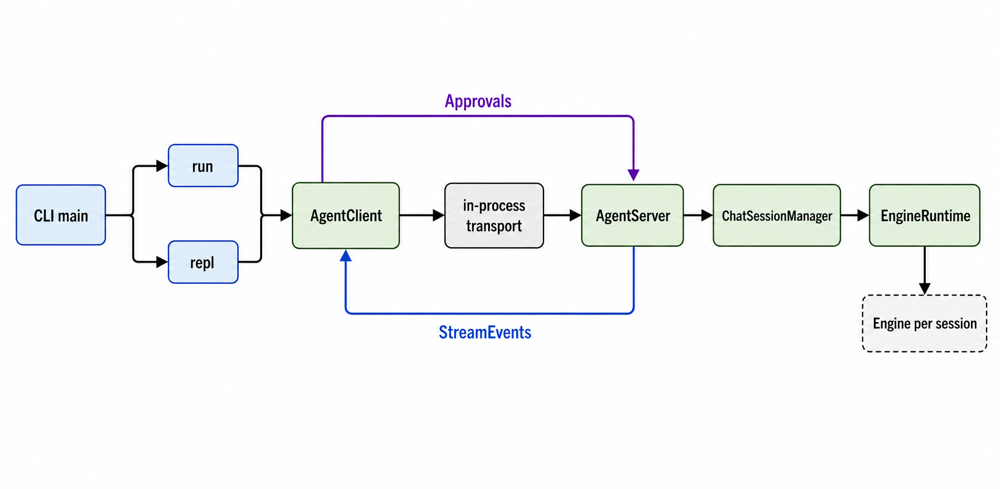
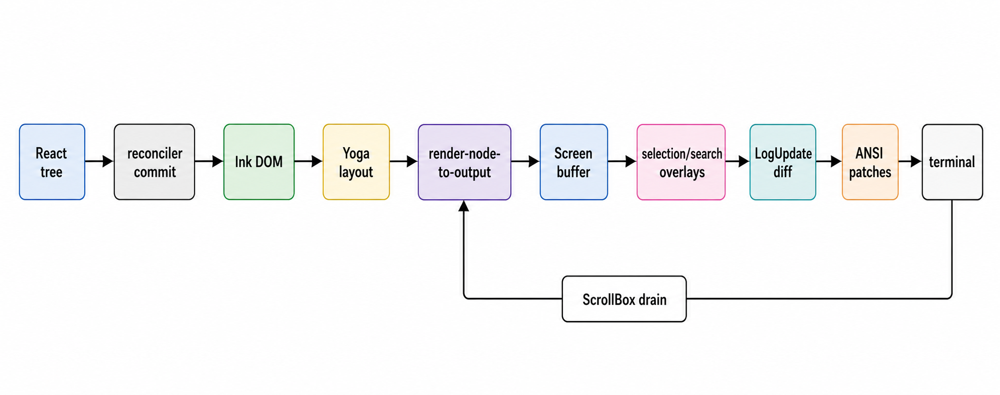

# 09 · TUI Package

> The `code-shell` terminal client: Commander entry points, an Ink-style React REPL, a headless `run` renderer, and a first-party terminal render engine. Source-mapped against the current `packages/tui/src/` tree (~42,147 TS/TSX LOC). The TUI is a protocol client: it creates the protocol/runtime host in-process, but UI code talks through `AgentClient`, not through `Engine.run()` directly.



## 1. Shape of the package

| Area | Key files | Mechanism |
|------|-----------|-----------|
| CLI entry & bootstrap | `cli/main.ts`, `bootstrap/setup.ts` | Commander root and subcommands are built in `main.ts` (`packages/tui/src/cli/main.ts:40`, `packages/tui/src/cli/main.ts:68`, `packages/tui/src/cli/main.ts:101`); the shared `preAction` calls `setup()` before command actions (`packages/tui/src/cli/main.ts:229`, `packages/tui/src/bootstrap/setup.ts:19`). |
| Headless run host | `cli/commands/run.ts`, `cli/output/renderer.ts` | `runCommand()` creates the same in-process `AgentServer`/`AgentClient` stack as the REPL, then binds stream events to an output renderer (`packages/tui/src/cli/commands/run.ts:69`, `packages/tui/src/cli/commands/run.ts:188`, `packages/tui/src/cli/output/renderer.ts:16`). |
| Interactive REPL host | `cli/commands/repl.ts`, `ui/index.tsx`, `ui/App.tsx` | `replCommand()` builds shared runtime/session resources and starts the Ink tree (`packages/tui/src/cli/commands/repl.ts:63`, `packages/tui/src/cli/commands/repl.ts:191`, `packages/tui/src/ui/index.tsx:65`). |
| REPL state & input | `ui/App.tsx`, `ui/store.ts`, `ui/components/{CommandInput,TextInput}.tsx`, `ui/input-history.ts` | `App` is the state machine (`packages/tui/src/ui/App.tsx:130`); chat entries live in an external store (`packages/tui/src/ui/store.ts:14`, `packages/tui/src/ui/store.ts:71`); input combines slash completion, history, multiline paste, and Emacs-style editing (`packages/tui/src/ui/components/CommandInput.tsx:48`, `packages/tui/src/ui/components/TextInput.tsx:87`). |
| Slash commands | `cli/commands/registry.ts`, `cli/commands/builtin/*` | `App` registers the command sets once (`packages/tui/src/ui/App.tsx:100`); `CommandRegistry` parses, dispatches, and renders help (`packages/tui/src/cli/commands/registry.ts:96`, `packages/tui/src/cli/commands/registry.ts:116`, `packages/tui/src/cli/commands/registry.ts:128`). |
| Terminal renderer | `render/`, `native-ts/yoga-layout/` | `src/render` is first-party CodeShell code, not an npm `ink` dependency (`packages/tui/src/render/README.md:7`); it wraps React reconciler commits, a TS Yoga port, cell buffers, overlays, ANSI diffs, and terminal mode cleanup (`packages/tui/src/render/ink.tsx:122`, `packages/tui/src/render/renderer.ts:32`, `packages/tui/src/native-ts/yoga-layout/index.ts:1`). |

`ui/vim-mode.ts` still contains a tested vim-keybinding helper (`packages/tui/src/ui/vim-mode.ts:7`, `packages/tui/src/ui/vim-mode.ts:38`), but current production code does not import it; only `vim-mode.test.ts` does. Treat it as parked/tested input logic, not a wired REPL feature.

## 2. CLI entry and command routing

`cli/main.ts` builds a Commander program with common model/provider/preset/API/permission/output/turn/effort flags (`packages/tui/src/cli/main.ts:49`). The explicit `run` command resolves a task from argv or stdin, then calls `runCommand()` (`packages/tui/src/cli/main.ts:68`, `packages/tui/src/cli/main.ts:82`). The explicit `repl` command calls `replCommand()` (`packages/tui/src/cli/main.ts:101`). Root invocation keeps the old ergonomic split: a bare `[task]` runs headless; no task starts the REPL; `--prefill` exists only on that root/default path (`packages/tui/src/cli/main.ts:176`, `packages/tui/src/cli/main.ts:192`, `packages/tui/src/cli/main.ts:197`).

Other top-level surfaces are registered in the same file: `sessions` lists persisted sessions through core `SessionManager` (`packages/tui/src/cli/main.ts:112`, `packages/tui/src/cli/main.ts:117`), `arena` lazy-imports the arena runner (`packages/tui/src/cli/main.ts:135`, `packages/tui/src/cli/main.ts:144`), and `runs`/`plugin` are mounted from their own modules (`packages/tui/src/cli/main.ts:161`, `packages/tui/src/cli/main.ts:166`).

The shared setup path is intentionally small. `setup()` rotates logs, checks Node >=20.10, validates `cwd`, rejects `bypassPermissions` under root outside the sandbox, and then `chdir`s if needed (`packages/tui/src/bootstrap/setup.ts:22`, `packages/tui/src/bootstrap/setup.ts:31`, `packages/tui/src/bootstrap/setup.ts:42`, `packages/tui/src/bootstrap/setup.ts:53`, `packages/tui/src/bootstrap/setup.ts:70`). The CLI hook currently passes `acceptEdits` as the default permission mode when no flag is supplied (`packages/tui/src/cli/main.ts:229`, `packages/tui/src/cli/main.ts:233`). Cost tracking is installed before parsing, and `parseAsync()` is wrapped so async command failures are reported as CLI errors rather than unhandled rejections (`packages/tui/src/cli/main.ts:237`, `packages/tui/src/cli/main.ts:263`, `packages/tui/src/cli/main.ts:268`).

## 3. Protocol host inside the TUI

The REPL and headless command both host the same protocol stack in-process:

```
seed Engine
  -> shared ModelPool + ToolRegistry
  -> EngineRuntime
  -> ChatSessionManager
  -> AgentServer
  -> createInProcessTransport()
  -> AgentClient
```

In `replCommand()`, settings are loaded with full host-terminal scope (`packages/tui/src/cli/commands/repl.ts:66`), saved-auth/onboarding is resolved before engine construction (`packages/tui/src/cli/commands/repl.ts:80`, `packages/tui/src/cli/commands/repl.ts:90`, `packages/tui/src/cli/commands/repl.ts:100`), and model config comes from the unified catalog with CLI/onboarding fallbacks (`packages/tui/src/cli/commands/repl.ts:122`, `packages/tui/src/cli/commands/repl.ts:126`). The seed `Engine` exists to populate shared resources, then the real sessions are created by `ChatSessionManager.engineFactory` with `origin: "tui"` and per-run protocol slice overrides (`packages/tui/src/cli/commands/repl.ts:173`, `packages/tui/src/cli/commands/repl.ts:178`, `packages/tui/src/cli/commands/repl.ts:200`, `packages/tui/src/cli/commands/repl.ts:203`).

The actual protocol seam is the in-process transport pair plus server/client objects (`packages/tui/src/cli/commands/repl.ts:224`, `packages/tui/src/cli/commands/repl.ts:228`, `packages/tui/src/cli/commands/repl.ts:235`). The REPL uses a fixed logical session id (`"tui-main"`) unless `--resume` supplies one, then passes only the `AgentClient` to `startInkRepl()` (`packages/tui/src/cli/commands/repl.ts:266`, `packages/tui/src/cli/commands/repl.ts:272`). `App.tsx` therefore receives `client: AgentClient` as a prop and all engine interaction goes through that client (`packages/tui/src/ui/App.tsx:118`, `packages/tui/src/ui/App.tsx:131`).

Headless `runCommand()` mirrors this stack, with `headless: true`, one live session, and a generated `run-<uuid>` id unless `--resume` is provided (`packages/tui/src/cli/commands/run.ts:106`, `packages/tui/src/cli/commands/run.ts:125`, `packages/tui/src/cli/commands/run.ts:162`, `packages/tui/src/cli/commands/run.ts:182`, `packages/tui/src/cli/commands/run.ts:192`). It subscribes the selected output renderer to client stream events, awaits `client.run()`, drains background-agent notifications for headless tail output, then closes server before client (`packages/tui/src/cli/commands/run.ts:195`, `packages/tui/src/cli/commands/run.ts:199`, `packages/tui/src/cli/commands/run.ts:203`, `packages/tui/src/cli/commands/run.ts:210`, `packages/tui/src/cli/commands/run.ts:245`).

REPL-only cron is also wired from `repl.ts`: the singleton scheduler gets a `CronStore`, restores jobs, and binds execution to a fresh read-only headless `Engine` per fired job (`packages/tui/src/cli/commands/repl.ts:237`, `packages/tui/src/cli/commands/repl.ts:243`, `packages/tui/src/cli/commands/repl.ts:245`, `packages/tui/src/cli/commands/repl.ts:246`, `packages/tui/src/cli/commands/repl.ts:253`).

## 4. REPL state machine

`App.tsx` is the interactive state machine. It uses a singleton external `ChatStore` for transcript entries, subscribed through `useSyncExternalStore`, rather than keeping the chat log in React state (`packages/tui/src/ui/App.tsx:158`, `packages/tui/src/ui/store.ts:71`, `packages/tui/src/ui/store.ts:169`). That store's `ChatEntry` union covers user messages, streaming/final assistant text, tool lifecycle rows, thinking rows, errors, status/system messages, and sub-agent markers (`packages/tui/src/ui/store.ts:14`). Store updates clone only the entries array and notify isolated listeners (`packages/tui/src/ui/store.ts:87`, `packages/tui/src/ui/store.ts:93`, `packages/tui/src/ui/store.ts:174`).

Stream events enter through `client.onStreamEvent`, which delivers a session envelope that the TUI unwraps to the event body (`packages/tui/src/ui/App.tsx:842`, `packages/tui/src/ui/App.tsx:846`). `handleStreamEvent()` records diagnostics, updates the authoritative session id from `session_started`, and routes high-frequency deltas into buffers (`packages/tui/src/ui/App.tsx:529`, `packages/tui/src/ui/App.tsx:542`, `packages/tui/src/ui/App.tsx:543`). Text deltas accumulate in `textBufferRef` and flush on a 50 ms timer into one streaming assistant entry (`packages/tui/src/ui/App.tsx:410`, `packages/tui/src/ui/App.tsx:457`, `packages/tui/src/ui/App.tsx:487`, `packages/tui/src/ui/App.tsx:603`, `packages/tui/src/ui/App.tsx:608`). Thinking deltas use the same 50 ms coalescing idea for the spinner subtree (`packages/tui/src/ui/App.tsx:416`, `packages/tui/src/ui/App.tsx:424`, `packages/tui/src/ui/App.tsx:576`, `packages/tui/src/ui/App.tsx:579`).

Tool events force-flush pending assistant text, finalize the current streaming row, append `tool_start` plus `tool_running`, then replace the running row with `tool_result` (`packages/tui/src/ui/App.tsx:624`, `packages/tui/src/ui/App.tsx:630`, `packages/tui/src/ui/App.tsx:638`, `packages/tui/src/ui/App.tsx:685`, `packages/tui/src/ui/App.tsx:703`). Sub-agent `agentId` events are deliberately kept out of the main feed for text/tool/task/error rows, while `agent_start` and `agent_end` markers remain visible and `AgentDock` owns sub-agent status/detail navigation (`packages/tui/src/ui/App.tsx:561`, `packages/tui/src/ui/App.tsx:592`, `packages/tui/src/ui/App.tsx:636`, `packages/tui/src/ui/App.tsx:686`, `packages/tui/src/ui/App.tsx:722`, `packages/tui/src/ui/App.tsx:2040`).

Approvals and AskUser prompts share the protocol approval channel. `client.onApprovalRequest()` distinguishes `__ask_user__` from tool approvals and sets either `pendingQuestion` or `pendingApproval` (`packages/tui/src/ui/App.tsx:364`, `packages/tui/src/ui/App.tsx:370`, `packages/tui/src/ui/App.tsx:384`, `packages/tui/src/ui/App.tsx:396`). The bottom overlay later answers through `client.approve()` for permission decisions and question answers (`packages/tui/src/ui/App.tsx:1715`, `packages/tui/src/ui/App.tsx:1730`, `packages/tui/src/ui/App.tsx:1955`, `packages/tui/src/ui/App.tsx:1961`).

Submitting a user turn reserves `QueryGuard`, appends the user/system injection entry only after reservation succeeds, drains staged context/images/goals, then calls `client.run()` in string or object form (`packages/tui/src/ui/App.tsx:1246`, `packages/tui/src/ui/App.tsx:1251`, `packages/tui/src/ui/App.tsx:1265`, `packages/tui/src/ui/App.tsx:1281`, `packages/tui/src/ui/App.tsx:1290`, `packages/tui/src/ui/App.tsx:1310`, `packages/tui/src/ui/App.tsx:1314`). On completion, it flushes buffered text, finalizes transient rows, records cost/duration, and appends non-completed status (`packages/tui/src/ui/App.tsx:1325`, `packages/tui/src/ui/App.tsx:1331`, `packages/tui/src/ui/App.tsx:1339`, `packages/tui/src/ui/App.tsx:1359`, `packages/tui/src/ui/App.tsx:1364`). ESC cancels only the main query; Ctrl+C cancels the main query plus running background agents or exits when idle (`packages/tui/src/ui/App.tsx:1081`, `packages/tui/src/ui/App.tsx:1098`, `packages/tui/src/ui/App.tsx:1103`, `packages/tui/src/ui/App.tsx:1130`, `packages/tui/src/ui/App.tsx:1157`).

## 5. Input and slash commands

The input row is `CommandInput` wrapping `TextInput`. `CommandInput` shows autocomplete only for leading slash commands before the first space, filters by name/description, supports arrow navigation, Tab completion, Enter submit, Esc dismissal, and history navigation when autocomplete is inactive (`packages/tui/src/ui/components/CommandInput.tsx:68`, `packages/tui/src/ui/components/CommandInput.tsx:73`, `packages/tui/src/ui/components/CommandInput.tsx:92`, `packages/tui/src/ui/components/CommandInput.tsx:102`, `packages/tui/src/ui/components/CommandInput.tsx:117`, `packages/tui/src/ui/components/CommandInput.tsx:150`). `TextInput` owns cursor position and handles return, delete/backspace, word jumps, Emacs bindings, paste normalization, multiline rendering, and inverse-video cursor drawing (`packages/tui/src/ui/components/TextInput.tsx:62`, `packages/tui/src/ui/components/TextInput.tsx:87`, `packages/tui/src/ui/components/TextInput.tsx:125`, `packages/tui/src/ui/components/TextInput.tsx:181`, `packages/tui/src/ui/components/TextInput.tsx:213`, `packages/tui/src/ui/components/TextInput.tsx:262`).

Global input handling in `App` owns shortcuts outside the prompt: dock focus/navigation, Ctrl+C, Shift+Tab permission-mode cycling, ESC cancellation, Alt+M model selector, wheel/PageUp/PageDown scroll, and Ctrl+O transcript mode (`packages/tui/src/ui/App.tsx:1018`, `packages/tui/src/ui/App.tsx:1023`, `packages/tui/src/ui/App.tsx:1116`, `packages/tui/src/ui/App.tsx:1173`, `packages/tui/src/ui/App.tsx:1180`, `packages/tui/src/ui/App.tsx:1200`). Shift+Tab cycles `plan -> normal -> bypass` and sends a live `client.configure()` payload where `plan` maps to read-only plan mode/default permissions and `bypass` maps to `bypassPermissions` (`packages/tui/src/ui/permission-mode.ts:3`, `packages/tui/src/ui/permission-mode.ts:5`, `packages/tui/src/ui/permission-mode.ts:10`, `packages/tui/src/ui/App.tsx:1121`).

Slash command dispatch is split cleanly. `App` handles `/help` locally, otherwise builds a `CommandContext` containing protocol client, cwd, model setters, session id, `QueryGuard`, UI openers, fullscreen toggles, pending image queue, and goal hooks (`packages/tui/src/ui/App.tsx:1501`, `packages/tui/src/ui/App.tsx:1508`, `packages/tui/src/ui/App.tsx:1532`, `packages/tui/src/ui/App.tsx:1536`, `packages/tui/src/ui/App.tsx:1570`, `packages/tui/src/ui/App.tsx:1580`). The registry parses the first token, dispatches unknown-command errors, and generates grouped help text with the Shift+Tab/Ctrl+C hint (`packages/tui/src/cli/commands/registry.ts:21`, `packages/tui/src/cli/commands/registry.ts:116`, `packages/tui/src/cli/commands/registry.ts:149`, `packages/tui/src/cli/commands/registry.ts:162`).

## 6. Fullscreen, flow mode, and scrolling

Fullscreen is the default. `CODESHELL_FULLSCREEN` only opts out when set to `0`, `false`, or `off`; otherwise the initial context value is fullscreen (`packages/tui/src/ui/fullscreen-mode.ts:1`, `packages/tui/src/ui/fullscreen-mode.ts:32`, `packages/tui/src/ui/fullscreen-mode.ts:42`). The `/fullscreen` command toggles that context at runtime (`packages/tui/src/cli/commands/builtin/utility-commands.ts:170`, `packages/tui/src/cli/commands/builtin/utility-commands.ts:178`, `packages/tui/src/cli/commands/builtin/utility-commands.ts:191`). `FullscreenLayout` wraps the body in `<AlternateScreen>` only when fullscreen is true; flow mode omits alt-screen and lets transcript output live in native scrollback (`packages/tui/src/ui/components/FullscreenLayout.tsx:47`, `packages/tui/src/ui/components/FullscreenLayout.tsx:87`, `packages/tui/src/ui/components/FullscreenLayout.tsx:154`).

The fullscreen body is a constrained column: scrollable messages, optional overlay/new-message pill, bottom prompt/status, and `AgentDock` (`packages/tui/src/ui/components/FullscreenLayout.tsx:111`, `packages/tui/src/ui/components/FullscreenLayout.tsx:122`, `packages/tui/src/ui/components/FullscreenLayout.tsx:134`, `packages/tui/src/ui/App.tsx:1743`, `packages/tui/src/ui/App.tsx:2040`). On fullscreen-to-flow transitions, the current transcript is summarized into stdout so history is discoverable in terminal scrollback after alt-screen exits (`packages/tui/src/ui/components/FullscreenLayout.tsx:48`, `packages/tui/src/ui/components/FullscreenLayout.tsx:56`, `packages/tui/src/ui/components/FullscreenLayout.tsx:62`, `packages/tui/src/ui/components/FullscreenLayout.tsx:82`).

`ScrollBox` is imperative by design. `scrollTo`/`scrollBy` mutate the DOM node, mark it dirty, notify subscribers, and schedule a microtask render; wheel input accumulates `pendingScrollDelta` rather than calling React state per event (`packages/tui/src/render/components/ScrollBox.tsx:52`, `packages/tui/src/render/components/ScrollBox.tsx:130`, `packages/tui/src/render/components/ScrollBox.tsx:145`, `packages/tui/src/render/components/ScrollBox.tsx:185`, `packages/tui/src/render/components/ScrollBox.tsx:192`). In `App`, one wheel notch maps to one row (`scrollBy(key.wheelUp ? -1 : 1)`), while PageUp/PageDown use viewport minus two rows (`packages/tui/src/ui/App.tsx:1189`, `packages/tui/src/ui/App.tsx:1193`). The renderer computes scroll height from the content wrapper, applies sticky-bottom follow, drains pending deltas, emits DECSTBM scroll hints for small pure scrolls, and culls off-viewport children (`packages/tui/src/render/render-node-to-output.ts:701`, `packages/tui/src/render/render-node-to-output.ts:721`, `packages/tui/src/render/render-node-to-output.ts:758`, `packages/tui/src/render/render-node-to-output.ts:803`, `packages/tui/src/render/render-node-to-output.ts:887`, `packages/tui/src/render/render-node-to-output.ts:1401`).

## 7. Render engine



`src/render/` is the in-tree terminal runtime. The public surface is intentionally narrow (`Box`, `Text`, `ScrollBox`, `AlternateScreen`, `Ansi`, hooks, `render`, `createRoot`, etc.), and the README marks everything else as internal (`packages/tui/src/render/README.md:13`, `packages/tui/src/render/README.md:27`, `packages/tui/src/render/README.md:43`, `packages/tui/src/render/README.md:52`, `packages/tui/src/render/README.md:67`). `startInkRepl()` calls `render()` with `stdout`, `stdin`, `stderr`, `exitOnCtrlC`, and an `onFrame` probe that feeds UI perf/devtools (`packages/tui/src/ui/index.tsx:65`, `packages/tui/src/ui/index.tsx:78`, `packages/tui/src/ui/index.tsx:84`, `packages/tui/src/ui/index.tsx:95`).

The root API creates or reuses an `Ink` instance per stdout stream (`packages/tui/src/render/root.ts:76`, `packages/tui/src/render/root.ts:90`, `packages/tui/src/render/root.ts:172`). `Ink` owns terminal dimensions, front/back frame buffers, style/char/hyperlink pools, selection state, focus, cursor declarations, and the reconciler container (`packages/tui/src/render/ink.tsx:122`, `packages/tui/src/render/ink.tsx:131`, `packages/tui/src/render/ink.tsx:135`, `packages/tui/src/render/ink.tsx:146`, `packages/tui/src/render/ink.tsx:179`, `packages/tui/src/render/ink.tsx:225`). Reconciler commits update an internal DOM tree; `onComputeLayout` then runs Yoga with the terminal width, and the throttled render path runs after layout effects so cursor declarations do not lag a keystroke (`packages/tui/src/render/ink.tsx:262`, `packages/tui/src/render/ink.tsx:271`, `packages/tui/src/render/ink.tsx:302`, `packages/tui/src/render/ink.tsx:309`, `packages/tui/src/render/ink.tsx:325`).

The native layout layer is a pure TypeScript Yoga subset. It documents the supported flexbox surface, exports `Node`, and exposes `calculateLayout()` plus counters read by render profiling (`packages/tui/src/native-ts/yoga-layout/index.ts:1`, `packages/tui/src/native-ts/yoga-layout/index.ts:403`, `packages/tui/src/native-ts/yoga-layout/index.ts:927`, `packages/tui/src/native-ts/yoga-layout/index.ts:1035`). The render adapter clamps alt-screen height to terminal rows, resets scroll/damage state, calls `renderNodeToOutput()`, and returns `scrollHint`/`scrollDrainPending` metadata to the Ink frame loop (`packages/tui/src/render/renderer.ts:85`, `packages/tui/src/render/renderer.ts:98`, `packages/tui/src/render/renderer.ts:115`, `packages/tui/src/render/renderer.ts:132`, `packages/tui/src/render/renderer.ts:149`).

`render-node-to-output.ts` paints DOM nodes into a `Screen` buffer. It handles text squashing/wrapping/OSC 8 hyperlinks, raw ANSI, background fills, borders, clipping, no-select regions, scroll viewport culling, blit-from-prev-screen fast paths, layout-shift detection, and cache invalidation (`packages/tui/src/render/render-node-to-output.ts:390`, `packages/tui/src/render/render-node-to-output.ts:465`, `packages/tui/src/render/render-node-to-output.ts:562`, `packages/tui/src/render/render-node-to-output.ts:641`, `packages/tui/src/render/render-node-to-output.ts:668`, `packages/tui/src/render/render-node-to-output.ts:1227`, `packages/tui/src/render/render-node-to-output.ts:1253`). `screen.ts` interns chars, hyperlinks, and styles so diffs compare compact ids and style transitions are cached (`packages/tui/src/render/screen.ts:15`, `packages/tui/src/render/screen.ts:21`, `packages/tui/src/render/screen.ts:55`, `packages/tui/src/render/screen.ts:112`, `packages/tui/src/render/screen.ts:148`).

`Ink.onRender()` is the frame coordinator: flush `<Static>` nodes, render DOM to a frame, translate active selections with follow-scroll, apply selection/search overlays, force full damage on layout shifts/overlays, compute the ANSI diff, optimize patches, park the cursor, write to the terminal, and schedule scroll-drain follow-up frames (`packages/tui/src/render/ink.tsx:575`, `packages/tui/src/render/ink.tsx:599`, `packages/tui/src/render/ink.tsx:606`, `packages/tui/src/render/ink.tsx:628`, `packages/tui/src/render/ink.tsx:691`, `packages/tui/src/render/ink.tsx:730`, `packages/tui/src/render/ink.tsx:761`, `packages/tui/src/render/ink.tsx:797`, `packages/tui/src/render/ink.tsx:911`, `packages/tui/src/render/ink.tsx:933`). `LogUpdate.render()` handles resize/full-reset cases, DECSTBM hardware-scroll optimization, per-cell diffing, flow-mode scrollback preservation, and row-slice growth (`packages/tui/src/render/log-update.ts:123`, `packages/tui/src/render/log-update.ts:136`, `packages/tui/src/render/log-update.ts:160`, `packages/tui/src/render/log-update.ts:198`, `packages/tui/src/render/log-update.ts:347`, `packages/tui/src/render/log-update.ts:460`). `terminal.ts` detects DEC 2026 support, skips it under tmux, and wraps terminal writes in BSU/ESU synchronized output markers when allowed (`packages/tui/src/render/terminal.ts:67`, `packages/tui/src/render/terminal.ts:70`, `packages/tui/src/render/terminal.ts:181`, `packages/tui/src/render/terminal.ts:190`, `packages/tui/src/render/terminal.ts:200`, `packages/tui/src/render/terminal.ts:206`).

Text selection is owned by the `Ink` instance and only active in alt-screen. The frame loop applies selection overlays, copy-on-select uses `copySelectionNoClear()` on finish, and mouse/keyboard selection APIs update the shared selection state before repainting (`packages/tui/src/render/ink.tsx:179`, `packages/tui/src/render/ink.tsx:712`, `packages/tui/src/render/ink.tsx:1249`, `packages/tui/src/render/ink.tsx:1491`, `packages/tui/src/render/ink.tsx:1590`). Search highlighting uses both scan overlays and position-based "current match" highlights without reflowing layout (`packages/tui/src/render/ink.tsx:183`, `packages/tui/src/render/ink.tsx:717`, `packages/tui/src/render/render-to-screen.ts:49`, `packages/tui/src/render/render-to-screen.ts:150`, `packages/tui/src/render/render-to-screen.ts:213`).

## 8. Headless output

For `code-shell run`, `createRenderer()` selects `text`, `json`, `jsonl`, or `stream-json` renderers (`packages/tui/src/cli/output/renderer.ts:14`, `packages/tui/src/cli/output/renderer.ts:119`). The text renderer writes only main-agent `text_delta` to stdout, while agent/tool lifecycle and errors go to stderr with sub-agent indentation (`packages/tui/src/cli/output/renderer.ts:21`, `packages/tui/src/cli/output/renderer.ts:30`, `packages/tui/src/cli/output/renderer.ts:37`, `packages/tui/src/cli/output/renderer.ts:57`, `packages/tui/src/cli/output/renderer.ts:64`, `packages/tui/src/cli/output/renderer.ts:76`). JSON mode accumulates final text and emits one result object; JSONL and stream-json write every stream event plus a final result envelope (`packages/tui/src/cli/output/renderer.ts:91`, `packages/tui/src/cli/output/renderer.ts:101`, `packages/tui/src/cli/output/renderer.ts:110`).

## 9. Invariants worth remembering

1. **Thin UI boundary.** `App` receives `AgentClient`; sessions, persistence, tools, and `Engine` execution live behind the protocol/server/session manager seam (`packages/tui/src/ui/App.tsx:118`, `packages/tui/src/cli/commands/repl.ts:200`, `packages/tui/src/cli/commands/repl.ts:228`).
2. **Render rate is bounded at the UI edge.** Text and thinking deltas are coalesced to 50 ms before touching React/store state (`packages/tui/src/ui/App.tsx:416`, `packages/tui/src/ui/App.tsx:457`, `packages/tui/src/ui/App.tsx:576`, `packages/tui/src/ui/App.tsx:608`).
3. **Fullscreen is the default interaction model.** Flow mode exists and is user-selectable, but default startup is alt-screen + virtual scroll for clean resize behavior (`packages/tui/src/ui/fullscreen-mode.ts:8`, `packages/tui/src/ui/fullscreen-mode.ts:17`, `packages/tui/src/ui/fullscreen-mode.ts:32`).
4. **The renderer is first-party infrastructure.** `render/README.md` explicitly says npm `ink` is not a dependency and the directory is self-maintained (`packages/tui/src/render/README.md:7`, `packages/tui/src/render/README.md:9`).
5. **Terminal correctness is stateful.** Alt-screen resize, SIGCONT, external TUI handoff, stderr interception, cursor parking, and signal-exit cleanup all live in `Ink`, so renderer changes need terminal-mode testing as well as React snapshot thinking (`packages/tui/src/render/ink.tsx:381`, `packages/tui/src/render/ink.tsx:434`, `packages/tui/src/render/ink.tsx:1092`, `packages/tui/src/render/ink.tsx:1134`, `packages/tui/src/render/ink.tsx:1703`, `packages/tui/src/render/ink.tsx:1838`).

When verifying TUI changes, use the source-entry dev command from the repo root: `bun run dev:tui` (`package.json:22`). Renderer performance baselines can be refreshed with `bun run bench:render` (`packages/tui/src/render/README.md:123`, `package.json:26`).

## 10. Where to read next

- The protocol the TUI rides: [04 · Protocol & sessions](04-protocol-and-sessions.md)
- The engine behind `client.run`: [01 · Engine & turn loop](01-engine-and-turn-loop.md)
- Long-running background agents, cron, and goals: [06 · Long-running orchestration](06-long-running-orchestration.md)
- The desktop/mobile hosts using the same protocol concepts: [10 · Desktop & mobile](10-desktop-and-mobile.md)
