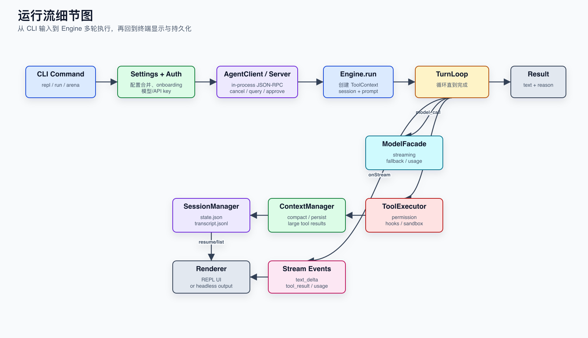
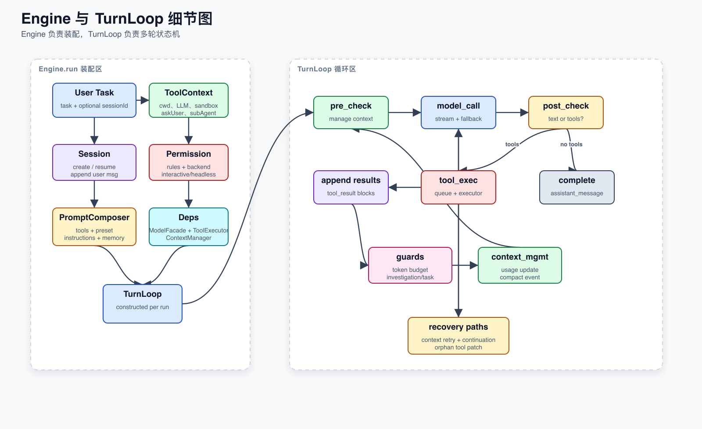
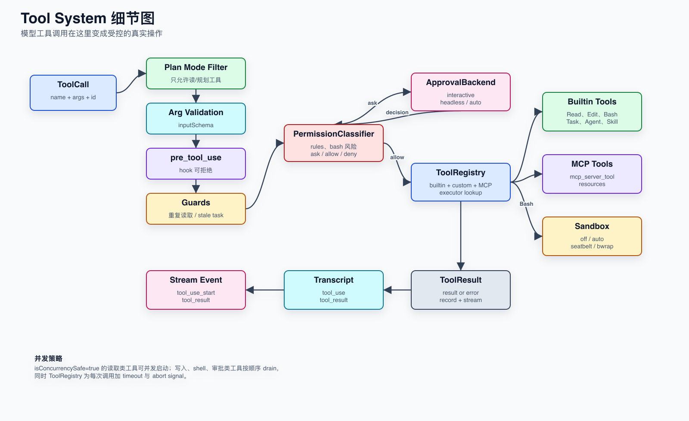
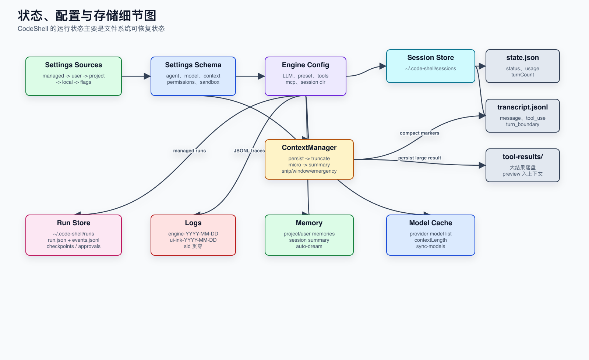
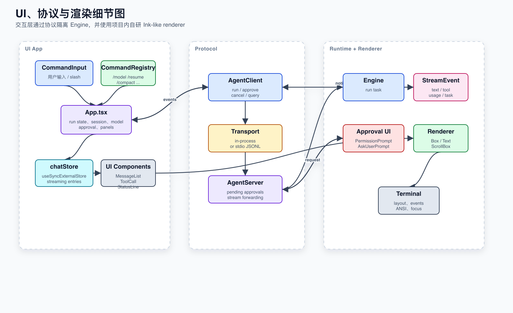
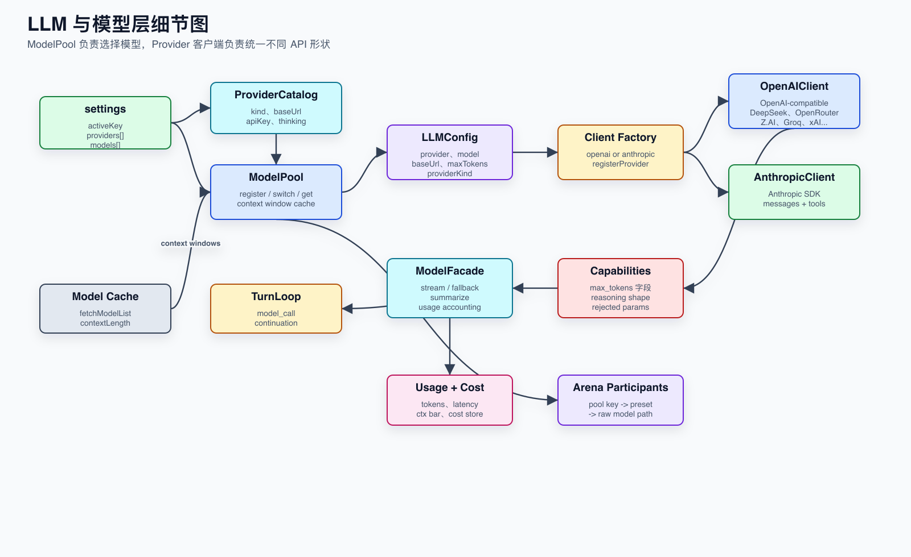
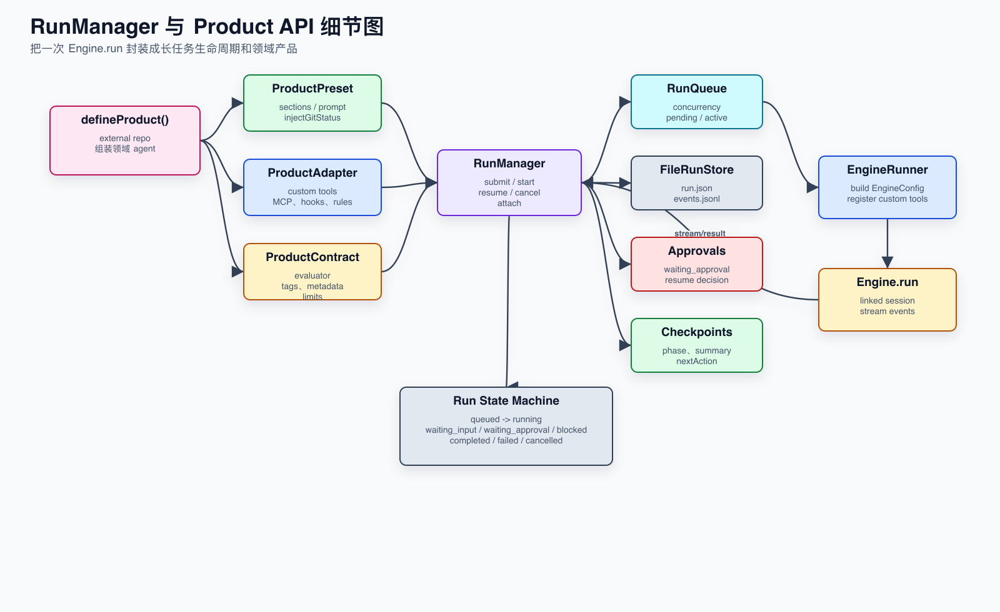
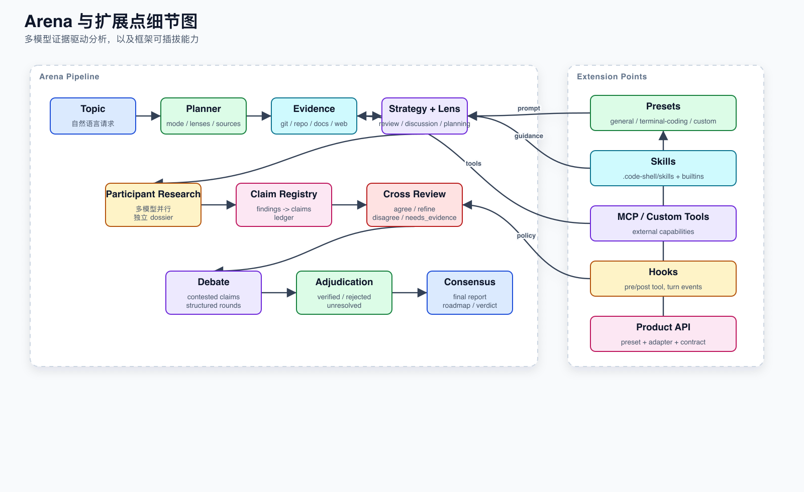

# Architecture Diagrams

> Generated on 2026-05-15. Source generator: [`generate-diagrams.mjs`](generate-diagrams.mjs).

This page collects the rough framework introduction image and the module detail images. PNG and SVG files live in [`images/`](images/); the SVG files are the editable/vector source, and PNG files are convenient previews.

## 1. Framework Overview

Related doc: [System Overview](01-system-overview.md)

## 2. Runtime Flow

Related doc: [Runtime Flow](02-runtime-flow.md)

## 3. Engine and Turn Loop

Related docs: [Runtime Flow](02-runtime-flow.md), [Module Map](03-module-map.md)

## 4. Tool System

Related doc: [Tool System](04-tool-system.md)

## 5. State, Config, and Storage

Related doc: [State, Config, and Storage](05-state-config-storage.md)

## 6. UI, Protocol, and Rendering

Related doc: [UI, Protocol, and Rendering](06-ui-protocol-rendering.md)

## 7. LLM and Model Layer

Related doc: [LLM and Model Layer](07-llm-model-layer.md)

## 8. RunManager and Product API

Related docs: [Extension Points](08-extension-points.md), [Build, Test, and Operations](09-build-test-ops.md)

## 9. Arena and Extension Points

Related doc: [Extension Points](08-extension-points.md)
