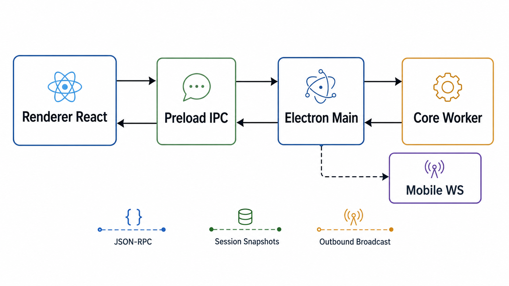
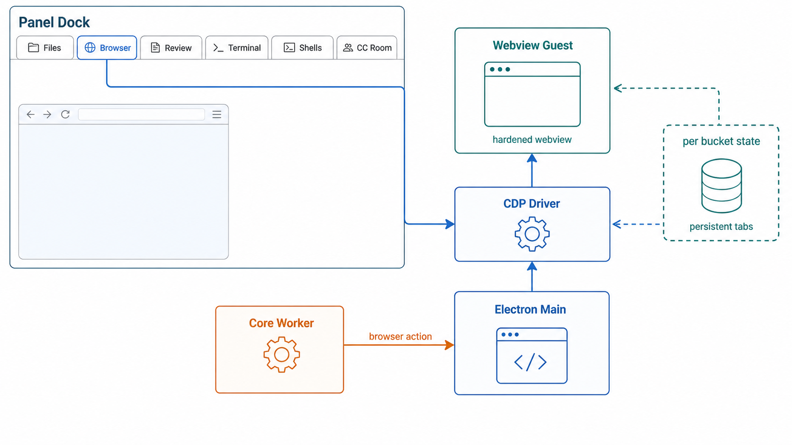
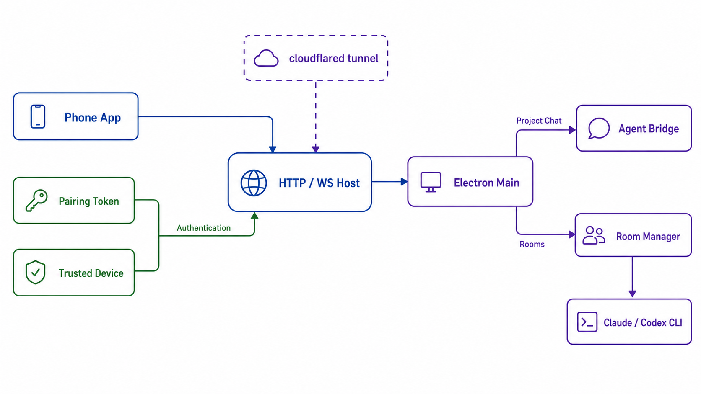

# 10 · Desktop & Mobile

> The headline product shell: an Electron desktop client, a phone-remote React app, and the environment-agnostic CDP browser-action layer. Source-mapped against `packages/desktop/` and `packages/cdp/`.

## 1. Runtime boundary

The invariant: **Electron main is an IPC service broker, not the `Engine` host**. It owns BrowserWindows, OS/filesystem/native services, hardened webviews, mobile HTTP/WS, and the stdio pipe to the core worker. The renderer and the phone are clients of that broker.

- Main keeps a **process-global** `AgentBridge`; extra windows are additional views into the same bridge, not independent engine hosts (`packages/desktop/src/main/index.ts:244`, `packages/desktop/src/main/index.ts:1320`). `AgentBridge` is the only place that spawns `@cjhyy/code-shell-core/bin/agent-server-stdio` (`packages/desktop/src/main/agent-bridge.ts:1`, `packages/desktop/src/main/agent-bridge.ts:61`).
- The worker is spawned on demand for `agent/run` with `ELECTRON_RUN_AS_NODE=1` and `CODESHELL_AGENT_STDIO=1`; `cwd` falls back through the main-side repo resolver before spawn (`packages/desktop/src/main/agent-bridge.ts:140`, `packages/desktop/src/main/agent-bridge.ts:274`). Clean exit resets restart accounting; repeated crashes in the 60-second window eventually surface as `gave_up` (`packages/desktop/src/main/agent-bridge.ts:223`, `packages/desktop/src/main/agent-bridge.ts:257`).
- Worker stdout lines are parsed once in main: normal JSON-RPC lines are sent to the renderer as `agent:msg`, session snapshots are retained in main, and outbound taps feed the mobile remote (`packages/desktop/src/main/agent-bridge.ts:95`, `packages/desktop/src/main/agent-bridge.ts:170`, `packages/desktop/src/main/agent-bridge.ts:556`).
- The preload is a typed transport boundary. It parses `agent:msg`, resolves pending RPCs, fans notifications out to stream/automation/mobile/approval/status listeners, rejects pending calls on worker death, and deliberately passes `timeoutMs = 0` for `agent/run` (`packages/desktop/src/preload/index.ts:81`, `packages/desktop/src/preload/index.ts:141`, `packages/desktop/src/preload/index.ts:160`, `packages/desktop/src/preload/index.ts:228`). Renderer-visible shared types are type-only imports, not runtime core imports (`packages/desktop/src/preload/types.d.ts:1`).
- The renderer process is isolated: BrowserWindows use preload, `contextIsolation`, no Node integration, sandboxing, and a renderer-origin CSP; the webview tag is enabled only because the embedded browser panel needs it (`packages/desktop/src/main/index.ts:1133`, `packages/desktop/src/main/index.ts:1173`, `packages/desktop/src/main/index.ts:1241`).

## 2. Main-process services (`src/main/`)

The main tree is now a service broker around roughly eighty non-test TS/TSX files. A representative slice:

| Area | Current source truth |
|------|----------------------|
| Agent bridge | Spawns and supervises the stdio worker, injects mobile-originated JSON-RPC, preserves snapshots, and intercepts `__browser_action__` / `__credential_action__` before they reach the renderer (`packages/desktop/src/main/agent-bridge.ts:274`, `packages/desktop/src/main/agent-bridge.ts:363`, `packages/desktop/src/main/agent-bridge.ts:424`, `packages/desktop/src/main/agent-bridge.ts:520`). |
| Browser host | Hardens every webview guest, strips renderer-controlled preload, forces sandboxed web preferences, normalizes partitions, registers guests, blocks non-web navigations, and routes new-window attempts into tabs (`packages/desktop/src/main/index.ts:1067`). Popout browser windows are the same renderer with `?popout=browser` and shared anchor state (`packages/desktop/src/main/index.ts:1338`). |
| Files/git/shell services | `desktop-services.ts` shells out asynchronously for git/status/path helpers (`packages/desktop/src/main/desktop-services.ts:57`); `fs-service.ts` resolves real paths under the project root, skips symlink escapes, caps file reads at 2 MB, and sniffs binary content (`packages/desktop/src/main/fs-service.ts:24`, `packages/desktop/src/main/fs-service.ts:81`). |
| Terminal | `pty-service.ts` lazily loads the native `node-pty` addon, starts or reuses PTYs by session id, replays scrollback, emits `pty:data` / `pty:exit`, and reaps sessions when a BrowserWindow dies (`packages/desktop/src/main/pty-service.ts:1`, `packages/desktop/src/main/pty-service.ts:175`, `packages/desktop/src/main/pty-service.ts:229`). |
| Credentials | Credential restore targets the browser cookie partition, clears or merges cookies, and then asks the renderer browser panel to reload (`packages/desktop/src/main/credentials-service.ts:17`, `packages/desktop/src/main/credentials-service.ts:44`, `packages/desktop/src/main/credentials-service.ts:84`, `packages/desktop/src/main/agent-bridge.ts:424`). |
| Mobile remote and rooms | Device state lives under `<userData>/mobile-remote`, tunnel status is broadcast to renderers, room agents are created by `RoomManager`, and approvals are bridged to both desktop and phones (`packages/desktop/src/main/index.ts:261`, `packages/desktop/src/main/index.ts:337`, `packages/desktop/src/main/index.ts:369`, `packages/desktop/src/main/index.ts:391`). |
| Sessions, runs, automation | Disk sessions are listed asynchronously and filtered by cwd existence (`packages/desktop/src/main/sessions-service.ts:105`); `runs-service.ts` remains a read-only run-store adapter (`packages/desktop/src/main/runs-service.ts:1`); automation events are accepted from the worker and rebroadcast to desktop UI state (`packages/desktop/src/main/agent-bridge.ts:591`). |
| Settings and extensions | Settings writes are serialized per path and also take the shared core lock before temp-file rename (`packages/desktop/src/main/settings-service.ts:59`, `packages/desktop/src/main/settings-service.ts:98`). Plugin, marketplace, skill, GitHub skill, model metadata, MCP probe, memory, Dream, updater, menu, and window-state services are all composed from `index.ts` imports (`packages/desktop/src/main/index.ts:1`). |

The recurring performance rule remains: main-side operations should avoid synchronous filesystem work in UI paths, because the main process is the event loop for every desktop window.

## 3. Renderer and panels (`src/renderer/`)

React owns UI state, routing, and presentation; main owns capabilities. `App.tsx` is now the composition root rather than the sole owner of every renderer concern: bucket override/transcript hydration, automation import, session navigation, host subscriptions, run control, and panel buckets live in focused hooks under `packages/desktop/src/renderer/app/`. `AppShell.tsx` and `SessionPanelDock.tsx` own the large JSX shells. Incoming `StreamEvent` envelopes are still routed by `sessionId`, coalesced for noisy deltas, and reduced into the correct bucket. Sends still go through `window.codeshell.run`, with cwd, model, goal, and session metadata pinned at dispatch time.

The panel dock is bucket-owned and currently has six panel kinds: `files`, `browser`, `review`, `terminal`, `shells`, and `ccRoom` (`packages/desktop/src/renderer/panels/PanelArea.tsx:90`). Dynamic tabs stay mounted and are hidden with CSS, so browser, terminal, and shell state survive panel switches (`packages/desktop/src/renderer/panels/PanelArea.tsx:113`). The content map wires each tab kind to its concrete surface: `FilesPanel`, `BrowserPanel`, `ReviewPanel`, `TerminalPanel`, `BackgroundShellPanel`, and `CCRoomView`; browser partitions are bucket-scoped, terminal session ids include the bucket/tab id, and background shells receive the active engine session (`packages/desktop/src/renderer/panels/PanelArea.tsx:421`).

The browser panel is not a normal iframe. It is an Electron `webview` with an address bar, tabs, localhost bookmarks, element picking, and anchor echo back into chat context (`packages/desktop/src/renderer/panels/BrowserPanel.tsx:94`, `packages/desktop/src/renderer/panels/BrowserPanel.tsx:118`, `packages/desktop/src/renderer/panels/BrowserPanel.tsx:360`). `WebviewHost` freezes initial `src` and partition so React rerenders do not re-drive navigation or mutate storage identity (`packages/desktop/src/renderer/browser/WebviewHost.tsx:4`, `packages/desktop/src/renderer/browser/WebviewHost.tsx:21`). `useBrowserTabs` owns lifecycle, target-blank tab creation, reload after cookie switch, and prop-driven open-url requests from chat while the panel is closed (`packages/desktop/src/renderer/browser/useBrowserTabs.ts:60`, `packages/desktop/src/renderer/browser/useBrowserTabs.ts:199`, `packages/desktop/src/renderer/browser/useBrowserTabs.ts:209`, `packages/desktop/src/renderer/browser/useBrowserTabs.ts:215`).

Terminal and files follow the same capability split. The terminal renderer is xterm-style UI over main-process `node-pty` IPC, uses a window-unique session prefix, and intentionally does not kill PTYs when the panel unmounts (`packages/desktop/src/renderer/panels/TerminalPanel.tsx:15`, `packages/desktop/src/renderer/panels/TerminalPanel.tsx:28`, `packages/desktop/src/renderer/panels/TerminalPanel.tsx:62`, `packages/desktop/src/renderer/panels/TerminalPanel.tsx:104`). `FilesPanel` lazy-loads directories, caps previews through `fs:readFile`, refreshes on `codeshell:files-changed`, and resolves path-link reveal under cwd (`packages/desktop/src/renderer/panels/FilesPanel.tsx:80`, `packages/desktop/src/renderer/panels/FilesPanel.tsx:100`, `packages/desktop/src/renderer/panels/FilesPanel.tsx:122`).

Mobile-originated and automation-originated events land in the same bucket model as desktop sends. `useHostSubscriptions.ts` owns mobile/automation/approval/stream listener setup and cleanup; `useAutomationSessionImport.ts` rebuilds automation sessions; `useBucketOverrides.ts` keeps phone permission overrides aligned with desktop buckets. The normal renderer mounts with `I18nProvider`, `DialogProvider`, and `ToastProvider`; browser popouts mount a smaller `BrowserPopoutApp` from the same entry file (`packages/desktop/src/renderer/main.tsx`).

## 4. Mobile remote (`src/mobile/` and `src/main/mobile-remote/`)

The phone app is a separate Vite build rooted at `src/mobile`, served under `/mobile/`, and it talks to desktop through HTTP and WebSocket rather than Electron preload (`packages/desktop/vite.mobile.config.ts:6`, `packages/desktop/vite.mobile.config.ts:18`, `packages/desktop/vite.mobile.config.ts:38`). In production the main process serves `out/mobile`; in development it can proxy to the mobile Vite server, while preserving the `/mobile` prefix and SPA fallback (`packages/desktop/src/main/mobile-remote/mobile-static.ts:5`, `packages/desktop/src/main/mobile-remote/mobile-static.ts:100`).

The remote host binds a real LAN IPv4 for LAN mode, or `127.0.0.1` for tunnel mode (`packages/desktop/src/main/mobile-remote/remote-host-manager.ts:13`, `packages/desktop/src/main/mobile-remote/remote-host-manager.ts:225`). It gates every HTTP route with the tunnel passcode when a public tunnel is active, serves `/health` and `/mobile`, and accepts WebSocket clients on `/ws` (`packages/desktop/src/main/mobile-remote/remote-host-manager.ts:130`). Pairing uses a one-use random token with a 10-minute TTL (`packages/desktop/src/main/mobile-remote/pairing.ts:9`); unauthenticated sockets can only pair/auth, and authenticated events are handed to main with a `deviceId` (`packages/desktop/src/main/mobile-remote/remote-host-manager.ts:184`, `packages/desktop/src/main/mobile-remote/remote-host-manager.ts:275`).

Main routes authenticated mobile events before they touch the worker. `ccRoom.*` goes to the external-session path, `room.*` goes to `RoomManager`, and project-chat events go through `AgentBridge.injectWorkerMessage` so there is still only one core run loop (`packages/desktop/src/main/index.ts:633`, `packages/desktop/src/main/index.ts:640`). Project chat sends resolve device cwd/permission mode, broadcast `agent/mobileSession` to desktop, then inject `agent/run`; approvals inject `agent/approve`; stop injects `agent/cancel`; model and goal operations use a short-lived outbound-tap request/response helper (`packages/desktop/src/main/index.ts:579`, `packages/desktop/src/main/index.ts:704`, `packages/desktop/src/main/index.ts:737`, `packages/desktop/src/main/index.ts:771`, `packages/desktop/src/main/index.ts:836`).

Rooms are separate from project chat. The room root is `<userData>/mobile-remote/rooms`, old rooms are garbage-collected after 14 days, and each room has an on-disk log with monotonic sequence numbers (`packages/desktop/src/main/index.ts:391`, `packages/desktop/src/main/index.ts:432`, `packages/desktop/src/main/mobile-remote/room-manager.ts:174`, `packages/desktop/src/main/mobile-remote/room-manager.ts:313`). `ResidentAgentProcess` runs long-lived Claude stream-json sessions with the stdio permission prompt tool (`packages/desktop/src/main/mobile-remote/resident-agent.ts:152`, `packages/desktop/src/main/mobile-remote/resident-agent.ts:195`); `CodexRoomAgent` runs one `codex exec --json` process per turn and resumes by thread id (`packages/desktop/src/main/mobile-remote/codex-room-agent.ts:10`, `packages/desktop/src/main/mobile-remote/codex-room-agent.ts:17`, `packages/desktop/src/main/mobile-remote/codex-room-agent.ts:95`). Room approvals are normalized through `ApprovalBridge`, with a five-minute auto-deny timeout (`packages/desktop/src/main/cc-room/approval-bridge.ts:30`).

The phone React app folds typed server events and raw worker JSON-RPC lines into the same chat model. `useRemoteSocket` derives the `/ws` URL, authenticates with pairing or trusted device credentials, and reconnects on visibility/network changes (`packages/desktop/src/mobile/hooks/useRemoteSocket.ts:14`, `packages/desktop/src/mobile/hooks/useRemoteSocket.ts:100`, `packages/desktop/src/mobile/hooks/useRemoteSocket.ts:178`). `useRemoteApp` imports the shared desktop stream reducer, isolates raw `agent/streamEvent` by bound session, sends `room.send` for room chats and `chat.send` for project chats, and de-duplicates approval responses (`packages/desktop/src/mobile/hooks/useRemoteApp.ts:12`, `packages/desktop/src/mobile/hooks/useRemoteApp.ts:442`, `packages/desktop/src/mobile/hooks/useRemoteApp.ts:510`, `packages/desktop/src/mobile/hooks/useRemoteApp.ts:620`). The mobile UI is a phone/tablet layout with side pane, approvals, goal controls, message stream, and composer (`packages/desktop/src/mobile/App.tsx:17`, `packages/desktop/src/mobile/App.tsx:58`, `packages/desktop/src/mobile/components/MessageStream.tsx:30`).

Optional public access is a Cloudflare quick tunnel around the loopback host. The tunnel manager starts `cloudflared tunnel --url ... --protocol http2`, waits for a `trycloudflare.com` URL plus `/ready`, broadcasts tunnel status, and does not auto-restart because silent URL changes would break pairing (`packages/desktop/src/main/mobile-remote/tunnel-manager.ts:57`, `packages/desktop/src/main/mobile-remote/tunnel-manager.ts:101`, `packages/desktop/src/main/mobile-remote/tunnel-manager.ts:146`).

## 5. CDP browser-action layer (`packages/cdp/`)

`packages/cdp` is the environment-agnostic action layer. It exports a driver with no Playwright, no Electron dependency, and zero runtime deps; the host injects only `CdpSender = (method, params) => Promise<unknown>` (`packages/cdp/src/index.ts:1`, `packages/cdp/src/driver.ts:1`). The package reads raw `Accessibility.getFullAXTree`, applies caps for content/link/image extraction, and drives browser interaction through CDP input/page/runtime commands (`packages/cdp/src/driver.ts:24`, `packages/cdp/src/driver.ts:53`, `packages/cdp/src/driver.ts:78`, `packages/cdp/src/driver.ts:113`, `packages/cdp/src/driver.ts:157`, `packages/cdp/src/driver.ts:200`, `packages/cdp/src/driver.ts:234`, `packages/cdp/src/driver.ts:288`, `packages/cdp/src/driver.ts:351`).

Desktop glue lives under `src/main/browser-driver/`. `electron-cdp.ts` is the only layer that touches Electron `webContents.debugger`; it attaches/detaches and converts debugger commands into a `CdpSender` (`packages/desktop/src/main/browser-driver/electron-cdp.ts:1`, `packages/desktop/src/main/browser-driver/electron-cdp.ts:16`, `packages/desktop/src/main/browser-driver/electron-cdp.ts:33`). `cdp-driver.ts` wraps the package driver, flattens AX snapshots, owns the ref-to-backend-node map, and exposes the core `BrowserBridge` shape (`packages/desktop/src/main/browser-driver/cdp-driver.ts:1`, `packages/desktop/src/main/browser-driver/cdp-driver.ts:39`, `packages/desktop/src/main/browser-driver/cdp-driver.ts:61`, `packages/desktop/src/main/browser-driver/cdp-driver.ts:119`).

The action path is worker -> `__browser_action__` stdout -> `AgentBridge` -> active webview guest -> CDP driver -> worker stdin. `automation-host.ts` keeps a per-guest driver cache so refs and debugger attachment survive consecutive actions on the same tab, auto-opens the browser panel when needed, enforces domain whitelist/sensitive-action hooks, and returns structured errors instead of throwing through the worker bridge (`packages/desktop/src/main/browser-driver/automation-host.ts:1`, `packages/desktop/src/main/browser-driver/automation-host.ts:18`, `packages/desktop/src/main/browser-driver/automation-host.ts:54`, `packages/desktop/src/main/browser-driver/automation-host.ts:116`, `packages/desktop/src/main/browser-driver/automation-host.ts:153`, `packages/desktop/src/main/browser-driver/automation-host.ts:170`).

## 6. Build

The desktop package has four build products:

- `build:main` and `build:preload` run esbuild; `build:renderer` and `build:mobile` run Vite (`packages/desktop/package.json:13`, `packages/desktop/scripts/build.ts:15`, `packages/desktop/scripts/build.ts:32`, `packages/desktop/scripts/build.ts:45`, `packages/desktop/scripts/build.ts:59`).
- Main is bundled for Electron/Node with `electron` and `@cjhyy/code-shell-core` externalized; preload is CommonJS and also externalizes Electron (`packages/desktop/scripts/build.ts:15`, `packages/desktop/scripts/build.ts:32`).
- The renderer Vite config is renderer-only and aliases UI/protocol paths without making the renderer a Node process (`packages/desktop/vite.config.ts:6`, `packages/desktop/vite.config.ts:20`). Mobile has its own Vite config, root, dev-server port, and `out/mobile` target (`packages/desktop/vite.mobile.config.ts:18`, `packages/desktop/vite.mobile.config.ts:27`, `packages/desktop/vite.mobile.config.ts:38`).
- Runtime desktop dependencies are intentionally narrow: the core package and `node-pty`; `node-pty` is unpacked from asar because it is a native module (`packages/desktop/package.json:42`, `packages/desktop/package.json:107`).

## 7. Where to read next
- The worker's engine and the StreamEvents it emits: [01 · Engine & turn loop](01-engine-and-turn-loop.md)
- The protocol the worker speaks over stdio: [04 · Protocol & sessions](04-protocol-and-sessions.md)
- The `BrowserBridge` contract and browser tools: [02 · Tool system](02-tool-system.md)
- The same reducer/renderer ideas in the terminal: [09 · TUI package](09-tui.md)
