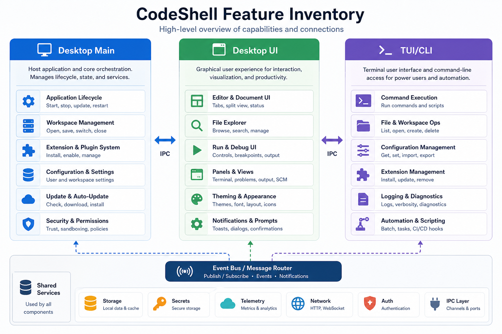

# codeshell 功能清单（desktop / tui）

> **核对日期（2026-07-06）**：本清单已按当前代码树只读核对，覆盖 Desktop 主进程、Desktop 渲染进程和 TUI/CLI 三块能力。每项含：功能、做什么、入口（文件:行 + 触发点）、怎么使用。

---

## 目录

- [一、Desktop 主进程（packages/desktop/src/main/）](#一desktop-主进程packagesdesktopsrcmain) — 31 项 IPC / 系统服务能力
- [二、Desktop UI（packages/desktop/src/renderer/）](#二desktop-uipackagesdesktopsrcrenderer) — 72 项用户可见功能
- [三、TUI/CLI（packages/tui/src/）](#三tuiclipackagestuisrc) — 76 项 CLI 子命令 + slash 命令 + 交互能力

**总计：179 项能力。**

---

## 一、Desktop 主进程（packages/desktop/src/main/）

主进程是 Electron IPC 与系统能力层：按需代理 core agent 子进程，并提供文件、终端、浏览器、凭证、插件、记忆、自动化、移动端和外部 CLI 房间等能力。

### 运行核心与终端

| 功能 | 做什么 | 入口 | 怎么用 |
|------|--------|------|--------|
| **会话/聊天运行核心 (AgentBridge)** | 转发 `agent/run`、steer、goal、approval、backgroundWork 等 JSON-RPC 到按需 spawn 的 core agent 子进程；stdout 逐行回传，并用 snapshot 支持重挂载补齐 | `packages/desktop/src/main/agent-bridge.ts:73`，`packages/desktop/src/main/agent-bridge.ts:278`，`packages/desktop/src/preload/index.ts:237` | 渲染进程聊天、审批、停止、Goal、后台工作查询都经 `window.codeshell` 进入 |
| **交互式终端 (pty)** | 为每个 sessionId 起登录 shell，输出通过 `pty:data`/`pty:exit` 回传；保留 256KB 滚动缓冲并支持写入、resize、kill | `packages/desktop/src/main/pty-service.ts:179`，`packages/desktop/src/main/index.ts:2723`，`packages/desktop/src/main/index.ts:2726`，`packages/desktop/src/main/index.ts:2729` | 打开 Terminal 面板后像普通终端输入命令 |

### 文件系统与代码工作区

| 功能 | 做什么 | 入口 | 怎么用 |
|------|--------|------|--------|
| **文件浏览面板服务 (只读 fs)** | 目录读取、文件读取、路径存在性判断；限制工作区内 realpath、防 symlink escape、限制大文件和二进制预览 | `packages/desktop/src/main/fs-service.ts:52`，`packages/desktop/src/main/fs-service.ts:99`，`packages/desktop/src/main/fs-service.ts:114`，`packages/desktop/src/main/index.ts:2734` | 文件面板浏览目录，聊天里的路径链接先经 `fs:exists` 判断 |
| **文件改动撤销/重做 (turn 级 undo)** | 基于 core FileHistory 快照回滚或重做最近一轮文件改动，不依赖 git | `packages/desktop/src/main/file-history-service.ts:45`，`packages/desktop/src/main/file-history-service.ts:60`，`packages/desktop/src/main/file-history-service.ts:69`，`packages/desktop/src/main/index.ts:2693` | Files Changed 卡片点撤销/重做 |
| **@ 文件搜索** | composer 的 `@` 文件搜索：优先 `git ls-files`，否则递归扫描；15s 缓存，子序列模糊打分 | `packages/desktop/src/main/file-search-service.ts:169`，`packages/desktop/src/main/index.ts:1827` | 输入框打 `@` 后继续输入文件名 |
| **Git / diff / worktree / 打开路径服务** | 提供 status、numstat、range changes、分支、切分支、stash 切换、worktree、range diff、打开外部 URL/访达/编辑器 | `packages/desktop/src/main/index.ts:2532`，`packages/desktop/src/main/index.ts:2542`，`packages/desktop/src/main/index.ts:2553`，`packages/desktop/src/main/index.ts:2636`，`packages/desktop/src/main/index.ts:2655`，`packages/desktop/src/main/index.ts:2675` | Review 面板、BranchPicker、路径/URL 点击和外部编辑器入口调用 |

### 浏览器自动化

| 功能 | 做什么 | 入口 | 怎么用 |
|------|--------|------|--------|
| **浏览器自动化主机** | 把 agent 的浏览器动作落到真实 webview/CDP guest，支持观察、点击、输入、导航、滚动、读内容、等待加载；敏感操作审批 | `packages/desktop/src/main/browser-driver/automation-host.ts:116`，`packages/desktop/src/main/agent-bridge.ts:375` | 浏览器面板打开网页后让 AI 操作当前页面 |
| **浏览器 popout / localhost 探测 / 锚点同步** | 打开独立浏览器窗，探测常见本地端口；主窗与 popout 共享圈选锚点的增删改同步 | `packages/desktop/src/main/index.ts:2461`，`packages/desktop/src/main/index.ts:2474`，`packages/desktop/src/main/index.ts:2483`，`packages/desktop/src/main/index.ts:2507` | 浏览器面板点弹出、打开 localhost 或圈选页面元素 |

### 会话、运行与设置

| 功能 | 做什么 | 入口 | 怎么用 |
|------|--------|------|--------|
| **会话管理** | 枚举、删除、标题、重命名、transcript、磁盘会话分页和原始事件读取 | `packages/desktop/src/main/sessions-service.ts:24`，`packages/desktop/src/main/sessions-service.ts:61`，`packages/desktop/src/main/sessions-service.ts:105`，`packages/desktop/src/main/index.ts:2842` | 侧边栏和 Sessions 视图切换、重命名、删除或从磁盘恢复会话 |
| **Runs 管理** | 列运行、读运行详情、删除运行目录；供桌面 Runs 视图查看 headless/自动化任务 | `packages/desktop/src/main/runs-service.ts:97`，`packages/desktop/src/main/runs-service.ts:123`，`packages/desktop/src/main/runs-service.ts:131`，`packages/desktop/src/main/index.ts:2879` | Runs 视图按状态查看运行和 transcript |
| **设置读写 (user/project 两层)** | 读写 `~/.code-shell/settings.json` 与项目 `.code-shell/settings.json`，原子写并通过 settings bus 生效 | `packages/desktop/src/main/settings-service.ts:25`，`packages/desktop/src/main/settings-service.ts:31`，`packages/desktop/src/main/settings-service.ts:84`，`packages/desktop/src/main/index.ts:2754` | 设置页改模型、权限、工具、环境等配置 |

### 凭证、模型与连接探针

| 功能 | 做什么 | 入口 | 怎么用 |
|------|--------|------|--------|
| **凭证管理 + 浏览器 Cookie 桥接** | 列/存/删/改元数据；枚举浏览器分区 Cookie，预览、导出临时 Netscape cookie lease、把 cookie 恢复到浏览器 | `packages/desktop/src/main/credentials-service.ts:51`，`packages/desktop/src/main/credentials-service.ts:68`，`packages/desktop/src/main/credentials-service.ts:90`，`packages/desktop/src/main/credentials-service.ts:125`，`packages/desktop/src/main/index.ts:1603` | Credentials 页保存 API key 或桥接浏览器登录态 |
| **浏览器登录捕获窗口** | 打开隔离浏览器宿主窗口执行登录流程，并在完成后保留/清理 Electron partition cookie | `packages/desktop/src/main/browser-host/index.ts:90`，`packages/desktop/src/main/browser-host/index.ts:150`，`packages/desktop/src/preload/index.ts:834` | Cookie tab 填 URL 后点“在浏览器打开登录” |
| **模型目录 / 用户模型 / 元数据** | 合并内置和用户 catalog，保存/删除模型条目，解析 max context 与 reasoning-control，并列 provider 模型 | `packages/desktop/src/main/model-meta-service.ts:126`，`packages/desktop/src/main/index.ts:2066`，`packages/desktop/src/main/index.ts:2068`，`packages/desktop/src/main/index.ts:2074`，`packages/desktop/src/main/index.ts:2088` | 设置页 Model Catalog、连接页和聊天模型选择器调用 |
| **Provider 探针（搜索/图像/MCP）** | 对搜索、图像和 MCP 连接做真实探测：返回搜索标题样例、图像 base64 预览、MCP 工具列表和友好错误 | `packages/desktop/src/main/search-probe-service.ts:93`，`packages/desktop/src/main/image-probe-service.ts:61`，`packages/desktop/src/main/mcp-probe-service.ts:235`，`packages/desktop/src/main/mcp-probe-service.ts:263` | 设置页保存连接后点探测或自动刷新状态 |
| **语音转文字 (STT) 网关** | 转录音频、检查可用性、描述 provider、请求麦克风权限 | `packages/desktop/src/main/index.ts:1765`，`packages/desktop/src/main/index.ts:1771`，`packages/desktop/src/main/index.ts:1778`，`packages/desktop/src/preload/index.ts:604` | 聊天输入框点麦克风录音后转为文字 |

### 扩展（插件/技能/市场/子代理/能力）

| 功能 | 做什么 | 入口 | 怎么用 |
|------|--------|------|--------|
| **插件管理** | 枚举、详情、卸载、更新、检查更新；详情列 skills、commands、agents、hooks、MCP 等 | `packages/desktop/src/main/plugins-service.ts:92`，`packages/desktop/src/main/plugins-service.ts:135`，`packages/desktop/src/main/plugins-service.ts:155`，`packages/desktop/src/main/plugins-service.ts:189`，`packages/desktop/src/main/index.ts:1596` | 扩展页 Plugin tab 查看、启停、详情、更新或卸载 |
| **技能管理** | 扫描 project/user/plugin 三源，读 `SKILL.md`，本地目录安装、GitHub inspect/install、更新、卸载 | `packages/desktop/src/main/skills-service.ts:38`，`packages/desktop/src/main/skills-service.ts:67`，`packages/desktop/src/main/skills-service.ts:78`，`packages/desktop/src/main/skills-service.ts:103`，`packages/desktop/src/main/index.ts:1820` | Skills tab 预览、安装、启停、更新或卸载技能 |
| **插件市场 + 安装任务** | 列市场、加载市场、添加/删除/刷新、推荐市场、市场安装；安装以 job 队列展示并可重试 | `packages/desktop/src/main/marketplace-service.ts:272`，`packages/desktop/src/main/marketplace-service.ts:301`，`packages/desktop/src/main/marketplace-service.ts:331`，`packages/desktop/src/main/marketplace-service.ts:375`，`packages/desktop/src/main/marketplace-service.ts:447` | Market tab 浏览官方/自定义 marketplace 并安装插件 |
| **子代理角色管理** | 列、读、保存、删除 agent 角色；内置角色可被 user 级同名覆盖 | `packages/desktop/src/main/agents-service.ts:64`，`packages/desktop/src/main/agents-service.ts:89`，`packages/desktop/src/main/agents-service.ts:111`，`packages/desktop/src/main/agents-service.ts:153` | Settings 的 Agents 模块新建或编辑角色 |
| **能力总览开关** | 汇总 builtin/tool/skill/plugin/MCP/agent 启用状态，写 user/project override | `packages/desktop/src/main/capabilities-service.ts:49`，`packages/desktop/src/main/capabilities-service.ts:59`，`packages/desktop/src/main/capabilities-service.ts:68`，`packages/desktop/src/main/index.ts:1574` | Settings 的 Capabilities 模块逐项继承、开启或关闭 |

### 记忆、自动化、移动端与系统

| 功能 | 做什么 | 入口 | 怎么用 |
|------|--------|------|--------|
| **记忆管理** | 按 level/scope 列、读、存、删；支持 pending memory 审批、降级、拒绝和提升为全局 | `packages/desktop/src/main/memory-service.ts:53`，`packages/desktop/src/main/memory-service.ts:74`，`packages/desktop/src/main/memory-service.ts:108`，`packages/desktop/src/main/memory-service.ts:138`，`packages/desktop/src/main/index.ts:2816` | Settings 的 Memory 模块查看、编辑、批准、提升或删除记忆 |
| **Dream 手动整理** | 临时 seed Engine 与 LLM client，运行 dream consolidation 去重、合并、清理过期记忆 | `packages/desktop/src/main/dream-service.ts:48`，`packages/desktop/src/main/index.ts:2835` | Memory 模块点 Dream/整理 |
| **定时任务/自动化 (cron)** | 列、取、创建、更新、删除、暂停、恢复、立即运行、取消运行；运行结果变成 automation 会话 | `packages/desktop/src/main/automation-service.ts:88`，`packages/desktop/src/main/automation-service.ts:105`，`packages/desktop/src/main/automation-service.ts:125`，`packages/desktop/src/main/automation-service.ts:151`，`packages/desktop/src/main/index.ts:2902` | Automation 视图创建 cron 任务或立即运行 |
| **应用更新器** | 检查、下载、安装更新，并把状态通知渲染进程 | `packages/desktop/src/main/updater.ts:152`，`packages/desktop/src/main/updater.ts:249`，`packages/desktop/src/main/updater.ts:270`，`packages/desktop/src/main/index.ts:2113` | 更新横幅或设置入口触发检查/下载/安装 |
| **图像读取/保存与图像 provider 探针** | 读取本地图片为 data URL；解析/命名保存生成图片；验证图像模型连接 | `packages/desktop/src/main/index.ts:1871`，`packages/desktop/src/main/image-save.ts:20`，`packages/desktop/src/main/image-save.ts:61`，`packages/desktop/src/main/image-probe-service.ts:61` | 聊天图片附件、图像生成保存和连接探测调用 |
| **手机遥控主机** | 启动本地或 tunnel WebSocket/HTTP 主机，配对设备，管理 cloudflared、passcode、在线设备和权限回传 | `packages/desktop/src/main/mobile-remote/remote-host-manager.ts:77`，`packages/desktop/src/main/index.ts:2192`，`packages/desktop/src/main/index.ts:2231`，`packages/desktop/src/preload/index.ts:899` | Settings 的 Mobile Remote 配对手机端 |
| **项目、最近、信任、通知与 badge** | 最近项目、置顶/移除、项目根解析、工作区信任风险、系统通知和 Dock/任务栏 badge | `packages/desktop/src/main/recents-store.ts:100`，`packages/desktop/src/main/recents-store.ts:116`，`packages/desktop/src/main/trust-store.ts:41`，`packages/desktop/src/main/trust-store.ts:101`，`packages/desktop/src/main/index.ts:2272` | 侧栏项目列表、TrustGate、通知和 badge 使用 |
| **Claude/Codex 外部 CLI 房间 + quota** | 管理 legacy rooms 和 `ccRoom`：探测 Claude/Codex CLI、列历史 session、打开外部 CLI 房间、发送消息、读历史、审批桥接、查订阅 quota | `packages/desktop/src/main/index.ts:2315`，`packages/desktop/src/main/index.ts:2320`，`packages/desktop/src/main/index.ts:2353`，`packages/desktop/src/main/cc-room/approval-bridge.ts:33`，`packages/desktop/src/main/mobile-remote/codex-room-agent.ts:104` | 右侧 CC Room 面板连接 Claude Code 或 Codex CLI 会话 |
| **日志读取** | 从 `~/.code-shell/logs` 读取最近日志 bucket 尾部 | `packages/desktop/src/main/logs-service.ts:16`，`packages/desktop/src/main/index.ts:2872` | Logs 视图查看 UI/engine 日志 |
| **菜单、窗口与生命周期** | 安装/刷新系统菜单，新建窗口，窗口全屏状态，退出前清理 pty 和服务 | `packages/desktop/src/main/menu.ts:11`，`packages/desktop/src/main/menu.ts:148`，`packages/desktop/src/main/index.ts:2451`，`packages/desktop/src/main/index.ts:2455` | 应用菜单、快捷键、新窗口和窗口状态自动调用 |

---

## 二、Desktop UI（packages/desktop/src/renderer/）

渲染进程是用户界面层，只通过 `window.codeshell.*` 调 IPC。主区以 viewMode 切全屏视图，右侧 PanelArea 以多 tab 面板与聊天并存。

### 导航与聊天

| 功能 | 做什么 | 入口 | 怎么用 |
|------|--------|------|--------|
| **全局 viewMode 与 PanelTab 结构** | 定义 chat、sessions、approvals、runs、automation、settings_page、customize、credentials、logs；右侧面板为 files/browser/review/terminal/shells/ccRoom | `packages/desktop/src/renderer/view.ts:1`，`packages/desktop/src/renderer/view.ts:18`，`packages/desktop/src/renderer/App.tsx:2654` | 侧栏、命令面板或顶栏按钮切换视图/面板 |
| **Sidebar 主导航** | 侧栏固定入口，包含 chat、sessions、approvals、runs、automation、customize、credentials、logs 等 | `packages/desktop/src/renderer/SidebarNav.tsx:46`，`packages/desktop/src/renderer/SidebarNav.tsx:57` | 点击侧栏图标切换模块 |
| **TopBar 状态与面板入口** | 显示项目、会话状态、运行状态、目标状态和右侧面板开关 | `packages/desktop/src/renderer/TopBar.tsx:51`，`packages/desktop/src/renderer/TopBar.tsx:133`，`packages/desktop/src/renderer/TopBar.tsx:260` | 顶栏查看状态或打开面板 |
| **对话/聊天发送** | 聊天主界面，空态 composer 居中，有消息后 composer 固定底部；发送消息进 AgentBridge | `packages/desktop/src/renderer/ChatView.tsx:171`，`packages/desktop/src/renderer/ChatView.tsx:569`，`packages/desktop/src/preload/index.ts:237` | 输入消息后 Enter 发送，Shift+Enter 换行 |
| **消息流与工具卡** | 折叠/分组展示 assistant、thinking、tool、agent、task、goal、文件变更等消息 | `packages/desktop/src/renderer/messages/streamGroups.ts:183`，`packages/desktop/src/renderer/messages/ToolGroupCard.tsx:66`，`packages/desktop/src/renderer/tool-cards/ToolCardShell.tsx:25` | 聊天 transcript 自动渲染工具运行和结果 |
| **Files Changed 卡片** | 汇总文件改动，显示变更行数、文件列表、撤销/重做入口 | `packages/desktop/src/renderer/messages/FilesChangedCard.tsx:41`，`packages/desktop/src/renderer/messages/fileChangeAggregator.ts:261` | AI 修改文件后在消息流里点查看或撤销 |
| **图片附件（上传/拖拽/粘贴）** | 接受图片文件、剪贴板和拖拽，按清晰度压缩，并支持 lightbox 预览 | `packages/desktop/src/renderer/ChatView.tsx:602`，`packages/desktop/src/renderer/ChatView.tsx:620`，`packages/desktop/src/renderer/chat/compress.ts:74`，`packages/desktop/src/renderer/chat/Lightbox.tsx:76` | 点击附件、拖图、粘贴图片或点击缩略图 |
| **语音输入** | 检查 STT 可用性、请求麦克风、录音、自动最长录制、转写后填入 composer | `packages/desktop/src/renderer/ChatView.tsx:248`，`packages/desktop/src/renderer/ChatView.tsx:294`，`packages/desktop/src/renderer/ChatView.tsx:1297` | 输入框点击麦克风开始/停止录音 |
| **@ 提及（文件/技能）** | 识别 mention range，展示文件/技能补全，插入到输入框 | `packages/desktop/src/renderer/chat/mention.ts:26`，`packages/desktop/src/renderer/chat/MentionPopover.tsx:41`，`packages/desktop/src/renderer/ChatView.tsx:1117` | 输入 `@` 后键盘选择补全项 |
| **权限模式切换** | composer 权限药丸映射到 core permission mode | `packages/desktop/src/renderer/chat/PermissionPill.tsx:70`，`packages/desktop/src/renderer/ChatView.tsx:1261` | 点权限药丸切 default/accept edits/auto/bypass 等 |
| **Goal 模式开关** | 持久目标开关，配合 agent goal RPC 和顶栏目标状态 | `packages/desktop/src/renderer/chat/GoalToggle.tsx:23`，`packages/desktop/src/renderer/ChatView.tsx:1266`，`packages/desktop/src/preload/index.ts:262` | 发送前打开 Goal，运行中可延长/清除 |
| **模型选择与上下文环** | ModelPill 切模型，ContextRing 显示上下文占用 | `packages/desktop/src/renderer/chat/ModelPill.tsx:32`，`packages/desktop/src/renderer/chat/ContextRing.tsx:53`，`packages/desktop/src/renderer/ChatView.tsx:1285` | 点击模型药丸选择 catalog 模型 |
| **项目/分支选择** | 空会话 composer 下方选择项目和 Git 分支 | `packages/desktop/src/renderer/chat/ProjectPicker.tsx:29`，`packages/desktop/src/renderer/chat/BranchPicker.tsx:17`，`packages/desktop/src/renderer/ChatView.tsx:1392` | 新对话发首条消息前选择项目/分支 |
| **停止 / 引导 / 后续变更队列** | 忙碌时可停止；输入新内容会入队或作为 guide 打断；队列可预览、移除、清空、全部引导 | `packages/desktop/src/renderer/ChatView.tsx:924`，`packages/desktop/src/renderer/ChatView.tsx:939`，`packages/desktop/src/renderer/ChatView.tsx:1356` | agent 正在跑时输入后回车或点 guide/stop |
| **AskUser 内联提问 / 工具审批** | 未回答 AskUser 固定在 composer 上方；工具审批卡可内联展示并提交决定 | `packages/desktop/src/renderer/ChatView.tsx:731`，`packages/desktop/src/renderer/ChatView.tsx:897`，`packages/desktop/src/renderer/messages/AskUserMessageView.tsx:211` | 点问题选项或审批按钮继续运行 |

### 搜索与命令

| 功能 | 做什么 | 入口 | 怎么用 |
|------|--------|------|--------|
| **命令面板（Command Palette）** | 构造可执行命令，支持跳视图、打开设置、搜索、开新窗口、面板操作等 | `packages/desktop/src/renderer/shell/CommandPalette.tsx:22`，`packages/desktop/src/renderer/shell/CommandPalette.tsx:108` | `Cmd/Ctrl+K` 后输入命令 |
| **跨项目会话搜索** | 模态搜索所有项目会话，无输入时列最近会话 | `packages/desktop/src/renderer/shell/SessionSearchModal.tsx:41` | `Cmd/Ctrl+P` 或侧栏搜索 |
| **当前 transcript 搜索** | 当前会话内查找文本并显示匹配数 | `packages/desktop/src/renderer/shell/SearchBar.tsx:15` | 会话里 `Cmd/Ctrl+F` |

### 侧栏与项目/会话管理

| 功能 | 做什么 | 入口 | 怎么用 |
|------|--------|------|--------|
| **侧栏容器与项目树** | 管理项目列表、会话索引、展开状态、当前 repo/session 和底部菜单 | `packages/desktop/src/renderer/Sidebar.tsx:72` | 侧栏选择项目或打开新会话 |
| **最近项目与置顶/移除** | UI 调用 projects/recents API 添加、置顶、移除、刷新项目列表 | `packages/desktop/src/preload/index.ts:710`，`packages/desktop/src/main/index.ts:2272` | 项目菜单中置顶、移除或添加项目 |
| **会话行状态与快捷跳转** | 会话行显示运行/待输入/未读状态，支持重命名、复制 ID、归档/删除和数字快捷键 | `packages/desktop/src/renderer/Sidebar.tsx:72`，`packages/desktop/src/renderer/App.tsx:2865` | 点击会话切换或用 `Cmd/Ctrl+1..9` |
| **设置入口 + 语言切换** | 底部 SettingsMenu 打开设置页并切换中/英文 | `packages/desktop/src/renderer/settings/SettingsMenu.tsx:37` | 侧栏底部点设置 |

### 设置页（全屏，分组左导航）

| 模块 | 做什么 | 入口 | 怎么用 |
|------|--------|------|--------|
| **设置页框架** | 全屏设置页，左侧分组模块导航，右侧渲染当前模块 | `packages/desktop/src/renderer/settings/SettingsPage.tsx:56`，`packages/desktop/src/renderer/settings/SettingsPage.tsx:99`，`packages/desktop/src/renderer/settings/SettingsPage.tsx:163` | 侧栏设置 -> 打开设置页 |
| **常规 / 外观** | 常规配置和主题外观 | `packages/desktop/src/renderer/settings/GeneralSection.tsx:71`，`packages/desktop/src/renderer/settings/AppearanceSection.tsx:6`，`packages/desktop/src/renderer/settings/SettingsPage.tsx:231` | 设置页选 General 或 Appearance |
| **文本连接 + 图像设置** | 配置文本模型 provider/实例、STT 连接提示和图像生成清晰度等 | `packages/desktop/src/renderer/settings/TextConnectionsPanel.tsx:84`，`packages/desktop/src/renderer/settings/AdvancedSections.tsx:1204`，`packages/desktop/src/renderer/settings/SettingsPage.tsx:237` | 设置页选 Config |
| **模型目录编辑器** | 新增、编辑、删除、重置用户模型 catalog 条目 | `packages/desktop/src/renderer/settings/ModelCatalogPanel.tsx:48`，`packages/desktop/src/renderer/settings/catalogEditor.ts:26`，`packages/desktop/src/renderer/settings/SettingsPage.tsx:243` | 设置页选 Model Catalog |
| **个性化 / 指令 / 回复偏好** | 管理指令文件、回复偏好、昵称和语气等 personalization | `packages/desktop/src/renderer/settings/AdvancedSections.tsx:125`，`packages/desktop/src/renderer/settings/AdvancedSections.tsx:172`，`packages/desktop/src/renderer/settings/AdvancedSections.tsx:235` | 设置页选 Personalization |
| **快捷键** | 展示快捷键说明与可用入口 | `packages/desktop/src/renderer/settings/AdvancedSections.tsx:292`，`packages/desktop/src/renderer/settings/SettingsPage.tsx:253` | 设置页选 Shortcuts |
| **能力总览** | 按能力类型分组，折叠浏览 builtin/tool/skill/plugin/MCP/agent，支持跳转详情和三态覆盖 | `packages/desktop/src/renderer/settings/CapabilitiesOverviewSection.tsx:115`，`packages/desktop/src/renderer/settings/capabilitiesOverview.ts:86`，`packages/desktop/src/renderer/settings/SettingsPage.tsx:256` | 设置页选 Capabilities |
| **MCP 服务器** | 增删改 MCP server，按插件归属展示，配置鉴权，探测连通性和工具列表 | `packages/desktop/src/renderer/settings/McpSection.tsx:137`，`packages/desktop/src/renderer/settings/McpSection.tsx:1083`，`packages/desktop/src/renderer/settings/SettingsPage.tsx:273` | 设置页选 MCP |
| **扩展（插件/技能/MCP/市场）** | 设置页内嵌 ExtensionsPage，隐藏发现首页，直接进入管理 tab | `packages/desktop/src/renderer/extensions/ExtensionsPage.tsx:27`，`packages/desktop/src/renderer/extensions/ManagePage.tsx:44`，`packages/desktop/src/renderer/settings/SettingsPage.tsx:300` | 设置页选 Extensions |
| **子代理** | 全局/项目级管理 agent 角色和覆盖策略 | `packages/desktop/src/renderer/settings/AgentsSection.tsx:58`，`packages/desktop/src/renderer/settings/SettingsPage.tsx:303` | 设置页选 Agents |
| **Hooks** | 管理全局和项目 hook，核心按两层拼接 | `packages/desktop/src/renderer/settings/AdvancedSections.tsx:326`，`packages/desktop/src/renderer/settings/SettingsPage.tsx:276` | 设置页选 Hooks |
| **连接 / Git** | 搜索连接、通用连接和 Git 偏好配置 | `packages/desktop/src/renderer/settings/AdvancedSections.tsx:647`，`packages/desktop/src/renderer/settings/AdvancedSections.tsx:651`，`packages/desktop/src/renderer/settings/SearchConnectionsPanel.tsx:35` | 设置页选 Connections 或 Git |
| **本地环境** | 项目级 setup、cleanup、env 配置 | `packages/desktop/src/renderer/settings/AdvancedSections.tsx:935`，`packages/desktop/src/renderer/settings/SettingsPage.tsx:288` | 设置页选 Environment |
| **沙箱策略** | 配置隔离模式、网络策略和项目覆盖 | `packages/desktop/src/renderer/settings/SandboxSection.tsx:39`，`packages/desktop/src/renderer/settings/SettingsPage.tsx:292` | 设置页选 Sandbox |
| **对话设置** | 管理对话级设置，例如自动记忆抽取等 | `packages/desktop/src/renderer/settings/ConversationSettingsSection.tsx:59`，`packages/desktop/src/renderer/settings/SettingsPage.tsx:297` | 设置页选 Conversation |
| **上下文设置** | 管理上下文策略与 token 预算相关配置 | `packages/desktop/src/renderer/settings/ContextSettingsSection.tsx:79`，`packages/desktop/src/renderer/settings/SettingsPage.tsx:298` | 设置页选 Context |
| **手机遥控** | 启停远程主机、设备、配对、passcode、tunnel/cloudflared | `packages/desktop/src/renderer/settings/AdvancedSections.tsx:1475`，`packages/desktop/src/renderer/settings/SettingsPage.tsx:299` | 设置页选 Mobile Remote |
| **记忆** | 选择全局/项目 store，查看、编辑、Pin、批量处理 pending memory，手动 Dream | `packages/desktop/src/renderer/settings/MemorySection.tsx:87`，`packages/desktop/src/renderer/settings/MemorySection.tsx:163`，`packages/desktop/src/renderer/settings/MemorySection.tsx:311` | 设置页选 Memory |
| **已归档会话** | 列出各项目归档会话并恢复或删除 | `packages/desktop/src/renderer/settings/AdvancedSections.tsx:1274`，`packages/desktop/src/renderer/settings/SettingsPage.tsx:314` | 设置页选 Archived |

### 扩展全屏视图 + 凭证

| 功能 | 做什么 | 入口 | 怎么用 |
|------|--------|------|--------|
| **Customize/Extensions 发现首页** | 侧栏 Extensions 打开发现首页，展示搜索、已安装概览和插件/技能/MCP/市场入口 | `packages/desktop/src/renderer/extensions/ExtensionsPage.tsx:27`，`packages/desktop/src/renderer/extensions/DiscoverHome.tsx:32` | 侧栏点 Extensions |
| **插件 tab** | 插件列表、启停、安装、本地/市场来源、详情 | `packages/desktop/src/renderer/extensions/PluginsTab.tsx:35`，`packages/desktop/src/renderer/extensions/PluginDetailView.tsx:13` | Extensions -> Plugins |
| **技能 tab** | 技能列表、搜索、启停、详情 modal | `packages/desktop/src/renderer/extensions/SkillsTab.tsx:31`，`packages/desktop/src/renderer/extensions/SkillDetailModal.tsx:15` | Extensions -> Skills |
| **MCP tab** | Extensions 管理页内直接复用 McpSection 管理 MCP server | `packages/desktop/src/renderer/extensions/ManagePage.tsx:119`，`packages/desktop/src/renderer/extensions/ManagePage.tsx:169` | Extensions -> MCP |
| **市场 tab + 安装任务面板** | 浏览市场插件、安装、查看后台 install jobs 并重试 | `packages/desktop/src/renderer/extensions/MarketList.tsx:84`，`packages/desktop/src/renderer/extensions/MarketDetail.tsx:23`，`packages/desktop/src/renderer/extensions/PluginInstallJobsPanel.tsx:89` | Extensions -> Market |
| **凭证页（Cookie/Token/Link）** | 三 tab 管理 cookie 登录态、permission token 和业务 link | `packages/desktop/src/renderer/credentials/CredentialsPage.tsx:11` | 侧栏点 Credentials |
| **Cookie 登录态桥接** | 登录 URL、列域名、预览 cookie、捕获/恢复浏览器 cookie | `packages/desktop/src/renderer/credentials/CookieTab.tsx:55` | Credentials -> Cookie |
| **Permission Token / Link** | 新增、保存、删除 token/link 凭证 | `packages/desktop/src/renderer/credentials/TokenTab.tsx:17`，`packages/desktop/src/renderer/credentials/LinkTab.tsx:16` | Credentials -> Token 或 Link |

### 全屏视图（自动化/运行/审批/会话/日志）

| 功能 | 做什么 | 入口 | 怎么用 |
|------|--------|------|--------|
| **自动化视图** | 列定时任务，新建、编辑、启停、立即运行、取消和查看上次运行 | `packages/desktop/src/renderer/automation/AutomationView.tsx:206`，`packages/desktop/src/renderer/automation/AutomationView.tsx:385` | 侧栏点 Automation |
| **自动化时间与项目辅助** | cron schedule 解析/描述、时区分组、项目选项与磁盘会话重建辅助 | `packages/desktop/src/renderer/automation/scheduleModel.ts:66`，`packages/desktop/src/renderer/automation/timezones.ts:6`，`packages/desktop/src/renderer/automation/projectOptions.ts:53`，`packages/desktop/src/renderer/automation/rebuildFromDisk.ts:32` | 自动化表单选择频率、时区、项目或查看运行 |
| **运行视图（Runs）** | 列所有 runs，选中看详情/transcript | `packages/desktop/src/renderer/runs/RunsView.tsx:24` | 侧栏或命令面板打开 Runs |
| **审批视图** | 全屏待审批队列和历史记录 | `packages/desktop/src/renderer/approvals/ApprovalsView.tsx:19` | 打开 Approvals 处理待批任务 |
| **工具审批卡** | 按操作生成 approve/deny 决策，支持本次、本会话、范围批准和拒绝原因 | `packages/desktop/src/renderer/approvals/ApprovalCard.tsx:63`，`packages/desktop/src/renderer/approvals/approvalDecision.ts:37`，`packages/desktop/src/renderer/approvals/approvalDecision.ts:74` | 审批卡点击批准范围或拒绝 |
| **会话视图** | 全屏磁盘会话列表，搜索、重命名、删除、新建 | `packages/desktop/src/renderer/sessions/SessionsView.tsx:12` | 打开 Sessions 管理历史会话 |
| **日志视图** | 查看应用日志 bucket 尾部 | `packages/desktop/src/renderer/logs/LogsView.tsx:8` | 打开 Logs |

### 右侧面板坞（与对话并存）

| 功能 | 做什么 | 入口 | 怎么用 |
|------|--------|------|--------|
| **PanelArea 多 tab 面板坞** | 六类面板可多开 tab，关闭最后一个 tab 关闭坞，支持 + 菜单、放大和调宽 | `packages/desktop/src/renderer/panels/PanelArea.tsx:90`，`packages/desktop/src/renderer/panels/PanelArea.tsx:122`，`packages/desktop/src/renderer/panels/PanelArea.tsx:177` | 顶栏/命令面板打开面板或点 `+` 新建 tab |
| **面板保活与浏览器空闲淘汰** | PanelArea tab body 常驻挂载；隐藏面板用 CSS 保活，BrowserPanel 隐藏超过 5 分钟后卸载 webview 释放资源 | `packages/desktop/src/renderer/panels/PanelArea.tsx:229`，`packages/desktop/src/renderer/panels/PanelArea.tsx:442`，`packages/desktop/src/renderer/browser/useIdleEvict.ts:9`，`packages/desktop/src/renderer/browser/useIdleEvict.ts:17` | 切换面板不丢终端/页面，长时间隐藏浏览器自动释放 |
| **文件面板** | 文件树、图片/Markdown/代码预览、行级评论锚点、拖拽到 composer、路径 reveal | `packages/desktop/src/renderer/panels/FilesPanel.tsx:84`，`packages/desktop/src/renderer/panels/FilesPanel.tsx:387`，`packages/desktop/src/renderer/panels/FilesPanel.tsx:531` | PanelArea -> Files |
| **浏览器面板** | 多标签 webview、地址栏、刷新/后退/前进、外部打开、popout、锚点圈选 | `packages/desktop/src/renderer/panels/BrowserPanel.tsx:99`，`packages/desktop/src/renderer/browser/useBrowserTabs.ts:16`，`packages/desktop/src/renderer/browser/WebviewHost.tsx:18` | PanelArea -> Browser |
| **本地端口发现** | 探测 localhost 常用端口并为浏览器面板提供快速入口 | `packages/desktop/src/renderer/browser/useLocalhostPorts.ts:7`，`packages/desktop/src/renderer/browser/useLocalhostPorts.ts:12` | Browser 面板选择本地服务 |
| **审查面板（Diff）** | 选择本轮/未暂存/已暂存/全部未提交/提交/分支范围，展示 unified diff 并支持行评论 | `packages/desktop/src/renderer/panels/ReviewPanel.tsx:47` | PanelArea -> Review |
| **终端面板** | xterm.js 交互终端，多 tab 独立 pty，输出路径/URL 可点 | `packages/desktop/src/renderer/panels/TerminalPanel.tsx:20`，`packages/desktop/src/renderer/panels/TerminalPanel.tsx:60`，`packages/desktop/src/renderer/panels/TerminalPanel.tsx:131` | PanelArea -> Terminal |
| **统一后台工作面板** | 展示后台 shell、子代理、后台任务，支持刷新、轮询、分类、查看详情和停止 | `packages/desktop/src/renderer/panels/BackgroundShellPanel.tsx:24`，`packages/desktop/src/renderer/panels/BackgroundShellPanel.tsx:51`，`packages/desktop/src/renderer/panels/BackgroundShellPanel.tsx:176`，`packages/desktop/src/preload/index.ts:293` | PanelArea -> Background |
| **CC/Codex Room 面板** | 探测 Claude/Codex CLI，列外部 CLI session，打开/发送/关闭房间，选择权限模式 | `packages/desktop/src/renderer/cc-room/CCRoomView.tsx:50`，`packages/desktop/src/renderer/cc-room/CCRoomView.tsx:120` | PanelArea -> CC Room |
| **CC/Codex Conversation** | 读历史、订阅实时消息、发送输入、展示工具卡和审批卡，回传审批结果 | `packages/desktop/src/renderer/cc-room/CCConversationView.tsx:72`，`packages/desktop/src/renderer/cc-room/CCConversationView.tsx:108`，`packages/desktop/src/renderer/cc-room/CCConversationView.tsx:145`，`packages/desktop/src/renderer/cc-room/CCConversationView.tsx:336` | 在 CC Room 内进入某个 session 后对话 |
| **Quota 面板** | 查询 Claude/Codex 订阅剩余额度并以 provider blocks/bars 展示 | `packages/desktop/src/renderer/cc-room/QuotaPanel.tsx:16`，`packages/desktop/src/preload/index.ts:1025` | CC Room 顶部查看 quota |
| **面板空态落地卡** | 空面板坞显示六类面板卡片网格 | `packages/desktop/src/renderer/panels/PanelArea.tsx:368` | 打开空面板后点卡片 |

### 其它

| 功能 | 做什么 | 入口 | 怎么用 |
|------|--------|------|--------|
| **状态弹层** | 顶栏状态 hover 展示当前运行、目标、工具和耗时 | `packages/desktop/src/renderer/TopBar.tsx:133` | 悬停顶栏状态点 |
| **信任门** | 未信任工作区显示风险摘要并要求用户确认 | `packages/desktop/src/renderer/workspace-trust/TrustGate.tsx:1`，`packages/desktop/src/main/index.ts:2941` | 首次打开项目时确认信任 |
| **更新横幅** | 显示更新状态并触发下载/安装 | `packages/desktop/src/renderer/updater/UpdaterBanner.tsx:1`，`packages/desktop/src/main/index.ts:2113` | 顶部横幅点击更新 |
| **新窗口与系统打开** | 命令或快捷键新建窗口，路径/URL 在系统中打开 | `packages/desktop/src/main/index.ts:2451`，`packages/desktop/src/main/index.ts:2660`，`packages/desktop/src/main/index.ts:2675` | 命令面板或快捷键打开 |

---

## 三、TUI/CLI（packages/tui/src/）

`code-shell` 终端入口：bin -> `dist/cli/main.js`。不带子命令且有位置参数时走 headless run；无位置参数时进入 Ink REPL。

### CLI 子命令

| 命令 | 做什么 | 入口 | 用法示例 |
|------|--------|------|----------|
| **默认调用（positional task）** | 有 `[task]` 走 headless 单次，无参进 REPL；`--prefill` 预填不提交 | `packages/tui/src/cli/main.ts:176`，`packages/tui/src/cli/main.ts:193` | `code-shell` / `code-shell "修复 bug"` / `code-shell --prefill "草稿"` |
| **run（headless 单任务）** | 执行单任务，任务可来自参数或 stdin；支持 resume、输出格式、最后消息写文件、等待后台 agent | `packages/tui/src/cli/main.ts:70`，`packages/tui/src/cli/commands/run.ts:69`，`packages/tui/src/cli/output/renderer.ts:119` | `code-shell run "列 TODO"` / `echo "分析" \| code-shell run -o json` |
| **repl（显式交互式）** | 进入 Ink REPL，并初始化 Engine、MCP、ChatSessionManager、cron runtime | `packages/tui/src/cli/main.ts:103`，`packages/tui/src/cli/commands/repl.ts:63`，`packages/tui/src/cli/commands/repl.ts:192` | `code-shell repl -m gpt-4.1 --effort high` |
| **公共选项** | run/repl/arena 共享模型、provider、preset、base-url、api-key、permission-mode、output、max-turns、effort 等选项 | `packages/tui/src/cli/main.ts:42`，`packages/tui/src/cli/main.ts:69` | `code-shell run "任务" -m gpt-4.1 --permission-mode bypassPermissions` |
| **sessions** | 列最近会话 ID、时间、状态、模型、轮数 | `packages/tui/src/cli/main.ts:113` | `code-shell sessions -n 20` |
| **arena（多模型评审/讨论/规划）** | 多模型围绕主题进行 review/discussion/planning，可指定模型和 mode | `packages/tui/src/cli/main.ts:137`，`packages/tui/src/cli/commands/arena.ts:68` | `code-shell arena "评审认证模块" --models claude,gpt4o --mode review` |
| **runs（长任务管理）** | list/get/submit/resume/cancel/events/recover 长任务 | `packages/tui/src/cli/main.ts:161`，`packages/tui/src/cli/commands/runs.ts:77` | `code-shell runs submit "重构 X"` / `code-shell runs events <id>` |
| **plugin（CLI 插件管理）** | 安装、列出、更新、卸载 CC + Codex 格式插件 | `packages/tui/src/cli/main.ts:166`，`packages/tui/src/cli/commands/plugin.ts:12` | `code-shell plugin install github:org/repo --name myplugin` |

### slash 命令（REPL 内）

**模型 / 凭证 / 配置**

| 命令 | 做什么 | 入口 | 用法 |
|------|--------|------|------|
| `/help` | 列全部 slash 命令，按分组显示 | `packages/tui/src/ui/App.tsx:1632` | `/help` |
| `/model` · `/m` | 无参开模型选择器，带 key 直接切换模型 | `packages/tui/src/cli/commands/builtin/core-commands.ts:123`，`packages/tui/src/ui/components/ModelSelector.tsx:22` | `/model` / `/model gpt4o` |
| `/models` | 模型管理面板：列、切、同步、添加 provider/model，管理 arena 参与者 | `packages/tui/src/cli/commands/builtin/extra-commands.ts:198`，`packages/tui/src/ui/components/ModelManager.tsx:83` | `/models` |
| `/login` | 带 key 直接保存并热加载；不带参数进入 onboarding | `packages/tui/src/cli/commands/builtin/extra-commands.ts:52`，`packages/tui/src/ui/components/OnboardingPrompt.tsx:40` | `/login sk-...` / `/login` |
| `/logout` | 清空模型和凭证相关设置 | `packages/tui/src/cli/commands/builtin/extra-commands.ts:118` | `/logout` |
| `/effort` | 设/查推理 effort | `packages/tui/src/cli/commands/builtin/core-commands.ts:75` | `/effort high` |
| `/permissions` · `/perm` | 查/切权限模式，`rules` 列生效规则 | `packages/tui/src/cli/commands/builtin/permissions-command.ts:17` | `/permissions auto` / `/permissions rules` |
| `/config` | show/get/set 设置，set 尝试 JSON 解析 | `packages/tui/src/cli/commands/builtin/core-commands.ts:695` | `/config show` / `/config set model.temperature 0.5` |
| `/features` | 列引擎解析后的 feature flags | `packages/tui/src/cli/commands/builtin/features-command.ts:11` | `/features` |

**状态 / 工具 / 用量**

| 命令 | 做什么 | 入口 | 用法 |
|------|--------|------|------|
| `/cost` | 显示 token 用量和成本，支持 stats/detail | `packages/tui/src/cli/commands/builtin/core-commands.ts:33` | `/cost` / `/cost detail` |
| `/status` | 显示模型、effort、权限、会话、cwd、工具数、git、token、成本；支持 env/doctor | `packages/tui/src/cli/commands/builtin/core-commands.ts:558` | `/status` / `/status doctor` |
| `/tools` | 列当前可用工具及数量 | `packages/tui/src/cli/commands/builtin/core-commands.ts:260` | `/tools` |
| `/skills` | 列 project/user/plugin 三类 skill | `packages/tui/src/cli/commands/builtin/extra-commands.ts:211` | `/skills` |
| `/plugin` | REPL 内插件市场管理：marketplace add/remove/list、install/uninstall、list | `packages/tui/src/cli/commands/builtin/extra-commands.ts:256`，`packages/tui/src/cli/commands/builtin/plugin-handler.ts:1` | `/plugin list` / `/plugin install foo@official` |
| `/mcp` | 列已配置 MCP server，含 transport 和 command/url | `packages/tui/src/cli/commands/builtin/extra-commands.ts:168` | `/mcp` |

**会话 / 上下文 / 记忆**

| 命令 | 做什么 | 入口 | 用法 |
|------|--------|------|------|
| `/memory` · `/memories` | 跨会话持久记忆 list/add/delete/edit/clear/open | `packages/tui/src/cli/commands/builtin/core-commands.ts:276` | `/memory list` / `/memory add user_role 后端工程师` |
| `/compact` | 立即压缩上下文并报告压缩前后 token | `packages/tui/src/cli/commands/builtin/core-commands.ts:365` | `/compact` |
| `/session` · `/sessions` | 显示当前 session，list 最近会话，tag 打标，resume 提示恢复 | `packages/tui/src/cli/commands/builtin/core-commands.ts:202` | `/session list` / `/session tag wip` |
| `/sid` | 输出当前 session ID，运行中也可用 | `packages/tui/src/cli/commands/builtin/core-commands.ts:189` | `/sid` |
| `/resume` | 无参开会话选择器；带数字或查询词匹配恢复 | `packages/tui/src/cli/commands/builtin/core-commands.ts:393`，`packages/tui/src/ui/components/SessionPicker.tsx:28` | `/resume` / `/resume 重构` |
| `/export` | 导出 transcript 为 markdown 或 json | `packages/tui/src/cli/commands/builtin/core-commands.ts:656`，`packages/tui/src/cli/commands/builtin/export-md.ts:42` | `/export` / `/export json` |
| `/clear` | 清空当前 transcript 记录 | `packages/tui/src/cli/commands/builtin/core-commands.ts:27` | `/clear` |
| `/exit` · `/quit` | 退出 REPL | `packages/tui/src/cli/commands/builtin/core-commands.ts:20` | `/exit` |
| `/version` | 显示版本 | `packages/tui/src/cli/commands/builtin/core-commands.ts:643` | `/version` |
| `/init` | 检测项目类型并生成/改进 CODESHELL.md | `packages/tui/src/cli/commands/builtin/init/index.ts:95`，`packages/tui/src/cli/commands/builtin/init/detect.ts:64` | `/init` |
| `/tasks` | 显示多步任务列表 | `packages/tui/src/cli/commands/builtin/core-commands.ts:89` | `/tasks` |
| `/goal` | 设置/查看/清除持久目标 | `packages/tui/src/cli/commands/builtin/goal-command.ts:19` | `/goal 让测试通过` / `/goal clear` |
| `/image` · `/img` | 读本地图片并暂存到下条消息；支持列出和 clear | `packages/tui/src/cli/commands/builtin/image-command.ts:96` | `/image ./shot.png` / `/image clear` |

**Git / 评审**

| 命令 | 做什么 | 入口 | 用法 |
|------|--------|------|------|
| `/diff` | 显示 git diff，自动截断 | `packages/tui/src/cli/commands/builtin/core-commands.ts:537` | `/diff` |
| `/commit` | 生成或使用指定 message 提交 | `packages/tui/src/cli/commands/builtin/git-commands.ts:25` | `/commit` / `/commit -m "fix"` |
| `/branch` | 列、建、切分支 | `packages/tui/src/cli/commands/builtin/git-commands.ts:98` | `/branch feature-x --create` |
| `/review` | 对 diff 做 P0-P3 结构化评审，支持 file/staged/json/dimensions | `packages/tui/src/cli/commands/builtin/git-commands.ts:129` | `/review --staged --json` |
| `/security-review` · `/sec` | 对待提交 diff 做安全评审 | `packages/tui/src/cli/commands/builtin/more-commands.ts:61` | `/security-review` |
| `/pr-comments` | 通过 gh 拉 PR 评论 | `packages/tui/src/cli/commands/builtin/git-commands.ts:186` | `/pr-comments 123` |
| `/autofix-pr` | 拉 PR 评论后让 agent 逐条修复 | `packages/tui/src/cli/commands/builtin/git-commands.ts:213` | `/autofix-pr <PR-url>` |

**文件 / 变更 / 实用**

| 命令 | 做什么 | 入口 | 用法 |
|------|--------|------|------|
| `/files` | 列 cwd 文件，可带 pattern，最多 50 | `packages/tui/src/cli/commands/builtin/more-commands.ts:14`，`packages/tui/src/cli/commands/builtin/list-files.ts:19` | `/files` / `/files *.ts` |
| `/release-notes` · `/changelog` · `/whatsnew` | 显示 changelog 类文件，无则回退 git log | `packages/tui/src/cli/commands/builtin/more-commands.ts:31` | `/release-notes` |
| `/log` · `/logs` | 按 sid/turn/cat 过滤当天日志 | `packages/tui/src/cli/commands/builtin/extra-commands.ts:273` | `/log 50` / `/log cat llm` |
| `/undo` | 撤销上一轮文件编辑 | `packages/tui/src/cli/commands/builtin/utility-commands.ts:42` | `/undo` |
| `/copy` | 复制最近 assistant 输出或指定文本 | `packages/tui/src/cli/commands/builtin/utility-commands.ts:10` | `/copy` |
| `/update` | 检查/执行 CLI 更新 | `packages/tui/src/cli/commands/builtin/utility-commands.ts:198` | `/update` |
| `/fullscreen` | 切换 TUI 全屏布局 | `packages/tui/src/cli/commands/builtin/utility-commands.ts:170` | `/fullscreen` |
| `/feedback` · `/bug` | 打开或提示反馈入口 | `packages/tui/src/cli/commands/builtin/more-commands.ts:128` | `/feedback` |
| `/hooks` | 查看 hook 状态和配置提示 | `packages/tui/src/cli/commands/builtin/utility-commands.ts:161` | `/hooks` |
| `/voice` | 语音相关高级命令入口 | `packages/tui/src/cli/commands/builtin/advanced-commands.ts:9` | `/voice` |
| **插件贡献 slash 命令** | 从插件声明动态生成 slash 命令 | `packages/tui/src/cli/commands/builtin/plugin-commands-registration.ts:34`，`packages/tui/src/ui/App.tsx:111` | 安装插件后执行插件命令，如 `/my-command` |

### REPL 交互能力

| 功能 | 做什么 | 入口 | 怎么用 |
|------|--------|------|--------|
| **REPL App 启动与 command registry** | 注册 core/git/context/config/advanced/plugin slash 命令并渲染 Ink App | `packages/tui/src/ui/App.tsx:100`，`packages/tui/src/ui/App.tsx:111`，`packages/tui/src/ui/App.tsx:130` | `code-shell` 或 `code-shell repl` |
| **CommandInput** | 输入框、命令补全、提交和文本编辑 | `packages/tui/src/ui/components/CommandInput.tsx:48` | 输入文字或 slash 命令 |
| **Vim 模式输入** | 处理 vim key state 和按键转换 | `packages/tui/src/ui/vim-mode.ts:17`，`packages/tui/src/ui/vim-mode.ts:38` | 开启 vim 模式后用 normal/insert 操作 |
| **权限审批 prompt** | 工具调用审批 UI | `packages/tui/src/ui/components/PermissionPrompt.tsx:44`，`packages/tui/src/ui/App.tsx:350` | 工具需要许可时选择批准/拒绝 |
| **AskUser prompt** | agent 提问时展示选项/输入 | `packages/tui/src/ui/components/AskUserPrompt.tsx:39` | 在 TUI 内回答 agent 问题 |
| **流事件与子代理事件渲染** | 处理 agent_start、agent_end、tool、assistant 等流事件并写入 store | `packages/tui/src/ui/App.tsx:726`，`packages/tui/src/ui/store.ts:47`，`packages/tui/src/ui/store.ts:188` | agent 运行时自动更新 transcript |
| **提交/排队/force guide** | 运行中输入可排队或作为 guide 插入，统一经 `handleSlashCommand` / submit 流程处理 | `packages/tui/src/ui/App.tsx:1455`，`packages/tui/src/ui/App.tsx:1501` | 忙碌时输入新指令或 slash 命令 |
| **ESC/Ctrl+C/Shift+Tab/Alt+M/Ctrl+O 快捷键** | 停止、切权限、切模型、打开辅助 UI 等快捷键处理 | `packages/tui/src/ui/App.tsx:1094`，`packages/tui/src/ui/App.tsx:1116`，`packages/tui/src/ui/App.tsx:1173`，`packages/tui/src/ui/App.tsx:1200` | 按对应快捷键 |
| **FullscreenLayout** | 全屏布局和未读分隔线 | `packages/tui/src/ui/components/FullscreenLayout.tsx:39`，`packages/tui/src/ui/components/FullscreenLayout.tsx:166` | `/fullscreen` 或配置启用 |
| **虚拟滚动消息列表** | 大 transcript 下虚拟化渲染消息 | `packages/tui/src/ui/components/VirtualMessageList.tsx:76`，`packages/tui/src/ui/hooks/useVirtualScroll.ts:142` | 长会话自动使用 |
| **AgentDock** | 展示正在运行的子代理，限制可见数量并格式化耗时 | `packages/tui/src/ui/components/AgentDock.tsx:34`，`packages/tui/src/ui/components/AgentDock.tsx:200` | 子代理运行时自动出现 |
| **StatusLine** | 底部状态行展示模型、权限、session、token 等 | `packages/tui/src/ui/components/StatusLine.tsx:36` | REPL 底部自动显示 |
| **ContextUsageBar** | 上下文 token 使用进度条 | `packages/tui/src/ui/components/ContextUsageBar.tsx:13` | token 接近上限时查看 |
| **SpinnerWithVerb / Spinner** | 运行中动词化 spinner、耗时和 token 提示 | `packages/tui/src/ui/components/SpinnerWithVerb.tsx:237`，`packages/tui/src/ui/components/Spinner.tsx:20` | agent 思考或工具运行时显示 |
| **Banner / UpdateBanner / WelcomeTips** | 顶部启动信息、更新提示和欢迎提示 | `packages/tui/src/ui/components/Banner.tsx:42`，`packages/tui/src/ui/components/UpdateBanner.tsx:25`，`packages/tui/src/ui/components/WelcomeTips.tsx:36` | REPL 启动或更新可用时显示 |
| **消息内容渲染** | Markdown、代码块、错误、限流、上下文限制、thinking 等消息视图 | `packages/tui/src/ui/components/MessageContent.tsx:425`，`packages/tui/src/ui/components/CodeBlock.tsx:16` | transcript 自动渲染 |
| **工具调用视图** | 展示工具 start/running/result 和嵌套前缀 | `packages/tui/src/ui/components/ToolCall.tsx:42`，`packages/tui/src/ui/components/ToolCall.tsx:98`，`packages/tui/src/ui/components/AgentBlock.tsx:26` | 工具调用时自动折叠/展开 |
| **Diff 视图** | 渲染 diff 行、结构化 diff 和普通 diff view | `packages/tui/src/ui/components/DiffView.tsx:18`，`packages/tui/src/ui/components/DiffLine.tsx:52`，`packages/tui/src/ui/components/StructuredDiff.tsx:17` | `/diff`、审批和文件编辑结果中使用 |
| **输入历史** | 按 session/project 记录、搜索、导航、flush 历史 | `packages/tui/src/ui/input-history.ts:66`，`packages/tui/src/ui/input-history.ts:192`，`packages/tui/src/ui/input-history.ts:286` | 上下键或历史搜索复用旧输入 |
| **主题系统** | 解析主题色和主题设置 | `packages/tui/src/ui/theme.ts:31`，`packages/tui/src/ui/theme.ts:71` | 配置主题后自动应用 |
| **性能探针** | 可选事件循环、stream rate、render frame 性能探针 | `packages/tui/src/ui/perf-probes.ts:31`，`packages/tui/src/ui/perf-probes.ts:80`，`packages/tui/src/ui/perf-probes.ts:240` | 设置 `CODESHELL_UI_PERF=1` 后启用 |
| **CLI 输出渲染器** | headless 输出 text/json/jsonl/stream-json，并压缩工具输出摘要 | `packages/tui/src/cli/output/renderer.ts:119` | `code-shell run -o jsonl` 或 `-o stream-json` |
