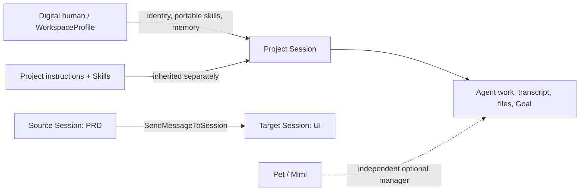

# 14 · Digital Humans, Sessions, and Pet

> Current architecture as of 2026-07-18. Digital-human work is Session-owned;
> Pet is an independent optional manager surface and is not part of the
> digital-human execution path.

## Product model

A digital human is a reusable `WorkspaceProfile`. It owns:

- identity and durable working instructions;
- portable Skills/plugins/MCP/agents;
- an optional long-term memory store under its profile directory.

A project Session has one current profile binding through
`SessionState.workspaceProfile`, and that binding is switchable. Switching the
digital human changes identity, portable capabilities, and profile memory from
the next turn; it does not replace the Session or move its transcript,
approvals, files, Goal, or deliverables into the profile.

Project capabilities and profile capabilities are intentionally separate.
Project Skills continue to come from the project and are inherited by every
Session in that project. Portable profile Skills are layered on top. An
explicit project override remains the final authority and can disable a
profile-requested capability.

## Direct Session creation

The Desktop digital-human library creates normal project Sessions directly.
For a single profile it creates one Session; a team template creates one
Session per member. `createSession(..., { workspaceProfile })` persists the
binding in the renderer index, and `useRunController` forwards it on the first
run. Core then persists it into `state.json`, so subsequent runs and disk
catalog rebuilds recover the current identity. The TopBar selector can rebind
an existing Session to any installed digital human. Renderer and core state
are updated together; a UI-only planned Session carries the new binding into
its first run.

There is no persisted Pet selection and no Pet chat routing field for a
digital human or team.

## Long-term memory

The three stores have distinct ownership:

| Level         | Location                                  | Owner                                 |
| ------------- | ----------------------------------------- | ------------------------------------- |
| Global        | `CODE_SHELL_HOME/memory/`                 | user across all projects and profiles |
| Digital human | `CODE_SHELL_HOME/profiles/<name>/memory/` | one profile across project Sessions   |
| Project       | `CODE_SHELL_HOME/projects/<hash>/memory/` | one project, independent of profile   |

The digital-human card opens its profile memory store directly. Entries can be
listed, created, edited, pinned, and soft-deleted. They are injected only when
the profile has `portableMemory: true`.

Core memory resolution remains global → profile → project, with the more
specific project layer closest to the current task. The editor does not copy
project Skills or project memory into a profile.

## Cross-Session messages

Cross-Session collaboration is one ordinary tool call, not a separate data
model. The Desktop supplies the current project's Sessions as a closed target
catalog. `SendMessageToSession(target_session_id, message)` can address only a
Session in that catalog and only when its workspace root exactly matches the
source Session.

The protocol host enqueues `message` on the target `ChatSession` exactly as a
normal user turn. If the target is idle or has never run, work starts; if it is
already running, the turn waits in its ordinary queue. The target uses its own
current digital-human binding and inherits the same project instructions and
Skills as any other turn. A planned UI Session may therefore receive its first
turn without the user opening it first; only that first turn carries the
renderer-selected initial binding. Messages to an existing Session never
overwrite a later profile switch.

There is no Handoff record, version, subscription, delivery sidecar, special
context event, or manual Handoff UI. The sent text simply appears as a user
message in the target Session. If the source later learns something new, it
calls the tool again and sends another message, just as a person would.

## Package ownership

| Layer            | Owns                                                                                           |
| ---------------- | ---------------------------------------------------------------------------------------------- |
| Core             | profile schema/store, Session binding, profile memory injection, Session message tool/router   |
| Desktop main     | profile/team persistence and memory access                                                      |
| Desktop renderer | library/editor, direct Session creation, memory studio, closed same-project Session catalog    |
| Pet package      | Mimi prompt, bounded projection, generic `DelegateWork`, Pet long-task state                   |

The Desktop team schema lives under `packages/desktop/src/shared`, not in Pet.
The Pet runtime accepts only Workspace and reusable-Session selectors. Its IPC,
run parameters, delegation result, long-task ledger, and launch host contain no
digital-human routing field.

## Security and recovery boundaries

- Profile IDs and Session IDs are validated before path use.
- Profile and team writes use owner-only files and atomic replacement.
- Symlinked stores/files fail closed.
- Cross-Session messages require exact same-project roots and a host-authorized
  target catalog.
- Profile deletion remains blocked while a durable Session or team references it.
- Pet cannot attach a profile to delegated work and cannot synthesize a
  digital-human selection through IPC.

## Primary implementation paths

- `packages/core/src/session/session-message.ts`
- `packages/core/src/tool-system/builtin/send-message-to-session.ts`
- `packages/core/src/engine/engine.ts`
- `packages/core/src/protocol/server.ts`
- `packages/desktop/src/main/memory-service.ts`
- `packages/desktop/src/renderer/digital-humans/DigitalHumanMemoryDialog.tsx`
- `packages/desktop/src/renderer/app/useRunController.ts`
- `packages/desktop/src/renderer/streamRouting.ts`
- `packages/pet/src/delegate-work.ts`
