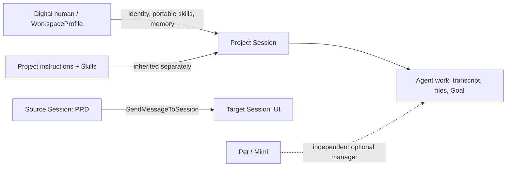

# 14 · Digital Humans, Sessions, and Pet

> Current architecture as of 2026-07-22. Digital-human work is Session-owned;
> Pet is an independent optional manager surface and is not part of the
> digital-human execution path.

## Product model

A digital human is a reusable `WorkspaceProfile`. It owns:

- identity and durable working instructions;
- portable Skills/plugins/MCP/agents;
- an optional long-term memory store under its profile directory.

A project Session has one current profile binding through
`SessionState.workspaceProfile`, and that binding is switchable. Switching the
digital human changes identity, portable capabilities, and profile memory from
the next turn; it does not replace the Session or move its transcript,
approvals, files, Goal, or deliverables into the profile.

Project capabilities and profile capabilities are intentionally separate.
Project Skills continue to come from the project and are inherited by every
Session in that project. Portable profile Skills are layered on top. An
explicit project override remains the final authority and can disable a
profile-requested capability.

## Direct Session creation

The Desktop digital-human library creates normal project Sessions directly.
For a single profile it creates one Session; a team template creates one
Session per member. `createSession(..., { workspaceProfile })` persists the
binding in the renderer index, and `useRunController` forwards it on the first
run. Core then persists it into `state.json`, so subsequent runs and disk
catalog rebuilds recover the current identity. The TopBar selector can rebind
an existing Session to any installed digital human. Renderer and core state
are updated together; a UI-only planned Session carries the new binding into
its first run.

There is no persisted Pet selection and no Pet chat routing field for a
digital human or team.

## Long-term memory

The four stores have distinct ownership:

| Level         | Location                                  | Owner                                 |
| ------------- | ----------------------------------------- | ------------------------------------- |
| Global        | `CODE_SHELL_HOME/memory/`                 | user across all projects and profiles |
| Digital human | `CODE_SHELL_HOME/profiles/<name>/memory/` | one profile across project Sessions   |
| Project       | `CODE_SHELL_HOME/projects/<hash>/memory/` | one project, independent of profile   |
| Pet / Mimi    | Electron `userData/pet/memories.json`     | Mimi across Pet manager conversations |

The digital-human card opens its profile memory store directly. Entries can be
listed, created, edited, pinned, and soft-deleted. They are injected only when
the profile has `portableMemory: true`.

Core memory resolution still covers only the first three rows: global →
profile → project, with the more specific project layer closest to the
current task. The editor does not copy project Skills or project memory into a
profile. Pet memory is a separate Desktop-hosted manager store and never enters
that Core resolution chain.

## Pet / Mimi memory

Desktop main owns the durable `PetMemoryStore`. It accepts at most 200 entries,
normalizes each entry to at most 2,000 characters, serializes mutations, and
writes a temporary owner-only file before atomically replacing the store. Each
entry records its `user` or `mimi` source plus creation and update times. The Pet
IPC and `PetMemorySection` expose the same store for listing, adding, editing,
and removing entries; Mimi's `Memory` host action uses it for `remember`,
`update`, and `forget`.

Before every ordinary Mimi manager turn, Desktop reads the store and puts the
newest bounded subset into the trusted `runtimeContext`. The tool therefore
sees the same entry IDs and text that the user can manage in the Pet UI. A
Memory-tool mutation is persisted by Desktop only after Mimi's turn; it is not
a profile-memory write and does not attach a digital human to the Pet Session.

## Cross-Session messages

Cross-Session collaboration is one ordinary tool call, not a separate data
model. The Desktop supplies the current project's Sessions as a closed target
catalog. `SendMessageToSession(target_session_id, message)` can address only a
Session in that catalog and only when its workspace root exactly matches the
source Session.

The protocol host enqueues `message` on the target `ChatSession` exactly as a
normal user turn. If the target is idle or has never run, work starts; if it is
already running, the turn waits in its ordinary queue. The target uses its own
current digital-human binding and inherits the same project instructions and
Skills as any other turn. A planned UI Session may therefore receive its first
turn without the user opening it first; only that first turn carries the
renderer-selected initial binding. Messages to an existing Session never
overwrite a later profile switch.

There is no Handoff record, version, subscription, delivery sidecar, special
context event, or manual Handoff UI. The sent text simply appears as a user
message in the target Session. If the source later learns something new, it
calls the tool again and sends another message, just as a person would.

## Pet host-action envelopes

Mimi tools that need Desktop-owned capabilities do not perform those side
effects inside the worker. For each turn, Desktop derives the supported action
kinds from its executor registry and sends them in `profileParams.hostActions`;
the Pet profile parses that closed list as `hostActionKinds` and exposes only
the matching tools. The current envelope kinds are `mobileRemote`,
`longTaskControl`, `memory`, and `replyAttachments` (the last is enabled only
for a supported IM turn).

A matching tool validates its input and records one `{ kind, payload }` request
through the run-scoped Pet service. The behavior profile reports the accumulated
requests under `RunResult.extensions.pet.hostActions`; tool acceptance means
only that the request was recorded, never that the side effect succeeded. Only
one request of each kind is accepted in a turn.

The worker response crosses a process boundary, so `PetDispatchService`
validates the exact envelope and each kind-specific payload again, rejects
undeclared or duplicate kinds, and executes accepted requests through the
Desktop registry only after `agent/run` returns. Execution failures are
non-fatal to Mimi's generated reply and are returned as structured outcomes.
For IM chat, `host-action-reply.ts` appends the real success or error after
execution; opening mobile remote can also attach a host-generated pairing QR.
This preserves the boundary between Mimi promising an operation during her
turn and the host confirming what actually happened afterward.

## Pet state aggregation and external CLI Sessions

Desktop main's `PetStateAggregator` builds one bounded projection from three
independent sources:

1. The durable CodeShell Session catalog supplies all disk-backed Sessions and
   navigation bindings.
2. The live worker supplies an initial snapshot plus versioned Session/pending
   deltas. Live state overlays the matching durable row; durable completion or
   terminal state can reconcile a finalizing live row.
3. Per-CLI `ExternalSessionAdapter` instances discover Codex and Claude session
   files and tail recent transcripts. They reduce appended events to metadata
   only: a bounded title, run state, model/tool phase, tool name, timestamps,
   CLI kind, and cwd.

Worker generations and delta versions are reconciled before events are
published. If the worker is reclaimed or disconnected, live state and pending
decisions are cleared and durable Sessions remain as the recovery baseline;
external CLI rows remain intact because they do not depend on that worker.
External adapters never copy the full transcript, tool arguments/results, file
contents, approval state, or queue state into the Pet projection. Their two
global settings default off; disabling one stops discovery and tailing at the
source and removes that CLI's projected rows. External rows are visible in
Pet, but currently have no CodeShell disk navigation binding, so their cards do
not open a Session yet.

## Package ownership

| Layer            | Owns                                                                                                            |
| ---------------- | --------------------------------------------------------------------------------------------------------------- |
| Core             | profile schema/store, Session binding, profile memory injection, Session message tool/router                    |
| Desktop main     | profile/team persistence, memory access, Pet state aggregation, host-action execution, and durable Mimi memory  |
| Desktop renderer | library/editor, direct Session creation, memory studios, closed same-project Session catalog, and Pet memory UI |
| Pet package      | Mimi prompt, projection contract, generic `DelegateWork`, host-action envelopes/tools, and Pet long-task state  |

The Desktop team schema lives under `packages/desktop/src/shared`, not in Pet.
The Pet runtime accepts closed Workspace and reusable-Session selectors, a
bounded JSON `runtimeContext`, and the host-declared `hostActionKinds` (carried
canonically as `profileParams.hostActions`). These inputs control delegation,
trusted world state, and host-action tool visibility respectively. Its IPC, run
parameters, delegation result, long-task ledger, and launch host still contain
no digital-human routing field.

## Security and recovery boundaries

- Profile IDs and Session IDs are validated before path use.
- Profile and team writes use owner-only files and atomic replacement.
- Symlinked stores/files fail closed.
- Cross-Session messages require exact same-project roots and a host-authorized
  target catalog.
- Profile deletion remains blocked while a durable Session or team references it.
- Pet cannot attach a profile to delegated work and cannot synthesize a
  digital-human selection through IPC.

## Primary implementation paths

- `packages/core/src/session/session-message.ts`
- `packages/core/src/tool-system/builtin/send-message-to-session.ts`
- `packages/core/src/engine/engine.ts`
- `packages/core/src/protocol/server.ts`
- `packages/desktop/src/main/memory-service.ts`
- `packages/desktop/src/main/pet/pet-state-aggregator.ts`
- `packages/desktop/src/main/pet/external-session-adapter.ts`
- `packages/desktop/src/main/pet/pet-dispatch-service.ts`
- `packages/desktop/src/main/pet/host-action-reply.ts`
- `packages/desktop/src/main/pet/pet-memory-store.ts`
- `packages/desktop/src/renderer/digital-humans/DigitalHumanMemoryDialog.tsx`
- `packages/desktop/src/renderer/app/useRunController.ts`
- `packages/desktop/src/renderer/streamRouting.ts`
- `packages/pet/src/delegate-work.ts`
- `packages/pet/src/host-actions.ts`
