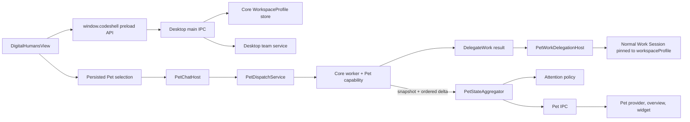

# 14 · Digital Humans and Pet

> Audit date: 2026-07-17. This chapter describes the current digital-human
> definition model, Pet/Mimi capability package, Electron host services, live
> projection, attention policy, persistence, recovery, and security boundaries.

## Executive model

A **digital human** is a reusable `WorkspaceProfile`: a named definition that
selects a base preset, force-enables declared capabilities, adds a durable main
instruction, and can opt into a portable memory layer. It is not an agent
process by itself.

A **digital-human team** is a small Pet-owned data contract containing two to
eight profile IDs and a default coordination mode. It is also not an execution
engine. Pet resolves the team against the current profile library and launches
ordinary profile-bound Work Sessions.

**Pet/Mimi** is a product capability outside core. The Pet package owns manager
policy, `DelegateWork`, bounded host input, cross-session projection, and the
team schema. Desktop owns Electron windows, disk-session reconciliation,
navigation, notifications, Pet preferences, profile/team CRUD, and React UI.



## Ownership and package boundaries

| Layer            | Owns                                                                                                                                       | Must not own                                                                          |
| ---------------- | ------------------------------------------------------------------------------------------------------------------------------------------ | ------------------------------------------------------------------------------------- |
| `packages/core`  | `WorkspaceProfile` schema/store, project activation, session profile pinning, prompt/capability/memory application                         | Mimi prompt, teams, Pet projection, Electron UI                                       |
| `packages/pet`   | Mimi behavior profile, `DelegateWork`, run-parameter validation, team parser, projection observer/state machines, Pet wire types           | Filesystem profile/team stores, disk-session enumeration, navigation, windows, React  |
| Desktop main     | Profile/team services, IPC validation, Pet metadata, disk/live aggregation, attention, delegation launch, preference stores, widget window | Generic engine policy or reusable Pet state-machine rules                             |
| Desktop preload  | Narrow typed IPC methods and event subscriptions                                                                                           | Filesystem access or trust decisions                                                  |
| Desktop renderer | Library/editor UX, persisted browser selection, Pet views, snapshot reducers, optimistic UI                                                | Runtime imports from CodeShell packages, direct disk access, authoritative validation |

The Pet release unit stays one package but exposes focused entries:

- `@cjhyy/code-shell-pet/capability` for worker composition;
- `@cjhyy/code-shell-pet/protocol` for snapshot/delta contracts;
- `@cjhyy/code-shell-pet/team` for the team type and parser.

The compatibility root remains available, but new narrow consumers should not
pull the full barrel.

## Digital-human definition lifecycle

`WorkspaceProfileSchema` in `packages/core/src/profile/types.ts` defines:

- `name`: stable machine ID matching
  `^[a-z0-9][a-z0-9_-]{0,63}$`;
- `label` and optional description/version;
- `basePreset`;
- declared `plugins`, `skills`, `mcp`, and `agents`;
- optional `mainInstruction`;
- `portableMemory`.

The persistence boundary is intentionally bounded: label 120 characters,
description 4,096, main instruction 32,768, preset/version 128, and each
capability list at most 128 unique non-empty entries of at most 256 characters.
The renderer mirrors these limits with field `maxLength`, live counts, and a
visible Skill-limit state. A pre-existing oversized definition is isolated as
invalid and must be reduced manually; it is never partially loaded into a
prompt.

Desktop can transfer a profile definition as JSON. Import is deliberately a
two-stage operation: main reads only a regular, non-symlink file of at most
256 KiB, validates and normalizes it through `WorkspaceProfileSchema`, and
returns an authoritative preview plus a short-lived review token. Confirmation
commits the in-memory reviewed snapshot rather than reopening the source file.
A same-name profile requires explicit overwrite confirmation, including a
second check if another operation creates the name after preview.

Export writes only the normalized `profile.json` definition through a unique
owner-only temporary file and atomic rename. The `portableMemory` flag is part
of the definition, but `memory/user`, `memory/dream`, and their contents are
never included in the exported JSON.

Definitions are global. Project activation writes one `profile` subtree to
project settings:

```text
profile.active
profile.preset
profile.overrides.{plugins,skills,mcp,agents}
```

The preset and capability overrides are activation snapshots. The main
instruction and portable-memory flag are read from the live definition through
`resolveActiveWorkspaceProfile`.

A Work Session may also be explicitly created with `workspaceProfile`. Core
persists that ID in session state. Later runs must use the same ID; a conflicting
requested profile is rejected instead of silently changing the session's
identity. Pet delegation uses this seam when it launches a selected digital
human.

When `portableMemory` is true, core passes the profile directory as a
`MemoryManager` base. Its normal `memory/user` and `memory/dream` directories
therefore travel with the profile and are merged between global and project
memory in the prompt injection index. The same run-resolved directory is also
carried in `ToolContext.profileMemoryDir`: `MemoryList`, `MemoryRead`,
`MemorySave`, and `MemoryDelete` accept `location:"profile"` for explicit
profile-owned reads and writes. Without an active portable-memory profile, that
location returns a clear unavailable error instead of falling back to project
memory. Automatic extraction and dream consolidation retain their existing
global/project routing and do not write portable profile memory.

## Team lifecycle and execution

`parseDigitalHumanTeam` is dependency-free and enforces:

- a stable, path-safe ID;
- a non-empty bounded name and bounded description;
- mode `auto`, `divide`, or `compare`;
- two to eight unique valid profile IDs.

Desktop adds host validation:

1. Saving rejects members absent from the current global profile library.
2. Resolving a team for Pet rechecks every member, so a stale team fails closed.
3. Editing keeps the original team ID while allowing name, description,
   membership, and mode changes.
4. A missing member remains visible in the editor and blocks saving until
   removed.

The renderer's team mode is a coordination preference, not a scheduler
guarantee. Pet still decides actual dependencies. Selected profiles are passed
to the Pet run as a bounded closed set; the validated `DelegateWork` result can
only name those IDs. Desktop then starts one ordinary Work Session per accepted
delegation and binds its `workspaceProfile`.

The current digital-human or team selection is a bounded renderer preference
persisted in browser `localStorage`. A browser `storage` event synchronizes it
across Desktop windows. It affects the next Pet chat dispatch and is
deliberately not a global project default.

## Renderer-to-disk CRUD flow

The management path is:

```text
DigitalHumansView
  -> window.codeshell
  -> preload ipcRenderer.invoke
  -> validated main IPC handler
  -> profiles-service or digital-human-team-service
  -> core profile store or Desktop team store
```

The view uses a request generation fence. Older project responses cannot
overwrite a newer project. Project-specific profile activation flags and skill
lists are cleared immediately during a project switch, including rapid
round-trips, so a failed reload cannot display another project's data as an
empty successful state.

Mutation locks are acquired synchronously by operation key and remain held
through the post-write refresh. Rapid repeated clicks therefore do not enqueue
duplicate saves or deletes.

## Persistence map

`CODE_SHELL_HOME` below means core's resolved CodeShell data root, normally
`~/.code-shell`.

| State                             | Location                                                | Writer and recovery                                                                                                                                                           |
| --------------------------------- | ------------------------------------------------------- | ----------------------------------------------------------------------------------------------------------------------------------------------------------------------------- |
| Digital-human definition          | `CODE_SHELL_HOME/profiles/<id>/profile.json`            | Core profile store; bounded schema; root/directory/file symlink rejection; unique exclusive temp file, rename, and `finally` cleanup; invalid entries are isolated and logged |
| Reviewed profile import           | Desktop main memory, at most 16 reviews for 10 minutes  | Schema-normalized snapshot behind an opaque token; source path and file bytes never enter the renderer; confirmation consumes the token after a successful write              |
| Portable digital-human memory     | `CODE_SHELL_HOME/profiles/<id>/memory/{user,dream}/`    | Core `MemoryManager`; prompt index plus explicit Memory-tool reads/writes only when `portableMemory` is enabled for the run                                                   |
| Project default profile           | `<workspace>/.code-shell/settings.json` under `profile` | `SettingsManager` project transaction                                                                                                                                         |
| Digital-human team                | `CODE_SHELL_HOME/digital-human-teams/<id>/team.json`    | Desktop team service; unique exclusive temp file plus rename; invalid entries isolated and logged                                                                             |
| Session-bound profile             | `CODE_SHELL_HOME/sessions/<session>/state.json`         | Core session manager                                                                                                                                                          |
| Pet identity/session ID           | `<Electron userData>/pet/metadata.json`                 | Desktop `PetMetadataStore`; corrupt file renamed aside and regenerated                                                                                                        |
| Attention receipts                | `<Electron userData>/pet/attention-receipts.json`       | Bounded serialized Desktop store; corrupt input falls back to empty                                                                                                           |
| Work-inbox dismissals             | `<Electron userData>/pet/work-inbox.json`               | Revisioned, bounded, serialized Desktop store; corrupt input falls back to empty                                                                                              |
| Pet widget anchor                 | `CODE_SHELL_HOME/desktop/pet-widget.json`               | Serialized best-effort writes with unique temp file and atomic rename                                                                                                         |
| Current UI profile/team selection | browser `localStorage`                                  | Bounded parser; explicit clear; cross-window synchronization through the browser `storage` event                                                                              |

The metadata, receipt, and work-inbox files use Electron `userData`, while
profile/team/session data and the widget position use the CodeShell data root.
The profile/team selection remains a renderer convenience preference in
browser storage.

## Snapshot and delta projection

The worker-side projection observer in `packages/pet` materializes two bounded
read models:

- `SessionIndex` for non-Pet, non-ephemeral, top-level Work Sessions;
- `PendingDecisionIndex` for surfaceable approvals and AskUser requests.

The pending index never stores approval resolvers or raw AskUser bodies. Titles
and tool names are bounded and sanitized before crossing the worker boundary.

The snapshot contains:

```text
snapshotVersion
workerGeneration
observedAt
sessions[]
pending[]
```

Every delta carries the same worker generation plus a monotonically increasing
version. Deltas describe session upsert/remove, pending upsert/remove, or worker
state.

Desktop's `PetStateAggregator` combines this live projection with the durable
disk session catalog:

1. On startup it pages through every durable session without spawning a worker.
2. If a worker is active, it requests a full snapshot.
3. Same-generation contiguous deltas are applied incrementally.
4. A new generation or version gap triggers snapshot reconciliation.
5. Old-generation or duplicate deltas are ignored.
6. Worker loss clears live pending state and falls back to durable catalog
   truth; disconnect marks live status unknown.
7. Finalizing live entries may receive a terminal overlay from newer disk
   truth.

The aggregator exposes its own renderer-facing version and generation. Pet
navigation includes both values and is revalidated against the current durable
session binding before Desktop opens a target.

The renderer subscribes before requesting its initial snapshot, buffers bounded
early deltas, retries startup IPC races, and requests a new snapshot whenever
its reducer detects a version gap.

## Attention and work inbox

Attention is derived from the authoritative pending-decision projection rather
than from chat text:

- a decision has a default 15-second grace period;
- resolved decisions cancel their timers;
- the currently active target Session is suppressed and receipted;
- unseen decisions within a two-second burst become one peek;
- receipt keys prevent repeated surfacing across restarts;
- multi-decision bursts route to the Pet pending overview instead of guessing a
  single target.

The work inbox is a renderer-derived view of pending, unfinished, optimization,
completed, and follow-up items. Dismissal state is not task truth. Desktop main
persists only bounded, validated item IDs and an increasing revision. IPC
broadcasts the authoritative snapshot after every change, and renderer clients
ignore older revisions. Legacy localStorage IDs are migrated once and retained
only as a fallback if IPC is temporarily unavailable.

## Deletion and corrupt-state recovery

### Profiles

- A profile referenced by any valid team cannot be deleted.
- A profile pinned by any durable historical Session cannot be deleted; those
  Sessions must be removed first.
- Deleting the current project's default requires an explicit
  `clearActiveProject` request and deactivates that project first.
- Deleting the current renderer selection clears the Pet selection after the
  disk operation succeeds.
- Deletion removes the whole profile directory, including portable memory.
- Read and save reject symlinked profile roots, directories, and files. Listing
  validates the root before enumeration and isolates linked entries. Desktop
  deletion first read-validates the definition, then uses a Core helper that
  revalidates root/directory containment instead of calling `rm` on an unchecked
  renderer-supplied path.
- Writes use a unique `wx` temporary file, atomic rename, owner-only mode, and
  cleanup in `finally`.
- A corrupt or missing profile referenced by project settings resolves to no
  active profile and emits a warning instead of loading unvalidated data.

### Teams

- One corrupt `team.json` does not hide valid teams; the invalid entry is
  skipped and reported to Desktop logging.
- Reads and writes reject a symlinked team root, team directory, or `team.json`.
- The root is validated before directory enumeration, so listing cannot follow
  a pre-existing root symlink.
- Writes use a unique `wx` temporary file, atomic rename, owner-only file mode,
  and cleanup in `finally`.
- Direct resolution rechecks that all member profiles still exist.

### Pet host state

- Corrupt Pet metadata is renamed aside and regenerated.
- Corrupt receipts, work-inbox preferences, or widget coordinates fall back to
  safe empty/default state.
- Preference writes are serialized. Widget position and team writes use unique
  temp names so concurrent calls do not share a temporary path.
- Projection reconciliation failures fail closed to disconnected/durable state
  rather than presenting live data as current.

## Security invariants

1. Core has no runtime dependency on Pet; Pet depends only on core's extension
   contract.
2. Pet has no direct Workspace execution tools. Execution requires a validated
   `DelegateWork` result and Desktop host launch.
3. Workspaces, reusable Sessions, profiles, and teams are closed sets supplied
   by the host for one Pet run. Model output cannot introduce arbitrary IDs.
4. A Work Session's persisted `workspaceProfile` cannot be silently changed on
   resume.
5. Profile/team IDs and member IDs are path-safe; both stores reject symlink
   traversal and validate containment before access, enumeration, writes, or
   deletion.
6. Renderer input is advisory. Main/core parsers and IPC handlers remain the
   authoritative validation boundary.
7. Projection data is bounded, resolver-free, and excludes raw prompts,
   commands, tool arguments, credentials, and transcript bodies.
8. Snapshot generation/version fences prevent stale workers and missing deltas
   from mutating current UI state.
9. Navigation is revalidated against durable current state; stale action chips
   cannot directly open an unverified target.
10. Pending notifications and inbox preferences are bounded and revisioned;
    they cannot become an unbounded task database.
11. Corrupt local entries are isolated where possible, while invalid storage
    roots and host inputs fail closed.
12. Profile import commits the reviewed normalized snapshot, not mutable source
    bytes; export contains definitions only and cannot exfiltrate portable
    profile memory.

## Known limitations

- Deleting a profile clears only the currently open project's default. Other
  projects may retain a stale profile ID; core resolves it safely as missing.
  Team and durable Session references are checked and block deletion.
- Team definitions are Pet-specific coordination data, not a generic core
  multi-agent primitive.
- Definition transfer currently covers individual profiles only. Teams are not
  exported because their member references need a dependency-aware import
  contract rather than blind JSON copying.
- Team modes are hints. They do not override real task dependencies or force a
  particular execution graph.
- The Pet projection is an eventually consistent operational read model, not a
  transcript or audit log.
- Receipt and inbox persistence are convenience state. A corrupt file may make
  an old notification or dismissed item appear once again, but cannot approve,
  execute, or mutate a Work Session.

## Primary source anchors

- Profile schema/store/activation:
  `packages/core/src/profile/{types,store,activation,resolve}.ts`
- Session profile pinning and prompt application:
  `packages/core/src/engine/{engine,run-setup}.ts`
- Pet package composition and projection:
  `packages/pet/src/{capability,profile,delegate-work,run-params,projection-extension,session-index,pending-decision-index,protocol,team}.ts`
- Desktop profile/team services:
  `packages/desktop/src/main/{profiles-service,digital-human-team-service}.ts`
- Desktop Pet host:
  `packages/desktop/src/main/pet/{pet-dispatch-service,pet-work-delegation-host,pet-state-aggregator,pet-attention-policy,pet-metadata-store,pet-receipt-store,pet-work-inbox-store,pet-widget-window-state}.ts`
- Renderer reliability and management:
  `packages/desktop/src/renderer/digital-humans/` and
  `packages/desktop/src/renderer/pet/`
