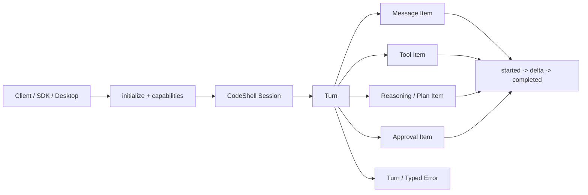

# 15 · CodeShell 与 Codex Open Harness 对比及演进路线

> 审计日期：2026-08-24<br>
> CodeShell 基线：`main@eb20c520`<br>
> Codex 对照基线：仓库现有外部 Runtime 的生成绑定为 `codex-cli 0.145.0`；官方在线文档按审计日期快照核对
> 文档状态：架构评估与演进建议，不代表功能已经实现

## 1. 结论

CodeShell 不需要重写自己的 Agent Loop，也不应该把 Codex harness 当作整体替代方案。

CodeShell 已经具备成熟的通用 Agent 执行链，包括多模型适配、流式 Turn Loop、多级上下文压缩、持久会话、权限审批、MCP、Skills、插件、子 Agent、Goal、Cron、后台任务、文件历史与长期运行状态。它当前最值得从 Codex open harness 借鉴的，不是更多工具或另一个循环，而是下面四类“平台化边界”：

1. **Provider 原生状态**：让 OpenAI Responses 的 reasoning item、tool item、阶段信息和 opaque compaction item 可以无损穿过 CodeShell，而不是全部压扁为通用聊天消息。
2. **稳定的客户端协议**：从宽泛的 `agent/run + agent/query + StreamEvent` 演进到有握手、能力协商、版本化 Schema 和 `Session -> Turn -> Item` 生命周期的协议。
3. **窄而稳定的 SDK**：普通集成者只需要 `start/resume/run/stream/interrupt`，Engine 和扩展机制留给高级宿主。
4. **显式的安全授权契约**：把每 Turn 权限请求、网络授权、实际沙箱状态和平台能力变成协议中的一等对象。

OpenAI 在 2026-08-19 进一步公开并系统说明 Codex 的平台化集成表面，将开源 harness 定义为负责对话状态、流式执行、工具调用、沙箱、审批和跨 Turn 工作延续的运行系统。官方披露的评测也说明，保留推理状态与上下文压缩可能显著影响 Agent 质量，而不只是影响工程体验。参见 [Codex as a platform](https://developers.openai.com/blog/codex-as-a-platform)。

## 2. 对比范围与边界

本次对比覆盖所有与 Agent harness 直接相关的 CodeShell 主链：

- Engine、TurnLoop、ModelFacade 和 LLM Provider；
- ContextManager、压缩策略、Transcript 和 SessionManager；
- AgentClient、Transport、AgentServer 和远程服务；
- ToolRegistry、ToolExecutor、权限分类和 OS 沙箱；
- MCP、Skills、Hooks、Plugins、Panel Apps 和 Capability Composition；
- Goal、Cron、Sub-agent、Background Work 和长期 Run；
- 公共导出、SDK 工厂、协议测试与架构约束。

以下内容不在直接源码对比范围内：

- Codex 桌面客户端的 UI、Electron/原生 Shell 和产品交互细节，因为其客户端实现没有包含在此次公开的 harness 源码范围内；
- OpenAI 托管模型和云端服务内部实现；
- CodeShell 与 Codex 的视觉设计优劣。

因此，这是一份 **harness 与集成表面的架构对比**，不是桌面产品复刻计划。

## 3. 当前架构判断

CodeShell 的运行主链是：

```text
SDK / TUI / Desktop / Remote / Automation
                    |
        AgentClient <-> Transport <-> AgentServer
                    |
          ChatSessionManager / ChatSession
                    |
                 Engine.run
                    |
 preset + prompt + context -> TurnLoop <- model + tools
                    |
 ToolExecutor / MCP / sandbox / transcript / runtime services
```

核心保持领域无关，coding、Arena 和 Pet 通过扩展契约组合进宿主，这一方向是正确的。仓库对此也有明确约束（`README.md:33`、`CODESHELL.md:66`）。Codex harness 更适合被视为一个高质量的协议与 Provider 状态参考实现，而不是 CodeShell 的新核心。

## 4. 能力矩阵

| 领域       | CodeShell 当前状态                                                  | Codex open harness 的可借鉴点                                  | 判断       |
| ---------- | ------------------------------------------------------------------- | -------------------------------------------------------------- | ---------- |
| Agent Loop | 流式循环、工具并发、Goal、Steer、Hooks、子 Agent 和长期运行均已具备 | 保留推理状态、统一 Item 生命周期                               | 不重写循环 |
| 模型适配   | Provider 中立，以通用 Message 和 Chat Completions 兼容层为主        | Responses 原生 item、`previous_response_id`、opaque compaction | P0         |
| 上下文压缩 | micro、summary、snip、window、emergency、range 等多级策略           | Provider 原生压缩状态与现有策略协作                            | P0         |
| 客户端协议 | JSON-RPC 2.0；`agent/run`、`agent/query`、宽 StreamEvent            | 初始化握手、能力协商、Thread/Turn/Item、Schema 生成            | P0         |
| 会话存储   | JSONL、原子状态、fork、archive、generation/revision 冲突控制        | 统一的 read/list/fork/archive/subscribe API                    | P1         |
| SDK        | 已有 `createServer/createClient`，但高级内部对象仍暴露较多          | 面向业务的极窄 start/resume/run API                            | P1         |
| 权限       | once/session/project、工具/路径规则、统一 ToolExecutor 关口         | 请求权限子集、Turn/Session scope、网络审批模型                 | P1         |
| 沙箱       | macOS Seatbelt、Linux bwrap；只隔离 Shell 子进程                    | 实际安全姿态可观测、fail-closed、原生 Windows 支持             | P1         |
| MCP        | OAuth、secret forwarding、allow/deny、资源、连接池                  | required server、能力协商、变更通知、elicitation               | P1         |
| Skills     | 多来源扫描、禁用/白名单、Skill Tool 加载                            | `skill` 输入 Item、`skills/list`、变更通知、依赖元数据         | P1         |
| 客户端工具 | Engine 自定义工具和 SessionToolHost 已具备底层能力                  | 通用 client-hosted dynamic tool RPC                            | P1         |
| 插件隔离   | 安装预览、Hook/MCP 审核、Panel App 项目绑定较强                     | 市场、组织策略和托管 Connector 是可选产品能力                  | P2/可选    |
| 可观测性   | 日志、usage、session recorder 和事件流                              | 统一 trace/thread/turn/item 关联及 typed error                 | P2         |

Codex 对照能力必须区分成熟度：初始化、基础 Thread/Turn/Item 生命周期和 Schema
生成属于稳定参考面；`dynamicTools`、permission profile、部分线程分页和其他要求
`experimentalApi` 的字段只能作为设计输入，不能成为 CodeShell v2 稳定协议的兼容目标。每次
更新本对比时，都应同时记录 Codex CLI 版本、生成 Schema 版本和实验能力清单。

## 5. P0：OpenAI Responses 原生 Provider

### 5.1 当前限制

CodeShell 的 OpenAI Provider 当前仍以 `chat.completions.create` 为主要调用入口（`packages/core/src/llm/providers/openai.ts:564`、`:604`）。它能够兼容大量 OpenAI-compatible Provider，并保留部分供应商的 `reasoning_content`，这对 Provider 中立非常重要。

但 Chat Completions 消息模型无法完整表达 Responses 的状态语义。源码已经针对 GPT-5.5+ 在 Chat Completions 下 `reasoning_effort + tools` 可能被拒绝的问题主动丢弃 reasoning effort（`packages/core/src/llm/providers/openai.ts:439`、`:463`）。这意味着即使模型本身支持更完整的推理控制，CodeShell 也可能因为协议层限制而无法使用。

现有通用 `Message` 还不能无损保存：

- Responses reasoning item；
- assistant/tool item 的阶段和原始顺序；
- Provider 返回的 opaque/encrypted item；
- 服务端 compaction item；
- `previous_response_id` 续接状态；
- Provider 原生结构化输出状态。

### 5.2 推荐设计

新增独立的 Responses Provider，同时为现有 LLM 抽象增加窄的 Provider 原生状态扩展缝；
不能只新增一个 Client，也不能把现有 OpenAI-compatible Provider 原地改造成 OpenAI 专用实现。
当前 `CreateMessageOptions`、`LLMResponse` 和 `LLMStreamChunk` 只表达通用 Message、文本、
工具调用和少量 reasoning 字符串，无法让 Responses item 穿过 ModelFacade、TurnLoop、
Transcript 和 ContextManager。

建议边界如下：

```text
                    Provider Interaction
                  /                      \
      generic Message path       native state extension
               |                          |
 OpenAI-compatible Chat Client    OpenAI Responses Client
               |                          |
   existing Message history      Response item envelope
               |                          |
 universal compaction policy    provider-owned state strategy
```

具体要求：

1. 保留现有 Chat Completions Client，继续服务 OpenRouter、DeepSeek、兼容网关及其他供应商。
2. 新增 OpenAI Responses Client，由 Model capability 或显式 Provider 配置选择。
3. 定义版本化 `ProviderStateEnvelope`，至少记录 provider kind、模型、非秘密 API/project 绑定指纹、
   response id、可重放 item、item 顺序、Schema 版本和状态生成时间。原始状态通过扩展字段
   穿过 ModelFacade 与 TurnLoop，不进入通用 `Message` 的展示语义。
4. 支持两种续接策略：`previous_response_id` 与无状态 item-array chaining。持久 CodeShell
   Session 必须保存可恢复的无状态链或等价 canonical window；`previous_response_id` 只能作为
   有保留期限和账号绑定条件的优化，失效时应能安全降级。
5. 未知 Provider item 可以原样持久化以便前向兼容，但不得在未确认其为合法 input item 前
   盲目重放；持久化保真与请求重放能力是两个不同保证。
6. Provider 原生 compaction 是 Provider 状态策略，不是普通文本摘要器。ContextManager 负责
   选择状态策略并防止原生 compaction 与 micro/summary/window/range 对同一历史重复压缩；
   现有策略继续作为跨 Provider 通用能力。
7. Phase 1 先在 Provider 调用边界支持 `outputSchema`；Phase 2 再把它提升为 Protocol v2
   的 Turn 输入字段，避免继续扩张 v1 `RunParams`。
8. Transcript 记录 Provider 状态恢复信息，但 UI replay 不展示 opaque 内容；状态文件必须
   纳入现有敏感数据权限、原子写入、归档、保留期限和删除策略。
9. Provider/模型切换必须显式执行以下一种策略：兼容原生状态续接、降级为通用 Message
   快照，或拒绝无损切换并提示调用方；禁止静默丢弃原生状态。
10. Session fork 必须复制冻结的 canonical Provider 状态，之后两个分支独立推进；不得只让
    两个分支共享一个没有本地恢复材料的 response id。

OpenAI 的 Responses compaction 会返回不可供人解释但可继续传入后续请求的加密 compaction item；该 item 能用更少 Token 携带先前的重要状态和推理。续接策略还受 `store`、ZDR 和服务端应用状态保留期限影响。参见 [OpenAI Compaction 文档](https://developers.openai.com/api/docs/guides/compaction)和 [OpenAI 数据控制说明](https://platform.openai.com/docs/models/default-usage-policies-by-endpoint)。

### 5.3 验收标准

- 带工具的 OpenAI reasoning 模型无需静默丢弃 reasoning effort；
- 同一会话可在重启后恢复 Responses 状态；
- 已知可重放 item 可无损往返；未知 item 可原样保存并被安全隔离；
- 自动压缩后可继续调用工具并保持 tool call/result 对齐；
- Chat Completions Provider 行为与现有测试保持兼容；
- Responses 与通用压缩策略分别有断线、重试、恢复和上下文超限测试；
- `previous_response_id` 失效、账号/项目变化和 ZDR/`store=false` 场景可降级到本地状态链；
- Responses → Chat/Anthropic/OpenRouter 的切换有明确结果，不静默丢状态；
- 同一源 Session fork 后，两个分支均能独立继续并在重启后恢复；
- Provider state 的落盘权限、日志脱敏、归档和删除有安全测试。

## 6. P0：Protocol v2

### 6.1 当前问题

当前协议是可用且经过大量测试的 JSON-RPC 2.0 协议，但仍带有明显的内部总线特征。

`RunParams` 同时携带任务、附件、cwd、模型、权限、计划模式、工具/Skill 白名单、ephemeral、预算、Workspace Profile、Pet 兼容字段、Session kind 和 Goal（`packages/core/src/protocol/types.ts:102`）。这让一个基础 Turn 请求承担了过多宿主策略。

`agent/query` 使用字符串 `type` 和宽 `QueryParams`，结果是 `{ type: string, data: unknown }`（`packages/core/src/protocol/types.ts:402`、`:434`）。服务端同一个 switch 同时处理 tools、sessions、config、compact、archive、provider/model 修改等操作（`packages/core/src/protocol/server.ts:2945`、`:3024`、`:3255`）。

`StreamEvent` 很丰富，但只有部分事件带 `turnNumber` 或 `messageId`，缺少统一的 `turnId`、`itemId` 和事件序列（`packages/core/src/types.ts:568`）。客户端需要从多个增量事件推断最终状态。

stdio transport 对 malformed line 选择静默跳过，写入返回 `void`，没有显式行长上限和背压处理（`packages/core/src/protocol/transport.ts:76`）。

### 6.2 目标对象模型



Codex app-server 公开的协议采用线程、Turn 和 Item 生命周期，并提供初始化握手、Schema 生成、线程分页、状态订阅、动态工具、审批和 typed error。CodeShell 不需要复制全部方法名，但应借鉴其可演进的协议结构。参见 [Codex App Server 文档](https://learn.chatgpt.com/docs/app-server)。

术语必须保持单义：CodeShell v2 的持久对话对象继续称 `Session`；Codex `Thread` 只在
外部 Runtime 适配器中出现。Codex 的 `thread.sessionId` 表示 fork 树根，并不等同于
CodeShell 现有业务 Session。协议设计阶段要单独定义 Session id、fork lineage id 和
外部 Runtime thread id 的映射，不能继续使用 `Session/Thread` 混合名称。

### 6.3 推荐契约

1. **初始化**：连接后必须调用 `initialize`，协商客户端名称、版本、平台、实验能力、通知 opt-out 和最大消息能力。
2. **Session**：提供 start、resume、read、list、fork、archive、unarchive、delete、loaded/list、subscribe 和 unsubscribe。
3. **Turn**：`turn/start` 返回权威 `turnId`；steer 必须带 `expectedTurnId`；interrupt 只作用于明确的 Turn。
4. **Item**：消息、推理、工具、文件变更、计划和审批均有稳定 `itemId`；
   `item/completed` 只对该 Item 的最终状态权威。Turn 的最终状态由 `turn/completed`
   表达；连接错误或 Turn 级错误不应被强行伪装成 Item。
5. **Schema**：由协议定义生成 TypeScript 与 JSON Schema，并在 CI 中保存兼容性快照。
6. **错误**：在线路层表达 ContextWindowExceeded、UsageLimitExceeded、Unauthorized、ConnectionFailed、SandboxError、Cancelled、BadRequest 和 InternalError；保留 HTTP 状态与可重试信息。
7. **事件信封**：所有 Session/Turn 事件带 `sessionId`；Turn 内事件带 `turnId`；只有
   Item 生命周期和 delta 带 `itemId`。每条可恢复事件带单调 `sequence` 或 opaque cursor，
   并定义重复、迟到、越序、缺口和重放规则。
8. **传输**：stdio、WebSocket、Unix socket/TCP 使用同一上层协议；每种传输都要有消息
   上限、背压、关闭语义和认证能力声明。远程传输还必须定义身份认证、Session ownership、
   多客户端订阅、审批请求路由、断线接管和重放授权。
9. **幂等**：`turn/start` 继承并推广现有 `clientMessageId` 语义，客户端重试不能产生重复
   用户消息或重复副作用；服务端要明确幂等记录的生命周期和冲突响应。
10. **扩展**：CapabilityModule 可以贡献命名空间方法或 Item 类型，但不能退回到无限扩张
    的通用 query 字符串。Phase 0 必须先清点 coding、Arena、Pet 的现有 query、RunParams
    兼容字段和 projection 方法，再确定 v2 命名空间与废弃策略。

### 6.4 兼容迁移

Protocol v2 不应一次性替换现有桌面与 TUI 协议。

推荐顺序：

1. 先定义对象、方法和 JSON Schema；
2. 在 AgentServer 内增加 v2 router；
3. 在现有 Engine 的 `StreamEvent` 之上增加 v1 → v2 投影器，将当前运行事件投影为
   v2 Turn/Item 生命周期；如果旧客户端仍需消费 v1，再使用独立的 v1 compatibility facade，
   不让两个方向共用一个含糊的适配器；
4. TUI、Desktop 和 Remote 分批迁移；
5. 在所有正式宿主迁移完成后，才冻结或废弃 v1 写操作；
6. 旧协议在废弃期继续接收安全修复。

### 6.5 验收标准

- 客户端能在不读取 Engine 内部类型的情况下生成完整协议绑定；
- 每个 Session 事件可由 sessionId 关联，每个 Turn 事件可由 sessionId/turnId 关联，
  Item 事件再由 itemId 关联；
- 客户端使用 `item/completed` 重建最终 Item，使用 `turn/completed` 重建最终 Turn；
- 断线后可从 sequence/cursor 续订；重复或迟到事件不会复活已终止 Turn；
- v1 与 v2 对同一 Turn 产生等价的用户可见结果；
- malformed/oversized input、慢消费者、连接中断和重复请求有确定行为；
- 多客户端不能越权订阅、审批或接管不属于自己的 Session；
- 协议变更在 CI 中能显示 breaking/non-breaking 差异。

## 7. P1：统一 Session API

CodeShell 的 Session 底层不需要重写。

Transcript 已经使用 append-mode descriptor 避免并发写覆盖，在崩溃造成末行撕裂时修复记录边界，并在非 Windows 平台将文件权限设为 `0600`（`packages/core/src/session/transcript.ts:29`）。SessionManager 具备 process-local ephemeral session、原子 rename、generation/revision 冲突控制、full/summary/side fork、父子谱系和 archive（`packages/core/src/session/session-manager.ts:1260`、`:1611`、`:1698`）。

主要问题是对外能力分散：core AgentServer 的 `sessions` query、server 包的磁盘分页、desktop sessions service 和 ChatSessionManager 的 live session 各自覆盖不同视图。

建议把现有实现统一到 v2 Session API，而不是建立第二套存储：

- 列表必须支持 cursor、archive、kind、cwd、parent/ancestor 和 loaded 状态；
- read 不应隐式 resume；
- resume 明确加载运行时资源；
- subscribe/unsubscribe 管理事件订阅和 idle unload；
- fork 返回父会话、源 Turn、ephemeral/durable 属性和冻结的 Provider state 版本；
- 外部 Runtime 的 thread id、fork tree root 与 CodeShell session id 分字段保存，不互相推导；
- archive/delete 对后代 Session 的策略必须显式且可测试。

## 8. P1：窄 SDK 与公共 API 分层

当前 `createServer/createClient` 是正确的起点，但 `ServerHandle` 仍直接公开 `AgentServer` 和 `Engine`，`engineOverrides` 允许绕过稳定配置面（`packages/core/src/protocol/factories.ts:59`、`:62`）。根入口还导出了 AgentServer、AgentClient、TCP transport、Engine、SessionManager 等大量高级对象（`packages/core/src/index.ts:255`）。

建议形成三层公共面，加一层仅限仓库内部使用的实现面。现有
`@cjhyy/code-shell-core/extension` 和 `/internal` 路径保持兼容，不迁移已有调用方：

```text
@cjhyy/code-shell              High-level SDK
  startSession / resumeSession / run / runStream / interrupt / close

@cjhyy/code-shell-core/app-server   Rich protocol client/server
  generated protocol types / transports / subscriptions / approvals

@cjhyy/code-shell-core/extension    Advanced composition contract
  AgentModule / tools / hooks / protocol contributions / behavior

@cjhyy/code-shell-core/internal     In-repo hosts only
  Engine internals / runtime services / test seams
```

Codex SDK 通过 `startThread`、resume 和 run/stream 提供窄入口，而复杂审批、历史和交互客户端使用 app-server。CodeShell 可以采用相同的分层原则，同时保留自己的 Provider 中立与扩展体系。参见 [Codex SDK 文档](https://learn.chatgpt.com/docs/codex-sdk)。

验收目标是：一个普通 Node 调用方无需理解 EngineConfig、Transport 或 SessionManager，就能启动、继续、流式运行和取消一个会话。

## 9. P1：权限与沙箱契约

### 9.1 应保留的能力

CodeShell 已经有 default、acceptEdits、dontAsk、bypassPermissions、auto 和 plan 等模式，支持 once/session/project 审批、工具与路径范围、项目持久规则、敏感文件判断和 Bash 风险分类。所有工具执行经过 ToolExecutor，这个单一关口应继续作为安全模型的中心。

### 9.2 应补充的能力

1. **Permission Profile**：把权限、sandbox、网络、可用工具和组织要求组合成可查询的命名 Profile。
2. **请求子集**：Turn 明确请求所需权限，服务端只允许批准该集合中的权限。
3. **授权 Scope**：协议明确区分 turn、session 和 project scope，避免 UI 自己解释“本次/本会话”。
4. **网络审批**：将 host、protocol、port 和操作原因作为结构化授权目标，并支持同目标请求分组。
5. **命令修订**：用户可以批准一条更窄的 exec policy，而不是只能批准或拒绝整个命令类别。
6. **实际姿态**：UI 必须能看到请求配置与最终解析结果，例如 `auto -> off`。
7. **fail-closed**：无人值守或高安全宿主可以禁止沙箱不可用时降级运行。
8. **Windows**：增加原生 Windows 沙箱后端或由运行环境提供可验证的隔离能力。

当前实现明确说明只有 spawned shell 位于 OS 沙箱中，Engine 本身不在沙箱中，Edit/Write 由应用层权限保护；`auto` 找不到后端时会警告并降级到 off（`packages/core/src/tool-system/sandbox/index.ts:1`、`:16`）。这个设计可以继续存在，但必须成为协议和 UI 可观察的安全事实。

## 10. P1：MCP、Skills 与客户端托管工具

### 10.1 MCP

CodeShell 的 MCP 层已经具备：

- stdio、SSE/streamable HTTP 配置；
- secret env name forwarding 和 credential reference；
- OAuth 解析、宿主委托的刷新及 streamable HTTP 401 replay；
- per-server allowed/disabled tools；
- `readOnlyHint`、资源读取、结果大小控制和连接共享。

但 MCP Client 当前声明空 capabilities（`packages/core/src/tool-system/mcp-manager.ts:664`），工具主要在连接时执行一次 `listTools`（`:754`）。推荐增加：

- `required: true`：关键 Server 初始化失败时阻止 Session 启动；
- tool list changed 通知和原子 registry refresh；
- elicitation form/URL 请求；
- progress、logging、roots 等需要的 MCP capability；
- `destructiveHint` 等副作用注解的统一审批映射；
- 协议层 MCP 状态、错误和重连可见性。

### 10.2 Skills

当前 Skills 可以从 project、user、plugin 和 panel-app 扫描，支持 containment、disabled list 与 allowlist；模型通过 `Skill` 工具加载 `SKILL.md`（`packages/core/src/tool-system/builtin/skill.ts:13`、`:75`）。

建议增加一等协议对象：

- `skills/list`、force reload 和 `skills/changed`；
- interface、dependency、source 和 enabled 元数据；
- Turn 输入中的 `{ type: "skill", name, path? }`；
- 服务端确定性注入指令，并把实际调用记录在 Turn Item 中；
- UI 不再需要通过 Prompt 文本或工具输出猜测 Skill 是否真正生效。

### 10.3 Client-hosted tools

CodeShell 已有 `Engine.registerCustomTool` 和 `SessionToolHost`，底层权限与执行模型足够作为通用客户端工具后端。建议在 v2 中增加：

1. Session 启动时声明动态工具定义；
2. 模型选择工具后创建 tool Item；
3. AgentServer 向拥有该 Session 的 Client 发起 tool request；
4. Client 返回结构化 content item；
5. ToolExecutor 继续负责策略和授权；
6. `item/completed` 记录最终成功、失败和结果摘要。

这样 Desktop Panel、宿主应用和远程客户端可以贡献工具，而不需要把每个宿主能力编译进 core。
但动态工具是受信宿主扩展，不是任意订阅客户端的默认权利。v2 必须同时规定：

- 只有 Session owner 或显式授权的 client capability 可以注册和执行动态工具；
- 工具定义、参数和返回 content item 均经过 Schema、大小、媒体类型和敏感数据校验；
- 远程 viewer、移动端和 Panel App 默认不能冒充宿主注册高权限工具；
- request 带 clientId、sessionId、turnId、itemId 和 deadline，支持取消、超时、重复响应去重；
- owner 断线时请求 fail closed；所有权转移必须重新授权，不能由新订阅者自动接管；
- 审批 UI 显示实际执行客户端、工具来源和授权 scope。

## 11. 不应照搬的部分

### 11.1 不把核心绑定到 OpenAI

Responses 应是一个高质量 Provider，而不是新的通用 LLM 抽象。CodeShell 的 OpenAI-compatible、Anthropic、Bedrock、OpenRouter 和其他 Provider 能力必须继续存在。
为承载原生状态而增加的接口必须是可选、版本化的扩展缝，不能让不支持原生 item 的
Provider 实现 Responses 语义或改变现有 Message 路径。

### 11.2 不重写现有压缩与会话存储

Provider 原生 compaction 无法替代跨 Provider 的 micro、summary、window、snip、emergency 和 range 策略，也不能替代 JSONL transcript、fork 和 file history。

### 11.3 不把外部 Codex Runtime 塞进原生 Engine

`packages/coding/src/external-runtimes/codex/` 已经正确地把 Codex app-server 当作完整外部 Agent Runtime，并处理初始化、server-to-client request、审批、事件翻译和线程恢复。它不应被包装为普通 LLMClient，否则会形成 Agent Loop 嵌套。

原生 Responses Provider 与外部 Codex Runtime 是两个独立用途：

- Responses Provider：CodeShell Engine 自己控制循环；
- Codex Runtime：Codex harness 控制循环，CodeShell 负责宿主与事件桥接。

### 11.4 不弱化本地插件安全

CodeShell 的 Plugin 安装预览、Hook/MCP review、per-tool policy、Panel App 项目绑定与作用域隔离具有明确价值。托管 Apps、市场和组织策略可以后续增加，但不应替代现有本地审核模型。

### 11.5 不复制未开源的桌面实现

Codex harness 驱动官方 App，不代表官方桌面 Shell/UI 已作为同一开源组件发布。CodeShell Desktop 应继续围绕自身 Electron broker、preload boundary、Panel Apps 和多产品能力演进。

## 12. 可维护性风险

当前几个关键文件已超过适合长期演进的体量：

| 文件                                           | 审计时行数 | 风险                                                |
| ---------------------------------------------- | ---------: | --------------------------------------------------- |
| `packages/core/src/engine/engine.ts`           |      4,241 | run setup、Session、工具、权限、Goal 与模型装配耦合 |
| `packages/core/src/engine/turn-loop.ts`        |      2,160 | 状态机阶段和事件投影集中                            |
| `packages/core/src/protocol/server.ts`         |      4,488 | RPC、审批、Session、配置和扩展 query 集中           |
| `packages/core/src/session/session-manager.ts` |      2,291 | 存储、并发控制、Goal、fork 和谱系集中               |
| `packages/core/src/tool-system/permission.ts`  |      1,644 | 风险分类、规则和授权语义集中                        |

`tests/architecture-budgets.test.ts` 当前只对上表中的 `engine.ts` 和 `protocol/server.ts`
设置行数上限；`turn-loop.ts`、`session-manager.ts` 和 `permission.ts` 尚无同类预算。
已有上限也只是接近现状的 ratchet，不会自动推动拆分。Phase 4 应先为未覆盖文件增加
职责或行数基线，再逐步收紧，而不是假设五个文件都已受治理约束。

推荐拆分方向：

- Protocol v2 的每组方法使用独立 handler/router；
- Engine 保留 facade，把 run boundary、Session setup、tool assembly、model execution、finalization 变成内部阶段服务；
- TurnLoop 抽出 Item projection、model retry、tool scheduling 和 completion arbitration；
- SessionManager 抽出 state repository、fork service、goal repository 和 lineage query；
- Permission 保留统一判定入口，内部拆分 command、path、network 和 persisted rule evaluator。

另一个风险是文档与源码漂移。比如 `packages/core/src/composition/types.ts:4` 仍称 ResolvedComposition 处于早期阶段且没有生产调用，但当前 Engine、AgentServer、stdio、TUI 和 Desktop 已经消费 composition。`docs/architecture/01-engine-and-turn-loop.md` 中的文件行数也落后于当前源码。协议 Schema 与可执行架构检查应承担更多事实校验，减少手工文档成为旧状态快照。

## 13. 分阶段路线图

### Phase 0：ADR 与兼容基线

产物：

- Responses Provider ADR；
- Provider Interaction / State Envelope ADR；
- Protocol v2 对象模型与命名约定；
- v1 兼容期和废弃策略；
- Provider state 持久化威胁模型；
- coding、Arena、Pet 的 query、RunParams 兼容字段和 projection 迁移清单；
- Codex 稳定/实验能力清单与固定版本 Schema；
- 当前 v1 event/session 行为的 golden tests。

退出条件：团队对“Provider 原生状态”和“通用 Message”的边界达成一致；Session、Turn、
Item 和外部 Runtime Thread 术语不再混用；v2 核心方法不依赖万能 query，所有遗留 query
都有明确的命名空间迁移或废弃决定。

### Phase 1：Responses Provider

产物：

- OpenAI Responses Client；
- Provider-native state envelope；
- Provider 调用边界的 output schema；
- opaque compaction 接入；
- Provider/model 切换与 Session fork 策略；
- response id 失效后的 stateless fallback；
- 断线、重试、恢复、ZDR 和 compaction 测试。

退出条件：原生 CodeShell Engine 能在一个持久会话中完成多轮 reasoning + tools + compaction，
并在进程重启后继续；切换 Provider 不会静默丢状态；从同一冻结点 fork 的两个 Session
可以独立继续；服务端 response id 不可用时仍可从本地 canonical state 恢复。

### Phase 2：Protocol v2 骨架

产物：

- initialize/capabilities；
- Session、Turn、Item 类型；
- JSON Schema 与 TypeScript 生成；
- typed errors；
- sequence/cursor、幂等、重放和迟到事件规则；
- stdio/WebSocket backpressure 和消息上限；
- 远程身份、Session ownership、订阅和审批路由契约；
- 现有 StreamEvent 到 v2 Turn/Item 的投影器；
- v1 compatibility facade。

退出条件：测试客户端只使用生成类型即可启动 Session、运行 Turn、处理工具与审批，使用
`item/completed` 恢复 Item、使用 `turn/completed` 恢复 Turn，并在断线后从 cursor 续订；
重复、迟到或越权事件不会改变最终状态。

### Phase 3A：核心产品路径迁移

产物：

- 统一 Session API；
- 窄 SDK；
- Protocol v2 的 Turn `outputSchema`；
- TUI、Desktop、Remote 的 v2 主路径；
- coding、Arena、Pet 的协议扩展迁移；
- v1/v2 parity、幂等、断线恢复和权限回归测试。

退出条件：TUI、Desktop 和 Remote 的正式主路径均使用 v2；所有内置 CapabilityModule
不再依赖 v1 万能 query；v1 进入有明确截止版本的只读/安全修复期。

### Phase 3B：扩展能力与安全契约

产物：

- Skills list/change/input item；
- required MCP 和 elicitation；
- client-hosted dynamic tools；
- dynamic tool owner、断线、校验和 fail-closed 契约；
- permission profile、网络审批与实际沙箱状态；
- sandbox 不可用时的可配置 fail-closed；
- Windows 沙箱后端或可验证的宿主隔离 Provider 方案与最小实现。

退出条件：实验性参考能力经过 CodeShell 自己的稳定性评审后再进入稳定 Schema；远程客户端
不能越权注册工具、审批或接管 Session；高安全 Profile 在沙箱不可用时拒绝执行；Windows
至少有一条可验证且不会静默降级的隔离路径。

### Phase 4：内部拆分与治理

产物：

- AgentServer handler 模块化；
- Engine/TurnLoop 阶段服务；
- turn-loop、session-manager 和 permission 的架构预算；
- 关键模块单独覆盖率和故障注入门槛；
- 协议 breaking-change 检查；
- 过时架构文档清理。

退出条件：五个巨型文件均有可执行的职责或增长预算并开始实质下降；新增协议功能不再要求
修改单个 4,000 行分发器；协议 Schema 和架构预算在 CI 中可重复验证。

## 14. 成功指标

建议不要只以“功能是否存在”衡量迁移成功，还应跟踪：

| 指标              | 目标                                                                     |
| ----------------- | ------------------------------------------------------------------------ |
| Provider 状态保真 | 已知可重放 item 无损往返；未知 item 原样隔离；重启、切换和 fork 行为确定 |
| 协议可恢复性      | completed Item + completed Turn 可重建最终状态；支持 cursor 续订         |
| 兼容性            | v1/v2 parity tests 覆盖核心用户路径                                      |
| SDK 复杂度        | 普通集成示例无需 import Engine、Transport、SessionManager                |
| 安全可见性        | 每次运行都能查询实际 sandbox、network、permission profile 和 owner       |
| 安全降级          | 高安全 Profile 在沙箱不可用、owner 失联或授权不明时 fail closed          |
| MCP 可靠性        | required server 不会静默降级；工具变更可自动刷新                         |
| 维护性            | 五个巨型文件均有预算，Engine/AgentServer 行数与职责数持续下降            |
| 测试质量          | 协议、状态恢复、安全边界有独立覆盖和故障注入门槛                         |

## 15. 已有验证

本次审计没有修改运行代码。验证结果：

- `@cjhyy/code-shell-core` 类型检查通过；
- `@cjhyy/code-shell-capability-coding` 类型检查通过；
- composition、protocol、session、context、MCP、sandbox 和 Codex external runtime 定向测试：**600 pass，0 fail，覆盖 99 个测试文件**；
- 审计时仓库共有约 1,231 个 `test/spec` 文件；
- CI 当前的 coverage gate 主要覆盖 builtin/testing 集成面，阈值为 lines 45%、functions 38%，另有 builtin direct test coverage 80% 门槛；该数值不能视为整个 Engine/Protocol 的全局覆盖率。

复现命令：

```bash
bun run --filter '@cjhyy/code-shell-core' typecheck
bun run --filter '@cjhyy/code-shell-capability-coding' typecheck
bun test packages/core/src/composition packages/core/src/protocol \
  packages/core/src/session packages/core/src/context \
  packages/core/src/tool-system/mcp-manager.test.ts \
  packages/core/src/tool-system/mcp-manager.lifecycle-events.test.ts \
  packages/core/src/tool-system/mcp-tool-policy.test.ts \
  packages/core/src/tool-system/mcp-stdio-env-filter.test.ts \
  packages/core/src/tool-system/mcp-stdio-diagnostics.test.ts \
  packages/core/src/tool-system/sandbox \
  packages/coding/src/external-runtimes/codex
rg --files -g '*.test.*' -g '*.spec.*' | wc -l
```

## 16. 参考资料

### OpenAI 官方资料

- [Codex as a platform: build on the open agent harness](https://developers.openai.com/blog/codex-as-a-platform)
- [Codex App Server](https://learn.chatgpt.com/docs/app-server)
- [Codex SDK](https://learn.chatgpt.com/docs/codex-sdk)
- [OpenAI Responses Compaction](https://developers.openai.com/api/docs/guides/compaction)
- [OpenAI API Data Controls](https://platform.openai.com/docs/models/default-usage-policies-by-endpoint)

### CodeShell 关键源码

- `packages/core/src/engine/engine.ts`
- `packages/core/src/engine/turn-loop.ts`
- `packages/core/src/llm/providers/openai.ts`
- `packages/core/src/context/manager.ts`
- `packages/core/src/context/compaction.ts`
- `packages/core/src/protocol/types.ts`
- `packages/core/src/protocol/server.ts`
- `packages/core/src/protocol/transport.ts`
- `packages/core/src/session/session-manager.ts`
- `packages/core/src/session/transcript.ts`
- `packages/core/src/tool-system/executor.ts`
- `packages/core/src/tool-system/permission.ts`
- `packages/core/src/tool-system/sandbox/index.ts`
- `packages/core/src/tool-system/mcp-manager.ts`
- `packages/core/src/tool-system/session-tool-host.ts`
- `packages/core/src/composition/compiler.ts`
- `packages/coding/src/external-runtimes/codex/`
