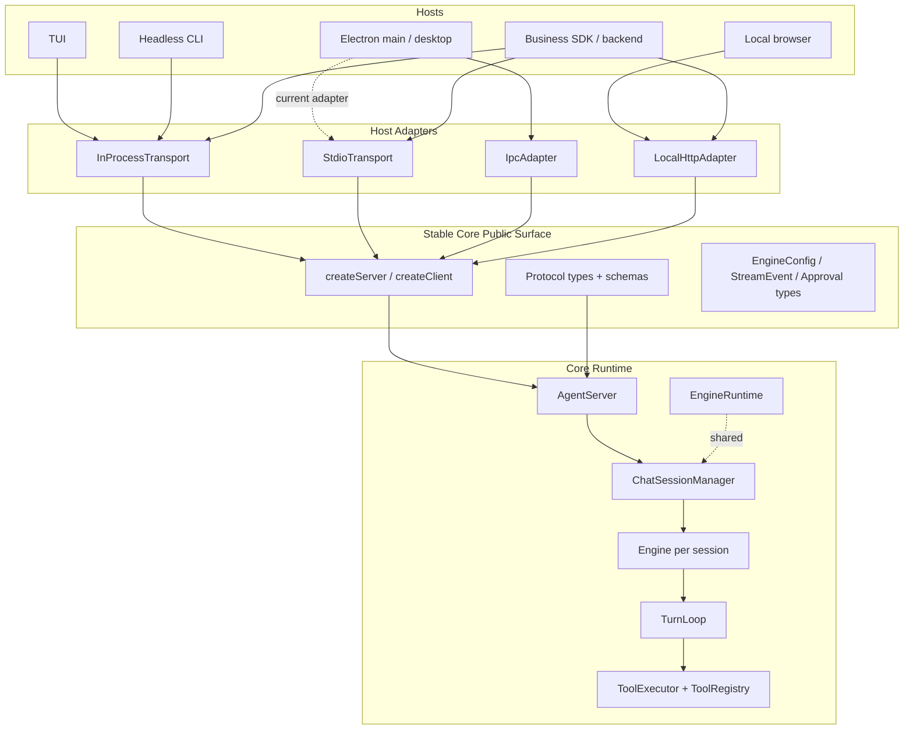

# Core Overall Design Standard

**Date:** 2026-05-26  
**Status:** Target design and stabilization standard  
**Scope:** `@cjhyy/code-shell-core`, protocol boundary, runtime resources, tool safety, and host adapters.

This document defines what "core is stable" means for CodeShell. It combines:

- `/Users/admin/Documents/个人学习/core内核/docs/codeshell/optimization-suggestions.md`
- `/Users/admin/Documents/个人学习/core内核/docs/codeshell/decoupling-architecture.md`
- [Core Stabilization Plan](../superpowers/plans/2026-05-26-core-stabilization.md)
- [Current Review and Bug Inventory](15-current-review-and-bug-inventory.md)

The short version:

> Core is stable when it is a host-agnostic capability kernel with one protocol, one runtime resource model, session-scoped isolation, conservative permissions, deterministic cwd/sandbox behavior, and a documented public API that business hosts can import without depending on internal implementation details.

---

## 1. Verdict on the Two New Source Docs

Both new docs are directionally right. The most important correction they make is this: core stability is not about adding more tools first. It is about closing existing boundary leaks before more hosts depend on the package.

Keep these decisions:

- P0 is safety and boundary hardening: permission, hooks, sandbox, SSRF, cwd, engine-bypass guard.
- P1 is runtime and protocol steadiness: real shared `EngineRuntime`, session-scoped notifications, public API contract, CI gates.
- HTTP/web support should be an adapter, not a hard dependency inside core.
- Multi-host support should reuse one `AgentServer` and one protocol shape.
- Multi-session isolation should be session-scoped, not process-global.

Calibrate these points before implementation:

- `StdioTransport` does not by itself make multi-session impossible. The worker can still run concurrent sessions through `ChatSessionManager`. The real reasons to prefer an Electron in-process `IpcAdapter` later are simpler lifecycle ownership, cleaner event routing, lower latency, and easier shared runtime management.
- Electron in-process core is a target state, not a blocker for the first stable core version. A safe stdio worker can remain an adapter while core boundaries are hardened.
- "Remove the 16 session limit" should mean "make it configurable with a sane default and idle eviction", not truly unlimited.
- Core should not depend on Hono/Fastify. A `LocalHttpAdapter` may live in a separate package or CLI layer.
- Public API should be protocol-first, but the existing raw `Transport` is message-oriented. Add typed factories/facades before asking business users to wire low-level JSON-RPC manually.

---

## 2. Target Architecture



Target ownership:

- `AgentServer` owns protocol dispatch and emits all host-visible notifications with `sessionId`.
- `ChatSessionManager` owns session lifecycle, FIFO same-session turns, idle eviction, and max-session policy.
- `EngineRuntime` owns process/worker-wide shared resources: model pool, provider catalog, settings manager, MCP pool, cost tracker, sandbox backend cache, and future telemetry provider.
- `Engine` owns per-session mutable state: permission mode, plan mode, transcript/session state, active context manager, active permission classifier, active turn signal.
- `ToolExecutor` owns permission checks, hook checks, guard checks, and calling tools with a `ToolContext`.
- Host adapters translate transport concerns only. They must not implement core policy.

---

## 3. Non-Negotiable Standards

### S1. Core Has No Host Runtime Dependency

Core may depend on Node, model SDKs, MCP SDK, and general libraries. It must not depend on Ink, Electron renderer APIs, browser DOM, Hono/Fastify, React UI, or host-specific settings UI.

Allowed:

- `AgentServer`
- `AgentClient`
- transports
- typed protocol models
- engine/runtime/tool abstractions

Not allowed:

- renderer state machines in core
- terminal UI assumptions in core
- Electron IPC assumptions in core
- HTTP framework imports in core

### S2. Protocol Is the Stable Boundary

Every host should reach the engine through the same semantic operations:

- `agent/run`
- `agent/cancel`
- `agent/approve`
- `agent/configure`
- `agent/query`
- `agent/inject`
- `agent/closeSession`

Business users should not need to instantiate `TurnLoop`, `ToolExecutor`, `ContextManager`, or `MCPManager` directly for normal use.

The stable public API should expose typed helpers:

```ts
const server = createServer({ cwd, llm, permissionMode });
const client = createClient(createInProcessTransportPair(server));

await client.run({ sessionId, task, cwd });
client.onStreamEvent(({ sessionId, event }) => {});
```

Raw message transport can remain available, but it is not the recommended business-facing surface.

### S3. All Runtime State Is Either Runtime-Scoped or Session-Scoped

No policy-relevant state should be process-global unless it is explicitly a process-wide singleton owned by `EngineRuntime`.

Runtime-scoped:

- `ModelPool`
- provider catalog
- `SettingsManager`
- `MCPManager`
- cost tracker
- sandbox backend cache
- telemetry/exporters

Session-scoped:

- active `Engine`
- permission mode
- plan mode
- active abort controller
- transcript state
- pending approvals
- pending background-agent notifications
- context compaction state

Forbidden:

- global permission mode
- global plan mode
- process-global notification queue for session-specific events
- global current session id except as an `AsyncLocalStorage` fallback for logging

### S4. Security Boundaries Fail Closed

Core defaults must be conservative because every new host increases exposure.

Hard rules:

- `acceptEdits` is not allow-all. It is an allowlist.
- Hooks/plugins may adjust a permission decision freely **except** that they cannot promote a non-`allow` classifier decision to `allow`. They may tighten `allow → ask/deny` and they may relax `deny → ask` (a legitimate audit pattern: convert a hard deny into an interactive confirmation). The only restriction is the no-promotion-to-`allow` rule. There is no "trusted plugin" escape hatch — if a hook wants to permit something the classifier denied, the user grants it through normal approval, not through hook output.
- Shell command classification treats shell metacharacters, command substitution, redirection, dangerous pipes, and process substitution as `ask` unless a parser proves the whole command is read-only.
- Plugin command hooks and settings shell hooks are either clearly trusted code or routed through the same permission/sandbox/abort path as Bash.
- Explicit sandbox modes fail closed. Only `auto` can degrade to `off`, and that must be visible.
- WebFetch validates every redirect hop and DNS-resolved IP, not just the initial hostname.

### S5. `ToolContext.cwd` Is the Only Execution Root

All built-in tools must resolve relative paths from `ToolContext.cwd`.

This includes:

- `ApplyPatch`
- `Glob`
- `Grep`
- `Config`
- `Skill`
- `REPL`
- `PowerShell`
- `Arena`
- `Worktree`
- future tools and MCP wrappers where path semantics are local

Tests must deliberately set `process.cwd()` and `EngineConfig.cwd` to different directories.

### S6. Cancellation Reaches Real Work

Returning "Tool aborted" while a child process keeps running is not cancellation.

Every long-running path must honor the active signal:

- Bash
- PowerShell
- REPL
- LSP server calls
- MCP calls
- plugin/shell hooks
- sub-agent runs
- background agents on session close

Minimum behavior:

1. Stop accepting new work.
2. Abort the in-flight promise.
3. Send `SIGTERM` or equivalent to child processes.
4. Send `SIGKILL` after a short grace period.
5. Clean up listeners, timers, and temporary sandbox files.

### S7. Public API Is Intentionally Small

`packages/core/src/index.ts` should stop being a broad compatibility barrel.

Stable exports should include:

- server/client factories
- `AgentServer`, `AgentClient`
- supported transports
- protocol types and schemas
- `Engine` for advanced direct embedding
- `EngineRuntime` only if its construction contract is documented
- tool/hook SDK helpers
- core public data types

Internal exports should move to an explicit subpath such as `@cjhyy/code-shell-core/internal`, with no stability promise.

### S8. Host Adapters Are Thin

Adapters translate host IO into protocol messages. They do not own policy.

TUI:

- may use `InProcessTransport`
- uses one fixed session id for normal REPL

Desktop:

- current stdio worker is acceptable while core stabilizes
- target adapter is Electron main-process `IpcAdapter`
- renderer remains thin and must not import runtime core code

Local web:

- implemented through `LocalHttpAdapter`
- defaults to `127.0.0.1`
- binding to `0.0.0.0` requires auth token
- does not belong inside core package dependencies

SDK/business:

- should use stable client/server factories and typed events
- should not deep import engine internals

---

## 4. Stability Gates

This document uses Gates as the canonical numbering. The plan and the roadmap reference these gates instead of redefining the lists.

| Gate (this doc) | Plan phase | Roadmap section |
|---|---|---|
| Gate 0 — Safety | [Phase A — P0 Safety and Boundary Hardening](../superpowers/plans/2026-05-26-core-stabilization.md#phase-a--p0-safety-and-boundary-hardening) | [0.0 Core Stability Gate](../roadmap.md#00-core-stability-gate业务接入前置) |
| Gate 1 — Correctness | [Phase A — A4 cwd consistency](../superpowers/plans/2026-05-26-core-stabilization.md#a4-cwd-consistency-across-all-tools) + multi-session items in B2 | 0.0 |
| Gate 2 — Runtime | [Phase B — B1 EngineRuntime real shared pools](../superpowers/plans/2026-05-26-core-stabilization.md#b1-engineruntime-real-shared-pools) | 0.0 |
| Gate 3 — API | [Phase B — B3 Public core API contract](../superpowers/plans/2026-05-26-core-stabilization.md#b3-public-core-api-contract) | 0.0 |
| Gate 4 — Verification | [Phase A — A5](../superpowers/plans/2026-05-26-core-stabilization.md#a5-ci-guard-correctness) + [Phase B — B4](../superpowers/plans/2026-05-26-core-stabilization.md#b4-typechecklint-gate) | 0.0 |
| Gate 5 — Host Adapter | not yet in plan — tracked here for post-stability work | 0.0 (deferred) |

### Gate 0: Safety Gate

Core cannot be called stable until all are true:

- [x] `acceptEdits` allowlist implemented. *(A1 — `permission.ts:ACCEPT_EDITS_ALLOWLIST`.)*
- [x] Bash safe-read metacharacter bypass closed. *(A1 — `classifyBashCommand` + `scanShellCommand`.)*
- [x] untrusted hooks cannot upgrade permissions. *(A1 — `executor.ts:clampHookDecision`; `allow` upgrade is dropped and logged.)*
- [ ] plugin/shell hook execution path is documented as trusted or routed through Bash-equivalent safety.
- [x] explicit sandbox mode fail-closed. *(A2 — `runtime.ts:resolveSandbox` caches the backend per (mode, cwd) and propagates `seatbelt`/`bwrap` failures; `engine.ts` no longer wraps the call in a try/catch with silent downgrade. Only `auto` may degrade to `off` and only with a one-time warning.)*
- [x] child process abort works for Bash and audited long-running tools. *(A2 — Bash, REPL, PowerShell now spawn-based with `ctx.signal` listeners and SIGTERM→SIGKILL escalation. LSP/MCP request cancellation deferred pending upstream SDK support; see [A2 spec](../superpowers/specs/2026-05-26-a2-sandbox-abort-design.md#out-of-scope).)*
- [x] WebFetch redirect and DNS SSRF guard implemented. *(A3 — manual redirect loop in `web-fetch.ts`, per-hop `validateHopHost` with `node:dns` lookup, `isBlockedIp` for IPv4/IPv6 private/loopback/link-local/multicast.)*
- [x] engine-bypass guard scans the monorepo package paths. *(done — `scripts/check-no-engine-bypass.sh:32-34`; still needs to be wired into CI in Gate 4.)*

### Gate 1: Correctness Gate

- [x] all builtin tools use `ToolContext.cwd`. *(A4 — ApplyPatch / Glob / Grep / REPL / PowerShell / Skill / Arena all consume `ctx?.cwd ?? process.cwd()`; Bash was already correct.)*
- [x] relative-path semantics are tested. *(A4 — `tests/tool-cwd.test.ts` runs `process.chdir(A)` + `ctx.cwd = B` and asserts each tool reads/writes B.)*
- [ ] same-session turns are FIFO.
- [ ] different sessions can run concurrently.
- [ ] cancel targets only one session.
- [ ] pending approvals are session-scoped.
- [ ] background-agent notifications cannot leak across sessions.

### Gate 2: Runtime Gate

- [x] `EngineRuntime` declares ownership of shared model/provider/settings resources. *(done — `packages/core/src/engine/runtime.ts:23-31` has real fields, not placeholders.)*
- [x] `Engine` actually consumes `runtime.mcpPool` and stops lazily instantiating `new MCPManager` per session. *(B1 — `engine.ts` now uses `this.runtime.mcpPool` when a Runtime is present, falling back to `new MCPManager` only for null-runtime paths like ad-hoc tests. `MCPManager.connect()` is already idempotent so subsequent sessions in the same Runtime reuse connections.)*
- [x] `MCPManager` lifecycle is owned by `EngineRuntime`, not the Engine. *(B1 — Runtime owns the instance; Engine consumes it as a shared resource.)*
- [x] `SandboxBackend` resolution is cached per Runtime. *(closed by A2 — `runtime.ts:resolveSandbox` provides per-(mode, cwd) cache.)*
- [ ] `CostTracker` is runtime-scoped and Engine usage records through it instead of the process-global singleton. *(deferred to B1.2 — requires changing `LLMClientBase.onUsage` signature to thread session/runtime context.)*
- [ ] discovered MCP tools default to not concurrency-safe unless proven otherwise.
- [ ] cost tracking has one canonical path.
- [ ] sandbox backend resolution is cached consistently.
- [ ] runtime close shuts down MCP connections, timers, and background work.

### Gate 3: API Gate

- [ ] stable exports documented in `packages/core/README.md`.
- [ ] internal exports separated or marked.
- [ ] SDK smoke test imports only from package entrypoints.
- [ ] protocol errors have a stable shape.
- [ ] protocol notifications always include `sessionId` when session-related.
- [ ] raw transport is available but business docs use typed client/server helpers.

### Gate 4: Verification Gate

- [ ] core build passes in CI.
- [ ] targeted core tests pass in CI.
- [ ] typecheck has no-new-errors baseline at minimum.
- [ ] `packages/core` typecheck is clean before public stability label.
- [ ] lint guard for package boundaries and engine bypass is blocking.
- [ ] security regression tests cover permission, sandbox, SSRF, cwd, cancel.

### Gate 5: Host Adapter Gate

This gate is not required for first core stability, but is required for "multi-host stable".

- [ ] TUI uses stable protocol client path.
- [ ] Desktop renderer remains thin.
- [ ] Desktop has either a hardened stdio worker or in-process `IpcAdapter`.
- [ ] Local HTTP adapter is implemented outside core or behind an optional package.
- [ ] at least two hosts run the same core session smoke test.

---

## 5. Implementation Order for One Stable Core Version

### Phase 0: Close P0 Leaks

Do these before API polish:

1. Permission hardening.
2. Hook permission downgrade-only policy.
3. Plugin/shell hook trust or Bash-equivalent execution path.
4. WebFetch SSRF redirect/DNS guard.
5. cwd consistency.
6. sandbox fail-closed and child-process abort.
7. engine-bypass guard and CI wiring.

Exit condition: Gate 0 and Gate 1 are satisfied for the core tool path.

### Phase 1: Make Runtime Real

1. Move MCP ownership into `EngineRuntime`.
2. Move cost tracking into one canonical usage path.
3. Cache sandbox backend by runtime/cwd/policy.
4. Make session manager max sessions configurable.
5. Add runtime close semantics.

Exit condition: Gate 2 is satisfied.

### Phase 2: Stabilize Protocol and Notifications

1. Make background-agent notifications session-scoped.
2. Emit notification events through `AgentServer`.
3. Let TUI/Desktop/SDK subscribe to the same event shape.
4. Ensure approval/cancel/configure/query routes by session where applicable.
5. Remove legacy single-engine paths from new host documentation once all first-party hosts are migrated.

Exit condition: multi-session stream, approval, cancel, and background notification tests pass.

### Phase 3: Cut the Public API

1. Split stable and internal exports.
2. Add `createServer` and `createClient` helpers.
3. Document the supported construction paths.
4. Add SDK smoke tests.
5. Update `packages/core/README.md`.

Exit condition: business users can run a session from public imports only.

### Phase 4: Host Adapter Follow-Through

1. Keep current desktop stdio worker if it is stable enough.
2. Add `IpcAdapter` when desktop needs lower-latency shared-runtime behavior.
3. Add `LocalHttpAdapter` and `codeshell serve` after protocol surface is stable.
4. Keep HTTP framework out of core.

Exit condition: first-party host adapters are thin and policy-free.

---

## 6. Test Matrix

Minimum test suites for the stable core version:

| Area | Required tests |
|---|---|
| Permission | safe-read bypass cases, `acceptEdits` allowlist, hook downgrade-only, explicit user approval |
| Sandbox | explicit unavailable mode fails, `auto` degrade warning, env secret allowlist behavior, cleanup |
| SSRF | direct loopback/private, redirect to loopback/private, DNS to private IP, max redirect |
| cwd | every builtin with path behavior under `process.cwd() !== ctx.cwd` |
| Cancellation | Bash timeout/cancel, REPL/PowerShell where available, MCP timeout, sub-agent cancel |
| Multi-session | two sessions run concurrently, same-session FIFO, targeted cancel, targeted approve |
| Notification | background agent completion reaches correct session and host event stream |
| Runtime | MCP connects once per runtime, cost accounting preserved, runtime close cleans up |
| API | import from package root only, no deep import in SDK smoke test |
| Guards | engine-bypass guard, desktop renderer no runtime core imports, package boundary lint |

---

## 7. Stable API Shape

Target public entrypoints:

```ts
import {
  createServer,
  createClient,
  createInProcessTransport,
  type CodeShellServer,
  type CodeShellClient,
  type RunParams,
  type RunResult,
  type StreamEvent,
} from "@cjhyy/code-shell-core";
```

Example:

```ts
const [serverTransport, clientTransport] = createInProcessTransport();

const server = await createServer({
  transport: serverTransport,
  cwd: process.cwd(),
  llm,
  permissionMode: "default",
});

const client = createClient({ transport: clientTransport });

client.onStreamEvent(({ sessionId, event }) => {
  if (event.type === "text_delta") process.stdout.write(event.text);
});

const result = await client.run({
  sessionId: "main",
  task: "Read README.md and summarize the project.",
});

await client.close();
await server.close();
```

Direct `new Engine(...)` can remain supported for advanced users, but the recommended path for hosts and business integrations should be server/client/protocol.

---

## 8. Explicit Non-Goals for the Stable Version

Do not block core stability on:

- fuzzy `Edit` replacer chain
- OTel exporter
- `codeshell serve`
- Electron in-process adapter
- local browser UI
- worker thread pool
- full Effect migration
- OOP to FP rewrite
- SaaS multi-tenant isolation

These are useful later. They should not delay the first stable core version.

---

## 9. Definition of Done

Core can be called stable for business users when:

- Gate 0 through Gate 4 pass.
- `@cjhyy/code-shell-core` README documents the stable import path.
- A business host can run a session using only public exports.
- TUI and at least one non-TUI host use the same protocol semantics.
- No tool depends on host process cwd accidentally.
- Cancelling a session stops its actual child work.
- Web/network tools cannot pivot to local/private resources through redirects.
- Permission policy cannot be silently upgraded by an untrusted plugin/hook.
- CI prevents regression in the safety and architecture guardrails.

After that, the repo can start treating `packages/core` as the stable base for TUI, Desktop, local web, and business integrations.
