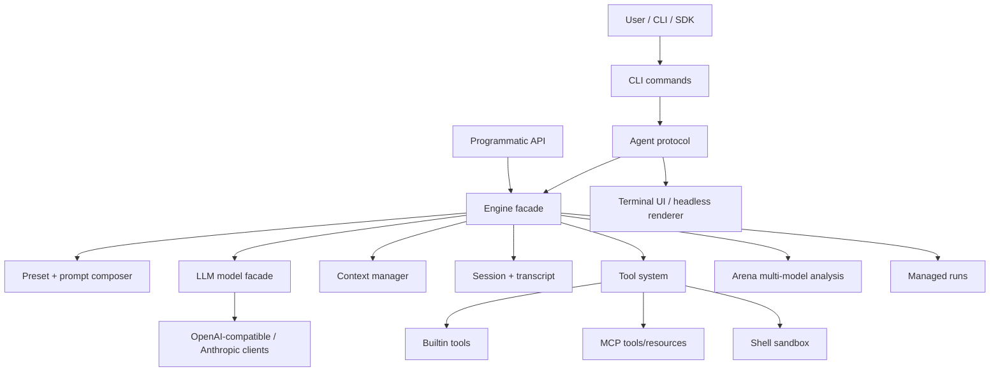

# System Overview

> Archive note: this page predates the monorepo split. Many `src/...` links below are historical and may be broken; use the current architecture set starting at [`../../architecture/00-overview.md`](../../architecture/00-overview.md) for package-aligned links.

## What CodeShell Is

CodeShell is a TypeScript/Bun agent framework that can be used as both:

- a terminal coding assistant, through the default `terminal-coding` preset and REPL UI;
- a general agent orchestration framework, through `Engine`, `RunManager`, `Arena`, and `defineProduct()`.

The core is intentionally not coding-specific. Coding behavior is layered in through presets, prompt sections, tool selection, permissions, and terminal UX.

## Top-Level Shape



## Architectural Layers

| Layer | Main paths | Responsibility |
|---|---|---|
| Entry and packaging | [`src/cli`](../../src/cli), [`src/index.ts`](../../src/index.ts), [`package.json`](../../package.json) | CLI commands, public exports, build subpaths |
| Agent core | [`src/engine`](../../src/engine), [`src/preset`](../../src/preset), [`src/prompt`](../../src/prompt) | Engine wiring, turn loop, prompt assembly, preset resolution |
| Runtime services | [`src/context`](../../src/context), [`src/session`](../../src/session), [`src/settings`](../../src/settings), [`src/logging`](../../src/logging) | Context pressure, persistence, configuration, telemetry |
| Tool and integration layer | [`src/tool-system`](../../src/tool-system), [`src/skills`](../../src/skills), [`src/hooks`](../../src/hooks), [`src/lsp`](../../src/lsp), [`src/git`](../../src/git) | Tool registry, execution, permission policy, MCP, skills, hooks, coding helpers |
| Model layer | [`src/llm`](../../src/llm), [`src/data`](../../src/data) | Provider clients, model pool, provider catalog, model discovery/cache, capability rules |
| Interaction layer | [`src/protocol`](../../src/protocol), [`src/ui`](../../src/ui), [`src/render`](../../src/render), [`src/cli/output`](../../src/cli/output) | Client/server protocol, interactive REPL, terminal renderer, headless output |
| Long-running and product APIs | [`src/run`](../../src/run), [`src/product`](../../src/product), [`src/arena`](../../src/arena) | Run queue/state machine, external product definition, multi-model analysis |

## Main Design Decisions

- The Engine is a facade, not a monolith. It wires model, tools, context, sessions, permissions, hooks, and prompt composition for each run.
- Presets own domain behavior. `general` and `terminal-coding` differ mainly by prompt sections, git-status injection, tool set, and permission defaults.
- Tool execution is centralized. Every tool call flows through validation, hooks, guards, permissions, timeout handling, and transcript recording.
- Protocol separates UI from Engine. The REPL and headless command both use `AgentServer` and `AgentClient`, even when transport is in-process.
- Runtime state is file-backed. Sessions, transcripts, runs, logs, model cache, local settings, and memories live under `.code-shell` locations.
- The LLM layer treats many vendors as OpenAI-compatible, while capability rules normalize request-shape differences per provider kind/model.

## Public API Surface

The package exports:

- root API from [`src/index.ts`](../../src/index.ts): `Engine`, tool primitives, prompt/context/session helpers, presets, skills, Arena, Run, product APIs.
- `./run` from [`src/run/index.ts`](../../src/run/index.ts): managed run lifecycle.
- `./arena` from [`src/arena/index.ts`](../../src/arena/index.ts): Arena and iterative Arena.
- `./product` from [`src/product/index.ts`](../../src/product/index.ts): `defineProduct()`.

## Default Product Path

```text
code-shell
  -> src/cli/main.ts
  -> repl or run command
  -> settings + onboarding + model selection
  -> Engine
  -> AgentServer / AgentClient
  -> UI or headless renderer
```

The default CLI preset is `terminal-coding`. The default library preset is `general`.
