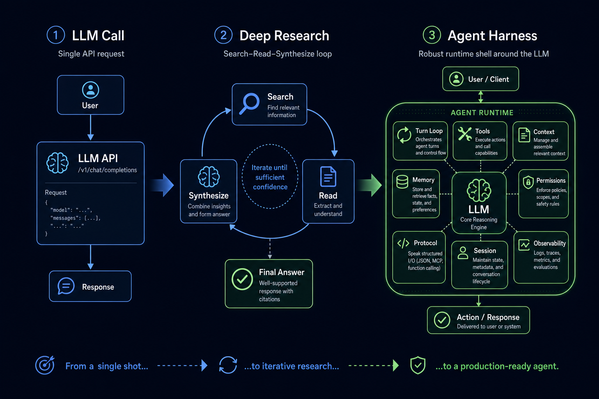
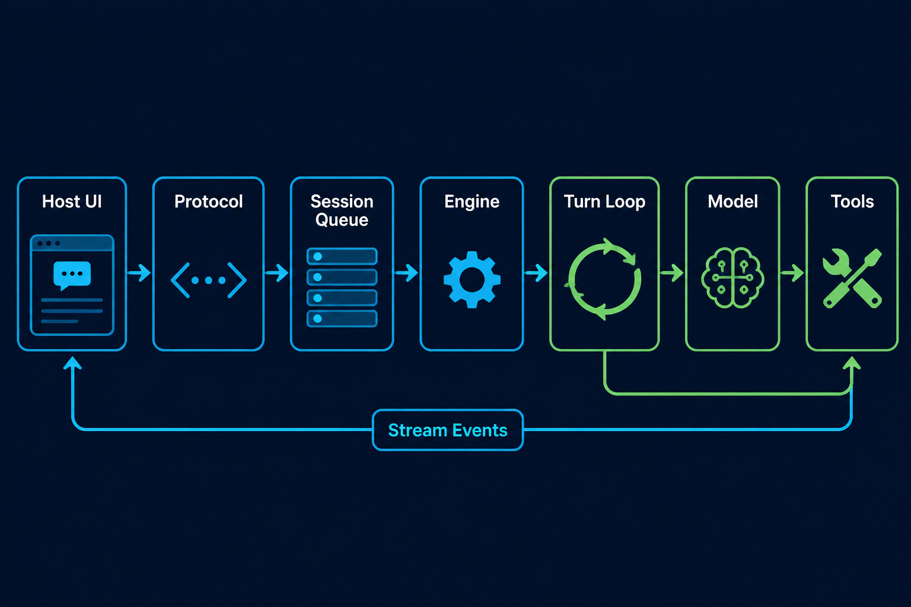

# 01｜什么是 Harness Agent：从 LLM Call 到 Deep Research，再到可运行系统

为什么我现在会专门写一个系列讲 harness？

因为我自己的开发体验已经被这类工具改变了。

最开始用 Cursor 的时候，AI 更像是一个编辑器里的增强补全：帮我写一段代码、解释一段逻辑、补一个函数。它很有用，但人的角色还是主执行者。测试或者用户反馈一个 bug，还是我自己去捞日志、查链路、定位代码、想方案、改代码、补测试，AI 主要是在某些局部环节加速。

到了 Claude Code、Codex 这类 coding agent，体验开始不一样了。

现在一个问题过来，我更常见的工作方式是：先让 agent 自己去代码里找 bug，找相关链路，给出可能的原因和修复方案。人的工作不再是每一步都亲自执行，而是不断给它补上下文。

比如：

1. 测试或者用户反馈一个问题。
2. 我把问题丢给 Claude Code / Codex，让它先去找代码路径和可疑点。
3. 它缺上下文时，我去 ES 捞日志，去 Langfuse 捞整条链路，把脱敏后的请求、响应、trace、模型输出补给它。
4. 它基于这些信息给出 bug 定位和修改方案。
5. 我检查方案对不对，不对就继续补 context。
6. 它修改代码、补测试、跑验证。
7. 我最后 check diff、check 测试结果，再决定要不要合。

这个流程下，人的作用发生了变化：不是不写代码了，而是从“亲自完成每个动作”，变成“补充关键上下文、判断方向、约束边界、做最终确认”。

这也改变了我对 TDD 的看法。

以前很多时候不是不知道 TDD 好，而是排期倒排、需求变动、问题定位成本太高，TDD 经常被挤成“有时间再补”。但现在 agent 可以读代码、写测试、跑测试、根据失败结果继续修，TDD 反而更像一个先决条件：你先把期望行为和失败反馈描述清楚，再让 agent 围绕测试不断逼近正确实现。

所以我后来在测试平台里接了一个 core，把测试反馈、日志、脱敏后的内容、链路追踪、LLM judge、自动 MR、代码 review 串了起来。用户反馈进来后，系统能拿到 log 和 trace，让 LLM 先做判断，生成修复方向，甚至自动提 MR，再由人做最后 check。

这里真正有价值的，不是“模型突然变聪明了”，而是 harness 被接进了日常工作流。

它能拿到完整的数据流，把反馈、日志、trace、代码、测试放进同一个循环；它能让模型去理解另一个模型产生的链路和输出；它能一轮一轮试错、修正、验证，逼近一个更优的状态。

这其实就是最基础的反馈循环：观察结果，补充上下文，提出假设，修改系统，再观察新结果。后面我会拆我自己写的这个 repo，讲具体怎么设计、为什么能 work。

但在进入具体实现之前，需要先讲清楚一个基础问题：什么是 harness？它和一次 LLM call、一次 Deep Research，到底有什么区别？

最早一批 AI 应用，很多都只是一次 **LLM call**。

用户输入问题，应用把 prompt 发给模型，模型返回一段文本，界面把文本展示出来。问答、总结、改写、翻译、分类，这些场景用这种方式就能跑起来。

但很快大家发现：一次模型调用只能回答“当前 prompt 里已经有足够信息”的问题。一旦任务需要查资料、读多个来源、比较证据、反复修正结论，单次 LLM call 就不够了。

于是出现了 Deep Research 这类框架。

Deep Research 本质上已经有了一点 harness 的雏形：它不再只问模型一次，而是让模型围绕一个目标反复执行“搜索 → 阅读 → 记录 → 继续搜索 → 汇总”。它通过增加搜索轮次，获得更多材料、更多上下文，再不断优化最终结果。

这背后有一个很现实的原因：当时主流模型的上下文还不够长。128K、256K 已经算很大，但对于复杂研究、代码仓库、长文档、多来源资料来说，仍然很容易不够。Deep Research 的循环，本质上是在用外部搜索和多轮整理，弥补模型单次上下文窗口的不足。

但现在情况变了。

主流模型的上下文正在进入 1M 级别。对于一个普通 session 对话，很多时候已经不容易撞到上下文上限。模型一次能“看见”的东西变多了，基础对话能力也被显著推高。

这反而推动了另一个问题浮出水面：当模型已经能看很多、想很久、处理更复杂的输入时，系统瓶颈就不再只是“上下文够不够”，而是“如何把模型放进一个可控的运行环境里”。

也就是说，能力增强之后，真正重要的变成了 harness：

- 如何把模型调用、工具调用、上下文管理拆开？
- 如何让模型不是一次性回答，而是在循环里推进任务？
- 如何让工具执行被权限、审批和沙箱约束？
- 如何让 CLI、桌面端、远程端复用同一个 core？
- 如何让一次对话能处理到人通过对话能处理的极限？

这就是从 LLM call 到 Deep Research，再到 Harness Agent 的演进线索。

当你开始做“能自己读文件、查资料、调用工具、连续推理、完成任务”的系统时，你会遇到一连串问题：

- 模型说要读一个文件，谁去读？
- 工具返回结果后，怎么再喂回模型？
- 工具能不能随便执行？谁来审批？
- 上下文满了怎么办？
- 任务跑到一半断了怎么办？
- CLI、桌面端、手机远程控制，能不能共用同一个 agent core？
- 用户取消、工具失败、模型输出截断，这些状态谁来处理？

这些问题的答案，不在模型里，而在模型外面那层运行壳里。

这层运行壳，就是 **Agent Harness**。

---

## 1. 第一阶段：LLM Call，只是一次函数调用

最小的 AI 应用通常长这样：

1. 用户输入 prompt。
2. 应用把 prompt 变成 messages。
3. 调用模型 API。
4. 把模型回复展示给用户。

这个阶段的核心能力是“语言生成”，不是“任务执行”。

如果问题本身已经被完整放进 prompt 里，模型只需要基于已有信息生成答案，那么一次 LLM call 就很合适。比如总结一段文本、改写一封邮件、翻译一段内容、做一个简单分类，本质上都是“输入已经足够，模型负责生成”。

但只要任务开始依赖外部世界，一次 LLM call 就会露出边界。它不能自己决定去哪里找资料，不能真的读取你的代码仓库，不能安全地运行命令，也不能在工具失败后自动调整路线。更重要的是，它没有任务状态：不知道自己已经做了哪些步骤，也不知道下一步应该基于什么结果继续。

所以 LLM call 的边界不是“模型聪不聪明”，而是它缺少运行时。

它没有自己的工具系统，没有会话状态，没有任务循环，没有上下文治理，也没有权限边界。它只是一个输入输出函数。

如果把模型看成“大脑”，LLM call 只是让大脑说一句话。它还没有手、眼睛、记忆、工作台，也没有安全规则。

---

## 2. 第二阶段：Deep Research，开始出现循环

Deep Research 值得单独拿出来讲，是因为它处在 LLM call 和通用 agent harness 中间。

它的典型模式不是一次回答，而是围绕一个研究目标不断扩展信息边界。

模型先理解问题，把大问题拆成几个可以搜索的子问题；系统再根据子问题去搜索资料、读取网页、抽取证据；如果证据不够，模型继续提出新的搜索方向；如果资料之间互相矛盾，模型需要比较来源、记录不确定性；直到材料足够支撑一个结论，再汇总成报告。

这时候系统已经不再是“问模型一次”。模型在循环里反复决定下一步：现在缺什么信息，应该查哪里，哪些资料可信，什么时候可以停止。

从这个角度看，Deep Research 已经有了 Agent 的雏形：

| 能力 | 在 Deep Research 里的表现 |
|------|-----------------------------|
| 循环 | 不是一次调用，而是搜索、阅读、判断、再搜索 |
| 工具 | 搜索、网页读取、资料抽取变成模型可调用的外部能力 |
| 中间状态 | 子问题、证据、缺口、不确定性会被持续记录 |
| 停止判断 | 系统需要判断资料是否足够支撑最终报告 |
| 结果综合 | 最终答案来自多轮材料，而不是单次 prompt |

它解决的核心问题，是“模型单次上下文不够时，如何通过外部资料和多轮整理扩展信息量”。搜索轮次越多，读到的材料越多，模型能综合的 context 就越多，最终结果也越接近一个研究员反复查证后的报告。

但 Deep Research 仍然是一个专项 harness：它主要服务于研究任务，工具通常集中在搜索和网页读取，状态结构也围绕 research report 设计。

当模型上下文进入 1M 级别后，基础 session 对话已经能承载更多材料。此时系统真正需要解决的，不只是“如何获得更多 context”，而是“如何把更多 context、更多工具、更长任务、更复杂宿主，放进一个统一、可控、可恢复的运行壳里”。

如果你想做一个通用 coding agent、桌面 agent、自动化 agent、远程控制 agent，仅有 Deep Research 的循环还不够。

你需要把“研究循环”抽象成更通用的运行壳：Harness Agent。

---

## 3. 第三阶段：Harness Agent，把模型变成可运行系统

Agent Harness 不是某一个功能，而是一组运行时能力。

它把模型包进一个可控系统里，让模型不只是“生成下一段文本”，而是可以在真实环境里推进任务：读取上下文、选择工具、等待审批、执行动作、接收结果、继续推理，并在必要时压缩上下文、恢复状态、把过程流式发给宿主 UI。

换句话说，harness 做的是把模型的“推理能力”接到一个“运行环境”里。

| 没有 Harness | 有 Harness |
|--------------|------------|
| 模型只负责回答当前 prompt | 模型可以在循环里推进任务 |
| 工具调用是临时拼接 | 工具进入统一注册、校验、权限、执行管线 |
| 上下文靠人工塞 prompt | 上下文由系统管理、压缩、恢复 |
| 失败只能重新问 | 失败可以被记录、回灌、重试或恢复 |
| UI 只展示最终文本 | 宿主可以看到 stream event、工具过程、审批状态 |

这就是“从 LLM call 到 agent”的本质变化：

> LLM call 是一次推理。Agent Harness 是一次受控运行。

一个真正的 harness agent 至少需要七个部件：

1. **Engine**：负责装配一次运行所需的模型、工具、上下文、权限和会话。
2. **Turn Loop**：负责多轮模型调用、工具调用、停止判断。
3. **Tool System**：负责工具注册、参数校验、权限判断、实际执行。
4. **Context Manager**：负责控制上下文窗口，不让长任务把模型撑爆。
5. **Session / Transcript**：负责记录发生过什么，支持恢复和审计。
6. **Permission / Sandbox**：负责限制工具能力，避免 agent 失控。
7. **Protocol / Host Adapter**：负责让 CLI、桌面端、远程端接入同一个 core。

CodeShell core 正是按这个方向拆的。

它不是把所有逻辑塞进一个 `runAgent()` 函数，而是拆成多个边界清晰的系统：

- `Engine` 负责装配。
- `TurnLoop` 负责循环。
- `ModelFacade` 负责模型调用。
- `ToolExecutor` 负责工具执行管线。
- `ContextManager` 负责上下文治理。
- `Transcript` 和 `SessionManager` 负责会话与记录。
- `AgentClient / AgentServer / Transport` 负责宿主协议。

这就是 harness 的意义：模型只是内核，系统能力来自外壳。

---

## 4. 为什么不能把这些都写在一个大函数里？

早期 demo 经常会写成一个大循环：调模型，如果返回 tool call 就执行工具，把结果 append 回 messages，然后继续调模型。

这个写法能跑，也很适合验证想法。但它的问题是：所有复杂性都会挤进同一个地方。

一开始你只是在处理“模型要不要调用工具”。很快你会发现，同一个位置还要处理权限、审批、参数校验、路径安全、Bash 沙箱、上下文压缩、用户取消、工具失败、会话恢复、UI 事件、日志记录、子代理通知。每加一个能力，循环里就多一层 if/else。最后你得到的不是 agent runtime，而是一个没人敢改的大函数。

更麻烦的是，这些能力的生命周期并不一样。

模型调用关心 provider、streaming、stop reason；工具执行关心 schema、权限、sandbox；上下文管理关心 token budget 和历史压缩；session 关心恢复和审计；host 协议关心事件、审批和 UI 展示。它们会在同一次 run 里协作，但不应该由同一个函数直接管理全部细节。

所以拆层不是为了“架构好看”，而是为了让复杂性有明确归属：模型层处理模型差异，循环层处理任务推进，工具层处理工具生命周期，权限层处理 allow/ask/deny，上下文层处理窗口治理，协议层处理 core 和 host 的边界。

一个 harness 是否能长期演进，关键就看这些边界是否清楚。边界清楚，后面加 MCP、自动化、远程控制、子代理，都还能沿着已有链路扩展；边界不清楚，任何增强都会变成往大函数里继续塞逻辑。

---

## 5. 业界的解题思路，以及我的实现思路

如果从业界现有产品看，大家其实都在往同一个方向走：把模型从“聊天框”里拿出来，放进一个能持续运行的工程环境。

Cursor 更偏编辑器增强：它把模型嵌进 IDE，让模型理解当前文件、选区、上下文，并在编辑器内完成补全、解释、修改。它解决的是“人在写代码时，模型怎么贴近编辑现场”。

Claude Code 和 Codex 更进一步：它们不只是编辑器补全，而是把模型放进一个命令行/项目工作区里，让模型能读仓库、搜索代码、运行命令、修改文件、跑测试，再根据结果继续下一步。它们解决的是“模型如何在一个真实工程目录里持续执行任务”。

Deep Research 也是同一条路上的一个分支：它把搜索、阅读、证据整理接进循环，让模型通过更多轮次获得更多上下文，最终产出更好的研究报告。

这些方向背后的共同点，就是 harness：

不是让模型单次回答，而是给模型一个运行环境：有循环，有工具，有上下文，有状态，有权限，有反馈。

我的思路也是沿着这个方向做的，但落点不是“再做一个聊天框”，而是把 harness 接进日常研发工作流。

在我的测试平台里，用户反馈、测试结果、ES 日志、Langfuse 链路、脱敏后的请求内容、模型输出、代码仓库、测试用例，本来都是分散的。过去人要在这些系统之间来回切：先看反馈，再查日志，再找 trace，再定位代码，再想修复方案。

我做的事情，是在中间接一个 core，把这些数据流打通，让模型进入这个循环：

1. 接收用户反馈或测试失败。
2. 自动拿到脱敏后的日志和链路信息。
3. 让 LLM 先做 judge，判断问题类型和可能原因。
4. 把判断结果、trace、相关代码上下文交给 coding agent。
5. 让 agent 生成修复方案、修改代码、补测试。
6. 自动提 MR，并触发代码 review。
7. 人最后检查方案、diff、测试结果，再决定是否合入。

这里的关键不是“让模型一次性给出完美答案”，而是让它进入一个可反复修正的循环。模型判断不准，就补 context；修复不对，就看测试失败结果继续迭代；review 发现问题，再把反馈喂回去。

这也是我觉得 harness 值得单独拆的原因：它不是某个单点功能，而是一种把模型接入工作流的方法。模型本身越来越强，但真正的效率提升，来自它能不能拿到正确上下文，能不能被约束地调用工具，能不能把失败结果带回下一轮，能不能让人只在关键判断点介入。

---

## 6. 接下来我要从哪些维度拆一个 Harness

所以这篇文章不是要给出一个最终答案，而是先把问题框出来：我们讨论的不是“怎么调一次模型”，也不是“怎么写一个搜索循环”，而是怎么设计一个能接入真实工作流的 agent harness。

后面我会按几个维度拆：

**第一，Engine。** 也就是一次 run 到底怎么被装配起来：模型、工具、权限、上下文、session、hook，谁负责创建，谁负责串起来。

**第二，Turn Loop。** Agent 为什么不是一问一答，而是一个多轮状态机：模型调用、工具调用、结果回灌、停止判断、失败恢复，如何形成闭环。

**第三，Tool System。** 工具不是函数表。工具要有注册、schema、权限、审批、沙箱、结果封装，否则 agent 一旦接触真实环境就会失控。

**第四，Context。** 长上下文模型解决了一部分问题，但没有解决全部问题。真实 harness 仍然要管理当前窗口、历史 transcript、大工具结果、压缩和恢复。

**第五，Session / Memory。** Agent 需要知道自己做过什么，也需要把可复用的信息沉淀下来。session 解决一次任务的连续性，memory 解决跨任务的经验。

**第六，Protocol / Host。** Core 不应该绑死在一个 UI 里。CLI、Desktop、Remote、Automation 都应该通过协议接入同一个运行核心。

这些维度加起来，才是我理解的 harness：不是模型能力本身，而是模型进入工程系统之后，支撑它持续工作的那套运行结构。

下一篇先从最核心的地方开始：**Turn Loop，也就是 Agent 的主循环。**