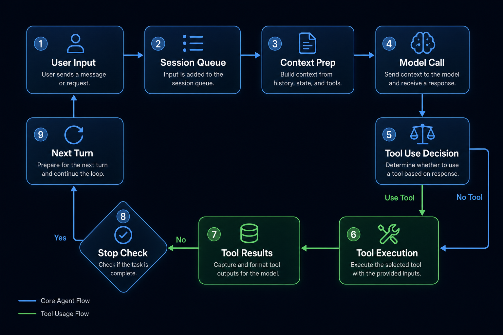

# 02｜Agent 的主循环：从用户输入到多轮工具调用

一个 agent 最容易被误解的地方，是把它看成“更聪明的聊天”。

聊天系统通常是一问一答：用户发一句，模型回一句。Agent 不是这样。Agent 的一次“回答”，内部可能包含多轮模型调用、多次工具执行、多次上下文整理，甚至还可能被 hook 阻止停止并继续工作。

所以设计 agent harness 时，第一个核心结构不是 UI，也不是工具列表，而是 **Turn Loop**。

Turn Loop 是 agent 的心脏。

它决定：

- 用户输入如何进入运行队列。
- 模型什么时候被调用。
- 工具调用如何被发现和执行。
- 工具结果如何回到模型。
- 上下文什么时候整理。
- 任务什么时候停止。

---

## 1. 用户输入不应该直接进模型

一个生产级 agent 不能把用户输入直接塞给模型。

中间至少要经过几层：

1. **Client**：宿主侧发起 run。
2. **Transport**：把请求送到 agent core。
3. **Server**：解析协议请求。
4. **Session**：找到对应会话。
5. **Queue**：保证同一个会话内 turn 串行。
6. **Engine**：装配本次运行依赖。
7. **TurnLoop**：真正开始 agent 循环。

CodeShell 的主链路就是这样：

`AgentClient → Transport → AgentServer → ChatSession → Engine.run → TurnLoop`

为什么要这么绕？

因为真实 agent 需要处理并发和状态。

如果用户连续发两条消息，同一个会话应该串行处理，而不是两个模型调用同时修改同一份 transcript。如果用户点击取消，系统要知道取消的是哪个 session、哪个 turn、哪个工具批次。如果桌面端和手机端同时连接，它们也必须路由到同一个 session bucket。

这就是 session queue 的意义。

---

## 2. Engine 不是循环本身，而是装配器

在 CodeShell core 里，`Engine` 更像一个运行装配器。

它会在一次 run 开始时准备：

- LLM client
- model facade
- tool registry
- tool executor
- permission classifier
- approval backend
- context manager
- prompt composer
- transcript
- hooks
- session state

这一步非常重要。

很多 demo 代码会把这些东西写死在循环里，导致后面很难替换模型、禁用工具、切换权限模式、接入插件或做 session 恢复。

更合理的设计是：

- Engine 负责“本次运行需要什么”。
- TurnLoop 负责“本次运行怎么推进”。

这两个职责应该分开。

---

## 3. Turn Loop 的最小状态机

一个最小可用 turn loop 可以抽象成这样：

1. 准备 messages。
2. 做上下文管理。
3. 调模型。
4. 如果模型返回普通文本，进入停止判断。
5. 如果模型返回工具调用，执行工具。
6. 把工具结果追加到 messages。
7. 回到第 2 步。

这就是 agent 和普通 chat 的本质区别：

> 普通 chat 的输出面向用户。Agent loop 的输出先面向下一轮模型。

工具结果不是最终答案，而是下一轮推理的输入。

比如 coding agent 里，模型可能先调用 `Read` 看文件，再调用 `Grep` 找引用，再调用 `Edit` 修改代码，再调用 `Bash` 跑测试。每一步的结果都进入下一轮模型上下文。

如果没有 loop，工具调用只是孤立动作。

有了 loop，工具调用才变成任务推进。

---

## 4. 模型调用要通过 Facade

为什么不在 TurnLoop 里直接调用 provider SDK？

因为 provider 差异很多：

- streaming 事件格式不同。
- tool call 表达不同。
- stop reason 不同。
- token usage 不同。
- reasoning / thinking 字段不同。
- 截断和重试策略不同。

所以 CodeShell 在 TurnLoop 和 provider client 之间放了 `ModelFacade`。

Facade 的作用不是“增加一层抽象好看”，而是统一模型调用行为：

- 把 provider response 转成统一结构。
- 把 text delta / tool_use_start 转成统一 StreamEvent。
- 记录 transcript。
- 记录 usage。
- 处理 streaming fallback。

这样 TurnLoop 不需要关心底层是 Anthropic、OpenAI 兼容接口，还是其他 provider。

TurnLoop 只关心：

- 这轮模型说了什么？
- 有没有 tool calls？
- stop reason 是什么？

---

## 5. 工具调用不是循环外的附属品

很多人设计 agent 时，会把工具系统看成“模型需要时调用一下”。

但在 harness 里，工具调用是 loop 的核心阶段。

一次工具阶段至少包含：

1. 识别模型返回的 tool calls。
2. 把 assistant message 写入 messages。
3. 对每个工具调用发出 stream event。
4. 执行工具。
5. 收集工具结果。
6. 把 tool_result 写回 messages。
7. 把结果发回宿主 UI。
8. 进入下一轮模型调用。

这意味着工具结果必须符合模型 API 的消息协议。否则下一轮调用可能直接失败。

这也是为什么 CodeShell 有 `patch-orphaned-tools` 这类修补逻辑：如果恢复会话时发现 assistant 里有 tool_use，但缺少对应 tool_result，需要补合成结果，避免 provider 拒绝请求。

生产级 agent 不能只考虑 happy path。

---

## 6. Stop 不是简单的“模型不调用工具了”

最简单的停止条件是：模型没有返回工具调用，就结束。

但更强的 agent harness 通常还需要 stop hook。

例如 goal 模式下，模型说“我完成了”，系统未必相信。可以触发一个 `on_stop` hook，让另一个判断器检查目标是否真的达成。

如果目标未达成，hook 可以注入一条消息，让 TurnLoop 继续。

这使得停止从“模型自然停”变成“系统裁决停”。

对于长任务，这很关键。

否则模型很容易因为一次局部完成就提前停止。

---

## 7. StreamEvent：把内部循环变成可见过程

Agent loop 内部会发生很多事：

- 开始请求模型。
- 输出文本 delta。
- 输出 thinking delta。
- 开始工具调用。
- 工具参数增量。
- 工具结果。
- task update。
- goal progress。
- turn complete。
- error。

这些事件不能等最终答案出来后再告诉 UI。

用户需要实时看到 agent 在做什么，尤其是当它要执行工具、请求权限、等待长任务时。

所以 harness 需要统一事件流。

CodeShell 用 `StreamEvent` 做这件事。TUI、Desktop、Mobile Remote 都可以消费同一类事件，只是渲染方式不同。

这也是 core / host 解耦的基础。

---

## 8. 设计一个 Turn Loop 的 checklist

如果你要自己实现 agent turn loop，至少要回答这些问题：

### 输入与队列

- 同一个 session 能不能同时跑多个 turn？
- 队列如何取消？
- sessionId 如何贯穿日志和事件？

### 模型调用

- streaming 和 non-streaming fallback 怎么处理？
- provider 的 tool call 格式如何统一？
- stop reason 如何归一化？

### 工具阶段

- tool_use 如何转成 assistant message？
- tool_result 如何保证一一对应？
- 并发工具是否允许？
- 工具失败是否中断整个 loop？

### 上下文阶段

- 每轮调用前是否做 context management？
- 工具结果太大时怎么处理？
- 上下文压缩后是否通知模型？

### 停止条件

- 无工具调用就停止吗？
- 是否支持 goal hook？
- max turns 如何处理？
- 用户取消算什么 terminal reason？

---

## 9. 小结

Turn Loop 是 harness agent 的心脏。

没有 Turn Loop，你只有一次模型调用。

有了 Turn Loop，模型才能：

- 观察环境。
- 调用工具。
- 接收结果。
- 修正计划。
- 多轮推进。
- 在系统约束下停止。

但 loop 本身还不够。下一篇我们会看 agent 最危险、也最关键的一层：**工具系统**。

因为 agent 真正接触世界，是从工具开始的。