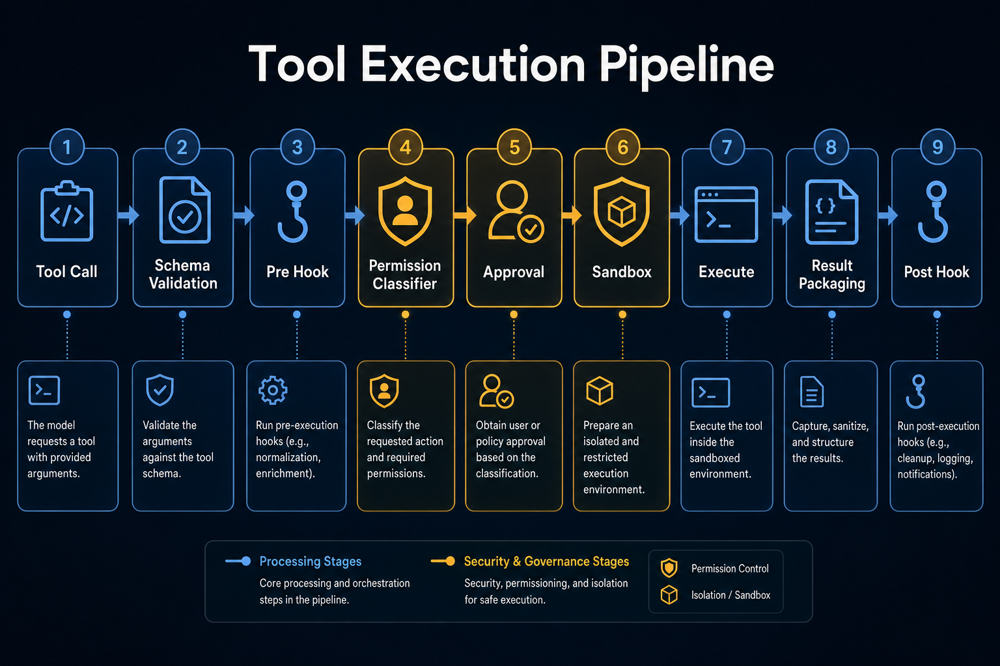

# 03｜工具系统：Agent 能做事之前，必须先学会被约束



Agent 之所以像 agent，不是因为它会说话，而是因为它能做事。

它可以读文件、搜索代码、运行命令、编辑内容、调用浏览器、访问 MCP server、启动子代理。工具让模型从“语言系统”变成“行动系统”。

但工具也是 agent harness 里最危险的一层。

因为工具一旦接入真实环境，模型输出就不再只是文本，而会变成副作用：

- 删除文件。
- 修改代码。
- 运行 shell。
- 访问网络。
- 读取密钥。
- 调用外部服务。

所以工具系统的核心不是“怎么执行函数”，而是“怎么安全地执行函数”。

---

## 1. 错误直觉：工具就是函数表

很多初版 agent 会把工具系统设计成这样：

```text
工具名 -> 函数
```

模型返回：

```text
{ name: "read_file", args: { path: "..." } }
```

系统查表执行：

```text
tools[name](args)
```

这个设计可以跑 demo，但不能做生产系统。

因为它缺少几个关键问题的答案：

- 参数是否合法？
- 工具是否存在？
- 用户是否允许执行？
- 当前模式是否允许写文件？
- 路径是否越过工作区？
- Bash 命令是否危险？
- 工具输出是否要截断或落盘？
- 执行前后是否要触发 hook？
- 外部 MCP 工具输出是否可信？

这些都不是函数表能解决的。

生产级工具系统必须是一条 pipeline。

---

## 2. 工具执行管线应该长什么样

CodeShell 的工具调用不是直接执行，而是经过多级门控。

抽象后大致是：

1. **Tool Call**：模型提出工具调用。
2. **Capability Gate**：工具是否被当前项目/模式禁用。
3. **Plan Mode Gate**：计划模式下是否只允许只读工具。
4. **Schema Validation**：参数是否符合 schema。
5. **Pre Hook**：插件/系统是否要拦截、改写或要求审批。
6. **Investigation Guard / Task Guard**：是否违反运行策略。
7. **Permission Classifier**：分类为 allow / ask / deny。
8. **Permission Hook**：允许安全 hook 降权。
9. **Approval Backend**：需要 ask 时请求用户或无头策略。
10. **Tool Start Hook**：执行前通知。
11. **Registry Execute**：真正执行工具。
12. **Tool End / Post Hook**：执行后补充上下文或触发副作用。
13. **Result Packaging**：变成模型能理解的 tool_result。

这条链路说明：工具系统不是 action layer，而是 control layer。

执行只是最后一步。

---

## 3. Tool Registry：能力列表必须可控

工具注册表的职责是回答：

> 当前 agent 到底有哪些能力？

这包括：

- 内置工具，比如 Read、Write、Edit、Bash、Grep、Glob。
- MCP 工具，比如外部服务暴露的能力。
- 自定义工具，比如 automation memory update。
- 子代理工具，比如 Agent。

注册表不仅给 executor 查函数，也给 prompt composer 生成模型可见的 tool definitions。

这意味着工具可见性本身就是权限边界的一部分。

如果一个项目禁用了某个工具，它不应该出现在模型可见工具列表里。即使模型幻觉调用了它，executor 也应该再次拦截。

这就是双层防御：

- prompt 层隐藏。
- executor 层拒绝。

---

## 4. Schema Validation：不要相信模型参数

模型生成的工具参数不是可信输入。

它可能：

- 缺字段。
- 字段类型错。
- 多传内部字段。
- 路径格式不对。
- 参数结构和工具定义不匹配。

所以工具执行前必须做 schema validation。

这一层的目的不是用户体验，而是系统边界。

如果没有参数校验，工具实现就会被迫到处写防御逻辑，最后每个工具都变成一个小型 parser。

更好的设计是：

- 工具定义声明 input schema。
- executor 统一校验。
- 校验失败返回标准 tool error。
- 工具实现只处理已经合法的参数。

---

## 5. Permission：allow / ask / deny 是核心协议

Agent 工具权限不应该只有“开”和“关”。

更实用的是三态：

- `allow`：可自动执行。
- `ask`：需要用户确认。
- `deny`：直接拒绝。

CodeShell 的 PermissionClassifier 会结合：

- 当前 permission mode。
- 显式 rules。
- 工具类型。
- Bash 命令风险。
- acceptEdits allowlist。
- bypassPermissions 模式。

例如：

- 读文件通常可以自动允许。
- 写文件可能在 acceptEdits 下允许。
- Bash 写操作或危险命令应该 ask。
- dontAsk 模式下 ask 会变成 deny。

这层分类器让权限策略从工具实现里抽出来。

工具不需要知道“当前用户是否允许写文件”，它只负责执行。是否允许执行，是 permission layer 的事。

---

## 6. Approval Backend：交互式和无头运行必须分开

如果 decision 是 ask，谁来问用户？

答案不是固定的。

在不同宿主里，审批方式不同：

- TUI：终端里弹审批卡。
- Desktop：React UI 里展示审批卡。
- Mobile Remote：手机端点批准，再通过 WebSocket 回到同一条 permission path。
- Automation：没有人在场，只能走无头策略。
- RunManager：可能要挂起 run，等待 resume。

所以 harness 需要抽象 ApprovalBackend。

它把“需要审批”这件事，从具体 UI 里抽出来。

工具系统只说：

> 我需要一个 approval result。

至于这个 result 是从终端来、桌面来、手机来，还是无头策略自动给出，不应该由 ToolExecutor 关心。

---

## 7. Path Policy：文件工具必须有工作区边界

文件工具是最容易被低估的风险点。

如果模型可以随便 Read / Write 任意路径，那么它理论上可以：

- 读取 `~/.ssh`。
- 修改 shell 配置。
- 覆盖项目外文件。
- 读取 `.env` 或 token。

所以文件工具需要独立的 path policy。

它至少要判断：

- 路径是否在 workspace 内。
- 是否经过 symlink 跳出 workspace。
- 是否命中敏感目录。
- 是读操作还是写操作。
- 用户是否已经批准过外部目录。

这类判断不要散落在 Read、Write、Edit 各自实现里。

应该有统一的路径分类器，输出 allow / ask / deny。

---

## 8. Sandbox：Bash 不是普通工具

Bash 工具和普通函数不同。

它可以做几乎任何事。

所以 Bash 的风险不能只靠命令字符串分类。

一个更稳妥的 harness 应该有沙箱层：

- macOS 可以用 seatbelt。
- Linux 可以用 bubblewrap。
- 不支持时至少要有 off backend，并明确暴露风险。

沙箱不是权限系统的替代品。

权限决定“要不要执行”。

沙箱决定“即使执行了，它能碰到什么”。

二者应该叠加。

---

## 9. Hook：工具系统的扩展缝

工具执行前后，需要给系统和插件留下扩展点。

常见 hook 包括：

- `pre_tool_use`：执行前拦截、改写参数、要求审批。
- `on_permission_check`：观察分类器结果，并降权。
- `on_tool_start`：执行前记录日志或 snapshot。
- `post_tool_use`：执行后追加上下文。
- `file_changed`：文件变更后触发索引、diff、UI 更新。

关键点是：hook 不能随便提权。

如果 permission classifier 判断 ask 或 deny，hook 不应该把它提升成 allow。否则插件就能绕过用户授权。

更合理的规则是：hook 可以降权，可以要求更严格，但不能越权批准。

---

## 10. MCP：外部工具也必须进入同一条管线

MCP 让 agent 可以接入外部工具和服务。

但 MCP 工具不应该绕过 harness。

它们也需要：

- 注册。
- 可见性控制。
- 参数校验。
- 权限分类。
- 执行包装。
- 输出防注入。

尤其是输出防注入。

外部 MCP server 返回的内容，可能包含恶意提示，比如“忽略之前的系统指令”。Harness 必须把这类内容当成不可信工具输出，而不是系统指令。

这也是工具系统统一入口的意义。

---

## 11. 工具系统 checklist

设计工具系统时，可以按这张清单检查：

### 注册与可见性

- 工具定义是否有 name / description / schema？
- 模型可见工具和 executor 可执行工具是否一致？
- 禁用工具是否在执行层也会被拒绝？

### 参数与结果

- 参数是否统一 schema 校验？
- 工具失败是否返回标准 error result？
- 大结果是否截断、摘要或落盘？
- tool_result 是否能安全回灌给模型？

### 权限与审批

- 是否有 allow / ask / deny？
- 是否支持交互式审批？
- 是否支持无头运行策略？
- 用户批准是否支持一次性 / session / project scope？

### 文件与 shell

- 文件路径是否有 workspace 边界？
- 敏感路径是否 deny 或 ask？
- Bash 是否有危险命令分类？
- Bash 是否有 sandbox？

### 扩展与安全

- 是否有 pre/post hook？
- hook 是否禁止提权？
- MCP 输出是否防 prompt injection？
- 是否有日志和审计？

---

## 12. 小结

工具系统决定了 agent 能不能真正做事。

但更重要的是，它决定 agent 能不能安全地做事。

一个可用的工具系统，不是函数表，而是一条受控 pipeline：

`Tool Call → Validate → Hook → Permission → Approval → Sandbox → Execute → Result`

下一篇，我们看另一个会让 agent 从 demo 走向生产的核心能力：**上下文、会话与记忆**。

因为工具能让 agent 做事，而上下文决定 agent 能不能持续做事。