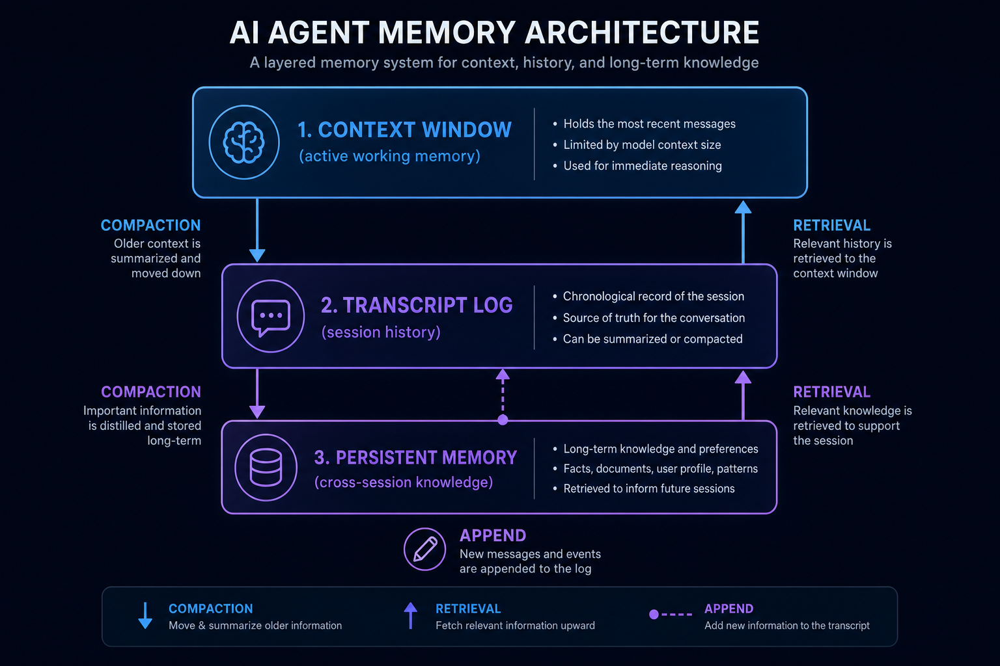

# 04｜上下文、会话与记忆：Agent 的脑容量不是 prompt 长度

很多人理解 agent 的“记忆”时，会把它等同于上下文窗口。

模型上下文越长，agent 记得越多；上下文不够，就换更长窗口的模型。

这个理解只对了一小部分。

真实 agent 的“记忆系统”至少分三层：

1. 当前模型调用能看到的 **Context Window**。
2. 当前会话完整发生过什么的 **Transcript Log**。
3. 跨会话沉淀下来的 **Persistent Memory**。

如果把这三层混在一起，agent 很快会出现问题：

- prompt 越来越大。
- 工具结果撑爆上下文。
- 历史细节丢失。
- 会话无法恢复。
- agent 不知道哪些信息是当前任务的，哪些是长期偏好。

所以生产级 harness agent 不能只依赖“大上下文模型”。它需要上下文治理。

---

## 1. Context Window 是工作台，不是数据库

Context Window 是模型当前这一次调用能看到的内容。

它适合放：

- 当前任务目标。
- 最近几轮对话。
- 必要的系统提示。
- 相关工具结果。
- 当前工作状态。

它不适合放：

- 全部历史日志。
- 所有工具完整输出。
- 所有文件内容。
- 所有长期记忆。

原因很简单：上下文窗口再大，也是有限资源。

而且上下文越大，成本越高，延迟越高，模型注意力越容易分散。

所以一个好的 harness 不应该问：

> 怎么把所有东西塞进 prompt？

而应该问：

> 这一轮模型真正需要看到什么？

这就是 ContextManager 的职责。

---

## 2. Transcript 是事实日志

Context Window 是工作台，Transcript 是账本。

它记录发生过什么：

- 用户输入。
- assistant 输出。
- tool_use。
- tool_result。
- 错误。
- session 事件。

Transcript 不一定每轮都完整塞给模型，但它应该尽量完整、可追溯、可审计。

为什么？

因为 agent 会遇到恢复场景：

- 进程重启。
- UI 刷新。
- worker 崩溃。
- 用户 resume 会话。
- 长任务中途被取消。

如果没有 transcript，你只能依赖当前内存里的 messages。一旦进程没了，历史就没了。

而 transcript 让系统能重新构造会话状态。

CodeShell 里 `Transcript` 负责 JSONL 事件日志，`toMessages()` 再派生出喂给 LLM 的 messages。这是一个关键分离：

> 存储格式不等于模型输入格式。

日志应该忠实记录事实；模型输入应该按当前窗口预算筛选和整理。

---

## 3. Session State 是恢复锚点

Transcript 记录事件，但 session 还需要状态。

例如：

- sessionId
- cwd
- model
- status
- turnCount
- token usage
- cost state
- compacted messages
- startedAt / updatedAt

这些状态让系统知道一个会话当前处于什么位置。

如果只有 transcript，每次恢复都要重新扫完整日志来推断所有状态。对于长会话，这会很慢，也容易出错。

所以 harness 通常需要：

- transcript：完整事实流。
- session state：当前恢复点。

这两者配合，才能支持可靠 resume。

---

## 4. Tool Result 是上下文爆炸的主要来源

Agent 和普通 chat 最大的区别，是工具结果会不断进入上下文。

一个 `Read` 可能返回几百行。

一个 `Grep` 可能返回几十个匹配。

一个 `Bash` 可能输出几千行日志。

一个网页抓取可能几十 KB。

如果每个工具结果都原样 append 到 messages，agent 很快就会把上下文撑爆。

所以 harness 需要工具结果预算策略：

- 小结果直接放进 context。
- 大结果截断。
- 超大结果落盘，context 里只保留引用。
- 对重复结果做 microcompact。
- 对长历史做 summary compact。

这不是锦上添花，而是长任务必需。

否则 agent 的最大轮数不是由任务决定，而是由上下文爆炸决定。

---

## 5. Compaction 不是简单截断

最粗糙的上下文管理是：超过长度就删最旧消息。

这能避免 API 报错，但会破坏任务连续性。

更好的 compaction 至少有三类：

### 1. Microcompact

删除或替换冗余、低价值、可恢复的信息。

例如重复工具结果、过长日志、已经摘要过的大输出。

### 2. LLM Summary

让模型把一段历史总结成更短的状态说明。

适合保留任务目标、重要决策、已完成步骤、未解决问题。

### 3. Window Compact

当上下文接近窗口上限时，主动重组 messages，保留最近关键轮次和必要摘要。

关键点是：compaction 应该尽量保持任务语义，而不是机械删 token。

如果 compaction 后模型不知道自己做过什么，它就会重复探索、误改文件或丢失目标。

---

## 6. Persistent Memory 不是 transcript 的替代品

跨会话记忆容易被滥用。

很多系统会把“记住用户偏好”和“记住所有历史”混在一起。

实际上 memory 应该更像长期知识库，而不是完整聊天记录。

适合进入 persistent memory 的内容包括：

- 用户长期偏好。
- 项目非显而易见事实。
- 已确认设计决策。
- 反复出现的工作流约束。
- 重要外部资源索引。

不适合进入 memory 的内容包括：

- 一次性中间日志。
- 临时任务细节。
- 未确认猜测。
- 敏感密钥。
- 大段工具输出。

CodeShell 把 memory 分成 user / dream 等 scope，就是在区分不同生命周期和权限边界。

长期记忆必须克制，否则它会污染未来任务。

---

## 7. 三层结构：工作台、账本、长期知识

可以把 agent 的状态系统理解成三层：

### Context Window：工作台

当前模型调用要用的材料。

特点：短期、有限、昂贵、要精挑细选。

### Transcript Log：账本

当前会话发生过的事实记录。

特点：完整、可追溯、可恢复、通常不全量进入模型。

### Persistent Memory：长期知识

跨会话复用的偏好、规则、项目事实。

特点：浓缩、长期、需要治理、不能乱写。

这三层都叫“记忆”，但职责完全不同。

Harness 的关键，是让它们互相配合，而不是互相替代。

---

## 8. 设计 checklist

如果你要做 agent 的上下文与记忆系统，可以按下面检查：

### Context Window

- 每轮模型调用前是否计算 token 预算？
- 工具结果是否可能撑爆窗口？
- 是否有上下文接近上限的提前处理？
- 是否区分系统提示、用户任务、工具结果、历史摘要？

### Transcript

- 是否记录 tool_use 和 tool_result？
- 是否支持从 transcript 派生 messages？
- 日志是否可审计？
- 会话恢复是否依赖 transcript？

### Session State

- 是否持久化 sessionId / cwd / model / status？
- 是否记录 turnCount 和 usage？
- 运行中断后能否知道上次停在哪里？

### Memory

- 是否区分临时信息和长期信息？
- 是否有 scope？
- 是否有写入权限边界？
- 是否避免把未确认猜测写入长期记忆？

### Compaction

- 是否只是截断？
- 是否能保留任务目标和关键决策？
- 是否能处理大工具输出？
- compaction 发生后是否通知模型？

---

## 9. 小结

Agent 的脑容量不是 prompt 长度。

真正决定 agent 能否长时间工作的，是状态分层能力。

- Context Window 决定当前能想什么。
- Transcript 决定过去发生过什么。
- Session State 决定能不能恢复。
- Persistent Memory 决定跨任务能沉淀什么。
- Compaction 决定长任务能不能继续跑。

下一篇，我们看 harness agent 的另一个关键设计：**协议与宿主解耦**。

因为一个好的 agent core，不应该只能活在一个 UI 里。