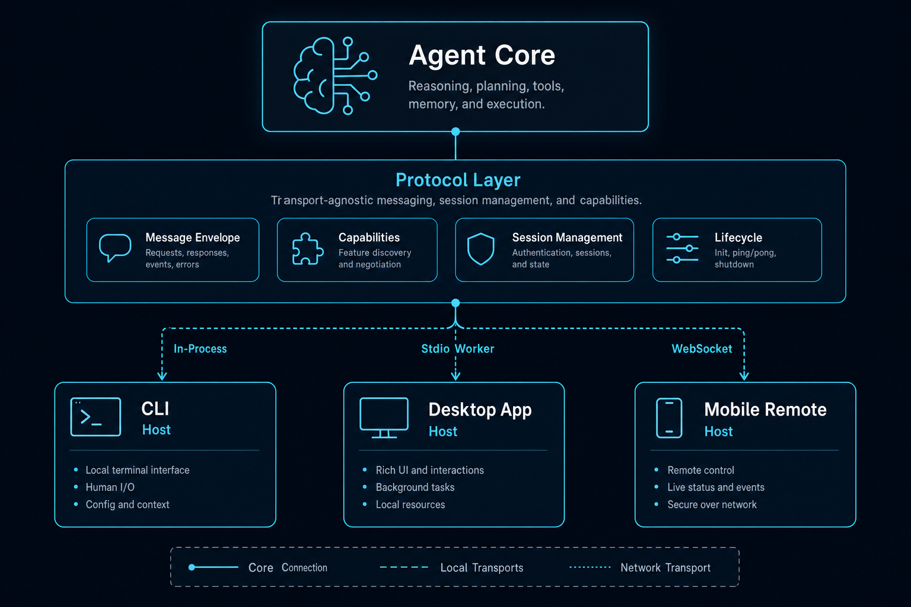

# 05｜协议与宿主：为什么 Core 不应该绑死在一个 UI 里

一个 agent harness 写到一定阶段，迟早会遇到宿主问题。

最开始你可能只有 CLI。

后来你想要桌面端。

再后来你想要手机远程控制、自动化任务、后台 agent、甚至外部进程驱动。

如果一开始把 agent core 和 UI 绑死，后面每加一个宿主，就会复制一套运行逻辑。

这会带来灾难：

- CLI 和 Desktop 行为不一致。
- 权限审批路径不一致。
- 工具事件格式不一致。
- 会话恢复逻辑不一致。
- bug 修一处漏一处。

所以生产级 harness agent 必须区分两件事：

- **Core**：负责运行 agent。
- **Host**：负责输入、展示、审批、通知、设备形态。

中间需要一层协议。

---

## 1. Core 不应该知道自己跑在哪里

一个好的 agent core 不应该关心：

- 当前是 CLI 还是 Desktop。
- UI 是 React、Ink 还是网页。
- 审批卡怎么长。
- stream event 怎么渲染。
- 用户是在本机还是手机上点批准。

Core 应该关心：

- 收到一个 run 请求。
- 找到 session。
- 调用 Engine。
- 发出 StreamEvent。
- 需要审批时发出 ApprovalRequest。
- 收到 approve/cancel/configure。

这就是 core 的职责边界。

如果 core 直接 import UI 组件，说明边界错了。

如果 UI 直接调用 TurnLoop，边界也错了。

---

## 2. Protocol 是 core 和 host 的契约

协议层要定义几类东西：

### 请求

- run
- approve
- cancel
- configure
- query
- inject
- closeSession

### 通知

- streamEvent
- approvalRequest
- status
- lifecycle

### 传输

- in-process
- stdio
- TCP
- WebSocket bridge

### 事件结构

- text_delta
- tool_use_start
- tool_result
- assistant_message
- turn_complete
- error
- task_update
- goal_progress

协议的价值是：host 只需要理解这套契约，不需要理解 Engine 内部。

这样 CLI、Desktop、Mobile 可以共享同一个 core。

---

## 3. CodeShell 的三种宿主接入方式

CodeShell 里有三种典型接入方式。

### TUI：进程内 transport

TUI 直接在本进程里创建：

`Engine → ChatSessionManager → AgentServer → createInProcessTransport → AgentClient → UI`

它适合终端交互。

优点是简单，低开销。

缺点是 core 和 UI 在同一进程，崩溃隔离较弱。

### Desktop：worker 子进程

Desktop 不让交互式 core 直接跑在 Electron main 里。

它通过：

`renderer → preload → ipcMain → AgentBridge → agent-server-stdio worker → core`

这种设计把 agent worker 和 UI 隔离开。

好处是：

- core 崩溃不会直接带崩 renderer。
- 长任务不会阻塞 Electron UI。
- main 只做 broker 和服务管理。
- renderer 不需要 import core runtime。

### Mobile Remote：复用 worker 链路

手机端并不另起一套 agent。

普通手机遥控路径是：

`mobile WebSocket → RemoteHostManager → handleMobileClientEvent → AgentBridge 注入 JSON-RPC line → worker/core`

也就是说，手机端 chat、approval、cancel 复用 Desktop 交互式 agent 的同一条 run/permission path。

这很重要。

如果手机端自己实现一套 agent runner，权限、会话、工具、日志都会分叉。

---

## 4. StreamEvent 是 UI 解耦的关键

如果 core 只返回最终文本，host 就无法展示 agent 过程。

但 agent 过程很重要：

- 用户要看到模型正在输出。
- 用户要看到工具开始执行。
- 用户要看到工具结果。
- 用户要看到审批请求。
- 用户要看到任务进度。
- 用户要看到错误和终止原因。

所以 core 需要发事件流。

TUI 可以把事件渲染成终端消息。

Desktop 可以把事件折叠成 React 卡片。

Mobile 可以把事件折叠成简化聊天流。

它们渲染不同，但消费同一种语义事件。

这就是 StreamEvent 的价值。

---

## 5. Approval 也必须走协议

审批是 agent harness 的关键交互。

如果模型要执行写文件、Bash、外部路径读取，系统可能需要问用户。

这个“问用户”不应该写死在 core 里。

core 应该发出 approval request。

host 决定怎么展示。

用户选择后，host 把 approve/deny 发回 core。

这样审批就可以发生在：

- TUI。
- Desktop。
- Mobile。
- RunManager resume。
- Headless automation policy。

而 ToolExecutor 只需要等待 ApprovalBackend 的结果。

---

## 6. 为什么 Desktop 要用 worker

Electron main 进程通常负责窗口、菜单、IPC、系统服务。

如果把 agent core 直接跑在 main 里，风险很大：

- 长模型流阻塞 main。
- 工具执行阻塞 main。
- 崩溃影响整个 app。
- 日志和状态难隔离。
- 多窗口共享状态更复杂。

所以 Desktop 更适合用 worker 子进程跑 core。

main 进程只负责：

- 派生 worker。
- 转发 renderer 消息。
- 读取 worker stdout。
- 维护 snapshot。
- 广播事件。
- 管理移动遥控、自动化等服务。

这也是 harness host 设计的一个原则：

> UI 进程不要直接承担 agent runtime 的复杂性。

---

## 7. 例外：Automation 可以有不同宿主策略

需要注意的是，宿主解耦不代表所有运行都必须走同一物理进程。

CodeShell Desktop 的交互式聊天走 worker。

但当前 Desktop automation 生产路径是在 Electron main 中创建 one-shot headless Engine 执行。

这是一个宿主策略选择：

- 交互式聊天需要长连接、stream、审批、worker 隔离。
- 自动化任务需要定时、无头、按 job cwd 执行、禁用 cron 工具和后台 shell。

二者都复用 core，但接入方式不同。

所以文档里说“Desktop 不把 core 跑在主进程”时，要加限定：交互式聊天不跑在 main；automation 当前是例外。

这类例外说明协议设计不能只看理想架构，也要看运行场景。

---

## 8. 设计 checklist

如果你要设计自己的 agent core / host 协议，可以按这张表检查。

### Core 边界

- core 是否不依赖具体 UI？
- host 是否不直接调用 TurnLoop？
- run / approve / cancel 是否都是协议请求？
- stream event 是否是统一语义结构？

### Transport

- 是否支持进程内调用？
- 是否支持 stdio worker？
- 是否需要 TCP / WebSocket？
- transport 是否只传协议，不夹杂 UI 语义？

### Session

- 每个事件是否带 sessionId？
- 多会话是否隔离？
- worker 重启后是否能恢复 snapshot？
- host 是否能重放历史事件？

### Approval

- 审批请求是否能跨宿主传递？
- 手机审批是否回到同一条 permission path？
- 无头运行是否有明确策略？

### Failure

- worker 崩溃时 host 是否知道？
- pending request 是否会被 reject？
- cancel 在 worker 已退出时如何处理？
- UI 是否能清理 busy 状态？

---

## 9. 小结

Agent harness 不应该只服务一个 UI。

真正可扩展的设计，是让 core 和 host 通过协议连接：

- Core 负责运行。
- Protocol 负责契约。
- Host 负责交互。
- Transport 负责连接。

这样你才能同时拥有 CLI、Desktop、Mobile Remote、Automation，而不是维护四套 agent。

下一篇，我们把前面所有内容收束成一张设计清单：如果你要从零做一个 harness agent，哪些是 MVP，哪些是生产级必须，哪些是高级能力。