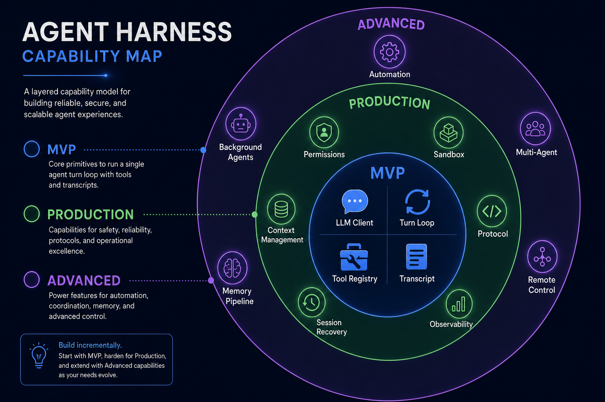

# 06｜从 CodeShell core 抽象出 Harness Agent 设计清单

前五篇我们拆了一个 harness agent 的核心部件：

- 为什么 LLM call 不等于 agent。
- 为什么需要 Turn Loop。
- 为什么工具系统必须被约束。
- 为什么上下文、会话、记忆要分层。
- 为什么 core 和 host 要通过协议解耦。

这一篇做收束。

如果你要自己设计一个 agent harness，最小必要元素是什么？哪些是生产级必须？哪些是高级能力？

我们可以把它分成三层：

1. **MVP**：能跑起来。
2. **Production**：能安全、稳定、可恢复地跑。
3. **Advanced**：能自动化、多代理、远程控制、长期演进。

---

## 1. MVP：先让 agent 真的跑起来

MVP 不是 demo。

MVP 的意思是：它还不完整，但核心闭环是真的。

一个 harness agent 的 MVP 至少需要这些部件。

### 1. LLM Client

负责调用模型。

最小能力：

- 发送 messages。
- 接收文本。
- 接收 tool calls。
- 返回 stop reason。

如果一开始只支持一个 provider 没问题，但要避免把 provider 格式泄漏到整个系统。

### 2. Message Model

你需要一套内部消息结构。

它要能表达：

- user message
- assistant text
- tool_use
- tool_result
- system / developer instructions

不要让所有模块直接依赖 provider 原生 message 格式。

否则未来接第二个 provider 时会非常痛苦。

### 3. Turn Loop

MVP 必须有 loop。

最小 loop 是：

1. 调模型。
2. 如果没有工具调用，结束。
3. 如果有工具调用，执行工具。
4. 把结果追加进 messages。
5. 回到第 1 步。

没有 loop，就只是一次 LLM call。

### 4. Tool Registry

工具必须注册，而不是散落在 if/else 里。

每个工具至少要有：

- name
- description
- input schema
- execute function

MVP 可以先不做复杂权限，但 registry 边界必须有。

### 5. Tool Executor

Tool Executor 是工具调用的统一入口。

即使 MVP 阶段，它也应该负责：

- 查工具是否存在。
- 校验参数。
- 执行工具。
- 把异常转成 tool_result。

不要让 Turn Loop 直接调用工具函数。

### 6. Transcript

MVP 也应该记录 transcript。

否则你无法回答：

- agent 到底做了什么？
- 哪个工具失败了？
- 为什么最后得出这个结果？

哪怕只是 JSONL，也比只存在内存里强很多。

---

## 2. Production：让 agent 能被用户信任

MVP 能跑，但还不能放心交给用户。

生产级 harness 需要解决四类问题：安全、恢复、上下文、观测。

### 1. Permission System

工具执行必须有权限策略。

至少要有：

- allow
- ask
- deny
- permission mode
- approval backend

用户必须知道 agent 什么时候要做危险操作，并能拦住它。

### 2. Sandbox

尤其是 Bash。

如果你的 agent 能运行 shell，最好不要只靠“模型应该听话”。

需要沙箱或至少明确的隔离策略。

权限决定是否执行，沙箱限制执行范围。

### 3. Path Policy

文件工具必须知道 workspace 边界。

否则 agent 很容易读写项目外路径。

生产级文件工具要处理：

- 绝对路径。
- 相对路径。
- symlink。
- 敏感目录。
- 外部目录审批。

### 4. Context Management

长任务一定会遇到上下文问题。

生产级 harness 需要：

- token 预算。
- 大工具结果处理。
- compaction。
- summary。
- 上下文恢复。

不要把“换更大上下文模型”当成唯一方案。

### 5. Session Recovery

用户会关闭窗口，进程会崩，任务会中断。

所以需要：

- sessionId
- session state
- transcript
- resume
- terminal reason
- running / completed / error 状态

没有恢复能力，agent 只能做短任务。

### 6. Protocol Layer

如果你希望 agent 不只跑在一个 UI 里，就需要协议层。

至少定义：

- run
- approve
- cancel
- stream event
- status
- error

这让 CLI、Desktop、Remote 可以共用 core。

### 7. Observability

Agent 是长过程系统。

用户和开发者都需要看到过程。

所以生产级 harness 要有：

- stream event
- tool logs
- session logs
- cost / token usage
- error reason
- debug trace

否则失败时只能猜。

---

## 3. Advanced：当 agent 变成平台

当 MVP 和 Production 都稳定后，agent harness 会自然走向平台化。

这时候可以加高级能力。

### 1. Automation

让 agent 按计划运行。

例如：

- 每天总结新闻。
- 定时检查仓库。
- 定期生成报告。

自动化的关键不是 cron，而是无头权限策略。

因为没有人在场审批，所以必须默认保守。

### 2. Background Agents

长任务不应该阻塞主会话。

后台子代理可以执行独立研究、扫描、生成，然后完成后把结果通知主 agent。

这里需要：

- agent registry
- background notification queue
- session attribution
- cancellation
- result summarization

### 3. Memory Pipeline

长期使用后，agent 需要沉淀经验。

但 memory 不能乱写。

高级 memory pipeline 应该包括：

- 抽取。
- 总结。
- 去重。
- scope 管理。
- 权限控制。
- 过期或删除机制。

### 4. Plugin / Skill System

当能力越来越多，不能每个能力都写进 core。

需要扩展系统：

- skills
- hooks
- MCP servers
- custom agents
- commands

但扩展系统必须接入统一权限和工具管线。

插件不能绕过 harness。

### 5. Multi-agent / Arena

多模型、多代理协作适合评审、规划、辩论、研究。

它不是 MVP 必需，但对复杂决策很有价值。

关键是证据结构和裁决机制，而不是简单“让多个模型聊天”。

### 6. Remote Control

当 agent 能跑长任务后，用户会希望远程查看和审批。

这需要：

- 手机端连接。
- 设备配对。
- 权限隔离。
- WS 事件流。
- 审批回传。

Remote 不应该另起一套 agent，而应该复用 core 的协议。

---

## 4. CodeShell core 的能力分层

用 CodeShell core 对应这三层，大致可以这样看。

### MVP 对应

- `Engine`
- `TurnLoop`
- `ModelFacade`
- `ToolRegistry`
- `ToolExecutor`
- `Transcript`

这些让 agent 能跑起来。

### Production 对应

- `PermissionClassifier`
- `ApprovalBackend`
- `PathPolicy`
- `Sandbox`
- `ContextManager`
- `SessionManager`
- `AgentClient / AgentServer / Transport`
- `StreamEvent`
- `Logging`

这些让 agent 可以被用户信任。

### Advanced 对应

- `Automation`
- `RunManager`
- `Background Agent`
- `MemoryOrchestrator`
- `Hooks`
- `Plugins`
- `Skills`
- `MCPManager`
- `Arena`
- `Mobile Remote`

这些让 agent 从工具变成平台。

---

## 5. 一张 Harness Agent 总 checklist

如果你要从零设计一个 harness agent，可以按下面顺序做。

### 第一阶段：最小闭环

- [ ] 定义内部 Message 类型。
- [ ] 封装 LLM client。
- [ ] 实现 Turn Loop。
- [ ] 支持 tool_use / tool_result。
- [ ] 实现 Tool Registry。
- [ ] 实现 Tool Executor。
- [ ] 写 transcript log。

### 第二阶段：安全边界

- [ ] 加 schema validation。
- [ ] 加 permission classifier。
- [ ] 加 approval backend。
- [ ] 加 path policy。
- [ ] 给 Bash 加风险分类。
- [ ] 加 sandbox 或明确禁用策略。
- [ ] 限制无头运行权限。

### 第三阶段：长任务能力

- [ ] 加 session state。
- [ ] 支持 resume。
- [ ] 加 context manager。
- [ ] 加 tool result storage。
- [ ] 加 compaction。
- [ ] 加 terminal reason。
- [ ] 支持 cancel / abort。

### 第四阶段：宿主解耦

- [ ] 定义协议方法。
- [ ] 定义 StreamEvent。
- [ ] 实现 AgentServer。
- [ ] 实现 AgentClient。
- [ ] 支持至少一种 transport。
- [ ] UI 只消费协议，不直接调用 TurnLoop。

### 第五阶段：平台化

- [ ] 支持 hooks。
- [ ] 支持 MCP。
- [ ] 支持 plugins / skills。
- [ ] 支持 automation。
- [ ] 支持 background agent。
- [ ] 支持 memory pipeline。
- [ ] 支持 remote control。

---

## 6. 常见架构误区

### 误区 1：先堆工具，再补权限

这很危险。

工具越多，权限越难补。

更好的顺序是：先有统一 executor，再往里加工具。

### 误区 2：把上下文管理交给模型自己

模型不知道系统预算，也不知道哪些内容可从 transcript 恢复。

上下文管理必须在 harness 层做。

### 误区 3：UI 直接调用核心循环

这会让 CLI、Desktop、Remote 复制逻辑。

正确做法是通过协议连接。

### 误区 4：把 memory 当聊天记录

长期记忆应该是萃取后的知识，不是历史原文堆积。

### 误区 5：无头自动化沿用交互权限

自动化没有人在场，权限必须更保守。

---

## 7. 结尾：Agent Harness 是模型时代的运行时

如果说 LLM 是推理内核，那么 Agent Harness 就是运行时。

它负责把一次次模型预测变成可控的任务执行。

一个好的 harness 不只是让模型“能调用工具”，而是让模型在真实环境里：

- 有状态。
- 有边界。
- 有权限。
- 有恢复。
- 有观测。
- 有扩展。

这也是为什么我们不能只讨论 prompt、模型和工具列表。

真正决定 agent 系统质量的，是模型外面的 harness。

读完这个系列，你应该能做两件事：

1. 看懂一个 agent 框架是不是有完整运行时。
2. 自己设计一个从 MVP 到 Production 再到 Advanced 的 harness agent 架构。

如果只记住一句话，可以是这句：

> Agent 不是会调用工具的 LLM；Agent 是被 harness 管住的运行系统。