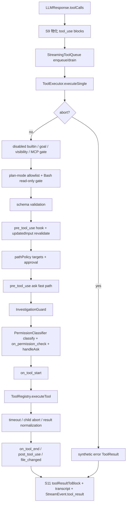

# Tool System 工具执行与权限契约深度剖析

本文补齐 core 三大块中 tool-system 的深度对称性：`06-turn-loop-state-machine.md` 已把工具阶段放在 S9/S10/S11/S12，`09-protocol-event-and-session-contract.md` 已把事件与 session envelope 写清；本文只聚焦一次工具调用进入 `packages/core/src/tool-system/` 后的执行、权限、路径、sandbox 契约。

范围：只读 `packages/core/src/tool-system/**`、必要的 `engine/turn-loop.ts`、`engine/engine.ts`、`protocol/server.ts`、`runtime/safe-spawn.ts` / `spawn-common.ts`。不覆盖 tui/cdp/mobile。既有 finding 沿用 `03-optimization-findings.md` 的 F 编号；本轮新增从 N-06 起。

## 1. 一次工具调用的完整执行管线

### 1.1 管线图

### 1.2 顺序关卡表

| # | 关卡 | 做什么 | 通过走向 | 拒绝/异常走向 | 代码锚点 |
|---|---|---|---|---|
| 1 | TurnLoop 物化工具调用 | 截断到 `maxToolCallsPerTurn`，构造 assistant `tool_use` block，补发未流式出现的 `tool_use_start`，写 transcript。 | 进入 `StreamingToolQueue`。 | 超出 cap 的调用不执行，后续给模型追加 reminder。 | `packages/core/src/engine/turn-loop.ts:985`、`packages/core/src/engine/turn-loop.ts:998`、`packages/core/src/engine/turn-loop.ts:1006`、`packages/core/src/engine/turn-loop.ts:1010` |
| 2 | 队列分发 | `isConcurrencySafe` 工具立即开始，unsafe 工具等 `drain()` 串行；结果最终按 enqueue 顺序返回。 | 调 `ToolExecutor.executeSingle()`。 | promise rejection 被转成 synthetic error `ToolResult`，不让一个工具丢掉整批结果。 | `packages/core/src/engine/turn-loop.ts:1014`、`packages/core/src/engine/streaming-tool-queue.ts:33`、`packages/core/src/engine/streaming-tool-queue.ts:62`、`packages/core/src/engine/streaming-tool-queue.ts:85` |
| 3 | abort fast-path | run signal 已取消时，在任何 hook、权限、handler 前返回错误结果。 | 未 abort 继续。 | 返回 `Tool aborted before execution`，仍回填给模型。 | `packages/core/src/tool-system/executor.ts:123`、`packages/core/src/tool-system/executor.ts:131` |
| 4 | capability / runtime visibility | 拒绝项目 `capabilityOverrides.builtin.off` 的 builtin、goal-only 工具、builtin guard 当前不可用工具、非本 session MCP server。 | 继续 plan gate。 | 返回 error `ToolResult`，handler 不运行。 | `packages/core/src/tool-system/executor.ts:139`、`packages/core/src/tool-system/executor.ts:153`、`packages/core/src/tool-system/executor.ts:164`、`packages/core/src/tool-system/executor.ts:176` |
| 5 | plan-mode allowlist | plan mode 只允许 `PLAN_MODE_ALLOWED_TOOLS`；`Bash` 虽可见，但命令必须被 `classifyBashCommand()` 判为 `safe-read`。 | 继续 schema validation。 | 返回 plan-mode blocked error。 | `packages/core/src/tool-system/executor.ts:219`、`packages/core/src/tool-system/executor.ts:228`、`packages/core/src/tool-system/executor.ts:234`、`packages/core/src/tool-system/plan-mode-allowlist.ts:1` |
| 6 | registry 查找 / schema validation | 取 `RegisteredTool.inputSchema`，做轻量 required 和顶层 primitive type 校验。未知工具此处不会失败，留到 registry execute。 | 继续 pre hook。 | 返回 `Invalid input` error。 | `packages/core/src/tool-system/executor.ts:250`、`packages/core/src/tool-system/validation.ts:16` |
| 7 | `pre_tool_use` hook | 按 priority 跑 hook；deny 可短路；`updatedInput` 可改 args，并重新 schema validation。HookRegistry 内部聚合时 deny > ask > allow。 | 继续 path-policy。 | deny 返回 `Blocked by pre_tool_use hook`；rewrite 后 schema 不合格返回 error。 | `packages/core/src/tool-system/executor.ts:264`、`packages/core/src/tool-system/executor.ts:270`、`packages/core/src/tool-system/executor.ts:282`、`packages/core/src/hooks/registry.ts:78`、`packages/core/src/hooks/registry.ts:95` |
| 8 | path-policy target 解析 | 根据 `RegisteredTool.pathPolicy` 找文件目标：单 string 路径、array 路径、`defaultToCwd`、或 `apply_patch` hunks / move target；相对路径按 `ctx.cwd` resolve。 | 每个 target 进入路径审批。 | patch parse error 直接返回 error。 | `packages/core/src/tool-system/executor.ts:563`、`packages/core/src/tool-system/executor.ts:586`、`packages/core/src/tool-system/executor.ts:605`、`packages/core/src/tool-system/executor.ts:617` |
| 9 | path-policy 判定 / 审批 | `classifyPath()` 先 tilde/realpath，再敏感目录/文件，再 workspace；敏感写 deny，敏感读 ask，工作区内非敏感 allow，工作区外 ask。 | allow 或审批通过后继续。 | deny / 无 UI / 用户拒绝返回 error；plan-mode 写路径也拒绝。 | `packages/core/src/tool-system/path-policy.ts:474`、`packages/core/src/tool-system/path-policy.ts:503`、`packages/core/src/tool-system/path-policy.ts:527`、`packages/core/src/tool-system/path-policy.ts:582`、`packages/core/src/tool-system/path-policy.ts:600` |
| 10 | `pre_tool_use: ask` | 若 pre hook 返回 ask，直接走 `permission.handleAsk()`，把 hook reason 展示给用户。 | 用户批准后跳过 classifier，进入 guard。 | 用户拒绝返回 `Tool call denied by user`。这是既有 F-06 的核心顺序风险。 | `packages/core/src/tool-system/executor.ts:329`、`packages/core/src/tool-system/executor.ts:334`、`packages/core/src/tool-system/executor.ts:366`、`docs/archive/review-2026-07-09/03-optimization-findings.md:65` |
| 11 | InvestigationGuard | 对重复 Read/Grep/Glob 和连续只读调查做提醒或阻断；headless/read-only-review 下偏软提醒。 | 继续权限 classifier；成功结果可被 prepend reminder。 | hard block 返回 error result。 | `packages/core/src/tool-system/executor.ts:352`、`packages/core/src/tool-system/investigation-guard.ts:68`、`packages/core/src/tool-system/investigation-guard.ts:90`、`packages/core/src/tool-system/executor.ts:486` |
| 12 | permission classifier | `classify()`：`bypassPermissions` allow；显式规则；Bash 安全分类；默认 mode fallback。随后 `on_permission_check` 只能收紧或让用户决定，不能把 classifier 的 ask/deny 升成 allow。 | allow 或 ask 通过后继续。 | deny 返回 `Permission denied`；ask 被拒返回 `Permission denied by user`。 | `packages/core/src/tool-system/executor.ts:366`、`packages/core/src/tool-system/permission.ts:926`、`packages/core/src/tool-system/executor.ts:381`、`packages/core/src/tool-system/executor.ts:388`、`packages/core/src/tool-system/executor.ts:417` |
| 13 | `on_tool_start` | 工具实际执行前的生命周期 hook。 | 进入 registry execution。 | HookRegistry 捕获 hook handler 异常，不让 hook crash 主链。 | `packages/core/src/tool-system/executor.ts:433`、`packages/core/src/hooks/registry.ts:124` |
| 14 | ToolRegistry execute | 查 `tools` 和 executor；创建 per-call child AbortController；设置 timeout；把 child signal 注入 args 和 `ToolContext`。 | handler 返回后规整。 | unknown tool 抛 `ToolNotFoundError`，Executor 转 error result；handler 其它异常在 registry 内转 error `ToolResult`。 | `packages/core/src/tool-system/executor.ts:456`、`packages/core/src/tool-system/registry.ts:85`、`packages/core/src/tool-system/registry.ts:90`、`packages/core/src/tool-system/registry.ts:117`、`packages/core/src/tool-system/executor.ts:473` |
| 15 | 结果规整 / 有限包装 | string、`contentBlocks`、`sandbox` 统一成 `ToolResult`；timeout/abort/handler error 也规整为 error result。MCP 输出额外包 `<mcp-result trust="untrusted">`，但 executor 没有通用 redact 阶段。 | 回到 Executor post hooks。 | 无 executor handler 时 registry 返回 error result。 | `packages/core/src/tool-system/registry.ts:151`、`packages/core/src/tool-system/registry.ts:156`、`packages/core/src/tool-system/registry.ts:170`、`packages/core/src/tool-system/mcp-manager.ts:242` |
| 16 | post hooks / file_changed | 发 `on_tool_end`；`post_tool_use.additionalContext` 可附加到成功结果；Write/Edit 成功后发 `file_changed`。 | 返回 `ToolResult` 给 queue。 | post hook 异常由 HookRegistry 捕获。 | `packages/core/src/tool-system/executor.ts:507`、`packages/core/src/tool-system/executor.ts:516`、`packages/core/src/tool-system/executor.ts:527`、`packages/core/src/tool-system/executor.ts:540` |
| 17 | tool_result 回填 | TurnLoop 把每个结果转 `ContentBlock.tool_result`，保留 `is_error`；写 transcript；发 `StreamEvent.tool_result`；异步发 `tool_summary`。 | 进入 S12 工具后续跑判定。 | summary 失败只 warn，不影响主链。 | `packages/core/src/engine/turn-loop.ts:177`、`packages/core/src/engine/turn-loop.ts:1021`、`packages/core/src/engine/turn-loop.ts:1034`、`packages/core/src/engine/turn-loop.ts:1037`、`packages/core/src/engine/turn-loop.ts:1061` |

关键校正：`ToolExecutor.resultsToMessages()` 不是当前 TurnLoop 主链路；主链路使用 `toolResultToBlock()`。`resultsToMessages()` 仍在 `executor.ts` 中保留，但本轮 `rg` 未发现源码调用，仅旧架构文档引用，见本文件 N-09。

## 2. 权限判定模型

### 2.1 权限输入

`PermissionClassifier` 的直接输入只有 `toolName`、`args`、`rules`、`defaultMode`、`approvalBackend`，不拿 `ToolRegistry`，也不读取 `RegisteredTool.permissionDefault`，见 `packages/core/src/tool-system/permission.ts:901`、`packages/core/src/tool-system/permission.ts:926`。一次 run 开始时 Engine 构建这些输入：

- 规则来源：preset 默认规则、Memory dream-scope 规则、mode 派生规则、settings `permissions.rules`；settings 规则被 unshift 到前面，见 `packages/core/src/engine/engine.ts:3035`、`packages/core/src/engine/engine.ts:3042`、`packages/core/src/engine/engine.ts:3055`、`packages/core/src/engine/engine.ts:3063`。
- backend 来源：显式 `config.approvalBackend`；`auto` 包一层 `AutoApprovalBackend`；否则若全局 interactive backend 已有 promptFn 就用 interactive；没有 UI 时用 headless deny-all，见 `packages/core/src/engine/engine.ts:3077`、`packages/core/src/engine/engine.ts:3083`、`packages/core/src/engine/engine.ts:3092`。
- live reconfigure：permission pill / plan-mode 变化会原地重配同一个 classifier，见 `packages/core/src/engine/engine.ts:3114`、`packages/core/src/protocol/chat-session-manager.ts:53`。

### 2.2 `classify()` 顺序

1. `bypassPermissions` 直接 allow。  
   代码：`packages/core/src/tool-system/permission.ts:927`。

2. 显式规则 first-match wins。规则可来自 settings、preset、mode 派生或 interactive project approval 回灌。  
   代码：`packages/core/src/tool-system/permission.ts:930`、`packages/core/src/tool-system/permission.ts:1049`。

3. Bash 特判：`classifyBashCommand()` 扫描 dangerous pattern、shell metacharacter、pipe、redirection、敏感读降级。`safe-read` allow；`safe-write` 只在 `acceptEdits` / `auto` allow；unsafe/dangerous ask。  
   代码：`packages/core/src/tool-system/permission.ts:937`、`packages/core/src/tool-system/permission.ts:796`、`packages/core/src/tool-system/permission.ts:603`。

4. mode fallback：`dontAsk` deny；`acceptEdits` 只 allow `ACCEPT_EDITS_ALLOWLIST`；其它 ask。  
   代码：`packages/core/src/tool-system/permission.ts:951`、`packages/core/src/tool-system/permission.ts:884`。

`classify()` 只返回 allow/ask/deny；真正弹 UI 在 `handleAsk()`。

### 2.3 `handleAsk()` 顺序

1. `dontAsk` fast-deny；`bypassPermissions` fast-allow。  
   代码：`packages/core/src/tool-system/permission.ts:972`、`packages/core/src/tool-system/permission.ts:980`。

2. DenialTracker 超阈值自动 deny。  
   代码：`packages/core/src/tool-system/permission.ts:989`、`packages/core/src/tool-system/permission.ts:828`。

3. `assessRisk()` 计算 low/medium/high：Bash dangerous high，Write/Edit/Bash medium，`READ_ONLY_TOOLS` low，其它 medium。  
   代码：`packages/core/src/tool-system/permission.ts:999`、`packages/core/src/tool-system/permission.ts:1065`。

4. 调用 `approvalBackend.requestApproval()`，并把 `opts.sessionId` 放进 `ApprovalRequest`。  
   代码：`packages/core/src/tool-system/permission.ts:1011`、`packages/core/src/tool-system/executor.ts:419`。

5. 根据结果更新 denial tracker，返回 boolean 给 executor。  
   代码：`packages/core/src/tool-system/permission.ts:1023`、`packages/core/src/tool-system/permission.ts:1038`。

### 2.4 三种 ApprovalBackend

- `HeadlessApprovalBackend`：`approve-all` 全 allow，`deny-all` 全 deny，`approve-read-only` 只 allow `READ_ONLY_TOOLS`。  
  代码：`packages/core/src/tool-system/permission.ts:28`。

- `AutoApprovalBackend`：low risk 直接 allow；high risk 有 delegate 则交互，否则 deny；safe Write/Edit 扩展名和 safe Bash allow；其它 medium 有 delegate 则交互，否则 deny。  
  代码：`packages/core/src/tool-system/permission.ts:51`、`packages/core/src/tool-system/permission.ts:55`、`packages/core/src/tool-system/permission.ts:64`、`packages/core/src/tool-system/permission.ts:75`、`packages/core/src/tool-system/permission.ts:84`。

- `InteractiveApprovalBackend`：先查 session allow/deny rules；没有 promptFn 则 deny；用 `promptTurn` 串行化并在轮到自己后重新查 cache；用户选 session/project 时写 session arrays 或 project settings。  
  代码：`packages/core/src/tool-system/permission.ts:136`、`packages/core/src/tool-system/permission.ts:191`、`packages/core/src/tool-system/permission.ts:204`、`packages/core/src/tool-system/permission.ts:217`、`packages/core/src/tool-system/permission.ts:244`、`packages/core/src/tool-system/permission.ts:261`。

### 2.5 session 归属现状：审批请求已隔离，权限缓存未隔离

以当前代码为准，工具审批 / AskUserQuestion 的 pending request 路由已经按 session 隔离：

- `ChatSession` 有自己的 `pendingApprovals` map，见 `packages/core/src/protocol/chat-session.ts:43`。
- 多会话 `agent/approve` 必须带 `sessionId` 才会查 session map；找不到 session/requestId 直接失败，不回退 legacy 全局 map，见 `packages/core/src/protocol/server.ts:655`、`packages/core/src/protocol/server.ts:671`、`packages/core/src/protocol/server.ts:682`。
- 工具权限 prompt 通过 `ApprovalRequest.sessionId` 路由到 session map，见 `packages/core/src/protocol/server.ts:1908`、`packages/core/src/protocol/server.ts:1919`。
- `AskUserQuestion` 在 chatManager path 用 `requestAskUserForSession()`，notification 带 sessionId，resolve 存在对应 session map；cancel 会 drain pending approvals，见 `packages/core/src/protocol/server.ts:463`、`packages/core/src/protocol/server.ts:1952`、`packages/core/src/protocol/server.ts:1981`、`packages/core/src/protocol/server.ts:735`、`packages/core/src/protocol/server.ts:2351`。

但 `InteractiveApprovalBackend` 的“session 级缓存”不是按 `sessionId` 分桶：

- backend 是进程级 singleton，见 `packages/core/src/tool-system/permission.ts:499`、`packages/core/src/tool-system/permission.ts:502`。
- `sessionAllowRules` / `sessionDenyRules` 是 backend 实例字段，不带 sessionId key，见 `packages/core/src/tool-system/permission.ts:136`、`packages/core/src/tool-system/permission.ts:142`。
- `requestApproval()` / `checkSessionRules()` 没有读取 `ApprovalRequest.sessionId`，见 `packages/core/src/tool-system/permission.ts:191`、`packages/core/src/tool-system/permission.ts:219`。

结论：历史 AskUserQuestion 跨会话串投在 request/response 路由层已有防线；但权限“本会话一直允许/拒绝”的缓存当前实际是进程级 interactive backend 缓存。这个缺口作为 N-06 记录。

## 3. path-policy 路径安全

### 3.1 路径参数如何被识别

路径识别从注册元数据开始，而不是靠每个 handler 自觉调用：

- `RegisteredTool.pathPolicy` 支持 `kind:"arg"` 和 `kind:"apply_patch"`；`operation` 可以固定 read/write，也可以从其它 arg 映射，见 `packages/core/src/types.ts:81`、`packages/core/src/types.ts:95`。
- registry 注册 builtin / MCP tool 时调用 `validateToolMetadata()`，确保 `pathPolicy.arg` 在 inputSchema 里存在，避免拼错后保护 no-op，见 `packages/core/src/tool-system/registry.ts:48`、`packages/core/src/tool-system/validate-tool-metadata.ts:44`。
- Read/Write/Edit/ApplyPatch/Glob/Grep/ViewImage/GenerateImage/GenerateVideo 等都在 `builtin/index.ts` 声明 pathPolicy，见 `packages/core/src/tool-system/builtin/index.ts:161`、`packages/core/src/tool-system/builtin/index.ts:172`、`packages/core/src/tool-system/builtin/index.ts:193`、`packages/core/src/tool-system/builtin/index.ts:223`、`packages/core/src/tool-system/builtin/index.ts:241`、`packages/core/src/tool-system/builtin/index.ts:253`、`packages/core/src/tool-system/builtin/index.ts:263`。

执行期 target 解析：

- 单 string arg：非空 string，绝对路径原样，相对路径按 `ctx.cwd` resolve。  
  代码：`packages/core/src/tool-system/executor.ts:586`、`packages/core/src/tool-system/executor.ts:594`。

- array arg：过滤非 string/空值，跳过 http(s) URL，对每个本地路径按 `ctx.cwd` resolve。  
  代码：`packages/core/src/tool-system/executor.ts:597`、`packages/core/src/tool-system/executor.ts:605`、`packages/core/src/tool-system/executor.ts:609`。

- `defaultToCwd`：arg 为空时用当前 workspace。  
  代码：`packages/core/src/tool-system/executor.ts:613`。

- apply_patch：用 patch parser 解析 hunks，每个 path 和 movePath 都按 `ctx.cwd` resolve。  
  代码：`packages/core/src/tool-system/executor.ts:617`、`packages/core/src/tool-system/executor.ts:623`。

- operation 映射：固定 read/write 直接返回；`fromArg` 会把参数值映射到 readValues/writeValues，否则用 default。  
  代码：`packages/core/src/tool-system/executor.ts:551`。

### 3.2 越界与敏感文件判定

`classifyPath()` 的顺序：

1. 空路径 deny；`CODESHELL_PATH_POLICY=off|0|false` 时全 allow 并警告一次。  
   代码：`packages/core/src/tool-system/path-policy.ts:474`、`packages/core/src/tool-system/path-policy.ts:479`。

2. 展开 `~`，对目标路径和 workspace 做 best-effort realpath。不存在的待写文件会 realpath 最近存在祖先后再拼回，避免 `/var`/`/private/var` 这类 symlink 误判。  
   代码：`packages/core/src/tool-system/path-policy.ts:386`、`packages/core/src/tool-system/path-policy.ts:494`。

3. 敏感目录和敏感文件匹配。目录包括 `~/.ssh`、`~/.aws`、`~/.code-shell` 等；文件包括 `.env*`、private key、credential/token 数据文件、`.npmrc` 等。  
   代码：`packages/core/src/tool-system/path-policy.ts:77`、`packages/core/src/tool-system/path-policy.ts:97`、`packages/core/src/tool-system/path-policy.ts:422`、`packages/core/src/tool-system/path-policy.ts:435`。

4. 敏感优先于 workspace：敏感写 deny，敏感读 ask；少数 CodeShell diagnostic read 允许。  
   代码：`packages/core/src/tool-system/path-policy.ts:503`、`packages/core/src/tool-system/path-policy.ts:506`、`packages/core/src/tool-system/path-policy.ts:513`、`packages/core/src/tool-system/path-policy.ts:520`。

5. 非敏感且在 workspace 内 allow；非敏感但在 workspace 外 ask。  
   代码：`packages/core/src/tool-system/path-policy.ts:527`、`packages/core/src/tool-system/path-policy.ts:531`。

### 3.3 审批与记忆

`enforcePathPolicyWithApproval()` 是 ToolExecutor 主链路使用的版本：

- 无 `ctx.cwd` 时跳过，兼容非 LLM 直接调用；`permissionMode === "bypassPermissions"` 也跳过整个 path layer。  
  代码：`packages/core/src/tool-system/path-policy.ts:582`、`packages/core/src/tool-system/path-policy.ts:587`、`packages/core/src/tool-system/path-policy.ts:588`。

- deny 直接返回 error；write + planMode 即便 classify 是 ask，也拒绝。  
  代码：`packages/core/src/tool-system/path-policy.ts:595`、`packages/core/src/tool-system/path-policy.ts:597`、`packages/core/src/tool-system/path-policy.ts:600`。

- 审批记忆按目录 prefix + operation 存储：write grant 覆盖 read/write，read grant 只覆盖 read。session grants 存内存、按 sessionId 分桶；project grants 写 `.code-shell/settings.local.json` 的 `pathApprovals`。  
  代码：`packages/core/src/tool-system/path-policy.ts:173`、`packages/core/src/tool-system/path-policy.ts:183`、`packages/core/src/tool-system/path-policy.ts:260`、`packages/core/src/tool-system/path-policy.ts:288`。

- 并发 ask 以 `sessionId` 为 key 串行化，轮到自己后重新查 grant，避免同目录并发工具弹多张卡。  
  代码：`packages/core/src/tool-system/path-policy.ts:618`、`packages/core/src/tool-system/path-policy.ts:623`、`packages/core/src/tool-system/path-policy.ts:630`。

- UI 选项是闭集：允许本次、目录本会话允许、目录本项目允许、拒绝；`optionsOnly` 避免 free-text 隐式 deny。  
  代码：`packages/core/src/tool-system/path-policy.ts:663`、`packages/core/src/tool-system/path-policy.ts:667`、`packages/core/src/tool-system/path-policy.ts:687`。

- `ChatSessionManager` 创建/复用 session 时打开 path approval session，close 时清理并标记 closed，防止 late approval 重新建 grant。  
  代码：`packages/core/src/protocol/chat-session-manager.ts:53`、`packages/core/src/protocol/chat-session-manager.ts:98`、`packages/core/src/tool-system/path-policy.ts:365`、`packages/core/src/tool-system/path-policy.ts:369`。

## 4. sandbox 抽象

### 4.1 选择与配置

Sandbox 抽象定义在 `tool-system/sandbox/index.ts`。它的显式边界是“只包裹 spawned shell”，不是沙箱化 Engine 进程；文件编辑工具仍靠应用层 permission/path-policy，见 `packages/core/src/tool-system/sandbox/index.ts:1`、`packages/core/src/tool-system/sandbox/index.ts:4`、`packages/core/src/tool-system/sandbox/index.ts:7`。

配置解析顺序：

1. `config.sandbox`
2. project `settings.sandbox`（有 mode 才算设置）
3. global `settings.sandbox`
4. per-run default：headless 用 `auto`，desktop/REPL 用 `off`

代码：`packages/core/src/engine/sandbox-config.ts:22`、`packages/core/src/engine/sandbox-config.ts:33`、`packages/core/src/engine/sandbox-config.ts:52`、`packages/core/src/engine/engine.ts:3321`。

默认配置：

- writable roots：workspace + temp roots；
- denied reads：`~/.ssh`、`~/.aws`、`~/.config/gcloud`、`~/.code-shell`、`~/.claude`；
- network 默认 allow。

代码：`packages/core/src/tool-system/sandbox/index.ts:164`。

Backend 选择：

- `off`：直接 passthrough。
- `seatbelt`：只在 macOS 且 `/usr/bin/sandbox-exec` 可执行。
- `bwrap`：只在 Linux 且 `bwrap` 可执行。
- `auto`：macOS 选 seatbelt，Linux 选 bwrap，否则 off 并警告一次。

代码：`packages/core/src/tool-system/sandbox/index.ts:76`、`packages/core/src/tool-system/sandbox/index.ts:194`、`packages/core/src/tool-system/sandbox/index.ts:201`、`packages/core/src/tool-system/sandbox/index.ts:228`。

显式 mode fail closed：显式 `seatbelt` / `bwrap` 不可用时抛 `SandboxUnavailableError`；只有 `auto` 可降级 off。Engine/Runtime 注释明确不应在 turn-time catch 后静默降级。  
代码：`packages/core/src/tool-system/sandbox/index.ts:206`、`packages/core/src/tool-system/sandbox/index.ts:217`、`packages/core/src/engine/runtime.ts:71`、`packages/core/src/engine/engine.ts:1271`。

### 4.2 包裹方式

- `off` backend：`wrap()` 委托 `resolveShellInvocation()`，按平台选择 shell flag；无 sandbox。  
  代码：`packages/core/src/tool-system/sandbox/off.ts:4`、`packages/core/src/runtime/spawn-common.ts:134`。

- seatbelt backend：每次命令创建临时 SBPL profile，运行 `/usr/bin/sandbox-exec -f profile shell -c command`；允许广泛 read，deny sensitive reads，write 限 workspace/writableRoots，network 可 deny；退出后 cleanup profile。  
  代码：`packages/core/src/tool-system/sandbox/seatbelt.ts:23`、`packages/core/src/tool-system/sandbox/seatbelt.ts:31`、`packages/core/src/tool-system/sandbox/seatbelt.ts:61`。

- bwrap backend：`--ro-bind / /`，`--bind-try` writable roots，`--ro-bind-try /dev/null` shadow denied reads，unshare pid/ipc/uts/cgroup，network deny 时 `--unshare-net`，再 `shell -c command`。  
  代码：`packages/core/src/tool-system/sandbox/bwrap.ts:15`、`packages/core/src/tool-system/sandbox/bwrap.ts:21`、`packages/core/src/tool-system/sandbox/bwrap.ts:26`、`packages/core/src/tool-system/sandbox/bwrap.ts:47`、`packages/core/src/tool-system/sandbox/bwrap.ts:51`。

Engine 在 run 开始 resolve sandbox 并把 network policy stamp 到 `ToolContext.sandbox`；缓存 key 包含 mode/network/writableRoots/deniedReads/cwd，失败 promise 不缓存。  
代码：`packages/core/src/engine/engine.ts:1271`、`packages/core/src/engine/engine.ts:1302`、`packages/core/src/engine/runtime.ts:80`、`packages/core/src/engine/sandbox-cache-key.ts:11`。

Bash 工具读取 `ctx.sandbox ?? off`，sandboxed 时用 hardened env allowlist，off 时继承完整 `process.env`，然后通过 `safeSpawnShell()`。`safeSpawnShell()` 调 `resolveSpawnTarget()`，最终由 backend.wrap 决定实际 file/args，并保证 cleanup 在 close/error/abort/timeout/pre-spawn-abort 都执行。  
代码：`packages/core/src/tool-system/builtin/bash.ts:95`、`packages/core/src/tool-system/builtin/bash.ts:103`、`packages/core/src/tool-system/builtin/bash.ts:121`、`packages/core/src/runtime/safe-spawn.ts:142`、`packages/core/src/runtime/spawn-common.ts:260`、`packages/core/src/runtime/safe-spawn.ts:199`。

作用域限制：foreground Bash 和 background shell 使用 sandbox；worktree setup 可通过 `resolveWorktreeSetupSandbox()` 取同一 backend；PowerShell 当前走 `safeSpawn()` 直接执行 `pwsh/powershell.exe`，不使用 `ToolContext.sandbox`，见 N-08。  
代码：`packages/core/src/tool-system/builtin/bash.ts:188`、`packages/core/src/engine/engine.ts:3457`、`packages/core/src/tool-system/builtin/powershell.ts:60`。

## 5. 不变量清单

| # | 契约不变量 | 维护代码 | 破坏后现象 |
|---|---|---|---|
| I-01 | 每个已物化进 assistant message 的 `tool_use` 必有对应 `tool_result`。 | `tool_use` block 生成：`packages/core/src/engine/turn-loop.ts:998`；结果 block：`packages/core/src/engine/turn-loop.ts:1021`；`toolResultToBlock()`：`packages/core/src/engine/turn-loop.ts:177`；orphan patch：`packages/core/src/engine/turn-loop.ts:1385`。 | 下一次 provider API 可能 400；模型把未执行工具当成悬空状态。交叉见 `06-turn-loop-state-machine.md` I-02。 |
| I-02 | 工具结果必须按 tool call 顺序回填，而不是按完成时间。 | `callOrder` 和最终 map：`packages/core/src/engine/streaming-tool-queue.ts:33`、`packages/core/src/engine/streaming-tool-queue.ts:85`。 | 并发 Read/Grep 结果挂到错误工具卡，transcript 和模型上下文错配。 |
| I-03 | abort 必须先于 hook、权限和 handler，不能取消后继续产生副作用。 | Executor fast-path：`packages/core/src/tool-system/executor.ts:123`；registry parent abort：`packages/core/src/tool-system/registry.ts:107`；safeSpawn pre-spawn abort：`packages/core/src/runtime/safe-spawn.ts:186`。 | 用户 Stop 后仍弹权限、跑 shell 或写文件。 |
| I-04 | 可见工具集合与执行期 gate 必须同源或收紧。 | Engine 每 turn hide builtin/MCP/guard/feature/plan：`packages/core/src/engine/engine.ts:1808`、`packages/core/src/engine/engine.ts:1833`；Executor 复检 disabled builtin/MCP/plan：`packages/core/src/tool-system/executor.ts:139`、`packages/core/src/tool-system/executor.ts:176`、`packages/core/src/tool-system/executor.ts:219`。 | 模型看不到但能直接调用，或看得到但执行期无解释失败。交叉见 F-07。 |
| I-05 | 项目 `builtin.off` 不只是隐藏，必须拒绝执行。 | `toolCtx.disabledBuiltins`：`packages/core/src/engine/engine.ts:1765`；executor gate：`packages/core/src/tool-system/executor.ts:145`。 | 模型记住旧工具名后仍可执行被项目关闭的 builtin。 |
| I-06 | MCP 工具和资源必须按当前 session enabled servers 隔离。 | Engine allowed set / visible filter：`packages/core/src/engine/engine.ts:1789`、`packages/core/src/engine/engine.ts:1795`；executor MCP gate：`packages/core/src/tool-system/executor.ts:176`、`packages/core/src/tool-system/executor.ts:196`；ListMcpResources 过滤：`packages/core/src/tool-system/builtin/mcp-tools.ts:67`。 | 一个项目/session 能调用或枚举另一个项目/session 启用的 MCP server。 |
| I-07 | plan mode 是读/计划模式：展示层和执行层必须共用 allowlist，Bash 还要命令级读判定。 | 单源 allowlist：`packages/core/src/tool-system/plan-mode-allowlist.ts:1`；Engine filter：`packages/core/src/engine/engine.ts:1828`；Executor Bash gate：`packages/core/src/tool-system/executor.ts:234`。 | plan mode 仍能写文件或跑 mutating shell，且没有 diff/审批语义。 |
| I-08 | schema validation 必须在 handler 前，pre hook rewrite 后必须复验。 | 初验：`packages/core/src/tool-system/executor.ts:250`；rewrite 复验：`packages/core/src/tool-system/executor.ts:282`；validator：`packages/core/src/tool-system/validation.ts:16`。 | hook 或模型传入的错误 shape 进入 handler，形成隐式 runtime 行为。 |
| I-09 | path-policy 必须在 hook rewrite 后、权限 classifier 和 handler 前执行；参数不能通过 string/array/apply_patch 表面绕过。 | 顺序：`packages/core/src/tool-system/executor.ts:302`；string/array/apply_patch targets：`packages/core/src/tool-system/executor.ts:586`、`packages/core/src/tool-system/executor.ts:605`、`packages/core/src/tool-system/executor.ts:617`。 | sanitizer 改出的路径不被检查，数组图片引用或 patch move target 泄露/写越界。 |
| I-10 | pathPolicy 元数据漂移必须注册期失败。 | registry 注册调用 validator：`packages/core/src/tool-system/registry.ts:48`；validator 检查 schema properties：`packages/core/src/tool-system/validate-tool-metadata.ts:44`。 | `pathPolicy.arg` 拼错导致路径保护静默 no-op。 |
| I-11 | 权限判定必须先于执行；hook 不得把 classifier 的 ask/deny 升级成 allow。 | classifier 在 registry 前：`packages/core/src/tool-system/executor.ts:366`、`packages/core/src/tool-system/executor.ts:456`；clamp：`packages/core/src/tool-system/executor.ts:44`、`packages/core/src/tool-system/executor.ts:388`。 | deny/ask 被 hook 变成 allow 后直接执行。当前 `pre_tool_use: ask` 批准后跳过 classifier 是 F-06 例外风险。 |
| I-12 | 用户审批 request/response 必须按 sessionId+requestId 归属，不得错 session 解锁。 | approve handler 无 fallback：`packages/core/src/protocol/server.ts:655`、`packages/core/src/protocol/server.ts:671`；tool approval session map：`packages/core/src/protocol/server.ts:1919`；AskUser session map：`packages/core/src/protocol/server.ts:1952`。 | 一个 tab 的审批/回答解开另一个 tab 的 pending prompt。 |
| I-13 | path approvals 的 session/project grant 必须带 operation；read grant 不能覆盖 write。 | grant op：`packages/core/src/tool-system/path-policy.ts:160`；`grantCoversOp()`：`packages/core/src/tool-system/path-policy.ts:183`；pre-approved check：`packages/core/src/tool-system/path-policy.ts:260`。 | 允许读某目录后静默允许写同目录。 |
| I-14 | explicit sandbox mode 必须 fail closed；只有 auto 可降级 off 并告警。 | resolver explicit throw：`packages/core/src/tool-system/sandbox/index.ts:206`、`packages/core/src/tool-system/sandbox/index.ts:217`；runtime 注释：`packages/core/src/engine/runtime.ts:71`；auto warning：`packages/core/src/tool-system/sandbox/index.ts:228`。 | 用户以为已隔离，实际无 sandbox 执行。 |
| I-15 | sandbox 结果标记必须随 Bash 结果返回，让 UI 能显示本次是否隔离。 | Bash `sandboxMark()`：`packages/core/src/tool-system/builtin/bash.ts:29`；registry 透传 sandbox：`packages/core/src/tool-system/registry.ts:156`、`packages/core/src/tool-system/registry.ts:159`。 | UI 无法区分 sandbox off/seatbelt/bwrap，安全状态不可观测。 |
| I-16 | 外部 MCP 输出必须以不可信内容进入模型上下文。 | wrapper：`packages/core/src/tool-system/mcp-manager.ts:242`；discover executor 返回 wrapper：`packages/core/src/tool-system/mcp-manager.ts:604`；direct MCPTool 调 manager：`packages/core/src/tool-system/builtin/mcp-tools.ts:41`。 | MCP server 返回的 prompt injection 更容易被模型当系统/用户指令执行。 |
| I-17 | registry 层必须把 handler timeout/abort/error 规整成 `ToolResult`，S10 不因单工具失败丢整批结果。 | registry catch：`packages/core/src/tool-system/registry.ts:166`、`packages/core/src/tool-system/registry.ts:183`；queue rejection catch：`packages/core/src/engine/streaming-tool-queue.ts:96`。 | 一个工具超时或 handler throw 造成其它工具结果丢失，破坏 I-01。 |

## 6. 新发现

### N-06：InteractiveApprovalBackend 的“session 级权限缓存”实际是进程级，可能跨 session 生效

- 严重度：P1。
- 现状：tool approval request/response 已经通过 `sessionId` 进入 `ChatSession.pendingApprovals`，但用户选择“本会话一直允许/拒绝”后写入的是 `InteractiveApprovalBackend.sessionAllowRules/sessionDenyRules`。该 backend 是 `getInteractiveApprovalBackend()` 返回的 singleton，cache 没有按 sessionId 分桶，`requestApproval()` 也不读取 `ApprovalRequest.sessionId` 做 cache key。
- 证据：singleton 见 `packages/core/src/tool-system/permission.ts:499`、`packages/core/src/tool-system/permission.ts:502`；cache 字段见 `packages/core/src/tool-system/permission.ts:136`、`packages/core/src/tool-system/permission.ts:142`；cache lookup 无 sessionId 见 `packages/core/src/tool-system/permission.ts:191`、`packages/core/src/tool-system/permission.ts:219`；Engine 每 run 复用 interactive backend 并重设 cwd/callback 见 `packages/core/src/engine/engine.ts:1663`。
- 为什么可疑：session-scope grant 的语义应是“当前 ChatSession/会话”，而不是同一进程内所有 live sessions。当前代码下，A session 对同一 operation 选 session allow，B session 的相同 operation 可能命中 cache 而不再询问。并发时 `setCwd()` / `setOnProjectRules()` 也是 singleton 字段，project approval 的 cwd/callback 归属有被后一次 run 覆盖的风险。
- 影响面：多 tab desktop、stdio worker 多 session、任何 interactive backend 共享进程。
- 建议：把 interactive backend 做成 per-session，或把 `sessionAllowRules`、`sessionDenyRules`、`promptTurn`、`cwd`、`onProjectRules` 全部按 `sessionId` 分桶；没有 sessionId 的 legacy path 才用 legacy bucket。补两 session 同 operation 的隔离测试和并发 project approval cwd 测试。

### N-07：`RegisteredTool.permissionDefault` 是声明性元数据，当前不参与 classifier 判定

- 严重度：P2。
- 现状：`RegisteredTool` 要求 `permissionDefault`，builtin/MCP 都填写；但 `PermissionClassifier` 构造只接收 rules/mode/backend，`classify()` 不拿 registry/tool definition，也未读取 `permissionDefault`。实际 allow 依赖 preset rules 或 Bash 特判；实际 ask 多数来自 default fallback。
- 证据：类型字段见 `packages/core/src/types.ts:111`、`packages/core/src/types.ts:117`；builtin 填写见 `packages/core/src/tool-system/builtin/index.ts:161`、`packages/core/src/tool-system/builtin/index.ts:172`；MCP 默认 ask 见 `packages/core/src/tool-system/mcp-manager.ts:281`；classifier 输入与顺序见 `packages/core/src/tool-system/permission.ts:901`、`packages/core/src/tool-system/permission.ts:926`；`rg permissionDefault` 未见 classifier/executor 使用。
- 为什么可疑：注释多处把 “tool-level default” 当安全语义描述，例如 preset 注释称 MemorySave/Delete user scope “fall through to the tool's permissionDefault”，但代码实际是 fall through 到 mode default ask。对现有 builtin 大多等价；对未来 custom tool 或 MCP-like 注册，`permissionDefault:"deny"` 不会 deny，`permissionDefault:"allow"` 也不会自动 allow。
- 影响面：工具元数据契约、ToolSearch/能力列表给维护者的安全预期、未来第三方注册工具。
- 建议：二选一。要么把 `permissionDefault` 明确改名/文档化为 UI hint，不承诺执行语义；要么让 classifier 接收 tool definition，在显式规则和 Bash 特判后应用 `permissionDefault`，并为 custom tool allow/ask/deny 加测试。

### N-08：PowerShell 执行工具不走 sandbox，sandbox 契约容易被理解成只覆盖 Bash

- 严重度：P2（用户期望风险为推测；代码事实是 PowerShell 未接入 sandbox）。
- 现状：Bash foreground/background 使用 `ctx.sandbox`，而 PowerShell 直接调用 `safeSpawn("pwsh"/"powershell.exe", ...)`，传完整 `process.env`，没有 `ToolResult.sandbox` 标记，也没有 path-policy 检查自由命令里的路径。
- 证据：Bash sandbox 使用见 `packages/core/src/tool-system/builtin/bash.ts:95`、`packages/core/src/tool-system/builtin/bash.ts:121`；PowerShell 直接 safeSpawn 见 `packages/core/src/tool-system/builtin/powershell.ts:52`、`packages/core/src/tool-system/builtin/powershell.ts:60`、`packages/core/src/tool-system/builtin/powershell.ts:65`；sandbox 模块说明 Engine 本身不沙箱、只包 spawned shell 见 `packages/core/src/tool-system/sandbox/index.ts:4`、`packages/core/src/tool-system/sandbox/index.ts:7`。
- 为什么可疑：如果 UI/文档把 sandbox 描述成“shell 命令隔离”，PowerShell 是明显的 execution shell surface，但不会被 seatbelt/bwrap 包裹。权限 prompt 仍在，但用户启用 sandbox 后可能以为所有命令执行工具都被隔离。
- 影响面：安装了 `pwsh` 的 macOS/Linux、Windows PowerShell；尤其 `bypassPermissions` 或用户批准后，PowerShell 拥有 host process env 和 filesystem 访问。
- 建议：短期在 sandbox status/UI/文档写明“仅 Bash/background/worktree setup”；中期让 PowerShell 也走 backend.wrap 可行性评估，或至少返回 sandbox/off 标记并在启用 sandbox 时提示该工具不受隔离。

### N-09：`ToolExecutor.resultsToMessages()` 与当前 tool_result 契约漂移，虽未被主链路使用

- 严重度：P3。
- 现状：当前 TurnLoop 主链路用 `toolResultToBlock()`，会保留 `contentBlocks` 并给错误设置 `is_error`。`ToolExecutor.resultsToMessages()` 仍把 result/error 简化为纯文本，忽略 `contentBlocks` 和 `isError`。本轮 `rg "resultsToMessages("` 未发现源码调用，但旧文档仍引用。
- 证据：主链路转换见 `packages/core/src/engine/turn-loop.ts:177`、`packages/core/src/engine/turn-loop.ts:1024`；旧 helper 见 `packages/core/src/tool-system/executor.ts:638`、`packages/core/src/tool-system/executor.ts:641`；旧文档引用见 `docs/architecture/02-tool-system.md:49`。
- 为什么可疑：如果后续 SDK/测试/重构重新使用这个 helper，image result 会退化成文本，错误 result 也可能少掉 provider wire 层 `is_error`，破坏 I-01/I-17 的“错误不能伪装成功”语义。
- 建议：删除 helper，或让它委托 `toolResultToBlock()` / 共享同一个转换函数；同步更新旧架构文档。

## 7. 自查

1. 执行管线覆盖：从 TurnLoop S9 tool_use 物化，到 StreamingToolQueue、Executor 全部 gate、Registry 执行、TurnLoop S11 result 回填，端到端无断点。
2. 每关 file:line：管线表 17 关均给出源码锚点；权限/path-policy/sandbox 各节也给出关键分支行号。
3. 权限模型覆盖：buildPermissionConfig、classify、handleAsk、三 backend、session pending approval、session cache 现状均覆盖。
4. path-policy 覆盖：string arg、array arg、apply_patch、越界、敏感路径、审批记忆、bypass/plan/no UI 分支均覆盖。
5. sandbox 覆盖：seatbelt/bwrap/off 选择、包裹、缓存、降级/fail-closed、作用域限制均覆盖。
6. 不变量覆盖：列出 17 条，每条有维护代码和破坏表现，并交叉指出 F-06/F-07 相关风险。
7. 新发现编号：从 N-06 起，共 N-06 到 N-09；推测处已标明。
8. 护栏：本文只新增 `docs/archive/review-2026-07-09/10-tool-system-execution-and-permission-contract.md`，不改 `packages/**`，未跑构建，未 commit。
