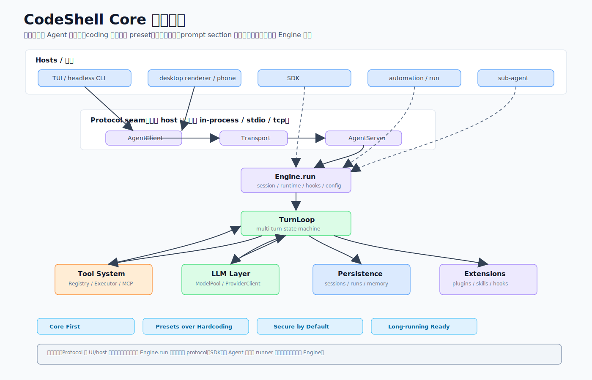

# 01 · 一套引擎三张脸:CodeShell Core 全景导览

> 一句话:CodeShell 不是一个"写代码的工具",而是**一个通用的 Agent 编排内核**,外面套上 CLI、桌面 App、SDK 三张脸;"会写代码"只是挂在这个内核之上的一份配置(preset),不是写死在引擎里的本质。

本篇是系列开篇,先帮你建立全局心智模型:CodeShell 到底是什么、由哪几个包组成、它们怎么分工、为什么核心要做成"领域无关"。后面每一篇会钻进一个具体模块。

## 1. 它解决什么问题

如果你做过"接大模型 + 给它工具用"的系统,大概率会遇到这些反复出现的麻烦:

- 多轮对话怎么管?上下文快撑爆窗口怎么办?
- 模型要调用工具(读文件、跑命令、搜网页),怎么保证不被它一句话删了你的仓库?
- 同一套逻辑,既想跑在终端里,又想做成桌面 App,还想被别人当 SDK 引用——难道要写三遍?
- 想让它"无人值守地跑一个长任务",中途崩了还能续上,怎么做?

CodeShell Core 的回答是:**把这些通用机制(多轮循环、上下文压缩、权限、工具执行、会话持久化、长任务编排)收敛进一个领域无关的内核,把"具体要当什么 agent"做成可替换的配置。** 写代码、做调研、跑运维自动化,对这个内核来说只是不同的 preset 与工具白名单组合。



## 2. 四个包,各管一段

```
packages/
├── core/      Engine、工具、MCP、hooks、会话、运行、自动化、preset、LLM、
│              模型目录、插件、能力控制、凭证、记忆、Arena、cc-orchestrator
├── tui/       终端 CLI、Ink REPL、自绘终端渲染器、斜杠命令
├── desktop/   Electron 主进程(服务经纪人)+ 每会话 core worker + React renderer + 手机遥控
└── cdp/       环境无关的 CDP 浏览器动作层(不依赖 Playwright)
```

`@cjhyy/code-shell`(仓库根)是个 meta-package,重导出 core 并打包 CLI。构建顺序是 `core → tui → build-meta`,且 `sync-models` 要先跑(从 OpenRouter 拉模型数据,构建依赖它)。

要点在于:**core 是唯一一份"大脑"**,tui 和 desktop 都是它的客户端。这就是标题"一套引擎三张脸"的来历。

## 3. 核心立场:Core First,行为即配置

整套架构有一条贯穿始终的设计哲学,图里把它标成了四个词:**Core First(核心优先)、Presets over Hardcoding(用配置而非硬编码)、Secure by Default(默认安全)、Long-running Ready(为长任务准备)。**

其中最该记住的是第二条。`packages/core/CONTRIBUTING.md` 里写得很直白:**core only carries mechanism, not policy**(核心只装机制,不装策略)。具体落地:

- turn loop、上下文管理、权限、MCP、hooks、任务、cron、子 agent、会话、记忆——**全是通用机制**。
- "会写代码"是一个叫 `terminal-coding` 的 preset:它在通用 `general` preset 基础上,多挂了一个 `coding` 提示段,多开了 `EnterWorktree`/`LSP`/`Brief` 等工具,并打开 git 状态注入。
- 换句话说,`general` 和 `terminal-coding` 的差别**只是配置差别**,不是两套引擎。

这也是为什么本系列反复强调:**不要把 CodeShell 当成一个"coding agent",core 里没有写死的编程逻辑。** 它是一个可以被配置成 coding agent、调研 agent、运维 agent 的通用编排核心。

## 4. 一次请求大致怎么流动

把图从上往下读,一次典型交互是这样的:

1. **入口(host)**:用户从 TUI、桌面 renderer、手机、SDK 或自动化任务发起一次请求。
2. **协议接缝(protocol seam)**:多数 host 通过 `AgentClient ⇄ Transport ⇄ AgentServer` 这层 JSON-RPC 接缝去驱动引擎,把权限白名单与生命周期收口在一处。
3. **`Engine.run`**:引擎装配好会话、运行时、hooks、配置。
4. **`TurnLoop`**:多轮状态机真正转圈——调模型、压上下文、执行工具、决定收尾还是继续。
5. **工具系统 / LLM 层**:工具调用经 Registry/Executor(带权限/路径/沙箱/MCP 门禁);模型请求经 ModelPool/ProviderClient。
6. **持久层**:会话、运行、记忆落盘到 `~/.code-shell/`,支撑恢复与长任务。
7. **扩展**:plugins / skills / hooks 在运行时往里挂能力。

> **边界提醒(重要)**:协议接缝是 host 的**常见主路径**,但**并非所有 `Engine.run` 都必须经过 protocol**。SDK、子 Agent、专用 runner 可以按场景**直接嵌入 Engine** 调用。图里专门标了"Direct `Engine.run` 例外"。本系列后面凡涉及此处,都按"主路径/推荐接缝"措辞,绝不写成"一律经过 protocol"。这点在 [05 · 协议与会话](05-protocol-and-sessions.md) 会详细展开。

## 5. 这样设计带来什么好处

- **一处实现,三处复用**:CLI、桌面、SDK 共用同一个引擎,改一处行为三端同时受益。
- **新增宿主几乎不动 core**:host 只管 UI/IPC/系统服务与部署形态,引擎逻辑不外溢。
- **行为靠切换而非分叉**:要做一个新形态的 agent,改 preset/工具白名单/prompt 段即可,不必 fork 引擎。
- **安全与长任务是地基而非补丁**:权限门禁与可恢复运行从一开始就在核心里,不是事后打补丁。

代价也要诚实说:这层抽象(尤其是协议接缝)带来一定的间接性,读代码时需要先理解"谁在驱动谁"。本系列的目的之一就是替你把这层间接性讲清楚。

## 6. 源码阅读路线

- 公共 API 面:`packages/core/src/index.ts`(想知道 core 对外暴露了什么,从这看)。
- 边界契约:`packages/core/CONTRIBUTING.md`("core 只装机制不装策略"的原文)。
- 构建/测试约定:`CODESHELL.md`(用 `bun`,构建依赖 `sync-models`)。
- 模块全景:`packages/core/src/` 顶层目录,对照本篇第 2 节和 [12 · 模块地图与回顾](12-module-map-and-recap.md) 的详细地图。

## 7. 本系列怎么读

建议顺序就是篇号顺序:先全景(本篇),再主线(引擎→工具→模型→协议→preset),再长任务与扩展,最后宿主与收尾地图。

| 想了解 | 去读 |
|--------|------|
| 引擎一圈怎么转、上下文怎么压 | [02 · Engine 与 Turn Loop](02-engine-turn-loop.md) |
| 工具调用怎么被守卫 | [03 · 工具系统](03-tool-system.md) |
| 模型 tag 怎么变成可用客户端 | [04 · LLM 与模型层](04-llm-model-layer.md) |
| 协议接缝与会话持久化 | [05 · 协议与会话](05-protocol-and-sessions.md) |
| 行为怎么配置出来 | [06 · Preset/Prompt/Hooks/Skills](06-presets-prompt-hooks-skills.md) |
| 长任务/定时/持久目标 | [07 · Run/Automation/Goal](07-run-automation-goal.md) |
| 插件/能力/凭证/记忆 | [08 · 插件、能力、凭证、记忆](08-plugins-capabilities-credentials-memory.md) |
| 多模型对垒与外部 CLI 编排 | [09 · Arena 与集成](09-arena-and-integrations.md) |
| 终端宿主 | [10 · TUI 宿主](10-tui-host.md) |
| 桌面/手机宿主与浏览层 | [11 · 桌面与手机宿主](11-desktop-mobile-host.md) |
| 全局回顾与源码导航 | [12 · 模块地图与回顾](12-module-map-and-recap.md) |

## 8. 常见误解

- ❌ "CodeShell 是个 coding agent,core 内置了编程逻辑。" → ✅ core 是通用编排内核,编程能力来自 preset/工具白名单/prompt 段。
- ❌ "所有调用都经过 protocol。" → ✅ 多数 host 走协议接缝,但 SDK/子 Agent/专用 runner 有直接嵌入 Engine 的路径。
- ❌ "tui 和 desktop 各有一套引擎。" → ✅ 只有一份引擎在 core,两个宿主都是它的客户端。
