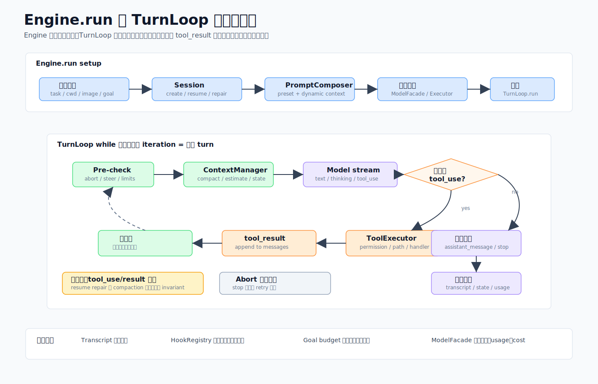
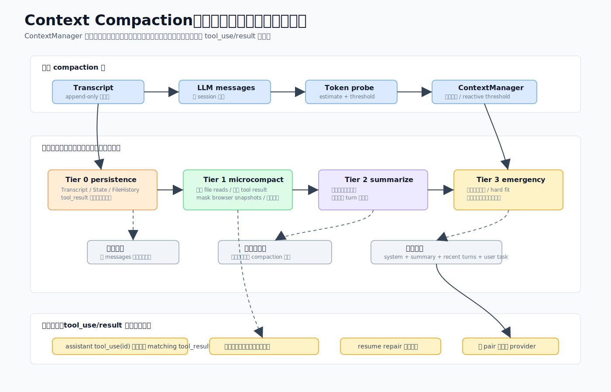

# 02 · Agent 的心跳:Engine 与 Turn Loop 是怎么转一圈的

> 一句话:`Engine` 负责把一次请求装配成可运行的状态,`TurnLoop` 负责把"调模型 → 执行工具 → 再调模型"这件事一圈一圈转下去,直到拿到最终答案或撞上某个边界。

这是整个 core 的心脏。其它模块——工具、会话、模型、preset——要么是给这颗心脏供血,要么是被它驱动。读懂这一篇,后面都好读。

源码主战场:`packages/core/src/engine/`(引擎与循环)和 `packages/core/src/context/`(上下文管理)。

## 1. 它解决什么问题

一次"用户说一句话,agent 干一堆活再回话"背后,要解决一连串脏活:

- 多轮怎么编排?模型这一轮要调工具,工具结果要喂回去让它继续,什么时候算"说完了"?
- 上下文窗口有限,聊久了消息会撑爆,怎么在不丢关键信息的前提下压缩?
- 用户中途按了停止(Esc/Ctrl+C),怎么干净地收尾而不是当成报错?
- 无人值守的长目标,怎么防止它无限循环烧钱?
- 用户在 agent 干活途中又补了一句话,怎么插进去而不打断当前这一轮?

Engine 层就是把这些都收进一个"领域无关的多轮 agent 循环"里。它知道**怎么跑一个 agent**,不知道**怎么写代码**(那是 preset 的事,见 [06](06-presets-prompt-hooks-skills.md))。

## 2. 两个文件扛起大半重量

| 文件 | 角色 |
|------|------|
| `engine/engine.ts` | `Engine` 门面——会话生命周期、run 装配、图片策略、权限模式、goal 入口、hook 协调、子 agent 派生 |
| `engine/turn-loop.ts` | `TurnLoop` 状态机——模型流式、工具执行、上下文管理、goal 仲裁、终止判定 |

围绕它们还有一圈支撑模块,比较关键的几个:`model-facade.ts`(包住 LLM 客户端,做日志/转发/记账)、`goal.ts`(持久目标预算与上限)、`steer-queue.ts`(步间引导队列)、`token-budget.ts`(每轮输出 token 决策)、`patch-orphaned-tools.ts`(恢复时修补孤儿工具调用)、`resolve-llm-config.ts`(settings + tag → 模型配置)。

## 3. 一次 run,从头到尾五个阶段

`Engine.run(task, options?)` 返回 `EngineResult`(源码 `engine/engine.ts`,外层包了 try/catch)。它分五个阶段:

**阶段 1 — 校验与解析输入**
- 按优先级定 cwd:`options.cwd > session.cwd > config.cwd > process.cwd()`。
- 解析图片:从 task 文本里抠出 `<codeshell-image>` 块(`parse-task.ts`)。格式错就抛 `ImageParseError`,**不静默兜底**。
- 执行图片策略(`image-policy.ts`):单图上限、整轮累计上限、张数上限。超累计/张数上限会**拒绝这一轮**(fail-closed,不是悄悄截断)。
- 规整 goal、解析回合上限(见 §6)。

**阶段 2 — 会话与上下文装配**
- `SessionManager` resume 或 create,拿到 `{ transcript, state }`。
- `ContextManager` 从已加载 transcript 重建"工具结果持久化决策"(见 §5)。
- `PromptComposer` 用 `preset + customSystemPrompt + appendSystemPrompt` 拼系统提示(见 [06](06-presets-prompt-hooks-skills.md))。
- **恢复修补**:`patchOrphanedToolUses` 扫历史,给任何没拿到结果的 `tool_use` 补一个合成的错误 `tool_result`,保证消息数组对 provider API 合法(见 §4 不变量 1)。

**阶段 3 — 组装循环依赖**:`ModelFacade` 包住具体 `LLMClient`;创建 `subAgentSpawner` 闭包(`Agent` 工具靠它派生子 agent);把 `TurnLoopDeps` 和 `TurnLoopConfig` 交给 `TurnLoop`。

**阶段 4 — 循环本身**(`TurnLoop.run`)。详见下一节。

**阶段 5 — 终止**:发 `on_session_end`,刷 transcript,存 state(终止原因、回合数、用量),返回 `EngineResult`。

## 4. 循环一圈:turn loop 拆解

每一次 `while` 循环就是一个**回合(turn)**:

**a. 预检**
- 循环顶部先查 `signal.aborted`,中止就快速返回,不做任何昂贵的活。
- **引导(steering)**:`consumeSteerItems` 把步间队列里排队的用户消息**不打断当前轮**地拼进去(见 §6)。
- 临近上限警告:剩 2/1/0 回合时注入 `system-reminder` 催模型收尾;到 0 时最后一轮强制只能给答案不能再用工具。
- `ContextManager.manageAsync(messages)` 跑分级压缩(见 §5)。

**b. 调模型**
- `callModelWithFallback` 从 `ModelFacade` 流式拿结果,`tool_use` 块边到边入队。
- 撞 `ContextLimitError`:丢最老的几轮重试(最多 3 次),还不行就 `patchOrphanedToolUses`。
- 撞 `AbortError`/`signal.aborted`:`markStopped()` 返回 `aborted_streaming`——**中止不是错误**。
- 截断续写:如果模型因为打满输出 token 在工具调用中途停了,带"继续"提示重试最多 3 次。

**c. 调模型后检查**:从 `promptTokens` 推算 prompt 开销喂给 `ContextManager`(混合估算,见 §5);**goal 预算检查**在调模型后、执行工具前做——token/时间超了就强制停。

**d. 工具决策**:没有工具调用 ⇒ 走最终答案;有 ⇒ 执行并进入下一轮。

**e. 最终答案路径**:发 `assistant_message`,再跑 `on_turn_end` 和 `on_stop` hook。如果 hook 返回 `continueSession` 且没到 `maxStopBlocks` 上限:计数 +1、注入催继续的提示、继续循环;否则正常收尾(或到上限以 `exhausted` 收尾)。**普通无 goal 的交互对话,这个 goal 处理器是 no-op。**

**f. 工具执行路径**:`streamingQueue.drain()` 并发安全的工具并发跑、不安全的串行跑;`maxToolCallsPerTurn` 拦溢出;每个工具走 `pre_tool_use` hook(权限+前置)→ `ToolExecutor.executeSingle` → `post_tool_use` hook → 结果转块 → 推回消息数组 → 继续。工具执行这一段的安全机制见 [03 · 工具系统](03-tool-system.md)。

## 5. 上下文管理:从免费无损到昂贵有损的分级压缩

消息数组逼近窗口时,`ContextManager` 用逐级加重的手段压缩。

- **Tier 0 — 持久化 + 常驻去废**:单个超大 `tool_result`(约 50 KB 以上)写到磁盘文件,在上下文里换成 `[文件路径 + 2KB 预览]` 块;重复 Read 同一路径只留最新、旧的换成"已被取代"标记;浏览器观察快照只留最新一份。
- **Tier 1 — microcompact**:零成本、无损。对可重取的工具(Read/Glob/Grep/Bash/WebFetch 等)清掉较老的 `tool_result` **内容**,留一行指纹 `[Old tool result cleared — ...]`。带状态的工具(TaskUpdate/Agent/Skill)原样保留。
- **Tier 2 — summarize**:超过约 0.85 占比时,让 aux 模型做**滚动**摘要(在上一版摘要上合并,而非从头重摘,所以细节是缓慢侵蚀的)。连续失败 3 次回退到同步的 snip/window 路径。
- **Tier 3 — window 紧急压缩**:超过约 0.92 时,只保留首 + 尾 N 条,作为撞 `prompt_too_long` 前的最后手段。
- **流式反应探针**:流式期间累计响应 token,每跨过一个 2000-token 桶可能触发一次紧急 window 压缩。

两个值得记的设计:**冻结决策**——某个 `tool_use_id` 的持久化命运一旦确定就整个会话不变(避免反复改写模型据以建立状态的内容);**保持不变量的切片**——压缩切片永远不会切断一对 `tool_use`/`tool_result`(`adjustIndexToPreserveAPIInvariants`);**混合估算**——以上一轮真实 `promptTokens` 为基准,只估算之后新增的消息,所以估算每轮向真值收敛。

## 6. 两个值得单独看的机制

### 步间引导(不打断)
`steer-queue.ts` 是一组对"每会话一个 `{id, text}` 列表"的纯函数。host 在 run 进行中调 `Engine.enqueueSteer`,循环在每个步边界 `consumeSteerItems` 把消息当普通 user 轮拼进去——**不 abort**。一个 `steer_injected` 事件让 UI 把注入的气泡对回它显示过的草稿(靠 `id`)。还没被消费的可以 `removeSteerItem` 撤回;消费过就拿不回了。这跟 UI 语义上的"打断重发"(abort 后开新轮)是两回事。

### Goal 上限(`goal.ts`)
一个 `GoalConfig` 带目标 + 可选的 `tokenBudget`/`timeBudgetMs`/`maxTurns`/`maxStopBlocks`。goal 与交互的默认值不同,因为 goal 是**无人值守**的、stop-hook 会反复挡住收尾:

- `maxTurns`:交互默认 100,goal 默认 300。优先级 `config > goal.maxTurns > 默认`。
- `maxStopBlocks`(收尾前裁判连续挡几次):交互 8,goal 25。更紧的交互上限是为了防一个插件 `on_stop` hook 在普通对话里循环 25 次。

无人值守 goal 的真正安全网是 token/时间预算;`maxStopBlocks` 只在裁判一直挡、两次挡之间又毫无进展时才咬。持久 goal 的完整故事见 [07 · Run/Automation/Goal](07-run-automation-goal.md)。

## 7. 循环保证的四条不变量

1. **`tool_use` ↔ `tool_result` 成对**。每个 `tool_use` 必有 `tool_result` 应答,顺序紧邻——这是 Anthropic/OpenAI 消息格式的硬要求。循环靠"执行后立刻发结果"维持,恢复时靠 `patchOrphanedToolUses` 修补,压缩时靠不变量切片保护。
2. **中止是终态,不可重试**。用户 Esc/Ctrl+C 置位 signal,循环在三处(顶部、上下文管理后、调模型后)检查,返回非错误的 `aborted_streaming`。用户中止永远不喂回重试策略。
3. **Goal 预算是硬底线**。run 级追踪器(token + 墙钟 + 回合 + 连续 stop-block)在执行工具前检查,run 中途不可越过。
4. **图片策略 fail-closed**。超额图片拒绝这一轮,而不是悄悄丢内容。

## 8. 这样设计的好处

- **循环本身可移植**:它不知道在写代码还是做调研,所以同一颗心脏能驱动任意 preset 的 agent。
- **成本可控且自校正**:分级压缩按需付费(无损优先),token 估算逐轮收敛真值,不靠拍脑袋。
- **可恢复**:成对不变量 + 持久化 + 冻结决策,让会话能从磁盘干净重建(见 [05](05-protocol-and-sessions.md))。
- **交互体验**:步间引导让用户能"边跑边补话",不必打断重来。

## 9. 源码阅读路线

1. 先读 `engine/engine.ts` 的 `Engine.run`,顺着五个阶段走一遍。
2. 再读 `engine/turn-loop.ts` 的 `TurnLoop.run`,对照本篇 §4 的循环图。
3. 上下文压缩看 `context/manager.ts`(分级编排)和 `context/compaction.ts`(各 tier 纯函数)。
4. goal 与引导看 `engine/goal.ts`、`engine/steer-queue.ts`。
> 行号会随代码移动漂移,按"在这些文件附近"找符号,以当前源码为准。

## 10. 常见误解与边界

- ❌ "所有 `Engine.run` 都经过 protocol。" → ✅ turn loop 是引擎内部循环,不等于协议层;且 SDK/子 Agent 有直接嵌入 Engine 的路径(见 [05](05-protocol-and-sessions.md))。
- ❌ "中止 = 报错重试。" → ✅ 用户中止是终态,直接干净返回。
- ❌ "上下文压缩会丢工具配对。" → ✅ 压缩切片专门保护 `tool_use`/`tool_result` 成对不变量。
- ⚠️ 改 turn loop 让工具结果延迟/乱序时要小心:Tier 0 的成对保护是单遍扫描,依赖"结果紧邻调用"这条不变量。
