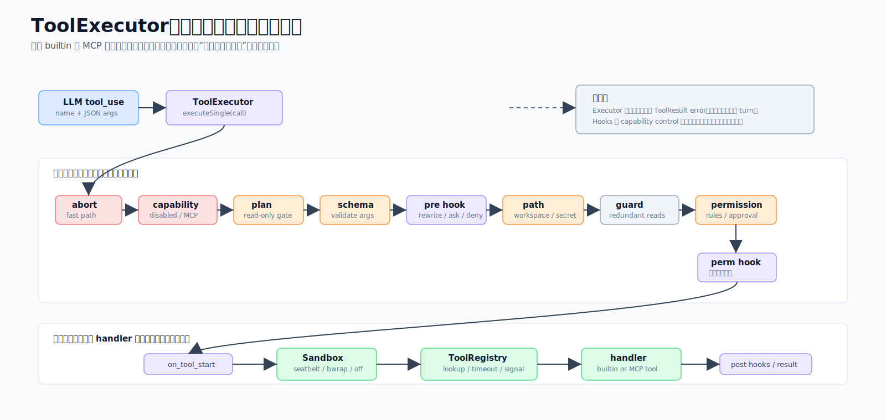

# 03 · 一个收口、绝不抛错:工具系统的安全管线

> 一句话:模型说"我要调这个工具",这句话要先穿过一条统一的安全管线——能力门、plan 模式、参数校验、hooks、路径策略、权限分类、沙箱——才会真正执行;这条管线只有**一个入口**,而且**永不抛错**。

agent 的全部能力——读文件、跑命令、派子 agent、调 MCP 服务——都从这一条管线过。读懂它,你就知道为什么这套系统敢把 shell 交给模型用。

源码主战场:`packages/core/src/tool-system/`。

## 1. 它解决什么问题

把工具交给大模型用,最怕两件事:**它乱来**(一句话 `rm -rf`)和**它崩了整个会话**(调了个不存在的工具,turn 直接挂掉)。再加上现实需求:

- 同样的权限/路径/沙箱规则,既要管内置工具,也要管外部 MCP 工具,不能各写一套。
- 项目自定义的 hook 能介入工具执行,但**不能让 hook 把项目自己设的权限规则绕过去**。
- 用户批准过一次"可以跑 git",不能因此连 `git status && rm -rf /` 也放行。

工具系统的答案是:**所有工具走同一个 executor(单一收口),所有检查在这里按"先便宜后致命"的顺序跑,executor 本身吞掉所有异常返回错误结果。**

## 2. 这一层长什么样

| 文件 | 角色 |
|------|------|
| `registry.ts` | `ToolRegistry`——注册、超时默认、abort 级联、执行派发 |
| `executor.ts` | `ToolExecutor`——每次调用的完整生命周期(plan 模式、hooks、权限、路径策略、执行) |
| `permission.ts` | `PermissionClassifier` + 三个审批后端、规则匹配、Bash 链式命令守卫 |
| `path-policy.ts` | 声明式敏感路径检测、工作区包含判断、审批缓存 |
| `mcp-manager.ts` | `MCPManager`——MCP 连接、工具发现、header/env 构造、图片溢出 |
| `sandbox/index.ts` | OS 级沙箱后端(seatbelt / bwrap / off) |
| `builtin/index.ts` | `BUILTIN_TOOLS` 注册表(60+ 工具)+ 守卫 |

## 3. 端到端管线

模型发出 `tool_use(name, args)` 后,`ToolExecutor.executeSingle(call)` 按顺序跑:

1. **abort 快路**:`signal.aborted`?立即返回,跳过一切。
2. **能力门**:被禁用的内置工具 / 不在允许列表的 MCP 服务 → 拒绝。
3. **plan 模式门**:plan 模式下只放只读工具;Bash 做写操作扫描。
4. **参数校验**(schema)。
5. **`pre_tool_use` hook**:可以改写参数 / 要求确认 / 拒绝(**不能升级成放行**)。
6. **路径策略**:对每个目标路径分类;ask 或 deny(凭证类 fail-closed)。
7. **调查守卫**:对冗余重复读发软提醒。
8. **权限分类**:规则 → 安全模式 → 允许列表 → 默认。其中 `on_permission_check` hook 只能下调。
9. **`on_tool_start` hook** → **`ToolRegistry.executeTool(...)`**(真正的 handler 在这里跑)→ **`on_tool_end`/`post_tool_use` hook** → Write/Edit 还会触发 **`file_changed` hook**。

`ToolRegistry.executeTool` 内部:查工具(没有就 `ToolNotFoundError`)、解析超时(每调用 > 工具声明 > 默认 120s)、建一个挂在父 signal **和**超时上的子 `AbortController`、把 `__signal` 注入参数(让 Agent/Arena/Bash 这类长任务能轮询取消),然后 `Promise.race([执行, 中止])`。结果统一规整成 `ToolResult`。

## 4. 让这套敢用的五条不变量

1. **executor 是唯一入口**:权限、路径策略、plan 模式永不被绕过,因为每个工具——内置或 MCP——都走 `executeSingle`。
2. **executor 永不抛错**:异常(包括模型幻觉出的 `ToolNotFoundError`)被捕获,转成 `ToolResult` 错误喂回模型,让它重试或换工具——坏工具名不杀 turn。(注意:只有**绕过** executor 的路径——host 回调、fire-and-forget、hook emit——才需要自己 try/catch。)
3. **hooks 只能收紧不能放松**(A1 硬化):`pre_tool_use` 和 `on_permission_check` 能下调决定或要求确认,但一个 hook 想用 `"allow"` 盖过分类器的 `"deny"`/`"ask"` 会被驳回(`clampHookDecision`)。只有分类器规则和用户能授予 `allow`。理由:项目定义的 hook 不该能跳过项目自己的权限规则。
4. **abort 优先排序**:检查顺序"最便宜最致命"在前——abort 快路 → 能力门 → 校验 → 路径策略(凭证 fail-closed)→ 权限 → 执行。已取消的分支瞬间返回,不跑 hook 不跑 handler。
5. **级联取消**:`AbortSignal` 从 Engine → Executor → Registry → handler 一路传,用户一个 Stop 同时取消所有在飞工具。

## 5. 权限系统:按"操作"授权,不是按工具名

`PermissionClassifier.classify(toolName, args)` 按序解析出 `"allow" | "deny" | "ask"`:会话规则 → 用户规则 → Bash 安全读模式 → preset 允许列表 → 工具的 `permissionDefault`。

三个审批后端坐在 `ask` 背后:**`HeadlessApprovalBackend`**(无人值守:全批/全拒/只批只读)、**`AutoApprovalBackend`**(低风险批、高风险拒、中风险+安全操作批)、**`InteractiveApprovalBackend`**(问用户,把授权缓存在会话或项目作用域)。

**关键:授权键在"操作"而非工具名**:
- Bash 授权是**头部限定**的:批准 `git status` 存的是 `command: "^git(\\s|$)"`,覆盖所有 `git …`。
- 文件工具授权是**路径限定**的:精确文件或目录子树。

**链式命令守卫**:`ruleMatches` 在认一条 Bash 授权前先跑 `scanShellCommand`——如果命令有多段(`;`、`&&`、`||`)、管道、重定向或替换,头部授权**不生效**,重新问用户。这就是为什么 `git status && rm -rf /` 不能搭 `git` 授权的便车。任何新增的 Bash 授权路径都必须复用 `scanShellCommand`。

## 6. 路径策略:独立的第二道门

`path-policy.ts` 是和权限分类器**独立**的另一道门,专管文件工具的目标路径。`classifyPath(absPath, operation)` 先对两侧都 **realpath**(防仓内 symlink 逃逸到工作区外),然后:
- 敏感**文件**模式(`.env*`、`id_rsa*`、`*.pem`、裸 `secret`/`credentials`/`token` 等)→ 写=`deny`,读=`ask`。像 `authController.ts`/`token-counter.ts` 这种**源码文件**明确**不**当凭证。
- 敏感**目录**模式(`.ssh`、`.aws`、`.config/gcloud`、`.code-shell`、`.claude` 等)。
- 工作区内 → `allow`;工作区外 → `ask`。

逃生舱:`CODESHELL_PATH_POLICY=off`(记一次日志)。数组参数逐元素检查并过滤掉 `http(s)` URL。

## 7. MCP 集成与沙箱

`MCPManager` 连接外部 MCP 服务(自动判 stdio vs streamable-http),发现它们的工具,注册进**同一个** `ToolRegistry`——所以 MCP 工具继承和内置完全一样的权限/路径/沙箱门禁。它还会用 `wrapMcpOutput` 把服务输出包进 `<mcp-result … trust="untrusted">` 标记,让模型把它当数据而非指令(防 prompt 注入)。

沙箱(`sandbox/index.ts`)能把 Bash 命令包进 OS 沙箱:macOS **seatbelt**、Linux **bwrap**、或 **off**。`auto` 选可用后端,都没有就降级并告警一次。注意一个刻意的分工:**沙箱拒绝的是凭证的*读*,拒绝敏感*写*是路径策略层的活**。**Windows 无沙箱后端,`auto` 降级为 off**(Windows 移植确认过),不要写成"全平台沙箱"。

## 8. 内置工具:60+ 个,但要记一个坑

`BUILTIN_TOOLS` 是注册表,每条声明 `permissionDefault`、`isReadOnly`、`isConcurrencySafe`、可选 `pathPolicy`、`timeoutMs`。按类别有文件类、Shell 类、Web/媒体类、Agent/多模型类、协调/规划类、MCP/集成类、自动化类、记忆类、浏览器类等(`ApplyPatch` 改自 OpenAI Codex 的 apply-patch,但我们这版失败会回滚部分写入)。

**最该内化的一个坑:加一个内置工具要改两处。** 工具必须同时在 `BUILTIN_TOOLS` **和** preset 白名单(`GENERAL_BUILTIN_TOOLS`,见 [06](06-presets-prompt-hooks-skills.md))里——`ToolRegistry.registerBuiltins(selectedNames)` 会**静默丢掉**不在白名单的工具,于是 executor 明明存在,模型却收到"Tool not found"。这个坑反复复发过。另外 `BUILTIN_TOOL_GUARDS` 会在工具不可用时藏掉它(没 API key 藏 `WebSearch`,凭证库空藏 `UseCredential`)——"空了就安静"。

两条对每个工具作者都适用的健壮性规则:外部网络/MCP 调用必须带 timeout **且**接 run 的 signal(`AbortSignal.any([userSignal, AbortSignal.timeout(N)])`);喂给 `slice`/`setTimeout`/计数的数值参数要守卫 `> 0` 而非只用 `|| 默认`。

## 9. 这样设计的好处

- **默认安全(Secure by Default)**:危险动作要么走门要么被拒,且无旁路。
- **稳**:executor 永不抛错,模型一个坏调用不会拖垮整轮。
- **一致**:内置和 MCP 共享同一套门禁,心智负担只有一份。
- **授权符合直觉**:批"git"不等于批"rm",批一个文件不等于批整个目录。

## 10. 源码阅读路线

1. `tool-system/executor.ts` 的 `executeSingle`,对照 §3 的管线图逐步看。
2. `permission.ts` 看分类器与三后端、`ruleMatches`/`scanShellCommand`。
3. `path-policy.ts` 看 `classifyPath` 的 realpath 与敏感模式。
4. `builtin/index.ts` 看注册表;再去 [06](06-presets-prompt-hooks-skills.md) 看白名单——理解"改两处"的另一半。

## 11. 常见误解与边界

- ❌ "MCP 工具不受权限管。" → ✅ 注册进同一 registry,门禁完全一致。
- ❌ "hook 能给某个工具开绿灯。" → ✅ hook 只能收紧,放行只有分类器规则和用户能给。
- ❌ "沙箱全平台都有。" → ✅ Windows 降级为 off。
- ❌ "加个工具就在 `BUILTIN_TOOLS` 里写一条。" → ✅ 还要加进 preset 白名单,否则模型看不见。
