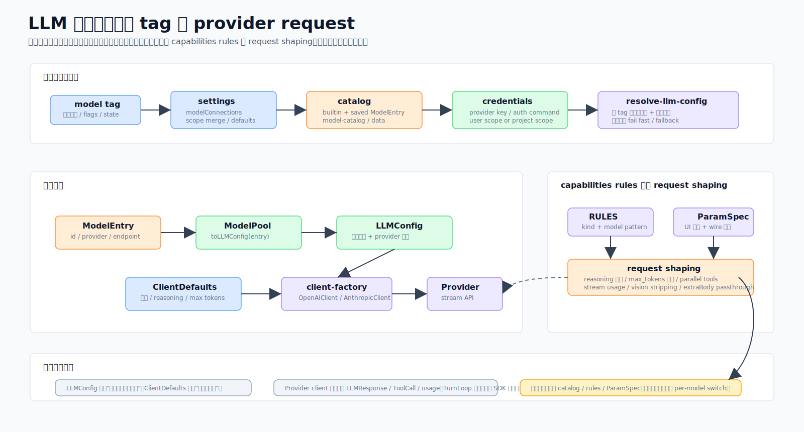

# 04 · 把厂商差异写成数据:LLM 与模型层

> 一句话:一个模型"tag"(比如 `text`)怎么变成一个配置好、能直接发请求的 provider 客户端;以及最关键的——各家模型千奇百怪的怪癖(max_tokens 字段名、拒收哪些参数、reasoning 怎么开)是**写进一张数据表**治的,而不是在客户端里堆 `if`。

源码主战场:`packages/core/src/llm/`、`packages/core/src/model-catalog/`,以及 `packages/core/src/engine/` 里的解析胶水。

## 1. 它解决什么问题

接多家大模型,真正烦人的不是"发个 HTTP 请求",而是:

- gpt-5.5 用 `max_completion_tokens`,Claude 用 `max_tokens`;有的拒收 `temperature`,有的必须带某个字段——一处写错就 400。
- reasoning(思考)各家形态完全不同:OpenAI 是 effort 档位,Claude 4.0–4.5 是 budget token,Claude 4.6+ 是自动,DeepSeek 是顶层 `thinking.type`。
- 用户在 UI 上想调的旋钮(温度、effort、思考预算),既要变成界面控件,又要正确映射到请求体里的字段。
- 热切换模型时,1M 上下文模型的输出上限不能"漏"到 128K 的模型上。

模型层的答案:**身份与旋钮分离 + 差异即数据 + 一处声明同时驱动 UI 和请求体。**

## 2. 两个被刻意分开的概念

- **模型身份(`LLMConfig`)**:provider / model / apiKey / baseUrl / maxTokens。
- **运行旋钮(`ClientDefaults`)**:temperature / timeout / retryMaxAttempts / imageDetail。

热切换模型时整个换掉 `LLMConfig`,不动 `ClientDefaults`,所以一个 1M 上下文模型的输出上限不会串到 128K 模型上。

主要文件:`llm/client-base.ts`(抽象基类 + 重试/截止)、`llm/client-factory.ts`(`createLLMClient` 懒加载 provider)、`llm/providers/{anthropic,openai}.ts`(两大客户端,openai 那个覆盖 DeepSeek/OpenRouter/Z.AI/xAI/Mistral/Groq/Gemini-compat/Ollama/custom)、`llm/capabilities/`(能力 RULES)、`llm/model-pool.ts`、`model-catalog/`。

## 3. 解析流程:tag 怎么变成客户端



一次对话要一个 `LLMConfig`,它这么来:

```
settings.modelConnections[] + settings.credentials[] + 合并后的 catalog
        │  modelEntriesFromConnections()
        ▼
ModelEntry[]  ──注册──▶  ModelPool
        │  pool.toLLMConfig(entry)
        ▼
LLMConfig  ──createLLMClient()──▶  AnthropicClient | OpenAIClient
        │  client.createMessage({system, messages, tools, reasoning})
        ▼
capabilitiesFor(providerKind, model)  塑形 wire 请求
```

非引擎调用方有个单一入口:`resolveLLMConfigForTag(settings, "text", preferredId?)`,按 `preferredInstanceId > defaults[tag] > 第一个可用` 选,校验 key 存在,没有可用连接时返回 `null`(不是抛错)——让调用方给出清晰的"未配置模型"提示。

**catalog 是单一事实源**(legacy 的 `model.*/models[]/providers[]` 存储已删)。`getMergedCatalog()` 把用户 catalog(`~/.code-shell/model-catalog.user.json`)叠在 `BUILTIN_CATALOG` 上,id 冲突用户胜。

## 4. Capabilities:差异是数据,不是代码

每个 provider/模型的怪癖都住在 `llm/capabilities/rules.ts`——一张 `(providerKind, modelFamily) → Capability` 规则表,每个 kind 第一条匹配胜。一个 `Capability` 声明:`supportsVision`、`tokenLimitField`(`max_tokens` vs `max_completion_tokens`)、`rejectedParams`、`reasoning` 形态(`none`/`deepseek-thinking`/`openai-effort`/`anthropic-budget`/`anthropic-adaptive`/`openrouter-reasoning`)、`echoReasoning`、`parallelToolCalls`、`streamUsage`、`maxOutputTokens` 等。

几条实际生效的规则:
- **gpt-5.5+**:`max_completion_tokens`,拒 `temperature`/`top_p`/惩罚项,effort 档 `low/medium/high/xhigh`(无 `minimal`),且 `noEffortWithTools: true`——带工具的请求**预先不发** `reasoning_effort`,否则 gpt-5.5 返回 400。
- **claude-4.6+**:`anthropic-adaptive`(思考自动,无 budget 参数);**claude-4.0–4.5**:`anthropic-budget`(显式 `budget_tokens`,夹在 `< max_tokens`)。
- **deepseek-v4 / Z.AI GLM**:`deepseek-thinking`(顶层 `thinking.type`)。

**客户端里没有任何 per-model 的 `switch`**——它们读 `Capability` 来塑形请求。`reasoningControlFor(kind, model)` 把同一个 `reasoning` 形态投射成 UI 控件描述符(开关 / effort 枚举 / budget 数字 / 自动),让连接 UI 和 wire 请求从一个源保持同步。

> 关于 `rejectedParams` 有个坑:它必须是新建的 `Set`,不能直接引用 `DEFAULT`,否则某次客户端 mutate 会污染默认值。

## 5. catalog 与 `ParamSpec`:一处声明,两处生效

一个 `CatalogEntry` 描述一个 provider 模板:`id`、`tag`(text/image/video/audio)、`adapterKind`、`defaultBaseUrl`、`modelPresets[]`、`paramsDoc`。每个 `ModelPreset` 可带 `params: ParamSpec[]`。

`ParamSpec` 是这一层的拱心石——**一条声明同时驱动 UI 控件和 wire 映射**:

```ts
{ name: "reasoning", control: "enum", options: ["low","medium","high"],
  doc: "Reasoning effort…", wire: { field: "reasoning_effort" } }
```

- `applyParams(values, params)` 按 `wire.field` 把值映射进嵌套请求体(`"thinking.budget_tokens"` → `{thinking:{budget_tokens:N}}`),并把 catalog 声明的 temperature/top_p/max_tokens/thinking 喂进 `extraBody`(实测真下发到 wire)。
- `buildParamsDoc(params)` 把同样的声明渲染进**工具描述**,让模型知道自己有哪些旋钮。
- `reasoningFromParamValues` 把存的参数值翻译成 `ReasoningSetting`(字符串→effort,数字→budget,布尔→开关)。

这就是"差异即数据"的另一面:加一个带新旋钮的模型,多半只改 catalog 数据,UI 和请求体自动跟上。

## 6. 流式、重试、用量

- **重试 + 截止**(`client-base.ts`):`withRetry` 把调用方的 `AbortSignal` 和一个每请求硬截止(约 2× SDK 超时,最少 120s)组合起来拆掉半死的 socket。重试 5xx + 限流,**不重试**确定性的 4xx(省掉对坏请求的等待)。
- **流空闲看门狗**(`stream-watchdog.ts`):可选;空闲超过 `idleTimeoutMs`(默认 90s)中止并重试。`onChunk` 在中止检查**之后**调用,所以 Stop 后缓冲的 chunk 不会漏到 UI。
- **用量与成本**:`LLMClientBase.onUsage` 是每次响应触发的静态 hook,TUI/桌面宿主装它来喂 `CostTracker`(按 OpenRouter 快照 → 静态表 → 保守兜底定价)。`TokenUsage` 带 `cacheReadTokens`/`cacheCreationTokens`。
- **构造时不给 `maxTokens` 兜底**:留 undefined 让各 provider 用自己的默认,而不是在某个硬编码值上悄悄截断。

## 7. 模型元数据与同步

- `model-fetcher.ts` 拉某 provider 的 `/models`,归一化各家形状,过滤非 chat 模型,从静态 catalog + 内置 OpenRouter 快照富化,结果缓存到 `~/.code-shell/cache/models/<providerKey>.json`(7 天 TTL)。
- `data/openrouter-sync.ts` 运行时刷新 OpenRouter catalog(`/sync-models` 命令);要持久进 bundle 则构建时先跑 `scripts/sync-models.ts`(构建依赖它)。
- `api-key-sanitize.ts` 防御性剥掉粘贴 key 里的括号包裹、零宽字符、智能引号、中文全角空格。

`provider-kinds.ts` 是已知家族(openai/anthropic/deepseek/zai/xai/mistral/groq/google/openrouter/ollama/custom)的元数据表。注意:这里的 Gemini 支持是 **AI-Studio(`AIza…`)口径**走 OpenAI-compat 端点;**不支持 Vertex OAuth token**(用户填了 `AQ.` 开头的 Vertex token 会 400)。

## 8. 这样设计的好处

- **加模型成本低**:多数情况只改数据(rules + catalog),不动客户端代码。
- **UI 与 wire 不会脱节**:`ParamSpec`/`reasoningControlFor` 让控件和请求体同源。
- **热切换不串台**:身份与旋钮分离,输出上限不会跨模型泄漏。
- **可读可审**:想知道某模型为什么这么发请求,去 `rules.ts` 看那一条,而不是在客户端里追 `if`。

## 9. 源码阅读路线

1. `engine/resolve-llm-config.ts` 看 tag → config 的单一入口。
2. `model-pool.ts` 看 `ModelEntry` → `LLMConfig`。
3. `llm/capabilities/rules.ts` 看差异表(最值得读的一份)。
4. `model-catalog/types.ts` 看 `CatalogEntry`/`ParamSpec`,理解"一处声明两处生效"。
5. `llm/providers/openai.ts` / `anthropic.ts` 看客户端怎么读 `Capability` 塑形请求。

## 10. 常见误解与边界

- ❌ "客户端里有 per-model 的 switch。" → ✅ 没有,差异全在 `rules.ts` 数据表里。
- ❌ "Gemini 用 Vertex token 也行。" → ✅ 只支持 AI-Studio 的 `AIza…` key。
- ❌ "构造时给 maxTokens 一个默认值更安全。" → ✅ 故意不给,避免在硬编码值上悄悄截断。
- 旁注:文本、图片、视频模型的解析是**各自独立**的;本篇讲文本路径,图/视频 provider 见 [09 · Arena 与集成](09-arena-and-integrations.md) 和工具篇的 `GenerateImage`/`GenerateVideo`。
