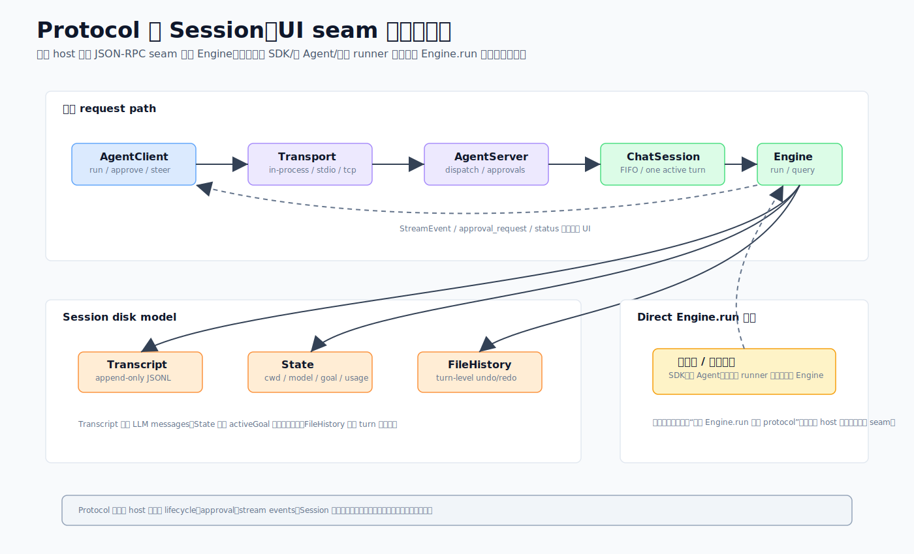

# 05 · 引擎不直接面对 UI:协议接缝与可恢复的会话

> 一句话:引擎从不直接跟 UI 说话——多数 host 通过一层传输无关的 JSON-RPC 接缝去驱动引擎,把权限白名单和生命周期收口在一处;同时,会话状态全落在磁盘上,让一次 run 可中断、可恢复、可按轮撤销。

源码主战场:`packages/core/src/protocol/`、`packages/core/src/session/`、`packages/core/src/state.ts`。

## 1. 为什么要有协议这一层

设想 TUI、桌面 renderer、手机遥控都要驱动引擎。如果它们各自直接调 `Engine`,那么权限审批、生命周期、流事件就会在每个 host 里重写一遍,且很难保证一致。

CodeShell 的做法:让每个客户端通过 `Transport` 跟 `AgentServer` 说 JSON-RPC,由 server 驱动 `Engine`。这是**一个有意的架构决定**:所有走这条路的 `engine.run`(TUI REPL、headless CLI、桌面 renderer、手机遥控)的权限白名单与生命周期都在这一个接缝上强制执行。



> **准确性约束(本篇最重要)**:协议接缝是 host 的**常见主路径**,**不是说所有 `Engine.run` 都必须经过它**。如图右下角标注,**SDK、子 Agent、测试或专用 runner 可以直接装配并调用 `Engine`(嵌入式路径)**。`asyncAgentRegistry` 里的子 Agent 就是各自起一个带独立白名单的 `Engine`。本系列所有相关表述都写成"host 主路径 / 推荐接缝",绝不写成"一律经过 protocol"。

## 2. 三种 transport,一套协议

- **`InProcessTransport`**:一对相连的 `EventEmitter`,同步投递、共享内存。TUI/headless CLI 把引擎嵌在同进程时用它(模型池和工具注册表是共享的,不序列化)。
- **`StdioTransport`**:stdin/stdout 上的 NDJSON。桌面主进程把 core 当子 worker spawn 时用它。
- **`SocketTransport`**:同样的 NDJSON 框架走 TCP。v1 无鉴权——仅 localhost / SSH 隧道。

`createServer({transport, llm, …})` 和 `createClient({transport})` 是稳定的接线方式;关闭顺序有讲究:先关 server(发送关闭通知)再关 client。

## 3. 请求是怎么走的

```
AgentClient.run(task, sessionId)
  → RpcRequest { method: Methods.Run, params: { sessionId, task, cwd, permissionMode, goal } }
  → Transport.send
  → AgentServer.handleRequest
      → ChatSessionManager.getOrCreate(sessionId) → ChatSession{engine}
      → ChatSession.enqueueTurn(task, {onStream})   // FIFO,一次只有一个活跃 turn
          → engine.run(...) → 发 StreamEvent
              → Transport.notify(Methods.StreamEvent, {sessionId, event})
                  → AgentClient 发 "stream" → UI 监听器
```

`Methods` 还覆盖 `Approve`、`Cancel`、`Configure`、`Query`、`Inject`、`Steer`/`Unsteer`、`CloseSession`、`GoalGet`/`GoalClear`、`BackgroundShells`、`BackgroundWork`。`ChatSessionManager` 限制活跃会话数(默认 16,超了抛 `Overloaded`),记录空闲时间戳,可在 TTL 后回收空闲会话。

**审批**:`AgentServer.requestApprovalFromClient` 把一个带超时的 promise 存进 `pendingApprovals`,客户端的 `Approve` 响应解决它。TUI 的权限提示和桌面的审批卡都骑在这个接缝上。

**后台完成唤醒**:后台子 agent 或 shell 完成时,`agentNotificationBus` 同步触发 → `maybeWakeIdleSession`(守卫:会话存在、空闲、非 headless、未被取消)→ 把结果当合成的 `injected:true` 任务注入 → `enqueueTurn`。同步设计让一批完成塌缩成一次唤醒。**注意:这是"完成时唤醒空闲引擎",不是引擎轮询。**

**配置热重载**:`Configure({reloadSettings:true})` 读新设置、算补丁、`engine.refreshRuntimeConfig` 到每个活跃会话;在飞 turn 不动,重载落在 turn 边界。

## 4. 会话落盘

每个会话住在 `~/.code-shell/sessions/<sessionId>/`:

```
state.json        SessionState:cwd、model、turnCount、tokenUsage、activeGoal、parentSessionId、origin
transcript.jsonl  追加写的 TranscriptEvent[],一行一个 JSON
file-history/     FileHistory 快照,服务 undo/redo
```

图右半边就是这个磁盘模型。关键行为:

- **原子、抗崩溃写**:`state.json` 写到 `.tmp` 再 rename;transcript 每事件后 flush。
- **安全会话 id**:`assertSafeSessionId` 拒绝路径分隔符、`..`、超长 id(防 `../../etc/passwd` 逃逸)。
- **transcript 是事实源,不是聊天历史**:`toMessages()` 是事件变成 LLM 消息的边界——`message`/`tool_result`/`summary` 映射过去,`turn_boundary`/`session_meta`/`file_history`/`error` 被丢弃。加载时 `repairToolResultPairs` 删掉孤儿结果、补上缺失的——和 turn loop 守的是同一条 `tool_use`/`tool_result` 成对不变量(见 [02](02-engine-turn-loop.md))。
- **任务和目标从 transcript/state 回灌**,不在普通消息事件里:`TodoWrite` 快照活在它的参数里,持久 goal 活在 `state.json`。

### 按轮撤销
`FileHistory` 快照带 `turnSeq`(一次用户发送 = 一轮)和 `undone` 标志。`/undo` 选最近一个**活**轮里每个文件的最早快照撤销,并记 `RedoRecord`;再 `/undo` 剥前一轮("洋葱式剥皮")。这对齐 Claude Code 的按轮模型(Codex 无 undo)。

### 磁盘作权威恢复源
桌面能纯从磁盘重建会话列表,套三道过滤——`parentSessionId`(藏子 agent)、`origin`(用户发起 vs 自动)、`isNoRepoCwd`(去优先级未绑定的)——所以清掉 localStorage 不丢数据。

## 5. 进程级单例(`state.ts`)

`state.ts` 放**进程级**(非每会话)单例:早期日志用的默认 `sessionId`、`originalCwd`/`projectRoot`(懒回退到 `process.cwd()`,非 CLI 宿主可覆盖)、交互/信任标志、每进程成本计数器。大多分析计数器是 no-op(沉淀器已从 core 移除)。系统提示段缓存也在这,跨 turn 复用。

## 6. 这样设计的好处

- **换 transport 不动业务**:同一协议跑在 in-process / stdio / tcp 上,host 挑传输方式即可。
- **权限/生命周期单点收口**:走主路径的 run 共享一套审批与生命周期。
- **可恢复**:transcript 是事实源 + 磁盘权威 + 原子写,会话能干净重建。
- **后台不空转**:完成时唤醒空闲引擎,而不是让引擎轮询(见 [07](07-run-automation-goal.md) 的 goal 停泊)。

## 7. 源码阅读路线

1. `protocol/factories.ts` 看怎么把 server/client/transport 接起来(稳定契约)。
2. `protocol/server.ts` 看 `handleRequest`、审批路由、后台唤醒。
3. `session/transcript.ts` 看 `toMessages()`——事件变消息的边界。
4. `session/session-manager.ts` 看 create/resume/fork 与原子写。
5. `session/file-history.ts` + `undo-target.ts` 看按轮 undo。

## 8. 常见误解与边界

- ❌ "所有 `Engine.run` 必经 protocol。" → ✅ 多数 host 走接缝,但 SDK/子 Agent/专用 runner 有直接嵌入 Engine 的路径。
- ❌ "聊天历史就是发给模型的消息。" → ✅ transcript 才是事实源,`toMessages()` 才是边界,部分事件会被丢弃。
- ❌ "清了本地缓存会话就没了。" → ✅ 磁盘是权威源,能重建。
- 旁注:桌面那条"主进程 spawn worker 走 stdio"的关系,见 [11 · 桌面与手机宿主](11-desktop-mobile-host.md);TUI 那条 in-process 的,见 [10 · TUI 宿主](10-tui-host.md)。
