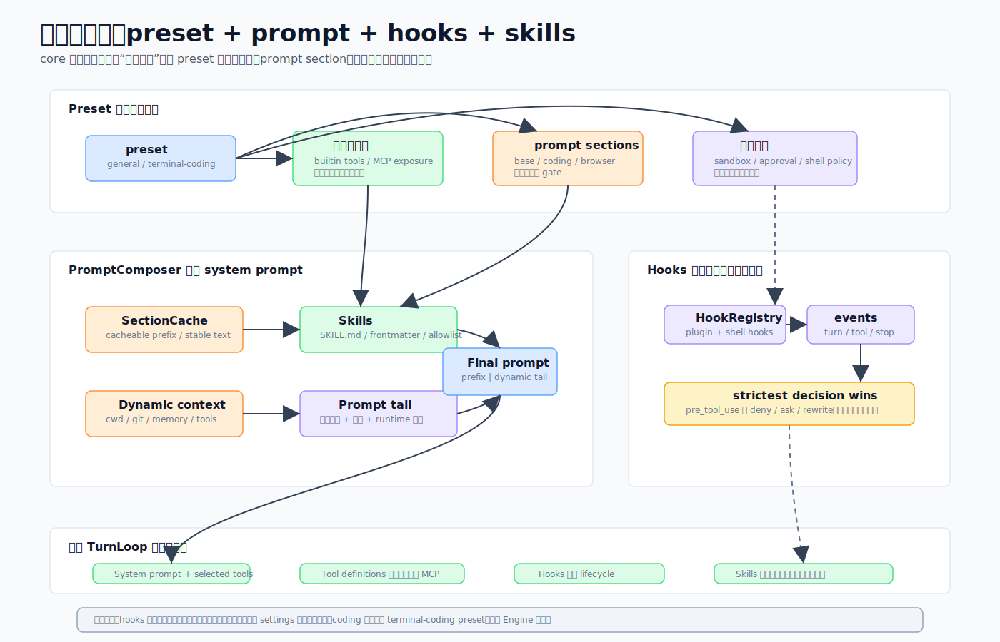

# 06 · 行为即配置:preset、prompt 拼装、hooks 与 skills

> 一句话:CodeShell 怎么做到"通用"?因为**行为是配置出来的**——preset 选系统提示段 + 工具白名单 + 权限默认,prompt 围绕缓存断点拼装,hooks 和 skills 在通用核心上层挂能力。"会写代码"是一份配置,不是一次 fork。

这一篇是整个系列"core 是通用编排核心,不是写死的 coding agent"这一立场最该正面阐述的地方。

源码主战场:`packages/core/src/preset/`、`prompt/`、`hooks/`、`skills/`。

## 1. 它解决什么问题

如果"会写代码"是写死在引擎里的,那做一个调研 agent 或运维 agent 就得 fork 一份引擎,各自维护。CodeShell 不想这样。它要的是:**同一个引擎,换一组配置就变成另一种 agent**;同时还要能让用户/项目/插件在不改核心的前提下介入行为(hooks)、挂上新技能(skills)。

## 2. Preset:把通用引擎变成具体 agent 的那一束配置

一个 `AgentPreset` 选四样东西:

```ts
interface AgentPreset {
  promptSections: readonly string[];      // markdown 提示段名
  injectGitStatus: boolean;
  builtinTools: string[];                  // 工具白名单
  defaultPermissionRules: PermissionRule[];
}
```

两个内置 preset:
- **`general`**(默认):段 `[base, orchestration, browser, tone]`,工具 `GENERAL_BUILTIN_TOOLS`,git 状态关。给调研/运维/自动化用。
- **`terminal-coding`**(CLI 默认):多加 `coding` 段和 `EnterWorktree`/`ExitWorktree`/`NotebookEdit`/`LSP`/`Brief`/`Arena`,git 状态开。

**关键:`general` 与 `terminal-coding` 的全部差别就是上面这几样配置的差别**——不是两套引擎。这就是"行为即配置"最具体的证据。

**工具白名单是执行机制**:`GENERAL_BUILTIN_TOOLS` 是精选清单,`ToolRegistry.registerBuiltins(names)` 按它过滤 `BUILTIN_TOOLS` 并**静默丢掉不在清单的工具**。这是 [03 · 工具系统](03-tool-system.md) 那个"加内置工具要改两处"坑的另一半:既要进 `BUILTIN_TOOLS` 表,也要进这份白名单,漏一处工具就静默不可见。

**工具门控的段**:`TOOL_GATED_SECTIONS` 把段映射到它需要的工具(`browser → [browser_observe, browser_act, browser_navigate]`)。没有浏览器工具激活时,`buildPresetSystemPrompt` 会丢掉 `browser` 段,让模型不读自己用不上的指令。

## 3. Prompt 拼装:围绕一个缓存断点



系统提示分两部分,围绕一个**缓存断点**:

**缓存前缀**(`buildSystemPrompt`):`runtime_header`(模型/cwd/平台/shell)→ `custom_system` → `tool_definitions`(工具名 + 一行描述,完整 schema 走 native tools 字段)→ `behavior`(preset 各段,带门控过滤)→ `append_system` → `personalization`(语言 + 用户画像)。`SectionCache` 给每段做记忆化;`behavior` 段设 `cacheBreak: true`,因为它内容随激活工具集变化。

**动态上下文(断点之后)**(`buildDynamicContextMessage`):一条 user 角色的 `<system-reminder>`,带 skills 列表 + git 状态 + 记忆索引——**放在消息数组末尾**,正因为这些在会话内会变(装个 skill、改个文件、提取条记忆),不该重新计费缓存前缀。

**指令扫描**(`scanInstructions`):从 cwd 往上走到 git 根,收集 `CODESHELL.md`/`CLAUDE.md`/`AGENTS.md`(及 `.codeshell/rules/*.md`、`*.local.md` 覆盖)和用户级文件,去重(先者胜),按 managed → user → project-root → cwd → local 排序,合成一条可缓存的 user 上下文消息。

## 4. Hooks:跨层拦截点

16 个 hook 事件覆盖整个生命周期:`on_session_start/end`、`on_agent_start/end`、`on_turn_start/end`、`pre_tool_use`、`on_tool_start`、`post_tool_use`、`on_tool_end`、`on_permission_check`、`user_prompt_submit`、`on_stop`、`post_compact`、`file_changed`、`notification`。

`HookRegistry.emit` 按优先级跑,聚合规则很严:
- **决定:最严者胜**(`deny > ask > allow`)——低优先级处理器永远不能放松高优先级的 `deny`。这是 [03](03-tool-system.md) 那条"hook 只能收紧"在 registry 层的另一半。
- **messages 追加;data 合并;updatedInput/updatedPrompt 后写胜;continueSession(on_stop)任一 `true` 就阻止终止**。

两个要记住的点:
- **hooks 是唯一的跨层数组拼接**——用户 hook + 项目 hook + 插件 hook 全跑。**这是特例,别推广**到其它设置上。插件 hook 优先级 80,设置 hook 50,SDK 0。
- **shell hook 是受信任代码**:`runShellHook` spawn 一个子进程(stdin 给 `HookContext`,stdout 收 `HookResult`,exit 2 = 拒绝且 stderr 给理由),**绕过 Bash 的权限/沙箱**——配了 shell hook 就是隐式信任它。护栏:超时(默认 60s)、输出上限、**fail-silent**(输出畸形/超时/非 2 退出都返回 `{}`,坏 hook 不崩 turn)。

## 5. Skills:轻量、可版本化的能力扩展

skills 从 `~/.code-shell/skills/`、`.code-shell/skills/` 和已装插件(`<plugin>:<name>`)发现。`scanSkills(cwd, opts?)` 记忆化全量扫描后过滤:`skillAllowlist`(硬隔离,如子 agent 用)只留列出的;`disabledPlugins` 丢 `<plugin>:*`;`disabledSkills` 丢精确名。缓存 key 折进 `userHome()`、已装插件 mtime、skills 目录 mtime——增删 skill 自动失效,但**编辑** `SKILL.md` 要显式 `invalidateSkillCache()`(安装路径会调)。目录名对 frontmatter 的 `name` 有权威。

发现的 skills 喂 `buildSkillListing`(按命名空间分组)进动态上下文消息,`Skill` 工具来派发。CodeShell **消费** CC 与 Codex 格式的 skill,目前还没有交互式的 skill 创建器。

## 6. 一张图看完整组装

```
Engine.run
  ├─ resolveAgentPreset(name)                    → AgentPreset
  ├─ resolveBuiltinToolNames(preset, ±overrides) → 工具白名单
  │     └─ ToolRegistry.registerBuiltins(names)  (丢掉非白名单)
  ├─ PromptComposer.buildSystemPrompt(tools)     → 缓存系统前缀
  │     └─ buildPresetSystemPrompt(preset, active)(门控段)
  ├─ buildUserContextMessage()                   → CLAUDE.md/AGENTS.md(可缓存)
  └─ buildDynamicContextMessage()                → skills + git + 记忆(断点之后)

每个事件 ─ HookRegistry.emit(event, data) → 聚合 HookResult(最严决定胜)
```

## 7. 这样设计的好处

- **换 agent 行为不 fork core**:改 preset/白名单/提示段即可。
- **省 token**:缓存前缀稳定、动态内容放断点后,变动的东西不重计费缓存。
- **模型不读用不上的指令**:工具门控段按激活工具裁剪。
- **可扩展且安全**:hook 能介入但只能收紧;shell hook 受信任但 fail-silent。

## 8. 源码阅读路线

1. `preset/index.ts` 看 `BUILTIN_AGENT_PRESETS` 和 `GENERAL_BUILTIN_TOOLS`——理解"行为即配置"。
2. `prompt/composer.ts` 看缓存前缀 vs 动态上下文的分界。
3. `prompt/instruction-scanner.ts` 看 CLAUDE.md/AGENTS.md 层级扫描。
4. `hooks/registry.ts` + `hooks/events.ts` 看聚合规则和 16 个事件。
5. `skills/scanner.ts` 看发现/过滤/缓存失效。

## 9. 常见误解与边界

- ❌ "core 内置了编程逻辑。" → ✅ 编程是 `terminal-coding` preset 的配置,和 `general` 的差别只是配置。
- ❌ "hooks 这种跨层拼接很多设置都这样。" → ✅ hooks 是唯一特例,别推广。
- ❌ "shell hook 也走权限审批。" → ✅ 它绕过 Bash 权限/沙箱,配了即信任,但 fail-silent。
- ❌ "在 `BUILTIN_TOOLS` 加一条工具就能用。" → ✅ 还要进 `GENERAL_BUILTIN_TOOLS` 白名单。
