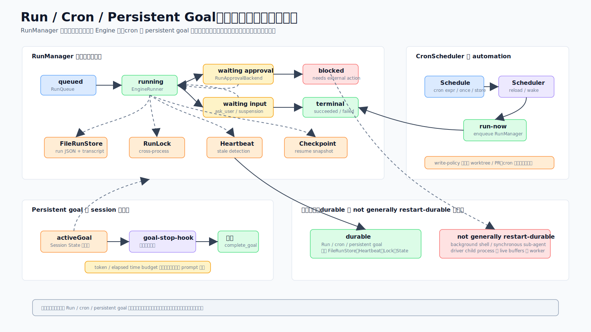

# 07 · 跑完一轮就走,回来还能续:长任务编排(Run / Cron / 持久 Goal)

> 一句话:让你"点一下、走开、回来拿一个可恢复的结果"——靠的是一个带状态机、队列、崩溃恢复、检查点、跨进程锁的 `RunManager`,一个零环境依赖的 cron 调度器,和一个能跨重启续上的持久 goal。但要分清:**只有这些明确声明持久化的子系统才跨进程重启可恢复,不是所有后台工作都这样。**

源码主战场:`packages/core/src/run/`、`automation/`、`cron/`、`engine/goal.ts`。

## 1. 它解决什么问题

交互对话是"你说一句我答一句"。但很多任务是无人值守的长活:跑一个定时巡检、让 agent 自己迭代到目标达成、半夜批处理。这类任务要:

- 中途崩了(进程被杀、机器重启)能不能恢复,而不是从头再来?
- 多个进程同时想跑同一个 run,怎么不互相踩?
- 无人值守时遇到需要审批/追问,怎么挂起等待而不是瞎放行?
- 定时任务怎么不在睡眠唤醒后疯狂补跑?
- "一直干到目标达成"怎么实现,又怎么防止无限烧钱?

## 2. 受管理的 Run 生命周期

`RunManager` 把一次 Engine run 包进一个状态机 + 队列 + 崩溃恢复 + 检查点 + 跨进程锁。

**状态机**:`VALID_TRANSITIONS` 定义合法图——`queued → running → {waiting_input | waiting_approval | blocked | completed | failed | cancelled}`,后三个是终态。每个转移都校验,终态阻止后续操作。

**为无人值守做的硬化**(图左 + 中):
- **RunLock**:对 `run.json` 的文件级建议锁(proper-lockfile,ESM 安全经 `createRequire`)。被占用就快速失败;陈旧锁(>60s)可回收。
- **Heartbeat**:每约 5s 写 `{pid, timestamp, runId}`。启动时 `RunManager.recover` 找陈旧 `running` run:死了+陈旧 ⇒ 强制解锁并重排或阻塞(≥3 次后);活着+新鲜 ⇒ 跳过(还在别处跑)。`process.kill(pid, 0)` 是存活探针。
- **原子持久化**:快照 `.tmp`+rename;JSONL 追加经一个永不 reject 的 per-file promise 锁串行化。
- **竞态守卫**:`resolvingRuns` 串行化每 run 的 resume/cancel;`RunQueue` 去重 runId 并守并发上限。

**审批挂起**(图右下):`RunApprovalBackend` 在审批处挂起引擎(24h 超时),`RunManager` 经执行句柄解决;`createRunAskUserFn` 同理处理追问,带 supersede 检查。**fail-closed:hook 没接线时审批一律拒绝,绝不自动放行。**

`EngineRunner` 把引擎包进一个 in-process `AgentServer`+`AgentClient`(所以一次 run 走和 REPL 一样的协议接缝),并往系统提示注入 `AUTOMATION_PROMPT_NOTE`("没人在看。你就是自动化,别问用户问题……")。

## 3. Automation 与 Cron

一个**零环境依赖**的调度模块——不 import 任何 Electron/Ink,不假设 GUI/TTY,所以同一份代码能跑在桌面主进程或 CLI server 里。

`startAutomation(deps)` 把调度器接到 host 提供的 store + 执行后端(有 `RunManager` 时优先用)。调度器按 job 武装定时器(interval 用 `setInterval`,cron 用算出的 `setTimeout` 每次 fire 后重武装),守重入(`running` 集合),支持 `abort(jobId)`。

几个健壮性细节:
- **错过宽限(约 90s)**:cron 定时器迟到 >90s(睡眠/唤醒),**跳过**错过的那次并重武装到下一个正确时刻——既越过 cron 的 60s 粒度,又能接住睡眠漂移。
- **一次性 job**(`once`):首次 fire 后删除——调度能力就是这样从 CC 房间专用链解耦回通用层的。
- **CronStore.mutate**:目录锁下 load-mutate-save,多进程写不互相覆盖。

### 只读契约
`write-policy.ts` 把 job 的权限档映射成一个**后端**,而非分类器规则:
- `read-only` → `HeadlessApprovalBackend("approve-read-only")`
- `workspace-write` → 批准写工具的档位后端
- `full` → 批准一切的档位后端

关键:**`permissionMode` 对所有档恒为 `"default"`**,这样分类器不会自己加规则——**档位后端是"这一档允许什么"的单一事实源**。所有档都沙箱(`auto`)跑,外部输入用 `wrapUntrustedInput` 包成 `<untrusted_input>…</untrusted_input>`(被注入的指令当数据看)。写型 job 在**新开的 git worktree** 里跑(`runWriteJobInWorktree`),产生改动就开 PR——**绝不碰用户的工作副本**。

## 4. 持久 Goal

一个 goal 就是"一直干到这个目标达成"。它是**持久的**:存在 `session.state.activeGoal`(不只是传给某一次 send),熬过打断,resume 时回灌。每次 send 的优先级:`options.goal`(替换)> 存的 `activeGoal` > 引擎默认。

`GoalConfig` 带目标 + 可选 `tokenBudget`/`timeBudgetMs`/`maxTurns`/`maxStopBlocks`(上限细节见 [02 · Engine 与 Turn Loop](02-engine-turn-loop.md) §6)。两个机制协作:

- **stop-hook 裁判**:`createGoalStopHook` 注册一个 `on_stop` 处理器,跑 **aux** 模型("目标达成了吗?还差什么?")。没达成且没到 `maxStopBlocks` 上限,就返回 `continueSession`,循环注入催继续提示并继续。run 级预算追踪器(token + 墙钟,在执行工具前查)是硬底线。
- **`complete_goal`**:模型可以主动声明目标达成,短路循环。

两者都得认为活干完了 goal 才清。`applyGoalExtension` 允许 run 中途加 turns/token/time 预算,给未设的上限按当前用量播种,让新上限落在当前消耗**之上**。

### 防自旋修复
一个跑着 goal 的 run 启了后台 job(比如 `GenerateVideo` 的轮询),过去会让模型用 `Sleep` 自旋等它。修复:`backgroundJobRegistry` 追踪非 agent 后台工作,goal 裁判的概览包含运行中的 job(让模型知道这活有限),turn loop **停泊**到完成而非自旋。这和 [05 · 协议与会话](05-protocol-and-sessions.md) 里的后台唤醒路统一。

## 5. durable 边界(请认真区分)

图里专门标了两块。**这是本篇最重要的准确性约束:**

- **Durable(可恢复)**:run 的 snapshots/events/checkpoints/approvals/artifacts、cron 的 job specs、session 的 `activeGoal`、transcript/state。这些是明确做了持久化的子系统。
- **Not generally restart-durable(一般不跨重启恢复)**:任意在飞的 model stream、外部 child process、普通工具 handler 的状态。**只有具体子系统声明了持久化才可恢复。**

换句话说:**run / cron / 持久 goal 设计为跨进程重启可恢复;但不要把这个性质推广到"所有后台任务"。** 后台 shell 与同步 sub-agent 走的是"完成时唤醒空闲引擎"的另一条路(见 [05](05-protocol-and-sessions.md)),它们绑在 worker 上,worker 重启不保留它们。

## 6. 这样设计的好处

- **真的能"走开再回来"**:状态机 + 锁 + 心跳让无人值守 run 可恢复、不重复跑。
- **定时稳**:错过宽限避免睡眠唤醒后乱补跑。
- **不伤工作区**:写型 cron 在独立 worktree 跑并开 PR。
- **goal 不烧空转**:停泊后台而非自旋,且 token/时间预算硬兜底。

## 7. 源码阅读路线

1. `run/RunManager.ts` 看 submit/resume/cancel 与 `recover`。
2. `run/types.ts` 看 `VALID_TRANSITIONS` 状态图。
3. `automation/scheduler.ts` + `cron-expr.ts` 看调度与错过宽限。
4. `automation/write-policy.ts` 看只读契约(后端即事实源)。
5. `engine/goal.ts` 看 stop-hook 裁判 + `complete_goal` 双机制。

## 8. 常见误解与边界

- ❌ "所有后台任务都能跨进程重启恢复。" → ✅ 只有 run/cron/持久 goal 等声明持久化的子系统可以;在飞 stream、外部子进程、普通工具状态不行。
- ❌ "只读档靠分类器规则限制。" → ✅ `permissionMode` 恒为 default,是档位后端在管。
- ❌ "写型 cron 会改我的工作目录。" → ✅ 它在新 worktree 跑并开 PR,不碰工作副本。
- ❌ "goal 没达成会一直空转烧钱。" → ✅ token/时间预算是硬底线,后台 job 是停泊不是自旋。
