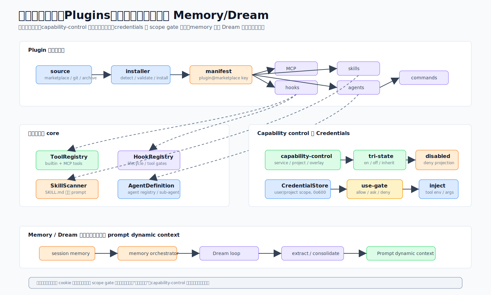

# 08 · 运行时长能力:插件、能力总览、凭证与记忆/Dream

> 一句话:这四个子系统让 CodeShell 在运行时"长出"能力——装扩展(插件)、统一投射并开关它们(能力总览)、安全地拿密钥(凭证)、跨会话记住事情(记忆 + Dream)。

源码主战场:`packages/core/src/plugins/`、`capability-control/`、`credentials/`、`session/memory.ts`、`services/dream-consolidation.ts`。

## 1. 它解决什么问题

一个通用 agent 内核,要能让别人往里加东西而不改核心:第三方插件带来的 hooks/MCP/agents/skills 怎么装、怎么加载、怎么开关?这么多能力来源(内置工具、MCP、skills、插件、agents)怎么给用户一个统一的"能力总览"去管?agent 要访问需要密钥的服务,密钥怎么存得安全、用得受控?跨会话怎么记住有用的事实而不污染?

## 2. 插件

CodeShell 能从市场、git、GitHub 或上传的压缩包装 **CC 与 Codex 两种格式**的插件,再把它们的 hooks/MCP/agents/skills/commands 加载进运行时。

**格式判定**:`detectPluginFormat` 是二元的——有 `.codex-plugin/plugin.json` 就是 Codex,否则 CC。CC 插件基本原样拷贝;Codex 插件做转换(`${CLAUDE_PLUGIN_ROOT}` 改写成 `${CODESHELL_PLUGIN_ROOT}`)。Codex 的 commands/prompts 转换目前还是缺口。

**安装流程**(`installPlugin` → `materialize`):解析市场清单,物化源(path/git/github/git-subdir,声明了 SHA 就校验),改写变量,把一条 `PluginInstallEntry` 追加进 `~/.code-shell/plugins/installed_plugins.json`(键是不可变的 `plugin@marketplace`)。卸载用 `resolveSafePluginPath` 守(realpath + 严格包含),防被篡改的清单 `rmSync` 到缓存外。

**hook 注册**(`loadPluginHooks`):把 CC 的 PascalCase 事件映射成 snake_case(`PreToolUse → pre_tool_use`),优先级 80 注册,支持两种禁用粒度——`disabledPlugins`(整个插件)和 `disabledPluginHooks`(按 `pluginHookKey(plugin:event:command)` 单条,跨重装稳定)。

**安全:git 参数注入**。`gitOps.ts` 在任何用户/清单/远程值前一律加 `--`(`["ls-remote", "--", url, ref]`),因为形如 `--upload-pack=<cmd>` 的 URL 否则会被当 flag 执行——这是 RCE。**任何**喂外部值的 git 子进程都适用这条。

官方市场种子是 `cjhyy/mimi-plugins`,首启经 `bootstrap-core-plugins` 软预装。上传压缩包安装(`installPluginFromArchive`)支撑桌面的"上传 zip"入口。

## 3. 能力控制

一个对四类扩展加载器(内置工具、MCP、skills、插件、agents)的统一**只读投射**,带三态项目覆盖。这是桌面"能力总览"的后端。

每个 `CapabilityDescriptor` 内联一个 `control`(`{settingsKey, mode, token}`),让服务把开关路由到正确的 key(`denylist`/`allowlist`/`record-flag`),不用按 `kind` 分支。项目覆盖是**三态**(`on`/`off`/`inherit`),未合并读取以便继承生效;所有消费者都折进 `computeEffectiveDisabledLists` 保持一致。

一个有意思的设计:no-repo 的"对话"作用域把 skills/plugins **反转成白名单**(默认全关,只有显式 `on` 的活下来)——这就是纯聊天项目怎么关掉 `superpowers` 一类的。agents 也在这投射(折叠时别忘 `readDisabledAgents`)。

## 4. 凭证

一个两作用域(user/project)的 `token`/`link`/`cookie` 凭证库,带掩码、审批门、安全的 cookie 物化。

一个 `Credential` 带 `id`/`type`/`label`/`secret`,可选 `exposeAsEnv`/`autoUseByAI` 和 cookie `meta`。设计不变量:
- **两作用域**镜像设置:项目作用域看不到宿主用户的凭证(SDK 嵌入安全)。
- **掩码列表**:list 只回最后 4 位提示,完整明文永不离库。
- **0o600 文件**:owner-only,temp+rename 写。
- **三档门**(图右下):auto-approve(全局或 per-credential `autoUseByAI`)→ 会话记忆(内存,per `sessionId`)→ 交互询问("一次"/"本会话"/"拒绝")。Headless ⇒ 拒绝(`no-ui`)。
- **cookie 物化**:解析成唯一的 Netscape `cookies.txt`(0o600),作为路径返回给 `yt-dlp --cookies`/`curl -b`;陈旧文件启动时清扫。多账号 cookie 按域 key。

> **现状提醒**:`safeStorage` 加密(R-2)**暂缓**——当前是 0o600 明文,**不要写成"已加密"**。卡点是读 secret 的代码在 core worker,而 safeStorage 钥匙在桌面 main,core 拿不到;正解是 core 只认一个 `EncryptionCipher` 接口由 host 喂钥匙。

## 5. 记忆与 Dream

### 记忆(`session/memory.ts`)
跨会话记忆是 `~/.code-shell/<scope>/`(`user`/`dream`/`pending`)下的 markdown 文件,每个 scope 有个 `MEMORY.md` 索引。一个 `MemoryEntry` 带 frontmatter(`name`/`description`/`type`/`pinned?`/`origin?`/`usageCount`/`created`/`lastUsed`)。`MemoryManager`:
- **软删**到 `memory-trash/<ISO>/<scope>/`(可恢复)。
- **pinned 条目**免老化过滤,注入时排最前。
- **生命周期字段**驱动 TTL(`pruneByRecall`)和 UI 召回打分;`origin: "auto"` vs `"manual"` 区分自动提取与人工策展。
- **`buildInjectionIndex`** 把全局 + 项目 scope 合并成每轮注入的紧凑索引(完整正文按需经 `MemoryRead` 取)。
- **pending 审批**:自动提取的条目落 `pending`;`approvePending` 升到全局 user scope,`demotePending` 路由回原项目。

### Dream consolidation(`services/dream-consolidation.ts`)
`runDreamConsolidation` 是一个离线、headless 的 LLM 工具调用循环(最多 8 轮),清理 `dream` scope——去重、合并、删陈旧、改进描述。它**结构性沙箱化**:只允许 4 个记忆工具,写只限 `dream` scope(没有交互 UI 批准 user-scope 写),写预算上限 10,reasoning 关。每约 5 会话 / 24h 自动触发或手动跑。

记忆 + Dream 一起看:静态的 `~/.code-shell/{user,dream}` 文件每轮注入;写来自手动保存 + 会话结束自动提取(≤2 条);Dream 是 LLM 清理那一遍。CodeShell 的 Dream 更接近 Codex 的 consolidation 而非 CC 的 auto-memory。更大的记忆生命周期重设计(状态机/完成态语义/确认流)被标为刻意的未来项目,不零敲碎打。

## 6. 这样设计的好处

- **扩展能力不动 core 主体**:插件/skills/MCP/agents 走统一加载与只读投射。
- **管理一致**:能力总览一处开关,三态覆盖支持继承。
- **嵌入安全**:凭证两作用域,project 看不到宿主 secret。
- **记忆可控**:软删可恢复、pinned 免老化、自动提取走 pending 审批、Dream 受限清理。

## 7. 源码阅读路线

1. `plugins/pluginInstaller.ts` + `loadPluginHooks.ts` 看装载与 hook 注册。
2. `plugins/gitOps.ts` 看 `--` 防注入(短小值得读)。
3. `capability-control/service.ts` + `overlay.ts` 看只读投射与三态。
4. `credentials/use-gate.ts` 看三档门。
5. `session/memory.ts` + `services/dream-consolidation.ts` 看记忆与 Dream。

## 8. 常见误解与边界

- ❌ "cookie 已加密存储。" → ✅ R-2 暂缓,现状 0o600 明文。
- ❌ "git 子进程拼个 URL 没风险。" → ✅ 不加 `--` 会被 `--upload-pack=` 利用成 RCE。
- ❌ "SDK 嵌入时能拿到宿主所有凭证。" → ✅ project 作用域看不到 user scope。
- ❌ "Dream 会乱改 user 记忆。" → ✅ 它只写 dream scope,有写预算上限。
