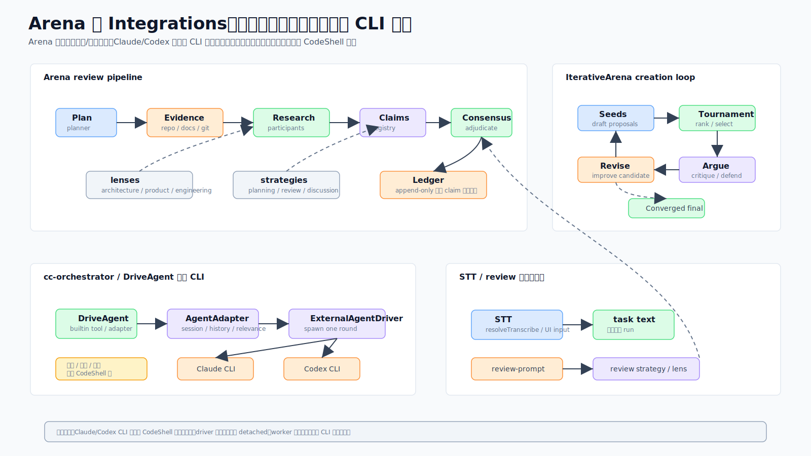

# 09 · 多模型对垒与外部 CLI 编排:Arena 与 cc-orchestrator

> 一句话:Arena 让多个模型针对一个问题"对垒"——要么评审一个产物,要么协作创作一个产物;cc-orchestrator 让 CodeShell 当**外部编排器**,把 `claude` 和 `codex` 两个 CLI 当黑盒子进程来驱动。

源码主战场:`packages/core/src/arena/`、`cc-orchestrator/`,以及更小的集成面 `stt/`、`review/`、`external-agents/`。

## 1. 它解决什么问题

单个模型有盲区。两个现实需求:
- 想让多个模型互相质证一个结论(评审),或互相竞争产出更好的草稿(创作)——但要有结构、可追溯,而不是一锅乱炖。
- 想复用已经很强的现成 CLI(Claude Code、Codex)当子能力,但又要由 CodeShell 这一层统一掌控时序、循环、审批——而不是把调度逻辑散到各家 CLI 里。

## 2. Arena:最大的单一子系统

Arena 跑**多个模型**,两种模式:
- **Arena** —— **评审**一个已有产物,走证据驱动的 claim 管线。
- **IterativeArena** —— **创作**一个产物(代码、PRD、设计稿),走锦标赛 → 批评-修订环。

记一句话就够:**用 Arena 来评审,用 IterativeArena 来创作。**

### 评审模式
阶段按序跑:**Plan**(一次 LLM 调用产出 `ArenaPlan`:模式/lens/来源)→ **Evidence**(并行的上下文 provider:git/repo/docs/web,各 8s 超时)→ **Strategy/Tools**(按来源选只读工具包)→ **Research**(每个参与者出 dossier)→ **Claims**(把发现提升成可追踪的 claim)→ 辩论/裁决 → **Consensus**。

**claim 生命周期**是一个 append-only 状态机:`proposed → under_review → {verified | contested | rejected | unresolved}`,终态无出边。`resolveClaimStatus` 是确定性的:"反对/需要证据"的挑战 → `contested`;"同意" → `verified`。`ArenaLedger` 是 append-only、带索引的 dossier/packet/claim/challenge/裁决存储;`buildDigest` 把一轮的相关切片格式化成可注入 prompt 的 markdown(清洗 + 限长)。

**Lenses**(工程/产品/架构/通用)用角色 + 标准包住基础策略,让同一套评审机器对准不同关注点。

### 创作模式
一个锦标赛产出 v1 草稿(多作者或单作者),然后 argue/revise 轮并行跑批评者,查收敛(`diffRatio`),可选在人工检查点暂停,再修订——作者轮转,默认最多 5 轮。格式包(`iterate/formats/`)提供代码 vs 文档的约定。

关键不变量:append-only ledger(查询返回最新视图);verify/debate 阶段用只读工具包;`AbortSignal` 穿过每个异步阶段。

## 3. cc-orchestrator:CodeShell 当外部编排器

把 `claude` 和 `codex` CLI 当黑盒子进程来驱动。

**铁律**:CC/Codex 侧**没有任何**时间/调度/循环逻辑——所有定时、重试、审批回路、多 agent 工作流都在 codeshell 层。**一次 driver 调用跑一轮就退**;由 codeshell 决定要不要循环、何时循环、带什么上下文循环。

- **`claudeAdapter`**:`-p <prompt> --output-format stream-json --verbose [--resume id] --disallowedTools Workflow`。它禁掉 `Workflow`(舰队式 fan-out = token 黑洞),但留着单子 agent 的 `Task`,并附一段成本守卫提示。`parseResult` 从 JSONL 流读 `session_id`/result/`is_error`。
- **`codexAdapter`**:prompt 走 **stdin**(argv 以裸 `-` 结尾),不是 `-p`;权限档映射成沙箱模式(`default → read-only`,`acceptEdits → workspace-write`,`bypassPermissions → dangerously-bypass-…`)。JSONL 事件 schema 不同(`thread.started`/`item.completed`/`turn.failed`)。有个 resume 参数顺序坑(`--json` 应在 id 之后)。

`runAgentOnce` spawn 子进程是**非 detached**(绑 worker——detached 子进程在重启间被孤儿化曾导致"后台任务再没返回"的 bug),并给 macOS GUI Electron 预置 PATH。有两条独立参数的 spawn 路径:全自动 `DriveClaudeCode`(默认后台、bypass、`--disallowedTools Workflow`)vs CC 房间(stdio 审批回路)。AskUserQuestion 协议要求答案塞进 `updatedInput.answers`(key=问题文本,value=label)——自动放行会报"did not answer"。

> 呼应 [07 · Run/Automation/Goal](07-run-automation-goal.md) 的 durable 边界:这些外部 child process **不属于**跨进程重启无损恢复的那一类。

## 4. 更小的集成面

- **语音转文字(`stt/`)**:`transcribe` 把多段音频 POST 到 OpenAI-compatible 的 `/audio/transcriptions`(Whisper/Groq/自托管)。`resolveTranscribeProvider` 从设置选,并能回退复用一个 OpenAI 系凭证,零额外配置就能听写。**语音输入是纯 UI——它往输入框填字,不是 agent 工具**(对齐 Codex)。
- **代码评审(`review/`)**:`buildReviewPrompt` 按 `ReviewDimension`(安全/性能/可读性/正确性)组装评审提示,带 P0–P3 优先级指引和可选 JSON 模式(给 CI)。支撑 `/review` 流。
- **外部 agent 配置(`external-agents/`)**:`resolveExternalAgentConfig` 给 `externalAgents` 设置块套默认值。`claudeCode.trustedWorkspaces` 是**房间(Room)的权限来源**——它决定谁能自动跳过审批回路。

## 5. 这样设计的好处

- **多模型有结构**:claim 管线 + append-only ledger 让多模型推理可追溯、可裁决,而非乱炖。
- **换 lens 即换关注点**:同一套评审机器对准工程/产品/架构。
- **外部 CLI 可换可并可循环**:黑盒驱动 + 时序全在 codeshell 层,driver 只跑一轮。
- **集成轻量**:STT 当纯 UI、review 复用 prompt 组装,不往核心塞特例。

## 6. 源码阅读路线

1. `arena/arena.ts` 的 `Arena.run` 看评审阶段编排。
2. `arena/transitions.ts` + `ledger.ts` 看 claim 状态机与账本。
3. `arena/iterate/iterative-arena.ts` 看创作环。
4. `cc-orchestrator/agent-adapter.ts` 看 `claudeAdapter`/`codexAdapter` 命令构造与解析。
5. `cc-orchestrator/external-agent-driver.ts` 看 `runAgentOnce` 的非 detached spawn。

## 7. 常见误解与边界

- ❌ "Arena 和 IterativeArena 差不多。" → ✅ 前者评审,后者创作,分工明确。
- ❌ "CC/Codex 侧会自己循环/定时。" → ✅ 它们跑一轮就退,时序全在 codeshell 层。
- ❌ "外部 CLI 子进程崩了能跨重启恢复。" → ✅ 非 detached 绑 worker,不在 durable 那一类。
- ❌ "语音输入是个 agent 工具。" → ✅ 纯 UI,只填输入框,不自动发。
