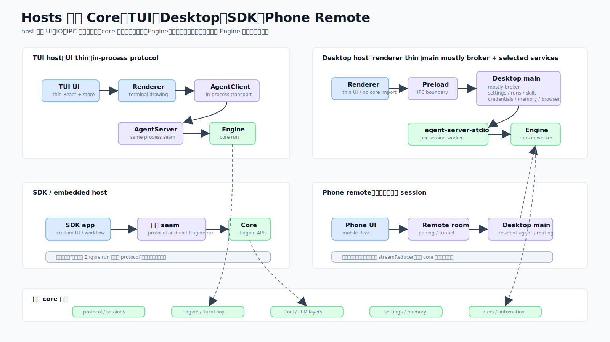

# 11 · 主进程只当经纪人:桌面/手机宿主与 CDP 浏览层

> 一句话:桌面端的关键架构是三进程——**Electron 主进程当 IPC 服务经纪人,它不在自己这个进程里跑 Engine;真正跑 Engine 的是被它 spawn 的、每会话一个的 core worker 子进程**;renderer 是不 import 任何 core 代码的薄 React 客户端。手机遥控复用同一套 React/reducer。

本篇也属"宿主层"。源码主战场:`packages/desktop/`、`packages/cdp/`。

## 1. 三进程模型



看图右侧那块:**Renderer(thin React client)| Electron main(mostly broker + selected services)| core worker: Engine | Phone WS**。

```
┌──────────────────────────────────────────────────────────────┐
│ Electron Main(src/main/index.ts)                              │
│  ipcMain 服务层 · spawn worker · 提供 files/term/creds/        │
│  browser-host/memory/automation/updater/mobile-WS              │
└───────────┬───────────────────────────────┬────────────────────┘
   stdio JSON-RPC                       ipcMain send/on
┌───────────▼────────────┐      ┌───────────▼──────────────────┐
│ Worker(agent-server-   │      │ Renderer(React 19 + shadcn    │
│ stdio):Engine、turns、 │      │ + Tailwind v4)—— 不 import     │
│ StreamEvents           │      │ core;只用 window.codeshell.*  │
└────────────────────────┘      └───────────────────────────────┘
```

> **准确性约束(本篇最重要)**:桌面**主进程**是 IPC 服务经纪人,**它不在自己这个进程里跑 `Engine`**;它 per-session spawn 一个 `agent-server-stdio` **worker 子进程**,`Engine` 在那个 worker 里运行。如图标注,main 是 "mostly broker + selected services"。**不要写成"desktop main 绝不运行 Engine"这种强断言**——Engine 确实在桌面体系内、在本机 worker 子进程里运行;准确的说法是"当前正常 run path 由 worker 持有 Engine"。措辞要落在**哪个进程**,而非"跑不跑"。

- **worker spawn**(`main/agent-bridge.ts`):`agent/run` 时 `spawnChild(cwd)` 以 `ELECTRON_RUN_AS_NODE=1`(Electron 二进制当 Node 跑)启动 core stdio server。崩溃追踪:60s 内重启 3 次 ⇒ "gave_up"。会话快照熬过 worker 退出,重挂可重放。
- **preload RPC**:`rpc()` 有 30s 超时——**除了 `agent/run` 传 0(无超时)**,长 turn 不被杀。worker 死掉 reject 待处理调用;卡住的 worker 由用户的 Stop 按钮处理。

隔离由构建强制:renderer **不能** import `@cjhyy/code-shell-core`(Vite alias),main 不能 import React/DOM(esbuild node 平台),preload 仅做无状态传输。

## 2. 主进程服务

约 60 个服务模块,代表性的一片:`agent-bridge.ts`(worker spawn、stdio 管道、事件路由、`__browser_action__`/`__credential_action__` 拦截)、`desktop-services.ts`(git/files/terminal/undo)、`pty-service.ts`(node-pty 终端)、`credentials-service.ts` + `credentials-login/`(cookie 捕获、OAuth 登录窗)、`browser-driver/`(CDP 实现 core 的 `BrowserBridge`)、`mobile-remote/`(手机遥控 WS host、房间、配对、可选 Cloudflare 隧道)、`automation-service.ts`、`sessions-service.ts`/`runs-service.ts`、`settings-service.ts`(也拿共享 lockfile,防 worker + main 互相覆盖 `settings.json`)、`plugins/marketplace/skills` 一组、`memory/dream` 一组、`updater.ts`/`menu.ts` 等。

一条反复出现的纪律:**main 必须避免同步 fs(`cpSync` 等)**——它阻塞事件循环冻结 UI。

## 3. Renderer

React 19 + shadcn/ui + Tailwind v4。`App.tsx` 按 `sessionId` 把 `StreamEvent` 路由进每会话桶并驱动一个 reducer。界面面:
- **Chat**:流式、图片附件、引导/队列模型(队列 = 不打断的步间插入;"steer" = 打断重发,见 [02](02-engine-turn-loop.md))。
- **面板坞**:只读 **Files**、**Browser**(CDP,选区 anchor 同步)、交互 **Terminal**(node-pty)、**Diff/Review**,加一个后台 shell 面板。
- **连接与目录**(provider/模型全 CRUD、按公司复用 key)、**扩展/市场**、**自动化**、**持久目标**、**记忆管理**(pin/编辑/清空、手动 Dream)、**hooks** 配置、**i18n**(zh/en)。
- 命令面板 ⌘K、跨项目会话搜索 ⌘P、transcript 内 ⌘F;onboarding 向导、信任门、应用更新器。

**共享 `streamReducer`**(`renderer/lib/streamReducer.ts`)被桌面和手机**两端**用,保持 CC 渲染一致。UI 约定:`DialogProvider`(`useConfirm`/`useAlert`/`usePrompt`,禁原生弹窗)和 `ToastProvider`。调试"点了没反应"先疑陈旧 `out/` bundle 再查源码。

## 4. 手机遥控

同一份 React 代码的另一个 Vite 构建(无侧栏、全聊天区),由主进程经本地 WebSocket 服务、QR 配对(设备 token + 桌面 token)接入。它复用 `streamReducer`、`MessageStream`、composer/工具/审批组件。**房间(Rooms)**(`mobile-remote/room-manager.ts`、`resident-agent.ts`、`codex-room-agent.ts`)是长命的 stream-json 会话,持久在 `~/.code-shell/mobile-remote/rooms/`,经 WS 镜像到手机;审批请求经 `ApprovalBridge` 同时路由到桌面和手机。可选公网隧道(Cloudflared)默认关、由访问口令把守。CC/Codex 房间按设备 key,不是房间累积。

## 5. CDP 浏览层(`packages/cdp/`)

一个**环境无关**的 CDP 浏览器动作层,零运行时依赖、**不用 Playwright**。`CdpActionsDriver` 是**无状态**的——只接一个注入的 `CdpSender = (method, params) => Promise<unknown>`。它暴露 `snapshot()`/`clickNode()`/`typeNode()`/`pressKey()`/`scroll()`/`waitSelector()`/`extractContent()`,从原始 `Accessibility.getFullAXTree` 节点工作,派发**真实**输入事件(`isTrusted: true`,非合成 JS)。上限:内容 12KB、链接 200、图片最大 1568px。

桌面适配器(`main/browser-driver/electron-cdp.ts`)把 `webContents.debugger.sendCommand` 包成 `CdpSender`,`cdp-driver.ts` 实现 core 的 `BrowserBridge`(浏览器工具见 [03](03-tool-system.md))。worker 在 stdout 发 `__browser_action__` 行,`agent-bridge` 拦截(不转给 renderer)、经 driver 执行、把回复写回 worker 的 stdin。

## 6. 构建

桌面有**自己**的构建与 typecheck,根的检查不覆盖它:`build:main`/`build:preload` 经 esbuild(ESM main、CJS preload),`build:renderer`/`build:mobile` 经 Vite;typecheck 是 main+preload 加一个 mobile tsconfig。node-pty 按 Electron ABI 重编并 `asarUnpack`(不能在 asar 里),renderer Vite 产物也在 asar 外;`webviewTag` 为内嵌浏览器开启。

## 7. 这样设计的好处

- **崩溃隔离**:worker 崩了能重启、能重放快照,不拖垮整个 App。
- **三层物理隔离**:renderer/main/preload 各管一段,由构建强制,边界清晰。
- **两端共用**:桌面与手机共用 `streamReducer`,CC 渲染一致。
- **浏览层可移植**:CDP 层零依赖、无 Playwright、无状态,易测易复用。

## 8. 源码阅读路线

1. `src/main/index.ts` + `main/agent-bridge.ts` 看经纪人与 worker spawn。
2. `src/preload/index.ts` 看 30s 超时豁免 `agent/run`。
3. `src/renderer/App.tsx` + `renderer/lib/streamReducer.ts` 看事件路由与共享 reducer。
4. `src/mobile/` + `mobile-remote/room-manager.ts` 看手机房间。
5. `packages/cdp/` 看无状态 CDP driver。

## 9. 常见误解与边界

- ❌ "desktop main 绝不运行 Engine。" → ✅ main 不在**自己进程**里跑,但它 spawn 的 worker 子进程里跑着 Engine;说法应落在"哪个进程"。
- ❌ "renderer 直接 import core。" → ✅ 构建禁止;renderer 只用 `window.codeshell.*`。
- ❌ "浏览自动化用 Playwright。" → ✅ 用环境无关的 CDP 层,无 Playwright。
- ❌ "桌面构建跟着根 typecheck 一起过。" → ✅ 桌面有独立构建与 typecheck。
