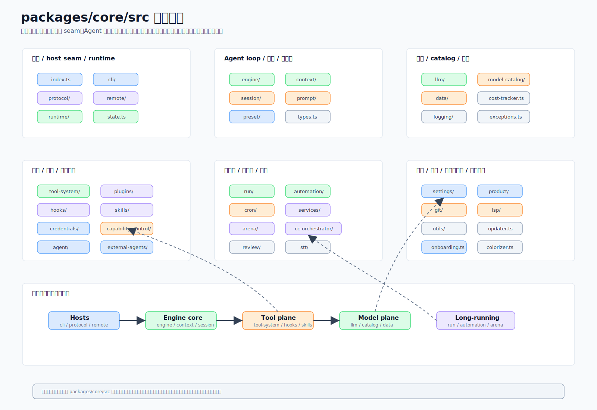

# 12 · 把地图拼完整:模块全景、跨切面与延伸阅读

> 一句话:前 11 篇是一块块拼图,这一篇把它们拼成一张完整地图,并补上散落在各篇之外、却 underpin 一切的跨切面(设置、onboarding、运行时、磁盘布局),最后给一份"想深入哪块去读哪篇"的导航表。

源码主战场:`packages/core/src/` 全局,重点 `settings/`、`onboarding.ts`、`runtime/`、`utils/`,以及磁盘布局 `~/.code-shell/`。

## 1. 模块全景



把整个 core 按职责聚一下类,大致是这几束(对应前面各篇):

- **引擎核心**:`engine/`、`context/` —— turn loop 与上下文压缩(见 [02](02-engine-turn-loop.md))。
- **工具与安全**:`tool-system/` —— 注册表/executor/权限/路径/沙箱/MCP(见 [03](03-tool-system.md))。
- **模型层**:`llm/`、`model-catalog/` —— tag → 客户端、能力 RULES(见 [04](04-llm-model-layer.md))。
- **协议与会话**:`protocol/`、`session/`、`state.ts` —— RPC 接缝与持久化(见 [05](05-protocol-and-sessions.md))。
- **行为配置**:`preset/`、`prompt/`、`hooks/`、`skills/` —— 行为即配置(见 [06](06-presets-prompt-hooks-skills.md))。
- **长任务**:`run/`、`automation/`、`cron/`、`engine/goal.ts` —— Run/Cron/持久 Goal(见 [07](07-run-automation-goal.md))。
- **运行时长能力**:`plugins/`、`capability-control/`、`credentials/`、`session/memory.ts`、`services/`(Dream)(见 [08](08-plugins-capabilities-credentials-memory.md))。
- **多模型与集成**:`arena/`、`cc-orchestrator/`、`stt/`、`review/`、`external-agents/`(见 [09](09-arena-and-integrations.md))。
- **跨切面**(本篇补完):`settings/`、`onboarding.ts`、`runtime/`、`utils/`、`data/`。

## 2. 跨切面:underpin 一切的几块

这几块不归属某一篇,却被每篇用到。

### 设置(`settings/manager.ts`)
**合并顺序**:managed < user < project < local < flags(右边覆盖左边)。`SettingsScope` 控制读哪几层:
- `"full"`(host 终端,含 `~/.code-shell`)
- `"project"`(默认;只 project+local —— SDK 隔离)
- `"isolated"`(仅 flags)

`agent.*` 块(`preset`、`enabledBuiltinTools`/`disabledBuiltinTools`、`customSystemPrompt`、`appendSystemPrompt`、`responseLanguage`、`userProfile`)经 `personalizationFrom` 喂给引擎。配置带版本(`CURRENT_CONFIG_VERSION`)+ `migrate-config.ts` 迁移。**热重载**骑 `Configure({reloadSettings})` → 每个活跃会话在 turn 边界 `refreshRuntimeConfig`;但**内置工具集变更仍需重启会话**。

### Onboarding(`onboarding.ts`)
首启 key 检测(`detectEnvKeys` + `sanitizeApiKey`)、按 key 前缀推断 provider、乐观 key 校验、从 `data/model-metadata.json` 播种模型池(PROVIDERS、已知 max output/context)——**模型数据外移**,更新模型数据不必重编代码。

### 运行时(`runtime/`)
worker 进程的子进程层:`BackgroundShellManager`(detached、自有 pgid、8MB `RingFile` 输出上限、孤儿回收),`spawn-common.ts`(env 允许列表 + deny 正则,丢掉 `*KEY*/*TOKEN*/*SECRET*…`),`killProcessGroup` 守卫到 `pgid > 1`(移掉这守卫曾把 test runner SIGKILL 掉)。

### 磁盘布局(`~/.code-shell/`)
测试经 `CODE_SHELL_HOME`/`userHome()` 隔离,**永不用裸 `homedir()`**(否则写真实 `~/.code-shell`):

```
settings.json · settings.managed.json · credentials.json(0o600) · cron.json
model-catalog.user.json · auto-dream-state.json
sessions/<id>/{state.json, transcript.jsonl, file-history/}
session-memories/ · memory/ · memory-trash/ · dream/
runs/<id>/{run.json, events.jsonl, checkpoints/, approvals/, artifacts/, heartbeat}
plugins/{installed_plugins.json, known_marketplaces.json, cache/, marketplaces/}
logs/ · bg-shells/ · cache/models/ · mcp_images/ · agents/ · skills/
```

## 3. 全系列设计哲学回顾

把 [01](01-core-overview.md) 的四个词在读完全系列后再回看一遍,会更具体:

- **Core First / 行为即配置**:`general` 与 `terminal-coding` 只是配置差别([06](06-presets-prompt-hooks-skills.md));"会写代码"不是写死的本质。
- **Secure by Default**:工具走单一 executor、永不抛错、hook 只能收紧([03](03-tool-system.md));路径策略 realpath 防逃逸;凭证三档门([08](08-plugins-capabilities-credentials-memory.md))。
- **Long-running Ready**:run/cron/持久 goal 的可恢复状态机([07](07-run-automation-goal.md));后台完成唤醒空闲引擎而非轮询([05](05-protocol-and-sessions.md))。
- **一套引擎三张脸**:TUI([10](10-tui-host.md))、桌面/手机([11](11-desktop-mobile-host.md))、SDK 共用同一引擎,经协议接缝消费。

## 4. 全系列必须守住的准确性边界(汇总)

读到这,这四条应该已经反复出现——它们是全系列的红线:

1. **不要把"所有 `Engine.run` 都经 protocol"写成绝对**:协议接缝是 host 主路径;SDK/子 Agent/专用 runner 有直接嵌入 Engine 的路径(见 [05](05-protocol-and-sessions.md))。
2. **不要把"所有后台任务跨进程重启可恢复"普适化**:只有 run/cron/持久 goal 等声明持久化的子系统可以;在飞 stream、外部子进程、普通工具状态不行(见 [07](07-run-automation-goal.md))。
3. **不要把"desktop main 绝不运行 Engine"写成强断言**:main 不在**自己进程**跑,但它 spawn 的 worker 子进程里跑着 Engine;说法落在"哪个进程"(见 [11](11-desktop-mobile-host.md))。
4. **core 是通用 Agent 编排内核,不是写死的 coding agent**:全系列基调。

另有几条事实红线:R-2 cookie 加密暂缓(0o600 明文)、Windows 沙箱降级为 off、加内置工具要改两处、Gemini 仅 AI-Studio key、hooks 是唯一跨层数组拼接特例。

## 5. 源码导航表("想深入 X 去读哪")

| 想深入 | 顶层目录 | 对应文章 | 对应架构文档 |
|--------|----------|----------|--------------|
| 公共 API | `index.ts` | [01](01-core-overview.md) | `docs/architecture/00-overview.md` |
| turn loop / 上下文 | `engine/`、`context/` | [02](02-engine-turn-loop.md) | `01-engine-and-turn-loop.md` |
| 工具 / 权限 / 沙箱 | `tool-system/` | [03](03-tool-system.md) | `02-tool-system.md` |
| 模型 / catalog | `llm/`、`model-catalog/` | [04](04-llm-model-layer.md) | `03-llm-and-model-layer.md` |
| 协议 / 会话 | `protocol/`、`session/` | [05](05-protocol-and-sessions.md) | `04-protocol-and-sessions.md` |
| preset / prompt / hooks / skills | `preset/`、`prompt/`、`hooks/`、`skills/` | [06](06-presets-prompt-hooks-skills.md) | `05-presets-prompt-hooks-skills.md` |
| run / cron / goal | `run/`、`automation/`、`cron/` | [07](07-run-automation-goal.md) | `06-long-running-orchestration.md` |
| 插件 / 能力 / 凭证 / 记忆 | `plugins/`、`capability-control/`、`credentials/`、`session/memory.ts` | [08](08-plugins-capabilities-credentials-memory.md) | `07-plugins-capabilities-credentials-memory.md` |
| Arena / 集成 | `arena/`、`cc-orchestrator/`、`stt/`、`review/` | [09](09-arena-and-integrations.md) | `08-arena-and-integrations.md` |
| TUI 宿主 | `packages/tui/` | [10](10-tui-host.md) | `09-tui.md` |
| 桌面/手机/CDP 宿主 | `packages/desktop/`、`packages/cdp/` | [11](11-desktop-mobile-host.md) | `10-desktop-and-mobile.md` |
| 跨切面 / 模块地图 | `settings/`、`onboarding.ts`、`runtime/` | 本篇 | `00-overview.md`(末段) |

> 本系列是 `docs/architecture/` 的科普重写版:**事实以架构文档与当前源码为准**;架构文档有精确 `file:line` 锚点,可在那查具体行号(行号会漂移,以源码为准)。

## 6. 读到这之后

如果你打算改 core,记住 [01](01-core-overview.md) 的边界契约:**core 只装机制不装策略**。新东西过三问——是机制还是策略?能不能外移成数据/配置?会不会破坏某条不变量(成对、fail-closed、单一收口、durable 边界)?把这几问过一遍,大概率不会走偏。
