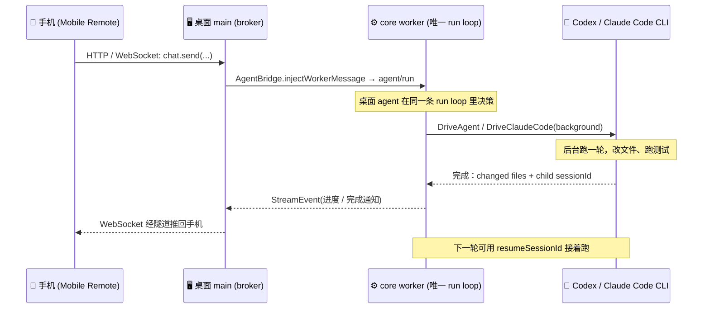
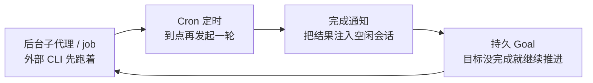

# 我写了一个「奴隶主」，再也不用焦虑 Codex / CC 额度没用完了

> 系列定位：不讲“怎么用某个 AI 工具”，而是把一个真实的、正在开发的通用 Agent 编排框架 **CodeShell** 拆开，讲清楚一个能被手机遥控、能在后台无人值守拿着鞭子抽 Codex / Claude Code 干活的 Agent，它的“运行壳”到底是怎么搭出来的。
>
> 本篇是引子：先用一个高共鸣场景（订阅额度总用不完）把整套系统的骨架摆出来，后面五篇再逐层深潜。


## 楔子：我需要一个包工头

最近用 Codex 和 Claude Code，体感一天不如一天：

- **Codex 越来越慢**，一个任务能磨蹭半天。
- **Claude Code 时不时抽风**，回复里冒出韩语、日语，工具调用失败卡在那不动。
- **额度刷新永远赶不上趟**：白天忙、晚上累，等想起来用，`7d` 窗口都快到刷新点了，额度还剩一大半——然后清零。

问题从来不是“模型不够聪明”，而是**没有一个盯着它们、催着它们、出问题就重来的人**。我要的不是又一个聊天框，而是一个**包工头**：我把活儿列好，它拿着鞭子去抽 Codex 和 CC，一轮轮干，干砸了重来，干完了通知我。人不在，活照跑。

于是就有了这篇的主角——CodeShell 里那条「手机遥控 + 后台挂机 loop」的链路。**昨晚任务其实不算多，它抽了 Codex 一整晚，也才用掉 5% 的额度**——但那 5% 是实打实产出的，而不是躺在账户里等清零。

下面就从这个场景，一路拆到它背后的架构。

## 🗺️ 全系列路线图

```
CodeShell 架构解析（通用 Agent Harness 视角）
┌────────────────────────────────────────────────────────────┐
│  开篇 ✅   Feature Tour     手机遥控 × 挂机榨干额度           │
│  第一篇 🧠 Core as Harness  为什么 core 是通用编排内核        │
│  第二篇 🔁 Engine/TurnLoop  一次任务如何变成多轮状态机        │
│  第三篇 🛡️ Tool & Security  模型动手前必须穿过的统一管线      │
│  第四篇 📚 Model/Context    模型调用到长期上下文与记忆        │
│  第五篇 🕸️ Protocol/Hosts   多宿主复用与无人值守长任务        │
└────────────────────────────────────────────────────────────┘
```

💡 五篇正文各自独立成篇，但都在回答同一件事：**如何把一个模型放进一个可控、可观测、可恢复的运行壳里**。本篇负责让你先“看到”这个壳能干什么。

---

## 📖 本篇目录

- [一、这个「包工头」到底要解决什么](#一这个包工头到底要解决什么)
- [二、CodeShell 的解法：手机发一句，桌面挂机跑](#二codeshell-的解法手机发一句桌面挂机跑)
- [三、为什么“手机能遥控”不是单独写的功能](#三为什么手机能遥控不是单独写的功能)
- [四、长任务无人值守：四块拼图与一条边界](#四长任务无人值守四块拼图与一条边界)
- [五、这一切的本质：Agent Harness](#五这一切的本质agent-harness)
- [六、本篇小结 & 系列阅读路线](#六本篇小结--系列阅读路线)

---

## 一、这个「包工头」到底要解决什么

楔子里那三条抱怨，本质是同一件事：**Codex / CC 是好工人，但工人不会自己派活、自己盯进度、自己出错重来。** 缺的不是模型能力，是模型外面那个"管人的人"。

| 😩 现象 | 💡 真实原因 | 🔧 CodeShell 的思路 |
|--------|-----------|-------------------|
| 额度窗口快结束还剩一大半 | 额度按时间窗刷新，人却不能一直盯着 | 让 agent 在你不看屏幕时持续抽工人干活 |
| “下个周期一定用满” | 任务不缺，缺的是“有人发起并盯着” | 远程发起 + 后台推进 + 完成通知 |
| 长任务跑一半人走了 | 交互式工具必须人在场 | 长任务可挂机、可续跑、可唤醒 |
| CC 冒外语 / 工具卡住 | 单个 CLI 会抽风，没人管就一直卡着 | 包工头一轮轮驱动，干砸了重来 |

🎯 **本篇结论先行**：CodeShell 想做的不是“更聪明的模型”，而是那个**包工头**——把你想丢给 Codex / Claude Code 跑的长活，从「必须人在电脑前盯着」变成「远程发起、后台推进、出错重来、完成通知」。

它不承诺“一定全部榨干额度”，也不鼓励无脑烧 token；它只是让那些**本来会作废的额度有机会变成真正完成的任务**。而这个包工头的学名，就是本系列反复要讲的 **Agent Harness**。

---

## 二、CodeShell 的解法：手机发一句，桌面挂机跑

我最开始想做的，其实不是“手机端 AI 助手”。那东西很容易做歪：手机发来一句话，服务端临时起一个 agent，跑完把结果吐回去，看起来也算远程控制。

但这不是我要的包工头。因为一旦手机也能起一套 agent，问题马上变成：谁来批权限？谁是 transcript 的事实账本？桌面上已经跑到一半的 worker，和手机新开的 worker，谁说了算？

所以 CodeShell 的手机遥控被我压得很克制：**手机只是把你的话递到桌面，真正干活的还是桌面那条 core run loop**。

场景就很朴素。你人在外面，用手机对家里桌面上的 agent 发一句：

> 把这批 TODO 用 Codex 跑完，跑完告诉我。

然后你该干嘛干嘛。手机经 HTTP / WebSocket 连到桌面，桌面把事件注入 worker；后面无论是审批、工具调用、后台任务还是完成通知，都沿着桌面已经存在的那条链走。

### 2.1 手机只递话，桌面继续当权威

这条链路解决的是“我人不在电脑前，但不能凭空多出一个包工头”的问题。图里最重要的不是手机，而是中间那个 `core worker`：它始终是唯一的 run loop。



换成伪代码，大概就是这件事：

```ts
// 手机发来的消息，最终被包装成桌面 worker 能理解的同一类 JSON-RPC。
function onMobileMessage(msg) {
  // 不是在手机侧新起 agent，也不是另开一条权限链。
  AgentBridge.injectWorkerMessage({
    method: "agent/run",
    params: { prompt: msg.text, sessionId: msg.sessionId },
  });
}
```

这段伪代码想表达的不是 API 细节，而是权威归属：手机端不新起 agent，不复制权限系统，不另存一份日志。它只是把用户事件塞进桌面 worker，后续 StreamEvent 再镜像回手机。

⚠️ **一句话记住**：无论从桌面还是手机发起，**始终只有一个 core run loop**。手机只是把你的手伸到了桌面前。


### 2.2 后台驱动外部 CLI：DriveAgent

光能远程发一句话还不够。Codex / Claude Code 这类 CLI 最大的问题是慢，而且偶尔会卡住。如果我让当前回合同步等它跑完，包工头自己就被工人拖死了。

所以 `DriveAgent` / `DriveClaudeCode` 的设计目标很明确：**把外部 CLI 丢进后台跑，当前会话先拿到 jobId；等外部 CLI 完成，再把结果注入回来，让包工头决定下一轮怎么抽**。

```ts
// 概念伪代码：驱动 Codex / Claude Code 这类外部 CLI。
async function DriveAgent({ prompt, cli, resumeSessionId }) {
  const job = backgroundJobRegistry.start(() =>
    spawnExternalCLI(cli, { prompt, resume: resumeSessionId }),
  );

  job.onComplete((result) => {
    record({
      changedFiles: result.changedFiles,
      childSessionId: result.sessionId,
    });
    notifyCurrentSession(result);
  });

  return { jobId: job.id };
}
```

这里有两个细节很关键。

第一，后台任务不是野生进程。它走 `backgroundJobRegistry`，完成时会记录 `changedFiles` 和外部 CLI 的 `childSessionId`，并发通知唤醒当前 session。否则你只知道“它好像跑过”，却不知道改了什么、下一轮从哪里接。

第二，`childSessionId` 不是摆设。下一轮如果还要让同一个外部 agent 接着查，就把它作为 `resumeSessionId` 传回去，续的是同一个外部会话，而不是每轮都从零开始重新解释上下文。

这就很适合那些“人盯着很烦、agent 跑起来却有价值”的活：

- 扫一批 TODO，逐个改，改完跑测试；
- 让 Codex 先处理一组独立小问题，再把结果汇总回来；
- 让 Claude Code 在一个老会话里继续排查，不丢上一轮上下文；
- 下班路上开一个长任务，到家只看结果和 diff。

### 2.3 公网访问：隧道不是魔法

最后才是“手机怎么连到家里桌面”这个问题。CodeShell 这里用的是 Cloudflare quick tunnel，但我没有把它包装成一个永远在线的公网服务。

原因也很现实：quick tunnel 给的是 `trycloudflare.com` 下的随机地址。它很适合临时暴露桌面，但不适合假装自己有稳定域名。所以这一层我宁可做得保守一点：

| 机制 | 事实 |
|------|------|
| 隧道地址 | `trycloudflare.com` 下的**随机地址**，每次启动都可能不同 |
| 门禁 | 公网模式下每个请求都要过 **passcode** |
| 配对 | 一次性 token，默认 `10 分钟` TTL |
| 断线 | **刻意不自动静默重连** |

公网模式一定要过 passcode，配对也只给一次性 token 和短 TTL。更重要的是：断了就断了，不偷偷重连。

⚠️ 为什么不自动静默重连？因为 quick tunnel 地址是随机的，后台如果悄悄换一个新地址，旧的手机配对关系会变得危险又难解释。CodeShell 选择**让断开变成可见状态**，而不是为了“看起来在线”偷偷换地址。

所以第二节看起来在讲手机，其实在讲两个底层原则：**远程输入必须回到同一个 run loop，长任务必须能从当前回合脱身**。后面几节展开的，都是这两个原则。

---

## 三、为什么“手机能遥控”不是单独写的功能

做到手机遥控以后，我反而更确定一件事：这不该被写成“mobile feature”。它应该是 core / host 边界设计对了以后，自然长出来的一个宿主。

CodeShell Core 管的是 agent 怎么跑；TUI、桌面、手机、SDK 都只是 core 之上的客户端 / 宿主脸。尤其在桌面形态里，Engine 跑在 worker 子进程里，桌面 main 做 broker，手机只是远程客户端。

| 宿主 / 客户端 | 负责什么 | 不该负责什么 |
|--------------|----------|--------------|
| TUI | 终端里的交互与渲染 | 不复制一套 core |
| Desktop | Electron 外壳、main broker、worker 承载 | renderer 不自己跑 agent |
| Mobile | 远程输入、审批、进度查看 | 不新起 agent，不另开权限链 |
| SDK | 程序化接入同一套能力 | 不改写 harness 语义 |

脸可以很多，run loop 只有一套：`Engine 装配 → TurnLoop 推进 → ToolExecutor 过权限 → Session 写账本 → Protocol 发事件`。


这里我刻意避免了最省事、也最容易埋雷的写法：

```text
❌ 常见的分叉写法
手机发消息 → 服务端临时跑一套 agent
           → 审批另写一遍
           → 日志另存一份
           → 工具权限另配一套
结果：桌面批过的权限手机不知道，手机点的审批桌面看不懂，
      worker 崩了以后谁是权威都说不清。
```

CodeShell 的收敛点很简单：**手机端不拥有 agent，它只把事件送进桌面已有的 worker；worker 的输出再镜像回手机**。

```text
✅ CodeShell 的收敛写法
桌面能看到的 StreamEvent   → 手机按同一套语义看
桌面能处理的 approval      → 手机只是换了个点击位置
桌面里那条 session transcript → 仍是唯一事实账本
```

这就是为什么我说“手机能遥控”不是一个孤立卖点。真正值钱的是协议边界：只要 core 和 host 之间讲清楚 StreamEvent、approval、session、tool result 这些东西，一个新宿主就不用重新发明 agent。这条“协议接缝”正是[第五篇](v2-05-protocol-hosts-orchestration-deep-dive.md)的主场。

---

## 四、长任务无人值守：四块拼图与一条边界

手机遥控只是入口。真正让我觉得“这个包工头能用了”的，是它能把一段活交出去，然后我不盯屏幕也能继续推进。

这里不能靠一个“长任务模式”糊过去。长任务至少要解决四个问题：当前回合不能被外部 CLI 卡死；到点能再发起一轮；后台任务完成后能叫醒会话；目标没完成时能继续，但不能无限烧 token。

CodeShell 把这四件事拼成一个无人值守 loop：



这张图背后每块都有很具体的动机：

| 拼图 | 解决的包工头问题 |
|------|----------------|
| 后台子代理 / job | 外部 CLI 慢归慢，当前回合不能陪它干等 |
| Cron | 人不在的时候，到点也能发起下一轮 |
| 完成通知 | 后台任务结束后，不靠 Engine 空转轮询 |
| 持久 Goal | 围绕目标继续推进，同时有预算和 stop-hook 兜底 |

### 4.1 一条必须说清的边界

不过这里必须把边界讲清楚：**无人值守不等于让所有东西都跨进程复活**。

CodeShell 明确持久化的是这些：

```text
✅ durable（可跨进程恢复）
   run / cron / active goal / session transcript+state

❌ NOT durable（进程没了就没了）
   在飞的 model stream / 外部 child process / 后台 shell
```

也就是说，`resumeSessionId` 能续的是**外部 agent 的会话上下文**，不是把一个已经断掉的 OS 进程原地复活。后台 shell 挂了就是挂了，在飞的 model stream 断了就是断了；系统能恢复的是账本、目标、定时定义和下一步该怎么继续。

这条边界反而让系统更可信。包工头不是神仙，它只是把可恢复的状态保存好，把不可恢复的部分说清楚，然后在下一轮基于事实账本继续推进。


---

## 五、这一切的本质：Agent Harness

到这里再回看，手机遥控、后台驱动 Codex / CC、Cron 定时、持久 Goal、审批回到同一条权限链、进度经 WebSocket 推回手机，其实不是一堆孤立功能。

它们都在服务同一件事：**把模型和外部工具放进一个可控的运行壳里**。

这就是我理解的 Agent Harness。它不是“调一次模型”，而是一次受控运行：谁来装配上下文，谁来跑工具，谁来问权限，谁来写 transcript，谁来把事件发给不同宿主，谁来在长任务结束后接着推进。

```text
LLM call         =  一次推理（问完就完）
Agent Harness    =  一次受控运行
                    ├─ 上下文怎么管（不撑爆窗口）
                    ├─ 工具怎么跑（先过权限/沙箱）
                    ├─ 权限怎么问（该停就停给人）
                    ├─ 结果怎么进 transcript（事实账本）
                    ├─ 宿主怎么消费事件（多张脸）
                    └─ 长任务怎么停靠与唤醒（可恢复的那部分）
```

这也是为什么 CodeShell Core 一直强调自己**不是一个写死的 coding agent**。写代码只是 `terminal-coding` preset 叠出来的一种形态；同一个 core 也能服务调研、自动化、运维、远程控制。

你看到的“手机上发一句、让桌面 Codex 后台跑”，只是这套通用编排内核在一个高共鸣场景里的展示。真正的主角不是手机，也不是某个 CLI，而是那个能把工人管起来的壳。

---

## 六、本篇小结 & 系列阅读路线

本篇先把场景摆出来：我需要的不是又一个聊天框，而是一个能远程接活、后台盯活、出结果再通知我的包工头。

落到 CodeShell 里，这件事靠的不是手机端单独起一个 agent，而是让手机输入经 HTTP / WebSocket 回到桌面 worker；靠的也不是把外部 CLI 同步等到天荒地老，而是用 `DriveAgent` / `DriveClaudeCode` 走 `backgroundJobRegistry` 后台跑，完成后带着 changed files 和 child sessionId 回来，必要时再用 `resumeSessionId` 续同一个外部会话。

后面五篇开始技术深潜，建议按这个路线读：

1. **[Core as Agent Harness](v2-01-core-as-agent-harness.md)** — 建立总心智：为什么 CodeShell Core 是通用编排内核，而不是“一个 coding agent 的实现”。
2. **[Engine 与 TurnLoop 深潜](v2-02-engine-turn-loop-deep-dive.md)** — 一次 run 怎么被 Engine 装配、进入 TurnLoop，多轮模型/工具调用、上下文压缩、goal stop-hook 如何协作。
3. **[Tool System 与安全边界](v2-03-tool-system-security-deep-dive.md)** — 模型动手前要穿过哪些门：schema、permission、path policy、sandbox、hooks、MCP 输出不可信标记。
4. **[Model / Context / Memory 深潜](v2-04-model-context-memory-deep-dive.md)** — 模型选择、prompt 拼装、transcript、context compaction、memory / Dream 如何组成长期上下文系统。
5. **[Protocol / Hosts / 长任务编排](v2-05-protocol-hosts-orchestration-deep-dive.md)** — 回到本篇主场：TUI / 桌面 / 手机 / SDK 如何复用同一个 core，RunManager / Cron / Goal 如何撑起无人值守长任务。

> 如果你只想带走一句话：**别把 Agent 理解成“会调用工具的 LLM”，要把它理解成“被 harness 管住的运行系统”。**

👉 下一篇《Core as Agent Harness》，我们从“为什么一次 LLM call 还不算 Agent”讲起，把这个壳的第一层拆开。
