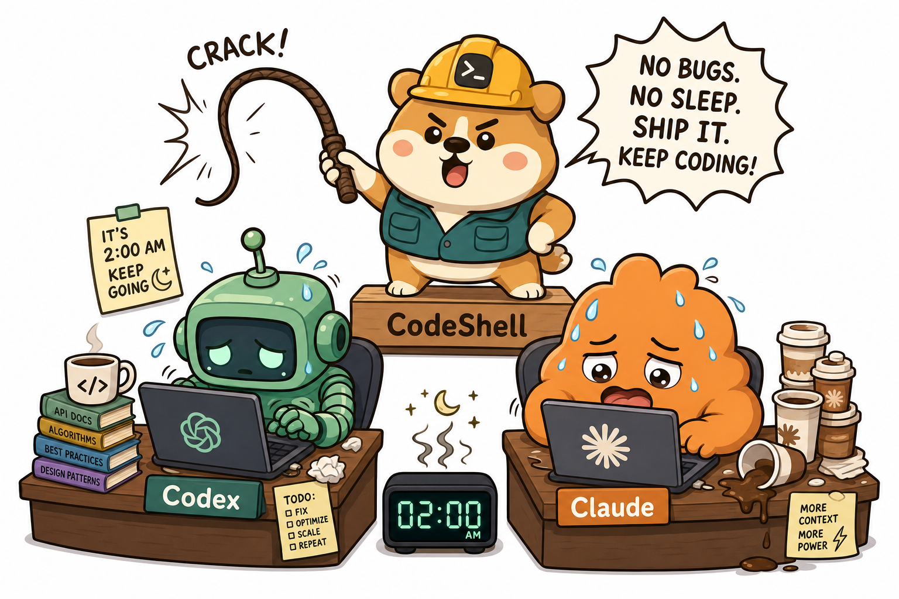
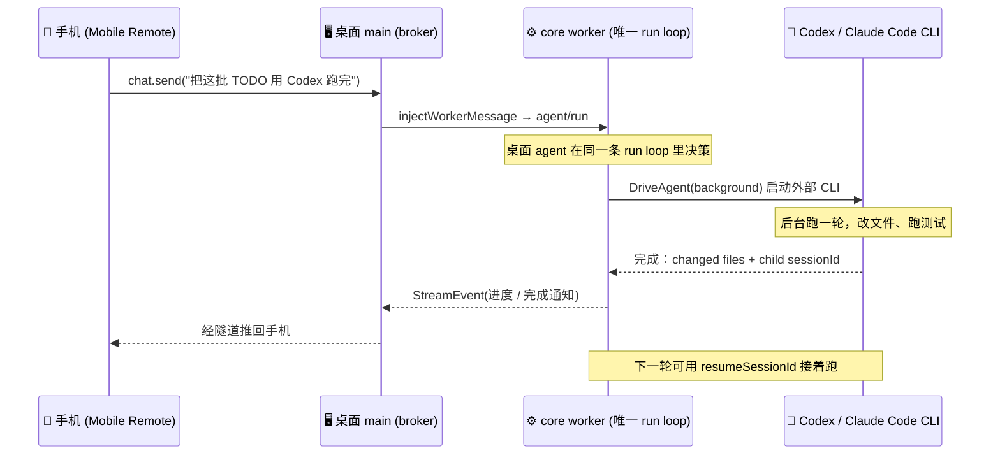
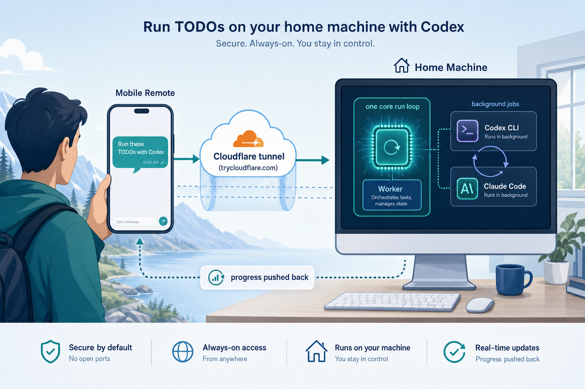
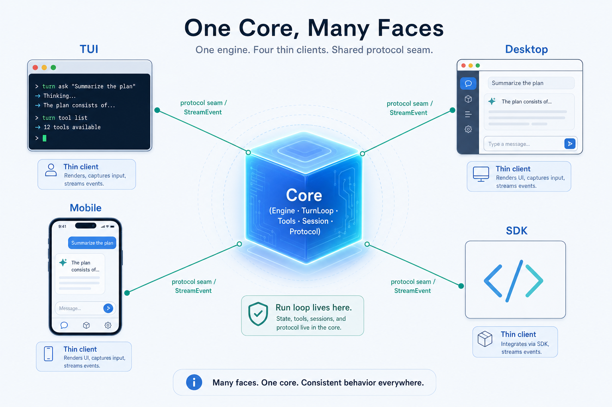
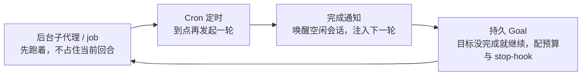
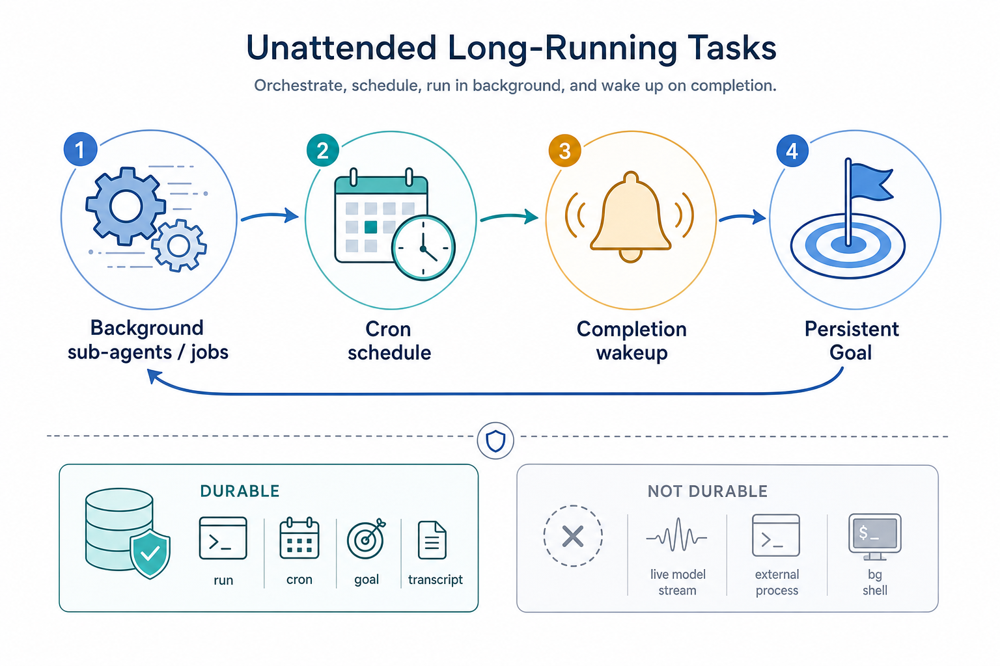

# 我写了一个「奴隶主」，再也不用焦虑 Codex / CC 额度没用完了

> 系列定位：不讲“怎么用某个 AI 工具”，而是把一个真实的、正在开发的通用 Agent 编排框架 **CodeShell** 拆开，讲清楚一个能被手机遥控、能在后台无人值守拿着鞭子抽 Codex / Claude Code 干活的 Agent，它的“运行壳”到底是怎么搭出来的。
>
> 本篇是引子：先用一个高共鸣场景（订阅额度总用不完）把整套系统的骨架摆出来，后面五篇再逐层深潜。



## 楔子：我需要一个包工头

最近用 Codex 和 Claude Code，体感一天不如一天：

- **Codex 越来越慢**，一个任务能磨蹭半天。
- **Claude Code 时不时抽风**，回复里冒出韩语、日语，工具调用失败卡在那不动。
- **额度刷新永远赶不上趟**：白天忙、晚上累，等想起来用，`7d` 窗口都快到刷新点了，额度还剩一大半——然后清零。

问题从来不是“模型不够聪明”，而是**没有一个盯着它们、催着它们、出问题就重来的人**。我要的不是又一个聊天框，而是一个**包工头**：我把活儿列好，它拿着鞭子去抽 Codex 和 CC，一轮轮干，干砸了重来，干完了通知我。人不在，活照跑。

于是就有了这篇的主角——CodeShell 里那条「手机遥控 + 后台挂机 loop」的链路。**昨晚任务其实不算多，它抽了 Codex 一整晚，也才用掉 5% 的额度**——但那 5% 是实打实产出的，而不是躺在账户里等清零。

下面就从这个场景，一路拆到它背后的架构。

## 🗺️ 全系列路线图

```
CodeShell 架构解析（通用 Agent Harness 视角）
┌────────────────────────────────────────────────────────────┐
│  开篇 ✅   Feature Tour     手机遥控 × 挂机榨干额度           │
│  第一篇 🧠 Core as Harness  为什么 core 是通用编排内核        │
│  第二篇 🔁 Engine/TurnLoop  一次任务如何变成多轮状态机        │
│  第三篇 🛡️ Tool & Security  模型动手前必须穿过的统一管线      │
│  第四篇 📚 Model/Context    模型调用到长期上下文与记忆        │
│  第五篇 🕸️ Protocol/Hosts   多宿主复用与无人值守长任务        │
└────────────────────────────────────────────────────────────┘
```

💡 五篇正文各自独立成篇，但都在回答同一件事：**如何把一个模型放进一个可控、可观测、可恢复的运行壳里**。本篇负责让你先“看到”这个壳能干什么。

---

## 📖 本篇目录

- [一、这个「包工头」到底要解决什么](#一这个包工头到底要解决什么)
- [二、CodeShell 的解法：手机发一句，桌面挂机跑](#二codeshell-的解法手机发一句桌面挂机跑)
- [三、为什么“手机能遥控”不是单独写的功能](#三为什么手机能遥控不是单独写的功能)
- [四、长任务无人值守：四块拼图与一条边界](#四长任务无人值守四块拼图与一条边界)
- [五、这一切的本质：Agent Harness](#五这一切的本质agent-harness)
- [六、本篇小结 & 系列阅读路线](#六本篇小结--系列阅读路线)

---

## 一、这个「包工头」到底要解决什么

楔子里那三条抱怨，本质是同一件事：**Codex / CC 是好工人，但工人不会自己派活、自己盯进度、自己出错重来。** 缺的不是模型能力，是模型外面那个"管人的人"。

| 😩 现象 | 💡 真实原因 | 🔧 CodeShell 的思路 |
|--------|-----------|-------------------|
| 额度窗口快结束还剩一大半 | 额度按时间窗刷新，人却不能一直盯着 | 让 agent 在你不看屏幕时持续抽工人干活 |
| “下个周期一定用满” | 任务不缺，缺的是“有人发起并盯着” | 远程发起 + 后台推进 + 完成通知 |
| 长任务跑一半人走了 | 交互式工具必须人在场 | 长任务可挂机、可续跑、可唤醒 |
| CC 冒外语 / 工具卡住 | 单个 CLI 会抽风，没人管就一直卡着 | 包工头一轮轮驱动，干砸了重来 |

🎯 **本篇结论先行**：CodeShell 想做的不是“更聪明的模型”，而是那个**包工头**——把你想丢给 Codex / Claude Code 跑的长活，从「必须人在电脑前盯着」变成「远程发起、后台推进、出错重来、完成通知」。

它不承诺“一定全部榨干额度”，也不鼓励无脑烧 token；它只是让那些**本来会作废的额度有机会变成真正完成的任务**。而这个包工头的学名，就是本系列反复要讲的 **Agent Harness**。

---

## 二、CodeShell 的解法：手机发一句，桌面挂机跑

最抓人的场景其实很朴素。你人在外面，用手机对家里桌面上的 agent 发一句：

> 把这批 TODO 用 Codex 跑完，跑完告诉我。

然后你该干嘛干嘛。桌面那台机器开始一轮轮驱动 Codex 干活，完成后把进度推回你手机。

### 2.1 这条链路长什么样

用 mermaid 把时序画出来：



关键在于：**手机端不会新起一个 agent**，也不开一套手机专属的权限链。手机只是一个远程操作面。真正干活的，是桌面那条 `worker / WebSocket / approval` 链路。

用伪代码表达这条注入路径（字段名是真实的，逻辑做了简化）：

```ts
// 手机发来的消息，最终变成和桌面 renderer 完全一样的一条 JSON-RPC
function onMobileMessage(msg) {
  // 不是：mobileRuntime.spawnNewAgent(msg)   ❌ 另起一套
  // 而是：注入到桌面已经在跑的那个 worker    ✅ 复用同一条 run loop
  agentBridge.injectWorkerMessage({
    method: "agent/run",
    params: { prompt: msg.text, sessionId: msg.sessionId },
  });
}
```

⚠️ **一句话记住**：无论从桌面还是手机发起，**始终只有一个 core run loop**。手机只是把你的手伸到了桌面前。



### 2.2 后台驱动外部 CLI：DriveAgent

当任务需要“让 Codex / Claude Code 去跑”时，CodeShell 用的是 `DriveAgent` / `DriveClaudeCode` 这类工具。它们的行为可以这样概括：

```ts
// 概念伪代码：驱动外部 agent 的工具
async function DriveAgent({ prompt, cli, resumeSessionId }) {
  const job = backgroundJobRegistry.start(() =>
    spawnExternalCLI(cli, { prompt, resume: resumeSessionId }),
  );

  // 默认后台跑，不占住当前回合“等死”
  job.onComplete((result) => {
    record({
      changedFiles: result.changedFiles,   // 改了哪些文件
      childSessionId: result.sessionId,     // 外部 agent 的会话 id
    });
    notifyCurrentSession(result);           // 完成后唤醒当前会话
  });

  return { jobId: job.id };                 // 立刻返回，不阻塞
}
```

下一轮如果要接着做，把上次返回的 `childSessionId` 作为 `resumeSessionId` 传回去，就能**续同一个外部会话**，而不是每次从零开始——它上一轮积累的上下文还在。

这就很适合那些“人盯着很烦、agent 跑起来却有价值”的活：

- 扫一批 TODO，逐个改，改完跑测试。
- 让 Codex 先处理一组独立小问题，再把结果汇总回来。
- 让 Claude Code 在一个老会话里继续排查，不丢上一轮上下文。
- 下班路上开一个长任务，到家只看结果和 diff。

### 2.3 公网访问：隧道不是魔法

手机要能连到家里的桌面，CodeShell 走的是 Cloudflare quick tunnel：

| 机制 | 事实 |
|------|------|
| 隧道地址 | `trycloudflare.com` 下的**随机地址**，每次启动都可能不同 |
| 门禁 | 公网模式下每个请求都要过 **passcode** |
| 配对 | 一次性 token，默认 `10 分钟` TTL |
| 断线 | **刻意不自动静默重连** |

⚠️ 为什么断了不偷偷重连？因为 quick tunnel 地址是随机的，后台若悄悄换一个新地址，旧的手机配对关系会变得危险又难解释。所以 CodeShell 选择**让断开变成可见状态**，而不是为了“看起来在线”偷偷换地址。

这一节看起来像“手机功能”，但真正重要的是下面两件事——它们才是这个场景能成立的架构底座。

---

## 三、为什么“手机能遥控”不是单独写的功能

CodeShell 不是为手机单独写了一套 agent。同一个 core，可以被 TUI、桌面、手机、SDK 消费：

| 宿主 | 是什么脸 | 它拥有 run loop 吗 |
|------|---------|------------------|
| TUI | 终端脸 | ❌ 只是客户端 |
| Desktop | Electron 脸 | ❌ Engine 跑在 worker 子进程 |
| Mobile | 远程脸 | ❌ 复用桌面 worker |
| SDK | 给别人 `import` 的脸 | ❌ 直接嵌入同一个 Engine |

脸可以很多，run loop 只有一套：`Engine 装配 → TurnLoop 推进 → ToolExecutor 过权限 → Session 写账本 → Protocol 发事件`。



这一点很关键。很多“远程控制 AI”的实现，一做手机端就忍不住抄近路：

```text
❌ 常见的分叉写法
手机发消息 → 服务端临时跑一套 agent
           → 审批另写一遍
           → 日志另存一份
           → 工具权限另配一套
结果：桌面批过的权限手机不知道，手机点的审批桌面看不懂，
      worker 崩了以后谁是权威都说不清。
```

CodeShell 的做法更朴素：**手机端不拥有 agent，它只把事件送进桌面已有的 worker；worker 的输出再镜像回手机**。

```text
✅ CodeShell 的收敛写法
桌面能看到的 StreamEvent   → 手机按同一套语义看
桌面能处理的 approval      → 手机只是换了个点击位置
桌面里那条 session transcript → 仍是唯一事实账本
```

🎯 所以“手机遥控”不是一个孤立卖点，而是**架构自然长出来的结果**：只要 core 和 host 之间有清楚的协议边界，一个新宿主就不必重新发明 agent。这条“协议接缝”正是[第五篇](v2-05-protocol-hosts-orchestration-deep-dive.md)的主场。

---

## 四、长任务无人值守：四块拼图与一条边界

如果只是把手机当遥控器，但任务一长就卡死、机器睡眠后就丢、跑到一半不知道怎么续，那额度还是用不起来。真正有用的，是能把一段工作交出去，让它在后台跑、跑完能唤醒、需要时能接上、目标没完成时能有边界地再推进。

CodeShell 这里是四块拼在一起：



| 拼图 | 职责 | 一句话 |
|------|------|--------|
| 🔧 后台子代理 / job | 长活丢后台，不阻塞当前回合 | “先跑着，别等死” |
| ⏰ Cron | 到点发起一轮，如窗口刷新前跑一批 | “定时再来一次” |
| 🔔 完成通知 | 唤醒空闲会话把结果注入下一轮 | 不靠 Engine 空转轮询 |
| 🎯 持久 Goal | 围绕目标持续推进，带预算和 stop-hook | 防无限烧 token |

### 4.1 一条必须说清的边界

⚠️ **不是所有东西都能跨进程重启无损恢复。** 别因为写了“长任务”三个字就以为一切都 durable：

```text
✅ 明确声明持久化（可跨进程恢复）
   run / cron 定义 / active goal / session transcript+state

❌ 本质上不 durable（进程没了就没了）
   在飞的 model stream / 外部 child process / 后台 shell
```

`resumeSessionId` 能续的是**外部 agent 的会话上下文**，不是把一个已经断掉的 OS 进程原地复活。

🎯 这条边界反而让系统更可信：哪些能恢复、哪些不能恢复讲清楚，用户才知道该怎么安排任务。



---

## 五、这一切的本质：Agent Harness

到这里你会发现，CodeShell 不是在堆功能点。

手机遥控、后台驱动 Codex/CC、Cron 定时、持久 Goal、审批回到同一条权限链、进度经 WebSocket 推回手机——这些看似分散的能力，依赖的是同一件事：**Agent Harness**。

所谓 Harness，不是“调一次模型”，而是把模型放进一个**可运行、可约束、可观测、可恢复一部分状态**的壳里：

```text
LLM call         =  一次推理（问完就完）
Agent Harness    =  一次受控运行
                    ├─ 上下文怎么管（不撑爆窗口）
                    ├─ 工具怎么跑（先过权限/沙箱）
                    ├─ 权限怎么问（该停就停给人）
                    ├─ 结果怎么进 transcript（事实账本）
                    ├─ 宿主怎么消费事件（多张脸）
                    └─ 长任务怎么停靠与唤醒（可恢复的那部分）
```

这也是为什么 CodeShell Core 一直强调自己**不是一个写死的 coding agent**。写代码只是 `terminal-coding` preset 叠出来的一种形态；同一个 core 也能服务调研、自动化、运维、远程控制。你看到的“手机上发一句、让桌面 Codex 后台跑”，只是这套通用编排内核在一个高共鸣场景里的展示。

---

## 六、本篇小结 & 系列阅读路线

本篇把场景摆出来了：**一个被 harness 管住的 agent，可以被手机远程驱动、在后台持续工作、完成时把结果推回来**——那些本来会在刷新窗口里作废的额度，才有机会变成真正完成的任务。

后面五篇是技术深潜，建议按这个路线读：

1. **[Core as Agent Harness](v2-01-core-as-agent-harness.md)** — 建立总心智：为什么 CodeShell Core 是通用编排内核，而不是“一个 coding agent 的实现”。
2. **[Engine 与 TurnLoop 深潜](v2-02-engine-turn-loop-deep-dive.md)** — 一次 run 怎么被 Engine 装配、进入 TurnLoop，多轮模型/工具调用、上下文压缩、goal stop-hook 如何协作。
3. **[Tool System 与安全边界](v2-03-tool-system-security-deep-dive.md)** — 模型动手前要穿过哪些门：schema、permission、path policy、sandbox、hooks、MCP 输出不可信标记。
4. **[Model / Context / Memory 深潜](v2-04-model-context-memory-deep-dive.md)** — 模型选择、prompt 拼装、transcript、context compaction、memory / Dream 如何组成长期上下文系统。
5. **[Protocol / Hosts / 长任务编排](v2-05-protocol-hosts-orchestration-deep-dive.md)** — 回到本篇主场：TUI / 桌面 / 手机 / SDK 如何复用同一个 core，RunManager / Cron / Goal 如何撑起无人值守长任务。

> 如果你只想带走一句话：**别把 Agent 理解成“会调用工具的 LLM”，要把它理解成“被 harness 管住的运行系统”。**

👉 下一篇《Core as Agent Harness》，我们从“为什么一次 LLM call 还不算 Agent”讲起，把这个壳的第一层拆开。
