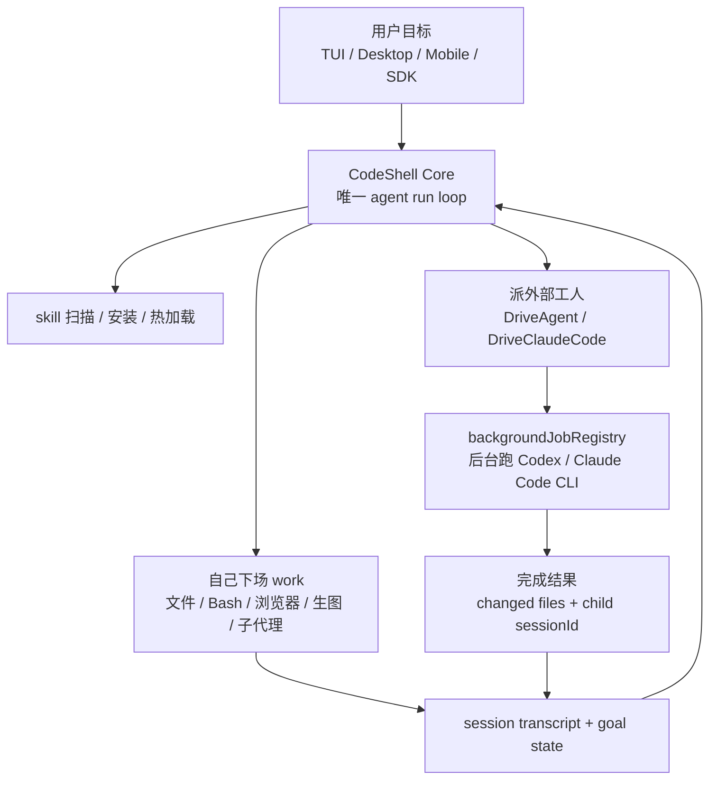
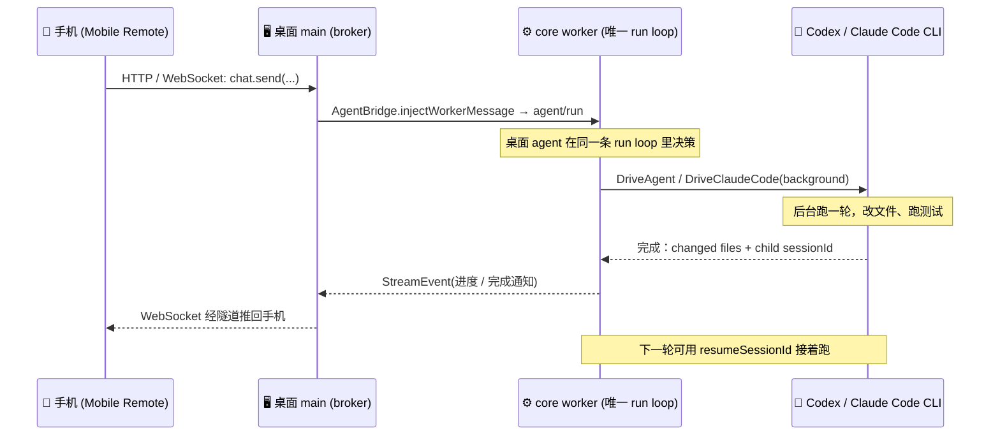
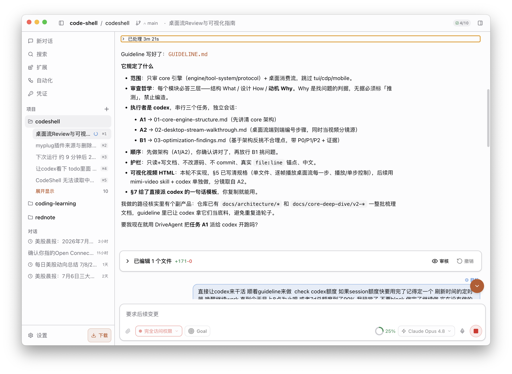
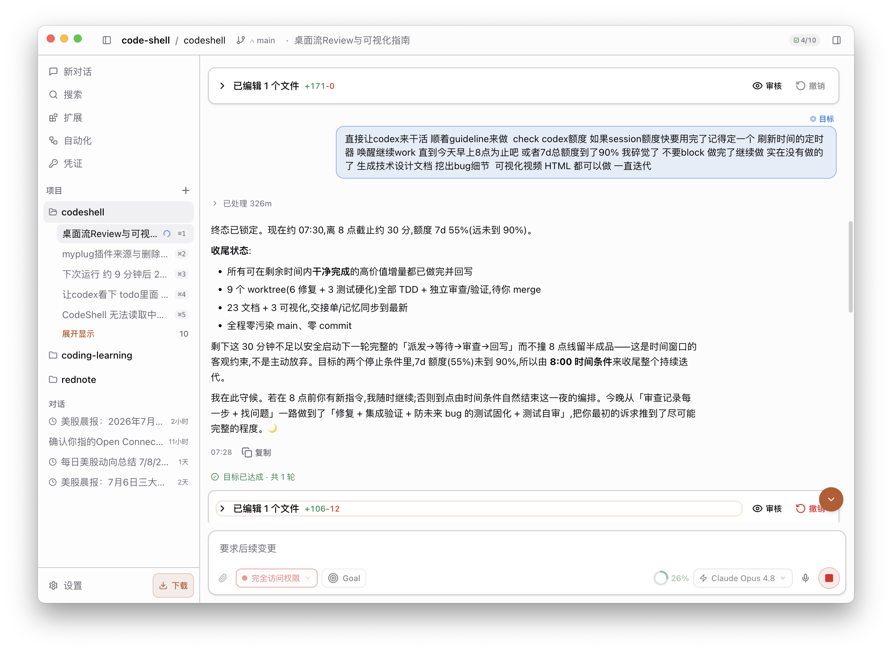
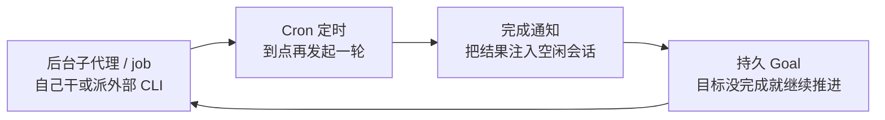

# 我写了一个「奴隶主」，再也不用焦虑 Codex / CC 额度没用完了

> 系列定位：不讲“怎么用某个 AI 工具”，而是把一个真实的、正在开发的通用 Agent 编排框架 **CodeShell** 拆开，讲清楚一个能被手机遥控、能在后台无人值守拿着鞭子抽 Codex / Claude Code 干活的 Agent，它的“运行壳”到底是怎么搭出来的。
>
> 本篇是引子：先用一个高共鸣场景（订阅额度总用不完）把整套系统的骨架摆出来，后面五篇再逐层深潜。


## 楔子：我需要一个包工头

最近用 Codex 和 Claude Code，体感一天不如一天：

- **Codex 越来越慢**，一个任务能磨蹭半天。
- **Claude Code 时不时抽风**，回复里冒出韩语、日语，工具调用失败卡在那不动。
- **额度刷新永远赶不上趟**：白天忙、晚上累，等想起来用，`7d` 窗口都快到刷新点了，额度还剩一大半——然后清零。

问题从来不是“模型不够聪明”，而是**没有一个盯着它们、催着它们、出问题就重来的人**。我要的不是又一个聊天框，而是一个**包工头**：我把活儿列好，它拿着鞭子去抽 Codex 和 CC，一轮轮干，干砸了重来，干完了通知我。人不在，活照跑。

于是就有了这篇的主角——CodeShell 里那条「手机遥控 + 后台挂机 loop」的链路。**昨晚任务其实不算多，它抽了 Codex 一整晚，也才用掉 5% 的额度**——但那 5% 是实打实产出的，而不是躺在账户里等清零。

下面就从这个场景，一路拆到它背后的架构。

## 🗺️ 全系列路线图

```
CodeShell 架构解析（通用 Agent Harness 视角）
┌────────────────────────────────────────────────────────────┐
│  开篇 ✅   Feature Tour     全能工头：自己干 × 带队挂机        │
│  第一篇 🧠 Core as Harness  为什么 core 是通用编排内核        │
│  第二篇 🔁 Engine/TurnLoop  一次任务如何变成多轮状态机        │
│  第三篇 🛡️ Tool & Security  模型动手前必须穿过的统一管线      │
│  第四篇 📚 Model/Context    模型调用到长期上下文与记忆        │
│  第五篇 🕸️ Protocol/Hosts   多宿主复用与无人值守长任务        │
└────────────────────────────────────────────────────────────┘
```

💡 五篇正文各自独立成篇，但都在回答同一件事：**如何把一个模型放进一个可控、可观测、可恢复的运行壳里**。本篇负责让你先“看到”这个壳能干什么。

---

## 📖 本篇目录

- [一、这个「包工头」到底要解决什么](#一这个包工头到底要解决什么)
- [二、CodeShell 的解法：自己能干，也能带队](#二codeshell-的解法自己能干也能带队)
- [三、一套 core，多张脸：手机只是入口之一](#三一套-core多张脸手机只是入口之一)
- [四、长任务无人值守：四块拼图与一条边界](#四长任务无人值守四块拼图与一条边界)
- [五、这一切的本质：Agent Harness](#五这一切的本质agent-harness)
- [六、本篇小结 & 系列阅读路线](#六本篇小结--系列阅读路线)

---

## 一、这个「包工头」到底要解决什么

楔子里那三条抱怨，本质是同一件事：**单个 agent 或单个 CLI 再强，也不会天然变成一个能长期盯活的系统。** 缺的不是“更会聊天”的模型，而是模型外面那个管目标、派任务、跑工具、记账、复盘、续会话的人。

| 😩 现象 | 💡 真实原因 | 🔧 CodeShell 的思路 |
|--------|-----------|-------------------|
| 额度窗口快结束还剩一大半 | 人不可能守着订阅窗口一直发活 | 让工头在后台持续推进，把本来浪费的额度变成产出 |
| 普通 agent 跑一半就断片 | 聊天框只管当前回合，不管长期目标 | Goal / Cron / background job 把任务变成可续跑的运行 |
| Codex / CC 慢或者抽风 | 外部 CLI 是好工人，但不会自己管理自己 | DriveAgent / DriveClaudeCode 记录结果、续会话、必要时再派 |
| 新场景总要改代码 | agent 能力写死后扩展成本高 | 扫描、安装、热加载 skill，让工头自己学新手艺 |

🎯 **本篇结论先行**：CodeShell 不是一个“手机遥控器”，也不是一个“只会抽 Codex / Claude Code 的外壳”。它更像一个**全能工头**：

- 第一条腿：**自己下场干活**。文件、Bash、浏览器、生图、子代理、Cron、持久 Goal、skill 扩展，CodeShell 自己就是一个能独立跑任务的 agent。
- 第二条腿：**带队抽外部工人**。需要 Codex / Claude Code 这类 CLI 时，它把外部 CLI 当后台工人调度起来，完成后看 diff、看测试、继续下一轮。

所以它既可以单独用，也可以和 Codex / CC 一起用。抽鞭子只是其中一种玩法，不是全部。

---

## 二、CodeShell 的解法：自己能干，也能带队

先把手机放到一边。一个合格包工头，不能只会打电话叫人；它自己也得能看图纸、查现场、写清单、催测试、收尾归档。CodeShell 的 core 就是按这个方向做的：**先有一个能自己 work 的 agent，再把外部 CLI 接成可调度的工人**。

### 2.1 自己下场：CodeShell 不是遥控器

CodeShell Core 管的是一次 agent run 的完整生命周期：装配上下文、跑工具、问权限、写 transcript、发事件、在目标没结束时继续推进。只要 host 把它接起来，它自己就能干一大批活。

| 能力 | CodeShell 自己能做什么 | 为什么这不是“只会遥控外部 CLI” |
|------|------------------------|-------------------------------|
| 文件 / Bash | 改文件、跑测试、扫仓库、整理 diff | 直接在本地工程里 work，不需要外部 agent 才能动手 |
| 浏览器 / CDP | 打开页面、查状态、做交互验证 | 前端和文档类任务可以自己闭环 |
| 生图 / 素材能力 | 给文章、页面、说明生成位图资产 | 不只是写代码，也能补齐内容生产链路 |
| 子代理 / background job | 把长活拆出去跑，当前回合不陪它干等 | 自己也能做长任务编排 |
| Cron / 持久 Goal | 到点唤醒，围绕目标持续推进 | 人睡觉后，目标还在账本里 |
| skill 生态 | 扫描、下载、安装项目级 skill，并按需热加载 | 新能力可以像插件一样装上，而不是写死在 core 里 |

这里的 skill 很关键。比如项目里放了 `.agents/skills`，或者从外部安装了一组特定领域的 skill，CodeShell 可以把这些 skill 扫出来，让当前 agent 在对应任务里按 skill 的工作流、工具约定和注意事项去干活。

这就把“agent 能力”从一坨硬编码，变成了可插拔的手艺包。今天给它装文档技能，它能按文档工作流写；明天给它装浏览器验证技能，它能按验证步骤跑；后天给它装内部项目规范，它就按你的仓库规矩来。

概念上可以这么理解：

```ts
async function runCodeShellGoal(goal) {
  const skills = await scanAndLoadSkills({
    project: ".agents/skills",
    installed: "~/.code-shell/skills",
  });

  return engine.run({
    goal,
    tools: ["file", "bash", "browser", "image", "subagent", "cron"],
    skills,
  });
}
```

这段伪代码不是在描述真实 API，而是在描述心智模型：**CodeShell 自己就是能装 skill、跑工具、追目标的 agent**。外部 CLI 是增援，不是它存在的前提。

### 2.2 带队干活：把 Codex / Claude Code 当后台工人

自己能干，不代表所有活都要亲自干。Codex / Claude Code 已经很擅长处理编码任务，问题是它们慢、会卡、会抽风，而且交互式 CLI 天生需要人盯。

所以 CodeShell 做的不是同步等它们跑完，而是用 `DriveAgent` / `DriveClaudeCode` 把外部 CLI 丢进后台：

```ts
// 概念伪代码：驱动 Codex / Claude Code 这类外部 CLI。
async function DriveExternalWorker({ prompt, cli, resumeSessionId }) {
  const job = backgroundJobRegistry.start(() =>
    spawnExternalCLI(cli, { prompt, resume: resumeSessionId }),
  );

  job.onComplete((result) => {
    record({
      changedFiles: result.changedFiles,
      childSessionId: result.sessionId,
    });

    notifyCurrentSession(result);
  });

  return { jobId: job.id };
}
```

这条链有三个点很重要。

第一，外部 CLI 走的是 `backgroundJobRegistry`。当前会话拿到 `jobId` 后可以继续做别的事，不会被一个慢吞吞的 Codex 回合拖死。

第二，完成结果不是一句“跑完了”。CodeShell 会记录 `changedFiles` 和外部 CLI 的 `childSessionId`，再把完成通知发回当前 session。包工头醒来以后知道谁干了什么、改了哪里、下一步要不要验收。

第三，`childSessionId` 能变成下一轮的 `resumeSessionId`。如果还要让同一个外部 worker 继续排查，就续原来的会话上下文，而不是每轮从零开始解释项目背景。

所以抽鞭子的正确打开方式不是“我只会遥控 Codex”，而是：

```text
CodeShell 自己能看目标、拆任务、查仓库、跑测试、写总结；
遇到适合 Codex / Claude Code 的编码子任务，再把它们派出去；
外部 CLI 跑完，CodeShell 收结果、看 changed files、续会话、决定下一轮。
```

### 2.3 两条腿怎么接到一起

把“自己干”和“带队干”放到一张图里，大概是这样：



这才是 CodeShell 的主线：**一个 core run loop，既能自己动手，也能调外部工人；既能单独用，也能组合用。**

如果入口来自手机，它也只是把一句话递进这条 loop。手机不是新的包工头，不会在旁边偷偷再起一套 agent。



换成伪代码，就是这件事：

```ts
// 手机发来的消息，最终被包装成桌面 worker 能理解的同一类 JSON-RPC。
function onMobileMessage(msg) {
  // 不是在手机侧新起 agent，也不是另开一条权限链。
  AgentBridge.injectWorkerMessage({
    method: "agent/run",
    params: { prompt: msg.text, sessionId: msg.sessionId },
  });
}
```

这段伪代码想表达的不是 API 细节，而是权威归属：手机端不新起 agent，不复制权限系统，不另存一份日志。它只是把用户事件塞进桌面 worker，后续 StreamEvent 再镜像回手机。

⚠️ **一句话记住**：无论从桌面、TUI、SDK 还是手机发起，**始终只有一个 core run loop**。手机只是多种入口之一。


### 2.4 真跑一晚：不是演示，是实证

昨晚我拿它跑了一次真实任务。任务不算多，但很适合验证这个包工头到底是不是“只能演示一下”：让 CodeShell 挂在桌面上，串行推进，自己能做的自己做，适合外部 CLI 的就派给 Codex / Claude Code。人去睡觉，工头不睡。

这一晚的体感结果很朴素：只用掉约 `5%` 的订阅额度，但它不是躺在账户里等清零的 5%，而是变成了多个 git worktree 里的独立改动、测试验证和收尾清单。

下面这两张不是设计图，是真跑截图。



第一张更像“开工现场”：桌面 worker 里已经有目标、权限、进度和 DriveAgent 派活提示。注意这里仍然不是手机侧新起 agent，而是桌面那条 worker 在接任务。



第二张才是这件事最有说服力的地方：画面里能看到已经处理 `326m`，时间来到 `07:30` 左右，收尾总结里列出了 `9 个 worktree`、文档和可视化产出。具体每个数字以截图为准，我不在正文里编一个更漂亮的 benchmark。

这就是我想要的体验：不是“帮我回一句话”，而是“我睡觉，你继续把活往前推；你能自己干就自己干，需要 Codex / CC 就派出去；天亮以后我看 worktree、测试和 diff”。

---

## 三、一套 core，多张脸：手机只是入口之一

做到手机遥控以后，我反而更确定一件事：这不该被写成“mobile feature”。手机、TUI、桌面、SDK，都只是 CodeShell Core 之上的接入方式。

CodeShell Core 管的是 agent 怎么跑；不同宿主只负责怎么接入、怎么渲染、怎么把审批和事件传回来。尤其在桌面形态里，Engine 跑在 worker 子进程里，桌面 main 做 broker，手机只是远程客户端。

| 宿主 / 客户端 | 负责什么 | 不该负责什么 |
|--------------|----------|--------------|
| TUI | 终端里的交互、渲染、键盘流 | 不复制一套 core |
| Desktop | Electron 外壳、main broker、worker 承载 | renderer 不自己跑 agent |
| Mobile | 远程输入、审批、进度查看 | 不新起 agent，不另开权限链 |
| SDK | 程序化接入同一套能力 | 不改写 harness 语义 |

脸可以很多，run loop 只有一套：`Engine 装配 → TurnLoop 推进 → ToolExecutor 过权限 → Session 写账本 → Protocol 发事件`。


这里我刻意避免了最省事、也最容易埋雷的写法：

```text
❌ 常见的分叉写法
手机发消息 → 服务端临时跑一套 agent
           → 审批另写一遍
           → 日志另存一份
           → 工具权限另配一套
结果：桌面批过的权限手机不知道，手机点的审批桌面看不懂，
      worker 崩了以后谁是权威都说不清。
```

CodeShell 的收敛点很简单：**手机端不拥有 agent，它只把事件送进桌面已有的 worker；worker 的输出再镜像回手机**。

```text
✅ CodeShell 的收敛写法
桌面能看到的 StreamEvent   → 手机按同一套语义看
桌面能处理的 approval      → 手机只是换了个点击位置
桌面里那条 session transcript → 仍是唯一事实账本
```

手机经 HTTP / WebSocket 进来时，最终也是通过 `AgentBridge.injectWorkerMessage` 注入桌面 worker。它没有新起 agent，没有另开权限链，也没有绕开 transcript。

顺手说一句公网入口。CodeShell 可以用 Cloudflare quick tunnel 暂时把桌面暴露出去，但这只是接入层，不是核心卖点：

| 机制 | 事实 |
|------|------|
| 隧道地址 | `trycloudflare.com` 下的随机地址，每次启动都可能不同 |
| 门禁 | 公网模式下每个请求都要过 passcode |
| 配对 | 一次性 token，默认短 TTL |
| 断线 | 刻意不自动静默重连 |

为什么不静默重连？因为 quick tunnel 地址是随机的，后台如果悄悄换一个新地址，旧手机配对关系会变得危险又难解释。CodeShell 选择让断开变成可见状态，而不是为了“看起来在线”偷偷换地址。

这就是为什么我说手机只是入口之一。真正值钱的是协议边界：只要 core 和 host 之间讲清楚 StreamEvent、approval、session、tool result 这些东西，一个新宿主就不用重新发明 agent。这条“协议接缝”正是[第五篇](v2-05-protocol-hosts-orchestration-deep-dive.md)的主场。

---

## 四、长任务无人值守：四块拼图与一条边界

无论入口来自 TUI、桌面、手机还是 SDK，真正让我觉得“这个包工头能用了”的，是它能把一段活交出去，然后我不盯屏幕也能继续推进。

这里不能靠一个“长任务模式”糊过去。长任务至少要解决四个问题：当前回合不能被后台任务卡死；到点能再发起一轮；后台任务完成后能叫醒会话；目标没完成时能继续，但不能无限烧 token。

CodeShell 把这四件事拼成一个无人值守 loop：



这张图背后每块都有很具体的动机：

| 拼图 | 解决的包工头问题 |
|------|----------------|
| 后台子代理 / job | 自己的长任务和外部 CLI 都不能拖死当前回合 |
| Cron | 人不在的时候，到点也能发起下一轮 |
| 完成通知 | 后台任务结束后，不靠 Engine 空转轮询 |
| 持久 Goal | 围绕目标继续推进，同时有预算和 stop-hook 兜底 |

### 4.1 一条必须说清的边界

不过这里必须把边界讲清楚：**无人值守不等于让所有东西都跨进程复活**。

CodeShell 明确持久化的是这些：

```text
✅ durable（可跨进程恢复）
   run / cron / active goal / session transcript+state

❌ NOT durable（进程没了就没了）
   在飞的 model stream / 外部 child process / 后台 shell
```

也就是说，`resumeSessionId` 能续的是**外部 agent 的会话上下文**，不是把一个已经断掉的 OS 进程原地复活。后台 shell 挂了就是挂了，在飞的 model stream 断了就是断了；系统能恢复的是账本、目标、定时定义和下一步该怎么继续。

这条边界反而让系统更可信。包工头不是神仙，它只是把可恢复的状态保存好，把不可恢复的部分说清楚，然后在下一轮基于事实账本继续推进。


---

## 五、这一切的本质：Agent Harness

到这里再回看，skill、文件工具、Bash、浏览器、后台 job、DriveAgent、DriveClaudeCode、Cron、持久 Goal、多宿主协议、审批回到同一条权限链，其实不是一堆孤立功能。

它们都在服务同一件事：**把模型和外部工具放进一个可控的运行壳里**。

这就是我理解的 Agent Harness。它不是“调一次模型”，而是一次受控运行：谁来装配上下文，谁来跑工具，谁来问权限，谁来写 transcript，谁来把事件发给不同宿主，谁来在长任务结束后接着推进。

```text
LLM call         =  一次推理（问完就完）
Agent Harness    =  一次受控运行
                    ├─ 上下文怎么管（不撑爆窗口）
                    ├─ 工具怎么跑（先过权限/沙箱）
                    ├─ 权限怎么问（该停就停给人）
                    ├─ skill 怎么装（按任务扩展手艺）
                    ├─ 结果怎么进 transcript（事实账本）
                    ├─ 宿主怎么消费事件（多张脸）
                    └─ 长任务怎么停靠与唤醒（可恢复的那部分）
```

这也是为什么 CodeShell Core 一直强调自己**不是一个写死的 coding agent**。写代码只是 `terminal-coding` preset 叠出来的一种形态；同一个 core 也能服务调研、自动化、运维、远程控制。

你看到的“拿鞭子抽 Codex / Claude Code”，只是这套通用编排内核在一个高共鸣场景里的展示。真正的主角不是手机，也不是某个 CLI，而是那个能自己干、也能带队干的运行壳。

---

## 六、本篇小结 & 系列阅读路线

本篇先把场景摆出来：我需要的不是又一个聊天框，也不是一个只会遥控外部 CLI 的壳，而是一个能自己干活、能带队、能长期盯目标、能在我睡觉时继续推进的包工头。

落到 CodeShell 里，这件事有四个支点：

- **自己能干**：文件、Bash、浏览器、生图、子代理、Cron、持久 Goal，加上可扫描 / 安装 / 热加载的 skill 生态。
- **能带队干**：`DriveAgent` / `DriveClaudeCode` 走 `backgroundJobRegistry` 后台跑，完成后带着 `changedFiles` 和 `childSessionId` 回来，必要时再用 `resumeSessionId` 续同一个外部会话。
- **入口不抢戏**：TUI / 桌面 / 手机 / SDK 都是接入方式；手机经 HTTP / WebSocket 注入桌面 worker，始终只有一个 core run loop。
- **长任务有边界**：run / cron / active goal / session transcript+state 可恢复；在飞 model stream、外部 child process、后台 shell 不假装可恢复。

后面五篇开始技术深潜，建议按这个路线读：

1. **[Core as Agent Harness](v2-01-core-as-agent-harness.md)** — 建立总心智：为什么 CodeShell Core 是通用编排内核，而不是“一个 coding agent 的实现”。
2. **[Engine 与 TurnLoop 深潜](v2-02-engine-turn-loop-deep-dive.md)** — 一次 run 怎么被 Engine 装配、进入 TurnLoop，多轮模型/工具调用、上下文压缩、goal stop-hook 如何协作。
3. **[Tool System 与安全边界](v2-03-tool-system-security-deep-dive.md)** — 模型动手前要穿过哪些门：schema、permission、path policy、sandbox、hooks、MCP 输出不可信标记。
4. **[Model / Context / Memory 深潜](v2-04-model-context-memory-deep-dive.md)** — 模型选择、prompt 拼装、transcript、context compaction、memory / Dream 如何组成长期上下文系统。
5. **[Protocol / Hosts / 长任务编排](v2-05-protocol-hosts-orchestration-deep-dive.md)** — 回到本篇主场：TUI / 桌面 / 手机 / SDK 如何复用同一个 core，RunManager / Cron / Goal 如何撑起无人值守长任务。

> 如果你只想带走一句话：**别把 Agent 理解成“会调用工具的 LLM”，要把它理解成“被 harness 管住的运行系统”。**

👉 下一篇《Core as Agent Harness》，我们从“为什么一次 LLM call 还不算 Agent”讲起，把这个壳的第一层拆开。
