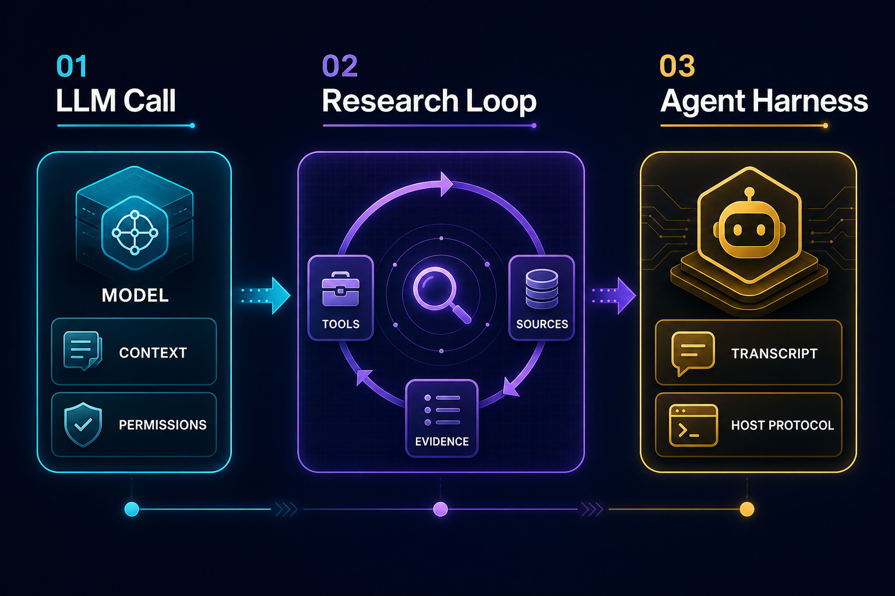
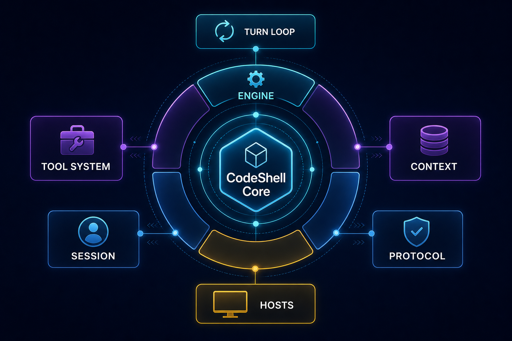
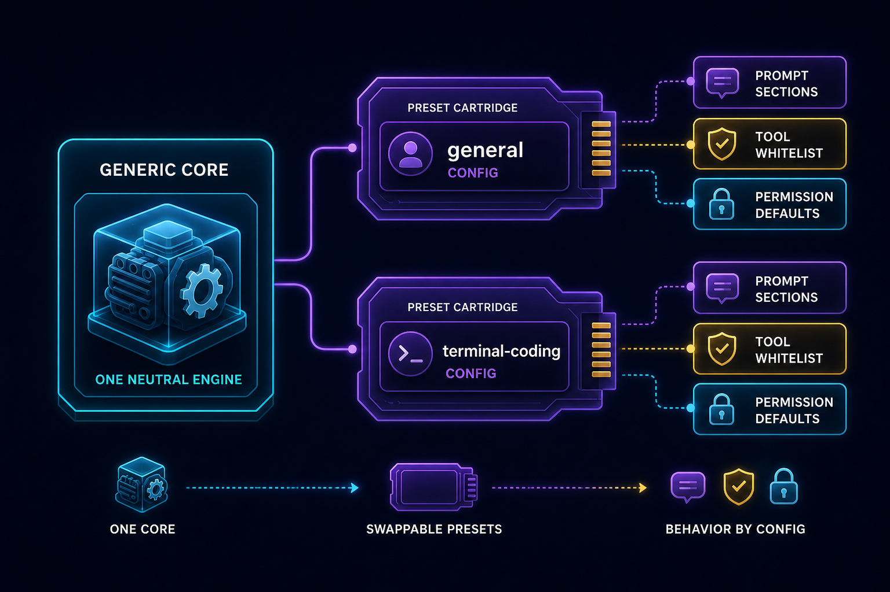

# CodeShell Core：从 LLM Call 到 Agent Harness，一套通用编排内核如何成形

> 一句话：CodeShell Core 不是一个“写代码的工具”，而是一个**通用的 Agent 编排内核**。它把“如何让一个模型在真实环境里受控运行”这件事抽成平台能力；“会写代码”只是挂在这个内核之上的一份配置（`terminal-coding` preset），不是写死在引擎里的本质。

这是 CodeShell Core v2 深度长文系列的第 1 篇。它的任务不是逐行讲源码，而是先帮你建立一个全局心智模型：**什么是 Harness Agent，为什么 LLM 调用本身不等于 Agent，以及 CodeShell Core 把哪些机制抽成了可复用的平台能力**。后面四篇会分别钻进 Engine/TurnLoop、工具系统与安全、模型/上下文/记忆、协议与宿主编排；但如果你没有先建立“core 是通用编排内核”这个基调，那几篇技术深潜很容易被读窄成“一个 coding agent 的实现细节”，这就跑偏了。

本篇与后续篇章的关系:

- 第 02 篇《Engine 与 TurnLoop 深潜》——展开本篇第 4 节里"Engine 装配、TurnLoop 转圈"的内部机制。
- 第 03 篇《Tool System 安全深潜》——展开本篇第 6 节"安全边界"。
- 第 04 篇《模型、上下文与记忆深潜》——展开本篇第 5 节"能力边界"里 context/memory 的部分。
- 第 05 篇《协议、宿主与长任务编排》——展开本篇第 7 节"宿主复用"。

---

## 1. 它到底解决什么问题

如果你做过“接大模型 + 给它工具用”的系统，大概率会反复撞上同一批麻烦事：

- 多轮对话怎么管？上下文眼看要撑爆窗口，是直接报错，还是有人帮你压缩、摘要、续写？
- 模型说要跑一条 shell 命令、要写一个文件，谁去执行？执行之前谁来拦一道，确保它不会一句 `rm -rf` 把你的仓库删了？
- 同一套 agent 逻辑，既想跑在终端里，又想做成桌面 App，还想被别人当 SDK `import` 进去——难道要把循环、工具、权限写三遍？
- 想让它“无人值守地跑一个长任务”，跑到一半进程崩了、机器睡眠了，哪些状态能续上，哪些状态必须重来？

这些问题的答案，**都不在模型里，而在“模型外面那层运行壳”里**。模型负责“想”，运行壳负责“让想变成可控的、可观测的执行”，并尽量把可持久化的部分保存下来。这层运行壳，业界逐渐有了一个名字：**Agent Harness**。

CodeShell Core 的回答很明确：**把这些通用机制——多轮循环、上下文压缩、权限审批、工具执行、会话持久化、长任务编排——收敛进一个“领域无关”的内核，再把“具体要当什么 agent”做成可替换的配置。** 写代码、做调研、跑运维自动化，对这个内核来说只是不同的 preset + 工具白名单 + 提示词段 + 权限默认值的组合。

这一点在源码里有一条很直接的“宣言”。`packages/core/src/index.ts` 文件头第一行注释写着：

```
code-shell — general-purpose agent orchestration framework
```

不是 “coding assistant”，也不是 “AI IDE”，而是 **general-purpose agent orchestration framework**（通用 Agent 编排框架）。这不是营销话术，而是贯穿整个 core 设计的约束。`packages/core/CONTRIBUTING.md` 把它落成一条更硬的规矩：**core only carries mechanism, not policy**（核心只装机制，不装策略）。本篇剩下的篇幅，基本都在解释这句话的后果。

---

## 2. 从 LLM Call 到 Harness:为什么"调用模型"不等于"Agent"

要理解 CodeShell Core 为什么长这样,得先看清楚一条演进线:**LLM Call → Research Loop → Agent Harness**。



### 第一阶段:LLM Call,只是一次函数调用

最早一批 AI 应用,本质就是一次 **LLM call**:用户输入 prompt,应用把它拼成 messages 发给模型,模型返回一段文本,界面展示出来。问答、总结、改写、翻译、分类——只要"任务需要的信息已经全在 prompt 里",一次调用就够了。

但只要任务开始依赖外部世界,这种模式立刻露出边界。它不能自己决定去哪里找资料,不能真的读取你的代码仓库,不能安全地运行命令,更没有"任务状态"——它不知道自己已经做了哪几步,也不知道下一步该基于什么结果继续。

所以 LLM call 的边界**不是"模型聪不聪明",而是它没有运行时**。把模型比作大脑,LLM call 只是让大脑说一句话:它还没有手、没有眼睛、没有记忆、没有工作台,也没有安全规则。

### 第二阶段:Deep Research,开始出现循环

Deep Research 这类框架处在 LLM call 和通用 harness 中间。它不再只问一次,而是让模型围绕一个研究目标反复执行"搜索 → 阅读 → 记录证据 → 继续搜索 → 汇总"。模型在循环里持续决定:现在缺什么信息、该查哪里、哪些来源可信、什么时候可以停。

这背后有个很现实的动机:早期主流模型上下文不够长,128K/256K 对复杂研究和大仓库远远不够。Deep Research 的循环,本质是**用外部搜索 + 多轮整理,来弥补单次上下文窗口的不足**。

但 Deep Research 仍然是一个**专项 harness**:它主要服务研究任务,工具集中在搜索和网页读取,状态结构也是围绕"研究报告"设计的。它有了循环、有了工具,但没有把这套能力抽象成可以承载任意任务、接入任意宿主的通用运行壳。

### 第三阶段:Harness Agent,把模型变成"可运行系统"

如今主流模型的上下文窗口已经比早期大得多，部分模型甚至进入百万 token 级别。普通会话不再像过去那样轻易撞到窗口上限，这反而把真正的瓶颈推到了台前：**当模型能看很多、想很久时，系统问题不再只是“上下文够不够”，而是“如何把模型放进一个可控、可观测、可复用的运行环境里”。**

这就是 Harness Agent。它不是某个单一功能,而是一组运行时能力:读取上下文、选择工具、等待审批、执行动作、接收结果、继续推理,并在必要时压缩上下文、恢复状态、把过程流式发给宿主 UI。一句话:

> LLM call 是一次推理;Agent Harness 是一次受控运行。

一个真正的 harness,至少需要七个部件,而 CodeShell Core 正是按这个方向拆的:

| 部件 | 职责 | CodeShell 对应 |
|------|------|----------------|
| Engine | 装配一次 run 的模型、工具、上下文、权限、会话 | `engine/engine.ts` 的 `Engine` |
| Turn Loop | 多轮模型调用、工具调用、停止判断 | `engine/turn-loop.ts` 的 `TurnLoop` |
| Tool System | 工具注册、参数校验、权限判断、实际执行 | `tool-system/`(registry/executor/permission) |
| Context Manager | 控制上下文窗口,不让长任务撑爆模型 | `context/`(manager/compaction) |
| Session / Transcript | 记录发生过什么,支持恢复和审计 | `session/`(transcript/session-manager) |
| Permission / Sandbox | 限制工具能力,避免 agent 失控 | `tool-system/permission.ts`、`sandbox/` |
| Protocol / Host Adapter | 让 CLI/桌面/远程接入同一个 core | `protocol/`(client/server/transport) |

注意这张表里**没有一行是"coding"**。这正是关键:harness 的七个部件全是通用机制,"会写代码"不在其中。它是后面再叠上去的一层配置。

---

## 3. Core 把哪些机制抽成了平台能力

把第 2 节那七个部件落进 CodeShell 的源码,你会看到一个分层的运行时,而不是一堆零散的工具函数。



整个仓库分四个包,但**只有一份"大脑"**:

```
packages/
├── core/      Engine、工具、MCP、hooks、会话、运行、自动化、preset、LLM、
│              模型目录、插件、能力控制、凭证、记忆、Arena、cc-orchestrator
├── tui/       终端 CLI、Ink REPL、自绘终端渲染器、斜杠命令
├── desktop/   Electron 主进程(服务经纪人)+ 每会话 core worker + React renderer + 手机遥控
└── cdp/       环境无关的 CDP 浏览器动作层(不依赖 Playwright)
```

`core` 是唯一一份编排内核;`tui` 和 `desktop` 都是它的客户端;`cdp` 是给浏览器工具用的底层动作层。这就是 v1 系列那句"一套引擎三张脸"的来历——但更准确的说法是:**一套引擎,任意张脸**,因为 SDK 用户可以直接 `import { Engine }` 长出自己的第四张脸。

按职责,core 内部大致是这么几束(每束对应后续某篇深潜):

- **引擎核心**:`engine/`、`context/` —— turn loop 与上下文治理。这是 harness 的"心跳"。
- **工具与安全**：`tool-system/` —— 注册表、executor、权限、路径策略、沙箱、MCP。这是 agent “能做事”前必须先穿过的关卡。
- **模型层**:`llm/`、`model-catalog/` —— 把一个模型 tag 解析成可用的 provider 客户端,把模型差异收敛成数据。
- **协议与会话**:`protocol/`、`session/`、`state.ts` —— RPC 接缝与持久化,让宿主解耦、让任务可恢复。
- **行为配置**:`preset/`、`prompt/`、`hooks/`、`skills/` —— "行为即配置"的所在,本篇第 4 节细讲。
- **长任务**:`run/`、`automation/`、`cron/`、`engine/goal.ts` —— Run/Cron/持久 Goal 的可恢复状态机。
- **运行时长能力**:`plugins/`、`capability-control/`、`credentials/`、`session/memory.ts`、`services/`(Dream)。
- **多模型与集成**:`arena/`、`cc-orchestrator/`、`stt/`、`review/`。

这里要强调一个观感上的区别:**这不是"一堆模块堆在一起",而是一个有层次的运行时。** 一次任务从外向内穿过这些层——宿主把请求交给协议接缝,接缝交给 Engine 装配,Engine 拉起 TurnLoop 转圈,TurnLoop 在每一轮里调模型、压上下文、过工具门禁。每一层都有清晰的职责归属,这正是它能长期演进的原因(下一节会讲为什么不能把这些全塞进一个大函数)。

> **设计取舍:为什么不写一个 `runAgent()` 大函数?**
> 早期 demo 常写成一个大循环：调模型 → 有工具调用就执行 → 结果 append 回 messages → 继续。这能跑，但所有复杂性会挤进同一个地方：权限、审批、schema 校验、路径安全、Bash 沙箱、上下文压缩、用户取消、工具失败、会话恢复、UI 事件、子代理通知……每加一个能力就多一层 if/else，最后得到一个没人敢改的函数。更关键的是，这些能力的**生命周期根本不同**：模型调用关心 provider / streaming / stop reason；工具执行关心 schema / 权限 / sandbox；上下文管理关心 token 预算和历史压缩；协议关心事件、审批和 UI。它们在同一次 run 里协作，但不该由同一个函数管全部细节。拆层不是为了“架构好看”，而是为了让复杂性**有明确归属**——这样后面加 MCP、自动化、远程控制、子代理，都能沿着已有链路扩展，而不是继续往大函数里塞。

---

## 4. Preset over Hardcoding:coding 是配置,不是本质

这是整个系列最该正面阐述的一节,也是"core 不是 coding agent"这个论断最硬的证据。



如果"会写代码"是写死在引擎里的,那做一个调研 agent 或运维 agent 就得 fork 一份引擎、各自维护。CodeShell 不走这条路。它要的是:**同一个引擎,换一束配置,就变成另一种 agent。**

这束配置就是 `AgentPreset`(见 `packages/core/src/preset/index.ts`),它只选四样东西:

```ts
interface AgentPreset {
  promptSections: readonly string[];      // 系统提示段名(markdown)
  injectGitStatus: boolean;               // 是否注入 git 状态
  builtinTools: string[];                 // 内置工具白名单
  defaultPermissionRules: PermissionRule[]; // 默认权限规则
}
```

core 内置两个 preset:

- **`general`**(默认):提示段 `["base", "orchestration", "browser", "tone"]`,工具是精选清单 `GENERAL_BUILTIN_TOOLS`,git 状态注入关闭。这是给调研、运维、自动化用的"中性"形态。
- **`terminal-coding`**(CLI 默认,`DEFAULT_CLI_PRESET`):在 `general` 的基础上多挂一个 `coding` 提示段(段序变成 `["base", "orchestration", "coding", "browser", "tone"]`),多开 `TERMINAL_CODING_EXTRA_TOOLS`——也就是 `EnterWorktree`、`ExitWorktree`、`NotebookEdit`、`LSP`、`Brief`、`Arena`,并把 `injectGitStatus` 打开。

请仔细看：**`general` 和 `terminal-coding` 的主要差别，就是上面这几样配置的差别——一个提示段、几个额外工具、一个 git 开关、几条权限默认值。不是两套引擎，而是同一个引擎的两张配置卡带。** 这就是“行为即配置”最具体的证据。你完全可以再定义一个 `research` preset、一个 `ops` preset，而完全不碰 `Engine` 和 `TurnLoop` 的任何一行代码。

几个值得记住的机制细节:

- **工具白名单是执行机制,不是文档。** `GENERAL_BUILTIN_TOOLS` 是一份精选清单。`ToolRegistry.registerBuiltins(names)` 会按它过滤总表 `BUILTIN_TOOLS`,并**静默丢掉不在清单里的工具**。这带来一个反复踩中的坑:**新增一个内置工具,必须同时改两处——既要进 `tool-system/builtin/index.ts` 的 `BUILTIN_TOOLS` 表,也要进 `preset/index.ts` 的白名单(`GENERAL_BUILTIN_TOOLS` 或某个 preset 的 `builtinTools`)。漏一处,工具就静默不可见,模型根本看不到它,或者调用时拿到 "tool not found"。** 这是机制带来的纪律成本,也是"配置驱动"的代价之一。
- **提示段会按激活工具门控裁剪。** `TOOL_GATED_SECTIONS` 把某些段映射到它需要的工具(例如 `browser` 段 → 浏览器工具)。当浏览器工具没被激活时,`buildPresetSystemPrompt` 会把 `browser` 段整段丢掉,让模型不去读自己用不上的指令——既省 token,也减少误导。

> **设计取舍:为什么用 preset 而非 fork?**
> fork 一份引擎来做新形态 agent,短期最快;但每个 fork 都要单独跟进 core 的所有改进(上下文压缩、权限修复、协议升级……),很快就维护不动。preset 把"变化的部分"(提示段/工具/权限)和"不变的部分"(循环/上下文/安全)切开:变化的部分是数据,不变的部分是机制。代价是多了一层间接——你不能在引擎里直接 `if (coding)`,得去 preset 表里查配置——但换来的是"加一种 agent 形态几乎不动 core"。

---

## 5. 能力边界:为什么需要 protocol / tool / preset / context / memory 这些缝

第 3 节列了 core 的分层,第 4 节讲了 preset 这层缝。这一节回答一个更本质的问题:**为什么要切这么多缝?直接把模型接到工具上、把工具接到 UI 上,不行吗?**

不行,而且失败模式很具体。逐个看几条边界存在的理由:

**① Tool 这层缝:不让"决定调用"和"实际执行"黏在一起。** 模型只产出 `tool_use`(我想调用某工具,参数是这些),它**不该**直接拿到执行能力。中间必须有一个统一的 `ToolExecutor` 把每次调用收口,在执行前依次过 schema 校验、权限判断、路径策略、沙箱、hooks。如果没有这层缝,工具调用就会散落成 if/else,新增工具时很难保证每条路径都被权限覆盖——业界经典误区"先堆工具,再补权限"就是这么来的:工具越多,权限越难补。正确顺序是先有统一 executor,再往里加工具。这层缝的细节是第 03 篇的主战场。

**② Context 这层缝:不让模型自己管自己的上下文预算。** 模型不知道系统的 token 预算,也不知道哪些历史内容可以从 transcript 安全恢复。如果把上下文管理交给模型"自觉",长任务一定会撞窗口。CodeShell 在 `context/` 里做了分层治理(从无损持久化到有损摘要),这是 harness 层的责任,不是模型的责任。第 04 篇会展开。

**③ Memory 这层缝:把"长期知识"和"会话历史原文"分开。** 一个常见误区是把 memory 当聊天记录用,把历史原文越堆越多。CodeShell 的记忆(`session/memory.ts` + Dream consolidation)是**萃取后的知识**:有抽取、去重、scope 管理、过期/删除。它和 transcript(一次任务的事实账本)是两种东西。第 04 篇会讲清楚这条边界。

**④ Preset 这层缝:把"是什么 agent"做成可替换配置(第 4 节已讲)。**

**⑤ Protocol 这层缝:不让 UI 直接调核心循环。** 如果 UI 直接调 `TurnLoop`,那 CLI、桌面、手机就得各自复制一套调用逻辑,而且 core 会被某个 UI 的形态绑死。CodeShell 用 `AgentClient ⇄ Transport ⇄ AgentServer` 这层 JSON-RPC 接缝,把 run/approve/cancel/stream/status 变成语义契约,UI 只消费协议。第 05 篇展开。

把这五层缝合起来看,你会发现它们共同服务一个目标:**让每一种复杂性都有明确归属,且彼此可以独立演进。** 这也对应了 harness 设计的三层能力地图——MVP(能跑:Engine/TurnLoop/Tool Registry/Executor/Transcript)、Production(能被信任:权限/沙箱/路径策略/上下文管理/会话恢复/协议/可观测)、Advanced(能成平台:自动化/后台 agent/记忆管线/插件 skill/Arena/远程控制)。CodeShell Core 不是停在 MVP 的"工具列表",它把这三层都做了。

---

## 6. 安全边界:能力直接暴露给模型的风险

上一节是从"可维护性"角度讲为什么要切缝;这一节单独把**安全**拎出来,因为它是 harness 区别于"一个会调工具的聊天机器人"的分水岭。

核心原则只有一句:**在 agent 能做事之前,必须先学会被约束。** 一旦模型能跑 shell、能读写文件,你就不能只靠"模型应该听话"。CodeShell Core 把约束做成了几道彼此独立、职责不同的边界(细节都在第 03 篇,这里只建立心智模型):

- **权限(permission):决定一次工具调用是否执行。** allow / ask / deny 三态,配 permission mode 和 approval backend。`ask` 时要把决定权交还给人。
- **路径策略(path policy):管文件工具的 workspace 边界与敏感路径。** 它会对路径做 realpath 双侧解析再比较,防止有人用 symlink 把"看起来在仓库内"的路径指到仓库外去逃逸。
- **沙箱(sandbox):限制 Bash 的执行环境。** 注意一条事实红线:**沙箱不是全平台都有的**。macOS 有 seatbelt、Linux 有 bwrap,但 **Windows 没有 OS sandbox 后端,`auto` 档会降级为 `off`**——这时只剩权限和路径策略兜底,不能假装沙箱还在。
- **hooks:只能收紧,不能放松。** hook 的决定聚合规则是"最严者胜"(`deny > ask > allow`),低优先级处理器**永远不能放松**高优先级的 `deny`。这是一条关键不变量——别误以为可以写个 hook 把某个 deny 改成 allow。

几条真实的 footgun,用来说明"为什么这些边界缺一不可":

1. **链式 Bash 绕过。** 早期版本里 `git status && rm -rf /` 这样的命令曾经绕过审批——审批只看了第一段 `git status` 就放行了。修法是:任何 Bash 授权路径都要保证只覆盖单段、非危险命令,遇到管道、多段、危险命令就拒绝匹配、重新问。这说明"权限"不能只做字符串前缀匹配。
2. **shell hook 是受信任代码,绕过 Bash 权限/沙箱。** 你配了一个 shell hook,它会被 spawn 成子进程执行,**不走 Bash 的权限和沙箱**——配了就等于隐式信任它。护栏是超时 + 输出上限 + fail-silent(畸形/超时/异常退出都返回空,不崩 turn),但它本身就是个信任边界,别把不可信的脚本挂上去。
3. **MCP 外部工具的输出要当不可信数据。** MCP server 是外部的,它返回的内容可能藏着 prompt injection。CodeShell 让 MCP 工具进入**同一条** executor 管线,并把输出包一层"untrusted result",而不是给 MCP 开一条权限更宽松的旁路。**别以为外部工具就该有特权**——恰恰相反,它更该被当成敌意输入处理。

把这些放在一起,你会看到一个 harness 和一个"接了工具的 chatbot"的根本区别:**后者默认信任模型,前者默认约束模型。** 安全不是事后补的补丁,而是 core 的地基。

> 顺带澄清一条事实红线:本篇成稿时,凭证里的 cookie **尚未加密**,现状是文件权限 `0o600` 的明文存储(R-2 加密暂缓)。别把它写成"已加密"。

---

## 7. 宿主复用:同一个 Core 服务 TUI / 桌面 / 手机 / SDK / 自动化

最后回到那张"一套引擎,任意张脸"的图。把 core 做成领域无关、并用协议接缝解耦之后,最大的收益就是**宿主复用**:改一处引擎行为,所有宿主同时受益;加一个新宿主,几乎不动 core。

但这里有几条**准确性红线**必须说清楚,否则很容易把宿主关系讲成绝对化的假话:

**① 不是所有 `Engine.run` 都经过 protocol。** 协议接缝(`AgentClient ⇄ Transport ⇄ AgentServer`)是 TUI、headless CLI、桌面 worker、RunManager 等**主路径**的常见收口方式;但 **SDK 用户、`asyncAgentRegistry` 里的子 agent、测试和专用 runner 完全可以直接装配或派生 `Engine` 调用**,不必经过 protocol。`docs/architecture/00-overview.md` 里那句概括性的 "everything runs through the protocol seam" 不能照抄为绝对事实——更准确的说法是"主路径常经协议接缝,但存在直接嵌入 Engine 的例外"。

**② 不能说 "desktop main 绝不运行 Engine"。** 桌面交互式聊天的主路径,确实是 Electron main 进程 spawn 一个 per-session 的 `agent-server-stdio` worker 子进程,Engine 在那个 **worker 子进程**里运行,main 只是 broker(经纪人)并持有服务。但措辞要落在"哪个进程、哪条路径"上:main 进程里也存在 automation 等**服务性路径**会接触 core 能力。所以正确说法是"交互式聊天的 Engine 跑在 worker 里",而不是"main 从不碰 core"。

**③ 物理接入方式因宿主而异:**
- **TUI**:in-process protocol——客户端和服务端在同一进程里通过协议对话,没有真正的跨进程 transport。
- **桌面**：main 作 broker，聊天主路径由它管理的 core worker 跑 Engine，React renderer 是薄客户端，只消费 StreamEvent。
- **手机遥控**:复用桌面那条 worker / WebSocket / approval 链路,不另起一套 agent,也不能在手机端另起一条独立的权限链。
- **SDK / 专用 runner**:可以直接嵌入 Engine。
- **自动化(automation/cron)**:有自己的服务性策略(无头、默认更保守的权限),不沿用交互式宿主的审批方式。

**④ 长任务的可恢复边界不能泛化。** RunManager、cron job 定义、持久 goal、session 的 transcript/state 都**明确持久化**,跨进程重启可恢复;但**普通在飞的 model stream、外部 child process、后台 shell、部分同步/异步子 agent 状态并不是 restart-durable**。别把"run/cron/goal 可恢复"推广成"所有后台任务都能重启恢复"——那是错的。这条在第 05 篇会展开。

把这四条红线背下来,你就不会在描述 CodeShell 架构时滑向绝对化。它们的共同点是:**真相总是"哪条路径、哪个进程、哪类状态",而不是一句 all-or-nothing 的断言。**

---

## 8. 源码阅读路线(路径级锚点)

想自己验证本篇说法,按下面顺序读:

1. **公共 API 面 / 定位宣言**:`packages/core/src/index.ts`——文件头 "general-purpose agent orchestration framework",以及对外导出的类型与符号(`Engine`、`StreamEvent`、`PermissionRule`、`LLMConfig`……)。
2. **边界契约**:`packages/core/CONTRIBUTING.md`——"core only carries mechanism, not policy" 的原文,以及"新东西过三问"的判断法(是机制还是策略?能否外移成数据?会不会破坏不变量?)。
3. **行为即配置的核心证据**:`packages/core/src/preset/index.ts`——`AGENT_PRESET_NAMES`、`BUILTIN_AGENT_PRESETS`、`GENERAL_BUILTIN_TOOLS`、`TERMINAL_CODING_EXTRA_TOOLS`、`DEFAULT_CLI_PRESET`。对比 `general` 与 `terminal-coding` 两个对象,看清"差别只是配置"。
4. **内置工具总表与白名单的两处改动**:`packages/core/src/tool-system/builtin/index.ts` 的 `BUILTIN_TOOLS`(总表)对照 `preset/index.ts` 的白名单——理解"加工具要改两处"的坑。
5. **引擎装配与循环(全局锚点,细节留给第 02 篇)**:`packages/core/src/engine/engine.ts` 的 `class Engine` 与 `Engine.run`;`packages/core/src/engine/turn-loop.ts` 的 `TurnLoop`。
6. **协议接缝(host 主路径,细节留给第 05 篇)**:`packages/core/src/protocol/` 下的 `server`、`client`、`transport`、`factories`。
7. **跨切面(本篇只点出,不展开)**:`packages/core/src/settings/manager.ts`(配置合并顺序与 scope)、`onboarding.ts`(模型元数据从 `data/model-metadata.json` 外移播种)、`runtime/`(worker 子进程层、env allowlist)。

另外可对照结构参考图:`assets/core-big-picture.svg`(全局分层)和 `assets/module-map.svg`(模块地图)。

---

## 9. 常见误解与边界

- ❌ "CodeShell 是个 coding agent,core 里内置了编程逻辑。"
  ✅ core 是**通用 Agent 编排内核**;编程能力来自 `terminal-coding` preset(提示段 + 工具白名单 + git 开关 + 权限默认),和 `general` 的差别只是配置。

- ❌ "所有 `Engine.run` 都经过 protocol。"
  ✅ 协议接缝是 host 的常见主路径;SDK、子 agent、测试、专用 runner 可以直接嵌入 Engine。

- ❌ "desktop main 绝不运行 Engine。"
  ✅ 交互式聊天的 Engine 跑在 main 管理的 worker 子进程里；main 是 broker，且存在服务性路径会接触 core。措辞要落在“哪个进程 / 哪条路径”。

- ❌ "所有后台任务都能跨进程重启恢复。"
  ✅ 只有 RunManager / cron 定义 / 持久 goal / session transcript+state 明确持久化;在飞 stream、外部子进程、后台 shell、部分子 agent 状态不能泛化成 restart-durable。

- ❌ "在 `BUILTIN_TOOLS` 加一条工具就能用了。"
  ✅ 还要进对应 preset 的白名单(如 `GENERAL_BUILTIN_TOOLS`),否则被静默过滤掉。

- ❌ "沙箱在所有平台都有。"
  ✅ Windows 无 OS sandbox 后端,`auto` 降级为 `off`,此时靠权限与路径策略兜底。

- ❌ "hook 可以放行被 deny 的操作。"
  ✅ hook 决定聚合是"最严者胜",只能收紧不能放松。

- ❌ "凭证里的 cookie 已经加密。"
  ✅ 现状是 `0o600` 明文存储(R-2 加密暂缓)。

---

## 10. 结语

如果只带走一句话:**Agent 不是"会调用工具的 LLM",Agent 是"被 harness 管住的、可受控运行的系统"。**

CodeShell Core 把"如何让模型受控运行"这件事拆成了 Engine、TurnLoop、Tool System、Context、Session/Memory、Permission/Sandbox、Protocol/Host 这几层通用机制,再把"具体当什么 agent"留给 preset、工具白名单、提示段和权限配置去组合。正因为如此,它能用同一份核心服务 TUI、桌面、手机、SDK 和自动化;正因为如此,"会写代码"对它来说不是本质,只是一份叫 `terminal-coding` 的配置。

接下来的四篇,会沿着这条主线往里钻:先是 Engine 与 TurnLoop 如何一圈圈把任务推进(第 02 篇),然后是工具系统如何在 agent 动手之前先把它约束住(第 03 篇),再是模型、上下文与记忆如何拼出"长期脑容量"(第 04 篇),最后收束到协议、宿主与长任务编排如何让同一个 core 长出多张脸(第 05 篇)。读完这一篇,你应该已经拿到了那把钥匙:**别把 core 当成一个 coding 工具去读,把它当成一个通用编排内核去读。**
