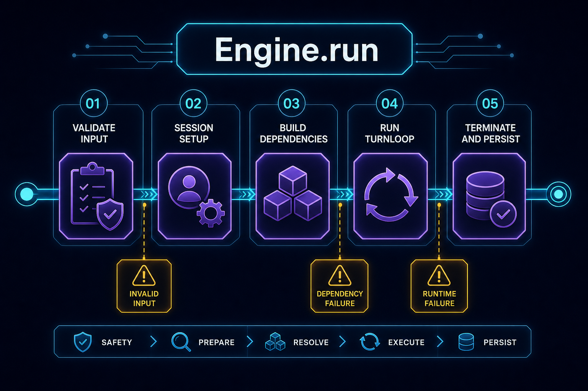
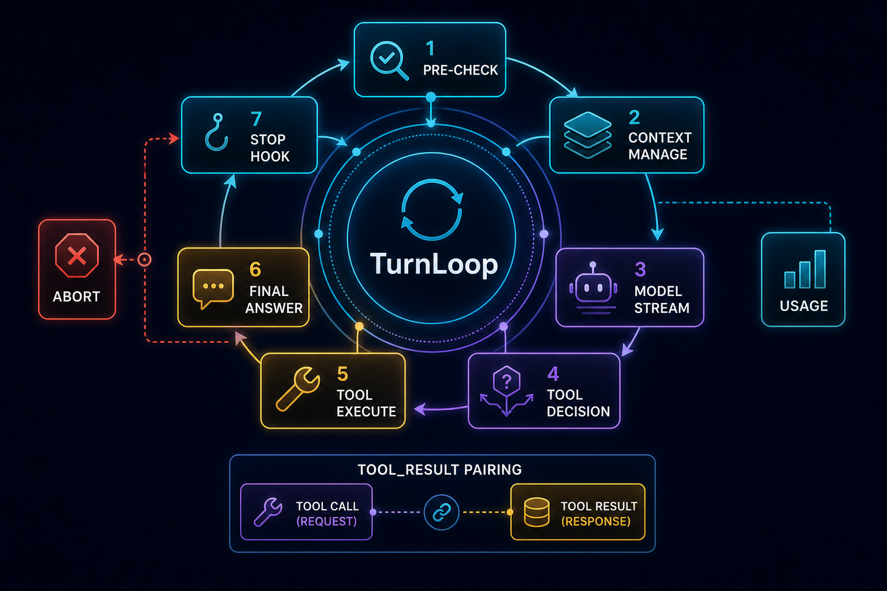
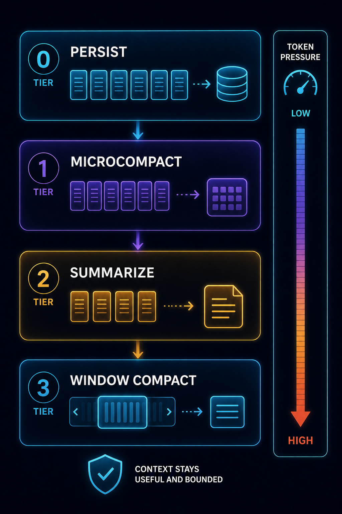
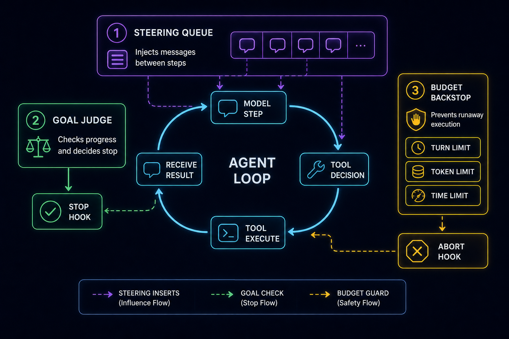

# Engine 与 TurnLoop 深潜：一次任务如何变成多轮模型-工具-上下文闭环

> 本文是 CodeShell Core v2 深度系列第 2 篇。第 1 篇（[`v2-01-core-as-agent-harness.md`](v2-01-core-as-agent-harness.md)）建立了“Core 是通用编排内核、不是 coding agent”的全局心智模型；本篇把视角缩到这个内核的心脏——`Engine` 与 `TurnLoop`——做源码级拆解。读完本篇，你应该能徒手画出一次 `Engine.run` 的五个阶段、`TurnLoop` 每一轮的状态机、上下文压缩的分层逻辑，以及 steering、goal stop-hook、abort 这三套控制流为什么是现在这个形状。后续第 3 篇讲工具系统的安全边界、第 4 篇讲模型与上下文的长期治理、第 5 篇讲协议与宿主编排——它们都依赖本篇这条主线。

源码主战场：`packages/core/src/engine/`（引擎与循环）和 `packages/core/src/context/`（上下文管理）。

---

## 一、先说清楚要解决的是什么问题

一个 agent 最容易被误解的地方，是把它当成"更聪明的聊天"。

聊天系统是一问一答：用户发一句，模型回一句。Agent 不是这样。Agent 的一次"回答"，内部可能包含多轮模型调用、多次工具执行、多次上下文整理，甚至被某个 hook 拦住不让停止、逼着继续干活。

所以当你真的去实现一个生产级 agent 运行壳，会立刻撞上一连串脏活：

- **多轮怎么编排？** 模型这一轮要调工具，工具结果要喂回去让它继续推理，到底什么时候才算"说完了"？
- **上下文窗口有限。** 一个 `Read` 可能几百行，一个 `Bash` 可能几千行日志，聊久了消息数组会撑爆窗口。如何在不丢关键信息的前提下压缩？
- **用户中途按了停止（Esc / Ctrl+C）。** 怎么干净收尾，而不是把它当成一个需要重试的报错？
- **无人值守的长目标。** "一直干到目标达成"怎么实现，又怎么防止它无限循环把 token 烧光？
- **用户在 agent 干活途中又补了一句话。** 怎么把这句话插进去，而不打断当前正在跑的这一轮？
- **进程崩了、worker 被杀、用户刷新了页面。** 重新加载会话后，消息数组里可能有调用了工具却没拿到结果的"孤儿"，provider API 会直接拒绝这种序列。怎么修补？

这些问题的答案，全部收敛在 `engine/` 这一层。它知道**怎么跑一个 agent**，但不知道**怎么写代码**——写代码是 `terminal-coding` preset 叠出来的行为，循环本身对此一无所知。这正是"Core 是通用编排内核"的具体含义：同一颗心脏，换个 preset 就能驱动调研 agent、运维 agent、数字人，循环代码一行不改。

---

## 二、Engine 是装配器，TurnLoop 是状态机

整个引擎层里，两个文件扛起了绝大部分重量：

| 文件 | 角色 |
|------|------|
| `engine/engine.ts`（约 3300 行） | `Engine` 门面——会话生命周期、run 装配、图片策略、权限模式、goal 入口、hook 协调、子 agent 派生 |
| `engine/turn-loop.ts`（约 1200 行） | `TurnLoop` 状态机——模型流式、工具执行、上下文管理、goal 仲裁、终止判定 |

很多 demo 代码会把"准备 LLM client、准备工具、准备权限、准备会话"全部写死在循环里。这样写在第一天能跑，但很快就难以替换模型、禁用工具、切换权限模式、接入插件或做会话恢复——因为运行所需的依赖和运行的推进逻辑被搅在了一起。

CodeShell 的做法是把这两个职责拆开：

- **`Engine` 负责"本次运行需要什么"。** 它在一次 run 开始时准备 `ModelFacade`、`ToolExecutor`、`ContextManager`、`PromptComposer`、`Transcript`、hooks、session state，把它们装配成一组 `TurnLoopDeps` 和 `TurnLoopConfig`。
- **`TurnLoop` 负责"本次运行怎么推进"。** 它拿到装配好的依赖，一圈一圈地转"调模型 → 执行工具 → 再调模型"，直到拿到最终答案或撞上某个边界。

围绕这两个核心，还有一圈支撑模块（都在 `engine/` 下），值得记住名字：

| 文件 | 职责 |
|------|------|
| `model-facade.ts` | 包住具体 `LLMClient`：请求日志、流式转发、transcript 记录、token 记账 |
| `goal.ts` | 持久 goal 的预算结构、回合/stop-block 上限、run 级追踪器 |
| `steer-queue.ts` | 步间引导队列（不打断地插入用户消息）的纯函数 |
| `streaming-tool-queue.ts` | 流式期间并发安全 / 串行工具的执行编排 |
| `token-budget.ts` | 每轮输出 token 的决策（继续 / 催促 / 停止） |
| `reactive-threshold.ts` | 每跨过一个 2000-token 桶就检查一次是否要做流内紧急压缩 |
| `resolve-llm-config.ts` | settings + tag → `LLMConfig`（文本模型；图/视频独立解析） |
| `patch-orphaned-tools.ts` | 恢复时修补孤儿 `tool_use` |
| `image-policy.ts` | 每轮图片门（尺寸 / 张数上限） |
| `parse-task.ts` | 从任务文本里抠出 `<codeshell-image>` 块 |

一个准确性边界要先讲在前面：**不要以为所有 `Engine.run` 都经过 protocol 层。** TUI、headless CLI、桌面 worker、`RunManager` 这些主路径，确实常通过 `AgentServer`/`AgentClient` 协议接缝收口（详见第 5 篇）；但 SDK 嵌入、`asyncAgentRegistry` 里派生的子 agent、测试、专用 runner，完全可以直接装配或派生一个 `Engine` 来跑。**TurnLoop 是引擎内部的循环机制，它和协议层是两回事**——别把"主路径常走协议"误读成"循环本身是协议的一部分"。

---

## 三、一次 run，从头到尾五个阶段



`Engine.run(task, options?)` 返回 `EngineResult`（在 `engine/engine.ts` 里，外层包了一圈 try/catch 把异常翻译成友好错误）。它分五个阶段推进，理解每个阶段"为什么在这个位置"，比记住它叫什么名字重要得多。

### 阶段 1 — 校验与解析输入

这一阶段做的全是"在花钱调模型之前先把输入弄干净"的活：

- **解析 cwd。** 按优先级取：`options.cwd > session.cwd > config.cwd > process.cwd()`。子 agent、不同 host 传进来的 cwd 都靠这个优先级链统一。
- **解析图片。** `parseTaskWithImages`（`parse-task.ts`）从任务文本里抠出 `<codeshell-image mime=… name=…>data:…;base64,…</codeshell-image>` 块。**格式错就抛 `ImageParseError`，不静默兜底**——一个坏掉的图片标记宁可让这次 run 失败，也不能把半截 base64 当文本喂给模型。
- **执行图片策略**（`image-policy.ts`）：单图上限、整轮累计上限、张数上限。超大单图引擎侧压缩或换占位符；超过累计 / 张数上限则**拒绝这一轮**。注意这里是 **fail-closed**：不是悄悄丢掉超额的图，而是明确拒绝，让上层知道。
- **规整 goal。** `normalizeGoal`（`goal.ts`）把 `string | GoalConfig` 统一成 `GoalConfig`，丢掉空目标和非正数的预算（`0` 或负数等于"无限制"，等于没设）。
- **解析回合上限。** `resolveMaxTurns` / `resolveMaxStopBlocks`（`goal.ts`）按 goal 模式算出本次 run 的硬上限（详见第七节）。

### 阶段 2 — 会话与上下文装配

- `SessionManager` resume 或 create，返回一个 `{ transcript, state }` 包。
- `ContextManager` 调用 `initReplacementStateFromMessages`，从已加载的 transcript 里**重建"工具结果持久化决策"**（见第六节的"冻结决策"）。这一步是恢复能正确工作的前提。
- `PromptComposer` 用 `preset + customSystemPrompt + appendSystemPrompt` 拼系统提示。这就是 coding 行为的来源之一：`terminal-coding` 和 `general` 拼出的系统提示不同，但循环不关心。
- **恢复修补：`patchOrphanedToolUses`。** 这是本阶段最关键的一步，下面单独讲。

### 阶段 3 — 组装循环依赖

- `ModelFacade` 包住具体 `LLMClient`（来自 `createLLMClient`，或经 `ModelPool` 拿到的池化客户端）。
- 创建 `subAgentSpawner` 闭包——`Agent` 工具靠它派生子 agent（解析好 cwd / preset / 权限作用域）。
- 把 `TurnLoopDeps { model, toolExecutor, contextManager, hooks, transcript, … }` 和 `TurnLoopConfig { maxTurns, maxToolCallsPerTurn, onStream, signal, goal, maxStopBlocks }` 装配好，交给 `TurnLoop`。

### 阶段 4 — 循环本身（`TurnLoop.run`）

这是第四、五、六节的内容，下面展开。

### 阶段 5 — 终止

发 `on_session_end` hook，刷 transcript 落盘，存 state（终止原因、回合数、用量），返回 `EngineResult { text, reason, sessionId, turnCount, usage }`。

---

## 四、为什么恢复时一定要修补孤儿 tool_use

把 `patchOrphanedToolUses` 单独拎出来讲，因为它是"生产级 agent 不能只考虑 happy path"的最佳教材。

Anthropic 和 OpenAI 的消息格式都有一条硬规则：assistant 消息里每一个 `tool_use`（OpenAI 叫 `tool_calls`）都必须被一个对应的 `tool_result`（OpenAI 叫 `role:"tool"` 消息）应答，一一对应。序列不完整，API 直接 400：

> `An assistant message with 'tool_calls' must be followed by tool messages responding to each 'tool_call_id'`

序列会在两种情况下变得不完整：

1. 模型调了工具，但 turn 之间的某次 API 调用在 executor 写结果之前就失败了。这种 TurnLoop 在 run 中途自己会补，坏状态只活在内存里。
2. **进程在 assistant 消息已经落盘 `transcript.jsonl`、但 `tool_result` 事件还没追加进去的时候崩了 / 被 Ctrl+C 了。** 等用户 `/resume`，加载出来的消息数组就带着这个缺口进了下一次 API 调用。

`patch-orphaned-tools.ts` 就是恢复侧的对手戏：它扫整段加载出来的历史（不是只看尾巴），先一遍预计算出"已经被应答过的 `tool_use_id` 集合"（避开"每个 assistant 都去扫尾巴"的 O(n²)），然后从左到右走一遍，给每个孤儿 `tool_use` 在它正确的位置补一个合成的 `tool_result`：

```
type: "tool_result", tool_use_id: id,
content: "Error: Tool execution did not complete …",
is_error: true   // 关键：标成错误，否则模型会把它当成成功的工具输出
```

合成结果以一个新的 `user` 消息插在产生孤儿的 assistant 消息**紧后面**——这正是执行正常完成时运行时本该写入的位置。OpenAI 转换器会把每个 `tool_result` 提成独立的 `role:"tool"` 消息，恰好就是 API 要的形状。这个函数还是**幂等**的：再调一次是 no-op，因为第一遍已经把所有缺口填满了。

这就是本文第一个值得记住的**故障模式**：跨 turn 的崩溃会留下孤儿 tool_use，恢复时不修补，下一次模型调用必然 400。

---

## 五、循环一圈：TurnLoop 的状态机



`TurnLoop.run` 是一个 `while` 循环，每一次迭代就是一个**回合（turn）**。一圈的主干是：

```
预检 ─▶ 调模型 ─▶ 调模型后检查 ─▶ 工具决策 ─┬─▶ 最终答案 ─▶ on_stop
                                          └─▶ 工具执行 ─▶（下一轮）
```

下面按顺序拆。

### a. 预检

- **Abort 快速路径**：循环顶部先查 `signal.aborted`。中止了就立刻返回，**不做任何昂贵的活**——别在用户已经按了停止之后还去跑一次上下文压缩或调一次模型。
- **步间引导**：`consumeSteerItems` 把步间队列里排队的用户消息**不打断当前轮**地拼进去（见第八节）。
- **临近上限警告**：靠 `limitProximity` 同时盯两条线——剩多少回合（`maxTurns`）和剩多少次连续 stop-block（`maxStopBlocks`）。临近时注入一条 `system-reminder` 催模型收尾；回合到 0 时，最后一轮被约束成只能给答案、不能再用工具。这里有个细节：旧代码只盯 `turnsRemaining`，但一个被反复 re-block 的 goal 几乎总是先撞上紧得多的 stop-block 上限，所以现在两条线一起盯，`nearest` 偏向 stopBlocks。
- **上下文管理**：`ContextManager.manageAsync(messages)` 跑分级压缩（见第六节）。注意它在调模型**之前**跑——压缩的目的就是让这一轮的 prompt 不超窗口。

### b. 调模型（通过 Facade）

为什么不在 TurnLoop 里直接调 provider SDK？因为 provider 差异太多：streaming 事件格式不同、tool call 表达不同、stop reason 不同、token usage 字段不同、reasoning/thinking 字段不同、截断和重试策略不同。`ModelFacade` 把这些差异吃掉，TurnLoop 只关心三件事：这轮模型说了什么、有没有 tool calls、stop reason 是什么。

`callModelWithFallback` 从 `ModelFacade` 流式拿结果，`tool_use` 块**边到边入队**到 streaming tool queue（见第九节）。这一步有几个故障模式的处理：

- **撞 `ContextLimitError`**：丢掉最老的几轮重试，最多 3 次；3 次还不行就 `patchOrphanedToolUses` 兜底（重试丢轮可能把 tool_use/result 切断）。
- **撞 `AbortError` / `signal.aborted`**：`markStopped()` 返回 `aborted_streaming`——**中止不是错误**（见第十节不变量 2）。
- **截断续写**：如果模型因为打满输出 token 在工具调用中途停了（stop reason 是 `length`），带一句"继续"的提示重试最多 3 次，把半截的 tool call 续完。这是第三个故障模式：**模型半截 tool_call**，不处理就会得到一个永远配不上 result 的破 tool_use。

### c. 调模型后检查

- `emitCtxFromUsage` 从这轮真实的 `promptTokens` 反推 prompt 开销，喂给 `ContextManager.recordActualUsage`（混合估算，见第六节）。
- **goal 预算检查**：`goalBudgetExceeded(goalTracker, Date.now())` 在**调模型后、执行工具前**检查 token / 时间预算。为什么卡在这个位置？因为模型刚消耗完 token、还没开始执行可能有副作用的工具——这是"再花钱之前最后一次能干净刹车"的时机。超了就强制停。

### d. 工具决策

模型这轮**没有**工具调用 ⇒ 走最终答案路径；**有** ⇒ 走工具执行路径，执行完进入下一轮。这就是 agent 和聊天的本质分界：

> 普通 chat 的输出面向用户。Agent loop 的输出**先面向下一轮模型**。工具结果不是最终答案，而是下一轮推理的输入。

比如 coding agent 里，模型先 `Read` 看文件、再 `Grep` 找引用、再 `Edit` 改代码、再 `Bash` 跑测试——每一步的结果都进下一轮上下文。没有 loop，工具调用只是孤立动作；有了 loop，工具调用才变成任务推进。

### e. 最终答案路径

发 `assistant_message`，然后跑 `on_turn_end` 和 `on_stop` hook。`on_stop` 是 goal 的接缝（见第十节）：

- 如果某个 hook 返回 `continueSession` 且 `stopBlockCount < maxStopBlocks`：计数 +1、发 `goal_progress(not_met)`、注入催继续的提示、**继续循环**。
- 否则正常收尾；如果是撞到 stop-block 上限才停的，以 `exhausted` 状态收尾。

**对于普通无 goal 的交互对话，这个内置 goal 处理器是 no-op**——`on_stop` 照样 fire，但没有 goal 时没人返回 `continueSession`，循环就正常停。

### f. 工具执行路径

`streamingQueue.drain()` 把并发安全的工具并发跑、不安全的串行跑（见第九节）。`maxToolCallsPerTurn` 拦溢出。每个工具走一条固定流水线：

```
pre_tool_use hook（权限 + 前置）
  → ToolExecutor.executeSingle
  → post_tool_use hook
  → toolResultToBlock（结果转块）
  → 把 tool_result 推回消息数组
  → 继续
```

工具执行这一段的安全机制（权限分类、path policy、sandbox、hooks 只能收紧）是第 3 篇的主题，本篇只需记住一点：**结果一执行完立刻推回消息数组，紧邻它的 tool_use**——这是后面所有不变量赖以成立的基础。

### complete_goal：模型主动声明完成

循环里还有一条短路：如果模型调用了内置工具 `complete_goal`（`tool-system/builtin/complete-goal.ts`），TurnLoop 会把 `stopBlockCount` 清零并短路收尾。这是 goal 模式的"主动声明"通道，和 stop-hook 的"被动裁决"互补——两者都认为活干完了，goal 才清（见第十节）。

---

## 六、上下文管理：从免费无损到昂贵有损的分级压缩



先纠正一个常见误解：**上下文压缩不是"超长就删最旧消息"**。机械删 token 能避免 API 报错，但会破坏任务连续性——压缩后模型不知道自己做过什么，就会重复探索、误改文件、丢失目标。

把 agent 的状态系统理解成三层会更清楚：**Context Window 是工作台**（当前这次调用要用的材料，短期、有限、昂贵），**Transcript 是账本**（会话发生过的事实记录，完整、可审计、不全量进模型），**Persistent Memory 是长期知识**（跨会话沉淀，第 4 篇主题）。本篇讲的压缩，全部发生在"工作台"这一层——`ContextManager.manageAsync(messages)`（`context/manager.ts`）按逐级加重的手段压缩，编排在 `manager.ts`，各 tier 的纯函数在 `compaction.ts`：

- **Tier 0 — 持久化 + 常驻去废**（`context/tool-result-storage.ts`）：
  - `persistLargeToolResults`：单个超过约 50 KB（`DEFAULT_PERSIST_THRESHOLD`）的 `tool_result` 写到 `<transcriptDir>/tool-results/<toolUseId>.txt`，在上下文里换成 `[文件路径 + 2KB 预览]` 块。还有一个每消息聚合上限（约 200 KB），把最大的几个结果打包到预算之下。
  - `truncateToolResults`：持久化关掉或写盘失败时的硬截断兜底。
  - `dedupeFileReads`：同一路径被 Read 多次 ⇒ 只留最新，旧的换成"已被取代"标记。
  - `maskOldObservations`：只留最新一份 `browser_observe` 快照，旧的折叠掉（浏览器场景下省 token 杠杆最大）。
- **Tier 1 — microcompact**（`compaction.ts`）：**零成本、无损**。对可重取的工具（`COMPACTABLE_TOOL_NAMES`：Read / Glob / Grep / Bash / PowerShell / REPL / WebFetch / WebSearch / NotebookEdit）清掉较老的 `tool_result` **内容**，只留一行指纹 `[Old tool result cleared — …]`——反正需要时模型能再调一次。**带状态的工具（TaskUpdate / Agent / Skill）原样保留**，因为它们不可重取。有一个约 0.7 的下限比例，没到就不动。
- **Tier 2 — summarize**（异步）：超过约 0.85 占比时，让 aux 模型做**滚动**摘要——在上一版摘要上合并，而非从头重摘，所以细节是缓慢侵蚀而不是一次性丢光。连续失败 3 次回退到同步的 `snipCompact → windowCompact` 路径。
- **Tier 3 — window 紧急压缩**：超过约 0.92 时，只保留首 + 尾 N 条，作为撞 `prompt_too_long` 之前的最后手段。
- **流式反应探针**（`reactive-threshold.ts`）：流式期间累计响应 token，每跨过一个 2000-token 桶，可能触发一次流内紧急 window 压缩——防止单轮模型输出过长把窗口在 turn 中途撑爆。

这套设计里有三个值得专门记的取舍：

1. **冻结决策。** 某个 `tool_use_id` 的持久化命运一旦确定，整个会话不再变（`ContentReplacementState`）。为什么？因为模型是基于它**看到过的**内容建立状态的；如果同一个 tool 结果这轮显示完整、下轮又换成预览、再下轮又换回来，模型会被反复改写的内容搞乱。`reconstructContentReplacementState` 在恢复时重新推导这个状态——这正是阶段 2 那一步的意义。
2. **保持不变量的切片。** `adjustIndexToPreserveAPIInvariants`（`compaction.ts`）把压缩切片向后扩，保证**永远不切断一对 `tool_use`/`tool_result`**。`snipCompact` 和 `windowCompact` 都用它。
3. **混合估算。** `recordActualUsage` 存上一轮的真实 `promptTokens` 当基准，`estimateTokensHybrid` 只估算之后新增的消息——所以 token 估算每轮都向真值收敛，不靠拍脑袋的字符数除以 4。

这里牵出一条**改代码的人必读的不变量警告**：Tier 0 那套保护 tool_use/result 配对的逻辑是**单遍扫描**，它依赖"result 紧邻 use"这条不变量。如果哪天你改 TurnLoop，让工具结果延迟返回或乱序返回，必须同步把压缩改成 re-scan，否则配对保护会失效——这是仓库里专门记过的一个坑。

---

## 七、回合上限与预算：交互和 goal 为什么默认值不同

`goal.ts` 里定义了两组上限，交互和 goal 模式默认值刻意不同，原因是 **goal 是无人值守的、stop-hook 会反复挡住收尾**：

- **`maxTurns`**：交互默认 100（`INTERACTIVE_DEFAULT_MAX_TURNS`），goal 默认 300（`GOAL_DEFAULT_MAX_TURNS`）。优先级 `config > goal.maxTurns > 默认`（`resolveMaxTurns`）。一个 goal 例行需要比单条交互 prompt 多得多的回合，100 的交互上限会悄悄截断一个长 goal。
- **`maxStopBlocks`**（收尾前裁判连续挡几次）：交互 8（`INTERACTIVE_DEFAULT_MAX_STOP_BLOCKS`），goal 25（`GOAL_DEFAULT_MAX_STOP_BLOCKS`）。优先级同上（`resolveMaxStopBlocks`）。更紧的交互上限是**为了防一个插件 `on_stop` hook 在普通对话里循环 25 次**（约等于 3 倍的模型调用）——别把 goal 模式宽松的上限泄漏到普通交互会话上。

要分清主次：**无人值守 goal 的真正安全网是 token / 时间预算**（`GoalBudgetTracker`，run 级追踪，在执行工具前查）；`maxStopBlocks` 只在裁判一直挡、且两次挡之间毫无进展时才咬——一个合法地在推进的 goal，每被接受一轮就把这个计数清零。

run 中途还能扩预算：`applyGoalExtension` 允许加 turns / token / time。这里有个修过的 bug（B1）值得一提：给一个**之前未设上限**的 goal 扩 time 预算时，新上限要从**当前已用量**播种再往上加（`timeBudgetMs ?? elapsedMs`），而不是从 0 播种——否则一个跑了很久的无界 goal，一扩预算就拿到一个低于已用时间的上限，立刻被强制停。这是"给无限制的东西加限制"时反复出现的边界陷阱。

---

## 八、Steering：为什么是步间、不打断



用户在 agent 干活途中想补一句话，有两种语义，CodeShell 都做了，但要分清：

- **打断重发**（UI 里的"steer"按钮的一种用法）：abort 当前轮，开一个新轮。这是真的中断。
- **步间引导**（本节主角）：**不打断**当前轮，在下一个步边界把消息插进去。

`steer-queue.ts` 是一组对"每会话一个 `{id, text}` 列表"的**纯函数**——纯到可以脱离 Engine/TurnLoop 单测。host 在 run 进行中调 `Engine.enqueueSteer(sessionId, text, id)`，循环在每个步边界调 `consumeSteerItems` 把队列里的消息当**普通 user 轮**拼进去——`consumeSteerItems` 一次性把整个列表 drain 出来并清空。

几个细节：

- 每条带一个稳定 `id`，目的有二：一是让随后的 `steer_injected` 事件能和 UI 里显示过的草稿气泡对上（按 `id`），二是让还没被消费的条目能被 `removeSteerItem` **撤回**。
- `removeSteerItem` 返回 `removed: false` 表示这条**已经被消费了**——已经拼进 run 里了，拿不回来。

为什么是步间而不是真流内插入？因为真正在模型流式输出的中途插一条 user 消息，会破坏正在构造的消息序列（尤其当这一轮有 tool_use 块正在边到边入队时）。步边界是唯一安全的注入点——这也呼应了第六节的不变量。

---

## 九、Streaming Tool Queue：并发跑安全的、串行跑不安全的

`streaming-tool-queue.ts` 解决一个很实际的问题：模型一轮可能调好几个工具，这些工具能不能并发？答案是"看工具"。

`StreamingToolQueue` 的逻辑：

- **enqueue 时**（流式期间，tool_use 块边到边到达）：如果 `executor.isConcurrencySafe(toolName)` 为真，**立刻开始执行**（比如 Read / Grep 这种只读、无副作用的，并发跑没问题）；不安全的（比如会改文件、改状态的）压进 `unsafeQueue`，等串行跑。
- **drain 时**（流式结束后）：先把 `unsafeQueue` 里的不安全工具**一个接一个**跑完，再 await 所有（包括 enqueue 时就启动的安全工具）结果，最后**按原始 enqueue 顺序**返回。

这里藏着一个被注释专门标注的故障模式：**一个工具的 promise 可能 reject，不只是 resolve 成 error ToolResult**——因为 `permission.handleAsk`（以及 `pre_tool_use` 的 "ask"）会在 `executeSingle` 的 try/catch 之外抛错。所以每个 await 都funnel 过 `toResult()`，把抛出的值转成一个合成的 error ToolResult；任何到最后还缺结果的 id，也补一个。绝不能让一个 reject（a）中断整个 drain、丢掉其他工具的结果，或（b）留一个洞、让下游 `toolResultToBlock` 拿到 `undefined` 崩掉。

为什么这么小心？回到第十节不变量 1：每个 `tool_use` 必须有 `tool_result` 应答。哪怕工具炸了，也得给它一个（错误的）结果，否则消息序列又会出现孤儿。

---

## 十、Goal stop-hook：让停止从"模型说停"变成"系统裁决停"

最简单的停止条件是：模型这轮没调工具，就结束。但长任务里这远远不够——模型很容易因为一次**局部完成**就提前停。比如目标是"修好所有失败的测试"，模型修好了第一个就宣布完成了。

所以 goal 模式给 `on_stop` 挂了一个裁判 hook（`hooks/goal-stop-hook.ts`）。它的设计哲学和 Claude Code 的 Stop-hook 一致：**核心循环保持"笨"——不内置 goal 判断——"我们干完了吗"这个决策活在 hook 里**。

`createGoalStopHook` 注册的处理器，在模型想停时做**一次有界的判断调用**（针对会话模型，问"目标达成了吗？还差什么？"）：

- 没达成且没到 `maxStopBlocks`，返回 `continueSession: true` 加一条续作提示，让循环继续干。
- 达成了，通过 `onMet` 回调清掉会话持久化的 `activeGoal`，这样之后一条裸 send 不会又继承一个已经满足的 goal。

这里有一个**关键且反直觉的设计**：**判断调用失败（抛错或返回无法解析的文本）时，不允许停止**——照样返回 `continueSession: true` 催模型继续。理由很硬核：在无人值守的 run 里，悄悄允许停止会让 goal 静默失败、没人发现。所以宁可"判不出就继续"，把"无限循环"这个风险交给真正的硬底线去兜——也就是 **token / 时间预算 + `maxStopBlocks`**，而不是这个 hook 本身。

这就是为什么需要 `maxStopBlocks`：stop-hook 本身在故障时是"倾向继续"的，必须有一个独立于它的连续阻塞计数来防止一个不可满足的 goal 把循环卡死。两套机制——主动的 `complete_goal` 和被动的 stop-hook 裁判——都得点头，goal 才清。

### goal 忙等修复：停泊，不是自旋

还有一个真实修过的故障模式。一个跑着 goal 的 run 启了后台 job（比如 `GenerateVideo` 的轮询），过去会出现：模型想停 → 裁判说"视频还没好，继续" → 模型只好用 `Sleep` 自旋等 → 烧 token。

修复：goal-stop-hook 在判断前会调 `listRunningBackgroundWork`（来自 `tool-system/builtin/background-work.js`）把运行中的后台 job 纳入概览，让模型知道"这活有限、有人在后台干"；turn loop 则**停泊**到后台完成再唤醒，而不是逼模型自旋。这条后台唤醒路和第 5 篇讲的统一唤醒机制是同一套。

---

## 十一、恢复与异常：abort 不是错误，崩溃可修补，但别过度承诺

把本篇散落的故障处理收拢成一组**不变量**，这是循环正确性的契约：

1. **`tool_use` ↔ `tool_result` 成对。** 每个 `tool_use` 必有 `tool_result` 应答，顺序紧邻——Anthropic/OpenAI 消息格式的硬要求。循环靠"执行后立刻发结果"维持，恢复时靠 `patchOrphanedToolUses` 修补，压缩时靠 `adjustIndexToPreserveAPIInvariants` 保护。
2. **中止是终态，不可重试。** 用户 Esc/Ctrl+C 置位 signal，循环在三处检查（顶部、上下文管理后、调模型后），返回**非错误**的 `aborted_streaming`。用户中止**永远不喂回重试策略**——把用户主动的停止当成可重试的故障，会导致按了停止却还在跑。
3. **Goal 预算是硬底线。** run 级追踪器（token + 墙钟 + 回合 + 连续 stop-block）在执行工具前检查，run 中途不可越过。
4. **图片策略 fail-closed。** 超额图片拒绝这一轮，而不是悄悄丢内容。

关于"可恢复"，要给一条**准确性红线**。本篇讲的 `patchOrphanedToolUses`、transcript 落盘、session state，确实让会话能从磁盘干净重建。但**不要把这个性质推广成"所有后台任务都跨进程重启可恢复"**。真相是分层的（详见第 5 篇 / `07-run-automation-goal.md`）：

- **明确持久化、可恢复的**：`RunManager` 的 snapshots/events/checkpoints、cron 的 job specs、session 的 `activeGoal`、transcript/state。
- **一般不跨重启恢复的**：任意在飞的 model stream、外部 child process、普通后台 shell、部分同步/异步子 agent 的状态。它们绑在 worker 上，worker 重启不保留它们。

换句话说：goal / run / cron 是**专门设计**成可恢复的子系统；turn loop 内部的崩溃修补也确实存在；但"在飞的这一次模型流"本身不是 restart-durable。

---

## 十二、源码阅读路线

按这个顺序读，能最快把本篇的心智模型对上代码（行号会漂移，按"在这些文件附近找符号"为准）：

1. **`engine/engine.ts` 的 `Engine.run`**：顺着五个阶段走一遍，重点看图片策略 fail-closed、`normalizeGoal`、`resolveMaxTurns`/`resolveMaxStopBlocks`、`patchOrphanedToolUses` 在阶段 2 的调用点。
2. **`engine/turn-loop.ts` 的 `TurnLoop.run`**：对照本篇第五节的状态机。重点看 `signal.aborted` 的三处检查、`consumeSteerItems`、`callModelWithFallback` 的三种重试、`goalBudgetExceeded` 在调模型后的检查点、`on_stop` 返回 `continueSession` 后的 `stopBlockCount` 逻辑、`complete_goal` 的短路。
3. **`engine/patch-orphaned-tools.ts`**：读 `patchOrphanedToolUses`，理解恢复时为什么要合成 `is_error: true` 的结果。
4. **`engine/streaming-tool-queue.ts`**：读 `enqueue`（并发安全 vs 串行）和 `drain`/`toResult`（reject 也要变成 error 结果）。
5. **`context/manager.ts`（分级编排）和 `context/compaction.ts`（各 tier 纯函数）**：重点看 `manageAsync` 的 tier 顺序、`adjustIndexToPreserveAPIInvariants`、`estimateTokensHybrid`、冻结决策。
6. **`context/tool-result-storage.ts`**：读 `persistLargeToolResults` 和 `dedupeFileReads`/`maskOldObservations`。
7. **`engine/goal.ts`**：读 `resolveMaxTurns`/`resolveMaxStopBlocks`/`applyGoalExtension`/`goalBudgetExceeded`。
8. **`hooks/goal-stop-hook.ts`**：读裁判逻辑，重点是"判断失败不允许停止"。
9. **`engine/steer-queue.ts`**：三个纯函数 `enqueueSteerItem`/`consumeSteerItems`/`removeSteerItem`。

旧版结构参考图（事实结构，非本篇主图）：[`assets/engine-turn-loop.svg`](assets/engine-turn-loop.svg)、[`assets/context-compaction.svg`](assets/context-compaction.svg)。

---

## 十三、常见误解与边界

- ❌ "所有 `Engine.run` 都经过 protocol。" → ✅ turn loop 是引擎内部循环，不等于协议层；TUI/headless/桌面 worker/RunManager 等主路径常走 `AgentServer`/`AgentClient` 接缝，但 SDK、子 agent、测试、专用 runner 可以直接装配或派生 `Engine`。
- ❌ "中止 = 报错重试。" → ✅ 用户中止是终态，返回非错误的 `aborted_streaming`，永不喂回重试。
- ❌ "上下文压缩 = 删最旧消息。" → ✅ 它是从无损 microcompact 到滚动摘要再到 window 紧急压缩的分级策略，且专门保护 `tool_use`/`tool_result` 配对不被切断。
- ❌ "goal 没达成会一直空转烧钱。" → ✅ token/时间预算是硬底线，后台 job 是停泊不是自旋，`maxStopBlocks` 兜住不可满足的循环。
- ❌ "所有后台任务都跨进程重启恢复。" → ✅ 只有 run/cron/持久 goal/transcript/state 等声明持久化的子系统可恢复；在飞 stream、外部子进程、普通后台 shell 不行。
- ⚠️ **改 turn loop 让工具结果延迟/乱序返回时要小心**：Tier 0 的成对保护是单遍扫描，依赖"结果紧邻调用"这条不变量；要延迟/乱序，必须同步把压缩改成 re-scan。
- ⚠️ `complete_goal` 和 stop-hook 是互补不是冗余：前者是模型主动声明，后者是系统被动裁决，二者协作才决定 goal 何时清。

---

## 十四、结语

`Engine` 和 `TurnLoop` 的分工——装配器 vs 状态机——不是为了"看起来分层好看"，而是为了让这颗心脏**可移植、成本可控、恢复合法、能被用户步间补话、无人值守时有硬预算**：

- **循环本身可移植**：它不知道在写代码还是做调研，所以同一颗心脏能驱动任意 preset 的 agent——这正是"Core 是通用编排内核、不是 coding agent"的最直接证据。
- **成本可控且自校正**：分级压缩按需付费（无损优先），token 估算逐轮向真值收敛。
- **可恢复**：成对不变量 + 持久化 + 冻结决策 + 孤儿修补，让会话能从磁盘干净重建。
- **交互体验**：步间引导让用户能"边跑边补话"，不必打断重来。
- **无人值守安全**：goal 预算硬底线 + stop-hook 裁判 + 后台停泊，让长目标既能跑久又不失控。

这颗心脏向外供血，靠的是工具系统让 agent “能做事”。但 agent 真正接触世界之前，必须先学会被约束——这是第 3 篇 [`v2-03-tool-system-security-deep-dive.md`](v2-03-tool-system-security-deep-dive.md) 的主题。
