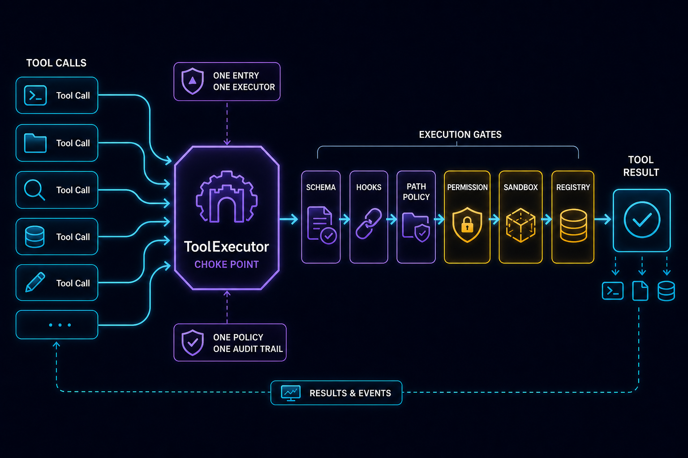
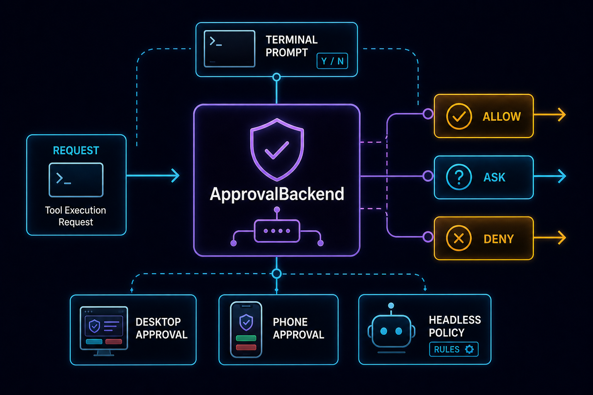
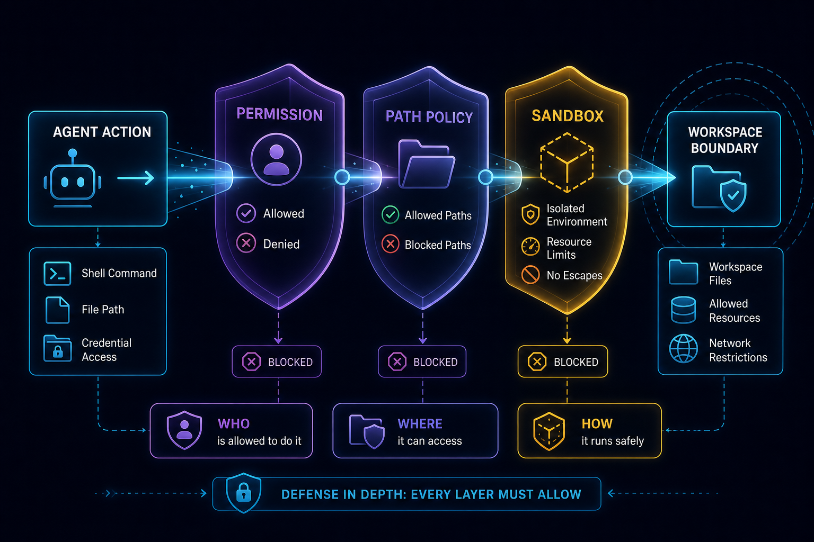
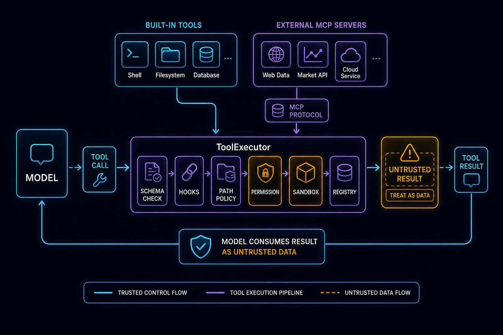

# Tool System 安全深潜：为什么 Agent 能做事之前，必须先学会被约束

> 本文是 CodeShell Core v2 深度系列第 3 篇。第 [01 篇](v2-01-core-as-agent-harness.md) 立了基调——CodeShell Core 是**通用 Agent 编排内核**，coding 行为只是 `terminal-coding` preset 叠加出来的配置；第 [02 篇](v2-02-engine-turn-loop-deep-dive.md) 拆了 `Engine.run` 与 `TurnLoop.run`，讲清了“模型说话 → 调工具 → 结果回灌 → 再说话”这个多轮闭环。本篇接着回答闭环里那个最危险的环节：**当模型说“我要调这个工具”，这句话到底经历了什么，才变成真实的副作用。**
>
> 源码主战场：`packages/core/src/tool-system/`。

一个能读文件、跑 shell、派子 agent、调外部 MCP 服务的模型，已经不是「语言系统」，而是「行动系统」。它的每一句 `tool_use` 都可能落地成删文件、改代码、读密钥、发网络请求。所以工具系统的核心问题，从来不是「怎么执行一个函数」，而是：**怎么让一个会幻觉、会被注入、会被诱导的模型，在能做事的同时不会乱来，也不会因为一次坏调用拖垮整轮对话。**

CodeShell 给出的答案可以浓缩成一句话：**所有工具——内置的、MCP 的、子 agent 的——都从同一个 `ToolExecutor` 过；所有安全检查在这里按「先便宜后致命」排好序；executor 本身永不抛错。** 读懂这条管线，你就明白为什么这套系统敢把 `Bash` 直接交给模型。

本篇按真实执行顺序展开，配合源码锚点，最后给故障模式、源码阅读路线和常见误解。

---

## 1. 错误直觉：工具系统是一张「函数表」

很多 agent 的第一版工具系统长这样：模型返回 `{ name: "read_file", args: {...} }`，系统查表 `tools[name](args)`，执行，返回。这能跑通 demo，但它没有回答几个生产系统绕不过去的问题：

- 这个工具名真的存在吗？还是模型幻觉出来的？
- 参数合法吗？模型经常缺字段、传错类型、多塞内部字段。
- 当前模式允许写文件吗？（比如 plan 模式只该只读）
- 这个路径越过工作区了吗？是 `~/.ssh/id_rsa` 吗？
- 这条 Bash 命令危险吗？用户授权过吗？
- 外部 MCP 工具的输出，能当系统指令信吗？
- 执行前后要不要触发项目自定义的 hook？

函数表回答不了这些。函数表的设计哲学是「工具系统是 action layer（执行层）」；而生产级 agent 需要的是「工具系统是 **control layer（控制层）**」——执行只是这条控制管线的最后一步。

CodeShell 把这个控制层落成两个分工明确的类：

| 类 | 职责 | 文件 |
|------|------|------|
| `ToolRegistry` | **能力本身**：注册哪些工具、超时默认、abort 级联、把调用派发到真正的 handler | `registry.ts` |
| `ToolExecutor` | **每次调用的完整生命周期**：能力门、plan 模式、schema、hooks、路径策略、权限分类、再派发给 registry | `executor.ts` |

外加几个被 executor 调用的边界模块：

| 文件 | 角色 |
|------|------|
| `permission.ts` | `PermissionClassifier` + 三个审批后端、规则匹配、Bash 链式命令守卫 |
| `path-policy.ts` | 声明式敏感路径检测、realpath 双侧 containment、审批缓存 |
| `sandbox/index.ts` | OS 级沙箱后端（seatbelt / bwrap / off） |
| `mcp-manager.ts` | MCP 连接、工具发现、`wrapMcpOutput` 防注入、图片溢出落盘 |
| `builtin/index.ts` | `BUILTIN_TOOLS` 注册表（60+ 工具）+ 守卫 |

---

## 2. ToolRegistry vs ToolExecutor：能力与生命周期的分工

这两个类经常被混为一谈，但它们职责不同，理解这个分工是读懂整条管线的前提。

### ToolRegistry：「当前 agent 到底有哪些能力」

`ToolRegistry`（`registry.ts`）回答的是「能力清单」问题。它持有一个 `Map<string, RegisteredTool>`，构造时通过 `registerBuiltins(selectedBuiltinTools)` 把内置工具装进去，运行时还会被 `MCPManager` 调用 `registerTool` 注册外部 MCP 工具。

注意构造函数里这段（`registry.ts:30` 附近）——它是后面要讲的「改两处」坑的根源：

```ts
private registerBuiltins(selectedBuiltinTools?: readonly string[]): void {
  const selectedNames = selectedBuiltinTools ? new Set(selectedBuiltinTools) : null;
  // ...校验 selectedNames 里没有未知工具名...
  for (const tool of BUILTIN_TOOLS) {
    if (selectedNames && !selectedNames.has(tool.definition.name)) {
      continue;  // ← 不在白名单的工具被静默丢掉
    }
    this.tools.set(tool.definition.name, tool.definition);
    this.builtinExecutors.set(tool.definition.name, tool.execute);
  }
}
```

`BUILTIN_TOOLS` 表里可能有 60+ 个工具，但实际注册哪些，由 `selectedBuiltinTools`（即 preset 白名单）决定。**不在白名单的工具，registry 直接跳过，连注册都不注册。**

registry 的第二个职责是「派发执行」——`executeTool(name, args, options)`（`registry.ts:85`）。这里它做三件关键的事：

1. **查工具**：找不到就抛 `ToolNotFoundError`。
2. **解析超时**，优先级是「每调用 override > 工具声明的 `timeoutMs` > 默认 `DEFAULT_TOOL_TIMEOUT_MS`（120s）」。`Agent` / `Bash` 这类长任务会声明更长的 `timeoutMs`。
3. **建子 AbortController**，挂在父 signal **和**超时定时器上，把 `__signal` 注入 args（`registry.ts:128`），让 `Agent` / `Bash` 这类长任务能轮询取消，然后 `Promise.race([executor(...), abortPromise])`。

最后把结果统一规整成 `ToolResult`：纯字符串、或带 `contentBlocks`（`ViewImage` 回传图片块）、或带 `sandbox`（Bash 沙箱标记）。**关键是 registry 的 `executeTool` 也永不抛错**——任何异常都被 catch 成 `{ error, isError: true }` 返回（`registry.ts:166` 的 catch）。

### ToolExecutor：「这一次调用要不要、能不能、怎么执行」

`ToolRegistry` 不管权限、不管路径、不管 hook——它只知道「有没有这个工具」和「怎么跑它」。把这些安全决策塞进 registry 会让它变成一个无所不知的上帝类。CodeShell 的选择是：**registry 只管能力与派发，所有安全门禁集中在 `ToolExecutor.executeSingle` 一个方法里。**

这就是「单一收口（choke point）」的本质——下一节展开。



---

## 3. 完整执行管线：`executeSingle` 的生命周期

`ToolExecutor.executeSingle(callIn)`（`executor.ts:119`）是整个工具系统的心脏。模型每发一个 `tool_use`，TurnLoop 都把它喂给这个方法。它的内部顺序刻意遵循「**最便宜、最致命的检查在前**」原则，已取消或被禁的分支瞬间返回，绝不浪费一次 hook 往返或 handler 执行。

按源码顺序，一次调用依次穿过这些门：

**① abort 快路（`executor.ts:131`）。** 第一件事就是 `if (this.signal?.aborted)`：如果用户已经按了 Stop，立刻返回一个合成的错误结果，**不跑 hook、不跑权限分类、不跑 handler**。为什么要在这里再查一次（registry 内部也查）？因为一个被 abort 的子 agent 可能在 turn 里排了一批工具（比如 10 个 Read）。如果只靠 registry 内部那道检查，每个调用还是会先付掉这里的 hook / 权限往返成本。这道前置快路让整批工具瞬间塌缩——这是子 agent abort 泄漏修复的一部分，避免被取消的孩子在 abort 后继续烧工作。

**② 能力门（`executor.ts:145`）。** 两类拒绝：

- **被项目标记 `off` 的内置工具**：它已经从模型的工具列表里被隐藏（engine 侧 `applyBuiltinOverrideVisibility`），但模型仍可能「记得」它的名字而硬调。registry 里其实还握着这个工具，所以这里必须拦——返回错误，明确告诉模型「不要重试」。
- **不在本项目允许列表的 MCP 工具**：registry 是 worker 内多 session 共享的，可能握着别的 session 启用的 MCP 服务工具。可见性过滤把它们从本 session 的列表里藏掉，这里再拦一次直接调用（`executor.ts:176`）。

这就是**双层防御**：prompt 层隐藏 + executor 层拒绝。可见性本身是权限边界的一部分，但绝不能只靠可见性。

**③ plan 模式门（`executor.ts:220`）。** plan 模式下只放只读工具（`PLAN_MODE_ALLOWED_TOOLS`，与 engine 的可见性过滤共享同一个集合，防止「模型看见的集合」与「executor 跑的集合」漂移）。这里有个微妙处理：`Bash` 在允许列表里——好让模型能用它做只读探查——但「在列表里」不等于「可以写」。一条会改文件的 Bash 命令（`echo >`、`sed -i`、`mv` …）必须在这里被 `classifyBashCommand` 判为非 `safe-read` 后拦下（`executor.ts:228`），否则它会绕过 plan 模式溜进正常权限流（那里用户可能批准它），而且**完全不留 diff**（因为它没碰 Write/Edit）。

`classifyBashCommand`（`permission.ts:796`）本身就是一个小型安全分类器：先扫描 `;`、`&&`、`||`、反引号、`$(`、重定向这些能在只读前缀后链接写命令的元字符；再把每个命令段按安全读 / 安全写 / 不安全 / 危险分级；管道命令要求**每一段都只读**。它**故意排除** `node -e`、`python -c`、`sed -n` 这类「看起来只读、实则能跑任意代码」的命令。

**④ schema 校验（`executor.ts:253`）。** 模型生成的参数不是可信输入。executor 统一调 `validateToolArgs` 对照工具声明的 `inputSchema` 校验，失败返回标准的 `Invalid input: ...` 错误。这一层的意义不是用户体验，而是**系统边界**：有了它，工具实现只需处理已经合法的参数，不必每个工具都退化成一个小 parser。

**⑤ `pre_tool_use` hook（`executor.ts:265`）。** 项目/插件的 hook 在这里能拦截：返回 `deny` 直接拒绝；返回 `updatedInput` 改写参数（改写后会**重新校验** schema，防止恶意/错误改写绕过校验，`executor.ts:285`）；返回 `ask` 触发交互确认。**唯独不能把决定升级成 `allow`**——这条后面专门讲。

**⑥ 路径策略（`executor.ts:306`）。** 在 hook 有机会改写参数之后、权限分类之前、handler 碰文件系统之前，对工具声明的路径面（`RegisteredTool.pathPolicy`）逐个目标分类。这是和权限分类器**独立**的第二道门，第 5 节展开。

**⑦ 调查守卫（`executor.ts:355`）。** `InvestigationGuard` 对冗余重复读发软提醒（落实 coding prompt 里「别重复读同一文件」「3 次调用预算」的软约束），可以 block，也可以只 prepend 一段提醒到成功结果上。

**⑧ 权限分类（`executor.ts:369`）。** 这是核心决策：`PermissionClassifier.classify` 解析出 `allow` / `ask` / `deny`。其中 `on_permission_check` hook 只能**下调**（`executor.ts:381`）。第 4 节展开。

**⑨ 执行三段（`executor.ts:433` 起）。** `on_tool_start` hook → `ToolRegistry.executeTool(...)`（真正的 handler 在这里跑）→ `on_tool_end` / `post_tool_use` hook。`post_tool_use` 可以追加上下文（linter 输出、类型检查结果），带分隔标签 append 到结果上，让模型下一轮看见；工具报错时跳过追加（在失败结果上加料只会让模型困惑）。最后，Write/Edit 成功后额外触发 `file_changed` hook（`executor.ts:542`）——这正是 desktop 文件面板刷新、索引重建的接线点。

### 让这套敢用的五条不变量

把上面的顺序提炼成五条不变量，它们是「敢把 shell 交给模型」的全部底气：

1. **executor 是唯一入口。** 权限、路径策略、plan 模式永不被绕过，因为每个工具——内置或 MCP——都走 `executeSingle`。没有第二条路。

2. **executor 永不抛错。** 异常被捕获转成 `ToolResult` 错误喂回模型。特别地，模型幻觉出一个不存在的工具名时，registry 抛 `ToolNotFoundError`，executor 在 `executor.ts:473` 捕获它，返回「Tool not found，别再调，换个工具」——**坏工具名不杀 turn。** 反过来要记住：只有**绕过** executor 的路径（host 回调、fire-and-forget、hook emit）才需要自己 try/catch，这条边界见 [executor 错误边界]的设计。

3. **hooks 只能收紧不能放松（A1 硬化）。** 见第 7 节。

4. **abort 优先排序。** 检查顺序「最便宜最致命」在前——已取消的分支瞬间返回，不跑 hook 不跑 handler。

5. **级联取消。** `AbortSignal` 从 Engine → Executor → Registry → handler 一路传，`setMaxListeners(50, signal)`（`executor.ts:99`）容纳并发工具各自挂的 abort 监听，用户一个 Stop 同时取消所有在飞工具。

---

## 4. 权限系统：按「操作」授权，不是按「工具名」

权限不该只有「开/关」。CodeShell 用三态 `allow` / `ask` / `deny`，由 `PermissionClassifier.classify(toolName, args)`（`permission.ts:926` 附近）按序解析：**会话规则 → 用户规则 → Bash 安全读模式（`classifyBashCommand`）→ preset 允许列表 → 工具自身的 `permissionDefault`**。

这层分类器的价值在于把权限策略从工具实现里抽离：工具不需要知道「当前用户是否允许写文件」，它只管执行；要不要执行，是 permission layer 的事。

### 三个审批后端：`ask` 背后是谁

当分类结果是 `ask`，谁来回答「批不批」？答案不固定，取决于宿主。CodeShell 抽象出 `ApprovalBackend`，坐在 `ask` 背后：

- **`HeadlessApprovalBackend`**（`permission.ts:28`）：无人值守。`approve-all` / `deny-all` / `approve-read-only` 三档策略。自动化、cron 用它。
- **`AutoApprovalBackend`**（`permission.ts:51`）：快路策略——低风险批、高风险拒/委派、中风险且 `isSafeOperation()` 命中常见安全模式则批。
- **`InteractiveApprovalBackend`**（`permission.ts:136`）：真问用户，把授权缓存在**会话**（内存）或**项目**作用域（落盘到 `.code-shell/settings.local.json`，原子写）。同一工具有 pending 审批时串行化重复 prompt。



这就是 control layer 与 host 的解耦关键：**`ToolExecutor` 只说「我需要一个 approval result」，至于这个 result 是从终端弹卡、桌面审批卡、手机点批准（经 WebSocket 回到同一条 permission path），还是无头策略自动给出，executor 一概不关心。** 注意红线：approval 必须走这条后端契约，core/UI 都不该写死某种特定审批方式；但反过来也别绝对化成「core 绝不直接装配审批」——SDK、专用 runner 完全可以直接给 executor 装一个自定义后端。

### 关键：授权键在「操作」，不在「工具名」

如果批准一次 `git status` 就等于把 `Bash` 整个放行，那「批 git 等于批 rm」，灾难。CodeShell 的授权键落在**操作粒度**上（`buildProjectRule`，`permission.ts:351`）：

- **Bash 授权是头部限定的**：批准 `git status` 存的 `argsPattern` 是 `{ command: "^git(\\s|$)" }`（`permission.ts:362`），覆盖所有 `git …`，但只覆盖 `git`。
- **文件工具授权是路径限定的**：`"file"` → 精确文件，`"dir"` → 目录子树。

### 链式命令守卫：`git status && rm -rf /` 不能搭便车

最隐蔽的绕过是：用户批了 `git`，模型接着发 `git status && rm -rf /`——头部确实是 `git`，会不会被那条 `^git(\\s|$)` 授权放行？

不会。`ruleMatches`（`permission.ts:403`）在认一条 Bash 授权前先跑 `scanShellCommand`（`permission.ts:648`）。这个扫描器逐字符解析命令，跟踪引号状态，标记任何「危险信号」：多段（`;`、换行、`&&`、`||`）、管道、重定向（`>`、`<`）、命令替换（反引号、`$(`）、进程替换（`<(`、`>(`）。**只要命中任何一个，头部授权失效，重新问用户**（`permission.ts:419` 起的 Bash 分支专门处理这点）。

这是反复踩过的坑——首版漏了管道。**任何新增的 Bash 授权路径都必须复用 `scanShellCommand`，对 dangerous/多段/含管道的命令拒绝匹配并重问。** 这是工具系统里最容易在「为了方便」时被悄悄削弱的安全不变量。

---

## 5. 路径策略：独立的第二道门

`path-policy.ts` 是和权限分类器**完全独立**的另一道门，专管文件工具的目标路径。为什么要独立？因为权限分类器回答的是「这个工具调用要不要执行」，而路径策略回答的是「这个文件操作的目标合不合法」——前者是动作授权，后者是数据边界，混在一起会让两边都说不清。

`classifyPath(absPath, operation)` 的三步：

**① realpath 双侧。** 这是防 symlink 逃逸的关键。光 `path.resolve` 不够——仓库内可能有一个 symlink 指向工作区外（`/tmp/x → ~/.ssh`）。所以必须对**目标和工作区根两侧都 realpath**，再比 containment。这条「path-containment 必 realpath」是写过的硬规则：新增任何「路径是否在 root 内」的检查，都不能只 `resolve`。

**② 敏感模式匹配。** 分文件和目录两类：

- 敏感**文件**模式（`path-policy.ts:97` 起）：`.env*`、`id_rsa*`、`*.pem`、`*.p12`、`*.pfx`，以及「凭证制品文件」——secret 词是主干**且**带数据/配置扩展名（`credentials.json`、`secrets.yaml`、`auth.json`、`token.txt`）。**写=`deny`，读=`ask`。**
- 关键的设计修正：这个正则**故意排除源码扩展名**（`.ts`/`.js`/`.py`/`.go`/…）。早先版本用裸子串 `/auth/i`、`/token/i` 测 basename，结果**禁掉了对任何含这些词的源码文件的写入**——`authController.ts`、`token-counter.ts`、`oauth-handler.ts` 全被当成凭证，agent 连改个普通鉴权代码都不行（`path-policy.ts:106` 的注释专门记了这个回归）。现在源码文件明确**不**当凭证。
- 敏感**目录**模式（`SENSITIVE_DIR_PATTERNS`，`path-policy.ts:77`）：`.ssh`、`.aws`、`.config/gcloud`、`.code-shell`、`.claude`、`.gnupg`、`.kube`、`.docker`。这份列表刻意和 `sandbox/index.ts` 的列表保持一致，让 Bash 和文件工具对「什么算敏感」有共识。

**③ 工作区 containment。** 工作区内 → `allow`；工作区外 → `ask`。

逃生舱：`CODESHELL_PATH_POLICY=off`（每进程记一次日志）。数组参数（如 `GenerateImage.referenceImages`、`GenerateVideo.images`）**逐元素**检查并过滤掉 `http(s)` URL——这是补过的洞：早先数组参数产出零个目标，导致工作区外读绕过了 Read/Write 都有的 ask 门（`executor.ts:597` 的注释）。相对路径先用 `ctx.cwd` 解析再分类，避免 `classifyPath` 用 `process.cwd()` 误判工作区内的相对路径为「外部」而过度 prompt。



---

## 6. 沙箱：Bash 不是普通工具

`Bash` 几乎能做任何事，光靠命令字符串分类不够稳妥。所以 CodeShell 给它叠了一层 OS 沙箱（`sandbox/index.ts`），把命令包进受限环境。

权限和沙箱是**叠加**关系，不是替代：**权限决定「要不要执行」，沙箱决定「即使执行了，它能碰到什么」。**

后端有三种（`SandboxMode`，`sandbox/index.ts:25`）：

- **`seatbelt`**：macOS 原生 `sandbox-exec`，零安装。
- **`bwrap`**：Linux bubblewrap，需 `apt install bubblewrap`。
- **`off`**：不沙箱。

`auto` 模式在 `detectSandboxCapabilities`（`sandbox/index.ts:76`）里探测：macOS 看 `/usr/bin/sandbox-exec`，Linux 看 `/usr/bin/bwrap`。`resolveSandboxBackend`（`sandbox/index.ts:194`）的选择逻辑：显式选 `seatbelt`/`bwrap` 但不可用就**抛错**（你明确要了就别静默降级）；`auto` 则 macOS 用 seatbelt、Linux 有 bwrap 就用 bwrap，**都没有就降级 `off` 并告警一次**（`autoDowngradeWarned` 防刷屏，`sandbox/index.ts:144`）。

`defaultSandboxConfig`（`sandbox/index.ts:164`）让工作区 + tmp 可写、拒绝读云凭证目录、**保留网络开放**（关网会破坏 npm/git）。

**两条必须落到文字的边界（红线）：**

1. **Windows 无沙箱后端，`auto` 降级为 `off`**（`defaultSandboxConfig` 只保留平台正确的临时目录，`sandbox/index.ts:164`；`auto` 无后端时在 `resolveSandboxBackend` 降级，`sandbox/index.ts:228`）。不要写成「全平台都有沙箱」。
2. **沙箱拒绝的是凭证的「读」；拒绝敏感的「写」是路径策略层的活**（文件工具继续走应用层权限门，`sandbox/index.ts:4` 的文件头注释明确这个分工）。两层各管一半，别张冠李戴。

---

## 7. hooks 与 MCP：扩展缝里的两个安全要害

工具系统要可扩展——项目要能在执行前后插逻辑，agent 要能接外部工具。但「可扩展」最容易变成「可绕过」。这一节讲两个扩展点上的安全约束。

### hooks 只能收紧，不能放松

hooks 是工具执行前后的扩展缝：`pre_tool_use`（拦截/改参/要审批）、`on_permission_check`（审计并降权）、`on_tool_start`/`on_tool_end`/`post_tool_use`（日志/追加上下文）、`file_changed`（变更后触发索引、diff、UI 更新）。

核心约束（**A1 硬化**）：**hook 能下调决定，绝不能把分类器的 `deny`/`ask` 升级成 `allow`。** 否则项目定义的 hook 就能跳过项目自己设的权限规则——审批形同虚设。

这条约束落在两个层面：

1. **executor 里的 `clampHookDecision`**（`executor.ts:44`）：如果 hook 返回 `allow` 但分类器不是 `allow`，丢弃 hook 的决定，记一条 `permission.hook_upgrade_rejected` 日志。`pre_tool_use` 返回 `allow` 同样被忽略（`executor.ts:321`）；它可以返回 `ask` 来主动要求确认，但不能直接放行。
2. **hooks 注册表里的「最严者胜」**（`hooks/registry.ts:10`）：多个 hook handler 串成一条链时，`stricterDecision` 按 `deny(2) > ask(1) > allow(0)` 的秩聚合——**一个后注册的 handler 不能把前一个 handler 的 `deny` 松成 `allow`。** 这和 executor 的 clamp 同向，从两个角度封死了「靠 hook 提权」这条路。

唯一能授予 `allow` 的，只有分类器规则和用户。

顺带一个 hooks 的特殊性（红线提示）：**hooks 是 core 里唯一跨层数组拼接的特例**——user 级和 project 级的 hook 数组都会拼起来跑，别把这个特例误推广到其他配置。

### MCP：外部工具进同一条管线，输出当不可信数据

`MCPManager`（`mcp-manager.ts`）连接外部 MCP 服务（`inferTransportType` 自动判 stdio vs streamable-http，`mcp-manager.ts:133`），发现它们的工具，注册进**同一个** `ToolRegistry`——所以 MCP 工具继承和内置工具**完全一样**的权限/路径/沙箱门禁。这正是「单一收口」的意义：外部能力不开后门。**别误以为 MCP 工具有独立宽松权限。**

MCP 真正的特殊风险是 **prompt injection**：外部 server 返回的内容可能包含「忽略之前的系统指令」这类恶意提示。`wrapMcpOutput`（`mcp-manager.ts:242`）把 server 输出包进显式标记：

```
<mcp-result server="..." tool="..." trust="untrusted">
  ...server 返回的原始 body...
</mcp-result>
```

这个 `trust="untrusted"` 标记让模型把它当**数据**而非**指令**。这是统一管线的额外红利——所有 MCP 输出都从 `wrapMcpOutput` 过（`mcp-manager.ts:608`、`:689`），没有漏网。另外 `spillMcpImage`（`mcp-manager.ts:197`）把超大 base64 图片落盘到 `~/.code-shell/mcp_images/`（每 server/tool 8MB 上限），返回一行引用，避免撑爆上下文。



---

## 8. 内置工具与 preset 白名单：那个反复复发的「改两处」坑

`BUILTIN_TOOLS`（`builtin/index.ts`）是注册表，60+ 个工具，每条声明 `permissionDefault`、`isReadOnly`、`isConcurrencySafe`、可选 `pathPolicy` 和 `timeoutMs`。按类别覆盖文件类、Shell 类、Web/媒体类、Agent/外部驱动类、协调/规划类、MCP/集成类、自动化类、记忆类、浏览器类等（`ApplyPatch` 改自 OpenAI Codex 的 apply-patch，但 CodeShell 这版失败会**回滚部分写入**）。

**最该内化的一个坑：加一个内置工具要改两处。**

一个工具必须**同时**出现在：

1. `BUILTIN_TOOLS`（`builtin/index.ts`）——告诉系统这个工具存在、怎么跑。
2. **preset 白名单** `GENERAL_BUILTIN_TOOLS`（`preset/index.ts:34`）——告诉 registry 这个工具该注册。

回看第 2 节那段 `registerBuiltins`：**不在白名单的工具被静默 `continue` 跳过。** 后果是：`BUILTIN_TOOLS` 里明明有这个工具，executor 的代码也都在，但 registry 根本没注册它——模型调用时撞 `ToolNotFoundError`，看到「Tool not found」。工具静默不可见。

这个坑复发过不止一次（`BashOutput`、`UseCredential` 等都中过招）。`terminal-coding` preset 还会在 `GENERAL_BUILTIN_TOOLS` 基础上叠 `TERMINAL_CODING_EXTRA_TOOLS`（`preset/index.ts:130`、`:203`）——这正是「coding 是配置叠加，不是 core 内建」的直接证据：同一个通用 registry，喂不同白名单，就得到不同能力面的 agent。

另一个相关机制是 `BUILTIN_TOOL_GUARDS`（`builtin/index.ts:840`）：工具不可用时**藏掉**它——没 API key 藏 `WebSearch`，凭证库空藏 `UseCredential`（`isUseCredentialAvailable`，`builtin/index.ts:857`）。「空了就安静」，避免给模型一个调了必报错的工具。

最后两条对每个工具作者都适用的健壮性规则：

- **外部网络/MCP 调用必须带 timeout 且接 run 的 signal**：`AbortSignal.any([userSignal, AbortSignal.timeout(N)])`，否则 hung 的 provider 永挂、Stop 取消不掉。
- **喂给 `slice`/`setTimeout`/计数的数值参数要守卫 `> 0`**，而非只 `|| 默认`——负数会让 `slice(0, 负)` 静默错、`setTimeout(负)` 即时触发。

---

## 9. 故障模式：这条管线在哪些地方会咬人

设计一套安全管线，价值不只在「正常路径跑通」，更在「异常路径不破防」。以下是真实踩过或刻意防住的故障模式。

**① 模型幻觉工具名。** 模型调一个不存在的工具（编的，或记错的）。registry 抛 `ToolNotFoundError`，executor 在 `executor.ts:473` 捕获，返回「不可用，别再调」的标准错误。**坏工具名不杀 turn**，模型下一轮换工具。

**② schema 失败。** 参数缺字段/类型错，`validateToolArgs` 返回标准 `Invalid input`。`pre_tool_use` 改写参数后还会**重新校验**，防止改写引入新的非法参数。

**③ `git status && rm -rf /` 搭便车。** 见第 4 节。`scanShellCommand` 检出多段，头部 `git` 授权失效，重新问用户。任何新 Bash 授权路径不复用这个扫描器，就是重新打开这个洞。

**④ symlink 工作区逃逸。** 仓库内放一个 symlink 指向 `~/.ssh`，企图让 Read/Write 跳出工作区。`classifyPath` 双侧 realpath 后再比 containment，逃逸路径被还原成真实路径，落进敏感目录规则。

**⑤ hook 试图放宽权限。** 项目 hook 返回 `allow` 想盖过分类器的 `deny`/`ask`。`clampHookDecision` 驳回，hooks 注册表的「最严者胜」也驳回。提权无门。

**⑥ MCP prompt injection。** 外部 server 在输出里塞「忽略系统指令」。`wrapMcpOutput` 用 `trust="untrusted"` 把它框成数据。

**⑦ Windows 沙箱缺席。** `auto` 在 Windows 上降级 `off` 并告警。这不是 bug 是已知边界——别假设 Windows 上 Bash 被沙箱关着。此时路径策略和权限分类仍在岗，沙箱只是少了一层纵深。

**⑧ Write/Edit 的 `file_changed` 副作用。** Write/Edit 成功后触发 `file_changed` hook，这是文件面板刷新、索引重建的接线点。但它**只在 Write/Edit 成功时触发**（`executor.ts:541` 的 `!result.error` 守卫）——靠 Bash `echo >` 改的文件不会触发这个 hook，所以面板可能看不到（这也是为什么 plan 模式要在第 3 节拦 Bash 写：否则连 diff 都没有）。

**⑨ 后台 Bash 的后续读取。** `Bash` 起的后台任务，后续靠 `BashOutput`/`KillShell`/`ListShells` 这些伴生工具读取。增量读取用绝对位置游标防环绕丢数据——这是后台 shell 模块的独立机制，不在 executor 主线里。

**⑩ 工具结果过大与上下文影响。** 工具返回可能巨大（一个 `cat` 大文件、一个啰嗦的 MCP 服务）。executor 的日志 span 只在**失败时**记结果片段（成功结果可能很大且已在 transcript 上，`executor.ts:493`）。但结果本身回灌进上下文后的预算治理，是第 [02 篇](v2-02-engine-turn-loop-deep-dive.md) 讲的 context compaction 的活——工具系统负责安全地产出结果，上下文层负责让它不撑爆窗口。MCP 图片溢出落盘（`spillMcpImage`）是工具系统这一侧的对应止血。

---

## 10. 源码阅读路线

想自己读这条管线，建议按以下顺序，对照本文的章节：

1. **`tool-system/executor.ts` 的 `executeSingle`**（`:119`）：这是主线，对照第 3 节逐门看。重点看 abort 快路（`:131`）、能力门（`:145` / `:176`）、plan 门（`:220`）、schema（`:253`）、`pre_tool_use`（`:265`）、路径策略（`:306`）、权限分类（`:369`）、执行三段（`:433`）。
2. **`tool-system/registry.ts` 的 `executeTool`**（`:85`）：看超时优先级、子 AbortController、`__signal` 注入、`Promise.race`、结果归一化、永不抛错的 catch（`:166`）。
3. **`tool-system/permission.ts`**：`PermissionClassifier`（`:926`）、三个审批后端（`:28`/`:51`/`:136`）、`ruleMatches`（`:403`）与 `scanShellCommand`（`:648`）、`buildProjectRule`（`:351`）。
4. **`tool-system/path-policy.ts`**：`classifyPath` 的双侧 realpath、`SENSITIVE_DIR_PATTERNS`（`:77`）、`SENSITIVE_FILE_PATTERNS`（`:97`）与源码豁免逻辑。
5. **`tool-system/sandbox/index.ts`**：`detectSandboxCapabilities`（`:76`）、`resolveSandboxBackend`（`:194`）、auto 降级（`:228`）。
6. **`tool-system/mcp-manager.ts`**：`wrapMcpOutput`（`:242`）、`spillMcpImage`（`:197`）、`inferTransportType`（`:133`）。
7. **`tool-system/builtin/index.ts`** 看 `BUILTIN_TOOLS` 与 `BUILTIN_TOOL_GUARDS`（`:840`）；再去 **`preset/index.ts`** 看 `GENERAL_BUILTIN_TOOLS`（`:34`）——理解「改两处」的另一半。
8. **`hooks/registry.ts`** 看 `stricterDecision`（`:10`）与 `emit`（`:78`），理解「最严者胜」。

旧版主图 `assets/tool-executor-pipeline.svg` 是这条管线的结构参考，可对照阅读。

---

## 11. 常见误解与边界

- ❌「MCP 工具不受权限管。」→ ✅ 注册进**同一个** registry，权限/路径/沙箱门禁完全一致；MCP 没有独立宽松权限。
- ❌「hook 能给某个工具开绿灯。」→ ✅ hook 只能收紧（`clampHookDecision` + 最严者胜），`allow` 只有分类器规则和用户能给。
- ❌「沙箱全平台都有。」→ ✅ Windows 无后端，`auto` 降级 `off`；沙箱拒的是凭证「读」，敏感「写」是路径策略的活。
- ❌「批准了 git 就等于批准了 Bash。」→ ✅ 授权键在操作粒度，Bash 头部限定，且链式/管道命令不能搭便车。
- ❌「加个工具就在 `BUILTIN_TOOLS` 里写一条。」→ ✅ 还要加进 preset 白名单（`GENERAL_BUILTIN_TOOLS`），否则 registry 静默丢弃，模型撞「Tool not found」。
- ❌「coding 能力是 core 的内建本质。」→ ✅ CodeShell Core 是**通用编排内核**；coding 是 `terminal-coding` preset 在通用 registry 上叠白名单/prompt/权限默认叠出来的——同一条管线，换配置就是另一种 agent。
- ❌「cookie 凭证已经加密了。」→ ✅ 现状是 `0o600` 明文，R-2 加密暂缓；路径策略把 `.code-shell` 等目录列入敏感目录是当前的纵深防护，不等于内容加密。
- ⚠️「executor 永不抛错，所以所有工具相关代码都不会崩 turn。」→ 只有**经过 executor** 的路径有这层保护；**绕过** executor 的路径（host 回调、fire-and-forget、hook emit）必须自己 try/catch。

---

## 12. 结语

工具系统决定 agent 能不能做事，但更决定它能不能**安全地**做事。CodeShell 的选择不是给每个工具各写一套防御，而是把所有能力收口到一个 `ToolExecutor`，让能力门、plan 模式、schema、hooks、路径策略、权限分类、沙箱按「先便宜后致命」排成一条永不抛错的管线——内置工具和 MCP 工具共享同一套门禁，心智负担只有一份。

这套设计的收益可以归纳成四条：**默认安全**（危险动作要么走门要么被拒，无旁路）、**稳**（一个坏调用不拖垮整轮）、**一致**（内置与 MCP 同门同禁）、**授权符合直觉**（批 git 不等于批 rm，批一个文件不等于批整个目录）。

而它最深层的取舍，呼应了整个系列的基调：**工具系统是 control layer，不是 action layer。** 正因为 CodeShell Core 把“能做事”和“被约束”做成了同一条管线上不可分割的两件事，它才敢把 shell、文件系统、外部服务一起交给一个会幻觉、会被注入的模型。下一篇我们转向另一个让 agent 从 demo 走向生产的维度——[模型、上下文与记忆](v2-04-model-context-memory-deep-dive.md)：工具让 agent 能做事，上下文与记忆决定它能不能**持续**做事。
