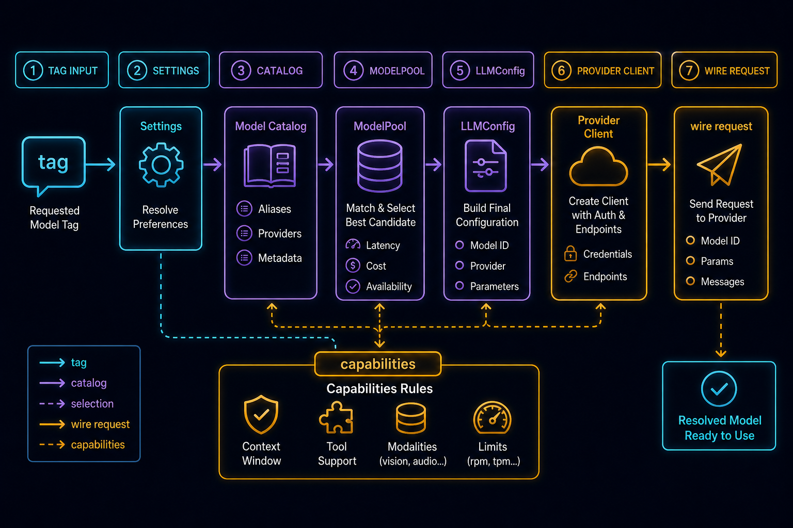
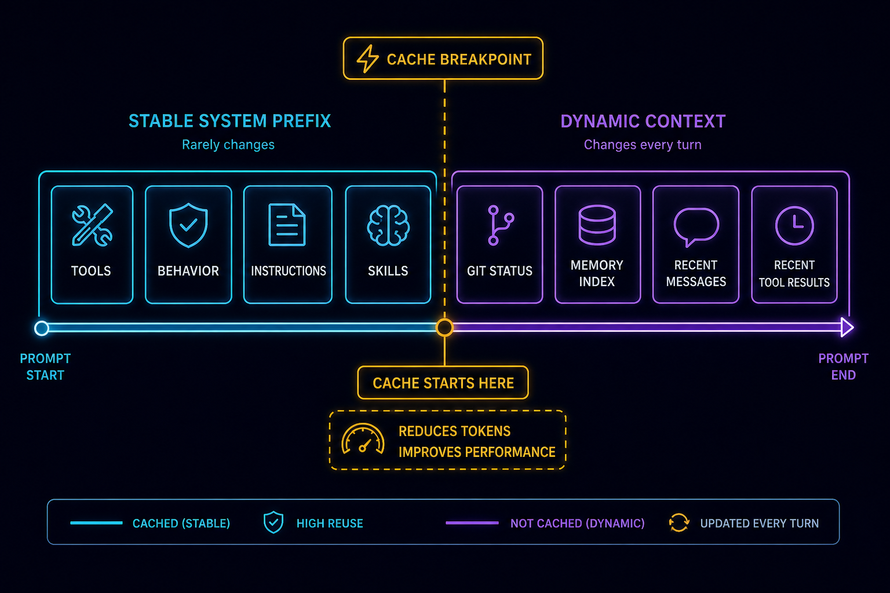
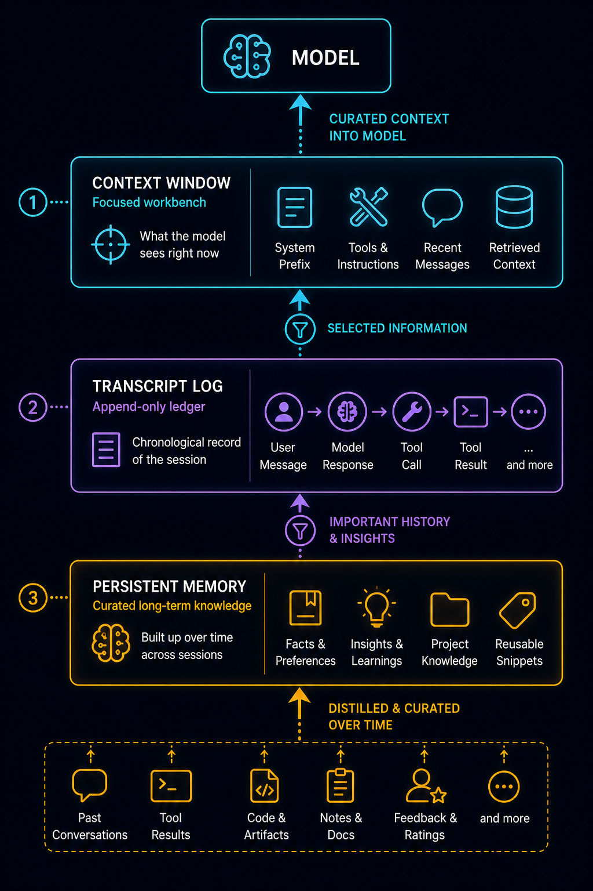
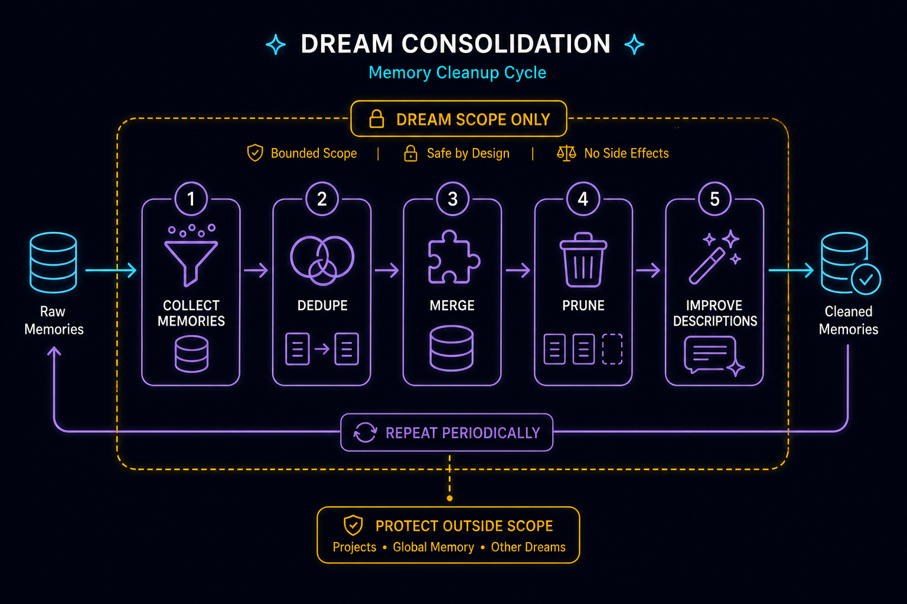

# 模型、上下文与记忆深潜：Agent 的脑容量不是 prompt 长度

> 本文是 CodeShell Core v2 深度系列第 4 篇。第 02 篇《Engine 与 TurnLoop 深潜》讲清了「一次任务如何变成多轮模型-工具-上下文闭环」；本篇接着它的 context loop 往两头延伸：往下，模型调用如何抹平 provider 差异；往上，会话事实日志与跨会话记忆如何让一个 agent 在多轮、多会话之间保持连续。读完本篇，你应该能回答一个问题——**为什么 agent 的「脑容量」不是上下文窗口的字数，而是一套分层的上下文治理系统**。

如果你只看过本系列任意一篇，这里先重申基调：CodeShell Core 是**通用 Agent 编排内核**，不是写死的 coding agent。本篇讲的模型适配、prompt 组装、context 治理、session、memory/Dream，全是通用机制；coding 行为来自 `terminal-coding` preset 的叠加配置（见第 01 篇关于 preset 的总览，以及 v1 拆分版第 06 篇的 prompt/hooks/skills 细节）。

---

## 0. 开篇：一个被反复误解的问题

很多人理解 agent 的「记忆」时，会把它等同于上下文窗口：模型上下文越长，agent 记得越多；上下文不够，就换更长窗口的模型。

这个理解只对了一小部分。一个能跑很久、跨很多会话、还能换不同模型的 agent，真正依赖的是四件互相独立、职责不同的东西：

1. **模型适配层**：把「一个 tag」解析成一个配置好的 provider 客户端，并把各家模型的怪癖抹平成一张数据表。
2. **Context Window**：模型当前这一次调用真正能看到什么——这是工作台，不是数据库。
3. **Session Transcript / State**：这次会话真实发生过什么——这是账本，是可恢复的事实源。
4. **Persistent Memory / Dream**：跨会话沉淀下来的长期知识——这是受治理的知识库，不是聊天记录。

把这四层混在一起，agent 很快出问题：prompt 越来越大、工具结果撑爆上下文、热切换模型时输出上限串台、历史细节丢失、长期记忆污染未来任务。所以本篇不是「LLM 层 + 记忆层」的拼接，而是围绕一个问题组织：**系统如何在模型差异、上下文预算、会话事实日志、长期知识之间建立清晰的边界**。

源码主战场：`packages/core/src/llm/`、`model-catalog/`、`engine/resolve-llm-config.ts`、`prompt/`、`context/`、`session/`、`services/dream-consolidation.ts`。

---

## 1. 模型连接解析：tag 怎么变成一个能发请求的客户端



一次对话需要一个 `LLMConfig`——一个「身份」对象：provider 是谁、model 是哪个、apiKey、baseUrl、maxTokens。这个对象不是凭空来的，它由三份配置合成：

```
settings.modelConnections[]  +  settings.credentials[]  +  合并后的 catalog
        │  modelEntriesFromConnections()
        ▼
ModelEntry[]  ──注册──▶  ModelPool
        │  pool.toLLMConfig(entry)
        ▼
LLMConfig  ──createLLMClient()──▶  AnthropicClient | OpenAIClient
        │  client.createMessage({ system, messages, tools, reasoning })
        ▼
capabilitiesFor(providerKind, model)  塑形 wire 请求
```

### 1.1 单一入口与「显式选了却悄悄换模型」的故障

非引擎调用方（agent-server bootstrap、automation、Dream、TUI 命令）都走同一个入口：`resolveLLMConfigForTag(settings, "text", preferredId?)`（`engine/resolve-llm-config.ts`）。它的选择优先级很明确：

```
preferredId(命中才用) → defaults[tag] → 第一个可用连接
```

这里藏着一个真实的故障模式，源码注释专门标了出来：用户在 UI 上**显式选了**某个默认/偏好连接，但这个连接引用的 `catalogId` 后来被删了——`modelEntriesFromConnections` 会**静默过滤掉**这条 entry，于是 `find` 落空、悄悄回退到 `entries[0]`。这是「换了个模型还不告诉你」。处理方式不是改回退行为（有可用连接当然要用），而是当 `pick.key !== wanted` 时 `console.warn`，让静默替换至少可见。

还有一个边界：如果选中的连接需要密钥（`pick.needsKey !== false`）但凭证没解析到（`credentialId` 缺失或指向已删凭证），这里直接返回 `null`，把控制流交回调用方那条干净的「没有可用的文本模型连接……请在『连接』页添加并填写凭证」错误。如果不在这里 fail，就会构造一个 `apiKey: undefined` 的 config，晚一步在 provider 那里炸成一个含糊的 401。**返回 `null` 而不是抛错**是个刻意设计——`null` 的语义是「该 tag 下没有任何可用连接」，让调用方给出清晰提示而不是栈回溯。

> 注意：这个 resolver 只处理 `text` tag。image/video 有各自独立的 resolver（`resolveImageProvider` 等），文本、图片、视频模型的解析是相互独立的。

### 1.2 catalog 是单一事实源

`getMergedCatalog()` 把用户 catalog（`~/.code-shell/model-catalog.user.json`）叠在 `BUILTIN_CATALOG` 上，id 冲突时用户胜。legacy 的 `model.*/models[]/providers[]/activeKey` 存储已经全删，catalog 是**唯一**事实源——这点对后面理解「加一个模型成本有多低」很关键。

### 1.3 身份与旋钮被刻意分开

这是模型层最值得记住的一条边界：

- **模型身份（`LLMConfig`）**：provider / model / apiKey / baseUrl / maxTokens。
- **运行旋钮（`ClientDefaults`，见 `llm/client-base.ts`）**：temperature / timeout / retryMaxAttempts / imageDetail。

热切换模型时整个换掉 `LLMConfig`，**不动** `ClientDefaults`。为什么要分？因为如果不分，一个 1M 上下文模型的输出上限就会「漏」到一个 128K 模型上——换模型时 maxTokens 串台是真实会发生的事故。把身份做成一个可整体替换的对象，输出上限就跟着身份走，不会跨模型泄漏。

---

## 2. Capabilities：把 provider 差异写成数据，不是代码

接多家大模型，真正烦人的从来不是「发个 HTTP 请求」，而是各家的怪癖：

- 字段名不一样：有的用 `max_tokens`，有的用 `max_completion_tokens`，写错一处就 400。
- 有的拒收 `temperature`/`top_p`/惩罚项，有的必须带某个字段。
- reasoning（思考）形态完全不同：OpenAI 是 effort 档位，较新的 Claude 是自动、较旧的 Claude 是显式 budget token，DeepSeek 是顶层 `thinking.type`。

CodeShell 的答案是：**这些差异住在一张数据表里**，不是在客户端里堆 `if`。这张表是 `llm/capabilities/rules.ts`——一个 `(providerKind, modelFamily) → Capability` 的规则数组，每个 kind 第一条匹配胜。一个 `Capability` 声明 `tokenLimitField`、`rejectedParams`、`reasoning` 形态、`echoReasoning`、`parallelToolCalls`、`streamUsage`、`maxOutputTokens` 等。

几条实际生效的规则（这些是**当前源码里**的事实，不是永久真理——见 §2.2）：

- **某些 OpenAI 推理模型族**：`tokenLimitField: "max_completion_tokens"`，`rejectedParams` 包含经典采样参数，reasoning 走 `openai-effort` 档位；其中较新的一族还带 `noEffortWithTools: true`——带工具的请求**预先不发** `reasoning_effort`，否则会返回 400。
- **较新的 Claude 家族**：`reasoning: { kind: "anthropic-adaptive" }`（思考自动，无 budget 参数）；**较旧的 Claude 4.x（≤4.5）**：`anthropic-budget`（显式 `budget_tokens`，夹在 `< max_tokens`）。
- **DeepSeek V4 思考模式 / Z.AI GLM**：`deepseek-thinking`（顶层 `thinking.type`）；而 `deepseek-reasoner` 又不同——它拒绝在输入里回灌之前的 `reasoning_content`（回灌就 400），且 reasoning 始终开、没有开关。

**客户端里没有任何 per-model 的 `switch`**。`llm/providers/openai.ts` 和 `anthropic.ts` 读 `Capability` 来塑形请求体。`reasoningControlFor(kind, model)`（`llm/capabilities/reasoning-control.ts`）把同一个 `reasoning` 形态投射成 UI 控件描述符（开关 / effort 枚举 / budget 数字 / 自动），让连接页的控件和 wire 请求从一个源保持同步。

> 这里有个被记进经验的坑：`rejectedParams` 必须是**新建的 `Set`**，不能直接引用某个 `DEFAULT` 常量——`capabilitiesFor` 浅 spread 后某次客户端如果 mutate 这个 Set，就会污染默认值，导致别的模型莫名其妙也开始拒收参数。

### 2.1 ParamSpec：一处声明，两处生效

`model-catalog/types.ts` 里的 `ParamSpec` 是这一层的拱心石——**一条声明同时驱动 UI 控件和 wire 映射**：

```ts
{ name: "reasoning", control: "enum", options: ["low", "medium", "high"],
  doc: "Reasoning effort…", wire: { field: "reasoning_effort" } }
```

围绕它有三个函数：

- `applyParams(values, params)` 按 `wire.field` 把值映射进**嵌套**请求体（`"thinking.budget_tokens"` → `{ thinking: { budget_tokens: N } }`），并把 catalog 声明的 temperature/top_p/max_tokens/thinking 喂进 `extraBody`（实测真下发到 wire）。
- `buildParamsDoc(params)` 把同样的声明渲染进**工具/连接描述**，让模型和用户都知道有哪些旋钮。
- `reasoningFromParamValues` 把存的参数值翻译成 `ReasoningSetting`（字符串→effort，数字→budget，布尔→开关）。

`capabilities/param-specs.ts` 还会把 `rules.ts`（唯一事实源）里的 reasoning 能力**投射**成 catalog 的 `ParamSpec[]`，于是「差异即数据」和「一处声明两处生效」是同一张表的两面：加一个带新旋钮的模型，多半只改 catalog 数据，UI 控件和请求体自动跟上。

### 2.2 为什么不要把模型版本/能力写成永久真理

这是本篇必须强调的准确性边界。上面那些规则（哪个版本用什么字段、哪个版本是 adaptive、哪个 effort 档存在）都是**当前源码快照**里的事实，不是物理常量。外部模型能力会漂移：厂商发新版本、改字段名、加/删 effort 档、调输出上限。

`rules.ts` 这套设计的全部意义，恰恰是承认「能力会变」：差异是**数据**，所以漂移时改的是数据表的一行，不是去客户端追 `if`。如果你在写文档或代码注释时把「某模型用 X 字段、支持 Y effort」当成不可变真理写死，那等下一次厂商改口径，这份「真理」就成了误导。正确的心智是：**去 `rules.ts` 看那一条当前规则**，而不是背诵某个版本号的能力。`provider-kinds.ts` 同理——它是已知家族的元数据表，会随生态更新。

> 一条具体边界：这里的 Gemini 支持是 **AI-Studio（`AIza…`）口径**，走 OpenAI-compat 端点；**不支持 Vertex OAuth token**。用户填了 `AQ.` 开头的 Vertex token 会 400。这同样是当前实现的事实，不是「Gemini 永远只能这样」。

### 2.3 流式、重试、用量：模型层的可靠性细节

- **重试 + 截止**（`client-base.ts`）：`withRetry` 把调用方的 `AbortSignal` 和一个每请求硬截止（约 2× SDK 超时，最少 120s）组合起来，拆掉半死的 socket。重试 5xx + 限流，**不重试**确定性的 4xx——这避免了对一个注定失败的坏请求反复等待。（曾有 bug：4xx-retry 守卫被 `LLMError` 的 status burial 打穿，导致坏请求也重试；已修。）
- **流空闲看门狗**（`stream-watchdog.ts`）：默认开启；空闲超过 `idleTimeoutMs`（默认 90s）就中止并重试。设置 `CODESHELL_ENABLE_STREAM_WATCHDOG=0` 可关闭。`onChunk` 在中止检查**之后**调用，所以 Stop 之后缓冲的 chunk 不会漏到 UI。
- **用量与成本**：`LLMClientBase.onUsage` 是每次响应触发的静态 hook，宿主装它来喂 `CostTracker`。`TokenUsage` 带 `cacheReadTokens`/`cacheCreationTokens`。
- **构造时不给 `maxTokens` 兜底**：留 undefined 让各 provider 用自己的默认，而不是在某个硬编码值上悄悄截断（曾有 max_tokens bleed 未 clamp 的 bug；已修）。

---

## 3. Prompt 组装：围绕一个缓存断点

模型适配解决「请求怎么发对」。Prompt 组装解决「这一轮模型能看到什么」。`PromptComposer`（`prompt/composer.ts`）把系统提示分成两部分，分界线是一个**缓存断点**。



### 3.1 缓存前缀：稳定、可计费一次

`buildSystemPrompt(tools)` 拼出缓存前缀，顺序是：

```
runtime_header(模型/cwd/平台/shell)
  → custom_system
  → tool_definitions(工具名 + 一行描述；完整 schema 走 native tools 字段)
  → behavior(preset 各段，带工具门控过滤)
  → append_system
  → personalization(语言 + 用户画像)
```

`SectionCache`（`prompt/section-cache.ts`）给每段做记忆化。其中 `behavior` 段设了 `cacheBreak: true`——因为 section cache 是**按段名 key** 的，而 behavior 段的内容会随激活工具集变化（preset 的工具门控段，见第 06 篇）；不打 cacheBreak，一个被复用的 composer 可能拿到陈旧缓存。

### 3.2 动态上下文：放在断点之后

`buildDynamicContextMessage()` 产出一条 user 角色的 `<system-reminder>` 消息，**放在消息数组末尾**，内容是：

- **skills 列表**（`buildSkillListing`，按命名空间分组）。
- **git 状态**（如果 preset 开了 `injectGitStatus`）。
- **记忆索引**（`buildInjectionIndex`，下文 §6）。

为什么这三样要放在断点之后、不进缓存前缀？因为它们在**会话内会变**：装一个 skill、改一个文件、提取一条记忆，这些内容都会变。如果把它们放进缓存前缀，每次变动都会让前缀的缓存失效、整段重新计费。放在断点之后，前缀的缓存命中不受影响，只有这条尾部消息重新计费。

这就是「**skills listing / git status / memory index 为什么放动态上下文**」的答案——不是因为它们不重要，恰恰是因为它们会变，把易变的东西隔离在缓存边界之外，是 prompt 经济性的核心设计。

> 经验提醒：当前实现里 prompt 缓存有两个已知缺口（只在 `systemPrompt` 挂一个 cache 断点，tools/历史/memory 没单独的缓存利用；以及某些 provider 的 `cached_tokens` 读错字段导致命中率不可见）。这些被记为「已知未修」，不要把当前命中率写成最优状态。

### 3.3 指令扫描：CLAUDE.md / AGENTS.md 层级

`scanInstructions`（`prompt/instruction-scanner.ts`）从 cwd 往上走到 git 根，收集四层指令文件：

```
managed  — shipped 默认(~/.code-shell/CODESHELL.md)
user     — 用户级
project  — 项目级(从 git 根向 cwd 走，带 depth)
local    — *.local.md 覆盖
```

兼容 `CLAUDE.md`/`AGENTS.md`（及 `.codeshell/rules/*.md`），去重（先者胜），按 managed → user → project-root → cwd → local 排序，合成一条**可缓存的** user 上下文消息（`buildUserContextMessage`）。注意它和动态上下文的区别：指令文件在一次会话里基本不变，所以它走可缓存路径；skills/git/memory 走断点之后的动态路径。

---

## 4. Session Transcript：账本不是聊天记录

Context Window 是工作台；**Transcript 是账本**。这是本篇第二条关键边界。

`session/transcript.ts` 开头第一行注释就点明了：「Transcript — JSONL event log (NOT chat history)。」它记录的是**事件流**：`appendMessage` / `appendToolUse` / `appendToolResult` / `appendSubagent` / `appendTurnBoundary` / `appendTurnStopped`。然后 `toMessages()` 从这些事件**派生**出喂给 LLM 的 `Message[]`。

这个分离至关重要：

> 存储格式 ≠ 模型输入格式。

日志应该忠实记录发生过什么（可追溯、可审计、可恢复）；模型输入应该按当前窗口预算筛选和整理。`toMessages()` 就是这条边界——**transcript 不是把聊天历史原文堆给模型**，它是一个可以被 context 治理重新塑形的事实源。

为什么需要账本？因为 agent 会遇到恢复场景：进程重启、UI 刷新、worker 崩溃、用户 resume、长任务中途取消。有了 transcript，系统能重新构造会话状态。

但这里要避免一个绝对化的说法：**不是所有东西都是 restart-durable 的**。明确持久化的是 transcript、session state（sessionId / cwd / model / status / turnCount / usage / compacted messages）、RunManager 状态、cron job 定义、持久 goal。**不能泛化成可恢复的**是：在飞的 model stream、外部 child process、后台 shell、部分同步/异步子 agent 状态。账本让你能 resume 到一个一致的事实点，但它不保证「一切在飞的副作用都能续上」。

恢复时还有两个细节值得提：

- **goal / todo 要单独回灌**：持久 goal 只存在 state.json、todo 只活在 `TodoWrite` 的 args 快照里，它们不在 transcript 的正常事件流里，所以从磁盘恢复会话时要单独回灌（否则查 state 找不到 ≠ 没 goal）。
- **孤儿 tool pair 修补**：恢复时如果 transcript 里有 `tool_use` 但缺对应 `tool_result`（被中途取消），需要修补，否则 provider 会拒绝这种不配对的消息（见第 02 篇 `patchOrphanedToolUses`）。这条不变量在 context compaction 里同样要守，见下一节。

---

## 5. Context 治理：分层 compaction 如何保护 tool_use/tool_result 配对

Context Window 是有限、昂贵、易分散注意力的资源。所以好的 harness 不问「怎么把所有东西塞进 prompt」，而问「**这一轮模型真正需要看到什么**」。这是 `ContextManager`（`context/manager.ts`）的职责。



Agent 和普通 chat 最大的区别是：**工具结果会不断进入上下文**。一个 `Read` 几百行、一个 `Grep` 几十个匹配、一个 `Bash` 几千行日志、一个网页抓取几十 KB。如果每个结果都原样 append，agent 的最大轮数不再由任务决定，而是由上下文爆炸决定。

CodeShell 的 compaction 不是「超过长度删最旧」，而是**分层**（从无损到有损）：

```
Tier 0a  大 tool_result 落盘 + 替换成 preview(tool-result-storage.ts)
Tier 0b  硬截断幸存的超大 tool_result
Tier 0c  每条 user 消息的 tool_result 聚合预算(字符级)
Tier 0d  去重同一文件的重复 Read，只留最新
Tier 0d' 浏览器观察遮蔽，只留最新观察
Tier 1   microcompact:指纹化老的白名单 tool_result(同步、零成本)
Tier 2   LLM summary:把一段历史总结成更短的状态(异步、有成本)
Tier 3   window compact:接近窗口上限时的激进重组(同步、应急兜底)
```

`manage()` 跑同步层（Tier 0–1、3），`manageAsync()` 额外跑 Tier 2 的 LLM 总结（`summarizeFn` 由 Engine 注入）。关键阈值：`summarizeAtRatio` 默认 0.92（接近 92% 才总结），`microcompactFloorRatio` 默认 0.7（低于 70% 压力时 microcompact 不动手，让 tool_result 保持完整——压力不大的上下文不需要清）。

### 5.1 为什么 compaction 必须保护 tool 配对

这是 context 治理里最容易出隐蔽 bug 的地方。Anthropic / OpenAI 的 API 都要求 `tool_result` 必须有对应的 `tool_use`，否则整条消息被拒。compaction 是在删/重组消息，一不小心就会**把一对 tool_use/tool_result 拆散**——保留了引用 `tool_use_id` 的 `tool_result`，却把那条带 `tool_use` 的 assistant 消息切掉了。

`context/compaction.ts` 用 `adjustIndexToPreserveAPIInvariants` 守这条不变量：当要从某个 index 开始保留消息时，它会**向后扩张 slice 起点**，先收集 kept 范围里所有 `tool_result` 引用的 `tool_use_id`，再向前搜索包含这些 `tool_use` 的 assistant 消息，确保配对完整才落定边界。`tool-result-storage.ts` 落盘时也按 `tool_use_id`（UUID）一一对应，同一个 id 永远映射到同一个文件。

> 这条不变量有个隐藏依赖（记进经验的坑）：当前的配对扩张是**单遍**的，依赖 turn-loop「tool_result 紧邻 tool_use」这条排布不变量。如果将来把 turn-loop 改成延迟/乱序 tool result，这个单遍逻辑就要改成 re-scan，否则会漏配对。

### 5.2 compaction 的故障模式

- **上下文爆炸**：没有工具结果预算时，长任务在几十轮内就被撑爆，而不是因为任务做完。
- **截断续写丢语义**：最粗糙的「删最旧」能避免 API 报错，但 compaction 后模型不知道自己做过什么，就会重复探索、误改文件或丢目标。Tier 2 的 LLM summary 就是为保留任务目标、关键决策、未解决问题而存在。
- **大工具结果**：单个超大结果要落盘 + 留引用（Tier 0a/0b），否则一个结果就能挤爆窗口。

---

## 6. Memory 与 Dream：长期知识是受治理的，不是随手写的



跨会话记忆最容易被滥用——很多系统把「记住用户偏好」和「记住所有历史」混在一起。CodeShell 的立场很明确：**Persistent Memory 不是 transcript 的替代品**。适合进长期记忆的是：用户长期偏好、项目非显而易见事实、已确认设计决策、反复出现的工作流约束、重要外部资源索引。不适合的是：一次性中间日志、临时任务细节、未确认猜测、敏感密钥、大段工具输出。长期记忆必须克制，否则它会污染未来任务。

### 6.1 scope 是生命周期与权限的边界

`session/memory.ts` 把记忆按 scope 隔离在磁盘上（`~/.code-shell/<scope>/`，每个 scope 一个 `MEMORY.md` 索引）：

- **`user`**：用户显式要求记住的，加上 legacy 自动提取的条目。LLM **只能通过权限门控的工具调用**修改它。
- **`dream`**：Dream 流水线的工作区。LLM 在这里可以自由增/合/删；`user` scope 对 Dream 是**只读**的。
- **`pending`**：待审批门（用户拍板）。自动提取里被判为「提全局」的条目落在这里（只存在于全局根），**且不注入**。用户在设置面板里 approve（→ 移到 `user`）或 reject（→ trash）。

一个 `MemoryEntry` 带 frontmatter：`name`/`description`/`type`(user/feedback/project/reference)/`pinned?`/`origin?`/`usageCount`/`lastUsed`/`created`/`originProject?`。`MemoryManager` 提供：

- **软删**到 `memory-trash/<ISO>/<scope>/`——文件是移动不是删除，误删可恢复。
- **pinned 条目**免老化过滤（`filterByAge` 里 `e.pinned` 直接放行），注入时排最前。
- **召回 TTL**：`usageCount` 每次 `MemoryRead` 命中自增、`lastUsed` 记最后命中、`created` 首存设定并跨 UPDATE 保留。一个 `project` 类型的记忆久不读会被 `pruneByRecall` 修掉。legacy 缺字段的文件读回成 `{usageCount: 0, lastUsed/created ← mtime}`，**永不因为读不到时间戳就被隐藏**。
- **`origin`**：`"auto"` = 会话结束的提取器写的；`"manual"`（或缺省）= 用户/UI 写的。让 UI 区分策展记忆和提取器噪声。
- **`buildInjectionIndex`** 把全局 + 项目 scope 合并成每轮注入的紧凑索引（完整正文按需经 `MemoryRead` 取）——这就是 §3.2 动态上下文里那个「记忆索引」。

### 6.2 自动提取走 pending 审批，不直接落全局

会话结束时，`memory-orchestrator.ts` 跑两件事：从会话里**提取**记忆（受 `MAX_MEMORIES_PER_EXTRACTION` 上限约束，少量、克制），以及总结会话。关键设计：被判为「提全局」的候选**不直接落 `user` scope**，而是落 `pending`（全局根），盖上 `originProject` 戳，等用户审批。审批通过才升到全局 user store；不批准/降级则回灌到 **它来源项目** 的 user store（不是当前项目）。

这条设计直接对应一个故障模式：**auto-extraction 过度写入**。如果自动提取的东西无门直接进全局记忆，几个会话后全局层就堆满了「某次任务的临时事实」，每轮注入都在污染新任务。pending 审批门让「没有任何东西自动落全局」成为不变量——全局层始终是策展的。

### 6.3 Dream 为什么是离线清理，而不是每轮乱写

`runDreamConsolidation`（`services/dream-consolidation.ts`）是一个**离线、headless 的 LLM 工具调用循环**（`MAX_TURNS = 8`），专门清理 `dream` scope：去重、合并、删陈旧、改进描述、把 `*-v1/*-v2/*-v3` 这种版本变体只留最新。

它被**结构性沙箱化**，这是设计的重点：

- 只允许 4 个记忆工具（缺工具时直接 warn 并退出）。
- 写**只限 `dream` scope**——在 dispatch 之前就硬拒任何对 `user` scope 的 Save/Delete（因为 Dream 跑在没有交互权限后端的环境里，没有 UI 能批准 user-scope 写）。Dream 能**看**两个 scope（user 作为只读上下文，好让它发现跨 scope 的重复），但只能**写** dream。
- 写预算上限（`MAX_WRITES`），`writeBudget` 用完后续写一律拒绝。
- reasoning 关、`maxTokens: 2048`。
- 触发节奏：每约 5 会话（`minSessionsBetween: 5`）/ 24h（`minTimeBetween`）自动触发，或手动跑。

为什么 Dream 是离线清理而不是「每轮随手改记忆」？因为「每轮写记忆」正是污染的来源——agent 在任务中途的判断常常是错的、临时的、未确认的，把这些实时写进长期层会毒化未来。Dream 把「整理」从「干活」里分离出来：干活的时候只提取候选（进 pending）、只读注入；整理的时候用一个**受限**的循环离线做，且**永远不碰 user scope**。这就是「Dream 越权写 user scope 的风险」被结构性堵死的方式——不是靠提示词约束，是靠 dispatch 前的硬拒。

> 更大的记忆生命周期重设计（状态机 / 完成态语义 / 确认流 / 索引截断）被刻意标为未来项目，不零敲碎打。CodeShell 的 Dream 在思路上更接近 Codex 的 consolidation（有 age 过期、合并、redact），而非 CC 那种「会话内随手写、无过期靠人清」的 auto-memory。

---

## 7. 故障模式与 footgun 汇总

把全篇散落的故障模式集中一下，这些都是真实会咬人的：

1. **模型参数下发错误**：字段名/拒收参数写错就 400。靠 `rules.ts` 数据表治，不靠客户端 `if`。`rejectedParams` 必须新建 `Set` 别引用 DEFAULT，否则 mutate 污染全局。
2. **外部模型能力漂移**：厂商改版本/字段/effort 档。不要把任何模型版本能力写成永久真理，去 `rules.ts` 看当前那一条。
3. **热切换串台**：身份（`LLMConfig`）与旋钮（`ClientDefaults`）不分，1M 模型的输出上限漏到 128K 模型。靠整体替换身份对象避免。
4. **显式选了却悄悄换模型**：偏好/默认连接的 catalogId 被删 → 静默回退 entries[0]。靠 `console.warn` 让它可见。
5. **4xx 重试浪费**：曾因 status burial 把确定性 4xx 也重试；现在不重试 4xx。
6. **maxTokens 默认截断**：构造时不给 maxTokens 兜底，避免在硬编码值上悄悄截断；曾有 max_tokens bleed 未 clamp。
7. **prompt cache 失效**：易变内容（skills/git/memory）若混进缓存前缀，每次变动都让整段前缀重新计费。靠缓存断点把它们隔到尾部。当前还有两个已知缓存缺口未修。
8. **动态上下文过胖**：memory index、skills listing 注入太多会挤占预算又分散注意力。靠紧凑索引 + 按需 `MemoryRead` 取正文。
9. **上下文爆炸 / 大工具结果**：不分层 compaction，长任务被工具结果撑爆。靠 Tier 0–3 分层（落盘、截断、去重、microcompact、summary、window compact）。
10. **拆散 tool_use/tool_result 配对**：compaction 切边界时漏配对，provider 拒收。靠 `adjustIndexToPreserveAPIInvariants` 向后扩张 slice。当前是单遍逻辑，依赖 turn-loop 紧邻不变量。
11. **记忆污染未来任务**：临时/未确认事实进长期层。靠 scope 边界 + pending 审批门 + 召回 TTL。
12. **auto-extraction 过度写入**：自动提取无门进全局。靠 pending 门——没有东西自动落全局。
13. **Dream 越权写 user scope**：靠 dispatch 前硬拒 user-scope 写 + 写预算上限，结构性堵死。
14. **cookie / credential 明文**：凭证当前是 0o600 owner-only 明文文件，**`safeStorage` 加密（R-2）暂缓**——卡点是读 secret 的代码在 core worker，而 safeStorage 钥匙在桌面 main 进程，core 拿不到；正解是 core 只认一个 `EncryptionCipher` 接口由 host 喂钥匙。**不要写成「已加密」。**

---

## 8. 源码阅读路线

按「模型 → prompt → 账本 → 上下文 → 记忆」的顺序读：

1. `engine/resolve-llm-config.ts`：tag → `LLMConfig` 的单一入口，含 null 语义与静默回退 warn。
2. `llm/model-pool.ts` + `engine/model-connections-pool.ts`：`ModelEntry` → `LLMConfig`。
3. `llm/capabilities/rules.ts`：差异表（最值得读的一份），看「差异即数据」。
4. `model-catalog/types.ts` + `llm/capabilities/param-specs.ts`：`ParamSpec`「一处声明两处生效」。
5. `llm/client-base.ts` + `providers/{openai,anthropic}.ts`：身份/旋钮分离、重试截止、客户端读 `Capability` 塑形请求。
6. `prompt/composer.ts`：缓存前缀 vs 动态上下文的分界（`buildSystemPrompt` / `buildDynamicContextMessage` / `buildUserContextMessage`）。
7. `prompt/instruction-scanner.ts`：CLAUDE.md/AGENTS.md 层级扫描。
8. `session/transcript.ts`：`toMessages()` 是模型输入边界，账本 ≠ 聊天记录。
9. `context/manager.ts` + `compaction.ts` + `tool-result-storage.ts`：分层 compaction 与 tool 配对不变量。
10. `session/memory.ts`：scope、pinned、召回 TTL、pending 审批。
11. `services/memory-orchestrator.ts`：会话结束提取 + pending 路由。
12. `services/dream-consolidation.ts` + `services/auto-dream.ts`：受限离线清理回路与触发节奏。

旁注结构参考（不替代源码）：`assets/llm-model-layer.svg`、`assets/prompt-presets-hooks-skills.svg`、`assets/context-compaction.svg`、`assets/plugins-capabilities-memory.svg`。

---

## 9. 常见误解与边界

- ❌「客户端里有 per-model 的 switch。」→ ✅ 没有，差异全在 `rules.ts` 数据表里。
- ❌「某模型用 X 字段、支持 Y effort 是固定事实。」→ ✅ 那是当前快照；能力会漂移，去 `rules.ts` 看当前规则。
- ❌「Gemini 用 Vertex token 也行。」→ ✅ 当前只支持 AI-Studio 的 `AIza…` key。
- ❌「memory 是 transcript 的替代品。」→ ✅ 两层职责不同：账本是事实流，记忆是受治理的长期知识。
- ❌「transcript 就是聊天历史原文堆给模型。」→ ✅ `toMessages()` 是边界，存储格式 ≠ 模型输入格式。
- ❌「context compaction 就是超长删最旧。」→ ✅ 是分层无损到有损，且必须保护 tool_use/tool_result 配对。
- ❌「cookie/记忆 secret 已加密。」→ ✅ R-2 暂缓，现状 0o600 明文。
- ❌「Dream 会乱改 user 记忆。」→ ✅ 它只写 dream scope，dispatch 前硬拒 user-scope 写，且有写预算上限。
- ❌「core 是个 coding agent。」→ ✅ core 是通用编排内核；coding 是 `terminal-coding` preset 叠加出来的行为。

---

## 10. 结语

回到开篇那个问题：agent 的「脑容量」不是 prompt 长度。真正决定一个 agent 能不能跨多轮、多会话、多模型持续工作的，是它在四层之间建立的边界：

- **模型适配层**决定「请求怎么发对」——差异是数据，不是代码，所以能力漂移时改一行而不是追 `if`。
- **Context Window**决定「这一轮能想什么」——它是工作台，靠分层 compaction 控制预算、保护 API 配对不变量。
- **Transcript / State**决定「过去发生过什么、能不能恢复」——它是账本，`toMessages()` 把账本塑形成模型输入。
- **Memory / Dream**决定「跨任务能沉淀什么」——它是受治理的长期知识，靠 scope、pending 审批门、离线 Dream 防污染。

这四层都跟「记住」有关，但职责、生命周期、权限边界完全不同。把它们分开、再让它们配合，才是「长期上下文」的真实形状。

下一篇（第 05 篇）收束整个系列：同一个 core 语义如何被 TUI、桌面、手机、SDK 与自动化这些不同宿主消费，以及 RunManager / cron / 持久 goal 如何支撑长任务编排与平台扩展。
