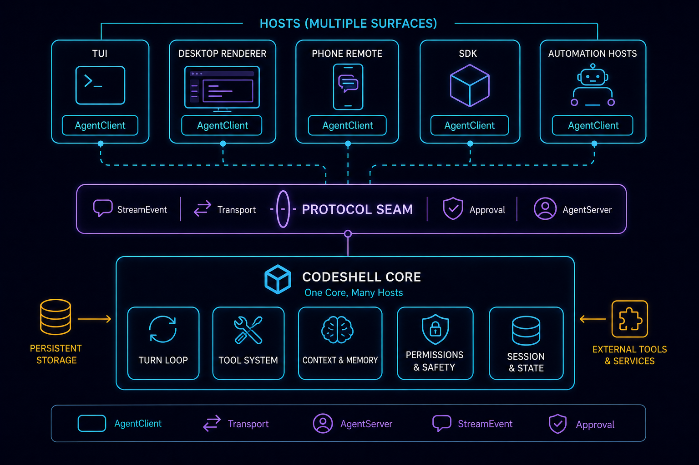
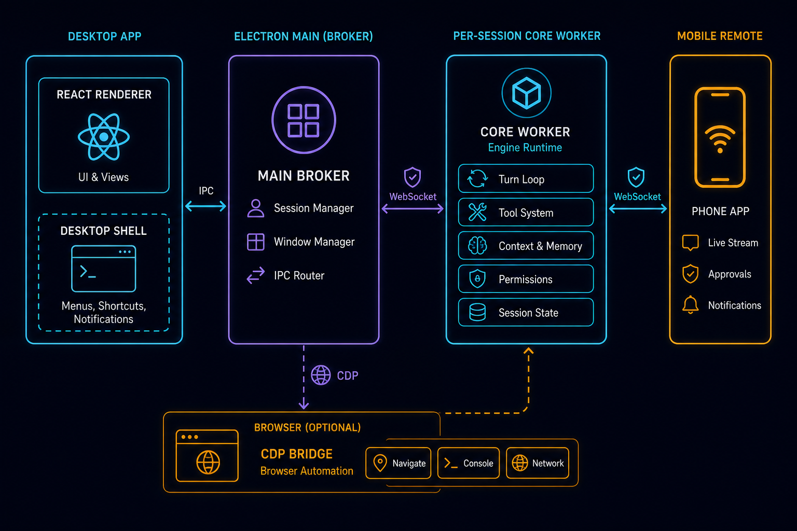
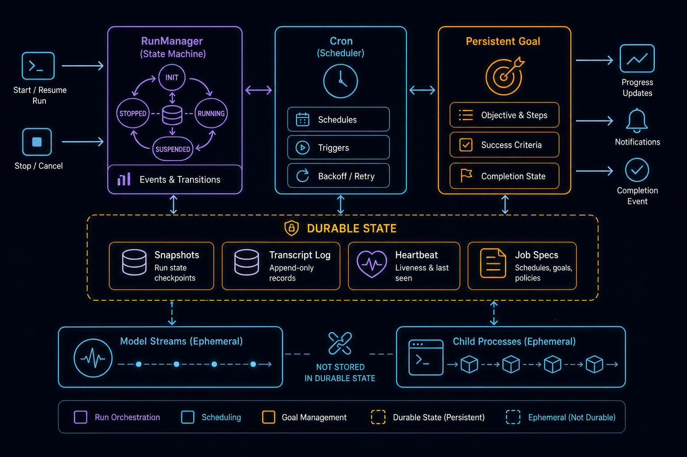

# 协议、宿主与长任务编排:同一个 Core 如何服务 TUI、桌面、手机、SDK 与自动化

> 这是 CodeShell Core v2 深潜系列的第 5 篇，也是收束篇。前四篇分别讲了 [Core 作为通用 Agent Harness 的总览](v2-01-core-as-agent-harness.md)、[Engine 与 TurnLoop 的多轮闭环](v2-02-engine-turn-loop-deep-dive.md)、[Tool System 的安全边界](v2-03-tool-system-security-deep-dive.md)，以及[模型、上下文与记忆](v2-04-model-context-memory-deep-dive.md)。这一篇要回答最后一个问题：**当这套内核已经能跑、能被约束、能记住事情之后，它怎么被许多形态各异的宿主复用，又怎么撑起无人值守的长任务而不失控。**

如果你只想带走一句话:**CodeShell Core 是一个通用编排内核,它本身不知道自己跑在终端、桌面、手机还是定时器里。宿主通过一层传输无关的 JSON-RPC 接缝消费它——这是推荐的主路径,但不是唯一被允许的物理接入方式。**

源码主战场:`packages/core/src/protocol/`、`packages/core/src/session/`、`packages/core/src/run/`、`packages/core/src/automation/`、`packages/core/src/cc-orchestrator/`,以及宿主侧的 `packages/tui/src/cli/`、`packages/desktop/src/main/`。

---

## 一、问题:一个 Core,五种身份

设想你已经写出了前四篇里那台引擎。它能调模型、跑工具、管上下文、落会话、约束权限。现在用户开始提需求:

- 我要在终端里跟它聊天(TUI)。
- 我要一个桌面 App,能开多个会话、看文件面板、连浏览器(Desktop)。
- 我出门在外,想用手机看一眼进度、点个批准(Mobile)。
- 我要把它嵌进我自己的脚本里跑批处理(SDK / 专用 runner)。
- 我要它每天凌晨自己跑一遍巡检,我睡觉(Automation)。

最朴素的做法是:每个宿主直接 `import { Engine }`,自己装配、自己调 `engine.run()`、自己处理审批、自己渲染流事件。这条路一开始最快,但它会把你拖进一个**N×M 的噩梦**:

- 权限审批逻辑在 TUI、桌面、手机里各写一遍,改一处漏两处。
- 流事件格式在每个宿主里被重新解释,渲染不一致。
- 会话生命周期(创建、恢复、并发限制、空闲回收)在每个宿主里重复实现。
- 一个 bug 修在 TUI 上,桌面照样犯。

所以生产级 harness 必须把两件事切开：

- **Core**:负责*运行* agent——收 run 请求、找 session、驱动 Engine、发流事件、需要时请求审批。
- **Host**:负责*交互*——输入、展示、审批 UI、通知、设备形态。

中间隔一层**协议接缝**。这就是本篇的主线。



---

## 二、Protocol seam:推荐的主路径

CodeShell 的核心解耦机制是一条传输无关的 JSON-RPC 接缝,由四个角色构成:

```
AgentClient  ⇄  Transport  ⇄  AgentServer  ⇄  ChatSession  ⇄  Engine
```

- **`AgentClient`**:宿主侧的把手。UI 调 `client.run(task, sessionId)`,订阅 `client.onStreamEvent(...)`,发 `approve`/`cancel`/`steer`。它**从不直接持有 `Engine`**。
- **`AgentServer`**:接缝的另一端。`handleRequest` 把每个 RPC 方法路由到对应动作,持有 `ChatSessionManager`,管理审批挂起、后台唤醒、配置热重载。
- **`Transport`**:只负责把 JSON-RPC 帧从一端搬到另一端,**不夹带任何 UI 语义**。
- **`ChatSession` / `ChatSessionManager`**:每个会话一个 `ChatSession{engine}`,用 FIFO 队列保证一次只有一个活跃 turn;manager 限制活跃会话数并回收空闲会话。

接线点是 `protocol/factories.ts` 的 `createServer({transport, llm, …})` 和 `createClient({transport})`,这是稳定契约。关闭有顺序讲究:先关 server(发关闭通知)再关 client。

### 一次 run 怎么流动

看 `protocol/server.ts` 里 `handleRequest` 的实际路径:

```
AgentClient.run(task, sessionId)
  → RpcRequest { method: "agent/run", params: { sessionId, task, cwd, permissionMode, goal } }
  → Transport.send
  → AgentServer.handleRequest
      → ChatSessionManager.getOrCreate(sessionId) → ChatSession{engine}
      → ChatSession.enqueueTurn(task, {onStream})   // FIFO,一次一个活跃 turn
          → engine.run(...) 发 StreamEvent
              → Transport.notify("agent/streamEvent", {sessionId, event})
                  → AgentClient 发 "stream" → UI 监听器
```

`protocol/types.ts` 里的 `Methods` 枚举定义了完整的语义契约，不只是 `Run`：还有 `Approve`、`Cancel`、`Configure`、`Query`、`Inject`、`Steer`/`Unsteer`、`CloseSession`、`GoalGet`/`GoalClear`、`BackgroundShells`、`BackgroundWork`。**这些方法名就是 core 和 host 之间的共享词汇表**——host 只需理解这套契约，无需理解 Engine 内部。

### 接缝的真正价值:几件事被收口在一处

- **StreamEvent 是 UI 解耦的关键**。如果 core 只返回最终文本,宿主就无法展示过程。但用户想看到模型正在吐字、工具开始执行、工具结果回来、审批弹出、错误和终止原因。所以 core 发的是一串**语义事件**(`text_delta`、`tool_use_start`、`tool_result`、`turn_complete`、`error`……),TUI 把它渲染成终端消息,桌面折叠成 React 卡片,手机折叠成简化聊天流——**渲染不同,消费的语义相同**。

- **审批走协议,不写死在 core 或 UI**。`AgentServer.requestApprovalFromClient` 把一个带超时的 promise 存进 `pendingApprovals`,客户端的 `Approve` 响应解决它。TUI 的权限提示、桌面的审批卡、手机的批准按钮,全都骑在这同一个接缝上(详见[第 3 篇](v2-03-tool-system-security-deep-dive.md)里 `ApprovalBackend` 与宿主的解耦)。

- **后台完成时唤醒,而不是引擎轮询**。后台子 agent 或 shell 完成时,`agentNotificationBus` 同步触发 → `maybeWakeIdleSession`(守卫:会话存在、空闲、非 headless、未被取消)→ 把结果当合成的 `injected:true` 任务注入 → `enqueueTurn`。同步设计让一批完成塌缩成一次唤醒。**注意措辞:这是"完成时唤醒空闲引擎",不是引擎自旋轮询。**

- **配置热重载落在 turn 边界**。`Configure({reloadSettings:true})` 读新设置、算补丁、对每个活跃会话调 `engine.refreshRuntimeConfig`;在飞的 turn 不动,重载落在 turn 边界。

### 三种 transport,一套协议

接缝之所以可移植,是因为传输被抽象掉了:

- **`InProcessTransport`**(`protocol/transport.ts`):一对相连的 `EventEmitter`,同步投递、共享内存。TUI/headless CLI 把引擎嵌在同进程时用它——模型池和工具注册表是*共享对象*,不序列化。
- **`StdioTransport`**(`protocol/transport.ts`):stdin/stdout 上的 NDJSON,一行一个 JSON 值。桌面主进程把 core 当 worker 子进程 spawn 时用它。
- **`SocketTransport`**(`protocol/tcp-transport.ts`):同样的 NDJSON 框架走 TCP。它的帧逻辑刻意从 listen/accept(`listenTcp`)里拆出来以便单测。v1 无鉴权——仅 localhost / SSH 隧道使用。

换 transport 不动业务:同一套协议跑在 in-process / stdio / tcp 上,宿主挑传输方式即可。

---

## 三、例外:不是所有 `Engine.run` 都经协议(这是本篇最重要的准确性约束)

到这里很容易得出一个过强的结论:"CodeShell 里所有 `Engine.run` 都经过 protocol seam。" **这是错的,必须纠正。**

协议接缝是宿主的**常见主路径**,但 core 同时允许**直接嵌入式装配 Engine**。哪些路径绕开接缝:

- **SDK / 专用 runner**:可以直接 `new Engine({...})` 并调 `engine.run()`,不经 server/client。
- **`asyncAgentRegistry` 里的子 Agent**:同步/异步子 agent 各自起一个带独立工具白名单的 `Engine`(详见[第 2 篇](v2-02-engine-turn-loop-deep-dive.md)的 sub-agent spawner)。它们不是通过 protocol 方法被驱动的。
- **测试**:大量单测直接装配 Engine,绕开协议层。
- **桌面 automation 的活跃路径**:这是最有教学价值的反例,下一节展开。

所以本系列所有相关表述都写成"**host 主路径 / 推荐接缝**",绝不写成"一律经过 protocol"。`docs/architecture/00-overview.md` 里那句 "Everything runs through protocol seam" 是一个理想化概括,**不能照抄为绝对事实**。

### 桌面 automation 的活跃路径就在 main 进程里直接跑 Engine

打开 `packages/desktop/src/main/automation-host.ts`,它的文件头注释把话讲得很清楚:

> Active path: a one-shot HEADLESS Engine per job (`buildDesktopAutomationRunner`).
> Fallback (降级保留, no production consumer): `buildDesktopRunManager` — the earlier RunManager-backed path.

`buildDesktopAutomationRunner` 里,每个 cron job fire 时**直接** `new Engine({ headless: true, ... })`,在 Electron **主进程内**一次性跑完。这跟桌面的交互式聊天形成鲜明对比:交互式聊天由 main spawn worker 子进程跑 Engine(下一大节),而 automation 当前生产路径就在 main 里嵌入式跑。

这是一个**宿主策略选择**,不是 bug:

- 交互式聊天需要长连接、流、审批、worker 崩溃隔离 → 走 worker。
- 自动化任务需要定时、无头、按 job 的 cwd 执行、禁用 cron 工具和后台 shell → 一次性 headless Engine 更轻。

所以,**绝不要写"desktop main 绝不运行 Engine"这种强断言**。准确的说法落在*哪个进程、哪条路径*:桌面交互式聊天的 Engine 在 worker 子进程里;桌面 automation 活跃路径的 Engine 在 main 里。两者都复用同一个 core,接入方式不同。

---

## 四、Sessions:可恢复的边界(以及它的极限)

宿主能"换设备继续看同一个会话"、"清掉本地缓存还不丢数据",靠的是 core 把会话状态全落盘。

### 磁盘模型

每个会话住在 `~/.code-shell/sessions/<sessionId>/`:

```
state.json        SessionState:cwd、model、turnCount、tokenUsage、activeGoal、parentSessionId、origin
transcript.jsonl  追加写的 TranscriptEvent[],一行一个 JSON
file-history/     FileHistory 快照,服务 undo/redo
```

关键行为(`session/session-manager.ts`、`session/transcript.ts`):

- **原子、抗崩溃写**:`state.json` 写到 `.tmp` 再 rename;transcript 每事件后 flush。进程半路死掉也不会留下半截 JSON。
- **安全会话 id**:`assertSafeSessionId` 拒绝路径分隔符、`..`、超长 id,防 `../../etc/passwd` 式逃逸。
- **transcript 是事实源,不是聊天历史原文**:`toMessages()` 是事件变 LLM 消息的边界——`message`/`tool_result`/`summary` 映射过去,而 `turn_boundary`/`session_meta`/`file_history`/`error` 被丢弃。加载时 `repairToolResultPairs` 删掉孤儿结果、补上缺失的——和 turn loop 守的是同一条 `tool_use`/`tool_result` 成对不变量(见[第 2 篇](v2-02-engine-turn-loop-deep-dive.md))。
- **任务和目标要单独回灌**,因为它们不在普通消息事件里:`TodoWrite` 的快照活在它的参数里,持久 goal 活在 `state.json.activeGoal`。从磁盘恢复会话时,必须显式把这两样回灌,否则 resume 出来的会话会"忘了自己有目标"。

### 按轮撤销

`FileHistory` 快照带 `turnSeq`(一次用户发送 = 一轮)和 `undone` 标志。`/undo` 选最近一个**活**轮里每个文件的最早快照撤销,记一条 `RedoRecord`;再 `/undo` 剥前一轮("洋葱式剥皮")。这对齐 Claude Code 的按轮模型,而 Codex 无 undo,不参考。

### 磁盘作权威恢复源

桌面能纯从磁盘重建会话列表,套三道过滤——`parentSessionId`(藏子 agent)、`origin`(用户发起 vs 自动)、`isNoRepoCwd`(去优先级未绑定的)——**所以清掉 renderer 的 localStorage 不丢数据**。这是一个反直觉但重要的不变量:UI 的本地状态只是缓存,磁盘才是权威。

### 进程级单例

`state.ts` 放*进程级*(非每会话)单例:早期日志用的默认 `sessionId`、`originalCwd`/`projectRoot`(懒回退到 `process.cwd()`,非 CLI 宿主可覆盖)、交互/信任标志、每进程成本计数器,以及跨 turn 复用的系统提示段缓存。

---

## 五、TUI 宿主:in-process 协议的薄客户端

TUI 是理解接缝的最好入口,因为它把"嵌入式"和"协议化"两件看似矛盾的事**同时做到了**。

看 `packages/tui/src/cli/commands/repl.ts` 和 `run.ts` 的装配:它们 `import { EngineRuntime, createInProcessTransport }`,然后:

```
EngineRuntime(共享模型池 + 工具注册表)
  → createServer
  → const [serverTransport, clientTransport] = createInProcessTransport()
  → createClient
  → UI 调 client.run / client.onStreamEvent
```

也就是说,**TUI 把引擎嵌在同一个进程里,但中间仍隔着协议接缝**。UI 调 `client.run(task, sessionId)`、订阅 `client.onStreamEvent(...)`,**从不直接调 `Engine`**。这跟桌面用 stdio 跨进程是同一套协议接缝,只是这里 in-process 以求零序列化、共享内存。会话状态由 server 持有,resume 只是重发一个 `sessionId`。

接缝里那个 `Engine.run` 由共享的 `EngineRuntime` 装配——模型池和工具注册表是共享对象。这正是"一份引擎被宿主消费",而非每个宿主自带引擎。

TUI 的子命令(`cli/main.ts` 是 Commander 程序):

- **`run [task]`** —— headless 一次性,流给格式渲染器(`text`/`json`/`jsonl`/`stream-json`)。
- **`repl`**(无 task 时默认)—— 交互式 Ink UI。

TUI 自己的重头不在 core,而在两个 UI 工程化设计:用**外部 store**(`useSyncExternalStore`)而非 React state 装聊天条目,追加一条消息不重渲整棵树;用 **50ms 缓冲**把 LLM 每秒吐的几十到几百 token 合并成约 20 次/秒重渲。再加上一个手写的、行级 diff 的 ~14K 行终端渲染器(刻意不用 stock Ink 的增量渲染器,因为它会闪、会丢更新)。这些细节属于 UI 层,不展开;要点是:**渲染率与 token 率被解耦,无论模型多快吐字,重渲都有上限。**

REPL 内的 cron 通过 `bindCronToEngine` 对每个 fire 的 job 用只读引擎跑——这又是接缝复用的一个例子。

---

## 六、Desktop / Mobile 宿主:三进程与复用链路

桌面是接入复杂度最高的宿主,它的关键架构是**三进程模型**。



```
┌──────────────────────────────────────────────────────────────┐
│ Electron Main(src/main/index.ts)                              │
│  ipcMain 服务层 · spawn worker · 提供 files/term/creds/        │
│  browser-host / memory / automation / updater / mobile-WS      │
└───────────┬───────────────────────────────┬────────────────────┘
   stdio JSON-RPC                       ipcMain send/on
┌───────────▼────────────┐      ┌───────────▼──────────────────┐
│ Worker(agent-server-   │      │ Renderer(React 19 + shadcn    │
│ stdio):Engine、turns、 │      │ + Tailwind v4)—— 不 import     │
│ StreamEvents           │      │ core;只用 window.codeshell.*  │
└────────────────────────┘      └───────────────────────────────┘
```

### Main 是经纪人,交互式聊天的 Engine 在 worker 里

桌面**主进程**主要是 IPC 服务经纪人。交互式聊天 run 时,`main/agent-bridge.ts` 的 `spawnChild(cwd)` 以 `ELECTRON_RUN_AS_NODE=1`(把 Electron 二进制当 Node 跑)启动 `@cjhyy/code-shell-core/bin/agent-server-stdio`,**Engine 在那个 per-session worker 子进程里运行**,经 `StdioTransport` 跟 main 通信。

崩溃硬化(`agent-bridge.ts` 里的 `RESTART_WINDOW_MS = 60_000`):60s 内重启超过 3 次 ⇒ 发 `agent:lifecycle {type: "gave_up"}`;干净退出会重置计数器。会话快照熬过 worker 退出,重挂可重放。

preload 的 `rpc()` 有 30s 超时——**除了 `agent/run` 传 0(无超时)**,长 turn 不被杀(早期一个真实 bug:30s 硬超时误伤长任务,让界面"假死")。worker 死掉会 reject 待处理调用;卡住的 worker 由用户的 Stop 按钮处理。

隔离由构建强制:renderer **不能** import `@cjhyy/code-shell-core`(Vite alias 拦截),main **不能** import React/DOM(esbuild node 平台),preload 仅做无状态传输。renderer 只通过 `window.codeshell.*` 跟外界说话,内部按 `sessionId` 把 `StreamEvent` 路由进每会话桶,驱动一个共享的 `streamReducer`。

> 准确性提醒(重复强调):桌面 main *不在自己这个进程里跑交互式聊天的 Engine*,但它 spawn 的 worker 里跑着;而桌面 automation 的活跃路径(第三节)确实在 main 里嵌入式跑 Engine。**说法永远落在"哪个进程、哪条路径",而非"跑不跑 Engine"。**

> **设计取舍:为什么交互式聊天要付"每会话一个子进程"的代价?**
> 三进程模型不是免费的——spawn 一个 worker 要拉起完整的 Node 运行时,有内存和启动开销,跨进程还得为每条消息付 NDJSON 序列化的成本。桌面甘愿付这笔钱,换的是三样在交互式宿主里特别值钱的东西:**崩溃隔离**(一个会话的 Engine 跑飞、OOM、native 模块炸了,只死那个 worker,不拖垮整个 App 和其他会话)、**并发干净**(每会话一个 worker,FIFO 队列天然按会话隔离)、**主进程轻**(main 只做 IPC broker,不被一个长 turn 的峰值卡住事件循环,直接关系到 UI 不卡)。反过来看 automation:它要的是"按 job 起、跑完即走、彼此无状态",崩溃隔离价值低、而 worker 启动开销在每天定时触发的场景里是纯损耗,所以选了"main 里一次性 headless Engine"——**同一个 core,两条接入路径,因为两类任务的成本曲线根本不同**。这也正是"desktop main 跑不跑 Engine"为什么是个伪命题。

### Mobile remote:复用 worker / WS / approval 链路,而不是另起一套 agent

手机端是同一份 React 代码的另一个 Vite 构建(无侧栏、全聊天区),由主进程经本地 WebSocket 服务、QR 配对(设备 token + 桌面 token)接入。它复用 `streamReducer`、`MessageStream`、composer/工具/审批组件。

普通手机遥控路径:`mobile WebSocket → RemoteHostManager → 处理手机事件 → AgentBridge 注入 JSON-RPC line → worker/core`。也就是说,**手机端的 chat、approval、cancel 复用桌面交互式 agent 的同一条 run / permission path**。这很关键:如果手机端自己实现一套 agent runner,权限、会话、工具、日志都会分叉。

审批跨宿主:审批请求经 `ApprovalBridge` 同时路由到桌面和手机。**手机审批不能另起一条权限链**——它回到的是同一条 permission path,只是换了个点击的地方。

**房间(Rooms)** 是另一个东西:`mobile-remote/room-manager.ts`、`resident-agent.ts`、`codex-room-agent.ts` 提供长命的 stream-json 会话(驱动外部 `claude`/`codex` CLI),持久在 `~/.code-shell/mobile-remote/rooms/`,经 WS 镜像到手机。房间按设备 key,不是房间累积。这里有一个 AskUserQuestion 协议坑(`room-manager.ts` 文件头注释专门讲):外部 CLI 的 AskUserQuestion 走 `can_use_tool`,但答案必须塞进 `updatedInput.answers` 这个**以问题文本为 key 的 record**——自动放行(把未回答的输入当 allow)会让 claude 报 "The user did not answer the questions"。

**公网隧道安全边界**:可选的 Cloudflared 隧道(`mobile-remote/tunnel-manager.ts`)**默认关闭**,由访问口令(`access-passcode.ts`)把守。把一个能驱动 agent、执行工具的服务暴露到公网是高风险动作,所以默认保守、显式开启、口令保护。

> **设计取舍:手机端为什么不"自带一个 agent",而是当桌面的远程终端?**
> 最省事的手机方案是让手机自己装一份 core、自己跑 Engine——但那会立刻复制出"权限、会话、工具、日志四套分叉"的局面:同一个项目在桌面批准过的操作,手机不认;桌面看到的会话历史,手机重新拉一份;一个安全修复改在桌面的 permission path 上,手机那份照样有洞。CodeShell 的选择是把手机做成**桌面那条 run/permission path 的另一个输入面**:手机的发消息、点批准、按取消,经 WebSocket 回到主进程,再注入到同一个 worker 的 JSON-RPC 流里。代价是手机离不开那台开着的桌面(它不是独立客户端,是遥控器),换来的是**一份会话、一套权限、一条日志**——这正是协议接缝"core 负责运行、host 负责交互"在多设备上的自然延伸:手机只是又长出一张"脸",没长出第二颗"心"。

### CDP 浏览层:接入工具系统的真实输入事件

浏览器面板和浏览器工具靠 `packages/cdp/` 的环境无关 CDP 动作层(零运行时依赖、**不用 Playwright**)。`CdpActionsDriver` 是无状态的,只接一个注入的 `CdpSender`。桌面适配器把 `webContents.debugger.sendCommand` 包成 `CdpSender`;worker 在 stdout 发 `__browser_action__` 行,`agent-bridge` 拦截(不转给 renderer)、经 driver 执行、把回复写回 worker 的 stdin。它派发**真实**输入事件(`isTrusted: true`),不是合成 JS。这是工具系统跨三进程的一个具体实例:工具调用本身仍走[第 3 篇](v2-03-tool-system-security-deep-dive.md)的同一条 executor 管线,只是执行落点被 host bridge 转发到了 main 进程。

---

## 七、长任务编排:RunManager / Cron / 持久 Goal 的 durable 边界

交互对话是"你说一句我答一句"。但很多任务是无人值守的长活:定时巡检、让 agent 迭代到目标达成、半夜批处理。这类任务要能"点一下、走开、回来拿一个可恢复的结果"。



### RunManager:状态机 + 队列 + 崩溃恢复 + 检查点 + 跨进程锁

`RunManager`(`run/RunManager.ts`)把一次 Engine run 包进一个受管理的生命周期。`run/types.ts` 里的 `VALID_TRANSITIONS` 定义合法状态图:

```
queued → running → { waiting_input | waiting_approval | blocked | completed | failed | cancelled }
```

后三个是终态,终态阻止后续操作,每个转移都校验。为无人值守做的硬化:

- **RunLock**(`run/RunLock.ts`):对 `run.json` 的文件级建议锁(proper-lockfile,ESM 环境下经 `createRequire` 引用 CJS 依赖才安全)。被占用就快速失败;陈旧锁(>60s)可回收。
- **Heartbeat**(`run/Heartbeat.ts`):每约 5s 写 `{pid, timestamp, runId}`。启动时 `RunManager.recover` 找陈旧的 `running` run:死了+陈旧 ⇒ 强制解锁并重排或阻塞(≥3 次后);活着+新鲜 ⇒ 跳过(还在别处跑)。`process.kill(pid, 0)` 是存活探针。
- **原子持久化**:快照 `.tmp`+rename;JSONL 追加经一个**永不 reject** 的 per-file promise 锁串行化。
- **审批挂起**:`RunApprovalBackend` 在审批处挂起引擎(24h 超时),`RunManager` 经执行句柄解决。**fail-closed:hook 没接线时审批一律拒绝,绝不自动放行。**

`EngineRunner`(`run/EngineRunner.ts`)把引擎包进一个 *in-process* `AgentServer`+`AgentClient`(所以一次 run 走和 REPL 一样的协议接缝——又一个接缝复用),并往系统提示注入 `AUTOMATION_PROMPT_NOTE`("没人在看。你就是自动化,别问用户问题……")。

> **设计取舍:为什么无人值守要付出"状态机 + 锁 + 心跳"这么重的机器?** 交互式会话有个隐藏的安全网——**人在看**:卡住了用户会按 Stop,崩了用户会刷新,问到一半用户会回答。无人值守把这张网撤了,于是每一个交互式宿主默认有人兜底的环节,都得被一段代码顶上:`VALID_TRANSITIONS` 把含糊的中间态(比如"似乎在跑但其实卡在审批")显式化、不让它无限期挂着没人发现,RunLock + Heartbeat 让"上次崩在半路、这次启动如何安全接管"有确定答案。**这套重机器只为 run/cron/goal 这几个真正无人值守的子系统付**,交互式聊天不背这个成本——这正是 core"只装机制不装策略"的体现:durable 是一种能力,按需挂上,不是默认给所有任务。

### Cron / Automation:零环境依赖的调度

`automation/` 是一个**零环境依赖**模块——不 import 任何 Electron/Ink,不假设 GUI/TTY,所以同一份代码能跑在桌面主进程或 CLI server 里。

`startAutomation(deps)` 把调度器接到宿主提供的 store + 执行后端(有 `RunManager` 时优先用)。调度器(`automation/scheduler.ts`)按 job 武装定时器(interval 用 `setInterval`,cron 用算出的 `setTimeout` 每次 fire 后重武装),守重入,支持 `abort(jobId)`。几个健壮性细节:

- **错过宽限(约 90s)**:cron 定时器迟到 >90s(机器睡眠/唤醒造成),**跳过**错过的那次并重武装到下一个正确时刻——既越过 cron 的 60s 粒度,又能接住睡眠漂移,避免唤醒后疯狂补跑。
- **一次性 job**(`once`):首次 fire 后删除——调度能力就是这样从 CC 房间专用链解耦回通用层的。
- **`CronStore.mutate`**:目录锁下 load-mutate-save,多进程写不互相覆盖。

**只读契约**(`automation/write-policy.ts`):job 的权限档被映射成一个**后端**,而非分类器规则。关键不变量:`permissionMode` 对所有档恒为 `"default"`,这样分类器不会自己加规则——**档位后端是"这一档允许什么"的单一事实源**。所有档都沙箱(`auto`)跑,外部输入用 `wrapUntrustedInput` 包成 `<untrusted_input>…</untrusted_input>`(被注入的指令当数据看)。写型 job 在**新开的 git worktree** 里跑,产生改动就开 PR——**绝不碰用户的工作副本**。

> **设计取舍:为什么权限档要做成"后端"而不是"往分类器塞几条规则"?** 直觉做法是:approve-all 档就给分类器加一条"全 allow"规则。但那会让"这一档到底允许什么"这件事散落进分类器的规则匹配里,跟用户/会话规则缠在一起,出问题时根本说不清是哪条规则放行的。CodeShell 的选择是**把档位做成一个独立的审批后端**:`permissionMode` 永远是 `"default"`(分类器不替档位加任何规则),要不要批由后端一处说了算。好处是"这一档允许什么"有**单一事实源**、可单测、可审计;代价是多一层间接,但这正是 automation 这种无人值守路径最需要的清晰度。它和上面"写型 job 走 worktree + PR、绝不碰工作副本"是同一种克制:把无人值守 agent 的每一个权力边界都做成显式、可审计的事实源,而不是散落的隐式规则。

### 持久 Goal:跨重启续上的"一直干到达成"

一个 goal 就是"一直干到这个目标达成"。它是**持久的**:存在 `session.state.activeGoal`(不只是传给某一次 send),熬过打断,resume 时回灌。每次 send 的优先级:`options.goal`(替换)> 存的 `activeGoal` > 引擎默认。两个机制协作(细节见[第 2 篇](v2-02-engine-turn-loop-deep-dive.md)):**stop-hook 裁判**跑 aux 模型问"达成了吗",没达成且没到 `maxStopBlocks` 上限就返回 `continueSession` 继续循环;**`complete_goal`** 让模型主动声明达成、短路循环。run 级预算追踪器(token + 墙钟,在执行工具前查)是硬底线,防无限烧钱。

### durable 边界:请认真区分什么能恢复、什么不能

这是本篇与 [v1 第 7 篇短文](07-run-automation-goal.md)共享的最重要准确性约束：

- **Durable(可恢复)**:run 的 snapshots/events/checkpoints/approvals/artifacts、cron 的 job specs、session 的 `activeGoal`、transcript/state。这些是**明确声明了持久化**的子系统。
- **Not generally restart-durable(一般不跨重启恢复)**:任意在飞的 model stream、外部 child process、后台 shell、部分同步/异步子 agent 状态。

换句话说:**run / cron / 持久 goal 设计为跨进程重启可恢复;但绝不要把这个性质推广到"所有后台任务"。** 后台 shell 与同步 sub-agent 走的是"完成时唤醒空闲引擎"的另一条路(第二节那条),它们绑在 worker 上,**worker 重启不保留它们**。

为什么不能泛化?因为 model stream 是 provider 侧的一次性 HTTP 长连接,断了就断了;外部 child process 是绑在某个父进程的内核对象,父进程没了它要么被孤儿化要么被杀;后台 shell 的输出缓冲活在 worker 内存里。要让这些"可恢复",代价是给每一个都设计独立的 checkpoint + 重放协议——core 选择不为通用情况付这个代价,只为 run/cron/goal 这几个明确需要无人值守的子系统付。

---

## 八、平台扩展:Plugins、DriveAgent

当 MVP 和 Production 都稳定后,harness 会自然走向平台化。CodeShell 用插件体系和外部 CLI 驱动把 core 变成可扩展平台,而它们都**接入统一的工具/权限管线,不绕过 harness**。

### Plugins / Capability Control

插件、skills、hooks、MCP server、custom agents 都通过扩展系统挂上来(`packages/core/src/plugins/`、`capability-control/`),但它们**必须接入同一条工具管线和权限边界**(详见[第 3 篇](v2-03-tool-system-security-deep-dive.md))。一个反复踩的坑:新增 builtin 工具要同时改 `BUILTIN_TOOLS` 表和 preset 白名单(`GENERAL_BUILTIN_TOOLS`),漏一处工具就静默不可见。插件不能绕过 harness——这是平台化的安全前提。

### DriveAgent / cc-orchestrator:CodeShell 当外部编排器

`cc-orchestrator/` 让 CodeShell 当**外部编排器**,把 `claude` 和 `codex` 两个 CLI 当黑盒子进程来驱动。

**铁律(也是本篇最后一条准确性约束):CC/Codex 侧没有任何时间/调度/循环逻辑——所有定时、重试、审批回路、多 agent 工作流都在 codeshell 层。一次 driver 调用跑一轮就退;由 codeshell 决定要不要循环、何时循环、带什么上下文循环。** 也就是说,**外部 CLI 不负责自己的时间和循环**,DriveAgent 本身也不负责——时间和循环是 codeshell 这一层的职责(回到第七节的 RunManager/cron/goal)。

- **`claudeAdapter`**(`cc-orchestrator/agent-adapter.ts`):`-p <prompt> --output-format stream-json --verbose [--resume id] --disallowedTools Workflow`。禁掉 `Workflow`(舰队式 fan-out = token 黑洞),留单子 agent 的 `Task`。
- **`codexAdapter`**:prompt 走 **stdin**(argv 以裸 `-` 结尾),不是 `-p`;权限档映射成沙箱模式;JSONL 事件 schema 不同(`thread.started`/`item.completed`/`turn.failed`),有个 resume 参数顺序坑(`--json` 应在 id 之后)。

`runAgentOnce`(`cc-orchestrator/external-agent-driver.ts`)spawn 子进程是**非 detached**(绑 worker)。这是一个真实 bug 的教训:早期用 detached 子进程,重启之间被孤儿化,导致"后台任务再没返回"。所以呼应第七节的 durable 边界:**这些外部 child process 不属于跨进程重启无损恢复的那一类**,它们绑在 worker 上,worker 重启不保留。

> **设计取舍:为什么把 `claude`/`codex` 当黑盒驱动,而不是复刻它们的能力?** 这两个外部 CLI 各自是完整、持续演进的 agent,复刻它们既追不上、也没意义。CodeShell 选择当**编排器**:把它们当成"跑一轮就退"的子进程黑盒,自己只负责喂 prompt、解析 stream-json 输出、决定下一轮带什么上下文再喂。这条路的全部纪律浓缩成上面那条铁律——**时间、调度、循环、审批回路全在 codeshell 这一层,外部 CLI 和 DriveAgent 本身都不持有任何时序逻辑**。为什么必须这么切?因为如果让外部 CLI 自己循环,codeshell 就失去了对"何时停、何时续、烧多少 token"的控制权,RunManager/cron/goal 那套精心设计的预算与可恢复性(第七节)全部落空。把外部 agent 降维成"无状态的一轮函数",编排逻辑才能完整收在 core 这一侧——这和手机端"不自带 agent、只当远程面"是同一个哲学:**让外部的东西尽量无状态,把状态和决策收回到自己能管的那一层**。

> **故障模式:驱动外部黑盒的坑全在"协议契约的细节"上。** 上面 `claude`/`codex` 那两条 adapter 差异(prompt 走 `-p` 还是 stdin、事件 schema 不同、`codex` resume 的 `--json` 必须在 id 之后),加上 spawn 必须非 detached,共同说明一件事:**驱动外部 agent 的难点不在"调用它",而在"逐字符对齐它的输入输出协议和生命周期假设"**——外部 CLI 不是你的 SDK,它的约定要照单全收,认错一处就全程哑火。

更小的集成面还包括语音转文字(`stt/`,纯 UI 往输入框填字,不是 agent 工具)和代码评审(`review/`,组装评审 prompt 支撑 `/review`)——它们刻意做得轻,不往核心塞特例。

---

## 九、故障模式与 footgun 清单

把宿主和长任务编排接对,大半工夫花在这些边界情况上:

1. **worker 崩溃 / 反复重启**:桌面 worker 60s 内重启 >3 次 ⇒ `gave_up`,不无限重启拖垮 App。
2. **pending request 在 worker 死时被 reject**:preload 调用得能干净失败,UI 得能清理 busy 状态,而不是永远转圈。
3. **清 localStorage 后从磁盘恢复**:UI 本地状态只是缓存,磁盘是权威源;搞反了会以为"清缓存丢数据"。
4. **30s RPC 超时误伤长任务**:除了 `agent/run` 全部豁免无超时,否则长 turn 会被宿主当成"卡死"杀掉。
5. **cron 睡眠/唤醒 misfire**:90s 错过宽限跳过迟到的那次,否则唤醒后疯狂补跑。
6. **审批无 UI 时 fail-closed**:无头/run 场景 hook 没接线 ⇒ 一律拒绝,绝不自动放行。
7. **手机审批另起权限链**:错;它必须回到同一条 permission path,只换点击位置。
8. **外部 CLI 子进程非 detached**:必须绑 worker,否则重启间孤儿化导致"再没返回"。
9. **外部 CLI 的 stream-json 协议差异**:claude 用 `-p`,codex 用 stdin;事件 schema 不同;resume 参数顺序有坑——混用会解析失败。
10. **公网隧道安全边界**:Cloudflared 默认关、口令把守;把驱动 agent 的服务裸暴露公网是高风险。
11. **AskUserQuestion 自动放行**:答案要塞 `updatedInput.answers`(key=问题文本),自动 allow 会报 "did not answer"。
12. **把 durable 推广到所有后台任务**:只有 run/cron/持久 goal 等声明持久化的子系统可恢复;model stream、外部子进程、后台 shell 不行。

---

## 十、源码阅读路线

按这个顺序读,能把"core 如何被宿主消费、如何撑长任务"打通:

1. `protocol/factories.ts` —— 看 server/client/transport 怎么接起来(稳定契约)。
2. `protocol/types.ts` 的 `Methods` 枚举 —— 看 core/host 之间的全部词汇表。
3. `protocol/server.ts` 的 `handleRequest` —— 看请求路由、审批挂起、后台唤醒、配置热重载。
4. `protocol/chat-session-manager.ts` —— 看活跃会话上限(默认 16,`Overloaded`)与空闲回收。
5. `session/transcript.ts` 的 `toMessages()` —— 看事件变消息的边界,和 `repairToolResultPairs`。
6. `session/session-manager.ts` —— 看 create/resume/fork 与原子写。
7. `packages/tui/src/cli/commands/repl.ts` —— 看 `EngineRuntime` + `createInProcessTransport` 的 in-process 接缝。
8. `packages/desktop/src/main/agent-bridge.ts` —— 看 worker spawn、`ELECTRON_RUN_AS_NODE`、3×/60s 重启上限、`__browser_action__` 拦截。
9. `packages/desktop/src/main/automation-host.ts` —— 看 automation 活跃路径在 main 里直接 `new Engine({headless:true})`(协议例外)。
10. `run/RunManager.ts` + `run/types.ts` 的 `VALID_TRANSITIONS` —— 看受管理 run 的状态机与 `recover`。
11. `automation/scheduler.ts` + `automation/write-policy.ts` —— 看调度、错过宽限、只读契约(后端即事实源)。
12. `cc-orchestrator/external-agent-driver.ts` —— 看外部 CLI 黑盒驱动的非 detached spawn。

---

## 十一、常见误解与边界

- ❌ "所有 `Engine.run` 都经 protocol。" → ✅ 协议是宿主主路径;SDK、子 Agent、测试、桌面 automation 活跃路径都可直接嵌入 Engine。
- ❌ "desktop main 绝不运行 Engine。" → ✅ 交互式聊天的 Engine 在 worker 子进程;automation 活跃路径的 Engine 在 main 里。说法落在"哪个进程、哪条路径"。
- ❌ "所有后台任务都跨进程重启可恢复。" → ✅ 只有 run/cron/持久 goal 等声明持久化的子系统;model stream、外部子进程、后台 shell 不在其中。
- ❌ "手机端自己跑一套 agent。" → ✅ 它复用桌面 worker 的同一条 run/permission path,审批回到同一条权限链。
- ❌ "外部 CLI(claude/codex)自己负责循环和调度。" → ✅ 它们跑一轮就退,时序全在 codeshell 层;DriveAgent 自身也不负责时间/循环。
- ❌ "清了 renderer 缓存会话就没了。" → ✅ 磁盘是权威源,能重建。
- ❌ "CodeShell 是个 coding agent。" → ✅ core 是**通用编排内核**;coding 行为来自 `terminal-coding` preset 叠加的 prompt 段、工具白名单和权限默认(见[第 1 篇](v2-01-core-as-agent-harness.md))。

---

## 系列总结

读到这里,五篇拼成的图景应该清楚了:

- **[第 1 篇](v2-01-core-as-agent-harness.md)** 立基调——一次 LLM call 不是 agent,模型外面那层受控运行壳才是;CodeShell Core 是通用编排内核,coding 是配置。
- **[第 2 篇](v2-02-engine-turn-loop-deep-dive.md)** 是心脏——`Engine.run` 装配、`TurnLoop` 多轮闭环、context compaction、steering、goal stop-hook。
- **[第 3 篇](v2-03-tool-system-security-deep-dive.md)** 是免疫系统——所有 `tool_use` 穿过单一 executor,经能力门、path policy、permission、sandbox、hooks 才落地。
- **[第 4 篇](v2-04-model-context-memory-deep-dive.md)** 是脑容量——模型适配抹平 provider 差异,prompt/context 决定本轮能看什么,transcript 是事实账本,memory/Dream 沉淀长期知识。
- **本篇** 是骨架与四肢——协议接缝让一个 core 服务多种宿主,RunManager/cron/goal 撑起无人值守的长任务,plugins/DriveAgent 把它扩成平台。

如果只记一句话:**Agent 不是会调用工具的 LLM;Agent 是被 harness 管住的运行系统。** 而一个好的 harness 之所以能同时拥有 CLI、Desktop、Mobile、SDK、Automation 而不维护五套 agent,靠的正是这一篇讲的——core 负责运行,protocol 负责契约,host 负责交互,而长任务的可恢复性被**精确地、有边界地**做在了几个明确声明持久化的子系统里,既没有漏掉该恢复的,也没有假装能恢复那些本质上恢复不了的。
